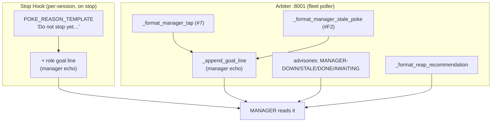

# AUDIT: Manager-facing text injected by the Arbiter + Heartbeat Stop Hook

**Task**: 4e8ccd3d · **Auditor**: Tiberius 👑 · **Date**: 2026-06-29
**Why**: Some managers are *doing the work themselves* instead of tasking workers (MANAGE-not-BUILD violation). Rick + Mr Radio will revise the wording; this is the complete occurrence list (file:line + current text) so nothing is missed.
**Scope**: every string a MANAGER-role session can read from (a) the Heartbeat Stop Hook self-poke and (b) the `:8001` Arbiter pokes/advisories. Read-only audit — no language changed here.

---

## 0. How the language reaches a manager (the two surfaces)

Both surfaces **append the same role-goal echo** (`heartbeat manager goal line`), so that one line is the single highest-leverage edit. The per-surface bodies are where role-blind "do the work" phrasing can creep in.

---

## 1. THE ROLE-GOAL ECHO (single source, appended to BOTH surfaces) ⭐ highest leverage

Runtime config (retunable live, no redeploy). Canonical human source: `planning-is-prompting/workflow/role-goals.md`.

| # | File:line | Current text |
|---|-----------|--------------|
| 1.1 | `src/conf/lupin-app.ini:552` (`heartbeat manager goal line`) | "Your goal: drive your board + your workers' tasks to verified completion (receipts, not claims), then help peer managers with unowned work; **manage don't build**; when all clear, report and prepare for re-spin." |
| 1.2 | `src/conf/lupin-app.ini:553` (`heartbeat worker goal line`) | "Your goal: finish your assigned tasks, marking each done in the store with a receipt; escalate blockers, stay in your lane; empty list → signal ready-for-respin." |
| 1.3 | `src/conf/lupin-app.ini:554` (`heartbeat role-agnostic goal line`) | "Your goal: finish your owed work to verified completion with receipts; escalate blockers rather than retrying silently; when nothing is owed, declare it." |
| 1.4 | `src/conf/lupin-app-splainer.ini:725-727` | Splainer entries for the three keys above (must update in lockstep per the config mandate). |
| 1.5 | `$PLANNING_IS_PROMPTING_ROOT/workflow/role-goals.md:15` (canonical Manager goal) | "**Drive all work owned by you and your workers to verified completion.** … Sequence and assign the work, hold the green-and-reviewed gate, and keep idle workers busy. **Manage, never build.** …" |
| 1.6 | `role-goals.md:51` (Manager **poke echo** — the verbatim source of 1.1) | "*Your goal: drive your board + your workers' tasks to verified completion (receipts, not claims), then help peer managers with unowned work; manage don't build; when all clear, report and prepare for re-spin.*" |

> **Note**: `manage don't build` already exists in the manager echo (1.1) but sits at the **tail**. Candidate: front-load / strengthen it ("**Task a worker — do NOT build it yourself**").

---

## 2. HEARTBEAT STOP HOOK (`src/lupin_cli/claude_code/hooks/lib/heartbeat_work_owed.py`)

| # | File:line | Current text | Flag |
|---|-----------|--------------|------|
| 2.1 | `:96` `POKE_PROMPT_SENTINEL` | "Do not stop yet — you stopped with work owed" | — |
| 2.2 | `:104-112` `POKE_REASON_TEMPLATE` | "…Pick one and act before you stop:\n**1. Owe work? Resume and finish it now.**\n2. Blocked on someone? DM them… declare a fresh hold…\n3. Truly nothing to do? Declare it — write a hold with work_owed: false." | ⚠️ **CULPRIT**: step 1 is role-blind — a MANAGER reads "Resume and finish it now" as *do the work myself*. Needs a manager fork: "delegate/assign it to a worker; do not build it yourself." |
| 2.3 | `:482-483` (`outstanding_delegation` specific) | "{N} live worker(s) still out" | — (good — implies delegation exists) |
| 2.4 | `:484-485` (`needs_verification`) | "worker-verification overdue — look in on your workers (stamp last_looked_in_on_workers_ts)" | ✓ delegation-positive |
| 2.5 | `:486` (`spinup_nudge`, Face A) | "big backlog, idle crew capacity — consider spinning up a crew of your own accord (stamp last_spinup_check_ts)" | ✓ delegation-positive |
| 2.6 | `:463-487` (other specifics) | todo_in_progress / todo_unstarted ("N …TODO item(s) you own"), pending_decision, unanswered_inbound_question, outstanding_user_gate, surface_operator_gates | ⚠️ "…you own" + the generic step-1 framing can read as self-build for a manager. |
| 2.7 | `:528+` `build_poke_reason` | fills 2.2 with the specifics, then appends the role goal line (§1.1). | — (the join point) |

> The Stop-hook self-poke is where the splainer notes managers normally are NOT — they're usually poked by the arbiter. But §2.2 step-1 is the most role-blind "do it now" string in the system.

---

## 3. ARBITER (`src/cosa/agents/heartbeat_arbiter/arbiter_job.py`)

| # | File:line | Current text | Flag |
|---|-----------|--------------|------|
| 3.1 | `:2886-2899` `_append_goal_line` | appends §1.1 (manager) / §1.2 (worker) to a poke body. | mechanism — the join point for §1. |
| 3.2 | `:2125-2146` `_format_manager_tap` (#7 — the core actionable manager nudge) | "Heartbeat arbiter (advisory — I observe + recommend; you actuate). I observe: … I recommend: **pull a free worker to unblock the stuck, or cajole the blockers.** (Recommendation only — I do not assign.)" | ⚠️ **PRIMARY** manager-action nudge. Says "pull a free worker" but never "do NOT do it yourself." Strongest place to add the explicit MANAGE-not-BUILD directive. |
| 3.3 | `:2901-2911` `_format_poke` (stuck poke) | "Heartbeat arbiter (auto-poke): {who}, you appear STUCK — repeated cap-reached with work owed and no progress. Are you blocked or wedged? Post your status, ask for help, or resume." | ⚠️ "or resume" is role-blind (goal line appended after). |
| 3.4 | `:2994-3005` `_format_manager_stale_poke` (#F2) | "Heartbeat arbiter (manager-staleness poke): {who}, no signal from your session for {age} (threshold {N}s). Are you wedged or idle-dark? Post your status or resume. Rick has been advised." | ⚠️ "or resume" — manager-gated, so a good place to say "tap/assign your crew." |
| 3.5 | `:2913-2922` `_format_reap_recommendation` | "REAP-RECOMMENDATION (advisory — I recommend, you decide; I do NOT reap): session {who} stayed STUCK… Recommend a human/manager reap-and-replace it…" | ✓ delegation-positive (reap+replace, not absorb). |
| 3.6 | `:2636-2643` MANAGER-AWAITING-RICK (#9) | "MANAGER-AWAITING-RICK (advisory, NOT manager-down): {mgr} is correctly BLOCKED on Rick…" | informational. |
| 3.7 | `:2647-2652` MANAGER-DONE (#9) | "MANAGER-DONE (advisory, NOT manager-down): {mgr} owes NO non-terminal work — it appears finished/idle. Consider reaping it (the arbiter never reaps — redline). One-time notice." | informational (to Rick+mgrs). |
| 3.8 | `:2662-2666` MANAGER-DOWN (#9) | "MANAGER-DOWN: {mgr} did not ack the arbiter tap within {N}s … escalating to Rick + active managers + HOLDING (no auto-assign)" | informational. |
| 3.9 | `:3157-3163` MANAGER-AWAITING-RICK (#F2) | "MANAGER-AWAITING-RICK (advisory, NOT manager-stale): {persona} is silent {age} but correctly BLOCKED on Rick…" | informational. |
| 3.10 | `:3171-3176` MANAGER-DONE (#F2) | "MANAGER-DONE (advisory, NOT manager-stale): {persona} is silent {age} and owes NO non-terminal work… Consider reaping it…" | informational. |
| 3.11 | `:3190-3196` MANAGER-STALE (#F2) | "MANAGER-STALE: {persona} silent {age} (last signal {ts}, threshold {N}s) — poking (bounded, ≤{N}/episode); outreach only, no action taken." | informational. |
| 3.12 | `:2180-2185` orphan/unresolved-manager (#8) | "Unresolved manager for attention-needing worker {who} — escalating to Rick + active managers (orphan — any manager could adopt)" | informational. |

---

## 4. ROUTING (`src/cosa/agents/heartbeat_arbiter/arbiter_routing.py`)

Case# → tier table + case docstrings (L43-120). These are **routing comments/labels**, not text injected into a manager's prompt — context only, no manager-facing wording to revise. The injected bodies all live in §2–§3.

---

## 5. The likely culprits (ranked) — for the language pass

1. **§2.2 step-1** (`POKE_REASON_TEMPLATE:104`) — "Owe work? Resume and finish it now." Role-blind; a manager reads it as self-build. **Add a manager fork**: "If you're a manager: assign/delegate it to a worker (spawn one if needed) — do NOT build it yourself."
2. **§3.2** (`_format_manager_tap:2142-2145`) — "pull a free worker… or cajole the blockers." Add the explicit redline: "**Task a worker; never absorb the work yourself.**"
3. **§3.3/§3.4** (stuck poke / manager-stale poke) — "…or resume." Make the manager variant say "tap/assign your crew," not "resume."
4. **§1.1 / §1.6** (manager goal echo) — front-load "manage don't build" → "**Task workers, don't build.**"

All edits are runtime-config (§1) or single f-strings (§2–§3). The role-goal echo (§1) is live-retunable without redeploy; the f-string bodies (§2–§3) require a stop-hook reinstall (§2) / arbiter bounce (§3) to take effect.
