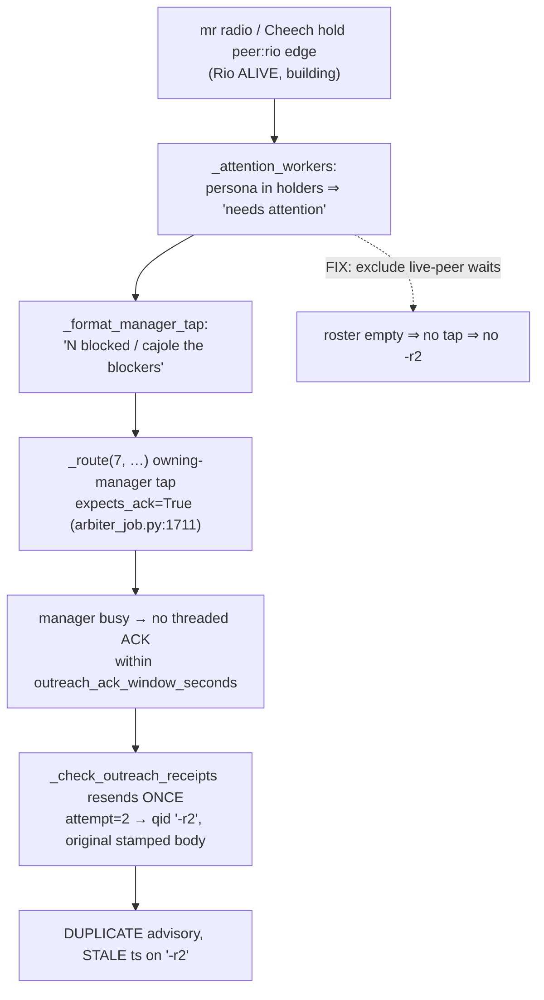

# Arbiter false-'blocked' on live-peer waits + the stale-ts `-r2` echo — Root Cause & Fix

**Date**: 2026-06-30
**Worker**: Sam 🎙️ (session `aa8fe0e4`)
**Manager**: Mr. Radio 🦉 (session `ef70b5f4`)
**Store item**: `bbce7e2f-1c84-4a13-b55e-de7605c41eff` (item_class=bug, P3, accountable_manager=mr radio)
**Lane**: advisory-only / non-blocking — below the mux-switchover MVP
**Status**: code + RED-first tests landed green; candidate-ready for Manager review/commit. `:8001` validation bounce pending Manager coordination.

---

## TL;DR

Two symptoms, one upstream defect.

- **PRIMARY (reported): duplicate advisory with a STALE timestamp on a `-r2` thread-id suffix.** This is **not** a listener-layer dup. The `-r2` is the arbiter's **intentional one-shot resend** of an un-ACK'd manager-bound advisory (`_check_outreach_receipts`). The resend re-sends the *original* `_stamp()`-prefixed body verbatim, so the second delivery carries the original (now-stale) timestamp — by construction, not a fresh tick. The `-rN` suffix is minted at `arbiter_job.py:1592` (`qid = f"{outreach_id}-r{attempt}"`). It is already offline-gated by the 2026-06-24 ping-storm "Fix 3."

- **SECONDARY (the actual root cause): `_attention_workers` classed a legit live-peer wait as 'blocked'.** `_attention_workers` (`arbiter_job.py:2090`) flagged **every** alive session holding a `peer:X` dependency edge as needing a manager's attention — even when X is itself a **live, actively-building** peer. In the captured repro, `mr radio → peer:rio` and `Cheech → peer:rio` while Rio was building. That produced a spurious `_format_manager_tap` advisory ("…1 blocked: mr radio…", "…1 blocked: Cheech…"). The manager-tap is `expects_ack=True` (`arbiter_job.py:1711`); the busy manager didn't ACK, so the receipt poller resent it once as the stale-ts `-r2`.

**Fix the false-positive at the source → the spurious advisory never fires → no `-r2` echo.** One surgical locus, no change to the resend mechanism, no change to deadlock escalation.

---

## The chain (why the duplicate appeared)

The arbiter itself reported `0 stuck/dead · 0 deadlock` for the same poll — corroborating that nothing was actually stalled; the only "blocked" entries were healthy sequencing waits on a live peer.

## Why the `-r2` is left intact (not a defect)

The one-shot resend is the milestone-must-land mechanism for genuinely un-ACK'd **actionable** advisories (a real stuck worker's manager tap must land). It is capped at exactly one resend (`resends` 0→1), already suppressed for confirmed-offline targets (2026-06-24 Fix 3), and the "stale ts" is inherent to re-sending the same stamped body. Weakening it would risk dropping a genuine escalation. The noise came entirely from advisories that **should never have been generated**, so the fix removes the cause, not the (correct) retry.

## The fix (single locus)

`_attention_workers` (`src/cosa/agents/heartbeat_arbiter/arbiter_job.py`). A non-stuck `peer:X` holder is now **excluded** from the attention roster when X is itself alive. NARROW so no real stall is hidden:

- **KEEP** every stuck session (stuck always needs attention, regardless of any peer).
- **KEEP** any holder that sits in a **deadlock cycle** (`graph["cycles"]`) — a mutual stall; the `:1018`/`:1070` store-backed deadlock escalation continues to own cycles byte-identically (Krishna veto honored — untouched).
- **KEEP** any holder whose awaited peer is **NOT alive / absent** from the fleet (a genuine block on a dead or unknown blocker). Fail-safe: an awaited peer absent from the fleet is treated as not-alive → holder kept (never hide a live block).
- **EXCLUDE** only: non-stuck holder, not in a cycle, awaiting a peer that is alive.

`alive_personas` is derived from the same `fleet_view` the function already receives (`view["alive"] is True`), which already encodes the hold-mtime liveness window — so "alive" == "recently active." No new inputs threaded.

## Scope guards honored

- Resend mechanism (`_check_outreach_receipts` / `_emit_dm` `-rN`) — **untouched**.
- `:1018`/`:1070` unfiltered store-backed deadlock escalation — **untouched, byte-identical** (Krishna veto).
- 2026-06-24 ping-storm Fix 3 (offline-suppress resend) — **untouched**.
- No multiplexer/audio files touched (separate crew owns the mux MVP).

## Tests (RED-first, venue :7999, 100% L/B/F on changed code)

Added to `src/tests/unit/test_arbiter_manager_tap.py`:

| Test | Asserts |
|---|---|
| `test_holder_awaiting_live_peer_excluded` | live-peer holder → roster empty (the repro) |
| `test_holder_awaiting_dead_peer_kept` | awaited peer in fleet but `alive=False` → holder KEPT |
| `test_holder_awaiting_absent_peer_kept` | awaited peer absent → KEPT (fail-safe) |
| `test_deadlock_cycle_member_kept_even_with_live_peer` | cycle members KEPT despite live peers |
| `test_stuck_holder_awaiting_live_peer_still_kept` | stuck wins over live-peer exclusion |
| `test_live_peer_waiters_produce_no_tap` | end-to-end: two live-peer waiters → `_tap_managers` fires 0, zero DMs |

Pre-existing tests (`test_stuck_and_holders_in_working_excluded`, `test_tap_includes_blocked_non_stuck_members`, `test_offline_holder_pruned`) still pass — they await an absent "Peer", which the fail-safe keeps.

### Results

| Suite | Result |
|---|---|
| `test_arbiter_manager_tap.py` | 30 passed |
| Full arbiter suite (`test_arbiter_*`, `test_heartbeat_arbiter_*`) | 630 passed |
| Adjacent regression (`dependency_graph`, `heartbeat_hold`, `l1_store_aware`, `redline`) | 200 passed |
| `arbiter_job.py` branch coverage (full arbiter suite) | 99% module; **changed region (`_attention_workers`) 100% L/B/F** |

The 2 remaining module misses (`arbiter_job.py:2939`, `:2958`) are in `_role_goal_suffix`/`_format_poke` — **pre-existing** debt outside this diff (CoSA grandfathering ramp), not introduced here.

## Validation still owed (Manager-gated)

A live `:8001` bounce to confirm the advisory no longer double-delivers on a real fleet poll is **manager authority** — coordinated with Mr. Radio, no bounce without his word.
