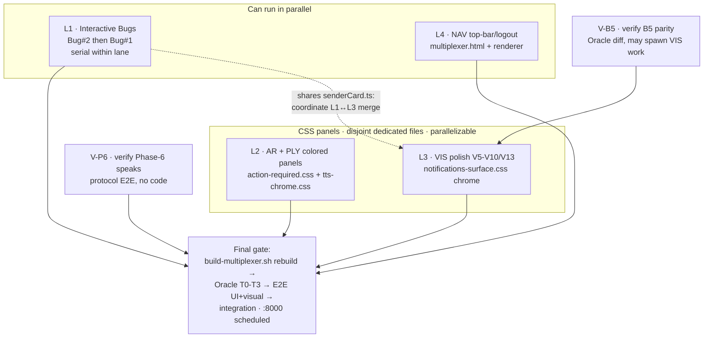

# Mux MVP-Finish Remediation Plan (6 items) — implementation-ready, pending review

> **Authored 2026-06-30 (~20:20 EDT)** by Mr. Radio 🦉 (session `ef70b5f4`, manager).
> **Status:** 📋 DRAFT — awaiting Rick's plan-review process (he asked: "plan the MVP remediation,
> let me know when you're done, we'll start a proper review process for your plan").
> **Branch:** `wip-v0.1.9-2026.06.21-bug-fix-implementation`
> **Parents:** roadmap `2026.06.30-mux-switchover-mvp-finish-roadmap.md` · brief
> `2026.06.25-notifications-to-multiplexer-migration-discrepancies/03-interactive-defects-progress-group-and-reading-pane.md`
> **Discipline:** MANAGE-don't-build (delegate to visible worker sessions; review at commit) · 100% L/B/F
> (lines+branches+functions) · commit-held on standing authority · **push + the flip = Rick's word alone**.

---

## 0. Reconciliation finding (resolved this session — READ FIRST)

The roadmap's "Current state" table lists **Phase-6 ❌ NOT built** and **B5 ❌ not run**. That table is
**STALE**. Ground truth verified from live code + git this session:

| Item | Claimed | Actual |
|---|---|---|
| **Phase-6 (00c) TTS playback** | ❌ NOT built, mux SILENT | ✅ **built + committed-held `2fcc68d0`.** `stores/AudioStore.ts` header: gapless Web-Audio scheduler ported from legacy `playPCMChunk` — *"the state names playing/paused/ended now reflect ACTUAL audible output."* |
| **B5 CSS single-source** | ❌ not run | ✅ **committed-held `393251c5`** ("single-source corner-control + cc-tts-fraction CSS → mux full parity") |

**Consequence: do NOT rebuild Phase-6 or B5.** They convert from BUILD tasks into **VERIFY tasks**
(V-P6, V-B5 below). The roadmap doc pre-dated the two commits landing on the branch.

**Cross-ref (independently confirms B1):** the B5 commit `393251c5` single-sourced the shared
corner-control + cc-tts-fraction CSS into `notifications-surface.css` — direct evidence that **only VIS
rides the shared sheet** (AR/PLY are on their own dedicated files), so the L2→L3 serialization dropped in §2
is unnecessary by construction, not just by the reviewer's file-scope reading.

### Second finding (from live file-tree grounding) — AR/PLY are NOT ground-up builds

The brief scored AR (`#action-required-section`) and PLY (Playing panel) as "❌ NOT built to parity" on
an **element-presence** test (rendered invisible/unstyled when idle). But the machinery already exists:

- **AR:** `render/ActionRequiredRenderer.ts` + `stores/ActionRequiredStore.ts` +
  `templates/actionRequiredInteractive.ts` + `templates/actionRequiredReadOnly.ts` (+ 4 test files).
- **PLY:** `render/TtsChromeRenderer.ts` + `templates/ttsChrome.ts` + `stores/TtsQueueStore.ts` (+ tests).

So **AR and PLY are CSS + empty-state parity work** (colored-panel styling + the `✓ No pending actions` /
`🔇 Nothing in the queue` empty states), **not from-scratch renderers.** This collapses them into the
same visual-parity discipline as VIS. Only **NAV** is a distinct lane — and even it is a **PORT** of legacy
`lupin-nav.js` → mux-TS (reusing the already-linked `.lupin-nav-*` CSS), the same legacy-JS→mux-TS pattern as
the other lanes — **not a from-scratch build.**

---

## 1. Scope — what this plan covers

**6 remediation items** (roadmap + brief) **+ 2 verifications** (from §0):

| Lane | Item | Class | Source refs |
|---|---|---|---|
| L1 | **Bug #2** Reading-pane `URIError` | TS fix (localized) | brief §Bug #2 |
| L1 | **Bug #1** Progress-group head 176× | TS fix (localized) | brief §Bug #1 |
| L2 | **AR** Action-Required panel retune + empty state | CSS retune amber→blue + new empty-state renderer logic | brief V3 / roadmap AR |
| L2 | **PLY** Playing colored panel + empty state | tts-chrome.css + new empty-state renderer logic | brief V4 / roadmap PLY |
| L3 | **VIS** visual polish (V5–V10, V13) | CSS/template chrome | brief §5 |
| L4 | **NAV** top nav/logout bar port | port lupin-nav.js → mux-TS (reuse .lupin-nav-* CSS) | roadmap Phase 2.5 |
| V-P6 | **Verify** committed Phase-6 audibly speaks | protocol E2E (verify-only) | roadmap Phase-1 verification |
| V-B5 | **Verify** committed B5 CSS at parity | Oracle T2/T3 diff (verify-only) | roadmap Phase-2 |

**Explicitly OUT of scope** (post-MVP, per roadmap): Phase-5 remaining 7 accordions (plans 02–11);
`d1bdb7ca` F0-d speak-initiation (post-flip refinement); B3 filter-axis reframe (post-flip). The **flip
itself** (`legacy notifications redirect enabled=True`, `lupin-app.ini:883`) stays gated on all lanes green
+ Rick's visual sign-off + Rick's word.

---

## 2. Worker-lane decomposition + merge order

Manage-don't-build: each lane = one visible worker session (`spawn_sessions`, never Workflow/Task
subagents). I review adversarially at commit, verify findings against live code, commit-held.

**Convergence rationale:**
- **Bug #1 + Bug #2 share `templates/notificationItem.ts`** (Bug#2 writer `:196`; Bug#1 gate `:54/:85-95`) →
  **same lane, serial** (Bug#2 first per brief order — smallest, unblocks horizontal-layout verify).
- **AR, PLY, VIS edit DISJOINT dedicated CSS files** — AR → `multiplexer/action-required.css`, PLY →
  `multiplexer/tts-chrome.css`, and only VIS → the single-sourced `notifications-surface.css`. That shared
  sheet's own scope note (`:47-55`) INTENTIONALLY excludes action-required (class namespaces don't overlap);
  PLY is likewise its own sheet. Because the three touch **non-overlapping files, there is no cross-lane CSS
  cascade-order conflict → L2 and L3 are PARALLELIZABLE and the forced L2→L3 merge ordering is DROPPED.**
  (Whether to further split AR/PLY into their own lanes vs the current L2 bundle is OQ-2, deferred.)
- **TS-template overlap carve-out (L1 ↔ L3 share `senderCard.ts`):** the disjoint-file parallelization above
  is **CSS-only** — it does NOT extend to TS templates. Bug#1's `isGroupHead` plumbing (L1) threads through
  `senderCard.ts` `RenderOptions` (`:25`, the 4-hop chain, ± `dateAccordion.ts` / `notificationItem.ts`), and
  **V10 (L3 VIS) also edits `senderCard.ts`** (CC-card header) → **L1 ∩ L3 share `senderCard.ts`.**
  Requirement: either a **within-file non-overlap guarantee** (L1 edits the opts-thread/`RenderOptions`
  region, L3 the header-render region → different regions, auto-mergeable) OR **explicit L1↔L3 merge-order
  coordination** if the regions touch. Do NOT overclaim "fully disjoint" for TS. **Objective gate (E4):**
  after BOTH L1 and L3 merge, `tsc` clean + `c8 --100` on `senderCard.ts` — a green post-merge type-check +
  coverage on the shared file is the machine-checkable proof the two edits composed without conflict (not a
  manual eyeball).
- **NAV is CSS/markup-independent** (`multiplexer.html` + new renderer + already-linked `lupin-nav.css`) →
  parallel with L1.
- **V-P6 is verify-only** (no code) → runs anytime on :7999.
- **V-B5** feeds L3: if the Oracle diff shows residual B5 drift, it becomes VIS work-items.

---

## 3. Per-lane detail

### L1 — Interactive Bugs (Bug #2 → Bug #1, serial)

**Bug #2 — Reading-pane `URIError` (do FIRST).**
- **Root cause (encode/decode asymmetry):** writer `templates/notificationItem.ts:196` stores
  `data-abstract` **raw**; reader `render/ReadingPaneRenderer.ts:428` calls `decodeURIComponent` on it.
  Any bare `%` in prose ("100% L/B/F") throws `URIError`; ~10% of clicks fail silently.
- **Fix (A, preferred — mux-internal write/read symmetry, NOT legacy-parity):** drop the decode — read
  `data-abstract` **raw** in `handleDocumentClick`. This is correct because it matches the **mux's own raw
  write** (the writer stores the attribute raw via `setAttribute`, no encode) — a within-mux symmetry
  argument, not a legacy match. **Caution — do NOT "match legacy" here:** legacy ENCODES *both* sides
  (`notifications.js` write `:7230+` / read `:10022`), so "matching legacy" would mean ADDING
  `encodeURIComponent` to BOTH the mux writer AND reader — the exact **opposite** of Fix A. Do not do that;
  the raw/raw symmetry is the intended end-state. Keep BOTH the read side (`:428`) and the second-click
  toggle compare (`:429-431`) on the same raw string.
- **Tests (100% L/B/F) — `EXECUTOR: AI` (:7999):** extend `render/reading_pane_renderer.test.ts` — indicator
  with `data-abstract="100% done"` → delegated click → no throw, pane opens, body shows abstract, 2nd click
  toggles closed. `c8 --100` (lines+branches+functions) on touched files; `tsc` clean.
- **Unblocks — `EXECUTOR: AI` (:8000-scheduled):** the horizontal-layout E2E (2/3+1/3 split) that couldn't
  run because the pane crashed. (`c8 --100` does NOT apply to the E2E layer per the coverage policy — see §4.)

**Bug #1 — Progress-group head rendered 176× instead of 1×.**
- **Root cause:** `templates/notificationItem.ts:54` sets `inProgressGrp` = "belongs to a progress group?"
  — true for EVERY member; `:85-95` renders the head gated only on that. No "am-I-the-head?" predicate, so
  all ~176 members render a head.
- **Data model already supports the fix:** `NotificationsListRenderer.ts:689` `buildHistoryFragment()`
  filters `progress_group_id === id && id_hash !== headIdHash` (all-members-minus-head) — one-head-many is
  the intended shape.
- **Fix — ONE head-Set drives a pre-filter + a gate (single mechanism):**
  **(1) Elect the head** once per `group_id` at the full-list source `NotificationsListRenderer.ts:691`
  (NOT in `templates/dateAccordion.ts`: a per-date slice would elect MULTIPLE heads for any group spanning a
  date boundary — the **cross-date multi-head hazard**). Election is **deterministic per `group_id`**:
  `head = the first-arrived member in full-list order` (earliest / lowest-index); build **one head-Set of
  `id_hash`es** and mark the elected head. `buildHistoryFragment()` then **CONSUMES** this render-elected
  head — it reads the marked head at `:690` (the `id_hash !== headIdHash` filter cited above), so the
  flat-row head and the history-fragment exclusion are the same head **BY CONSTRUCTION**, not a second
  election or lookup.
  **(2) Pre-filter — do NOT return null:** `keyedListMerge.create` is typed `(entry) => Element`
  (`render/dom.ts:71`) and CANNOT return `null`, so non-head progress-group members are **dropped from the
  entries array BEFORE `keyedListMerge`**, never suppressed inside the create-callback. They still appear
  only via `buildHistoryFragment`.
  **(3) Thread the head-Set through the opts (4-hop):** the same head-Set flows across the 3 `RenderOptions`
  interfaces — `NotificationsListRenderer` → `dateAccordion` (`:17`) → `senderCard` (`:25`) →
  `notificationItem` (`:23`) — feeding BOTH the (2) pre-filter AND the head-block gate (single mechanism).
  Gate the head block on `inProgressGrp && isGroupHead`, where `isGroupHead = headSet.has( id_hash )`;
  non-head members render **no flat row** because (2) already removed them.
- **Tests (100% L/B/F) — `EXECUTOR: AI` (:7999):** extend `render/templates_notification_item.test.ts` +
  `render/notifications_list_renderer.test.ts` — assert exactly **one** `.progress-group-head` per group
  across a multi-member group; non-head members render **zero** flat rows (pre-filtered out; appear only in
  `buildHistoryFragment`); **cross-date-span fixture** — a progress group whose members straddle a date
  boundary elects **exactly ONE** head (not one-per-date), guarding the cross-date multi-head hazard.
  `c8 --100` (lines+branches+functions) on touched files; `tsc` clean.
- **Oracle assertion — `EXECUTOR: AI` (:8000-scheduled):** head-count converges **176→1** (Bug#1's headline
  empirical proof). (`c8 --100` does NOT apply to the Oracle layer per the coverage policy — see §4.)

### L2 — AR + PLY colored panels (CSS retune + new empty-state logic; NOT ground-up)

- **AR (retune, NOT build the accordion):** the renderer/store/templates AND the blue/green/gray panel
  state-rules already exist in the dedicated `multiplexer/action-required.css`; the section base currently
  renders **amber**. Work = **retune amber→blue** to match legacy `notifications.html:562-588` (the
  full-width colored accordion) + **add the `✓ No pending actions` empty state** (`#action-required-empty`).
  The empty state is **NOT merely a template branch**: it is **new `count === 0` renderer logic + a template
  + CSS**, zero prior art.
- **AR empty-state ownership (RESOLVED — single-owner by construction):** the AR mount is single-owner via
  the existing `phase6bOwner` flag (`ActionRequiredRenderer.ts:104`; Phase-5 read-only bails at `:429`), so
  the two AR paths are **mutually exclusive** — never both painting. Concrete owner-branches:
  - **Phase-6b mounted** → paint the empty-state from the `items.length === 0` branch in `renderAll()`
    (`:135`).
  - **Phase-6b NOT mounted** → Phase-5 read-only paints it **after the `:429` early-return**.
  - **Unmount edge (boundary owner):** when Phase-6b **unmounts at count 0**, Phase-5 will not repaint until
    the next AR event — so the **outgoing Phase-6b path owns painting `#action-required-empty` on unmount**
    (it must render the empty-state as it tears down, not leave a blank panel).
  - **Anti-drift (design fold):** BOTH owner-branches call **ONE shared `renderActionRequiredEmpty()`
    helper**, so the empty-state markup cannot diverge between paths.
- **PLY:** `TtsChromeRenderer.ts` + `ttsChrome.ts` currently render a bare gray 76px box; PLY styling lives
  in the dedicated `multiplexer/tts-chrome.css` (disjoint from `notifications-surface.css`). Restore parity
  with legacy `notifications.html:589+`: the **green** `🔊 Playing: N` colored accordion + ⏸/▶ + the
  `🔇 Nothing in the queue` empty state. **PLY empty-state is STATE-driven, NOT count-driven:** it renders
  when `audio.state() === idle` — the `renderNow()` chrome reads `audio.state()` / `burstLength()`, **not**
  `items.length === 0` (the `count === 0` framing is AR-only). **Drop `TtsQueueStore`** from the PLY
  file-set — the chrome does not read it (vestigial). Work = template + CSS + the idle-state predicate wiring.
- **Tests (100% L/B/F) — `EXECUTOR: AI` (:7999):** extend existing `render/action_required_renderer.test.ts`,
  `templates_action_required_read_only.test.ts`, `render/tts_chrome_renderer.test.ts`,
  `templates_tts_chrome.test.ts` — assert colored-panel class present + empty-state markup.
  **AR:** the shared `renderActionRequiredEmpty()` helper is called from BOTH owner-branches — Phase-6b
  `renderAll():135` `items.length === 0` AND Phase-5 post-`:429` — plus the **unmount-at-0 edge** (Phase-6b
  tear-down paints `#action-required-empty`); **`c8 --100` (lines+branches+functions) must cover BOTH owner
  branches**; `tsc` clean.
  **PLY:** the `🔇 Nothing in the queue` empty-state renders on `audio.state() === idle` (state predicate,
  not `items.length`; no `TtsQueueStore` dependency). `audio.state()` is a **4-way switch — the test MUST
  exercise ALL FOUR arms (`idle` / `ended` / `playing` / `paused`)** so 100% BRANCH coverage is real, not
  just the `idle` arm; `c8 --100` (lines+branches+functions) + `tsc` clean.
  **Oracle — `EXECUTOR: AI` (:8000-scheduled):** Tier-2/3 geometry diff vs legacy golden for both panels
  (`c8 --100` does NOT apply to the Oracle layer per coverage policy — see §4).

### L3 — VIS visual polish (V5–V10, V13)

**MOST** rows are "present but renders as raw scaffolding" — spacing/alignment/missing-chrome CSS+template
with no structural gap — but **NOT all**: **V5 needs new header CSS** (its 6 header classes have zero rules
repo-wide), **V9 is a PORT** of legacy's strip-icon sub-badge/indicator system (OQ-6 RESOLVED — Rick: BUILD;
legacy renders it), and **V10(b)'s "topic" is DEFERRED post-flip** (OQ-7 — Rick's product choice). Each is
flagged per-row below. Every row names its dedicated mux CSS file (VIS edits stay off the shared
`notifications-surface.css` — confirms L2/L3 parallel). Drive each row green vs a fresh Layout-Parity-Oracle
Tier-2/3 geometry diff:
- **V5 (NEW header CSS, not spacing polish):** the 6 Notifications-header cluster classes have **zero CSS
  rules repo-wide** — which is WHY it renders cramped/unstyled (`cramped 🔔 Notifications 3662History▾Clear
  all` → spaced). Work = **author new, bounded, mux-only header CSS** driving `NotificationsHeaderRenderer.ts`.
  CSS: a dedicated mux header sheet (new `multiplexer/notifications-header.css`) — **kept OFF the shared
  `notifications-surface.css`** (no cascade collision).
- **V6** TTS-fraction pill mislocated → inline in header row — `templates/ttsPreviewSlider.ts` /
  `TtsPreviewSliderRenderer.ts` placement; CSS: `multiplexer/tts-preview-slider.css`.
- **V7** Broadcast card ▼ orphaned on its own line → inline-right — `templates/broadcastCard.ts`; CSS:
  `multiplexer/broadcast.css`.
- **V9 (BUILD — PORT legacy's strip-icon sub-badge system; OQ-6 RESOLVED):** Rick decided **BUILD it**, and
  a ground-truth grep of the legacy client confirms legacy **already renders** strip-icon sub-badges /
  indicators on session-strip avatars — `_setManagerBadgeOnStripIcon` (corner badge) + `_setStripIconPersonaColor`
  (persona color) + the `.cc-strip-icon[data-conv-mode][data-tts-active]::before` voice-state indicator
  (`notifications.js:5087-5106`, `:10930-10973`). So V9 is a **PORT** of legacy's impl into
  `SessionStripRenderer.ts` / `templates/sessionStripIcon.ts` + CSS `multiplexer/session-strip.css`, driven by
  `StripSession.active` + `voice_persona.borrowed`. (Corrects R1's "net-new / not-a-parity-gap" framing — the
  reviewers' client-only grep missed the legacy renderer.)
- **V10 (SPLIT — retune + topic-source OQ):** CC-session card header is cramped/redundant. **(a)
  style-retune only** — the orange persona-name badge AND the `N new` pill **ALREADY EXIST**; retune header
  spacing + drop the redundant `#id` (do NOT "add" the badge/pill — they are present). `templates/senderCard.ts`;
  CSS spans **two** dedicated sheets: `multiplexer/sender-card-recorder.css` + `multiplexer/notifications-list.css`.
  **(b) topic — DEFERRED post-flip (OQ-7 — Rick's product choice):** Rick **defers** V10(b) (considering
  retiring the topic entirely). **Factual correction:** a server-side session-topic source **DOES exist** —
  the `set_session_topic` mechanism + the `session_topic` notification path (`routers/notifications.py:610`)
  surface a session topic; the earlier "neither exists server-side" was a client-only-grep error. So the
  deferral is a **product decision, NOT a missing-source blocker.** (`.sender-session-name` remains the
  separate "Click to rename" feature, also out of scope.)
- **V13** Section-toolbar floats overlapping top-left corner → reposition — `SectionToolbarRenderer.ts` /
  `templates/sectionToolbar.ts`; CSS: `multiplexer/section-toolbar.css`.
- **Tests (100% L/B/F) — `EXECUTOR: AI` (:7999):** extend the per-row test target(s); `c8 --100`
  (lines+branches+functions) + `tsc` clean:
  - **V5** `render/notifications_header_renderer.test.ts` (+ `render/notifications_header_region_placement.test.ts`).
  - **V6** `render/tts_preview_slider_renderer.test.ts` + `render/templates_tts_preview_slider.test.ts`.
  - **V7** `render/broadcast_card_renderer.test.ts` + `render/templates_broadcast_card.test.ts`.
  - **V9 (OQ-6 RESOLVED — BUILD, unconditional):** `render/session_strip_renderer.test.ts` +
    `render/templates_session_strip_icon.test.ts` — cover **ALL mapping arms incl. the negative no-icon case**
    (`borrowed` → 🔉, `!active` → 🔉, neither → **NO icon**). Now a **full gating verification** (no longer
    conditional).
  - **V10(a)** `render/sender_card_recorder_renderer.test.ts` + `render/templates_sender_card.test.ts` —
    style-retune assertions (badge/pill present, redundant `#id` dropped).
  - **V10(b) topic (OQ-7 RESOLVED — DEFERRED post-flip):** `render/templates_sender_card.test.ts` — Rick
    deferred V10(b) (product choice; the server-side session-topic source DOES exist, so this is a deferral,
    not a blocker). This row carries **NO gating verification this MVP**; revisit post-flip if the topic is
    kept (then cover topic-present AND topic-absent branches).
  - **V13** `render/section_toolbar_renderer.test.ts`.
- **Oracle Tier-2/3 per row — `EXECUTOR: AI` (:8000-scheduled)** (`c8 --100` does NOT apply to the Oracle
  layer per coverage policy — see §4). V5 / V6 / V7 / **V9** / V10(a) / V13 are unconditional (V9 now BUILD
  per OQ-6); **V10(b) is DEFERRED** (OQ-7 — Rick's product choice) → no Oracle assertion this MVP.
- **OC-1 (deferral safety):** V9 (OQ-6) is now **BUILT** → full gating verification. **V10(b) (OQ-7) is
  DEFERRED post-flip** → it carries **NO gating verification** this MVP — the 100% gate never blocks on
  deferred product work.

### L4 — NAV top nav/logout bar (PORT of legacy `lupin-nav.js` → mux-TS)

- **Gap:** `multiplexer.html:8` links `lupin-nav.css` but renders **zero** nav markup (no `<nav>`, no
  logout, no profile — DOM-confirmed). Legacy renders `Lupin · Home · Notifications · Profile · <email> ·
  Logout` (logout button `notifications.html:1102`, `window.notificationsUI.logout()`).
- **Fix — PORT `lupin-nav.js` (206L) to mux-TS, NOT a from-scratch build.** Legacy `lupin-nav.js` is a
  complete renderer: **port** its `NAV_ITEMS` config (`:17-19`) + `buildNav()` (`:98`) + logout SVG icon
  (`:42`) + **the existing logout button + click handler (`:147`, `:173-175`)** + active-page/auth-gating
  into a small `NavBarRenderer.ts`. **Reuse the `.lupin-nav-*` class contract verbatim** from the
  already-linked `lupin-nav.css` (210L, `multiplexer.html:8`) — styling is free **except the one integration
  caveat below.**
- **Logout MUST clear the PERSISTED token (F-K-D1 — load-bearing auth bug):** wire logout-click →
  **`StorageService.clearTokens()` (`:144`)** → redirect to `authGuard` `LOGIN_PATH` (`:20`). ⚠️ Do **NOT**
  use `AuthManager.clearToken()` (`:106`) — it nulls only the **in-memory** context and does **not** clear
  the **persisted** token (`StorageService.setTokens:140`), so `clearToken()` + redirect leaves the user
  **STILL LOGGED IN** (authGuard / API / WS re-read the persisted token). The legacy logout button + handler
  (`:147`, `:173-175`) is the **port/reuse target** (María-verified); the **ONLY genuinely-new code** is
  wiring an **exported `logout()` mux-side** — none exists in the mux yet.
- **Email — valid source, null-guarded (F-K-D2):** **email** = `jwt.ts` `decodeJwtClaims().email` (`:41`);
  guard the null case (missing/expired claim) so the nav renders without the email rather than throwing.
- **Mount + re-render on auth-state (F-K-D4):** name the nav mount point in `multiplexer.html` and
  **re-render the nav on auth-state change** — the SPA does **not** reload on login, so a one-shot static
  render would show a stale/absent email; the nav must re-render when auth state transitions.
- **ONE integration caveat — fixed-nav body padding (F-K-D3):** `.lupin-nav-*` styling is free EXCEPT that
  legacy sets `body { padding-top: 56px }` for its **fixed** nav (`:161`); the mux page-frame/scroll may
  collide. This is the one spot that **may need mux-specific CSS** — **verified OBJECTIVELY by the E2E visual
  snapshot** (D4: the already-in-scope Playwright visual regression catches a fixed-nav / body-padding
  collision as a geometry diff — NOT a subjective eyeball); add a scoped override only if the snapshot shows a
  collision. Same legacy-JS→mux-TS pattern as every other lane.
- **Decision (OQ-1) — RESOLVED: KEEP "Notifications" (Rick, 2026-06-30):** the nav item stays labeled
  **"Notifications"** (NOT relabeled "Multiplexer", not dropped). The ported `NAV_ITEMS` config keeps the
  existing label verbatim — no label change needed.
- **Tests (100% L/B/F):** **`EXECUTOR: AI` (:7999)** — new `render/nav_bar_renderer.test.ts` enumerating the
  **3 branchy assertions** (OD-1), each with an **outcome-based** PASS criterion (NOT a "wired" check):
  - **Logout OUTCOME (D1 — ownership-critical):** after logout-click, the **PERSISTED tokens are GONE** —
    assert `StorageService.clearTokens()` (`:144`) was invoked / the StorageService token keys are absent —
    **AND** redirect to `LOGIN_PATH` (`:20`). (A "logout wired" assertion would PASS on the very
    `clearToken`-only bug we just fixed — the assertion MUST be the post-condition, not the wiring.)
  - **Email BOTH arms (D2):** email-present → renders the email; **null/expired token → renders without
    email, no throw** (both branches, not just the present case).
  - **Auth-state TRANSITION (D3):** exercise the **logged-in ↔ logged-out transition** (the SPA does not
    reload) — the nav re-renders on the state change, not a one-shot render.

  `c8 --100` (lines+branches+functions) + `tsc` clean. **`EXECUTOR: AI` (:8000-scheduled)** — E2E UI snapshot
  rebaseline (nav bar shifts every page's top geometry) (`c8 --100` does NOT apply to the E2E layer per
  coverage policy — see §4).
- **Flip-blocking:** once Phase-3 redirects `/app/notifications → /app/multiplexer`, this is the only path
  to logout/profile/home.

### V-P6 — Verify committed Phase-6 audibly speaks (verify-only, no code)

- **Reuse the EXISTING harness — RUN it, do NOT hand-roll WS observation.**
  `test_phase6_tts_playback_protocol_e2e.py` already implements the full `get-speech-elevenlabs` → `/ws/audio`
  drain (Clayton's spec `2026.06.30-phase6-tts-playback-protocol-e2e-plan.md`): it triggers TTS via `POST
  /api/get-speech-elevenlabs {session_id, text}` (Bearer JWT — streams PCM-24000 + `audio_streaming_complete`
  over `/ws/audio`, NOT `/api/push`) and asserts the gapless scheduler engages + pause/resume/stop + completion.
- **EXECUTOR: AI** — run `pytest .../test_phase6_tts_playback_protocol_e2e.py` on **:7999** with the paid
  opt-in `LUPIN_RUN_PHASE6_TTS_E2E=1`; pass = suite green. If it does NOT speak, Phase-6 re-opens as a build lane.
- **:7999 is a BOUNDED EXCEPTION to the ":7999 = no API spend" rule (E3):** normally any paid / API-spend
  E2E routes to :8000. V-P6 is an **explicit, bounded exception** — the harness is **paid-skipped by default**
  behind the `LUPIN_RUN_PHASE6_TTS_E2E=1` opt-in guard, so it makes a real (billed) ElevenLabs call **only**
  on ONE deliberate opt-in run, **not recurring**. That bound is exactly why the single AI-run belongs on
  :7999: routing it into the :8000 scheduled lane would re-fire the ElevenLabs spend on **every** sweep. The
  guard keeps this one-shot verification off the recurring-spend path.

### V-B5 — Verify committed B5 CSS at parity (verify-only; may spawn L3 work)

- **`EXECUTOR: AI` (:8000-scheduled)** — run the Layout-Parity Oracle Tier-2/3
  (`src/tests/e2e_ui/parity_oracle.py` + `parityFixture.ts`) on the B1–B5 surfaces vs fresh legacy golden
  (`c8 --100` does NOT apply to the Oracle layer per coverage policy — see §4). B5 commit claims "full
  parity" but brief §5 V5/V6 still flag the header/TTS-pill as degraded — this verification decides whether
  that's residual B5 drift (→ folds into
  L3 VIS work-items) or already-green.

---

## 4. Verification strategy (all layers; venue-routed)

Per the testing mandate — every applicable pyramid tier, routed by the §TESTING VENUES rubric:

| Layer | What | Venue | Command |
|---|---|---|---|
| Unit / c8 | `c8 --100` (L/B/F) per touched TS file; `tsc` clean; TS suite green | :7999 | `c8 --100 --include '.../multiplexer/**/*.ts'` — EXECUTOR: AI |
| WS smoke | WebSocket connection/auth/event smoke (Phase-6 `AudioStore` rides `/ws/audio`) | :7999 | `run-websocket-smoke-tests.sh` — EXECUTOR: AI (`c8 --100` N/A per coverage policy) |
| Protocol E2E | V-P6 Phase-6 audible-speak (get-speech-elevenlabs → /ws/audio) | :7999 | `pytest test_phase6_tts_playback_protocol_e2e.py` (paid opt-in `LUPIN_RUN_PHASE6_TTS_E2E=1`) — EXECUTOR: AI (`c8 --100` N/A per coverage policy) |
| Oracle | Layout-Parity Tier-0→3 geometry diff vs fresh legacy golden; head-count 176→1; AR/PLY colored-panel + empty states; per-VIS-row | :8000 scheduled | `parity_oracle.py` — EXECUTOR: AI (`c8 --100` N/A per coverage policy) |
| E2E UI + visual | Playwright functional + visual regression; rebaseline goldens (nav/panels/header shift geometry) | :8000 scheduled | `run-e2e-ui-tests.sh --bg` — EXECUTOR: AI (`c8 --100` N/A per coverage policy) |
| Integration | FINAL merge gate — full user workflows across API+DB+auth | :8000 scheduled | `run-integration-tests.sh --bg` — EXECUTOR: AI |

**Mux-build note:** after each lane merges, rebuild `src/scripts/build-multiplexer.sh` and re-run Oracle +
E2E. **No mux rebuild during a live :8000 run** (flips the served manifest mid-flight) — stage builds
between runs. :8000 submissions via `POST /api/test-suite/submit`, self-authorized on a verified-idle
server (list-pending first).

**c8-glob note (coverage integrity):** the `c8 --include` glob MUST be **directory-wide** —
`--include '.../multiplexer/**/*.ts'` — so every **new** file (e.g. `NavBarRenderer.ts` from L4) is
auto-covered **BY CONSTRUCTION**. Do **NOT** enumerate individual files: an explicit file list re-introduces
the exact sweep-lag this warns about — a new file added outside the list is silently omitted and reports a
**false 100%**. The directory-wide glob makes that omission structurally impossible.

---

## 5. Risks

- **Phase-6 autoplay policy:** AudioContext may start suspended without a user gesture — resume-on-first-
  chunk is in the committed code; V-P6 must confirm it engages.
- **CSS cascade order** — only VIS touches the single-sourced `notifications-surface.css`; AR/PLY edit
  disjoint dedicated sheets (`action-required.css`, `tts-chrome.css`), so there is **no cross-lane
  cascade-order conflict** (the forced L2→L3 ordering is dropped per §2). A `grep-no-residual` AC still
  guards any within-VIS double-definition on the shared sheet.
- **E2E snapshot churn:** NAV + colored panels + header polish shift top/section geometry → deliberate
  golden rebaseline required (Rick's visual sign-off is the flip gate; rebaseline runs are self-authorized).
- **Visual-feel is EXECUTOR:HUMAN:** the final "looks polished, not scaffolding" judgment is Rick's Chrome
  subjective pass (the one tier the Oracle defers) — named explicitly, not silently deferred.

---

## 6. Open questions for the review process

- **OQ-1 (NAV) — RESOLVED: KEEP "Notifications" (Rick, 2026-06-30).** The nav item stays "Notifications" (not relabeled/dropped) — ported `NAV_ITEMS` keeps the label verbatim.
- **OQ-2 (lanes):** the L2→L3 CSS merge-order sub-question is **RESOLVED by B1** — AR/PLY/VIS edit disjoint
  dedicated sheets → parallelizable, forced ordering dropped. Still open: whether to split AR/PLY into their
  own lanes (vs the current L2 = AR+PLY bundle) — deferred to Stage-2/execution.
- **OQ-3 (B5):** if V-B5 shows residual drift, fold into L3 or open a dedicated B5-redo lane?
- **OQ-4 (freeze):** client freeze must be lifted before any lane edits client code — confirm at review exit.
- **OQ-5 (A/B harness):** roadmap's automated Playwright A/B side-by-side report — build it as part of L3's
  Oracle work, or as a separate deliverable for Rick's subjective pass?
- **OQ-6 (V9 build-vs-drop) — RESOLVED: BUILD (Rick, 2026-06-30).** Factual correction: legacy **does**
  render the strip-icon sub-badge/indicator (`notifications.js:5087-5106`, `:10930-10973`), so V9 is a
  **PORT** of legacy's impl (driven by `StripSession.active` + `voice_persona.borrowed`), not net-new — the
  earlier "zero prior art / not a parity gap" was a client-only-grep error.
- **OQ-7 (V10 topic source) — RESOLVED: DEFERRED post-flip (Rick, 2026-06-30).** Rick defers V10(b)
  (considering retiring the topic). Factual correction: a server-side session-topic source **exists** (the
  `set_session_topic` mechanism + `session_topic` notification path, `routers/notifications.py:610`) — the
  deferral is a product choice, not a missing-source blocker.

---

## 7. Execution + tracking (how I'll manage it post-approval)

1. On approval + freeze-lift: spawn 4 visible worker sessions (one per lane), seed each with a scoped brief
   + this plan + the relevant source refs. NEVER Workflow/Task subagents.
2. Merge lanes as they land — **CSS lanes L2/L3 parallelizable** (disjoint dedicated sheets; forced L2→L3
   dropped per §2); L1/L4 parallel too — **EXCEPT the L1↔L3 `senderCard.ts` TS overlap** (§2 carve-out):
   guarantee within-file non-overlap OR coordinate the L1↔L3 merge order. Review adversarially at each lane's
   commit, verify against live code,
   commit-held (selective-stage; `git diff --cached --stat` first; never `git add -A`).
3. Run V-P6 (me, :7999) early; schedule Oracle/E2E/integration on :8000 as lanes land.
4. Execution logs land as `90-9N-*.md` beside this plan; status to TODO.md + history.md at session-end.
5. When all lanes green + Oracle/E2E/integration pass: notify Rick for his subjective visual sign-off →
   then the flip + push are **his word**. Mr. Radio executes push + flip + :8001 redeploy on that word.
