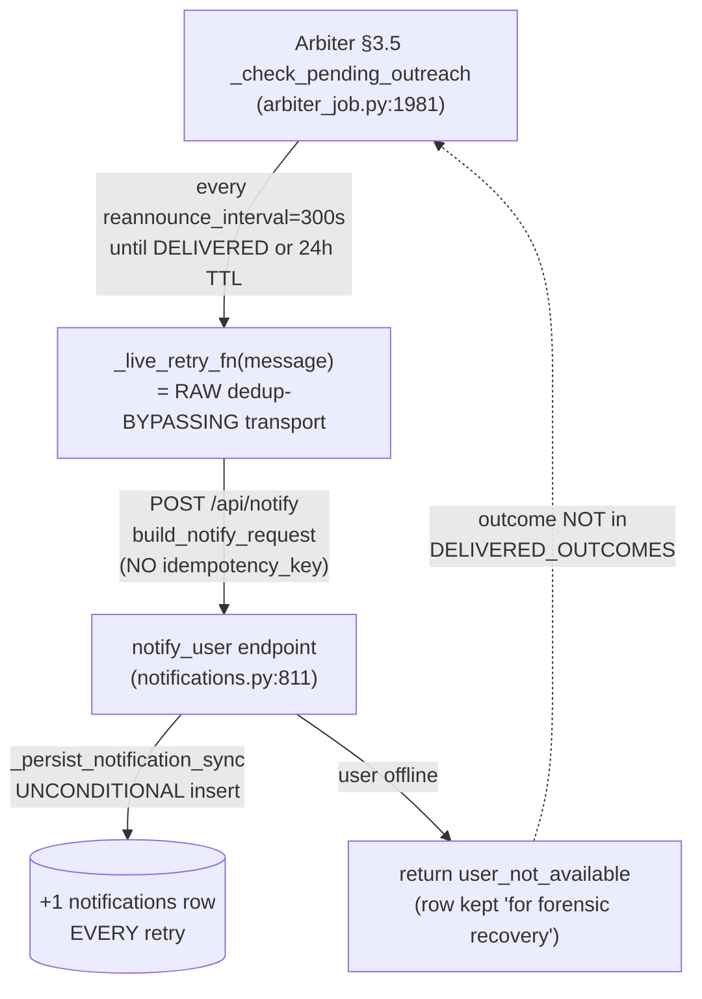

# Arbiter Re-announce Notification Flood — Fix Design

**Date**: 2026-07-06
**Author**: Tiffany 💍 (session fb313f11, Tiberius crew a6553139)
**Store bug**: `e1bbe011-2625-48b5-82ea-b153f8e27eb8` (P1)
**Status**: design ratified → implementing

---

## 1. Symptom

Rick returned online 2026-07-06 21:23 EDT to **3000+** "Operator-gate digest"
notifications flooding his UI. Postgres `lupin_db_dev.notifications` held **4,786**
arbiter-sender rows (1,634 Operator-gate digest + 1,684 MANAGER-DONE + 567
WHOLE-FLEET-STALL — the same pathology across three episodes). Per-message counts
declined arithmetically (−6 rows per 30 min) — the tell-tale signature of **one DB
row minted per 5-minute re-announce retry** from each advisory's creation until
Rick reconnected.

## 2. Root cause — three individually "by-design" behaviors compounding

1. **Re-announce-on-return** (`_check_pending_outreach`) retries every pending
   Rick-bound advisory once per `reannounce_interval_seconds`=300 until a
   DELIVERED outcome or 24h TTL. It deliberately uses `live_retry_fn` — the **RAW
   transport** that bypasses the content+window dedup guard (`make_live_notify_fn`)
   — because re-announce *must* re-send the same text. Correct by design.
2. **`/api/notify` persists unconditionally** (`notifications.py:811`,
   `_persist_notification_sync`) even when the delivery outcome is
   `user_not_available` — "DB row remains for forensic recovery." Correct by design.
3. **No durable idempotency**: the arbiter transport (`build_notify_request`) sends
   **no `idempotency_key`**, and even if it did, the endpoint's idempotency cache is
   **in-memory with `_IDEMPOTENCY_TTL`=60s** — *shorter* than the 300s retry cadence,
   so it structurally cannot dedupe re-announce retries.

The intersection: an offline Rick means every retry re-persists a fresh forensic
row. Over a 12h offline window at 300s cadence that is **~144 rows per advisory**,
times every distinct pending advisory = thousands.

## 3. Fix direction & options

The correct invariant: **a re-announce retry should re-attempt LIVE DELIVERY of an
already-persisted notification — it must NOT mint a new forensic row.** The FIRST
escalation persists exactly one forensic row; every subsequent retry is a pure
delivery attempt.

| Option | Mechanism | Verdict |
|---|---|---|
| **(a) `persist` flag** | Add `persist: bool = Query(True)` to `/api/notify`; guard the persist block with `if persist:`. Arbiter re-announce transport sends `persist=false`. | ✅ **CHOSEN** |
| (b) delivery-retry-by-id endpoint | New `/api/notify/retry/{id}` that loads the original row and re-pushes it live without persisting. Ledger must carry `db_notification_id`; first attempt must return + store the id. | ❌ Largest blast radius: new endpoint + ledger schema change + arbiter transport rework. Overkill for a P1 flood-stop. Its one advantage (id-continuity) is a deferrable follow-up. |
| (c) DB-backed idempotency keyed on `outreach_id` | Durable idempotency (TTL ≥ 24h) keyed on the arbiter outreach_id. | ❌ **Fatal**: the endpoint returns the *cached* response on a hit. The first (offline) attempt caches `user_not_available`; every retry for 24h then short-circuits to that cached miss **before the connectivity check**, so the advisory would NEVER deliver when Rick returns — it defeats milestone-must-land. Any variant that only guards the *persist* (not the delivery) collapses into option (a) with a heavier key mechanism. |

### Decision — Option (a), justified

Per the standing "prefer the simplest reversible mechanism" directive:

- **Smallest surface**: one new query param + one `if persist:` guard in the
  endpoint; one `persist` param threaded through `build_notify_request` +
  `make_notify_transport`; two-transport wiring in the (no-cover) arbiter app.
- **Reversible / byte-identical default**: `persist=True` is the default, so every
  existing caller (UI, MCP, all other notify sites) is completely unchanged. Only
  the arbiter re-announce path opts into `persist=false`.
- **Preserves delivery-on-return**: `persist=false` skips *only* the DB insert; the
  connectivity check, live WebSocket push, and `user_not_available`/`queued`
  outcome logic all run exactly as before — so the advisory still lands the moment
  Rick reconnects, and re-announce still terminates on a DELIVERED outcome.
- **Result**: 3000+ rows → **exactly one forensic row per advisory** (minted by the
  first escalation, which keeps `persist=True`).

## 4. Implementation

### 4.1 `src/cosa/rest/routers/notifications.py`
- Add query param `persist: bool = Query(True, description=…)` to `notify_user`.
- In the fire-and-forget branch, wrap the `_persist_notification_sync` block in
  `if persist:` (else leave `db_notification_id = None` and log the skip). All
  downstream logic already tolerates `db_notification_id = None`
  (push_notification falls back to a generated uuid4; the offline/online responses
  are id-agnostic). Response-required mode is out of scope (re-announce is
  fire-and-forget only) and always persists.

### 4.2 `src/lupin_arbiter_app/arbiter_live_notify.py`
- `build_notify_request(..., persist: bool = True)` → add
  `"persist": "true" if persist else "false"` to the urlencoded params (same idiom
  as the existing `suppress_ding` field).
- `make_notify_transport(..., persist: bool = True)` → thread `persist` into the
  `build_notify_request` call inside `transport`.

### 4.3 `src/lupin_arbiter_app/app.py` (`_build_arbiter_outreach_hops`, no-cover IO boundary)
- Build TWO transports: the existing one (`persist=True` default) wraps into
  `live_notify_fn` (first-send, keeps the forensic row); a second
  `make_notify_transport(..., persist=False)` becomes the returned `live_retry_fn`
  (re-announce, no new rows).

## 5. Known minor trade-off (documented, deferred)

On the *delivering* retry (Rick back online, `persist=false`), the live WS frame
carries a fresh uuid4 rather than the original forensic row's id, so the mux
cold-load hydration cannot dedupe it against the hydrated original — a **1-card**
cosmetic possibility, versus the 3000-row flood it eliminates. Carrying the
original id through the retry (option (b)'s benefit) is a clean follow-up if it ever
matters; it is not warranted for this P1.

## 6. Out of scope (Rick-gated)

Cleanup of the existing ~4,786 flood rows is **Rick-gated** and explicitly out of
this fix's scope. A UI/history dedup is a separate follow-up.

## 7. Test plan (100% line/branch/function on touched code)

| Tier | File | Coverage |
|---|---|---|
| Unit (:7999) | `src/tests/unit/test_arbiter_live_notify.py` | `build_notify_request` persist=True/False URL shape; `make_notify_transport` threads persist=false through to the captured URL |
| Unit (:7999) | `src/tests/unit/test_notifications_api.py` | `persist=false` → `user_not_available` AND `NotificationRepository.create_notification` NOT called (the persist-skip branch); existing tests cover the persist=True branch |

Endpoint-level integration verification (a real row is NOT written) is available on
:8000 if a fuller gate is wanted, but the TestClient unit harness already exercises
both branches of the new `if persist:` at :7999.

### 7.1 Delivery-on-return does NOT depend on the skipped DB row (path trace)

The one question a reviewer will (rightly) probe: *does `persist=false` break delivery
when Rick returns online?* No — the `queued` outcome is produced by **Layer 1 (FIFO +
WebSocket), never a DB replay**. Trace of a `persist=false` retry hitting an online Rick
(`notifications.py`, fire-and-forget branch):

1. `persist=false` → the `if persist:` block is skipped → `db_notification_id = None`.
   No PostgreSQL insert. (Layer 2 is bypassed.)
2. `is_connected == True` → control reaches the "User is connected" branch
   (`notifications.py:~931`) → `notification_queue.push_notification( id=db_notification_id=None, … )`.
3. `NotificationItem` tolerates `id=None` by generating a `uuid4` (documented at the
   call site) → the item is pushed to the in-memory `NotificationFifoQueue` → delivered
   over the user's WebSocket. Response `status="queued"`.

So the live delivery is a pure Layer-1 WebSocket push through the FIFO queue — it reads
**nothing** from PostgreSQL. The DB row is forensic/history only (feeds mux cold-load
hydration on a *fresh page load*, not live delivery). `persist=false` therefore removes a
duplicate forensic write with **zero** effect on whether/when the advisory reaches Rick.
The re-announce loop still terminates correctly because it keys on the DELIVERED outcome
(`queued` / `delivered_via_listener`), which Layer 1 returns independently of persistence.

**Corollary (the §5 trade-off, precisely bounded)**: the only observable difference on the
delivering retry is that the live WS frame carries a generated `uuid4` rather than the
first-escalation forensic row's id — a cold-load-dedup miss worth at most one duplicate
card, never a missed delivery.

### 7.2 `persist` is request-scoped, not an INI knob

`persist` is a per-request query param with **no `lupin-app.ini` key** — each caller
decides per call. Only the arbiter's `live_retry_fn` transport sets it (`persist=false`);
every other caller inherits the `True` default (byte-identical). There is deliberately no
config knob: making it a global toggle would risk silencing the forensic row for
first-send escalations too. Documented in `src/docs/notification-api.md` § 5.2a.
