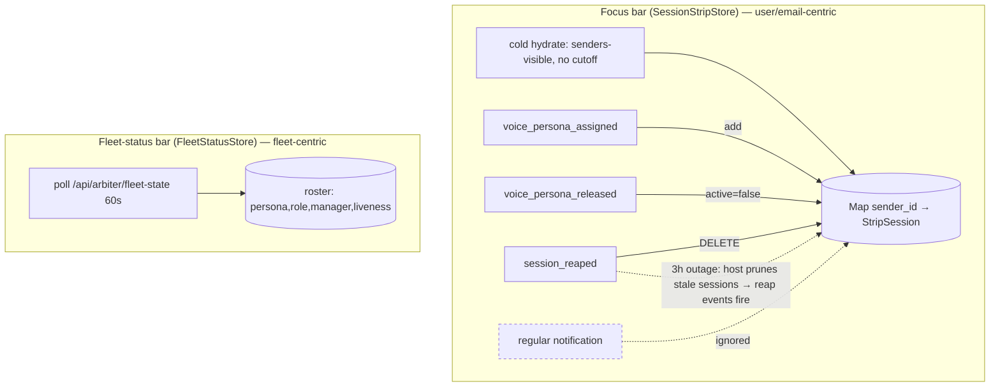

# Focus-Bar Repopulation UX After Long Fleet Silence — Design & Recommendation

**Date**: 2026-07-07
**Author**: Tiffany 💍 (CC session df8ba9c4, author worker)
**Manager / gate**: Mr. Radio 🦉 (session 17e81460)
**Store item**: `5b079890-98fd-4daa-bfcc-0f8e441acb53` (decision, P3, project lupin)
**Upstream triage**: `src/rnd/v0.1.9/2026.07.03-focus-bar-empty-triage.md` (Cheech 🌿, bug `863682e3` → done)
**Status**: GATED — Mr. Radio gate-word 2026-07-07 (DM bad8be07): **BUILD option (2)** eager re-hydrate on reconnect. Conditions (b)–(e) below. Author=Tiffany, reviewer=Mr. Radio; commit HELD for his diff-review APPROVE. Rick residuals (ratify the divergence from the triage's (3)-lead + final UX accept) gate **SHIP, not BUILD**.

## Gate ruling (2026-07-07, Mr. Radio)

**BUILD option (2)**, subject to:
- **(b) mux-only — NO legacy twin.** The live surface is the Chrome-only multiplexer; the legacy
  `notifications.js` strip does NOT get a parallel reconnect re-hydrate. (Recorded per gate condition.)
- **(c)** debounced once-per-reconnect-edge; reuse the idempotent `hydrate()`; **no store/renderer
  surgery** — the new code is a self-contained boot-level subscriber.
- **(d)** 100% L/B/F on new code; unit + WS-smoke on `:7999`; do NOT rebuild mux `dist/` while a
  live `:8000` run is in flight (stage between runs).
- **(e)** commit HELD until Mr. Radio's diff-review APPROVE.

---

## TL;DR

The store row (following the triage) frames the focus bar as "event-sourced from recent
activity, so a long silent window **ages the whole fleet out of it**." **Reading the live
code, that framing is imprecise in a way that matters for the fix.** Neither focus-bar
surface — legacy `notifications.js` **or** the live multiplexer TS stores — has any
time/activity **aging timer**. A strip icon is **only** removed by a discrete
`session_reaped` event (or hidden by the hide-inactive toggle after `voice_persona_released`).
Cold-boot **hydrates from `senders-visible` with NO time cutoff**, which is why a hard-refresh
always refills.

So the ~3h outage did not "age out" the icons — the host-side prune **reaped** genuinely-stale
sessions during the silence (discrete `session_reaped` events), and the mux strip then only
**re-adds** an icon on a **new `voice_persona_assigned`** — it deliberately **ignores regular
notification chatter** (`STRIP_STATE_TYPES` = assigned/released/reaped only). That is the exact
reason the self-heal is *slow* (~15–20 min): icons come back only as sessions re-announce a
persona, not on their first post-resume message.

This correction narrows the design: **option (2) eager re-hydrate fully covers the observed
incident at low cost/risk**, while **option (3) roster-reconcile** buys a structural guarantee
whose marginal coverage over (2) is genuinely narrow — and it carries a real cost the triage
under-counted (the roster carries a persona *name* only, not the icon/color the strip renders;
and it is fleet-centric where the strip is user/email-centric). **Recommendation: ship (2) now;
document (3) as the gated structural upgrade path if divergence ever recurs outside a
reconnect.**

---

## How the focus bar actually works (code-grounded)

Both clients share the SAME data contract; the multiplexer is the live Chrome surface.

### Population (add) paths

| Path | Legacy `notifications.js` | Multiplexer TS |
|---|---|---|
| Cold boot | hydrate from `GET /api/notifications/senders-visible/{email}` — **no `hours` param → server applies NO cutoff** (`notifications.js:14449`) | same fetch → `SessionStripStore.hydrate()` (`boot.ts:483-485`) |
| Live add | `voice_persona_assigned` → `_addStripIcon` | `voice_persona_assigned` → `applyAssignment()` (`SessionStripStore.ts:205`) |

### Removal / hide paths — **the crux**

| Event | Legacy | Multiplexer (`SessionStripStore.ts`) |
|---|---|---|
| `session_reaped` | `_removeStripIcon` — icon **deleted** (`notifications.js:5772`) | `handleReaped` → `sessions.delete()` (`:280`) |
| `voice_persona_released` | persona dropped; `_applyHideInactiveStripFilter` **hides IF toggle ON** (`:5753`) | `handleReleased` → `active=false` (icon stays unless hide-inactive on) (`:269`) |
| silence / inactivity | **none** — no timer | **none** — no timer |

**There is no aging timer on either surface.** `_markStripIconActivity` (legacy) only bumps the
unread pulse; it never removes. The mux `SessionStripStore` reducer reacts to exactly three
types (`STRIP_STATE_TYPES`), so **a regular notification does NOT re-add a removed icon.**

### The two surfaces diverge by DATA SOURCE (unchanged from triage, confirmed)

| Surface | Source | Under silence |
|---|---|---|
| **Fleet-status bar** | `FleetStatusStore` polls `GET /api/arbiter/fleet-state` every 60s (`FleetStatusStore.ts:25-26`); enumerates the arbiter roster | **Immune** — roster listing, not activity |
| **Focus bar (strip)** | Event-sourced; cold-hydrate from `senders-visible` + live assign/release/reap | **Empties via reap events**, refills only on re-assign |

**Why hard-refresh fixes it**: a reload re-runs the cold hydrate from `senders-visible`, which
has NO time cutoff and still contains every sender with a notification in retention → the strip
re-seeds fully.

**Why self-heal is slow**: post-resume, an icon returns only when its session emits a fresh
`voice_persona_assigned` (re-announce/re-allocation). Regular chatter is ignored by the reducer,
so a quiet-but-alive session can stay missing until it next announces a persona.

---

## The three options

### (1) ACCEPT lazy fill — zero code

Document the hard-refresh workaround; rely on the ~15–20 min self-heal.

- **Effort**: none. **Blast radius**: none.
- **Honest caveat**: the self-heal is worse than "fills in 15–20 min for free" implies — on the
  mux a quiet-but-alive session is not re-added by chatter, only by a new persona announce. Rick
  can be briefly blind on the strip after any long pause, on an already-open page, until refresh.

### (2) EAGER re-hydrate on resume/reconnect — **recommended**

On a resume/reconnect signal, re-run the `senders-visible` hydrate the boot path already calls.

- **Mechanism**: the mux already has a `ConnectionStateMachine` emitting
  `connection_reconnecting` and advancing to `connected` (`transport/ConnectionStateMachine.ts`).
  Subscribe a small boot-level handler that, on the reconnect→connected edge (debounced), re-fetches
  `senders-visible` and calls the SAME `stores.sessionStrip.hydrate(records)` + `stores.senders.hydrate(records)`
  used at `boot.ts:485-486`. `hydrate()` is already idempotent (upsert-merge with live events).
- **Precedent (confirmed)**: `ActionRequiredStore.onConnectionState` (`ActionRequiredStore.ts:410-417`)
  already subscribes to `ConnectionStateChangePayload` and branches on the SAME states —
  `freezeAll()` on `backoff`/`offline`/`failed`, `thawAll()` on `"connected"`. Option (2) is a
  carbon-copy of this reconnect-reactive pattern (re-hydrate instead of thaw), NOT a new mechanism.
- **Effort**: low–medium. **Blast radius**: additive — one new reconnect subscriber + reused
  hydrate path; no store/renderer surgery, no server change.
- **Coverage**: fully covers the observed incident (outage → reconnect → instant refill, no
  manual refresh).
- **Residual**: still a client-open-page fix; does not guarantee against a removal that isn't
  paired with a reconnect (narrow — see (3)).

### (3) RECONCILE strip against the fleet-state roster — structural

Union the event-sourced strip with the `/api/arbiter/fleet-state` roster (the SAME
`FleetStatusStore` the `TaskListRenderer` already consumes at `boot.ts:576`), so a roster-present
session (bridge alive OR hold honored) never disappears from the strip for being quiet.

- **Precedent (favorable)**: `TaskListRenderer` already takes `{ taskList, fleet }` — cross-store
  roster consumption is an established, wired pattern; option (3) reuses it.
- **Cost the triage under-counted**:
  1. **Icon/color gap.** The strip icon renders persona **icon + color** (`sessionStripIcon.ts`).
     The roster `FleetSession` (`fleetModel.ts`) carries persona **name only** — no icon/color/voice_id.
     A roster-only session therefore can't render a correct icon without either (a) **enriching
     `/api/arbiter/fleet-state`** (touches the standalone `:8001` arbiter serializer — cross-service)
     or (b) a **client persona-name → icon/color registry**. *(Verify item: confirm whether
     `:8001/state` already carries per-session icon/color; the client type does not.)*
  2. **Population semantics.** The strip is **user/email-centric** (senders who notified Rick);
     the roster is **fleet-centric** (all arbiter-tracked sessions). Reconciling expands the strip
     to sessions that may never have messaged Rick — probably desired for a fleet operator, but a
     deliberate semantic change worth Rick's explicit sign-off.
  3. Two populations to merge + de-dupe by `sender_id`/`session_id`, plus a rule for a
     roster-present session with no strip persona.
- **Effort**: highest. **Blast radius**: renderer + possibly the arbiter service.
- **Coverage**: kills the divergence **class** — the two surfaces cannot diverge on silence.
- **Marginal value over (2)**: narrow. A reaped session also leaves the roster; the extra case
  (3) uniquely covers is "persona released / removed while the session is still roster-present
  (held/alive)" — real but uncommon, and mostly visible only with hide-inactive ON.

---

## Recommendation

**Primary: ship (2) eager re-hydrate.** It fully covers the incident Rick actually felt (slow
refill after the outage) at low, additive cost/risk, reusing the existing hydrate path and the
existing reconnect state machine. For a P3, self-healing surface this is the right effort/reward.

**Hold (3) as the gated structural upgrade**, taken up only if strip↔roster divergence recurs
**outside** a reconnect — and scope its **icon/color enrichment** decision first (arbiter payload
vs client registry), since that, not the reconcile wiring, is its real cost.

**(1)** remains the acceptable do-nothing floor if even (2) is deprioritized — but pair it with an
honest note that the mux self-heal only refills on persona re-announce, not on first chatter.

This diverges from the triage's lead (which recommended (3)) **with concrete code reasons**: the
removal is reap-driven, not aging-driven, so (2) closes the observed gap; and (3)'s cost is higher
than "reconcile against the surface that's immune" suggests, because of the icon/color and
population-scope realities above.

---

## If a build is gated — test obligations (100% L/B/F)

- **(2)**: unit-test the reconnect→connected re-hydrate handler (fires once per edge, debounced;
  no double-fetch; idempotent merge with in-flight live events; no-op when email unresolved).
  Extend `SessionStripStore`/boot-wiring tests. WS-smoke for the reconnect edge on `:7999`.
- **(3)** (if taken): reconcile pure-fn unit tests (union, de-dupe, roster-only icon/color
  resolution, hide-inactive interplay), plus renderer tests; server change (if arbiter enrichment)
  gets its own coverage + an `:8000` scheduled integration pass.

## Open verification items (pre-build, if gated)

1. Confirm `:8001/state` per-session payload does/does not carry persona icon/color (decides (3)'s
   enrichment path). The client `FleetSession` type does **not** declare them.
2. Confirm which surface Rick views day-to-day (multiplexer assumed — Chrome-only per project
   memory); if legacy is still in play, (2)'s handler needs a legacy twin.
3. ~~Confirm no reconnect-triggered store reset already exists that a naive (2) would double-fire.~~
   **RESOLVED (2026-07-07)**: `senders-visible` is fetched EXACTLY once, at boot (`boot.ts:483`) —
   no existing resume/reconnect re-hydrate anywhere in the mux, so (2) is purely additive, zero
   collision. (Bonus: `ActionRequiredStore` already reacts to the `"connected"` edge — precedent
   for (2)'s wiring, folded into the option above.)

## Files referenced

- Strip store/renderer: `src/lupin_app/static/js/multiplexer/stores/SessionStripStore.ts`,
  `render/SessionStripRenderer.ts`, `render/templates/sessionStripIcon.ts`
- Boot hydration: `src/lupin_app/static/js/multiplexer/boot.ts:463-494`, `:557-581`
- Fleet store/model: `stores/FleetStatusStore.ts`, `render/fleetModel.ts`
- Reconnect: `transport/ConnectionStateMachine.ts`
- Legacy strip: `notifications.js` `_addStripIcon`/`_removeStripIcon`/`_markStripIconActivity`,
  handlers at `:5747-5778`
- Server: `routers/notifications.py` `get_visible_senders`; `routers/arbiter.py:124-174` (fleet-state)
- Upstream triage: `src/rnd/v0.1.9/2026.07.03-focus-bar-empty-triage.md`
