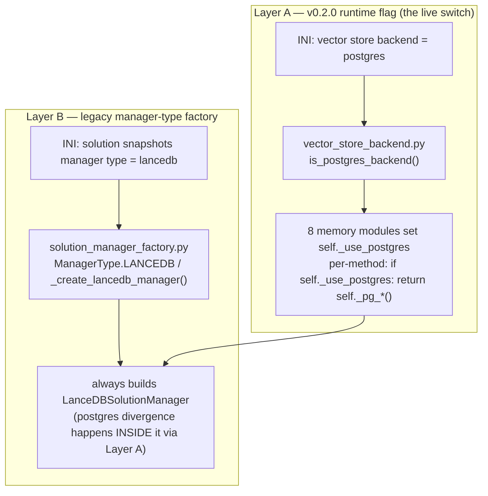

# LanceDB Teardown PREP — Scoping & Design

**Date**: 2026-07-07 · **Author**: Tiffany 💍 (session b5842b57) · **Manager**: Mr. Radio 🦉
**Store row**: `df51e19a` — "v0.2.0 post-soak tail: LanceDB teardown + HNSW revisit-after"
**Branch/worktree**: `lane-tiffany-lancedb-teardown` (from HEAD `29116513`) · **Status**: commit-HELD, INERT
**Ties to**: [pgvector swap-chain execution](2026.07.07-pgvector-swap-chain-execution.md) · [migration design §6](2026.06.30-lancedb-to-postgres-pgvector-migration-design.md)

---

## 0. TL;DR

The v0.2.0 LanceDB→Postgres+pgvector cutover is LIVE (`backend = postgres`, commit `0901984d`) and soaked
clean. This doc scopes the **P5 teardown PREP** — a commit-HELD, **inert** diff (no merge, no on-disk store
deletion; the on-disk store + INI flip-back remain the rollback path).

**A full code-surface inventory surfaced three facts that reshape the row's five listed deliverables:**

| Row deliverable | Reality after grounding |
|---|---|
| remove the lancedb dependency | **Heavy** — top-level `import lancedb` is load-bearing in 8 memory modules; removing the dep requires removing the entire LanceDB code path (both dispatch layers, ~12 test files) → this is the **rollback-killing** teardown. |
| retire the INI backend-key path | The `vector store backend` flag IS the live rollback switch — retiring it = the same rollback-killing teardown. |
| clean util_gcs lancedb paths | **NO-OP** — `util_gcs.py` has zero lancedb refs. |
| fix "Connecting to LanceDB" boot banners | **No such print fires under postgres** — all are behind `if not self._use_postgres`. The real postgres-mode artifact is the **class-name banner** → folds into the rename. |
| `LanceDBSolutionManager` class-rename | Doable & inert, but rename **target** depends on the teardown-depth decision; touches factory enum + ~7 test files + benchmark script. |

**Recommendation**: split into a **safe inert slice now** (class rename + banner + `system.py` response-key nit —
all rollback-preserving) and **defer the rollback-killing dep/flag removal** to a dedicated post-soak teardown
task (matches the row's own "DO NOT rush teardown" caution). Decision is Mr. Radio's — see §5.

---

## 1. Scope boundaries (from the manager)

**IN**: parts (1)+(3) of the row body — remove lancedb dep, retire INI backend-key path, clean util_gcs
lancedb paths, fix postgres-mode boot banners, `LanceDBSolutionManager` class-rename.

**OUT**: part (2) HNSW revisit-after (gated on the notification-flood purge card).

**HARD CONSTRAINTS**:
- (a) Diff **INERT until merged** — the on-disk LanceDB store + INI flip-back are the cutover **rollback path**
  and are NOT burned today: **NO merge, NO on-disk store deletion**, commit-HELD for Mr. Radio's diff review.
- (b) House style (spaces in parens, DbC docstrings, aligned assignments), `py_compile` after every `.py` edit,
  full test layers on touched code, **100% L/B/F** coverage gate.
- (c) Venue: unit/smoke on :7999 only; anything state-mutating or long → `/api/test-suite/submit` on :8000.

**Isolation mechanism**: because `lupin-app.ini` is **hot-reloaded by :7999** and the memory modules are
`--reload`-watched, editing the teardown into the main working tree would burn the rollback path on the live
server immediately. All edits therefore live in this **git worktree** (branched from HEAD); the live tree keeps
the flag + LanceDB path intact → the diff is genuinely inert.

---

## 2. Complete LanceDB surface inventory

### 2.1 Dependency declarations (2 — and they disagree)
- `pyproject.toml:43` — `"lancedb>=0.13,<1"`
- `src/cosa/requirements.txt:105` — `lancedb==0.23.0`

Clean (no lancedb): `requirements-test.txt`, `requirements-arbiter.txt`. `docker-compose.yml:6` mentions LanceDB
only in a migration comment.

### 2.2 The two dispatch layers

**Layer A** (`src/cosa/rest/db/repositories/vector_store_backend.py`): `_CONFIG_KEY = "vector store backend"`,
`get_vector_store_backend()` (fail-loud on bad value), `is_postgres_backend()`. Consumed by:
`lancedb_solution_manager.py`, `question_embeddings_table.py`, `query_log_table.py`, `gist_cache_table.py`,
`embedding_cache_table.py`, `canonical_synonyms_table.py`, `input_and_output_table.py`,
`proxy_decision_embeddings.py`, `system.py` (PE-reset), `vector_store_backfill.py`.

**Layer B** (`src/cosa/memory/solution_manager_factory.py`): `ManagerType.{FILE_BASED,LANCEDB}`,
`create_manager()`, `_create_lancedb_manager()`, `create_from_config_manager()` — reads INI keys
`solution snapshots manager type`, `storage backend`, `solution snapshots lancedb {path,gcs uri,table,nprobes}`.

### 2.3 Top-level `import lancedb` (load-bearing at import time)
8 memory/agent modules import `lancedb` at module top: `lancedb_solution_manager.py:15`,
`gist_cache_table.py:22`, `input_and_output_table.py:11`, `embedding_cache_table.py:8`,
`question_embeddings_table.py:9`, `query_log_table.py:15`, `canonical_synonyms_table.py:12`,
`proxy_decision_embeddings.py:18`. Function-local imports: `vector_store_backfill.py:326`, `system.py:283`.
Plus 6 scripts (function-local).

> **This is why "remove the dep" is heavy**: deleting the pyproject/requirements line breaks server boot unless
> every top-level `import lancedb` (and the branches that call lancedb APIs) is removed first.

### 2.4 `LanceDBSolutionManager` class
- **Def**: `lancedb_solution_manager.py:48` (implements `SolutionSnapshotManagerInterface`; ~2450 lines; no subclasses).
- **Live refs**: `solution_manager_factory.py:158,160,173` (only production instantiation);
  `running_fifo_queue.py:1594` (comment); `solution_snapshot_repository.py:3` (docstring);
  `file_based_solution_manager.py` (deprecation docstrings); `benchmark_snapshot_managers.py:32,160` (script).
- **Test refs**: ~7 files (see §2.7).

### 2.5 Boot banners — GROUND TRUTH
Every `"Connecting to LanceDB"` print is behind `if not self._use_postgres:` **and** `if self.debug:`:
- `lancedb_solution_manager.py:578` — behind the postgres early-return at `:571` (never reached under postgres).
- `canonical_synonyms_table.py:82`, `query_log_table.py:70` — inside `if not self._use_postgres:` blocks.

**⇒ No "Connecting to LanceDB" line prints under `backend = postgres`.** The actual postgres-mode artifact is the
**class-name banner** (debug-gated, prints regardless of backend):
- `:129` `print( "LanceDBSolutionManager configured:" )` (constructor, both modes)
- `:1920` `print( "✓ LanceDBSolutionManager initialized (postgres backend, cache bypass)" )` (postgres path)

The swap-chain doc's "still prints legacy Connecting-to-LanceDB banner" (line 83) is imprecise phrasing for this
class-name banner. **The rename fixes the banner** — they are one fix, not two.

### 2.6 `util_gcs` — GROUND TRUTH
`src/cosa/utils/util_gcs.py` has **zero** lancedb references (pure GCS text/blob I/O for Deep Research). The
`gs://` LanceDB store path is handled inside `LanceDBSolutionManager._resolve_db_path()` (`:167`) by lancedb's
native object-store driver — there is no separate F5/FUSE sync util. **Category is a no-op for teardown.**

### 2.7 Test files touching lancedb
Unit: `test_lancedb_solution_manager.py`, `test_solution_manager_factory.py`, `test_file_based_solution_manager.py`,
`test_solution_manager_pg_equivalence.py`, `test_canonical_synonyms_table.py`, `test_lancedb_gcs_manager.py`,
`test_answer_is_correct.py`, `test_canonical_synonyms_delete.py`, `test_embedding_cache_corruption.py`.
Integration: `test_lancedb_local_isolation.py`, `test_lancedb_gcs_integration.py`, `run_gcs_tests_standalone.py`,
`conftest.py:496`.

### 2.8 Correctness nit
`system.py:297` returns a hard-coded `"lancedb_table"` response key + `engine.lancedb_table` attribute **even
under postgres** — a naming artifact to fix alongside the class/attribute rename.

---

## 3. Risk analysis

| Change | Blast radius | Rollback impact on merge | Inert while held? |
|---|---|---|---|
| Class rename (+banner +`system.py` key) | factory + ~7 tests + benchmark + 1 API response key | **None** — flag + branches untouched | ✅ yes |
| Remove `vector store backend` flag / lancedb branches | 8 core memory modules (CBR heart) + Layer A + ~12 tests | **Kills code-level rollback** (INI flip-back would have no lancedb code to run) | ✅ yes (worktree) but semantically destructive on merge |
| Remove lancedb dep line | pyproject + requirements; breaks boot unless branches removed first | Coupled to above | ✅ yes |
| Retire Layer B factory keys | factory + `create_from_config_manager` tests | Low (dead under postgres) but couples file_based path | ✅ yes |

The core memory layer (solution snapshots, embeddings, query log, canonical synonyms) is the heart of CoSA's
case-based reasoning. A subtle regression on the postgres path under a 100% L/B/F gate is a poor trade for a P3
tail — and the row body itself says **"DO NOT rush teardown."**

---

## 4. Proposed phasing

**Phase 1 — safe inert slice (rollback-preserving), THIS held PR:**
1. Rename `LanceDBSolutionManager` → `<target>` (§5 Q2) everywhere (def, factory, comments, tests, benchmark) —
   one descriptive name, no shim (per `feedback_one_descriptive_name_everywhere`).
2. Fix the postgres-mode class-name banners (`:129`, `:1920`) to the new name.
3. Fix `system.py:297` response key `lancedb_table` → backend-neutral (`vector_table` / `snapshot_table`).
4. Reconcile the `util_gcs` no-op (document, nothing to remove).
5. Full tests + 100% L/B/F on every touched module.

**Phase 2 — heavy teardown (rollback-killing), DEFERRED to a dedicated post-soak task** (EXPLICIT deliverable
list — nothing here may silently drop; ratified by Mr. Radio 2026-07-07):
- Remove all `if not self._use_postgres` lancedb branches across the 8 memory modules.
- Retire Layer A flag (`vector_store_backend.py` + `vector store backend` INI key) and Layer B factory
  (`ManagerType.LANCEDB`, lancedb factory keys).
- Remove top-level `import lancedb` + the dep declarations (`pyproject.toml:43`, `requirements.txt:105`).
- **Rename the module FILE** `lancedb_solution_manager.py` → `solution_snapshot_manager.py` (deferred out of
  Phase 1 because the file still holds the full lancedb impl — do it WITH the code removal, and update every
  import path + the `patch()` module-path strings then).
- **Retire the `engine.lancedb_table` PredictionEngine attribute** (+ `DEFAULT_LANCEDB_TABLE`, decision_proxy
  `proxy_lancedb_table` / `DEFAULT_PROXY_LANCEDB_TABLE`, INI `prediction engine lancedb table` / `swe team trust
  proxy lancedb table`, `main.py:480`) — a separate subsystem sweep, NOT the SolutionSnapshotManager rename.
- Disposition the backfill utility + lancedb scripts (they are the re-migration / reverse-delta tooling — §7).
- On-disk store deletion — separately, on Rick's explicit word (per row).

---

## 5. Decisions for Mr. Radio — RULED 2026-07-07 (DM thread 18ec8b7f)

- **Q1 — Teardown depth.** ✅ **RULED: Phase 1 only (safe inert slice)** — class rename + banner fix +
  `system.py:297` neutral response key, all rollback-preserving. The dep/flag/branch removal is EXPLICITLY OUT of
  this PR (rollback-killing full teardown → its own post-soak review under Rick's word on the on-disk store).
- **Q2 — Class rename target.** ✅ **RULED: `SolutionSnapshotManager`** — sweep EVERY reference, no alias/shim.
- **Q3 — Backfill utility + lancedb scripts disposition.** ✅ **RULED: keep** as off-tree re-migration tooling
  until Rick rules the on-disk store deletable — paths recorded in §7 below.

### 5a. Scope refinements made during execution (flagged to Mr. Radio)
1. **Module FILE name kept** `lancedb_solution_manager.py` (class symbol renamed inside). The file still contains
   the full LanceDB implementation (branches are NOT removed in this slice), so a neutral-named file full of
   lancedb code would be a worse naming state; the file rename folds into Phase 2 with the code removal. This also
   keeps the module-path `patch()` strings valid → minimal churn.
2. **`engine.lancedb_table` attribute NOT renamed** — only the `system.py` *response key* (`lancedb_table` →
   `prediction_table`). The attribute belongs to the `PredictionEngine` family (constant `DEFAULT_LANCEDB_TABLE`,
   config `proxy_lancedb_table`, ~15 test sites, INI `prediction engine lancedb table`) — a separate subsystem
   sweep, out of this slice.
3. **Discovered + fixed a pre-existing, cutover-induced test breakage** in the file I touched:
   `test_lancedb_solution_manager.py`'s lancedb-mode classes (`TestHealthCheck`/`TestDebugFalseArcs`/
   `TestDebugOnlyLines`, ~50 tests) did not pin `_use_postgres = False`, so they went RED when the INI default
   flipped to `postgres` this morning (they dispatched into `_pg_*` against a live backend). Fixed with a one-line
   hermeticity pin in `_make_manager()` (`mgr._use_postgres = False`; `_pg_manager()` re-flips to True),
   mirroring the established convention at `test_canonical_synonyms_delete.py:24`. This is the minimal fix to make
   the touched file green under the live postgres INI; flagged as a scope-adjacent discovery, not silent creep.

## 6. Verification plan (Phase 1)

- `py_compile` after every `.py` edit.
- Import-chain check from a postgres-mode boot (`is_postgres_backend()` path).
- `pytest src/cosa/tests/unit/memory/ src/tests/unit/ -k "solution_manager or canonical or lancedb"` (:7999).
- `pytest --cov` 100% L/B/F on every touched module.
- Integration/E2E (:8000 scheduled) only if a touched surface is state-mutating (the PE-reset endpoint rename).

## 7. Disposition table — kept off-tree re-migration tooling (Q3 = keep)

These are NOT removed by this slice (nor by Phase 2 until Rick rules the on-disk store deletable):

| Path | Role |
|---|---|
| `src/cosa/rest/db/vector_store_backfill.py` | Lane-D one-time offline LanceDB→Postgres backfill utility (the reverse-delta seed) |
| `src/scripts/rebuild_lancedb_table.py` | Canonical staged-rebuild tool (missing-manifest corruption recovery) |
| `src/scripts/lancedb_incident_recovery_2026_06_23.py` | Fork of the rebuild tool + 4 emergency phases (6/23 incident playbook) |
| `src/scripts/cleanup_lupin_lancedb.py` | LanceDB store cleanup utility |
| `src/scripts/migrate_synonymous_questions.py` | One-time synonym migration |
| `src/scripts/migrate_snapshots_complete.py` | One-time snapshot migration |
| `src/scripts/benchmark_snapshot_managers.py` | Manager benchmark (class-symbol updated in this slice) |

## 8. Execution record — Phase 1 EXECUTED (commit-HELD, INERT)

**Worktree**: `lane-tiffany-lancedb-teardown` (from HEAD `29116513`). **Diff**: 20 files (+93/−85) + this doc.

- **Class rename** `LanceDBSolutionManager` → `SolutionSnapshotManager`: 78 symbol occurrences across 17 code/test
  files; module path `cosa.memory.lancedb_solution_manager` unchanged (file kept per §5a.1). Zero
  `LanceDBSolutionManager` remaining in any `.py` (excl `.venv`). Historical `.md` (history/rnd execution logs)
  deliberately NOT rewritten.
- **Banners** (`:129`, `:1920`, `:2348` + smoke): renamed via the symbol sweep — the postgres-mode class-name
  banner now reads `SolutionSnapshotManager`.
- **`system.py:297`** response key `lancedb_table` → `prediction_table` (dict re-aligned; value `engine.lancedb_table`
  unchanged per §5a.2); guarding assertions added (`prediction_table` present, `lancedb_table` absent). Zero other
  consumers of the response key exist.
- **Test hermeticity pin** (§5a.3): `_make_manager()` pins `_use_postgres = False`.

**Verification (all green, :7999 unit venue):**

| Check | Result |
|---|---|
| `py_compile` (19 changed `.py`) | ✅ clean |
| Import chain under live postgres INI | ✅ all touched prod modules import; class = `SolutionSnapshotManager` |
| Affected unit set under live postgres INI | ✅ **432 passed** (the 50 previously-red now green via the pin) |
| Same set in lancedb mode (rename-clean proof) | ✅ **398 passed** |
| Coverage `lancedb_solution_manager.py` | ✅ **100%** L/B (966 stmts / 456 br / 0 miss) |
| Coverage `solution_manager_factory.py` / `file_based_solution_manager.py` | ✅ **100%** L/B |
| Coverage `system.py` (full test set) | ✅ **100%** L/B (169/22/0) |

**Deferred to Phase 2 (dedicated post-soak task, Rick-gated on-disk store):** remove lancedb dep + top-level
imports + both dispatch layers + branches; rename the module file; retire `engine.lancedb_table`; on-disk store
deletion. **Integration/E2E** on `:8000` (the touched integration files + PE-reset endpoint) → schedule at the
merge gate, not this held slice.

---

## 6. Verification plan (Phase 1)

- `py_compile` after every `.py` edit.
- Import-chain check from a postgres-mode boot (`is_postgres_backend()` path).
- `pytest src/cosa/tests/unit/memory/ src/tests/unit/ -k "solution_manager or canonical or lancedb"` (:7999).
- `pytest --cov` 100% L/B/F on every touched module.
- Integration/E2E (:8000 scheduled) only if a touched surface is state-mutating (the PE-reset endpoint rename).
