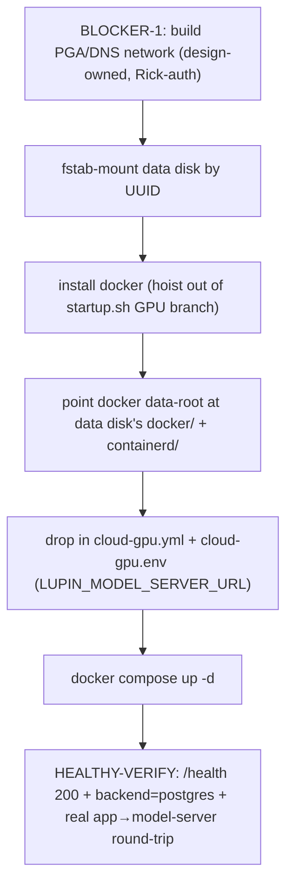

# CPU VM App-Restore Runbook — `lupin-host-test` (post GPU→CPU downgrade)

| Field | Value |
|---|---|
| **Date** | 2026-07-08 |
| **Author** | Rachel 🕊️ (sessions `fa04b17e` → `074d0d03`) under Tiberius 👑 |
| **Status** | ✅ EXECUTED 2026-07-08 — Phase-1 (mount/docker/data-root/compose) + Phase-2 (PGA/DNS/route) both complete; live app→model-server round-trip **200**. Task `b5854c3e` closed. |
| **Trigger** | GPU→CPU downgrade (Option A recreate) rebuilt the boot disk → docker + app deployment wiped; PGA/DNS to the Cloud Run model-server was never built (handoff finding #2) |
| **Parent** | [Open: 02-vm-downgrade-handoff.md](/app/docs?path=lupin/src/rnd/v0.1.9/2026.06.30-gpu-model-server-cloud-run-split/02-vm-downgrade-handoff.md) · Epic `dab6cdfa` |

> **✅ EXECUTED.** This document began as a *plan* (HELD pending Rick's scope ruling); Rick then
> authorized execution and added the gated gcloud perms (`Bash(gcloud dns:*)` +
> `Bash(gcloud compute routes:*)`). Both phases are now DONE and verified — see the ✅-annotated
> steps below and the new **§5 MTU provisioning finding** (the one gap the original plan missed).
> Push of these repo edits remains Rick's call.

---

## 1. Ground truth (verified 2026-07-08)

- **VM `lupin-host-test`**: `e2-standard-8` (CPU-only, L4 removed), **RUNNING**, `us-central1-a`,
  project `hello-world-foo-423219`, internal IP **10.0.1.14**, resource policy `friday-eod-stop`.
- **Boot disk** (`sda`, 100G): **rebuilt** from `ubuntu-2204` on the Option-A recreate → **no docker, no app** (fresh).
- **Data disk** (`sdb`, 200G, **ext4**, label `lupin-data`, **UUID `a84a8a0a-6990-4da8-8af9-de782540a415`**):
  **SURVIVED** the rebuild, currently **UNMOUNTED** (its fstab entry was on the wiped boot disk). Contents (RO-inventoried):
  | Path on disk | Size | What it is |
  |---|---|---|
  | `lupin/` | 175M | Full app checkout — `docker-compose.cloud-test.yml`, `docker-compose.yml`, `cloud-test.env`, `src/conf/lupin-app.ini`(+splainer), `docker/` build contexts, `src/conf/keys/…` |
  | `containerd/` | **125G** | containerd content store (image layers) — the docker data-root lived on this disk |
  | `docker/` | 4.3M | docker data-root metadata + named **volumes** (incl. `lupin_cloudsql-socket`) |
  | `lupin-wip.bundle` | 34M | git bundle of the repo |
  | `lost+found/` | 16K | ext4 |
- **`docker-compose.cloud-gpu.yml` is NOT on the data disk** (only `cloud-test`). The CPU variant must be
  copied from the **current** Lupin repo.
- **Cloud Run model-server**: `https://lupin-model-server-um6r4fv7nq-uc.a.run.app`, ingress = **INTERNAL_ONLY**, LIVE.
- **Consequence**: re-deploy is a **RESTORE from the data disk** (images/volumes already local → fast, no re-pull),
  NOT a fresh clone.

## 2. RESTORE path (ordered) — HELD pending Rick's ruling



**Step 0 — Blocker-1 network first** (see §3). Without it the healthy-verify's model-server round-trip
cannot pass (INTERNAL_ONLY rejects the public path). Docker/deploy can be staged before the network is
ready, but the stack is not *healthy* until §3 is done.

**Step 1 — Mount the data disk by UUID.** Choose a host mountpoint (e.g. `/mnt/lupin-data`); the exact prior
mountpoint was in the wiped fstab, but the on-disk subdir layout (`lupin/`, `docker/`, `containerd/`) is
self-describing. Persist it:
```
sudo mkdir -p /mnt/lupin-data
echo 'UUID=a84a8a0a-6990-4da8-8af9-de782540a415 /mnt/lupin-data ext4 defaults,nofail 0 2' | sudo tee -a /etc/fstab
sudo mount -a
```

**Step 2 — Install docker** (the startup.sh gap, see §4). For the restore, install the same packages
startup.sh installs in its GPU branch:
```
sudo apt-get update && sudo apt-get install -y docker-ce docker-ce-cli containerd.io docker-compose-plugin
```

**Step 3 — Point docker + containerd at the data disk** (so the 125G of images + the named volumes are
reused, no re-pull). Set the docker daemon data-root and containerd root to the data disk's dirs, then
restart:
```
# /etc/docker/daemon.json
{ "data-root": "/mnt/lupin-data/docker" }
# containerd: root = /mnt/lupin-data/containerd  (edit /etc/containerd/config.toml [plugins."io.containerd.grpc.v1.cri".containerd] or the top-level `root`)
sudo systemctl restart containerd docker
docker image ls   # expect the prior lupin images present (no pull)
docker volume ls   # expect lupin_cloudsql-socket + others
```
> Verify the prior data-root layout matches these dirs before repointing; if the prior daemon used a
> different arrangement (e.g. data-root = the whole mount), adjust to match what's actually on disk.

**Step 4 — Deploy the CPU compose + env** (from the current repo — not on the data disk):
```
cd /mnt/lupin-data/lupin
# copy docker-compose.cloud-gpu.yml from the current Lupin repo checkout
cat > cloud-gpu.env <<'EOF'
LUPIN_MODEL_SERVER_URL=https://lupin-model-server-um6r4fv7nq-uc.a.run.app
EOF
# keys already present under ./src/conf/keys (lupin-model-server-auth, notification-api-claude-code-dev)
```
The compose uses **relative** binds (`./src:/var/lupin/src`, `./io:/var/lupin/io`,
`./src/conf/keys:/var/lupin/src/conf/keys:ro`), `LUPIN_ROOT=/var/lupin` container-side, and
`LUPIN_MODEL_SERVER_URL` is `:?`-required (compose fails loud if unset). `cloud-gpu.yml` OMITS the local
GPU model-server container (that service now lives on Cloud Run).

**Step 5 — Bring the stack up:**
```
docker compose -f docker-compose.cloud-gpu.yml --env-file cloud-gpu.env up -d
```

**Step 6 — HEALTHY-VERIFY (not containers-up alone):**
- App `/health` → 200.
- `backend=postgres` confirmed in-container (Cloud SQL Auth Proxy wiring intact via the `lupin_cloudsql-socket` volume).
- **Real app→model-server round-trip**: exercise a live inference/calc path that hits the Cloud Run model-server
  (embedding + STT), and confirm the Cloud Run request logs show the hit — proving the link, not just container start.

## 3. BLOCKER-1 network recipe — PGA/DNS for the INTERNAL_ONLY Cloud Run ingress — ✅ EXECUTED 2026-07-08

Original symptom (pre-fix): from the VM, `lupin-model-server-…run.app` resolved to **public** Google IPs
and requests **timed out** (`http_code=000`) — INTERNAL_ONLY blocks the public path.

On the app VPC (`dev-vpc`) — **all four gcloud commands ran clean** (identity `admin@rickruiz.altostrat.com`,
project `hello-world-foo-423219`):
1. **Private Google Access** — already **True** on `dev-internal-subnet` ✅ (no change).
2. ✅ **Cloud DNS private zone `run-app-private`** (`run.app.`, visibility=private, network=`dev-vpc`) with an
   `A` record set for both `*.run.app.` and `run.app.` → the restricted VIP set **`199.36.153.4,.5,.6,.7`**
   (TTL 300).
3. ⏸️ **`googleapis.com.` override — HELD, deliberately NOT created.** The Cloud SQL proxy already reaches its
   instance over a **private-services-access VPC peering** (`peering-route 10.44.0.0/24`), NOT a Google API VIP,
   so overriding `googleapis.com` would have added risk to a working DB path for zero benefit. Add it only if a
   future need for VPC-SC-restricted API resolution appears.
4. ✅ **Static route `restricted-googleapis-vip`** — dest `199.36.153.4/30`, next-hop `default-internet-gateway`,
   priority 1000, on `dev-vpc`. (Note: the pre-existing `0.0.0.0/0`→internet-gateway route already covers this
   range under PGA; the explicit route is documentation-standard belt-and-suspenders.)
5. ✅ **Verified from the VM**: `dig +short lupin-model-server-…run.app` → `199.36.153.4-.7`; the VM **host**
   reached the VIP in 65 ms (404) — proving the GCP path was correct. The app **container** then required the
   MTU fix in **§5** before its round-trip completed (`/health` → **200**, 58 ms, resolved `199.36.153.5`).

**Alternative** (heavier): front the service with an internal ALB / PSC endpoint on `dev-vpc` and point
`LUPIN_MODEL_SERVER_URL` at that internal address instead of the `…run.app` name.

## 4. Durable follow-up — fix `startup.sh` so future e2 starts self-provision

**Root cause of the docker gap**: in `terraforming-vms` `src/bash/startup.sh` (and the per-VM
`.vm-state/lupin-host-test/terraform/src/bash/startup.sh`), the docker install
(`docker-ce docker-ce-cli containerd.io docker-compose-plugin`, ~L550) lives INSIDE the
`if machine_type =~ ^(g2|a2)-` **GPU-only** branch; a non-GPU e2 hits the else (`Non-GPU … skipping`, ~L576)
and gets **no docker**.

**Fix (in the `terraforming-vms` repo — separate repo, manage there):**
1. **Hoist** the docker-ce/containerd/compose-plugin install OUT of the GPU-only branch so **every** machine
   type installs docker. Keep the NVIDIA driver + container-toolkit bits GPU-gated.
2. **Auto-mount the data disk**: add an fstab entry by UUID (or a startup-script mount) so the data disk
   re-mounts on every (re)boot.
3. **Set the docker data-root** to the data-disk dir at provision time (so images/volumes persist across
   boot-disk rebuilds by design).

This makes a future GPU→CPU recreate self-heal (docker + mount) instead of landing bare.

## 5. Durable finding — Docker-bridge MTU must match the GCP VPC (1460, not 1500)

**Discovered 2026-07-08 while closing Phase-2.** After the DNS/route were correct, the app *container*
still timed out reaching `…run.app` while the VM *host* reached the same VIP in 65 ms. The split is the
classic **GCP-VPC MTU signature**:

- **Root cause**: GCP VPC uses **MTU 1460** (`ens4`), but Docker's default bridge (and every compose-created
  network) uses **1500**. Small responses fit and succeed (direct-IP 403, `8.8.8.8` 302, a plain `curl`
  404); the **larger Cloud Run TLS handshake** for the `…run.app` SNI exceeds 1460, and with PMTUD broken
  (ICMP filtered) the oversized packets are silently black-holed → the connection **hangs / times out**.
- **Symptom fingerprint**: host reaches the VIP fast, container hangs; *some* HTTPS works from the container
  (small payloads) but the specific large-handshake endpoint does not. Don't chase DNS/route/firewall — check
  MTU first (`ip link show ens4` vs the container's `eth0`).
- **Fix (durable, applied)**: set the compose network MTU to match the VPC in `docker-compose.cloud-gpu.yml`:
  ```yaml
  networks:
    lupin-cloud-network:
      driver: bridge
      driver_opts:
        com.docker.network.driver.mtu: "1460"
  ```
  A network `driver_opts` change requires `docker compose down` (to remove the old network) then `up -d`;
  a plain `up` will not recreate an existing network. Verified persistent: after recreate the container's
  `eth0` came up at 1460 with **no** manual `nsenter`, and the app→model-server `/health` round-trip returned
  **200**.
- **Provisioning angle (same spirit as the §4 startup.sh hoist)**: bake MTU 1460 into every cloud compose
  network (and consider a daemon-wide `{"mtu":1460}` default) so the next deployer gets it for free.
  ⚠️ On this VM `daemon.json` is touchy — `docker.service` passes `--containerd` as a flag, so a
  `daemon.json` `"containerd"` key is a fatal duplicate; the compose `driver_opts` route avoids the daemon
  restart entirely and is preferred here.

---

## Appendix — what is NOT lost / NOT at risk

- Data disk survives every instance recreate (`prevent_destroy` + separate resource); static IP `10.0.1.14`
  and the `vm_sa` service account also persist.
- The Option-A boot-disk loss was **authorized** by Rick ("nothing on the CPU to protect"); the data disk
  carried the real state.
- The GPU-inference workload lives on the Cloud Run model-server (scale-to-zero) — the VM never needs a GPU again.
