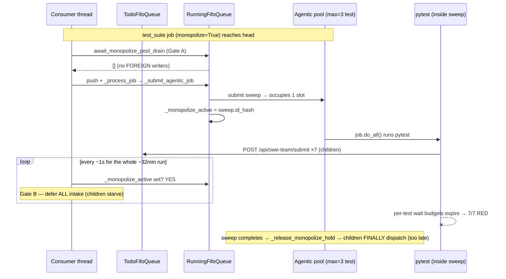
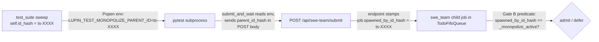
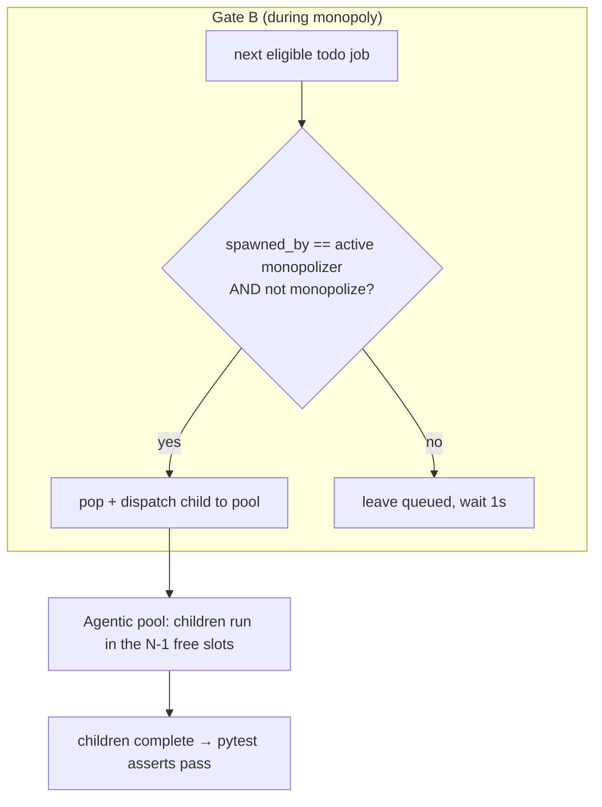

# :8000 Monopolize Deadlock — Lineage Pass-Through Fix (bug 3a14292b)

**Status**: IMPLEMENTED — plan-reviewed APPROVE + **two-key code review CONSOLIDATED APPROVE** (Mr. Radio 🦉 firsthand diff read = Key 1; Arnold 🪨 adversarial = Key 2, APPROVE-WITH-NITS, zero correctness defects across 9 hunt items, RED-first independently reproduced), 2026-07-11. Three pre-commit nits cleared (test_suite.py 400-path test, queue_consumer pragma line-refs refreshed, this doc's assembly-test claim truthed up). Code on worktree branch `lane-clayton-monopolize-lineage`; unit + in-process assembly green (352 passed). Committing on Mr. Radio's word; never pushed. Bug closes on the post-merge :8000 sweep green (= 67473d91's deferred confirm), not before.
**Author**: Clayton 😎 (session f99a25bf)
**Date**: 2026-07-11
**Bug**: `3a14292b-b146-4a0f-8b6e-dd080728c7bf` (P2, `correlation_key=monopolize-agentic-pool-deadlock`)
**Cross-links**: `30398595` (Option-a design, terminal), `caf58f71` (no-op-placeholder stale claim), `67473d91` (E2E confirm queued behind this fix)
**Branch**: `wip-v0.1.9-2026.06.21-bug-fix-implementation`

---

## 1. TL;DR

A `test_suite` job submitted with `monopolize=True` runs inside the shared agentic
pool and, via `_submit_agentic_job`, sets `RunningFifoQueue._monopolize_active`.
The consumer's **Gate B** then defers **ALL** todo-queue intake for the entire run.
But that same sweep's `pytest` spawns `swe_team` **child** jobs through
`POST /api/swe-team/submit` — and Gate B starves them: they sit in the todo queue
with `started_at=None` until the monopolizer exits, by which time every per-test
wait budget has expired. Result: 7/7 integration tests RED (ts-ad4670ec, firsthand).

**Root defect**: Gate B (intake hold) and the Gate-A drain classifier
(`get_non_test_inflight_agentic_jobs`) treat the sweep's **own children** as if they
were **foreign** writers. The monopoly's real job is to exclude *foreign* DB writers,
not the sweep's own lineage.

**Recommended fix (Shape A — lineage pass-through)**: give every job an explicit
`spawned_by_id_hash` field; the monopolizer exports its `id_hash` to its `pytest`
subprocess; child submissions echo it back; Gate B and the drain classifier **exempt
jobs whose `spawned_by_id_hash` equals the active monopolizer**. Minimal blast radius —
a classifier/exemption correction inside already-built machinery, provable end-to-end
on `:7999`.

**Shape B (test-suite job runs outside the pool)** is assessed as a **`pool_max=1`
hardening follow-up**, not the primary fix (§6).

---

## 2. The machinery as it exists today (this is NOT greenfield)

Bug `30398595` already wired "Option (a) true-monopoly". The pieces:

| Piece | Location | Behavior |
|---|---|---|
| Hold set | `running_fifo_queue.py:390-402` `_submit_agentic_job` | when a `monopolize` job is submitted to the pool AND `_is_monopolize_enabled()`, sets `_monopolize_active = job.id_hash` |
| Hold cleared | `running_fifo_queue.py:929-949` `_release_monopolize_hold` | idempotent; called from EVERY terminal path (`_on_agentic_complete` + `_ghost_job_sweep`) |
| **Gate B** (intake hold) | `queue_consumer.py:95-105` | while `_monopolize_active is not None`, defer **ALL** intake (no pop; FIFO-intact); bounded 1s wait keeps heartbeat fresh |
| **Gate A** (pre-dispatch drain) | `queue_consumer.py:143-158` + `running_fifo_queue.py:951-989` `await_monopolize_pool_drain` | before a monopolize job dispatches, wait until the pool has no foreign inflight writers; on timeout, dead-letter the sweep |
| Drain oracle / classifier | `running_fifo_queue.py:863-907` `get_non_test_inflight_agentic_jobs` | lists inflight agentic jobs that are NOT `test_suite` and NOT the sweep's own `exclude_id_hash` |
| Kill-switch | `running_fifo_queue.py:909-927` `_is_monopolize_enabled` | reads `cj flow monopolize enabled` FRESH per call (hot-reload) |



---

## 3. Reconciling the `caf58f71` "no-op placeholder" stale claim (Requirement #4)

Two comments still describe `monopolize` as inert:

- `running_fifo_queue.py:872` — *"`monopolize` is an unenforced no-op placeholder (queue_consumer.py)"*
- `queue_consumer.py:146` — *"the placeholder's original promise, now wired"* (partially corrected)

The `caf58f71` era predates `30398595`. Since `30398595` landed, the hold is **ACTIVE**:
the 1916 `"[CONSUMER] Monopoly hold active — deferring all intake"` receipts on ts-ad4670ec
(~one per consumer tick over 1913s) prove it. **This design corrects the record**: the
`get_non_test_inflight_agentic_jobs` docstring at `:869-874` will be rewritten to state
the hold is enforced (not a placeholder) and that it now additionally exempts lineage
children. No comment in the tree will describe monopolize as a no-op after this fix.

---

## 4. Requirement #1 — how the monopolizer's own children are identified

**Decision: an explicit `spawned_by_id_hash` lineage field. NEVER `job_type` sniffing.**

Rationale (per Mr. Radio's constraint): a future monopolizer that spawns *non-swe*
children must not re-deadlock. Keying the exemption on `job_type == "swe_team"` would
silently fail to exempt (say) a monopolizing sweep that spawns `deep_research` children.
Lineage is the invariant; job type is incidental.

### 4.1 The lineage token's journey



### 4.2 The five touch-points

1. **`AgenticJobBase.__init__`** (`agentic_job_base.py:64,114-116`) — add a first-class
   attribute `self.spawned_by_id_hash = spawned_by_id_hash` (constructor kwarg, default
   `None`), mirroring how `monopolize` is declared. Explicit attribute — no `getattr`
   fishing at the read sites (house rule).

2. **`test_suite/job.py`** Popen env dict (`:935-945`) — inject
   `"LUPIN_TEST_MONOPOLIZE_PARENT_ID": self.id_hash`. The hardcoded env dict is NOT
   allowlist-filtered (only caller-supplied `self.env_vars` are), and the
   `LUPIN_TEST_` prefix is forward-compatible with the existing
   `_ENV_VAR_ALLOWED_PREFIXES` allowlist. Always injected (harmless when the sweep is
   not monopolize — Gate B won't fire, so nothing consults it).

3. **`routers/swe_team.py`** — add `parent_id_hash: Optional[str] = None` to
   `SweTeamSubmitRequest`; after `create_agentic_job`, stamp
   `if request_body.parent_id_hash: job.spawned_by_id_hash = request_body.parent_id_hash`
   (same pattern as the existing `job.monopolize` / `job.scheduled_at` pass-through at
   `:153-154`).

4. **`get_non_test_inflight_agentic_jobs`** (`running_fifo_queue.py:895-907`) — skip any
   inflight job whose `spawned_by_id_hash == exclude_id_hash`. Semantically: *"a writer
   spawned BY the sweep is not foreign TO the sweep."* One predicate added to the existing
   loop. This keeps Gate A's foreign-writer drain intact (Requirement #3, §5).

5. **`pop_next_eligible`** (`fifo_queue.py:204`) + **Gate B** (`queue_consumer.py:95-105`)
   — see §5.

### 4.3 Why the test harness is a legitimate touch-point

The `swe_team` children are spawned by `pytest` (`test_swe_team_pipeline.py:submit_and_wait`
`:145` and the inline submit at `:295`). The lineage token has to be *forwarded* by whoever
calls the submit endpoint. In production there is no analogous auto-spawn path today (no
server code submits `swe_team` jobs on behalf of a monopolizer), so the test harness is the
only current forwarder. The endpoint field is generic, so any future server-side
child-spawner forwards the same way.

---

## 5. Requirement #3 — Gate A/B changes with foreign-writer semantics intact

### 5.1 Gate B: from "defer ALL" to "defer FOREIGN, admit lineage children"

Add an optional predicate to `pop_next_eligible`:

```python
def pop_next_eligible( self, now=None, predicate=None ) -> Optional[Any]:
    # ... existing eligibility (paused / scheduled_at) checks ...
    # NEW: when a predicate is supplied, a job must also satisfy it to be returned.
    if predicate is not None and not predicate( job ):
        continue
```

Gate B becomes selective instead of blanket:

```python
if running_queue._monopolize_active is not None and running_queue._is_monopolize_enabled():
    parent = running_queue._monopolize_active
    # Admit ONLY this monopolizer's own NON-monopolize lineage children; foreign
    # jobs (and any nested-monopoly child) stay deferred, FIFO-intact.
    def _is_admissible_child( j ):
        return ( getattr( j, "spawned_by_id_hash", None ) == parent
                 and not getattr( j, "monopolize", False ) )
    job = todo_queue.pop_next_eligible( now, predicate=_is_admissible_child )
    if job is None:
        if todo_queue.debug: print( "[CONSUMER] Monopoly hold active — deferring FOREIGN intake (lineage children pass)" )
        todo_queue.condition.wait( timeout=monopolize_poll_secs )
        continue
    # else: fall through — dispatch the admitted child normally
```

Foreign jobs are **skipped by the predicate and remain queued** — the "FIFO-intact, deferred
head dispatches first once the hold clears" invariant is preserved for everything that is
not a lineage child.

> **Note — `getattr` here is deliberate, not defensive fishing.** Gate B/`pop_next_eligible`
> iterate a heterogeneous queue that also holds `AgentBase` / `SolutionSnapshot` items which
> never inherit the `AgenticJobBase` lineage field. The `getattr(..., None)` is the correct
> "attribute may not exist on this class" guard, distinct from the prohibited "attribute
> *should* exist but might be missing" pattern. Documented inline at the call site.

### 5.2 Gate A: unchanged in spirit, one exemption added

Gate A runs **once, pre-dispatch**, before `pytest` starts — so children are not yet inflight
and don't affect the drain at that instant. The classifier exemption (§4.2 #4) matters for two
paths that DO run mid-monopoly:

- `test_suite/job.py:758` calls `get_non_test_inflight_agentic_jobs` as an in-job preflight.
- Any future re-invocation of the classifier during a monopoly window.

With the exemption, the sweep's own inflight children are never mis-reported as foreign
offenders. **Genuinely foreign writers (different or absent `spawned_by_id_hash`) still appear
in the offender list and still block/dead-letter exactly as before.** Gate A's contamination
guarantee is untouched.

### 5.3 State after the fix



---

## 6. Requirement #2 — failure containment

| Scenario | Containment |
|---|---|
| **Child itself sets `monopolize=True`** (nested monopoly) | Gate B predicate excludes it (`not monopolize`) → it is **deferred like a foreign job**, never admitted. It cannot overwrite `_monopolize_active` mid-parent-run because it never dispatches until the parent releases. Prevents the "child steals the hold" hazard. |
| **Child leaks past the parent's release** (parent exits while a child is still inflight) | The child, once admitted, is a normal pool job with its own Future + `_on_agentic_complete` + ghost-sweeper coverage. `_release_monopolize_hold(parent.id)` is idempotent and keyed to the parent's id — releasing the parent's hold does not touch the child. After release, Gate B stops firing entirely (hold is None), so the child (and anything else) flows normally. No orphan-hold. |
| **Parent dead-lettered by ghost sweep while children queued** | `_release_monopolize_hold` fires from the sweeper path too (`:934`), clearing the hold → queued children resume via normal intake. Same terminal-path guarantee that already protects against a wedged monopolizer. |
| **Lineage token spoofing** (a foreign job forges `parent_id_hash`) | Only relevant on `:8000`/`:7999` test venues where the submit endpoint is already JWT-gated to the test user. The token is an `id_hash` string, not a capability; worst case a malicious caller admits its own job during a monopoly window — a test-harness-only concern, not a production trust boundary (production has no `swe_team` auto-spawn path). Noted, not mitigated in v1. |
| **`spawned_by_id_hash` set but monopolizer already gone** | Predicate compares against `_monopolize_active`; if the parent already released, `_monopolize_active` is None → Gate B doesn't fire → the child flows via normal intake regardless. No stuck child. |

---

## 7. Shape B assessment — test-suite job runs outside the pool (`pool_max=1` hardening)

**What it is**: dispatch a `monopolize` job on a dedicated thread/executor instead of a shared
agentic-pool worker slot, freeing all N pool workers for its children.

**Why it is NOT the primary fix**:

- **Does not, by itself, resolve the observed defect.** The observed cause is Gate B deferring
  *intake* — children never reach the pool at all. Shape B changes *where the parent runs*, not
  *whether intake is deferred*. Shape B **still requires** the Gate-B lineage exemption (§5.1) to
  admit children. So Shape A is a prerequisite of Shape B, not an alternative to it.
- **Higher blast radius.** It re-routes the dispatch core (`_process_job` → `_submit_agentic_job`)
  and forks the completion-callback / ghost-sweeper invariants, which are built entirely around
  pool `Future` objects. Riskier for the same immediate benefit.

**Where Shape B genuinely matters** — a *latent second deadlock* at `pool_max=1` (Production
default, `lupin-app.ini:779`): if a monopolizer holds the single pool slot and blocks waiting for
children, the children can never acquire a slot even with the Gate-B exemption → hard deadlock.
On `:8000`/`:7999` (`pool_max=3`, lines 29/392) the parent holds 1, leaving 2 for children — no
hard deadlock, just N-1 concurrency. Production never runs the integration monopolize sweep, so
this edge is not currently reachable.

**Recommendation**: land Shape A now; **file a follow-up hardening item** to run monopolizers
outside the pool (or refuse `monopolize` when `pool_max==1`) so the pattern is deadlock-safe at
any pool width. Track separately; do not couple to this bug's E2E confirm.

**Interaction with the 67473d91 budget fix**: `swe_wait_budget_s` sizes the per-test budget to
the *full* pool width `N`. With Shape A alone the parent consumes one slot, so children see `N-1`
effective concurrency — the budget is slightly generous-to-tight but was already observed
sufficient at `N=3`. Shape B would make the budget math exact (children get all `N`). Worth noting
in the follow-up; not blocking here.

---

## 8. Test plan (all layers)

Per the "plans include ALL test layers" + 100%-coverage mandates. Emphasis on **`:7999`
provability** so 67473d91's confirm can proceed without waiting on a 32-min `:8000` sweep.

### 8.1 Unit (`:7999`, AI-discretionary) — the core proof

- **`test_fifo_queue_*`**: `pop_next_eligible(predicate=...)` returns the first job satisfying
  BOTH eligibility and the predicate; leaves non-matching jobs queued (FIFO-intact); `None` when
  none match.
- **`test_consumer_*` / new `test_monopolize_lineage_gate.py`**: with `_monopolize_active` set,
  Gate B admits a lineage child (`spawned_by_id_hash == active`, `monopolize=False`) and defers a
  foreign job AND a nested-monopoly child. Assert via a mock todo/running queue — no server.
- **`get_non_test_inflight_agentic_jobs`**: a child (`spawned_by_id_hash == exclude_id_hash`) is
  NOT reported; a genuinely-foreign inflight writer still IS. Covers the Gate-A exemption.
- **`agentic_job_base` / `swe_team` router**: `spawned_by_id_hash` defaults `None`, round-trips
  from the request body, and is absent-safe on non-agentic queue items.
- Branch/line/function coverage 100% on every touched unit (hard gate).

### 8.2 Smoke / focused integration (`:7999`, AI-discretionary)

- **Deadlock repro-in-miniature (no 32-min suite)**: a `pytest`-driven helper that (1) submits a
  `mock_job`-style monopolize parent that itself submits 2 lineage children via the live
  `:7999` API, (2) asserts the children reach `started_at != None` **while the parent is still
  running** (i.e. during the monopoly window, not after). This is the direct inverse of the
  ts-ad4670ec deadlock proof and is the load-bearing `:7999` artifact. Uses `mock_job`
  (`routers/mock_job.py`) to keep it fast and non-destructive if a suitable monopolize+spawn mock
  can be assembled; otherwise a minimal `swe_team dry_run` pair.
- Consumer-log assertion: the new `"deferring FOREIGN intake (lineage children pass)"` line
  appears; foreign starvation does not.

### 8.3 Integration / E2E (`:8000`, scheduled via `POST /api/test-suite/submit`)

- The real confirm: re-run the `test_swe_team_pipeline.py` integration suite **as a
  `monopolize=True` `test_suite` job** (the exact ts-ad4670ec shape) and confirm 7/7 GREEN with
  children dispatching during the monopoly window. **This is 67473d91's deferred E2E confirm** —
  it unblocks once Shape A lands and the `:7999` proofs are green. Self-authorized on a
  verified-idle `:8000` per §TESTING VENUES; place behind any already-scheduled job.

### 8.4 Regression guard

- Foreign-writer contamination test (the original `caf58f71` scenario): a foreign agentic writer
  submitted during a monopoly window is STILL deferred/blocked — proves the fix didn't punch a
  hole in the exclusivity guarantee.

---

## 9. Files touched (implementation manifest)

| File | Change | Tier |
|---|---|---|
| `src/cosa/agents/agentic_job_base.py` | add `spawned_by_id_hash` ctor kwarg + attribute | core |
| `src/cosa/rest/fifo_queue.py` | `pop_next_eligible( predicate=None )` | core |
| `src/cosa/rest/queue_consumer.py` | Gate B selective admit; correct stale comment | core |
| `src/cosa/rest/running_fifo_queue.py` | classifier exemption; rewrite no-op-placeholder docstring | core |
| `src/cosa/rest/routers/swe_team.py` | `parent_id_hash` field + stamp | intake |
| `src/cosa/agents/test_suite/job.py` | inject `LUPIN_TEST_MONOPOLIZE_PARENT_ID` into pytest env | harness bridge |
| `src/tests/integration/test_swe_team_pipeline.py` | forward the env token as `parent_id_hash` | harness |
| `src/cosa/tests/unit/rest/test_queue_consumer.py` | Gate B selective-admit rework + lineage/predicate/nested tests | test |
| `src/cosa/tests/unit/rest/test_fifo_queue_coverage.py` | `pop_next_eligible(predicate=)` tests | test |
| `src/cosa/tests/unit/rest/test_running_fifo_queue.py` | classifier lineage-exemption + pool-capacity-guard tests | test |
| `src/cosa/tests/unit/rest/test_swe_team_router.py` | `parent_id_hash` stamp test | test |
| `src/cosa/tests/unit/rest/test_test_suite_router.py` | `get_running_queue` + 422 belt tests | test |
| `src/cosa/tests/unit/rest/test_monopolize_lineage_inprocess.py` | **NEW** — in-process assembly proof (§8.2) | test |
| `src/tests/unit/test_agentic_job_factory_pytest_args.py` | thread `get_running_queue` override through the test client | test |
| `src/rnd/v0.1.9/…` (this doc) | design + resolutions | doc |

**Config**: no new INI keys (reuses `cj flow monopolize enabled`, `cj flow max concurrent
agentic jobs`, `cj flow monopolize drain timeout seconds`). No splainer change.

**Docs to update on landing**: none of the DOCUMENTATION TOUCHPOINTS rows match these files
directly; the CJ Flow section of the root `CLAUDE.md` (monopolize behavior) gets a one-line note
that the hold now exempts lineage children.

---

## 10. Open questions for plan-review — RESOLVED (Mr. Radio rulings 2026-07-11)

1. **`mock_job` vs `swe_team dry_run` for the `:7999` repro (§8.2)** → **RESOLVED.** Neither gives a
   worktree-honest repro: `MockAgenticJob` has no child-spawn path (adding one = real surgery), and a
   live `:7999` HTTP repro would exercise the **main tree**, not the worktree (the playbook's false-green
   trap). Landed instead: an **in-process assembly test** (`test_monopolize_lineage_inprocess.py`) — real
   `FifoQueue` + real-pool `RunningFifoQueue` + real consumer thread, imported via PYTHONPATH (no server).
   It is **1 test making 6 assertions over the real pool + consumer thread** (hold-active-during-parent,
   child-dispatched-during-hold, foreign-deferred-during-hold, foreign-dispatched-after-release,
   FIFO-intact order parent→child→foreign, hold-cleared-after-parent). Verified stable across repeated
   runs (8 consecutive green in dev; independently reproduced 5/5 in the adversarial review).
2. **Shape B follow-up** → **RESOLVED: BOTH.** The cheap `pool_max==1` belt is folded into THIS fix
   (`assert_monopolize_pool_capacity` → 422 at submit, LOUD, never a silent downgrade), AND the full
   Shape-B hardening is filed as a linked **P3 bug `fe375cf6`** (correlated `monopolize-agentic-pool-deadlock`).
3. **Comment-only correction scope** → **RESOLVED: categorical tree-sweep.** Three stale
   "monopolize no-op/placeholder" prose sites corrected (`running_fifo_queue.py:872` docstring,
   `queue_consumer.py` Gate-A comment, `test_suite/job.py` preflight docstring). Tree-wide grep confirmed
   no other offenders (the remaining `_release_monopolize_hold` "no-op" test comments describe accurate
   idempotent behavior and were left).

---

## Appendix A — Config reference (as-found)

| Key | `[Baseline]` / `[Development]` / `[Testing]` | `[Production]` |
|---|---|---|
| `cj flow max concurrent agentic jobs` | 3 (`:29`, `:392`) | 1 (`:779`) |
| `cj flow monopolize enabled` | true (`:387`) | (inherits) |
| `cj flow monopolize drain timeout seconds` | 300 (`:793`) | (inherits) |
