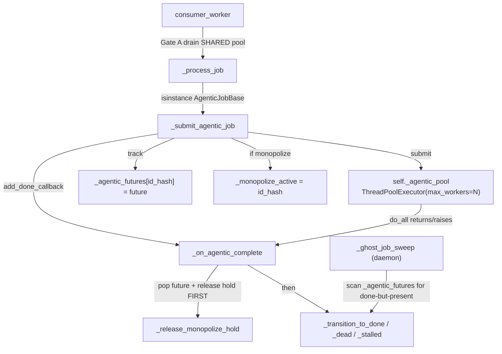

# Shape-B Hardening — Run a Monopolize Sweep OUTSIDE the Pool It Monopolizes (bug fe375cf6)

**Status**: DESIGN — awaiting plan-review (Mr. Radio 🦉)
**Author**: Clayton 😎 (session f99a25bf)
**Date**: 2026-07-11
**Bug**: `fe375cf6-3083-4369-baaf-041df0fe1f31` (P3, `correlation_key=monopolize-agentic-pool-deadlock`)
**Parent / prior art**: `3a14292b` Shape-A lineage pass-through (LANDED, commit `d28b496e`→merge `1622b9af`, `:8000` sweep `ts-dfc230a9` GREEN 314/0). Design: `src/rnd/v0.1.9/2026.07.11-monopolize-agentic-pool-deadlock-lineage-passthrough.md` §6–§7.
**Cross-links**: `67473d91` (pool-aware budget math — becomes exact); the `pool_max==1` belt this hardening eventually makes redundant.
**Branch (planned)**: fresh worktree off merged `wip-v0.1.9`.

---

## 1. TL;DR

Shape-A (landed) made the consumer's Gate B admit a monopolize sweep's **own spawned
children** through the intake hold — resolving the `ts-ad4670ec` deadlock at `pool_max=3`.
But the monopolizer still **occupies one shared-pool worker for its whole run**, leaving two
residual weaknesses:

1. **`pool_max==1` hard-deadlock** — on a width-1 pool a spawning monopolizer holds the only
   worker, so its children can never acquire one (Gate B admits them through *intake* but
   cannot conjure a *pool slot*). Shape-A guards this with a LOUD 422 belt
   (`assert_monopolize_pool_capacity`) — a refusal, not a fix.
2. **Children see `N-1`, not `N`** — with the monopolizer eating a slot, `67473d91`'s
   shared-pool wait-budget (sized to the full width `N`) is slightly generous-to-tight.

**Shape-B fix**: run the monopolizer on a **dedicated single-worker executor**, separate from
the shared agentic pool. It no longer consumes a shared-pool slot, so the full width `N` is
free for its children; `pool_max==1` becomes deadlock-safe; and the `67473d91` budget math
becomes exact.

**The crux (why this was deferred, not folded into Shape-A)**: the completion callback
(`_on_agentic_complete`), the monopoly-hold lifecycle (`_monopolize_active`), the ghost-job
sweeper, and the documented `get_pool_status` observability endpoint are all built around
**pool `Future` objects**. Moving the monopolizer to a different executor must preserve every
one of those invariants. This doc's core is proving it does.

**Recommended shape**: a **`ThreadPoolExecutor(max_workers=1)` dedicated to monopolize
jobs**, whose Futures are tracked in the **same `_agentic_futures` dict** — so one
ghost-sweep scan, one lock, and the existing callback all cover both executors unchanged.

---

## 2. The dispatch machinery today (post Shape-A merge)



Key invariants (all Future-centric — the load-bearing set Shape-B must preserve):
- **I1 (atomic submit+track+hold+callback)**: `_submit_agentic_job` does `submit()` +
  `_agentic_futures[id] = future` + set `_monopolize_active` + `add_done_callback` ALL under
  `_agentic_futures_lock` (`running_fifo_queue.py:390-402`), closing the fast-completion race.
- **I2 (release-before-transition)**: `_on_agentic_complete` pops the future then calls
  `_release_monopolize_hold` BEFORE transitioning (`:437-441`) — the ghost-sweeper's "still
  in `_agentic_futures` AND `Future.done()`" signal depends on pop-before-transition.
- **I3 (ghost sweep)**: `_ghost_job_sweep` scans `_agentic_futures` for done-but-still-in-
  running-queue and dead-letters them (also a hold-release path for a wedged monopolizer).
- **I4 (pool-status math — DOCUMENTED observability)**: `get_pool_status` counts
  `_agentic_futures` for `inflight`/`pending`; `/api/queue/pool-status` (JWT) is documented
  in CLAUDE.md §CJ Flow. See §4 — this is a first-class concern, not an afterthought.
- **I5 (Gate A/B on the SHARED pool)**: Gate A drains foreign writers from the shared pool
  before a monopolizer dispatches; Gate B admits lineage children to the shared pool.

---

## 3. The Shape-B design

### 3.1 A dedicated monopolize executor

In `__init__`, alongside `self._agentic_pool`:

```python
self._monopolize_pool = ThreadPoolExecutor(
    max_workers        = 1,                 # at most ONE monopolizer at a time (Gate B already serializes)
    thread_name_prefix = "MonopolizePool"
)
```

Rationale for an **executor** (not a raw `threading.Thread`): it yields a `Future`, so
`add_done_callback` → `_on_agentic_complete` and the ghost-sweeper both keep working
**unchanged**. A raw thread would force hand-rolled completion/hold-release and a second
ghost-sweep path — strictly worse (more forked invariants, the opposite of the goal).

### 3.2 Routing in `_submit_agentic_job`

The ONLY change to the submit seam: pick the executor by `monopolize`. Everything else
(tracking dict, hold-set, callback) is byte-for-byte identical.

```python
with self._agentic_futures_lock:
    is_mono = getattr( job, "monopolize", False ) and self._is_monopolize_enabled()
    pool    = self._monopolize_pool if is_mono else self._agentic_pool   # <-- the only new line
    future  = pool.submit( self._execute_agentic_in_pool, job )
    self._agentic_futures[ job.id_hash ] = future                        # SAME dict (I1/I2/I3 intact)
    if is_mono:
        self._monopolize_active = job.id_hash
    future.add_done_callback( lambda f, j=job: self._on_agentic_complete( j, f ) )
```

- **I1 preserved**: still one lock, one dict, one callback.
- **I2/I3 preserved**: the monopolizer's Future is in the SAME `_agentic_futures` dict, so
  `_on_agentic_complete` (pop→release→transition) and `_ghost_job_sweep` treat it identically
  — neither cares which executor produced the Future.
- `_execute_agentic_in_pool` is unchanged (it just calls `job.do_all()`).
- **NEW correctness invariant (single-read atomicity)**: `is_mono` is read ONCE, under
  `_agentic_futures_lock`, and that single value decides BOTH the executor routing AND whether
  the hold is set. Pre-Shape-B the kill-switch (`_is_monopolize_enabled()`) was read only for
  the hold-set; folding routing into the same read guarantees routing and hold can never
  DISAGREE on a mid-flight INI flip of `cj flow monopolize enabled` — you can never get a job
  routed to the dedicated executor without its hold set, or vice versa. (A stale-read split
  would be a latent bug: a monopolizer on the dedicated executor with no hold would let foreign
  jobs flood the shared pool during its run, or a hold with no dedicated routing would recreate
  the exact `pool_max==1` deadlock Shape-B removes.)

### 3.3 Gate A / Gate B — unchanged mechanism, better math (I5)

- **Gate A** (`await_monopolize_pool_drain`) still drains the SHARED pool of foreign writers
  before the monopolizer dispatches — unchanged. (The monopolizer going to its own executor
  doesn't change the need to quiesce foreign shared-pool writers first.)
- **Gate B** still admits lineage children to the SHARED pool. Now the monopolizer occupies
  **zero** shared-pool slots, so children get the **full width `N`** — the direct fix for the
  `pool_max==1` deadlock and the `N-1` budget skew.

### 3.4 Shutdown

`shutdown_pool` (and any teardown) must also shut down `self._monopolize_pool` — one added
line next to the existing `self._agentic_pool.shutdown(...)`.

---

## 4. `get_pool_status` semantics — FIRST-CLASS (documented observability, steer #1)

`/api/queue/pool-status` (JWT) is **documented observability** (CLAUDE.md §CJ Flow: returns
`{inflight_agentic_jobs, max_agentic_workers, pending_in_pool, ...}`). Under Shape-B the
monopolizer's Future lives in `_agentic_futures` but is **NOT a shared-pool worker**. If we do
nothing, `inflight_agentic_jobs` would silently start counting a non-pool job — the UI would
show `N+1` running on an `N`-worker pool and the invariant `running = inflight - pending`
would break. **The number must not silently change meaning.**

**Design**: classify by "is this the active monopolizer?" and keep the shared-pool counts
pure, surfacing the out-of-pool monopolizer as its OWN explicit field.

```python
with self._agentic_futures_lock:
    mono_id  = self._monopolize_active
    inflight = sum( 1 for h, f in self._agentic_futures.items()
                    if not f.done() and h != mono_id )        # SHARED pool only
    pending  = sum( 1 for h, f in self._agentic_futures.items()
                    if not f.running() and not f.done() and h != mono_id )
payload[ "inflight_agentic_jobs" ] = inflight                 # meaning UNCHANGED: shared-pool inflight
payload[ "max_agentic_workers" ]   = self._pool_max_workers   # unchanged (shared pool width)
payload[ "pending_in_pool" ]       = pending
payload[ "monopolize_inflight" ]   = mono_id is not None      # NEW explicit field
payload[ "monopolize_id" ]         = mono_id                  # NEW (None when no monopolizer)
```

- `inflight_agentic_jobs` **keeps its exact prior meaning** (shared-pool inflight) — no
  consumer breaks, the number never silently absorbs the monopolizer.
- **At most ONE monopolizer can ever be in `_agentic_futures`** (plan-review note, Mr. Radio):
  a second monopolize job can never pollute the shared `pending`/`inflight` count because
  Gate B defers it at INTAKE (its predicate rejects a `monopolize` job) — it never reaches
  `_submit_agentic_job` / `_agentic_futures` while the first holds. So the single-`mono_id`
  exclusion above is complete; there is no "set of monopolizers" to subtract.
- The out-of-pool monopolizer is observable via the NEW fields — strictly additive.
- **Doc touchpoint (MANDATE)**: CLAUDE.md §CJ Flow "Observability" line + `src/docs`
  pool-status reference (if any) get the two new fields. Additive keys → no breaking change to
  existing readers, but the docs must name them so the endpoint stays authoritative.

**D3 (open)**: minimal `monopolize_inflight` bool + `monopolize_id` (recommended) vs a nested
`{id, started_at}` object. Recommend the flat pair to minimize churn on pool-status readers.

---

## 5. The belt (`assert_monopolize_pool_capacity` + 422) — DECISION D1 (argued, steer #3)

Shape-A's `pool_max==1` belt exists ONLY because the monopolizer consumed the sole pool slot.
Under Shape-B the monopolizer is out-of-pool, so a width-1 shared pool safely runs children
(1-at-a-time, never deadlocked). **The belt becomes redundant** — but "redundant" is not
"safe to remove now." The argument, both sides:

**Case for REMOVE-now**: the guarded deadlock is structurally impossible under Shape-B, so a
live 422 on a width-1 monopolize submit becomes a **false-negative** — it refuses a request
that is now perfectly safe. Net LOC decrease; the belt's tests migrate to Shape-B's
deadlock-safety test.

**Case for KEEP-at-first-landing** (Mr. Radio's prior; **I adopt it as the recommendation**):
**prefer-reversible**. A redundant 422 costs ~nothing (it only ever fires on `pool_max==1`,
which prod never runs a monopolize sweep on, and the `:8000`/`:7999` venues are width-3 so it
never fires there). A **premature removal costs a deadlock** if Shape-B has any latent
defect — the belt is the exact safety net for the failure mode Shape-B is claiming to
eliminate, so removing it in the same change that introduces the new dispatch path removes the
net precisely when the risk is highest. The correct sequence is: **land Shape-B WITH the belt
retained → earn an `:8000` (and in-process `pool_max=1`) green for the outside-pool path →
THEN remove the belt in a dedicated follow-up** once the safety is proven, not asserted.

**Recommendation: KEEP the belt at first landing; file belt-removal as a follow-up gated on
Shape-B's own `pool_max=1` green.** Note the one wrinkle this creates: with the belt retained,
a width-1 monopolize submit via `routers/test_suite.py` still 422s, so the width-1
deadlock-safety proof must come from the **in-process rig** (which bypasses the router), not a
live `:8000` width-1 submit. That is fine and even preferable (deterministic). Ruling yours.

---

## 6. Failure-containment analysis (the crux, expanded)

| Scenario | Containment under Shape-B |
|---|---|
| **Fast-completing monopolizer Future fires callback before tracked** | I1 preserved — submit+track+callback still atomic under `_agentic_futures_lock`; RLock still permits the same-thread synchronous-callback re-entry. |
| **Ghost-sweep vs monopolizer** | Monopolizer Future is in `_agentic_futures`; the sweeper's "done-but-present" check + `_release_monopolize_hold`-from-sweeper path both work unchanged — they key on Future state + id, not executor. |
| **Monopolizer wedges (never returns)** | Same as today: ghost-sweeper dead-letters it and releases the hold via `_release_monopolize_hold`. The dedicated executor's single worker is then free for the next monopolizer. |
| **Two monopolizers** | `max_workers=1` on the dedicated executor serializes them at the executor; Gate B already serializes at intake (a 2nd monopolizer is not a lineage child → deferred). Belt-and-suspenders. |
| **Nested monopoly (a child sets monopolize)** | Unchanged from Shape-A: Gate B's predicate (`not monopolize`) defers it; if it ever dispatched it would route to the dedicated executor and set its own hold — but it never dispatches while the parent holds. |
| **pool-status accuracy** | §4 classification excludes the monopolizer from shared-pool inflight so the UI math (`running = inflight - pending`) stays correct; the monopolizer is observable via the additive fields. |

---

## 7. Test plan (all layers — worktree-honest, RED-first)

### 7.1 Unit (`:7999`)
- `_submit_agentic_job` routes a monopolize job to `_monopolize_pool` and a non-monopolize job
  to `_agentic_pool` (assert via patched executors / distinct thread-name prefixes); both
  still tracked in `_agentic_futures`, both get the callback, hold set only for mono.
- `get_pool_status` excludes the active monopolizer from `inflight`/`pending`, surfaces
  `monopolize_inflight`/`monopolize_id`, and `inflight_agentic_jobs` retains prior meaning.
- Ghost-sweeper dead-letters a wedged monopolizer whose (dedicated-executor) Future is done —
  hold released.
- Shutdown shuts down BOTH executors.
- 100% coverage (line+branch+function) on the changed dispatch surface.

### 7.2 In-process assembly (`:7999`, the load-bearing proof)
- Extend the Shape-A rig (`test_monopolize_lineage_inprocess.py` pattern): build a real
  `RunningFifoQueue` with **`pool_max=1`** (the previously-deadlocking width) + the real
  dedicated monopolize executor + the real consumer. A monopolize parent spawns children;
  assert **children dispatch and complete on the width-1 pool** (the case the belt refuses)
  and the parent completes + releases — proving `pool_max==1` is now deadlock-safe. This is
  the regression guard standing in for the (retained-for-now) belt.
- Assert the monopolizer occupies ZERO shared-pool slots (children get the full width).

### 7.3 `:8000` E2E (scheduled, coordinated with Mr. Radio)
- A `ts-ad4670ec`-shape width-3 integration sweep still GREEN (regression: Shape-B must not
  undo Shape-A's `ts-dfc230a9` result). This is the outside-pool path's OWN `:8000` green —
  the gate on the later belt-removal follow-up (§5).

---

## 8. Files touched (implementation manifest — provisional; belt RETAINED per §5 recommendation)

| File | Change |
|---|---|
| `src/cosa/rest/running_fifo_queue.py` | dedicated `_monopolize_pool` in `__init__`; executor-pick in `_submit_agentic_job`; `get_pool_status` monopolizer exclusion + new fields; shutdown both pools |
| `src/cosa/tests/unit/rest/test_running_fifo_queue.py` | executor-routing + pool-status + ghost-sweep-of-monopolizer + shutdown tests |
| `src/cosa/tests/unit/rest/test_monopolize_lineage_inprocess.py` (or a sibling) | `pool_max=1` deadlock-safety assembly test |
| CLAUDE.md §CJ Flow "Observability" (+ any `src/docs` pool-status ref) | document the 2 new pool-status fields |
| `src/rnd/v0.1.9/…` (this doc) + README index | docs |
| *(follow-up, NOT this change)* belt removal in `running_fifo_queue.py` + `routers/test_suite.py` + their tests | gated on Shape-B's `:8000` green (§5) |

**Config**: no new INI keys. `cj flow max concurrent agentic jobs` now governs children ALONE
(the monopolizer is out-of-pool).

---

## 9. Open questions for plan-review

1. **D1 — belt disposition**: recommendation is KEEP at first landing, remove in a follow-up
   gated on Shape-B's own `:8000` green (§5, adopting your prior on prefer-reversible grounds).
   Confirm, or rule remove-now.
2. **D2 — dedicated executor lifecycle**: eager in `__init__` (recommended, symmetric with
   `_agentic_pool`, one idle thread) vs lazy on first monopolize submit (saves a thread on
   never-monopolize servers but adds a lazy-init race). Recommend eager.
3. **D3 — pool-status field shape**: flat `monopolize_inflight` bool + `monopolize_id`
   (recommended) vs nested object.
4. **D4 — `:8000` proof scope**: is the in-process `pool_max=1` rig the sufficient proof for
   the width-1 deadlock-safety (with `:8000` re-confirming only the width-3 regression), given
   the retained belt 422s a live width-1 submit? Recommend yes.
