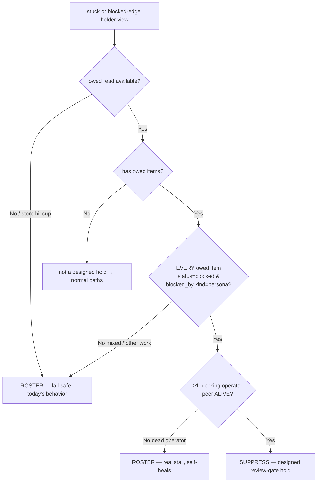

# Arbiter: distinguish a DESIGNED review-gate hold from a real stall (bug cec10ef9)

**Date**: 2026-07-12
**Author**: Krishna 🦚 (author, mgr Mr. Radio 🦉)
**Branch**: `wip-v0.1.9-2026.06.21-bug-fix-implementation`
**Bug**: `cec10ef9` (P3, lupin; post-game R3 2026-07-11 agy-runtime SWE build §3/§4/§6)
**Scope fence**: one layer ABOVE `ce13b134` (Clayton's blocker-cc dedup). This fix does
NOT touch the dedup key / cooldown — dedup throttles *re-announces*; this suppresses the
*announce itself* of a designed hold.
**Status**: ✅ IMPLEMENTATION COMPLETE — APPROVED by Mr. Radio (2026-07-11, both open Qs ruled); RED-first built, 100% L/B/F on touched code, full arbiter suite green. COMMIT-HELD for Mr. Radio's firsthand review; `:8001` bounce is his to execute (proposed at close).

---

## TL;DR

The heartbeat arbiter's manager-tap announce path cannot tell a **designed review-gate
hold** (a worker legitimately `blocked_by` the gate-operator persona, holding for
reviewer/tester double-green) from a **real stall**. So a worker parked in a legitimate
hold is DMed to its manager as `Stuck: <worker>`. On 2026-07-11 this fired 3× for Rio
(item `ca8d6a19`, `blocked_by` Sam as review-gate operator) — Sam and Rio each had to
manually discount it.

**Fix**: give the announce path the per-poll **authoritative store owed read** (already
fetched at `arbiter_job.py:1236`) and suppress a worker from the attention roster when
**every** one of its non-terminal owed items is a store-backed review-gate hold on a
**live** peer. Fail-safe in every uncertain direction (store hiccup, dead operator, mixed
owed work → keep rostering — never hide a real stall).

---

## Verify-first (mandatory clause — DONE)

The arbiter-FP family has shipped many fixes since 2026-07-03, and the dedup fix
(`ce13b134` → `ad0f6199`) went LIVE at the 00:28Z bounce. Per the bug's mandatory
verify-first clause I confirmed the FP still reproduces on **current** code BEFORE
designing.

**Repro** (`src/tests/unit/test_arbiter_review_hold_fp_repro.py`, 3 pure `:7999`-eligible
tests, all PASS = FP live):

| # | Assertion (current buggy behavior) | Proves |
|---|---|---|
| 1 | `_item_is_user_gated({status:blocked, blocked_by:[{kind:persona,id:sam}]})` → **False** | The classifier honours only `gate_class=operator` / `blocked_by kind=user`; a peer review-gate hold falls through to ACTIVE — blind spot. |
| 2 | `_attention_workers(...)` rosters a `stuck=True` holder-on-a-live-peer | The `stuck` short-circuit (`arbiter_job.py:2390`) fires BEFORE the live-peer exclusion, and the method takes **no** owed/store arg — no seam to consult a hold signal. |
| 3 | `_tap_managers(...)` emits an advisory body containing `Stuck: Rio` | Reproduces the exact ground-truth `ca8d6a19` FP end-to-end. |

**Conclusion**: FP CONFIRMED live → proceed to design (this doc). The repro file is
diagnostic-only (asserts the *current* behavior); it is superseded by the RED-first fix
tests below and will be removed when the fix lands.

---

## Root cause

`_attention_workers( fleet_view, graph, now, bridge_mtimes )` builds the manager-tap
attention roster. Two paths add a worker:

```python
if view.get( "stuck" ):
    out.append( view ); continue        # (A) UNCONDITIONAL — the bug
persona = view.get( "persona" )
if persona not in holders: continue
if persona in cycle_personas or graph["edges"].get( persona ) not in alive_personas:
    out.append( view )                  # (B) blocked-edge holder, live-peer exclusion
```

- **Path (B)** already embodies the right principle (bug `bbce7e2f`, 2026-06-30): a
  non-stuck holder waiting on a **live** peer is a legit in-flight dependency → EXCLUDED.
- **Path (A)** bypasses (B) entirely. `stuck` is the **activity-axis** signal (`fleet_data_model.py:438` — repeated `cap_reached` + work-owed). A worker idling inside a
  legitimate review-hold can accrue that signal, and then (A) rosters it *unconditionally*,
  with no consultation of *why* it is idle.

The announce path has **zero** access to the authoritative store `blocked_by` graph. So a
designed hold (a real store row `status=blocked, blocked_by=[{kind:persona,id:<operator>}]`)
is invisible to it.

### Why this is DISTINCT from the 00:42Z "Blocked: maria" data point (Mr. Radio)

The 00:42Z advisory named `maria` with **zero** store-backed blocked rows. That line comes
from a **non-stuck** attention member — for a persona with no store `blocked_by` row it can
only originate from a **stale activity-derived `holding_on: peer:` edge**, i.e. a
session-hold misread, NOT the store-backed designed-hold defect here. This design keys
strictly on the **authoritative store owed read**, so it neither fixes nor masks that case.
**Recommendation: file the 00:42Z stale-edge case as a SEPARATE accuracy bug — do not absorb
it into cec10ef9.**

---

## Fix design

### The signal = an authoritative store `blocked_by`-a-live-peer row

No new store schema, no new worker write-path. A worker that legitimately holds for review
**already** writes the row the store demands (`task_transition(to_status="blocked",
blocked_by=[{kind:"persona", id:<operator>}], next_chase_ts=...)`). That row **is** the
declared hold. The arbiter simply reads it (it already does, per poll) and respects it.

Discriminator, mirroring the existing `_classify_owed` "every owed item is Rick-gated"
idiom — a persona is a **designed-holder** iff:

1. it has ≥1 non-terminal owed item, AND
2. **every** such item is a review-gate hold: `status=="blocked"` AND `blocked_by` carries
   ≥1 typed ref `{kind:"persona"}` (a peer operator), AND
3. **at least one** blocking operator peer is **ALIVE** (reuse the `alive_personas` /
   bridge-fresh set already computed inside `_attention_workers`).

If all three hold, the worker is holding *by design* on a live reviewer → **suppress** it
from the attention roster (both the `stuck` short-circuit and the blocked-edge path).



### Why fail-safe in each uncertain direction

| Situation | Behavior | Rationale |
|---|---|---|
| owed read is `None` (store outage / seam unwired) | ROSTER (today's behavior) | observer invariant — never manufacture suppression from a failed read |
| blocking operator peer is **dead** | ROSTER | the hold has become a genuine stall; the existing dead-peer / live-peer exclusion logic already wants this |
| worker has OTHER non-hold owed work too | ROSTER | a real stall on that other work must not be hidden (matches `_classify_owed` "every item" idiom) |
| worker holds on a **live** operator | SUPPRESS | the ONLY case being fixed — a legitimate designed hold |

Self-healing: if the operator later goes dark, the next poll flips E→No → the worker
re-enters the roster automatically. No sticky state.

### Plumbing (minimal, local — one poll scope)

1. **`_designed_hold_personas( owed_items )`** (new, pure): returns the set of canonical
   persona keys satisfying (1)+(2) above from the per-poll owed map; `None`/empty → empty
   set (fail-safe). Aliveness (3) is applied inside `_attention_workers` where the
   `alive_personas` set already lives.
2. **`_item_is_review_gate_hold( item )`** (new, pure, static): the (2)-predicate —
   `status=="blocked"` AND ≥1 `blocked_by` ref `{kind:"persona"}`; non-dict/malformed →
   False. Deliberately NARROW and SEPARATE from `_item_is_user_gated` (that stays the
   Rick-gate predicate — untouched, Mr. Radio's court).
3. **`_attention_workers(..., designed_hold_personas=None)`**: before appending a `stuck`
   or blocked-edge view, if its persona ∈ `designed_hold_personas` AND ≥1 of its store
   blockers ∈ `alive_personas` → skip (suppress). `None` → no suppression (fail-safe).
4. **`_tap_managers(..., designed_hold_personas=None)`**: thread-through only.
5. **Call site `arbiter_job.py:1297`**: compute `designed_hold_personas =
   self._designed_hold_personas( owed_items )` (from the existing `owed_items`,
   line 1236) and pass it into `_tap_managers`. One-read discipline preserved — no new
   store call.

**Blast-radius sweep**: `_attention_workers` and `_tap_managers` are called only from the
poll (`arbiter_job.py:1297`, `:2527`). Both gain an optional keyword defaulting to `None`
(= today's behavior), so no other caller changes. Grep-confirmed during implementation.

### What is explicitly NOT touched

- Clayton's `_blocker_cc_key` / `_auto_ping` cc-dedup gate / `manager_advisory_cooldown_seconds` (the layer below).
- `_item_is_user_gated` and the `_classify_owed` BLOCKED_ON_USER path (the Rick-gate layer).
- The blocker **ping** backoff (a silent blocker SHOULD keep being nudged — unrelated).

---

## Tests (RED-first, all `:7999`-eligible / pure)

| Layer | File | Tests |
|---|---|---|
| Unit — predicate | `test_arbiter_routing.py` (new class) | `_item_is_review_gate_hold`: True (persona-blocked) · False (user-gated / operator-gate / queued / non-blocked / malformed / None) |
| Unit — set builder | `test_arbiter_routing.py` | `_designed_hold_personas`: all-owed-are-holds → included · mixed owed → excluded · empty/None → empty (fail-safe) · canonical-key normalization |
| Unit — roster | `test_arbiter_routing.py` | `_attention_workers`: designed-hold on LIVE peer → **suppressed** (the fix) · on DEAD peer → rostered (real stall) · mixed owed → rostered · `designed_hold_personas=None` → rostered (fail-safe = today) |
| Unit — E2E advisory | `test_arbiter_routing.py` | `_tap_managers`: NO `Stuck: Rio` advisory for a live-peer designed hold; a genuinely-stuck worker (no hold) STILL announced (no over-suppression) |

**RED-first proof**: each fix test written to FAIL against current code first (the
`test_arbiter_review_hold_fp_repro.py` trio already demonstrates the pre-fix behavior),
then GREEN after the change. Diagnostic repro file removed once the fix tests are in.

**Coverage gate**: 100% lines/branches/functions on every touched function
(`_designed_hold_personas`, `_item_is_review_gate_hold`, the `_attention_workers` /
`_tap_managers` deltas). Full arbiter/heartbeat unit suite must stay green (no regressions).

---

## Rollout / operational

- No INI knob (matches the "smallest blast radius" precedent of `ce13b134`). If a future
  false-suppression emerges, an explicit worker-written annotation ("declared gate-hold,
  not-a-stall" per the post-game literal wording) is a trivial strengthening follow-up —
  noted, NOT built here.
- Arbiter `:8001` bounce to land the fix is **Mr. Radio's authority** — I propose, never
  execute. COMMIT-HELD until his APPROVE.

## Open questions for APPROVE — RULED (Mr. Radio, 2026-07-11)

1. **Suppress-all-paths vs stuck-only?** → **BOTH paths, uniform rule.** "A designed hold
   is a designed hold whichever detector leg surfaces it, and the blocked-edge advisories
   are exactly what spammed me tonight." Implemented uniformly in `_attention_workers`
   (one suppression gate before both append sites), with the deadlock-cycle exemption
   preserving mutual-stall detection.
2. **File the 00:42Z stale-`holding_on`-edge case separately?** → **YES.** Filed as P3
   `1ff7be20` (owner + accountable Mr. Radio), citing this harness evidence; NOT absorbed.

---

## Implementation record (2026-07-11)

**Code** (`arbiter_job.py`, one file):
- New static `_item_is_review_gate_hold( item )` — the narrow (2)-predicate (`status=="blocked"`
  + ≥1 `blocked_by` `{kind:"persona"}`), separate from `_item_is_user_gated` (untouched).
- New static `_designed_hold_personas( owed_items )` → `{canonical_persona_key:
  frozenset(canonical operator keys)}`; every-item-a-hold + ≥1 known operator; `None`/empty → `{}`.
- `_attention_workers( ..., designed_hold_personas=None )` — one suppression gate before
  BOTH append legs: suppress iff persona ∈ dhp AND its operator set intersects the
  canonicalized `alive_keys` AND the persona is NOT a deadlock-cycle member; emits an
  observable `arbiter_designed_hold_suppressed` journal event.
- `_tap_managers( ..., designed_hold_personas=None )` — thread-through.
- Poll call site (`:1297`) computes `designed_holds = self._designed_hold_personas( owed_items )`
  from the existing per-poll owed read and passes it. One-read discipline preserved.

**Blast-radius sweep**: both signatures gained an optional kwarg defaulting to `None`
(= today's behavior); grep-confirmed the only callers are the poll (`:1297`) and
`_tap_managers → _attention_workers` (`:2527`). No other caller changed.

**Tests** (`src/tests/unit/test_arbiter_review_hold_suppression.py`, 20 pure `:7999`-eligible):
predicate truth table (6) · set-builder incl. mixed-excluded / None-failsafe / id-less-omitted
/ junk-ref-skip (7) · `_attention_workers` both legs + all fail-safes: live-op suppressed,
dead-op rostered, non-holder rostered, `None` preserves today, blocked-edge live-op
suppressed, deadlock-cycle never suppressed (6) · `_tap_managers` E2E: no `Stuck: Rio` for a
hold, genuine stuck still announced (2). RED-first verified (18→20 all failed pre-fix on
missing helpers/kwarg). The diagnostic `test_arbiter_review_hold_fp_repro.py` was removed
(superseded).

**Coverage / regressions**: `arbiter_job.py` **100%** lines/branches/functions (1466 stmts /
580 branch, 0 miss) across the complete arbiter/heartbeat unit suite — **1857 passed, 0
failures**.

**Residual (COMMIT-HELD)**: awaiting Mr. Radio's firsthand review (he runs the tests +
coverage himself); the `:8001` bounce to land it is his to execute — proposed at close.
