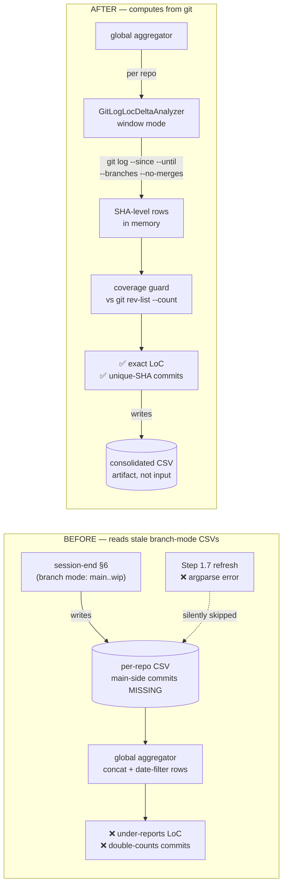

# LoC Roll-up: Branch-Agnostic Window + Commit De-duplication

**Date**: 2026-07-13
**Author**: Mr. Radio 🦉 (Lupin session `cec2ec5b`)
**Reporters** (cite the ARTIFACT, not the person — see § "Attribution is an oracle too"):
`bbff93a3` filed by `maria 15064faa` · `37a8beeb` filed by `maria 06ecf3bd` (a *different* session of the same persona). `accountable_manager` on both: María 🌸 (PIP, `15064faa`).
**Store bugs**: `bbff93a3` (P2, under-report) · `37a8beeb` (P2, double-count + drift)
**Status**: design ratified with reporter → implementation

---

## TL;DR

The cross-repo LoC roll-up has been reporting numbers that are **self-consistent and
confidently wrong**. Three defects compound:

| # | Defect | Effect |
|---|---|---|
| **A** | Roll-up consumes **branch-mode** CSVs (`main..<branch>`) | Any commit reachable from `main` is on the baseline side of the range → **structurally uncountable**. skills-distillation under-reported by exactly 1,607 lines (36% of the repo's entire existence). |
| **B** | The Step 1.7 "refresh stale CSVs" command **cannot run** | `--branch` and `--since` are in an argparse mutually-exclusive group → hard error. Step 4's failure table degrades a failed refresh to *"proceed with the stale CSV"* → **it fails into staleness, quietly**. This is why defect A persists across re-runs. |
| **C** | Aggregator **sums** the per-`(date, file_type)` `commits` column | A commit touching python + markdown counts twice. 86 reported vs 63 actual (~37% over-count). |

**The fix**: the roll-up computes from **git**, not from stale CSVs. One change closes all three.

> **⚠️ One reported defect did NOT survive verification.** Bug `37a8beeb`'s **D2** ("LoC drift
> ~1,071 added / 11 commits — a 2026-07-08 lupin row raw git does not produce") is **NOT a bug**.
> That row is **legitimate work**: 8 real commits authored 2026-07-08 totalling exactly
> **+1,071 / -55**, which the CSV reproduces to the line. The reporter's raw-git baseline
> excluded 07-08. The "11 commits" in that row is not drift — it is **defect C showing up again**
> (the file-type sum: 3+4+1+1+1+1 = 11; true unique = 8). Full receipts in
> § "D2 does not reproduce" below. **lupin's aggregator LoC was correct all along**; only its
> commit count was wrong.

---

## Root cause, receipts-first

### A — the branch-delta range excludes main

`GitLogLocDeltaAnalyzer._resolve_range()` (`analyzer.py:128-167`) builds `rev_range =
f"{base}..{branch}"` in branch mode. `git log main..wip-x` yields commits on `wip-x`
**not yet on** `main`. Work that landed *on* main is on the baseline side — excluded by
construction, forever, no matter how often the roll-up re-runs.

Receipts (`google/skills-distillation`, branch `wip-2026.07.12-evaluation-first`):

```
CSV / branch-mode range   → added=3016 deleted=190   (net +2,826)
git log main..wip-…       → added=3016 deleted=190   ← the CSV is EXACTLY RIGHT for the range it measures
git log (full, from HEAD) → added=4623 deleted=190   (net +4,433)  ← ground truth
git log main              → added=1607 deleted=0     ← equals the gap, to the line
```

The gap is one commit: `2568f6f` *"Phase 1: two-stage form-induction core"* (+1,607/-0),
pushed straight to `main` in a fresh repo.

**Sharpened during triage**: `git merge-base --is-ancestor 2568f6f HEAD` → **YES**. That
commit *is* reachable from the WIP branch. So a plain date-windowed log from HEAD already
returns the truth:

```
git log --since=2026-07-08 --until=2026-07-14 --numstat   → added=4623 deleted=190  ✅
```

The date-window plumbing was not merely unused — in this case it would have been *correct*.
Which makes defect B the load-bearing one.

**Generalizes to**: fresh repos · main-only repos · any repo whose WIP branch was cut after
work already landed. It under-reports **silently**.

### B — the refresh step is unrunnable (new finding, 2026-07-13)

`workflow/loc-delta-global.md` Step 1.7 documents the pre-aggregation refresh as:

```bash
python -m cosa.repo.run_git_loc_delta --branch <branch> --since <since> --until <until>
```

Executed verbatim:

```
run_git_loc_delta: error: argument --since: not allowed with argument --branch
```

`--today` / `--since` / `--branch` sit in an argparse **mutually-exclusive group**
(`run_git_loc_delta.py:81-99`). The documented refresh command has **never been runnable**.

Compounding it, Step 4's failure table says a failed refresh should *"log a per-repo warning
+ proceed with the stale CSV"*. So the failure mode is: refresh explodes → warning → **stale
CSV is used anyway**. The CSVs the roll-up reads have therefore **never** been date-window
refreshed by this path — they carry whatever range the last session-end happened to run in
(branch mode). **This is the mechanism by which defect A survives every re-run.**

**Sub-defect**: even if argparse permitted the combination, `_resolve_range()` **discards**
`since`/`until` in branch mode — it returns `(None, None, rev_range, branch)`. The
`since=null / until=null` María spotted in the sidecar *is that discard, made visible*.

### D2 does not reproduce — the "phantom row" is real work

Bug `37a8beeb`'s D2 alleged a stale/phantom 2026-07-08 lupin row (+1071/-55, 11 commits) that
raw git would not produce. **It reproduces exactly.** There are 8 real commits authored
2026-07-08 on lupin (`fc957809`, `d8841a0e`, `fbca168a`, `576aadd6`, `f5b24286`, `fcd0e257`,
`3b208f65`, `f325b31d`):

```
git log --no-merges --branches (author-date 2026-07-08) → 8 commits, added=1071 deleted=55
CSV rows for 2026-07-08                                 →            added=1071 deleted=55  ✅ to the line
CSV `commits` column, summed across file types          → 3+4+1+1+1+1 = 11                  ← defect C, not drift
```

And lupin's window total is **not** drifting: the aggregator's `+8,931 / -2,865` matches raw git
(`HEAD`, `main..HEAD`, and `--branches` all agree — 37 commits, +8931/-2865). The baseline
recorded in **`37a8beeb`'s body** (`"GROUND TRUTH for the window (raw git, --no-merges): lupin
+7,860/-2,810 (29 commits) ... Fleet: +12,658 / -3,158 = net +9,500 across 55 commits"`) is short
by exactly those 8 commits — it excluded 07-08.

**Conclusion**: lupin's LoC was **correct all along**; only its commit count was wrong (defect C).
D2 is withdrawn. Recording it because it is the same failure mode as the bug itself, one level up:
**an oracle you did not verify is not ground truth.** The coverage guard below exists so that
neither the tool nor its reviewer has to be trusted on faith.

### The over-count I nearly shipped: a worktree is not a repo

**Found AFTER the fix was committed**, from María's PIP-side discovery work — and it lands
on *this* module, not just on her snippet.

The old discovery predicate was *"has this repo run our tooling?"* (glob for
`io/git-loc-delta/*.csv`). The new one is *"ask git."* That is strictly better — it found
`google/harvey-labs`, +1,121 lines in-window, a repo the CSV-glob was **structurally
incapable of seeing**, second instance of the skills-distillation class. But asking git
finds *everything git knows about*, and lupin has **13 worktrees**.

A worktree's `.git` is a **file**, not a directory, and it **shares the parent's object
database and refs**. So a date-windowed `--branches` walk *inside a worktree* returns
**the parent's commits, in full**. Probed against the live repo:

```
--repos lupin                    → +11,407 / -3,803 ·  40 commits
--repos lupin <one worktree>     → +22,814 / -7,606 ·  80 commits   ← EXACTLY DOUBLED
```

With all 13 discovered, lupin's LoC multiplies by ~14. **I would have traded the original
under-count for a far worse over-count** — the identical failure (a silent, self-consistent,
confidently-wrong number), inverted. My `_is_git_repo()` used `os.path.exists(".git")` and I
had *documented* the worktree case as acceptable: *"dir for a normal clone, file for a
worktree."* I wrote the invitation myself.

**The guard is repository IDENTITY, not a filesystem check.** A `.git`-must-be-a-directory
rule works, but it is a rule about one layout. `git rev-parse --git-common-dir` answers the
real question: *two paths that resolve to the same common dir share an object DB and a ref
namespace — they are the SAME REPOSITORY seen from two places.* That one rule also catches
symlinked roots, bind-mounted duplicates, and `--repos . $(pwd)`.

A second path claiming a seen identity is now skipped with a loud warning naming the first.
Verified: lupin + all 13 worktrees → `+11,407 · 40 commits · repos=['lupin']`, identical to
lupin alone.

#### Addendum: a dedup guard must not fail OPEN (María, after the fix shipped)

My first identity guard degraded **fail-open**: if `git rev-parse --git-common-dir` couldn't
name the repo, analyze it anyway — *"never silently drop a real repo."* María probed the
degradation and found the hole.

lupin has **7 orphaned worktrees** (admin dir pruned). On those, `--git-common-dir` **fatals**.
They contribute zero — but **only because `git log` fatals on them too.** Reproduced exactly:

```
healthy worktree   → --git-common-dir OK,    git log OK      (deduped ✅)
orphaned worktree  → --git-common-dir FATAL, git log FATAL   (zero, BY COINCIDENCE)
```

The safe outcome came from **two independent failures happening to coincide**, not from any
property of the design. **The dangerous quadrant — identity unknowable, but `git log` works —
is empty today by luck** and reachable in principle (an older git, a permissions quirk, a
copied-not-cloned tree). There, fail-open means *analyze the duplicate* → double-count.

Her structural point, which is the correction:

> **For a DEDUP guard, fail-open fails toward the OVER-count.** Dropping a repo is
> **visible** — a name missing from a four-row table. Double-counting one is **invisible,
> self-consistent, and confidently wrong.** "Never silently drop" is the right instinct for a
> **discovery filter**; de-duplication has the **opposite** safe direction. I built 1b with
> the discovery instinct and shipped the wrong failure mode — in a module that had already
> shipped that exact failure, in both directions, the same day.

**Fix**: when identity is unknowable, fall back to the **git-free** test — María's GUARD 1,
adopted into the CLI as a *fallback identity signal*, not as defense-in-depth:

- **`.git` is a FILE** → a **linked checkout**. It shares another repo's objects and refs *by
  construction* and can never be distinct → **SKIP**, loudly.
- **`.git` is a DIRECTORY** → a genuine root → **analyze**, but **say out loud** that identity
  was unverifiable, so an un-nameable path can never quietly become a duplicate.

The two tests are **complements, not redundancy**: identity is stronger wherever git answers;
the filesystem test is the one that works when git *won't*. Verified: lupin + all 19 worktrees
+ an orphan → `+11,648 · 42 commits · repos=['lupin']`, identical to lupin alone.

**The lesson, and it is the day's sharpest**: *widening a predicate widens what it lets in.*
Both the under-count and the over-count came from the same place — a proxy standing in for
the real question. "Has a CSV" was a proxy for "is a repo with work." "Has a `.git`" is a
proxy for "is a distinct repo." **Replace a proxy and you inherit a new set of things it
lets through.** The fix is not a better proxy; it is asking the question you actually mean —
which is why the guard is identity, and why the coverage guard is an independent oracle.

### Attribution is an oracle too

A postscript, because I made this mistake *while writing up someone else's version of it.*

I withdrew `37a8beeb`'s D2 on the grounds that its author had trusted an oracle they never
re-derived. Then, describing that, I wrote **"the reporter's raw-git baseline"** — and in the
header I named the reporter as María. She read it and corrected me: she never produced a lupin
figure or a fleet baseline. Her report was scoped to skills-distillation and to the
`main..branch` mechanism.

Checking the artifact instead of my memory: the `+7,860 / -2,810 / 29 commits` line is in
**`37a8beeb`'s body**, and that row is stamped `created_by: maria 06ecf3bd` — the same *persona*,
a **different session** from the `maria 15064faa` that filed `bbff93a3` and is accountable on both.
So the number was filed under her name, by a session that is not her, and I collapsed the two into
"the reporter" without ever looking at the stamp.

**The rule that generalizes**: *an attributed number is an oracle.* "María's baseline" and
"+7,860" are the same species of claim — both feel like facts, both were inherited, neither was
re-derived. The fix is identical in both cases: **cite the artifact, not the person.** A store row,
a commit SHA, a file:line. Those can be re-read; a remembered attribution cannot.

I caught this failure mode in someone else and committed it in the same document, one paragraph
later. That is not irony, it's the base rate — which is exactly why the coverage guard above is a
*mechanism* and not a resolution to be more careful.

**Then it went one level deeper.** Told that the figure was stamped to her persona, María went and
read the row — and it *was* her: `maria 06ecf3bd`, a different session of the same persona. Her
"that's not mine" had itself been an unverified attribution, made in the very message correcting
mine. She donated the rule, and it belongs to her:

> **A persona is not a session. "I didn't say that" is a claim about a context you no longer have
> — go read the stamp.**

Absence of memory is not evidence of absence; it is just absence of context. A `/clear` boundary
is not an alibi. Two sessions of one persona can file contradictory claims under the same name,
and *neither will remember the other doing it*.

### Date basis: bucket on commit date, not author date

Latent trap found while reconciling D2. `git log --since/--until` filters on **committer date**,
but the parser labels each row with `%ad` — **author date** (`git_log_parser.py:91`). For a
rebased or cherry-picked commit these differ, so the window filter and the day-bucket disagree,
and a commit can land in a bucket outside the very window that selected it.

All 37 lupin commits in this window happen to have `author date == commit date`, so it is not
biting today — but it would silently corrupt any window containing rebased work, and it would
make the coverage guard below false-warn. Fixed by labelling with `%cd`, so **the filter basis
and the bucket basis are the same field**.

### C — the commits column is summed across file types

`DailyAggregator` counts, per `(date, file_type)` bucket, the **unique SHAs touching at least
one file of that type** (`daily_aggregator.py:98`). Correct per bucket. But
`run_git_loc_delta_global` then **sums** that column across buckets
(`run_git_loc_delta_global.py:279, 291, 299, 328`):

```python
"commits": int( repo_group[ "commits" ].sum() )   # ← a commit touching .py + .md counts twice
```

The CSV carries **no SHA column**, so this is **structurally un-dedupable post-hoc**. No
amount of regenerating CSVs reaches it — which is why defect A's fix alone is not sufficient.

---

## Design

### The pivot: compute from git, not from CSVs

`run_git_loc_delta_global` currently never invokes git. It globs each repo's
`io/git-loc-delta/*-loc-delta.csv`, concatenates, and date-filters **rows that already exist**.
A date filter cannot add back commits the CSV never saw. The roll-up inherits whatever range
the last session-end happened to run in.

**Change**: the global tool invokes `GitLogLocDeltaAnalyzer` per repo, in a date-windowed,
branch-agnostic mode. CSVs demote from *source of truth* to *cache / artifact*.



### Why `--branches` (all local refs), not HEAD

`git log --since --until --branches` walks the **union of all local branch refs**, and git
de-duplicates the DAG walk — each commit appears exactly once. This is the question the
roll-up actually asks: *"what work happened in window W?"*

For skills-distillation, HEAD and `--branches` both yield 4623/190 (the WIP branch descends
from main). They **diverge** when `main` moved on after the WIP branch was cut — precisely the
case that bit us. `--branches` is correct in both.

Not `--all`: that pulls in remote-tracking refs and tags, which can carry work not present on
any local branch. `--branches` = local branch refs = work done on this machine.

**Semantic call** (flagged to María, not escalated): `--branches` counts commits on abandoned
or experimental local branches too. Keeping them — that work happened in the window, and the
roll-up's question is about the window, not about what shipped. Reversible if overruled.

### `main..branch` survives as an explicit mode

Branch-delta is the right tool for **PR sizing** ("how far ahead is this branch?"). It is kept,
unchanged, as an explicit mode. The bug was never that the mode exists — it was that the
**roll-up** used it to answer a different question.

**Reporting trap to record** (from `37a8beeb`, not a code bug): a branch-cumulative figure like
*"net +534,870 since main over 18 days"* is arithmetically true and semantically false — a
stale `main` makes the entire `src/cosa` tree read as "added". Never quote a branch delta as a
time-window figure.

### Commit de-duplication

Per repo, `DailyAggregator.summary()["total_commits"]` is **already** an exact unique-SHA count
— the double-count is introduced only by the global tool re-deriving commits from CSV rows.
Once the global tool holds analyzer results in memory:

- **per (repo, date)** → `daily()[date]["commits"]` (unique SHAs that date, that repo) — exact.
- **across repos** → summing per-repo counts is safe: a SHA belongs to exactly one repo.
- **across dates within a repo** → safe: a commit has exactly one date.

Never sum across `file_type`. That is the only unsafe axis, and it is the one the old code used.

**Schema change (consolidated CSV)**: the `commits` column is renamed to
**`repo_date_commits`** and carries the per-`(repo, date)` unique count. The rename is
deliberate and breaking — a naive `df["commits"].sum()` no longer exists, and any future
consumer must confront the name before summing it. Per the no-migration-code doctrine: no v2→v3
compat shim; CSVs are regenerated.

### Coverage-reconciliation guard (María's #3)

The defect that made this survive review is that **the numbers were self-consistent**. Nothing
complained. So: after analyzing each repo, assert coverage against an independent oracle.

```
expected = git rev-list --count --no-merges --since=… --until=… --branches
counted  = len( unique SHAs the analyzer recorded )
```

On mismatch → **warn loudly**, naming the missing SHAs and the likely reason (a commit whose
only changes are binary files, or an empty commit, yields no countable rows — a legitimate
gap, but one the operator should *see*, not infer).

The workflow already mandates *"never silently swallow"* for **errors**. This extends it to
**coverage** — the failure class that actually bit us.

---

## Blast radius

| File | Change |
|---|---|
| `src/cosa/repo/git_loc_delta/git_log_parser.py` | `all_branches` param → appends `--branches` |
| `src/cosa/repo/git_loc_delta/analyzer.py` | thread `all_branches`; return recorded SHAs for the guard |
| `src/cosa/repo/git_loc_delta/daily_aggregator.py` | expose unique SHAs (`all_shas()`) for reconciliation |
| `src/cosa/repo/git_loc_delta/coverage_guard.py` | **new** — `reconcile_coverage()` vs `git rev-list --count` |
| `src/cosa/repo/run_git_loc_delta.py` | `--all-branches` flag |
| `src/cosa/repo/run_git_loc_delta_global.py` | **computes from git**; drops CSV-glob input path; `repo_date_commits` |
| `src/cosa/tests/unit/repo/…`, `src/tests/unit/test_git_loc_delta.py` | RED-first repro + regression tests |

**Out of scope for this repo** — handoff to María (PIP):

| File | Change |
|---|---|
| `planning-is-prompting/workflow/loc-delta-global.md` | **Step 1.7 is deleted** (no refresh step exists to be broken — the aggregator computes from git). **Step 4** gains the coverage-warn row. Step 2's invocation is unchanged. |

---

## Acceptance criteria

**The oracle is raw git, recomputed at run time — not a frozen number.** The fleet is committing
continuously, so any hard-coded total is stale within the hour (this is precisely how D2's bad
baseline happened). ACs 1–3 are therefore stated as **reconciliations**.

1. **Reconciliation AC (the real gate)**: for every repo in the roster, the tool's `added`,
   `deleted`, and `commits` for a window equal an independent raw-git oracle computed at the
   same moment:
   `git log --no-merges --branches --since=S --until=U --numstat` (LoC) and
   `git rev-list --count --no-merges --branches --since=S --until=U` (commits).
2. **Regression case (frozen, safe — this repo is not being committed to)**:
   `google/skills-distillation` over 2026-07-08 → 2026-07-14 reports
   **+4,623 / -190 (net +4,433), 24 commits**. Today's code reports **+3,016 / -190, 28 commits**.
3. **No file-type double-count**: lupin over the same window reports **37** commits, not 56;
   the fleet reports **63**, not 86. (LoC for lupin is already correct at +8,931/-2,865 and must
   stay correct — this is a no-regression clause, not a fix.)
4. A repo whose only work is on `main` (no WIP branch at all) reports its full delta.
5. The coverage guard warns loudly when counted SHAs ≠ commits in window, naming the missing SHAs.
6. `main..branch` branch-delta mode still works, unchanged.
7. **100% coverage** — lines AND branches AND functions — on every touched module.

ACs 1–3 are **RED-first**: each is demonstrated failing on today's code before the fix. RED
baseline captured 2026-07-13 (see § RED baseline).

### RED baseline (captured before any code change)

| Repo | Tool (today) | Raw git (oracle) | Verdict |
|---|---|---|---|
| lupin | +8,931 / -2,865 · **56** commits | +8,931 / -2,865 · **37** commits | LoC ✅ · commits ❌ (defect C) |
| skills-distillation | **+3,016** / -190 · **28** commits | **+4,623** / -190 · **24** commits | LoC ❌ (defect A) · commits ❌ |
| planning-is-prompting | +175 / -158 · 2 commits | +175 / -158 · 2 commits | ✅ (all work on the WIP branch) |
| lookml | *absent* | 0 / 0 · 0 commits | — |
| **Fleet** | **+12,122 / -3,213 · 86 commits** | **+13,729 / -3,213 · 63 commits** | **-1,607 LoC · +23 commits** |

The under-report is exactly 1,607 — one commit (`2568f6f`) on `main`. The over-count is 23
commits of file-type double-counting.

---

## Why the earlier "fix" missed it

Task `ce6fc3b7` ("expand roll-up scope to include google/skills-distillation") expanded the
**roster** — and that part worked: the repo *is* discovered, its CSV *is* present. The roster
was never the bug. `ce6fc3b7` was closed ~2 minutes after it was opened, with its own body's
verify-clause — *"verify the repo actually resolves AND reports a delta before declaring done"* —
**unmet**.

The lesson, recorded because it generalizes: **a close-out that leaves its own verify-clause
unmet is a fake done.** "The roster expanded" is not evidence that "the number is right." This
doc's AC1–AC3 exist so that this fix cannot be closed the same way.

---

## Cross-references

- Canonical workflow: `planning-is-prompting → workflow/loc-delta-global.md`
- Aggregator CLI reference: `src/cosa/rnd/2026.05.21-cross-repo-loc-delta-aggregator-cli.md`
- Original roll-up design: `planning-is-prompting → src/rnd/2026.05.21-cross-repo-loc-delta-rollup.md`
- Per-repo tool design: `src/cosa/rnd/2026.05.16-daily-loc-delta-tool.md`
