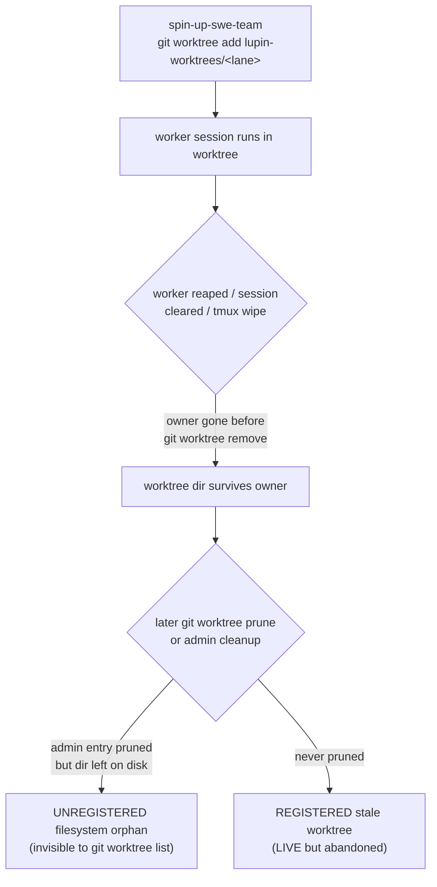

# Worktree Orphan Census & Cleanup — Empirical Anchor for a Lifecycle Policy

**Date**: 2026-07-14
**Author**: Clayton (Lupin crew) — session `a3b1550e`
**Requested by**: Rick (branch/worktree cleanup) + María 🌸 (PIP steward, for the worktree-lifecycle policy)
**Store refs**: census `e9435e22` · María's policy design `c41ba07c` (was blocked on this)
**Status**: cleanup COMPLETE; this doc is the empirical record the policy hooks onto.

---

## 0. TL;DR

A single interactive session cleaned the Lupin repo from **61 local branches → 16** and
**28 worktree directories → 1**. Of the 45 deleted branches and 27 removed worktree dirs,
**exactly one directory held uncommitted work that existed in no commit anywhere** — and the
standard `git status` dirty-check gave it a **false "clean"** reading. That false-clean is the
single most important finding for the policy: **a naive age-based janitor running `git worktree
remove --force` would have silently destroyed unrescued edits, and the obvious safety check would
not have stopped it.**

The near-miss turned out to be superseded on close inspection (an earlier draft of a feature that
later landed by another route), so no work was actually lost. But the *mechanism* failed the test:
it took an isolated-index, stat-refreshed content comparison — not `git status` — to know that.

**Policy implication**: the control cannot be "workers should clean up" (a rule does not act) nor
"the janitor checks `git status`" (it lies under index pollution). It must be **(1) a guard at
worktree-creation time that records ownership + a reap contract, and (2) an age-based janitor that
verifies emptiness with a refreshed isolated index and rescues-to-patch before it ever deletes.**

---

## 1. CENSUS — how many, which repos, what span

All worktrees lived in **one repo** (Lupin) under **one container dir** (`lupin-worktrees/`).
No `Agent(isolation:"worktree")` scratch worktrees, no cross-repo worktrees.

| Layer | Count | Registered in `git worktree list`? | Disposition |
|---|---:|---|---|
| Main working tree | 1 | yes | **kept** |
| Registered lane/persona worktrees | 18 | yes (LIVE) | removed via `git worktree remove` |
| Registered detached-HEAD worktree (`clayton-krishna-review`) | 1 | yes (detached) | removed (merged into dev) |
| **Unregistered** filesystem-orphan dirs | 8 | **no** (admin already pruned) | 7 removed, 1 rescued-then-removed |
| **Total worktree footprint** | **28** | — | **1 remains** |

**Span**: creation timestamps clustered **2026-07-02 → 2026-07-08**, i.e. the v0.1.9 SWE-team
lane spin-ups. The 8 unregistered orphans were all born **2026-07-02** (10:20–17:57), making them
~12 days stale at cleanup.

**The two-layer trap**: `git worktree list` reported **20** worktrees. It could not see the other
**8** — their admin entries under `.git/worktrees/<name>/` had already been pruned (by an earlier
`git worktree prune` or manual admin deletion), leaving the working directory on disk with a
dangling `.git` pointer. **Any census that trusts `git worktree list` alone undercounts. The
filesystem is the source of truth; the registry is a lossy cache.**

---

## 2. PROVENANCE — how they got orphaned

- **Creating verb**: `git worktree add` via the `spin-up-swe-team` skill (the `lupin-worktrees/`
  convention). **Not** `Agent(isolation:"worktree")`, **not** ad-hoc `EnterWorktree`.
- **What failed to clean up**: the owning worker session ended (reaped, `/clear`, or the current
  spate of **tmux server deaths**) **before** running `git worktree remove`. The spin-up path has
  no matching teardown that survives an owner that dies unexpectedly.
- **Two decay states**: (a) **registered-but-abandoned** — owner gone, admin entry intact, still
  shown as LIVE; (b) **unregistered orphan** — a later prune removed the admin entry but not the
  directory. State (b) is strictly worse: invisible to the registry, so it accumulates unseen.

**Where the guard must hook**: at `git worktree add` (creation) — the only choke point both decay
states pass through. A post-hoc janitor alone cannot reconstruct ownership after the admin entry is
pruned (see §3 — we had to *infer* `lane-arnold-backlog`'s base commit by exhaustive tree-diff
because its recorded HEAD was gone with its admin dir).

---

## 3. NEAR-MISSES — did any hold unrescued work?

**One candidate: `lane-arnold-backlog`.** It matched no surviving branch and no commit in the
45-branch rescue bundle — minimum content-diff against *any* known commit was **9 files**, meaning
the directory held 9 files of edits present in **no commit anywhere**.

### 3.1 The false-clean that would have doomed a naive janitor

The dir's `.git` pointer was dangling (admin pruned), so `git -C <dir> status` **failed** and
returned empty output. A janitor greping that for changes reads **"0 dirty → safe to reap."**
**This is the false-clean.** Three successive check methods gave wrong answers before a correct one:

| Method | Result on `lane-0a0c` (truly clean) | Verdict |
|---|---|---|
| `git -C <dir> status` (dangling admin) | empty (command failed) | **false clean** — can't distinguish clean from broken |
| `git --git-dir=MAIN --work-tree=<dir> diff <sha>` | borrowed MAIN's index (had a staged `modules.bats` deletion) → phantom 2-file diff | **false dirty** — index pollution |
| isolated index + `read-tree` + `diff-files` (no refresh) | 3600+ files "differ" | **false dirty** — empty stat cache |
| **isolated index + `read-tree` + `update-index --refresh` + `diff-index`** | **0** | ✅ **correct** |

**The only reliable content check is an isolated index (`GIT_INDEX_FILE`) seeded with `read-tree`,
then `update-index --refresh` to force real content comparison, then `diff-index`.** Everything
cheaper lies in at least one direction. The MAIN repo's index was polluted by an *unrelated*
concurrent session's staged work — a condition that is **normal**, not exceptional, in a
multi-session fleet.

### 3.2 Resolution: superseded, not lost — but the mechanism still failed

On inspection the 9 files were an **earlier draft of the `task_amend` feature** (append-only body
amendment across `task_repository.apply_amendment` → `tasks.py` router → `task_store_tools` MCP
wrapper + full unit/integration tests). That feature **did land in dev** (`wip-v0.1.9`) in a fuller
form via another commit. The lines unique to the draft were stale earlier versions of *surrounding*
refactored code (`apply_patch`, `query_tasks`, `_canon_persona`, the `terse` param), not dropped
ideas. **No work was actually lost.**

But the near-miss stands for policy purposes: **the correct disposition was knowable only after a
content comparison the default tooling gets wrong.** Had the draft *not* been superseded, a
`--force` janitor would have destroyed it, and a `git status`-based guard would have waved it
through.

### 3.3 Insurance retained

A rescue patch was captured **before** deletion: `RESCUE-lane-arnold-backlog.patch` (31 KB, 643
lines, base `bedcaa6d` which is in dev), verified to apply cleanly onto its base. md5
`1f2a1a78428e1a066a5cffe9c01add0e`. Currently in the session scratchpad — **should be moved to a
durable location if the policy wants it kept** (scratchpad is session-scoped).

---

## 4. COST — what the removal actually took

The deletion itself was seconds. **Verification was the entire job.** Breakdown:

- **Cheap**: removing 27 dirs + 45 branches = a handful of `rm -rf` / `git branch -d`.
- **Expensive**: proving each dir was safe to remove — defeating three false readings, building an
  isolated-index checker, exhaustively diffing one orphan against all 61 candidate commits (16
  surviving refs + 45 bundle heads) to prove its content matched none, then diffing against dev to
  prove supersession.
- **Ratio**: roughly 1 part destruction to ~15 parts verification.

**Cost implication for the janitor**: the per-worktree reap is not "delete a directory," it is
"run a refreshed isolated-index content check, and on any nonzero diff, rescue-to-patch and escalate
rather than delete." Budget the janitor for the *check*, not the *delete*.

---

## 5. Recommendations for the policy (input to `c41ba07c`)

1. **Guard at creation (where provenance lives)** — wrap `git worktree add` in the
   `spin-up-swe-team` path so every worktree is registered with: owning persona/session, a
   creation timestamp, and a reap contract. A sidecar manifest (analogous to `.claude-session.md`)
   survives the owner's death; the admin dir does not.
2. **Janitor verifies with a refreshed isolated index — never `git status`** (§3.1). `git status`
   on a dangling-admin orphan false-cleans; a MAIN-index diff false-dirties. Only
   `GIT_INDEX_FILE=… read-tree → update-index --refresh → diff-index` tells the truth.
3. **Rescue-before-reap is mandatory, deletion is conditional.** Any nonzero content diff ⇒ write a
   patch against the best-fit base + escalate; never `--force`-delete a nonempty tree unattended.
   A zero-diff dir whose branch is merged may be reaped silently.
4. **Census from the filesystem, not the registry** (§1). Scan `lupin-worktrees/` on disk and
   reconcile against `git worktree list`; unregistered orphans are the population the registry
   cannot see and the ones that accumulate.
5. **This is a guard + janitor, not a workflow paragraph.** Consistent with the memento-destruction
   ruling ("a rule does not act; being checked is the control variable"): the worker is not asked to
   remember to clean up — creation is instrumented and an age-based janitor sweeps, with the
   verification rigor above baked in.

---

## Appendix A — Recovery artifacts (session scratchpad `a3b1550e`)

| Artifact | What | Durability note |
|---|---|---|
| `deleted-agent-branches-2026.07.14.bundle` | 45 deleted branch tips, complete history (verified) | scratchpad — move to durable if retention wanted |
| `RESURRECT.txt` | 45 `git branch <name> <sha>` lines | valid until `git gc` reclaims (~90d) |
| `RESCUE-lane-arnold-backlog.patch` | the one near-miss's edits, base `bedcaa6d` | scratchpad — move to durable if retention wanted |
| `dirty-lane-rio-presentation-parser-tests.patch` | one modified R&D doc from a Tier-B worktree | scratchpad |

## Appendix B — Final state

- Local branches: **16** (all human-authored: the `wip-v<ver>-<date>-<slug>` release lineage +
  `main`, `v0.6.0-…`, `exp-0.0.8-…-codex`).
- Worktrees: **1** (main). `lupin-worktrees/` empty; `.git/worktrees/` empty.
- Unrelated: an extracted Alembic migration (`f2a3b4c5d6e7`, notif `response_requested` NOT NULL)
  from a stranded branch was re-filed onto dev's head this session — separate from the worktree work.
