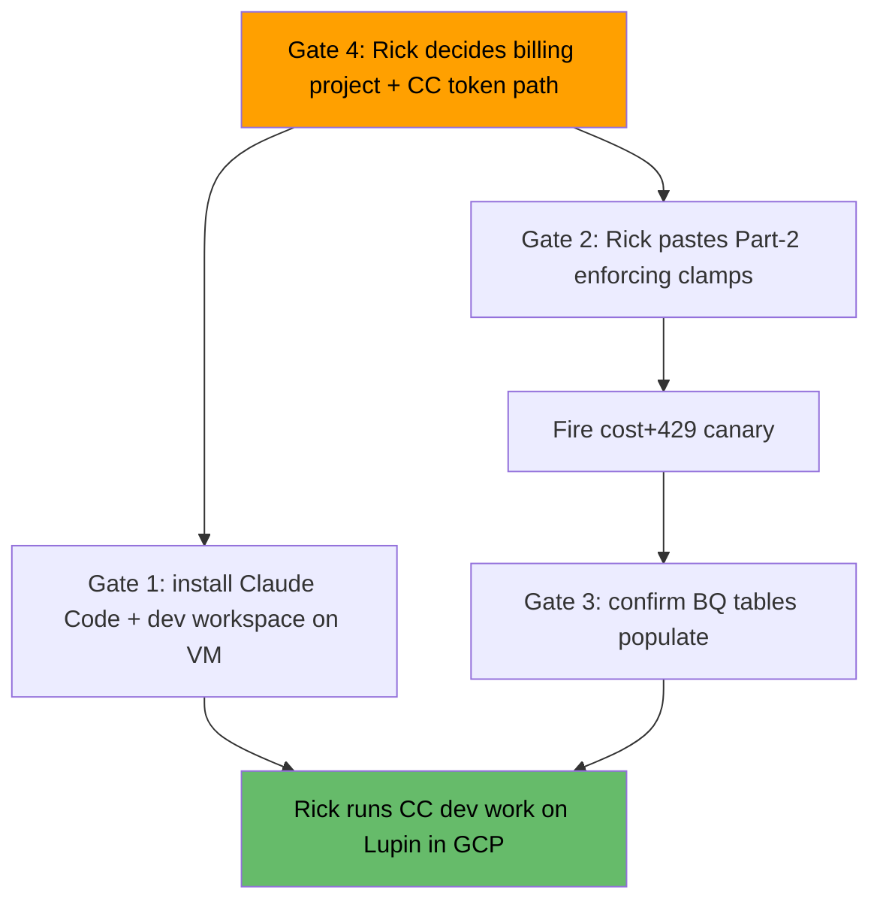

# GCP Pilot Readiness Review — Lupin in Rick's GCP Environment

**Date**: 2026-07-15 (~20:30 EDT)
**Author**: Mr. Radio 🦉 (fleet Manager, session da517b03)
**Task**: `97c12d68` (P0 — GCP environment up-and-running readiness review) — deliverable #2
**Goal (Rick, this session)**: deploy Lupin to GCP + run Claude Code on it to do development work for his employer on their billing.

> Ground truth gathered live this session via `gcloud` (read-only describe/list) + one non-interactive SSH probe of `lupin-host-test`. Every GREEN/RED below is an observed fact, not a recollection.

---

## TL;DR

**Lupin the app is ALREADY running in GCP.** The container `lupin-rest-cloud-gpu` has been up 2 days (healthy), serving `:7999`, backed by a healthy CloudSQL/pgvector proxy. So "running Lupin in my GCP environment" is **already true at the app layer.**

What stands between here and **Rick doing billable employer dev work with Claude Code on it** is a short, concrete gate list — none of it is "does the app work," all of it is "the CC workspace + the cost brake + one billing decision":

1. **Claude Code is NOT on the VM** (biggest gap vs. the literal ask; untracked).
2. **Cost guardrails are configured but NOT enforcing** (the enforcing clamps await Rick's Part-2 paste + a canary).
3. **Billing/logging visibility UNPROVEN** (3 BigQuery tables at 0 rows).
4. **One billing-model decision only Rick can make** (personal project vs. employer billing; Max-OAuth vs. Vertex token path).
5. **Meter hygiene** (two VMs running).

---

## GREEN — confirmed running

| Component | Observed state |
|---|---|
| VM `lupin-host-test` | RUNNING · `e2-standard-8` · `us-central1-a` · 100 GB boot + 200 GB data disk · root fs 4% used (94 GB free — **disk is NOT a blocker**) |
| Lupin REST app | Container `lupin-rest-cloud-gpu` **Up 2 days (healthy)**, serving `0.0.0.0:7999` |
| Postgres backend | Container `lupin-cloudsql-proxy` **Up 4 days (healthy)**; running image tag `lupin:1.2.1-pgvector-r3-agy` → **pgvector/Postgres path is live in cloud** |
| Images present | `lupin:1.2.0`, `lupin:1.2.1-pgvector-r3-agy` (50 GB), `lupin-model-server:0.1.0` (32.9 GB), cloud-sql-proxy 2.14.1 |
| `gcloud` auth | **Working** (describe + SSH succeeded) — the intake blocker "gcloud auth EXPIRED, Rick-only reauth" has **cleared** |

## RED — gates between now and billable employer dev work

### Gate 1 — Claude Code is not on the VM (UNTRACKED — new)
SSH probe: `claude NOT on PATH`; no Lupin source checkout in `~`, `/var`, `/opt` (the app runs from the container image, not a working tree). To "run Claude Code on it" we need, on the VM: (a) the `claude` CLI installed, (b) a source checkout / dev workspace to point it at, (c) CC auth configured (see Gate 4 for which token path). **No task item covers this yet** — it is the #1 gap for the literal ask.

### Gate 2 — Cost guardrails configured but NOT enforcing
9/12 Vertex quota preferences exist on project `hello-world-foo-423219`, **all `granted=0`** (configured, not yet enforcing). The **enforcing** clamps are the 3 bare-slug (`anthropic-claude-opus`) Opus rate caps in `src/tmp/apply-vertex-clamps-part2-2026.07.15.sh` — **PENDING Rick's terminal paste** (must run as Rick; safety-check override is deliberate per his ratified $50/day-worst-case ruling). Until Part-2 lands **and** a canary proves a 429, there is **no hard brake** on Vertex-Opus spend — and usage of ~2745 out-TPM was already observed.

### Gate 3 — Billing/logging visibility UNPROVEN
Three BigQuery tables (billing export + vertex request/response logging) exist but sit at **0 rows**. Per the "a null is not evidence until the instrument is proven" rule, cost + log visibility is **unverified** until a pilot canary demonstrates they populate.

### Gate 4 — Billing-model decision (RICK ONLY)
Two ambiguities that fork all downstream work:
- **Which project/billing?** The guardrails are on Rick's **personal** project `hello-world-foo-423219`. Employer dev work "on their billing" implies a **separate employer GCP project/billing account** — or does the personal project stand in? The clamps/BQ we built protect the *personal* project; if employer work runs elsewhere, they don't cover it.
- **Which token path for Claude Code?** **Max-plan OAuth** (zero per-token cost — employer pays only VM infra) vs. **Vertex/Model Garden** (metered per-token — the whole clamp arc exists to cap this). This decides whether Gate 2/3 even matter for the CC dev path.

### Gate 5 — Meter hygiene
Two VMs RUNNING: `lupin-host-test` (e2-standard-8, meter ON) **and** `vms-2025-10-13-2117-28` (e2-standard-2, purpose unclear). Day-end re-suspend of `lupin-host-test` was an open user-gate; the second VM should be triaged (needed or stop it).

---

## Critical path (recommended order)

**The one thing that unblocks the most**: Gate 4 (Rick's billing-model + token-path decision). If the CC dev path uses **Max-OAuth**, Gates 2/3 become "cost hygiene" rather than "critical path," and the shortest route to Rick's goal is just **Gate 1** (put `claude` + a checkout on the VM). If it uses **Vertex**, Gates 2→3 are on the critical path first.

---

## Open user-gates for Rick (surface, don't storm)
Part-2 clamp paste · enforcement+cost canary GO · VM `lupin-host-test` re-suspend · second-VM triage · **Gate 4 billing-model + CC token-path decision** · whether to spin up Gate-1 (CC-on-VM) work now.
