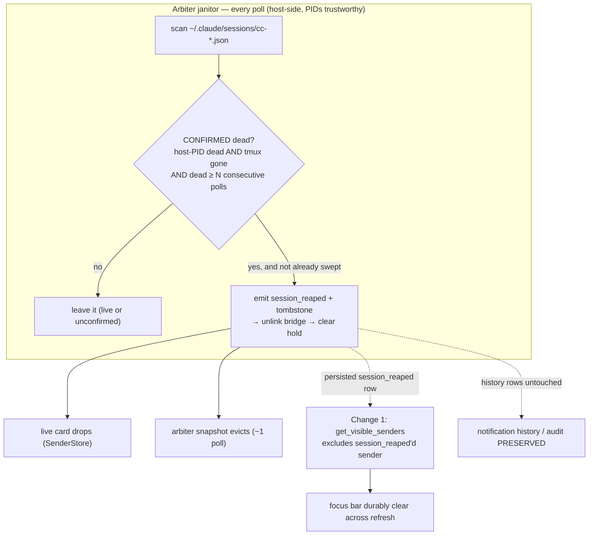

# Orphaned Session-Bridge / Roster Registration Survives Reap — Design

**Date**: 2026-07-15
**Author**: Cheech 🌿 (session `a6d0dd31`), author seat under fleet Manager Mr. Radio 🦉
**Store item**: lupin bug `ee59d5ed` (P2, `correlation_key=focus-bar-invisibility-family`)
**Status**: DESIGN — doc-first, awaiting Mr. Radio's review before code
**Scope ruling**: **A+B** (Mr. Radio, 2026-07-15) — durable eviction folded in, not filed separately

---

## 1. Symptom & reproduction

When a spawned child Claude Code session is **orphaned** — its spawner/manager session dies —
nothing cleans up its server-side registration, so after its tmux process is killed the
operator's **focus bar keeps rendering the dead session as ALIVE**.

**Live repro (2026-07-15, Sam `8ea27d9f`, receipts):** Rick ordered the M1 cascade killed. Sam
dismissed his own spawn (Tiffany `230e39e0`) and then directly `tmux kill-session`'d the 3
orphaned reviewers (Rio `f8fd6b06`, Cheech `a284e115`, Tiberius `d869443d`). `tmux list-sessions`
before/after proved **zero** reviewer sessions remained — yet Rick **still saw Rio + Tiberius
alive** on the focus bar and had to re-order their kill. `dismiss_sessions` returned
`bridges_deleted: 1` for each call: it reached only Sam's OWN child.

## 2. Root cause — two independent facts

### 2a. The reach gap: `dismiss_sessions` is lineage-bound

`dismiss_sessions`' entire reach is the per-manager manifest
`~/.claude/sessions/spawned-<mgr_sid>.json` (`session_spawner.py:198` `_manifest_path`,
written at `:412`, read at `:728`). A manager can only reap `session_name`s recorded in **its
own** manifest. An orphan lives in a **dead** manager's manifest, so no live caller's manifest
names it → **unreachable by any persona's dismiss**. There is no cross-lineage "find whichever
manifest holds this session" lookup. This is the same lineage-miss family as `91067e47`
(freed-name reuse).

### 2b. The reframing: the focus-bar roster is NOTIFICATION-ROW-derived, and THREE distinct surfaces exist

The task body framed this as "orphaned BRIDGE survives." The bridge is **not** what the operator
focus bar reads. Proven by code trace:

- **Operator focus bar** ← `GET /api/notifications/senders-visible/{email}` →
  `get_visible_senders` (`notifications.py:2508`) → `get_sender_last_activities_visible`
  (`notification_repository.py:882`): a SQL `GROUP BY Notification.sender_id`, filtered ONLY by
  `recipient_id` **AND `is_hidden == False`**. The cold-load hydration (`boot.ts:~480`) passes
  **no `hours` param** → no time window → a sender persists until its rows are hidden. **There is
  no reaped/tombstone/status exclusion in that SQL.**
- The session **bridge** (`~/.claude/sessions/cc-<pid>.json`) only supplies the persona/manager
  **badge** stamped onto each already-computed roster row (`_voice_persona_for_sender_id`,
  `notifications.py:50`). Deleting the bridge strips the badge; it does **not** remove the row.

There are therefore **three surfaces**, cleared by **three different signals**:

| Surface | Read path | Cleared by | Durable across refresh? |
|---|---|---|---|
| Live focus-bar card (connected client) | in-memory `SenderStore` | `session_reaped` WS event (`SenderStore.ts:305` "removes the sender outright") | **NO** — in-memory only; re-hydrates from the SQL on refresh |
| Arbiter fleet snapshot | `build_snapshot` over the heartbeat rail | `kind="reaped"` tombstone (`fleet_render.py:427`, `fleet_data_model.py:314`) | N/A (different surface) |
| **Operator focus bar (durable)** | `get_visible_senders` SQL | **nothing today** | requires a query-visible exclusion |

**Consequence:** emitting `session_reaped` clears only the *live* card (and re-appears on
refresh); the tombstone clears only the *arbiter snapshot*. **No signal durably clears the
operator focus bar.** So even a *normally*-reaped session reappears on a focus-bar refresh — a
pre-existing gap, not orphan-specific. For the orphan, **none** of the three signals fire at all
(it was never reaped), which is why Rick saw it as alive.

## 3. The blast-radius finding (Mr. Radio's mandated pre-implementation check)

The obvious durable lever — set `is_hidden = True` on the reaped sender's rows (the column the
roster SQL filters) — **over-hides**. `is_hidden == False` is filtered by **every** history /
conversation query too: `get_by_recipient` (`:176`), `get_sender_conversation` (`:443`),
`get_sender_conversations_by_date` (`:731`), and more (`:857`, `:922`). `is_hidden = True` is a
**global soft-delete** — `soft_delete_by_date` is literally the user's "clear this conversation"
action. Using it for reap would **destroy the operator's notification history / audit trail**.
Mr. Radio's requirement is explicit: *clear the roster, NOT history.*

**Verdict: `is_hidden` is rejected as the durable mechanism.** We scope the eviction to
roster-visibility only (Mr. Radio pre-authorized this outcome).

## 4. Design — the roster-only durable mechanism + the orphan reach fix

Two changes. Both build only on already-persisted state.

### Change 1 (durability, fleet-wide) — the roster query respects the persisted `session_reaped` marker

`session_reaped` events are **already persisted** as `Notification` rows: `_default_emit_reap`
POSTs `/api/notify` with `type="session_reaped"` and `persist` defaults to `True`
(`notifications.py:543`), and the model has a queryable `type` column
(`postgres_models.py:62`). So the durable, **history-safe** roster eviction is a single query
change:

> **`get_sender_last_activities_visible` excludes any `sender_id` that has a persisted
> `type == "session_reaped"` row for this recipient** (correlated `NOT EXISTS` subquery).

- **Roster** (`get_visible_senders`) → the reaped sender vanishes durably, across refresh.
- **History / conversation queries** → UNCHANGED. Every notification, including the
  `session_reaped` marker, remains visible in history/audit. **No `is_hidden`, no data loss.**
- **Shared by construction:** BOTH normal `dismiss_sessions` AND the orphan janitor (Change 2)
  emit the same persisted marker, so both paths gain durable eviction from this one query change —
  honoring the "shared primitive / consistent paths" ruling without a new primitive.
- **Re-spawn safe:** `sender_id` carries the session id (`…deepily.ai#<session8>`); a re-spawn is
  a new session → new `sender_id`, unaffected by the old session's marker. (A once-reaped
  `sender_id` stays excluded, which is correct — that session is dead forever.)

### Change 2 (orphan reachability) — a lineage-independent, liveness-triggered janitor sweep

Host the orphan sweep in the **heartbeat-arbiter per-poll janitor** — the ONE lineage-independent
global reap surface (it already sweeps abandoned worktrees: `worktree_reaper` path 3, wired at
`arbiter_job.py:893`). **Q1 gate CONFIRMED host-side:** the local arbiter runs via systemd
`ExecStart=run-lupin-arbiter-app.sh` with `LUPIN_ROOT`=host path, no container →
`_can_trust_host_pids()` (`= not /.dockerenv exists`) is `True` → host PID + tmux liveness are
trustworthy at the arbiter.

Each poll, scan `~/.claude/sessions/cc-*.json`; for a bridge that is **confirmed dead** (§5), emit
the SAME reap signals a normal dismiss emits — reusing the existing emitters, no new contract:

1. `session_reaped` (`_default_emit_reap`) — live client drop **and** (via Change 1) the durable
   roster exclusion.
2. `kind="reaped"` tombstone (`_default_emit_reaped_tombstone` / `emit_reaped`) — arbiter snapshot
   eviction in ~1 poll.
3. Unlink the bridge file.
4. Clear the session's `.heartbeat-hold-<sid>.json` (`_default_clear_hold`) — parity with dismiss;
   stops phantom blocker edges.

This gives orphans exactly what a properly-reaped session gets, at a surface no lineage can hide
from.



## 5. Safety — false-reap-of-a-live-session must be impossible (Mr. Radio #3)

A single-poll death→reap is too trigger-happy: PID reuse, a transient `tmux`-unreachable, or a
check/emit race could reap a LIVE session — **worse** than a lingering ghost. The sweep reaps a
bridge ONLY when **all** hold:

1. **host PID dead** (`kill(pid,0)` → `ProcessLookupError`), AND
2. **tmux session gone** (`tmux has-session` fails for the bridge's `tmux_session`), AND
3. **debounce**: dead on **N ≥ 2 consecutive polls** (arbiter tracks a per-`sender_id`
   consecutive-dead counter across polls; a single revival resets it to 0).

A live session has a live PID → fails (1) → never swept. Dual-confirm + debounce closes PID-reuse,
transient-tmux, and race windows. This is AC-4/AC-5.

## 6. Idempotency (Mr. Radio #4)

Check-before-emit: skip a bridge if it is already gone OR its `session_id` is in this run's
swept-set; **emit THEN unlink** so subsequent polls cannot re-see it. No duplicate emit, no
per-poll re-alert of the operator. AC-6.

## 7. Fleet-wide semantics note

Change 1 alters roster semantics for **every** manager fleet-wide: from this change on, ALL reaps
(normal dismiss + orphan janitor) durably drop the reaped sender from the operator focus bar
across refresh. This is the *intended* fix of the pre-existing gap, but it is a fleet-wide
behavior change. **Mr. Radio owns the merge call and is flagging it to Rick for awareness; merge is
not automatic.** (Recorded here for the audit trail; not this author's gate.)

## 8. Acceptance Criteria (final, A+B)

- **AC-1 (reach):** the sweep enumerates `cc-*.json` bridges independently of any manager manifest
  (lineage-independent).
- **AC-2 (durable roster eviction):** `get_sender_last_activities_visible` excludes any `sender_id`
  with a persisted `type="session_reaped"` row for the recipient; a reaped sender is absent from
  `get_visible_senders` on a fresh query (across refresh).
- **AC-3 (history preserved — BLAST RADIUS):** the SAME reaped sender's rows remain returned by the
  history/conversation queries (`get_sender_conversation` / `get_by_recipient` /
  `get_sender_conversations_by_date`); `is_hidden` is NOT set by the reap path. A test asserts
  roster-absent AND history-present for the same sender.
- **AC-4 (dual-confirm):** a bridge is swept ONLY when host-PID dead AND tmux-gone.
- **AC-5 (debounce / never-reap-live):** a bridge dead for < N consecutive polls is NOT swept; a
  bridge with a LIVE host PID is NEVER swept (test with a live-PID fake bridge asserts no emit).
- **AC-6 (idempotency):** re-running the sweep across polls emits `session_reaped`/tombstone AT
  MOST ONCE per orphan (emit-then-unlink + swept-set); no duplicate emit.
- **AC-7 (parity signals):** per swept orphan, all of `session_reaped` + tombstone + bridge-unlink
  + hold-clear fire, reusing the existing emitters (no new notification contract).
- **AC-8 (coverage):** 100% lines AND branches AND functions on all new code (Python `--cov` /
  `c8` for any TS), `# pragma: no cover` only with a same-line reason for genuinely-unreachable
  defensive branches.
- **AC-9 (fail-safe):** a raising emitter / unlink / tmux-probe NEVER breaks the sweep or the
  arbiter poll (same fail-safe posture as `dismiss_sessions`' producers).

## 9. Test plan (venues per §TESTING VENUES)

- **Unit (:7999):**
  - Change 1 query exclusion — extend the notification-repository tests: seed a sender with a
    `session_reaped` row + a normal-activity sender; assert `get_sender_last_activities_visible`
    returns only the non-reaped sender, AND `get_sender_conversation` still returns the reaped
    sender's rows (AC-2 + AC-3, the blast-radius pair).
  - Change 2 sweep — model on `test_session_spawner_reap.py` (writes bridges into a `tmp_path`
    session dir, injects capture lambdas for `emit_reap_fn` / `emit_reaped_fn` / `clear_hold_fn`)
    and `test_heartbeat_arbiter_job.py`. Cases: dead-PID+tmux-gone+debounced → all 4 signals fire;
    live-PID bridge → NO emit (AC-5); dead <N polls → NO emit (AC-5); second poll after unlink → NO
    re-emit (AC-6); raising emitter → sweep continues (AC-9).
- **Integration (:8000 scheduled):** end-to-end — persist a `session_reaped` row via the notify
  API for a synthetic sender, assert it is absent from `GET /api/notifications/senders-visible`
  but present in the sender's conversation history (real DB, real query). Submitted via
  `POST /api/test-suite/submit` (mutates DB rows → :8000 venue).

## 10. Files expected to change

- `src/cosa/rest/db/repositories/notification_repository.py` — `get_sender_last_activities_visible`
  gains the `session_reaped` NOT-EXISTS exclusion (Change 1).
- `src/cosa/agents/heartbeat_arbiter/` — the per-poll janitor gains the orphan-bridge sweep
  (Change 2): liveness probe + debounce counter + reuse of `session_spawner` emitters.
- Tests: notification-repository roster/history tests; arbiter janitor sweep tests.
- (No `is_hidden` write path is added. No schema migration — `type` column already exists.)

## 11. Evidence appendix (anchors)

```
notifications.py:2508           get_visible_senders (roster route handler)
notification_repository.py:882  get_sender_last_activities_visible (GROUP BY, is_hidden==False, NO reaped exclusion)
notification_repository.py:443/731/857/922  history/conversation queries ALSO filter is_hidden==False  → is_hidden over-hides
postgres_models.py:62           Notification.type column (stores "session_reaped")
notifications.py:543            /api/notify persist=True default → session_reaped rows ARE persisted
session_spawner.py:198/412/728  dismiss_sessions reach = per-manager manifest only (the lineage gap)
session_spawner.py:469          _default_emit_reap (persisted session_reaped POST)
session_spawner.py:515          _default_emit_reaped_tombstone (arbiter-snapshot tombstone)
fleet_render.py:427 / fleet_data_model.py:314  tombstone evicts the ARBITER snapshot (different surface)
SenderStore.ts:305              client session_reaped handler (in-memory drop, no persistence)
session_bridge.py:128           _can_trust_host_pids = not /.dockerenv exists
lupin-arbiter-app.service       ExecStart=run-lupin-arbiter-app.sh (host systemd, no container) → PIDs trustworthy
```
