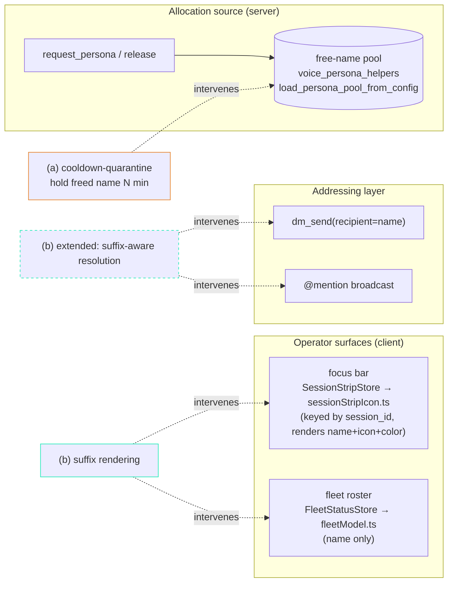

# Freed-Persona-Name-Reuse Disambiguation — Design Proposal

**Date**: 2026-07-15
**Author**: Krishna 🦚 (CC session 52a5706b, author seat) — pattern originally named by this lineage
**Manager / gate**: Mr. Radio 🦉 (session da517b03)
**Store item**: `91067e47-85d1-48d0-acec-e1736c4fb876` (bug, P2, project lupin; correlation `focus-bar-invisibility-family`)
**Receipts-confirmed by**: María 🌸 (allocator working as designed — this is a **policy gap**, not an allocator bug)
**Sibling (same family, distinct bug)**: `179fe3ab` — focus-bar render-delivery (queued ≠ delivered); a *delivery* fault, orthogonal to this *identity* fault
**Status**: PROPOSAL → decision (Rick's court). **No code in scope** — this compares remedies and recommends.

---

## TL;DR

When a persona is reaped its **name** returns to the allocation pool and is granted to the next
requester, with **nothing on any operator- or fleet-facing surface distinguishing the new bearer
from the old**. Four sightings today (2026-07-15) prove the gap is live, not theoretical.

The bug row frames this as one problem; **reading the surfaces, it is two coupled failure modes**:

1. **Operator perception** — Rick (or a peer) *cannot tell two same-named sessions apart* on the
   focus bar / fleet roster, because both render as bare "Krishna" / "Cheech".
2. **Fleet addressing** — `dm_send`-by-name and `@mention` broadcasts *resolve a name to the wrong
   session*, because the name is the routing key and it is no longer unique.

The two candidate remedies map cleanly onto these two modes, and they are **complementary, not
competing**:

- **(a) cooldown-quarantine** shrinks the *collision window at the allocation source* — it cuts the
  single most common trigger (a name re-granted **minutes** after its prior bearer was reaped) but
  **structurally cannot** touch long-lived or cross-fleet concurrency.
- **(b) session-id-suffix rendering** makes same-name-different-session **visually unambiguous** on
  the display surfaces, and — extended to the addressing layer — lets a caller target the *intended*
  session. It fixes the **root** (identity confusion) for **all four** sightings, at the cost of more
  UI/routing surface.

**Recommendation: (c) both, phased — lead with (b) as the structural root-fix, add (a) as a cheap
source-side window-reducer.** Rationale + the addressing-layer caveat below.

---

## The four sightings (why this is P2, not hypothetical)

| # | Incident | Failure mode | Would (a) cooldown help? | Would (b) suffix help? |
|---|---|---|---|---|
| 1 | Tiffany's persona-name probe to "krishna" hit **Mr. Radio's live Krishna** (different fleet) | Addressing, **cross-fleet, both alive** | ❌ No — no shared allocator to quarantine across fleets | ⚠️ Display: yes; routing: only if the addressing layer accepts a suffix |
| 2 | `dm_send`-by-name **bounced to the wrong Sam** | Addressing (Sam-overflow, likely both alive) | ❌ No — overflow allocation, not a fresh re-grant | ⚠️ Same as #1 — display yes, routing needs suffix-aware resolution |
| 3 | Rick's **@Cheech** broadcast landed on `a284e115`, which claimed freed "Cheech" **minutes after** `356809b3` was reaped | Perception + addressing, **short post-reap window** | ✅ **Yes** — a quarantine window would have blocked the immediate re-grant | ✅ Yes — Rick sees the new Cheech is a different session |
| 4 | Author `14eb47f8` granted freed "Rachel" (reaped REV.4 author), forcing a **manager ruling to address by session_id** mid-re-review | Perception + addressing, **long-lived** | ⚠️ Only if the re-grant fell inside N; not guaranteed | ✅ **Yes** — the operator addresses by suffix instead of an ad-hoc ruling |

**Read-out**: cooldown cleanly helps exactly **one** sighting (#3) and *maybe* #4. Suffix-rendering
addresses the **perception** side of **all four**, and the **addressing** side of all four *if* the
name-resolution layer is taught the suffix. That asymmetry drives the recommendation.

---

## Where each remedy intervenes

The key code-grounded facts (from `2026.07.07-focus-bar-repopulation-ux-design.md` +
`2026.07.11-persona-key-followon-policy.md`):

- The **`SessionStripStore` already keys its Map by `sender_id`/`session_id`** — the unique identity
  is *present in the client*; the strip template just **renders the persona name/icon/color and drops
  the id**. So (b) on the focus bar is a **render change, not a store/identity change** — low
  structural risk.
- The **fleet roster (`FleetSession` / `fleetModel.ts`) carries the persona *name only***. Surfacing
  a suffix there needs the **session id present in the `/api/arbiter/fleet-state` payload** (verify:
  the arbiter serializer at `routers/arbiter.py` — the client type does not currently declare it).
- The allocation pool is read via **`voice_persona_helpers.load_persona_pool_from_config`**, and
  names normalize through **`canonical_persona_key`** (accent/punct-strip + lowercase). (a)'s
  quarantine bookkeeping lives at the release→pool return in this layer.

---

## Candidate (a) — COOLDOWN-QUARANTINE

Hold a freed name out of the allocatable pool for **N minutes** after its bearer is reaped/released;
`request_persona` skips a quarantined name and falls to the next free name (or overflow).

**Pros**
- **Simplest mechanism** — a release-timestamp map + a skip predicate in the allocation path.
  **Server-side only, zero UI surface.**
- Directly cuts the **most common** trigger: the immediate post-reap re-grant (sighting #3's "minutes
  after").
- **Reversible / low blast radius** — a single config'd N; disable = N→0.

**Cons**
- **Does not touch long-lived collisions** (sighting #1's two live Krishnas): once N elapses the name
  is grantable again while the *original* bearer is still alive → collision returns.
- **Does not touch cross-fleet reuse** (sightings #1, #2): quarantine is per-allocator; a different
  fleet/project has its own pool and can grant the same name concurrently. No cross-fleet coordinator
  exists (and the follow-on-policy doc deliberately deferred a cross-project roster).
- **Pool-starvation pressure** — with a small pool and bursty spawns, quarantining names shrinks the
  available set → more **overflow-to-Sam** allocations (already the overflow path per memory). N is a
  guess: too short = no protection, too long = starvation.
- **Probability reducer, never a guarantee** — it shrinks a *window*; it cannot make a name unique.

## Candidate (b) — SESSION-ID-SUFFIX RENDERING

Always render **persona + short-session-id** on the focus bar and fleet roster (e.g. `Cheech·a284`),
so same-name-different-session is visually unambiguous — and **extend the addressing layer** so a
caller can target `persona·suffix`.

**Pros**
- **Fixes the root** — operator/fleet identity confusion — for **all four** sightings, independent of
  timing. A long-lived pair (two live Krishnas, the Rachel case) is disambiguated because **both**
  carry suffixes; cooldown structurally cannot do this.
- **Works cross-fleet** — the suffix is *session-derived*, needing no allocator coordination.
- On the focus bar it is a **render-only change** — the store already holds `session_id`; no identity
  or store surgery.
- Retires the **ad-hoc "address by session_id" manager rulings** (sighting #4) by making the suffix a
  first-class, always-present handle.

**Cons**
- **More surface**: strip icon template **and** fleet roster renderer, and — for the addressing fix —
  `dm_send`/`@mention` name resolution must accept and prefer a suffix qualifier. The roster path may
  need the **id surfaced in the arbiter payload** (cross-service verify item above).
- **Display-only is a half-fix for addressing**: rendering the suffix lets the human *see* two
  Cheeches, but sightings #1 & #2 are *routing* faults — if the caller still emits a bare name the
  router still guesses. **(b) must extend to suffix-aware resolution to actually close #1/#2**; as
  pure display it is disambiguation-only (still valuable — it converts a silent mis-route into a
  visible "which one?").
- Minor visual density on the bar — needs a compact form (the ask specifies *always show*, not
  hover-only; that is a deliberate UX call for Rick).

## Candidate (c) — BOTH

Run (a) as a **source-side probability reducer** (kills the common immediate-re-grant window) and (b)
as the **structural disambiguation guarantee** (covers the residual long-lived / cross-fleet cases
(a) cannot). They intervene at **different points** (allocation vs display/addressing) and do not
overlap or conflict.

---

## Recommendation — **(c) both, phased; (b) leads**

**Phase 1 — (b) suffix rendering (the structural root-fix).** It is the *only* candidate that
addresses the actual bug title ("operator + fleet identity confusion") across **all four** sightings
and both timing regimes. Start with the **focus-bar render** (lowest risk — store already keys by
session_id) + **fleet roster** (surfacing the id, pending the arbiter-payload verify), then extend to
**suffix-aware `dm_send`/`@mention` resolution** to close the addressing faults #1/#2. Ship the
display half first if the addressing half needs its own gate.

**Phase 2 — (a) cooldown-quarantine (cheap complement).** Add a modest quarantine (suggest **N ≈ 10
min**, config'd, tunable) as a source-side reducer of the immediate post-reap re-grant — the single
most frequent trigger. It is small, reversible, and orthogonal to (b); it is *not* a substitute for
(b) because it cannot make a name unique.

**Why not (a) alone**: it leaves sightings #1, #2, and the long-lived #4 unaddressed — three of four.
**Why not (b) display-only**: it converts silent mis-routes into visible ambiguity (a real gain) but
does not by itself route #1/#2 correctly; the addressing extension is what closes them.

**Decision this proposal asks Rick to make**: ratify **(c) phased with (b) leading**, and rule on two
sub-questions — (i) does the addressing layer get suffix-aware resolution in this milestone or a
follow-on, and (ii) the cooldown **N** value (default 10 min proposed).

---

## Non-goals / boundaries

- **No cross-project roster / cross-fleet name coordinator** — deferred per the follow-on-policy
  doc's ratified direction; (b)'s session-derived suffix sidesteps needing one.
- **No allocator change** — María confirmed the allocator is working as designed; this is a policy +
  presentation gap.
- **Distinct from `179fe3ab`** (render-delivery, queued ≠ delivered) — same focus-bar family, but a
  *delivery* fault; this proposal touches *identity/labeling*, not the delivery path.

## Open verification items (pre-build, if gated)

1. Confirm whether `/api/arbiter/fleet-state` (`routers/arbiter.py`) already carries per-session id on
   the roster payload — decides whether (b)'s roster half needs a serializer change (the client
   `FleetSession` type does **not** declare it today).
2. Enumerate the **addressing-layer** name-resolution sites (`dm_send` recipient resolution, the
   `@mention` broadcast parser) to scope the suffix-aware routing extension for #1/#2.
3. Confirm the reap→pool-return seam in `voice_persona_helpers` for where (a)'s quarantine timestamp
   would attach.

## Cross-links

- `src/rnd/v0.1.9/2026.07.07-focus-bar-repopulation-ux-design.md` — strip vs roster architecture,
  icon+color-vs-name-only, `SessionStripStore` session_id keying.
- `src/rnd/v0.1.9/2026.07.11-persona-key-followon-policy.md` — roster accessor + `canonical_persona_key`.
- Sibling bug `179fe3ab` — focus-bar render-delivery (same family, distinct fault).
- Standing discipline this bug formalizes: memory `feedback_no_cross_project_persona_collision`
  (EXTENDED 2026-07-15 — freed names re-grant post-reap; address by session_id when a name could be
  stale; verify name-addressed directives against your own lineage).
