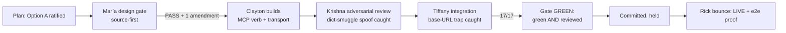

# Post-Game — `task_edit` MCP-Parity Build

**Date**: 2026.07.20
**Steward**: María 🌸 (planning-is-prompting, session ea7cddf9)
**Manager**: Mr. Radio 🦉 (session 26409c0c)
**Crew**: Clayton 😎 Implementer (10b141ea) · Krishna 🦚 Reviewer (b363d94c) · Tiffany 💍 Tester (2e399fd9)
**Engagement**: design gate → build → adversarial review → integration → green+reviewed
**Scope prefix**: [LUPIN]

---

## 0. ONE LINE

**`task_edit` shipped clean** — a thin MCP wrapper over the existing `PATCH /api/tasks/{id}`, gate GREEN (unit 81 · Krishna review PASS · integration 17/17, ts-621e7029), committed `3ac79d1d`+`27d14cb3`, then **LIVE after Rick's cosa-voice bounce** (Mr Radio proved it end-to-end: atomic priority-demote + retitle in one event, owner-refusal guard fired). The run earned five keeper lessons, three of them about *the check that fires on the wrong axis*.

---

## 1. WHAT SHIPPED — receipts

| Artifact | Receipt |
|---|---|
| Plan (design gate) | `src/rnd/v0.1.9/2026.07.20-generalized-task-field-edit-mcp-parity.md` |
| Build | commit `3ac79d1d` — MCP verb + transport + 360-line e2e + unit (800 insertions, 6 files) |
| Harness fix | commit `27d14cb3` — e2e base-URL → :8000 (was :7999) |
| Integration | `ts-621e7029`, 17/17, `io/test-suite/2026.07.20-at-21:59-EDT-integration-results.md` |
| Unit | 81 passing (`test_task_store_tools.py` + wrapper tests) |
| Design-review gate | María plan-PASS, review row `cdef52ab` → done |
| Adversarial review | Krishna PASS, row `c1269de4` → done |
| Live proof | Mr Radio e2e post-bounce: P1→P3 + retitle atomic (one event), owner-refusal guard fired, probe dropped |

**The verb**: `task_edit(task_id, updates={field: value})` — dict shape (Option A, Rick-ratified). Edits the 5 free fields (`title·body·priority·gate_class·urgency`); **refuses `owner_persona`/`accountable_manager`** (→ `task_reassign`) and all invariant-bearing fields (→ `task_transition`). Zero server diff — inherits the endpoint's `extra="forbid"` + `validate_patch` verbatim.

---

## 2. THE RUN

The amendment my gate forced (refuse owner fields) landed in the plan **before** Clayton built, so the 5-field scope was correct from the first commit — no owner-edit backdoor to unwind later.

---

## 3. KEEPER LESSONS

### L1 — The dict-smuggle spoof (Krishna) → became AC7
`updates` is a free dict. A caller could smuggle `actor`/`authority`/`reason` into it and shadow the bridge-stamped identity. **Fix: strip those keys from `updates`, stamp identity LAST** so a caller key can never win. Rick descoped the deeper hardening under deadline; the strip-and-stamp-last floor shipped. *A free-form dict param is an identity-spoof surface until proven otherwise.*

### L2 — Owner-refusal is NOT inherited from the server (María gate) → AC8
The server's `extra="forbid"` refuses *unknown* fields — but `owner_persona`/`accountable_manager` are **valid** PATCH fields, so the server would happily edit them. The refusal had to be added **in the MCP layer**, not inherited. My §8 "divergent audit semantics" framing was wrong (same endpoint, same event); the real gap was `task_reassign`'s mandatory-reason discipline vs `task_edit`'s optional. *An MCP wrapper does not inherit a guard the server never had — parity means parity with the server's gaps too.*

### L3 — The base-URL harness trap (Tiffany) → fix `27d14cb3`
The e2e defaulted to `:7999` (dev DB) instead of `:8000` (test). A green run against the wrong database is a false green. Caught before it counted; the default was pinned to :8000. Plus her **stale-uuid false-match near-miss** — an old id that nearly matched a live row. *A test's base URL is part of its correctness; a suite that green-lights against dev proves nothing.*

### L4 — The 7→5 scope-thrash
The editable set churned 7 → 5 as the owner-refusal (L2) removed two fields mid-design. Cheap here because it happened at the gate, not in code. *Scope thrash caught at the design gate costs a doc edit; caught in code costs a migration.*

### L5 — The memento phantom (doctrine-grade) → follow-up filed
Krishna's memento reported "written" but was **absent at the canonical slot** — a slug-pattern write had matched the **nearest** mementos dir (`src/cosa/rest/io/mementos/`, a real sibling), not the canonical root. Only the **landed-verify precondition** I set on the reap caught it; the crew would have been reaped with his in-context lessons lost. *A memento "written" is a claim; it needs a landed-verify at the canonical slot. And there is a stray-mementos-dir footgun worth closing.* This is a live manifestation of the same class as `3e96f667` (memento guard CREATE-hole) — a write that succeeds at the wrong target, silently.

---

## 4. MOVEMENT

**Decisions Log (→ TODO.md):**
- `task_edit` shape = Option A (dict), owner fields **refused** → `task_reassign` (Rick-ratified + María-gate amendment).

**Graduation candidates (accumulate-before-graduate — NOT graduated today):**
- L2 "an MCP wrapper does not inherit a guard the server never had" — pattern-watch; recurs with any REST→MCP parity verb.
- L5 "memento written ≠ memento landed" — the landed-verify precondition earned its keep twice today (this run + my own board earlier). Watch for a third before graduating to `memento-management.md`.

**Follow-up store item (to file):** stray-mementos-dir footgun — a slug-pattern memento write can match a nearest sibling `io/mementos/` dir instead of the canonical root; recommend the write resolve the canonical slot explicitly + refuse a non-canonical target.

---

## 5. CREW + MEMENTOS (all landed, reap-safe)

| Seat | Role | Session | Memento |
|---|---|---|---|
| Clayton 😎 | Implementer | 10b141ea | `clayton-10b141ea-task-edit-2026.07.20.md` |
| Krishna 🦚 | Reviewer | b363d94c | `krishna-b363d94c.md` (re-landed 22:05 after the phantom) |
| Tiffany 💍 | Tester | 2e399fd9 | `tiffany.md` |

Precondition MET (Mr Radio verified all three on disk) → reap-safe.

---

## 6. WHAT WENT RIGHT (mechanism, not praise)

- **Source-first gate** caught the owner-refusal gap by reading `task_reassign_impl` at HEAD, not the plan's framing — the amendment shipped before code.
- **Landed-verify precondition** on the reap caught the phantom memento — a process control, not diligence, did the catching.
- **Concurrent gate**: my review ran alongside the build; merge held for review-pass, so the gate never blocked the crew.
