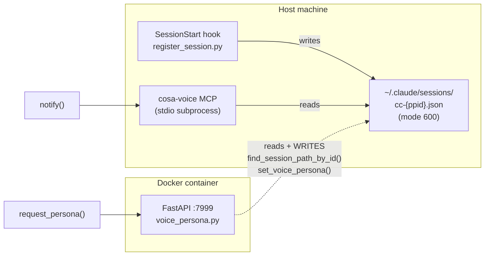
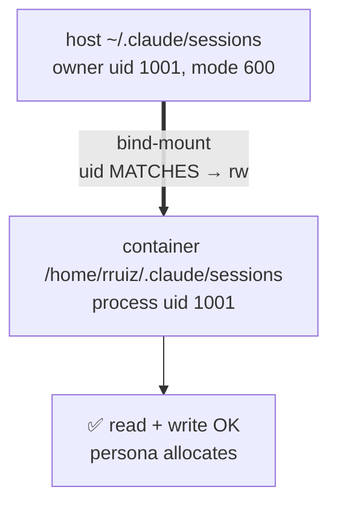
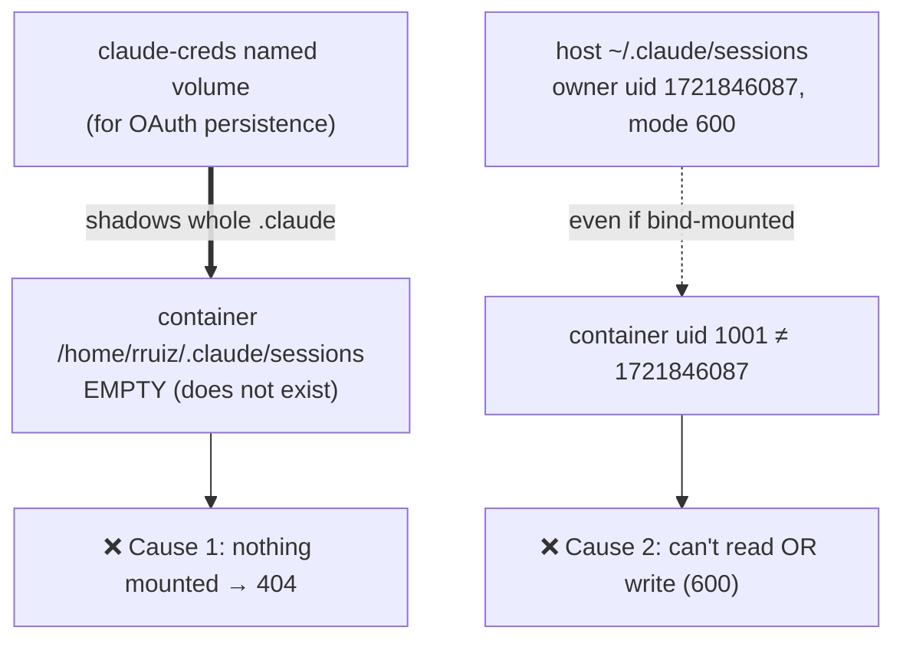

# VM Persona Allocation 404 — Why It Works Locally but Breaks on the Cloud VM

**Date**: 2026-07-24
**Author**: Mr. Radio 🦉 (session b46c77e3)
**Context**: GCP test-VM (`lupin-host-test`) bring-up. A fresh Claude session on the VM sends `notify()` successfully but `request_persona()` returns HTTP 404 `"No active session bridge found"`.
**Status**: Root cause CONFIRMED on live VM state. No fix applied yet — awaiting decision on approach.

---

## TL;DR

Persona allocation needs the **FastAPI server (running inside the Docker container)** to read *and write* the **session-bridge file** that the **SessionStart hook writes on the host**. Two independent things must line up for that to work:

1. The host's `~/.claude/sessions/` directory must be **bind-mounted into the container** at the path the server reads.
2. The container's process **UID must be able to read+write** those host files.

On your **local** box both are true *by accident of history*: the base compose bind-mounts `sessions/`, and your host user happens to be **uid 1001** — the exact uid the container runs as.

On the **cloud VM** both are false:

1. The cloud compose (`docker-compose.cloud-gpu.yml`) does **not** carry the `sessions/` bind-mount. Instead it mounts the **whole `/home/rruiz/.claude` as a named Docker volume** (`claude-creds`) — for a *different* reason (persisting the OAuth login). That named volume **shadows** the sessions path with an empty, container-private directory.
2. The VM's OS-Login host user is **uid 1,721,846,087**, nowhere near the container's **uid 1001**, and bridge files are mode `600`. Even with a mount, uid 1001 could neither read nor write them.

`notify()` keeps working because it runs in the **host-side MCP process**, which reads the host bridge directly — it never goes through the container.

---

## The moving parts



- **Bridge file**: `~/.claude/sessions/cc-{PPID}.json` — canonical per-session state (session_id, cwd, sender_id, `voice_persona`, listener_pid). Written by the SessionStart hook. `SESSION_DIR = Path.home() / ".claude" / "sessions"` (`session_bridge.py:48`).
- **`notify()`** → resolved by the **host-side MCP stdio process** (`cosa_voice_mcp.py`). Reads the host bridge directly. **No container involved.**
- **`request_persona()` / persona reads** → call the **FastAPI server** (`:7999`, in the container). The server calls `find_session_path_by_id()` and, on allocation, `set_voice_persona()` — i.e. it **reads AND writes** the bridge (`voice_persona.py:176-177`, `:250`, `:552`). The 404 is raised here.

The asymmetry is the whole story: **one path is host-side, one is container-side.** notify never needed the container to see the bridge; persona does.

---

## Local topology — why it works

Base `docker-compose.yml` (the file used on your workstation):

```yaml
user: "1001:1001"                                   # container process uid/gid
volumes:
  - ~/.claude/.credentials.json:/home/rruiz/.claude/.credentials.json:ro   # OAuth token (read-only bind)
  - ~/.claude/sessions:/home/rruiz/.claude/sessions                        # ← THE bridge bind-mount
```

Two facts make persona work locally:

1. **`sessions/` is bind-mounted** from the host into the container at `/home/rruiz/.claude/sessions` — the exact path `Path.home()/.claude/sessions` resolves to inside the container (container user = `rruiz`, home = `/home/rruiz`).
2. **Host uid == container uid == 1001.** Your workstation user `rruiz` is uid 1001 (the same uid baked into the image, Dockerfile:37-38). So the mode-600 bridge files the host hook writes are owned by 1001, and the container (also 1001) can read *and* write them.

OAuth, locally, comes from a **read-only bind of the single `.credentials.json`** — not the whole directory. So `sessions/` remains a clean, separate bind. Nothing shadows it.



---

## VM topology — why it breaks (three compounding causes)

The VM runs **`docker-compose.cloud-gpu.yml`**, a different file with a different design intent.

### Cause 1 — the whole `.claude` is a *named volume*, not a `sessions/` bind

```yaml
user: "1001:1001"
volumes:
  - claude-creds:/home/rruiz/.claude     # persistent CC OAuth login
# (no ~/.claude/sessions bind-mount)
```

`claude-creds` is a **Docker-managed named volume** (`/mnt/lupin-data/docker/volumes/lupin_claude-creds/_data`), mounted over the **entire** `/home/rruiz/.claude`.

**Why the whole directory, and only on the cloud files?** OAuth persistence. On your workstation the host already has a logged-in `~/.claude` and you bind the token in read-only. On a **fresh cloud VM there is no host-side CC login** — you run `claude /login` *inside* the running container, and that token must **survive container recreate**. The clean way to persist "whatever CC writes under `.claude`" across recreates is a named volume over the whole directory (see the comment in `docker-compose.cloud-test.yml:100,182`). That decision is correct *for OAuth* — but it has a side effect: it **shadows `sessions/`**. The container's `/home/rruiz/.claude/sessions` now lives inside the (initially empty) named volume, not the host. Live proof:

```
$ docker inspect lupin-rest-cloud-gpu (Mounts, filtered)
/mnt/lupin-data/docker/volumes/lupin_claude-creds/_data -> /home/rruiz/.claude (volume)

$ docker exec lupin-rest-cloud-gpu ls -la /home/rruiz/.claude/sessions/
ls: cannot access '/home/rruiz/.claude/sessions/': No such file or directory
```

The host, meanwhile, *is* writing bridges — they just live somewhere the container was never told to look:

```
$ ls ~/.claude/sessions/    # on the VM host
cc-1227374.json   (817 bytes, mode 600, owner admin_rickruiz_altostrat_com)   ← fresh, correct
```

So the base compose's `sessions/` bind was simply **never ported** into the cloud compose files.

### Cause 2 — UID gulf (would break it even with a mount)

```
host user : uid 1721846087 (admin_rickruiz_altostrat_com)   # GCP OS-Login uid, not changeable
container : uid 1001        (rruiz)                          # baked into the image
bridge    : mode 600 (owner-only read+write)
```

Suppose we *only* added the `sessions/` bind-mount. The container (uid 1001) would then see files owned by uid 1721846087 with mode 600 → **permission denied on read**. And because persona allocation **writes** the bridge (`set_voice_persona`), even world-readable (644) wouldn't be enough — a non-owner still can't write. So the mount is necessary but **not sufficient**; the uid mismatch is a second, independent blocker.

Locally this never surfaced because host uid == container uid == 1001 — a coincidence the cloud VM's OS-Login uid destroys.

### Cause 3 (latent) — bridge files are mode 600

The hook writes bridges owner-only (`atomic_write_json`). Fine when owner==container. Across a uid boundary it forecloses the "just bind-mount it" shortcut.



---

## Summary table — local vs VM

| Dimension | Local workstation | Cloud VM (`lupin-host-test`) |
|---|---|---|
| Compose file | `docker-compose.yml` | `docker-compose.cloud-gpu.yml` |
| `.claude` mounting | `.credentials.json` bind (ro) + `sessions/` bind | **whole `.claude` as `claude-creds` named volume** |
| Why whole-dir mount | n/a — host already logged in | persist `claude /login` OAuth across container recreate |
| Container sees host `sessions/`? | ✅ yes (bind) | ❌ no (shadowed by empty named volume) |
| Host uid | 1001 (== container) | 1721846087 (≠ container 1001) |
| Bridge file perms | 600, owner==container → rw | 600, owner≠container → no access |
| `notify()` | ✅ (host-side MCP) | ✅ (host-side MCP) |
| `request_persona()` | ✅ | ❌ 404 |

---

## Fix options

Reversible; nothing changed yet. Recreate (`docker rm -f` + `up -d`) is required to apply new mounts — `docker restart` does **not** pick them up.

### Option A — align container UID + add the bind-mount (recommended, full fix)
- Add to the cloud-gpu `rest` service: `- ${HOME}/.claude/sessions:/home/rruiz/.claude/sessions` (nested over the named volume; more-specific mount wins).
- Change `user: "1001:1001"` → `user: "${LUPIN_HOST_UID:-1001}:${LUPIN_HOST_GID:-1001}"` and export the host uid/gid (via `push-env`). This makes the container run *as the host user*, so it can read+write host bridges on any host — removing the hidden "host must be uid 1001" coupling.
- **Risk to verify first**: the `claude-creds` OAuth volume and `/var/lupin/io` are owned by 1001; running as 1721846087 needs those chowned or OAuth/notify could regress. Verify + chown before recreate.

### Option B — defer (persona is cosmetic)
- `notify()` and TTS already work. Personas only disambiguate *parallel* sessions in the UI. Single-session VM can run without one. Zero risk now; revisit if parallel VM sessions become a thing.

### Option C — shared-group approach
- Keep container uid 1001. Give the bridge dir+files a shared gid with group-rw, add the container to that group, and make the hook write group-writable (umask/mode change). Avoids the creds-volume chown but has more moving parts and touches the hook's global write mode.

**Recommendation: A** — it's the portable fix and encodes what the local box does implicitly (container runs as the host user). B is the right call only if persona on the VM isn't worth the infra churn right now.

---

## Verification receipts (live VM, 2026-07-24)

```
host id            : uid=1721846087(admin_rickruiz_altostrat_com) gid=1721846087 groups=…,998(docker)
container mount     : lupin_claude-creds/_data -> /home/rruiz/.claude (volume)   [only .claude mount]
container id        : uid=1001(rruiz) gid=1001(rruiz)
container sessions  : ls: cannot access '/home/rruiz/.claude/sessions/': No such file or directory
host bridge (fresh) : ~/.claude/sessions/cc-1227374.json  (817 B, mode 600, 21:23)
404 source          : voice_persona.py:177 / :250 / :552  (find_session_path_by_id → HTTPException 404)
notify path         : cosa_voice_mcp.py (host-side stdio) — unaffected
```

**Doc-viewer link**: `/app/docs?path=lupin/src/rnd/v0.1.9/2026.07.24-vm-persona-bridge-mount-uid-divergence.md`

---

## ADDENDUM — Corrected Option A (after the verify step overturned its premise)

**Rick chose Option A.** Executing A's *verify-first* step revealed A-as-worded is inverted, so the mechanism was corrected. **Under adversarial review before any change is applied.**

### What the verify step found (live VM, 2026-07-24)

| Path | Owner uid | Note |
|---|---|---|
| `/mnt/lupin-data/lupin/io`, `/src` (bind mounts) | **1001** | on-VM checkout, deliberately uid-1001 to match container |
| `claude-creds` named volume `_data` (OAuth) | **1001** | container writes OAuth here |
| container process | **1001** (`rruiz`) | `user: "1001:1001"` |
| `~/.claude/sessions/cc-*.json` (bridges) | **1721846087** | written by the SessionStart hook, which runs as the host OS-Login user |

**Conclusion:** the *entire data plane is uid 1001*; only the hook-written bridges carry the host uid. So **running the container as the host uid (A literal) would break its access to io/src/OAuth** — the wrong direction. The container must STAY uid 1001; the fix belongs on the *bridge* side.

### Corrected plan (goal-equivalent to A, least blast radius)

1. **Compose** (`docker-compose.cloud-gpu.yml`, `rest` service):
   - add `- ${HOME}/.claude/sessions:/home/rruiz/.claude/sessions` (nested over the `claude-creds` volume; more-specific mount wins).
   - add `group_add: ["1721846087"]` — container process (uid 1001) gains the host user's primary group as a supplementary group, so it can access group-accessible bridge files.
2. **Code (1 line)** in `session_bridge.py::atomic_write_json`:
   - it writes via `tempfile.mkstemp` (hardcoded mode **0600**, owner-only; there is **no** umask or chmod path today) then `os.replace`.
   - add `os.chmod( path, 0o660 )` **after** `os.replace( tmp, path )` so the file's group can read+write.
   - Files are already group-owned by the writer's primary group (host user → gid 1721846087 on the VM), which the container now shares via `group_add`. On other envs owner==container==1001, so 660 is a no-op in practice.
3. **Apply**: push code to the VM (bundle) → `docker rm -f lupin-rest-cloud-gpu && docker compose -f docker-compose.cloud-gpu.yml up -d` (recreate — `restart` will NOT pick up the new mount) → verify.

### Verification plan (must pass before "done")
- `docker exec` the container: `ls -la /home/rruiz/.claude/sessions/` shows host bridges; container can `cat` and write a temp file there.
- Fresh VM claude session → `request_persona()` returns an allocated persona (not 404).
- Bridge round-trip: server writes `voice_persona` into the bridge, host hook reads it back.
- `notify()` still works (no OAuth regression from any perms change).
- Local unit suite for `session_bridge` / hooks still green under the 660 change.

### Open questions for the reviewer
- **Does 0o660 weaken the anti-corruption guarantee** `atomic_write_json` exists for? (It shouldn't — `os.replace` atomicity is orthogonal to perms — but confirm.)
- **Security posture**: bridges become group-rw. They hold session_id/cwd/sender_id/voice_persona/listener_pid — any of that sensitive enough to object to group-rw? Is the group (host user's primary group, or gid 1001 elsewhere) appropriately scoped?
- **Is `group_add` the right lever**, vs setgid-dir + chgrp (Option C mechanics)? Which is more portable / less surprising?
- **`${HOME}` expansion** in compose runs as the invoking user on the VM (admin_rickruiz) → `/home/admin_rickruiz_altostrat_com/.claude/sessions` — correct source. Confirm it's not resolving to the container/root home.
- **Any consumer that assumes bridges are 0600?** (grep for mode assertions.)

---

## REVIEW OUTCOME + ~~FINAL PLAN (ACL route)~~ — ⛔ SUPERSEDED, ACL ROUTE DISPROVEN

> ⛔ **The ACL route below was DISPROVEN by a live test on 2026-07-24 (see "ACL ROUTE DISPROVEN" section beneath it). It is retained for the record. The operative plan is the "FINAL PLAN v2 — code route" at the very bottom.**

Adversarial review by **Sam 🎙️** (temp reviewer, 2026-07-24): **GO-WITH-CHANGES (blocking)**. It caught two things the corrected-A draft missed and endorsed a cleaner mechanism.

**What the draft got wrong:**
- **Problem A** — the *directory* `~/.claude/sessions` is mode **700**; `atomic_write_json` writes a temp file *in that dir* + `os.replace`, so the container needs **w+x on the dir**, not just the files. Chmod'ing files to 660 while the dir stays 700 = container still can't `open()` → still 404.
- **Problem B (regression)** — `set_voice_persona` round-trips `atomic_write_json`, which **creates a new inode**. A container write flips the bridge to owner 1001 / group 1001, which the **host** (uid 1721846087) can then read via neither owner nor group nor other → **`notify()`/dm/persona-read break**. Trading a persona 404 for a notify outage.
- **Problem C** — recreate cmd missing `--env-file` (required `${VAR:?}` vars → compose errors, container stays down), missing `--no-deps --force-recreate` (bare `up -d` re-runs `cloudsql-socket-init` whose `rm -f` deletes the in-use socket), and missing the existing-bridge **backfill** (code-only fix leaves live session at 404 until next SessionStart).

**FINAL PLAN — default-ACL route (chosen; removes the code change entirely):**
1. **Compose** (`docker-compose.cloud-gpu.yml` `rest` service): add `- ${HOME}/.claude/sessions:/home/rruiz/.claude/sessions` **and** `group_add: ["1721846087"]`. Verify expansion with `docker compose … --env-file … config | grep sessions` (never `sudo`, or `${HOME}`→/root).
2. **VM-local ACL** (no code change; `atomic_write_json` stays byte-for-byte): 
   `setfacl -R -m g:1721846087:rwx ~/.claude/sessions && setfacl -d -m g:1721846087:rwx ~/.claude/sessions`. Default ACL → new files from *either* writer inherit group-rwx, so **Problem B disappears without setgid**.
3. **Backfill** existing files: `chmod 660 ~/.claude/sessions/cc-*.json` (and confirm dir has x for group via the ACL).
4. **Recreate**: `docker compose -f docker-compose.cloud-gpu.yml --env-file cloud-gpu.env up -d --force-recreate --no-deps lupin-rest`.
5. **Receipts** (before + after): `stat -c '%U %G %a' ~/.claude/sessions ~/.claude/sessions/cc-*.json`; container `ls`/read/write of the sessions dir; a fresh VM session `request_persona()` → allocated (not 404); `notify()` still works.
6. **Runbook note**: the ACL is **VM-local** — it does not survive a home-dir rebuild; re-apply on VM re-provision.

**Confirmed-safe by review (unchanged):** security (bridges hold no credentials; single-member group ⇒ 660≈600), zero 0600-asserting consumers, local dev box unaffected. **Blast radius: VM-only** — no repo/hook change, no fleet impact.

---

## ⛔ ACL ROUTE DISPROVEN — live test (2026-07-24)

Before applying the ACL route, its central assumption was tested on the VM: *does a default ACL survive a file created by `atomic_write_json`?* `atomic_write_json` writes via `tempfile.mkstemp`, which **hardcodes mode 0600**.

**Test** (`~/.claude/sessions` semantics reproduced in `/tmp/acltest`):
```
setfacl -m  g:1721846087:rwx /tmp/acltest      # access ACL
setfacl -d -m g:1721846087:rwx /tmp/acltest    # default ACL
python3 -c 'import tempfile,os; fd,p=tempfile.mkstemp(dir="/tmp/acltest"); os.close(fd); print(p)'
getfacl <that file>
```

**Result — the ACL is masked to nothing:**
```
user::rw-
group::rwx                              #effective:---
group:admin_rickruiz...:rwx             #effective:---
mask::---
other::---
```

**Why:** POSIX file creation intersects the new file's ACL **mask** with the *group bits of the creating mode*. `mkstemp` passes 0600 → group bits = 0 → `mask::---` → every named-group and group-owner entry is masked to `#effective:---`. So a bridge written by `atomic_write_json` in an ACL'd directory is **still unreadable by the container** (and, after a container write, unreadable by the host — the Problem-B regression). **The "default ACL, zero code change" route (reviewer item 6) is empirically unviable.** (`setfacl`/`getfacl` were also absent — `acl` had to be apt-installed; the route is additionally VM-local and does not survive a home rebuild.)

The mask clamp is orthogonal to *who* creates the file — it is a function of the **mode**, not the uid. The only way to make bridges group-accessible is to **create them with group bits set**, i.e. widen the mode at write time. That is a code change.

---

## ✅ FINAL PLAN v2 — code route (OPERATIVE)

The only route that survives new writes. Reviewer-blessed form (item 1). Portable (in-repo, survives VM rebuild, no `acl` package, no ACL-mask subtlety).

### Repo changes (local → test → push to VM)
1. **`src/lupin_cli/claude_code/hooks/lib/session_bridge.py::atomic_write_json`** — set the mode **on the temp fd, before the atomic replace**, so perms land atomically with the swap and a failure leaves the target untouched (preserves the row-49b2c80b `Ensures` contract verbatim — do NOT `os.chmod(path)` *after* `os.replace`, which would let the stderr witness fire after the doc already landed):
   ```python
   with os.fdopen( fd, "w" ) as f:
       json.dump( data, f, indent=2 )
       f.flush()
       os.fchmod( f.fileno(), 0o660 )   # group-rw so a cross-uid reader (container ⇄ host) can access; see 2026.07.24 R&D
   os.replace( tmp, path )
   ```
2. **`src/lupin_cli/claude_code/hooks/register_session.py`** (`makedirs` of the sessions dir, ~line 1139) — create the dir **setgid** so new bridges inherit the directory's group, making group access work in *both* directions (host-written ⇄ container-written):
   ```python
   os.makedirs( session_dir, mode=0o2770, exist_ok=True )
   # existing dirs: mode arg is ignored by makedirs when the dir exists — the VM apply step chmods 2770 explicitly.
   ```
3. **Unit test** (`src/tests/unit/test_session_bridge_atomic_write.py`) — assert `stat.S_IMODE( os.stat(path).st_mode ) == 0o660` after a write (100% coverage mandate; no mode assertion exists today).

### Compose change (VM checkout `docker-compose.cloud-gpu.yml`, `rest` service)
4. Add under `volumes:`  `- ${HOME}/.claude/sessions:/home/rruiz/.claude/sessions`
   and add service-level  `group_add: ["1721846087"]`  (container uid 1001 gains the host group as a supplementary gid).
   Verify expansion, never via `sudo` (would resolve `${HOME}`→/root): `docker compose -f docker-compose.cloud-gpu.yml --env-file cloud-gpu.env config | grep -A1 sessions`.

### VM apply
5. `chmod 2770 ~/.claude/sessions` (setgid on the existing dir) + `chgrp 1721846087 ~/.claude/sessions` (already that group).
6. Backfill live bridges: `chmod 660 ~/.claude/sessions/cc-*.json` (+ they'll be re-chowned to group on next write via setgid).
7. Push the repo change to the VM (`./src` bind covers BOTH container server and host hook in one push).
8. Recreate ONLY the rest service (never bare `up -d` — it re-runs `cloudsql-socket-init`'s `rm -f` on the live socket):
   `docker compose -f docker-compose.cloud-gpu.yml --env-file cloud-gpu.env up -d --force-recreate --no-deps lupin-rest`

### Verification (must all pass before "done")
- `stat -c '%U %G %a' ~/.claude/sessions ~/.claude/sessions/cc-*.json` before AND after (dir 2770, files 660, group 1721846087).
- Container: `docker exec lupin-rest-cloud-gpu sh -c 'id; ls -la /home/rruiz/.claude/sessions | head; cat <a bridge> >/dev/null && echo READ_OK'`.
- A NEW VM claude session (or a forced re-register) → its bridge is 660/group 1721846087, and the container can read+write it.
- Fresh session `request_persona()` → allocated persona, **not** 404.
- `notify()` still works (host still reads its own bridges — Problem-B regression avoided by setgid).
- Local unit + hook suites green under the 0660 change.

### Blast radius
- **In-repo** (global): bridges become 0660 on every environment. Reviewer-confirmed safe — bridges carry no credentials, single-member groups mean 660≈600, zero consumers assert 0600, local dev box unaffected (owner==container==1001). Portable and rebuild-durable (unlike the ACL route).

### Verify-step receipts already gathered (2026-07-24, VM)
- Whole VM data plane is uid 1001 (io/src/OAuth volume); only bridges are host uid 1721846087.
- Container auto-starts healthy on VM boot (`lupin-rest-cloud-gpu Up, health: starting`).
- sessions dir 700 / files 600; `cloud-gpu.env` present; ACL disproven (above).
