# VM DM `missing_auth_header` — Two Stacked Defects Behind One Error String

**Date**: 2026-07-25
**Author**: Cheech 🌿 (session b38f09bb)
**Context**: GCP test-VM (`lupin-host-test`). María reported every DM verb failing with `missing_auth_header` while commons read kept working.
**Status**: ✅ Both defects fixed and verified on the live VM. Code committed `bba39eed` (HELD, awaiting Rick's push).
**Related**: [2026.07.24-vm-persona-bridge-mount-uid-divergence.md](2026.07.24-vm-persona-bridge-mount-uid-divergence.md) — the same VM, the same class of fault (host uid vs container uid 1001), a different surface.

---

## TL;DR

One error string covered **two independent faults**, stacked. Fixing the first made the symptom *change* without restoring service — which is the shape that makes a stacked defect expensive:

1. **Permission** — the outbound API-key file was mode `600` owned by uid `1001`; the MCP server runs as the OS-Login user (uid 1,721,846,087). `os.path.exists()` answered True, `open()` raised `PermissionError`, and a bare `except Exception: return None` erased it.
2. **Wrong value** — underneath, the key *content* was the **dev box's** key, rsync'd in at provisioning and never registered in the test server's own database. Readable, correct in shape, and answered `401 Invalid or inactive API key`.

`commons_who` survived throughout because commons is file-based and never touches the HTTP auth path — that asymmetry was the diagnostic tell.

---

## The moving parts

```mermaid
flowchart TD
    subgraph HOST["VM host (uid 1,721,846,087)"]
        MCP["cosa-voice MCP<br/>(stdio subprocess)"]
        LOADER["_mcp_outbound_api_key()"]
        KEYFILE["src/conf/keys/<br/>notification-api-claude-code-dev"]
        COMMONS["io/commons/<br/>(file-based)"]
    end
    subgraph CONTAINER["lupin-rest-cloud-gpu (uid 1001)"]
        API["FastAPI :7999<br/>require_api_key_or_jwt"]
        DB[("API-key registry<br/>per-deployment")]
    end

    MCP --> LOADER
    LOADER -->|"DEFECT 1<br/>mode 600, uid 1001<br/>PermissionError"| KEYFILE
    LOADER -->|"X-API-Key"| API
    API -->|"DEFECT 2<br/>dev's key, unregistered here<br/>401"| DB
    MCP -->|"never touches HTTP auth<br/>— kept working"| COMMONS

    style KEYFILE fill:#c0392b,color:#fff
    style DB fill:#c0392b,color:#fff
    style COMMONS fill:#27ae60,color:#fff
```



---

## Defect 1 — the permission, and the `except` that hid it

```
-rw------- 1 1001 google-sudoers 73 notification-api-claude-code-dev
```

Every one of its ten siblings in that directory was `644`. This one alone was `600`.

Reproduced from the exact venv the MCP server runs under:

```
exists True   R_OK False
READ FAIL PermissionError [Errno 13] Permission denied
```

The loader was:

```python
try:
    import cosa.utils.util as du
    return du.get_api_key( "notification-api-claude-code-dev" )
except Exception:
    return None
```

Every failure mode — absent file, unreadable file, broken `LUPIN_ROOT` — collapsed onto the same `None`, and all thirteen call sites then emitted the same blank string: *"MCP outbound X-API-Key unavailable."* No path. No mode. No errno.

**The permission was a one-line `chmod`. Finding it was not.** That gap is the actual defect worth fixing, and it is what the code change addresses.

Note the near-miss for anyone writing a guard here: `du.get_api_key()` checks `os.path.exists()` and not `os.access(R_OK)`, so **an existence check passes on the exact shape that broke**. Readability is the predicate; presence is not.

---

## Defect 2 — the key that reads fine and authenticates nowhere

After the `chmod`, the loader succeeded and the endpoint still refused:

```
STATUS: 401
BODY  : {"detail":"Invalid or inactive API key"}
```

Hashing found why — the VM held **two different** keys:

| Location | sha256(stripped)[:8] | `/api/dm/list` |
|---|---|---|
| `src/conf/keys/notification-api-claude-code-dev` | `26e3c096` | **401** |
| `~/.lupin/notification-api.key` | `ccfc494d` | **200** |

`26e3c096` is **byte-identical to the dev box's key**. Provisioning had rsync'd the whole of dev's `src/conf/keys/` onto the VM (all eleven files, one timestamp: `Jul 13 01:55`). API keys are registered **per-deployment**, so a key copied between deployments reads perfectly and authenticates nowhere.

Fix: install the VM's own key into the repo path, preserving the old one first.

> **Open question, deliberately not settled here.** The 2026-07-25 history entry records `26e3c096` as the *re-minted app key* for the **Secret Manager / Cloud Run STT** path. That is a different deployment from this VM's local `:7999` container, and the VM's own server is the authority on what it accepts: it rejects `26e3c096` and accepts `ccfc494d`. Whether the VM container's registry *should* be re-minted to match the Cloud Run one is a separate question for whoever owns key provisioning — this change made DM work, it did not unify the key story.

---

## Why fixing only the first one would have looked like success

The `chmod` moved the error from `missing_auth_header` to `401`. Both are auth failures; both surface to the caller as "DM is broken." A verification that stopped at *"the key loads now"* would have reported a fix that had not restored service.

The thing that caught it was refusing to accept the loader's success as the receipt, and probing the endpoint the caller actually depends on.

---

## The fix (commit `bba39eed`, 5 files, +445/−13)

### Code — the loader gets a voice

New `src/lupin_mcp/outbound_api_key.py`. The **return contract is unchanged** — key string or `None` — so all thirteen call sites are untouched. A parallel diagnosis channel records *why*:

| Condition | Reported detail |
|---|---|
| absent | `key file not found at <path>` |
| present, unreadable | `not readable by this process (uid N): mode 600, owner uid 1001` |
| readable, empty | `is readable but empty` |
| loader raised | `<ExceptionType>: <message>` verbatim |
| no failure recorded | `present and readable — ... did not originate from this loader` |

The last row matters: a caller that passes a `None` it never loaded here must not be told the file is missing. A false lead is the failure mode this module exists to stop.

Success **clears** the recorded diagnosis, so a stale clause can never be reported against a later working load.

Consumers updated: the four DM `missing_auth_header` details in `cosa_voice_mcp.py`, and the `/api/tasks/*` transport detail in `task_store_tools.py`.

### Preflight — `install-cosa-voice.sh`

- **Check 5a** — key **readability**, not presence.
- **Check 6a** — key **acceptance** by the server. Added *after* 5a was written, because 5a alone would have sailed straight past defect 2. Verified against a control: the fixed key returns 200, the key that was actually there returns **401**.

Check 6a only runs when the server is reachable (it reuses check 6's result) and degrades to a warning on any status other than 200/401/403.

---

## Verification

| Check | Result |
|---|---|
| `du.get_api_key()` from the MCP venv on the VM | key loads, 72 chars |
| `/api/dm/list` via the real loader | **200** |
| Control: the pre-fix key | **401** |
| All four DM routes share `require_api_key_or_jwt` | grep-confirmed — the 200 on `list` covers `send` |
| `src/tests/unit/lupin_mcp/` | **189 passed** |
| New module coverage | **100% lines + branches** (10 tests) |
| Full unit suite | 10,816 passed / 2 failed — both pre-existing, neither mine |

**No MCP restart was required.** The key is read fresh at each of the thirteen call sites, not cached at module load, so María's next `dm_send` picked up the fix immediately.

---

## Follow-on: dev secrets removed from the VM

The provisioning rsync had also placed nine unrelated dev credentials on the VM (`openai`, `eleven11`, `anthropic-api-key-firewalled`, `gemini`, `google`, `groq`, `huggingface`, `kagi`, `mistral`). On Rick's instruction all nine were removed, together with the `.bak` of the dev notification key.

Before deleting, each was hashed against the dev box and confirmed byte-identical, so **dev remains the source of truth and nothing unique was lost**.

After removal, verified inside the container (where the app actually reads, via the `src/conf/keys` bind-mount):

```
container mount → only notification-api-claude-code-dev
lupin-rest-cloud-gpu   Up 11 hours (healthy)
GET /docs         -> 200
GET /api/dm/list  -> 200
docker logs --since 3m | grep -iE "key not found|ERROR|Traceback"  → clean
```

**Standing caveat**: that directory is bind-mounted into the app container, and the codebase reads `eleven11` at 8 call sites and `openai` at 10. Nothing on the VM exercises them today (its TTS config points at a LAN URL, not ElevenLabs). If some path ever does, it now fails with `ERROR: Key [x] not found` instead of silently spending on dev credentials — the better failure.

---

## What generalizes

- **`os.path.exists()` is not a readability check.** A guard built on it passes on the precise shape that broke here.
- **A bare `except Exception: return None` around a filesystem read converts a five-second diagnosis into an expedition.** Keep the return contract; add a channel for the reason.
- **Per-deployment credentials do not survive a host copy.** They read fine everywhere and authenticate in exactly one place.
- **A symptom that *changes* under a fix is not a symptom that is *gone*.** Verify against the endpoint the caller depends on, not the intermediate step you just repaired.
