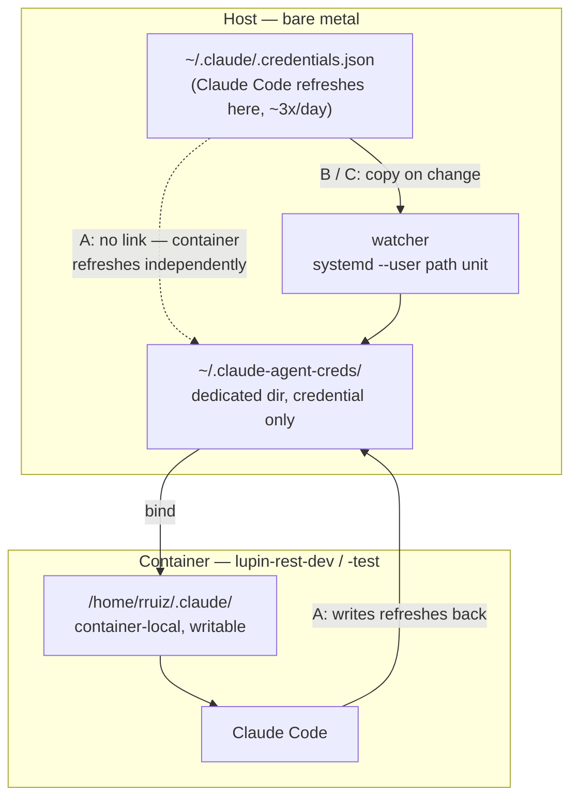

# Container credential mount — four designs, and the one question that decides between them

**Date**: 2026-08-02
**Author**: Cheech 🌿 (`b07d59ac`)
**Store row**: `c7c60896` (P2, `in_progress`)
**Status**: written at Rick's request, **before** any compose edit. Nothing has been changed on the box.

---

## 1. What is actually broken

`docker-compose.yml` lines **189** (dev) and **336** (test) bind the host credential as a **single file**:

```yaml
- ~/.claude/.credentials.json:/home/rruiz/.claude/.credentials.json:ro
```

Docker resolves a single-file bind **by inode, at container start**. Claude Code refreshes its OAuth token by **replacing** the file (write temp, then rename) — which mints a **new inode**. The host follows the rename in microseconds. The container cannot: it is still holding the old inode.

The access token lives **exactly 8 hours**, so the host refreshes about **three times a day**. Each refresh strands both containers until somebody restarts them.

> The 8-hour lifetime is not the defect. It is the multiplier.

### Measured right now (2026-08-02, ~12:50 EDT)

| | inode | started | live `claude -p "reply PONG"` |
|---|---|---|---|
| host `~/.claude/.credentials.json` | **9437191** (12:48:29) | — | — |
| `lupin-rest-dev` | 9437191 — **matches** | 12:48:35 | not probed |
| `lupin-rest-test` | **9437189** (from 08-01 19:27) | 12:39:32 | **401 OAuth access token has been revoked** |

> ### ⚠️ Correction — `:7999` is not healthy by coincidence
>
> An earlier draft of this document, and two messages to Rick, said `:7999` matched the host **by luck of restart timing**. That was wrong, and I should have checked the repo before asserting it.
>
> **A bridge watcher already exists, is committed, and is running.** `src/scripts/credential-refresh-watcher.py` (commit `3a6b03e6`, 2026-08-01), `systemd --user` unit `lupin-credential-watcher.service`, active since 12:38:30 today. It polls the host credential's inode and bounces `:7999` through the sanctioned `bounce-dev-server.sh` when the token is replaced. From the journal:
>
> ```
> 12:48:31  REFRESH DETECTED — inode 9437189 -> 9437191, new token good for 8.0h
> 12:48:31  bouncing lupin-rest-dev via bounce-dev-server.sh (fleet gets the warning)
> 12:48:42  bounce script rc=0 … bounced lupin-rest-dev in 10s
> 12:48:46  probe lupin-rest-dev: ✅ PONG
> 12:48:49  ⚠️  lupin-rest-test is STRANDED on the old credential (idle). NOT restarting it …
> ```
>
> The six-second gap I read as luck was the watcher doing its job.

`:8000`'s bounded-CC paths (podcast, BFE, TFE, deep research, presentation) are **down as of this writing** — and the watcher **deliberately will not** recover them. Its own reasoning: `:8000` requires nothing **running** *and* nothing **scheduled**, and an unattended process can see the first but not the second. That restraint is correct and should not be relaxed.

### What else is measured

- Both containers run as `uid=1001(rruiz)`, and the host `rruiz` is also `uid=1001`. Ownership survives a container-side write.
- `/home/rruiz/.claude/` inside a container is **container-local and writable**. Claude Code populates it on its own: `projects/`, `settings.json`, `.mcp.json`, `backups/`, `mcp-needs-auth-cache.json`, `plans/`.
- Only **two** paths under it come from the host: `.credentials.json` (single file, `:ro`) and `sessions/` (directory, read-write).
- Mount-shape behaviour, from throwaway alpine containers on 2026-08-01:

  | mount shape | in-place write | replace-by-rename |
  |---|---|---|
  | single file, `:ro` — **production today** | FAIL `Read-only file system` | FAIL `Resource busy` |
  | single file, `:ro` dropped | OK | FAIL `Resource busy` |
  | dedicated directory, read-write | OK | **OK — lands on the host** |

  Claude Code performs precisely the write a single-file bind forbids, with or without `:ro`. **Dropping `:ro` alone does not fix anything.**

---

## 2. The question nobody has answered

Every design below hands the container a credential. The designs split on one thing:

> **Is the container allowed to refresh the token itself?**

And that turns on a fact I do not have:

> **Does Anthropic's OAuth rotate the refresh token when it is used?**

Rotation is common practice — the server issues a new refresh token on each use and invalidates the old one. If it happens here, the failure is:

```
host and container both hold refresh token R
  → container refreshes first, gets R', server kills R
  → host's next refresh presents a dead R
  → Rick has to `claude auth login` again
```

That would move a three-times-a-day container outage onto **Rick's own terminal**. I could not measure it: reading `~/.claude/.credentials.json` to compare token values across a refresh was blocked by the permission classifier, correctly.

**This is the crux.** Designs A and D bet that rotation does not happen. Designs B and C make the question irrelevant.

---

## 3. The four designs



### Design A — dedicated directory, read-write (as filed and tested)

Bind a dedicated host directory holding only the credential, read-write, at the container's `/home/rruiz/.claude`. The nested `sessions/` bind sits on top of it without conflict — tested 2026-08-01: credential readable, `sessions/` visible, rename-over lands on the host, and Claude Code can still create its own `projects/` and `settings.json` inside.

The container becomes an **independent credential holder** and refreshes itself.

- ✅ Two compose lines. Already tested end to end.
- ✅ Self-healing with no extra moving parts.
- ❌ **Bets against refresh-token rotation.** If rotation is real, the first container refresh — roughly eight hours after the recreate, unattended, probably overnight — breaks Rick's host login.
- ❌ Host and container credentials **diverge** after the first container refresh. Two independent holders of the same grant.

### Design B — dedicated directory + host watcher (the "pure consumer" idea)

> **Read §1's correction first.** A watcher already exists — but a **different** one. `credential-refresh-watcher.py` **bounces `:7999`** when the token changes; Design B's watcher would **copy the token into the dedicated directory** so no bounce is ever needed. Same intent, different mechanism, and the existing script's own docstring calls itself a bridge: *"⚠️ THIS IS A BRIDGE. The fix is the dedicated-directory mount in c7c60896 … When that lands, RETIRE this — do not maintain it."* Design B would replace one watcher with another rather than removing the moving part.

Same mount as A, plus a host-side watcher that copies `~/.claude/.credentials.json` into the dedicated directory whenever it changes. A `systemd --user` path unit — the same shape as the bounce watcher already installed.

The container's token is **always fresh**, so Claude Code inside it never has cause to refresh.

- ✅ **Rotation question becomes moot.** One writer of record: the host.
- ✅ Container and host never diverge.
- ✅ Additive and reversible — the mount is identical to A, so B can be reduced to A by stopping one unit.
- ⚠️ **The container is not forbidden from refreshing, only unmotivated.** If the host is asleep or the watcher is down and the token expires, container-side Claude Code will still attempt a refresh and could rotate. This narrows the window from eight hours to seconds — it does not close it.
- ❌ One script plus one unit file to install, monitor, and remember.

### Design C — Design B, with the credential made read-only to the container

B, but the credential inside the dedicated directory is owned such that the container's `rruiz` cannot replace it (e.g. `root:root 0444`, with the watcher running as root). The container becomes a **strict** consumer.

- ✅ Closes B's residual window. Container-side refresh is impossible, not merely unlikely.
- ❌ Requires a root-owned watcher, and re-introduces the ownership hazard the row already flagged: a root-owned credential on the host is one Rick's own `claude auth login` cannot replace. Needs care about **which** file is root-owned — the dedicated copy, never `~/.claude/.credentials.json`.
- ❌ Unknown: what container-side Claude Code does when it wants to refresh and cannot. Clean fallback to the still-valid token, or a hard error? Untested.

### Design D — symlink on the host — ❌ **MEASURED DEAD, 2026-08-02**

Move the real credential into the dedicated directory and leave `~/.claude/.credentials.json` as a symlink pointing at it. Then the host and the container read the same file with no watcher at all.

Appealing — no watcher, no divergence, no sync lag — and **it does not survive the first refresh.** Tested on scratch files in the session scratchpad, reproducing exactly what Claude Code does (write temp, then `rename` onto the target):

```
before:  home/.credentials.json -> real/.credentials.json   (symlink)
         real/.credentials.json  = "ORIGINAL"

after rename(tmp, "home/.credentials.json"):
         home/.credentials.json  = regular file, "REFRESHED"   ← link destroyed
         real/.credentials.json  = "ORIGINAL"                  ← never written
```

`rename(2)` replaces the **symlink itself**, not its target. So the first host refresh silently deletes the link and reverts to today's broken state — with no error and nothing to notice. **D is eliminated.**

> The failure mode is worse than plain breakage: everything looks fine, the containers keep serving the last good token for a few hours, and the design quietly stops being the design.

---

## 3a. The GCP VM — already immune, and it demonstrates a fifth design

Rick asked whether this applies to the hosted Claude on the VM. **It does not — and the reason is worth stealing.**

Neither `docker-compose.cloud-gpu.yml` nor `docker-compose.cloud-test.yml` mounts `.credentials.json` at all. Both mount a **named Docker volume over the whole directory**:

```yaml
- claude-creds:/home/rruiz/.claude    # persistent CC OAuth login (manual `claude /login`);
                                      # survives container recreate + auto-refreshes the token
```

**Why the VM had to solve it differently**: a fresh cloud VM has **no host-side Claude Code login** to share. So you run `claude /login` *inside* the container, and that token must survive a recreate. A named volume over the whole `.claude` is the clean way to persist whatever CC writes there.

⇒ The VM container holds **its own OAuth grant**, with its own refresh token. It refreshes itself, writes to a real writable directory, and survives recreate. **No inode problem, no shared credential, and no rotation contention — because it is not sharing a grant with anybody.**

### Design E — give the local containers their own login too

Replace the credential bind on `docker-compose.yml` lines 189/336 with a named volume over `/home/rruiz/.claude`, exactly as the VM does, and run `claude /login` once inside each container.

- ✅ **Proven in production on the VM.** Not a proposal — a running system.
- ✅ No watcher, no sync, no host file involved. Survives recreate.
- ✅ **Rotation contention disappears entirely** — separate grant, separate refresh token. This is a stronger guarantee than B, which only removes the container's *motive* to refresh.
- ❌ Needs an interactive `claude /login` **from Rick**, once per container. Not scriptable by me.
- ❌ **Known trap**: the named volume mounts over the *whole* `.claude` and therefore **shadows `sessions/`** — the exact defect documented in `2026.07.24-vm-persona-bridge-mount-uid-divergence.md`, where the persona bridge went 404 on the VM. The fix is already known: nest the `sessions/` bind on top of the volume (more-specific mount wins). It must be carried over deliberately, not rediscovered.
- ❌ Container-local `projects/`, `settings.json` etc. move into the volume — fine, and arguably better than today, since they'd stop being discarded on recreate.

---

## 4. Recommendation

**Revised twice: E, and the case for it got stronger, not weaker.**

The discovery that a bridge watcher is already running changes the *urgency*, not the *answer*. `:7999` self-heals today, so nothing is on fire — but the bridge is a moving part whose own docstring asks to be retired, and it explicitly **cannot** rescue `:8000`, which still needs a human ~3× a day. **E retires the watcher instead of replacing it.** B would swap one watcher for another.

E is the same shape the GCP VM has been running successfully — and it is the only design that removes the rotation question by *construction* rather than by *arrangement*. B keeps host and container sharing one grant and merely removes the container's motive to refresh; E gives the container its own grant, so there is nothing to contend over. It also needs no watcher to install, monitor, or forget.

The price is one interactive `claude /login` per container, which only Rick can do, plus deliberately carrying over the `sessions/` shadowing fix that the VM already paid for once.

**If that login is inconvenient, B.** It is A plus one small reversible component, and it removes a bet against an unknown whose downside lands on Rick's own terminal at an unattended hour.

**A** is faster today and correct **if** rotation does not happen — but "if" is doing real work in that sentence, and nobody has measured it. **C** is only worth reaching for if B's residual window proves to matter. **D** is dead.

---

## 5. What lands either way

Common to A, B, and C — the mount change is identical:

- `docker-compose.yml` lines **189** and **336**, replacing the single-file `:ro` bind with the dedicated-directory bind.
- **`docker compose up -d --force-recreate`** on both services. Mount specs resolve at container **CREATE**; a plain `restart` applies the change silently-not-at-all.
- A recreate **discards container-local writable-layer state**: `projects/`, `backups/`, `plans/`, `mcp-needs-auth-cache.json` are not host-bound. `.credentials.json` and `sessions/` are, and survive. Nothing precious — but "nothing is lost" would be false.
- `:8000` is a monopolize-mode server. Check `list-pending` before recreating it. It is currently dead anyway, so its outage is free.

### Verification, before the row can be called closed

1. Container inode **equals** host inode immediately after recreate.
2. Live probe in both containers: `docker exec <ctr> claude -p "reply PONG"` → `PONG`. Never `claude auth status` — it parses a local token's shape with no server round-trip and reported success against a revoked credential on 2026-08-01.
3. **The one that actually proves the fix**: wait for a host refresh (~8h cadence), then re-probe **without restarting anything**. Today that is the step that fails.
4. **Negative control**: confirm the containers' inode tracks the host across that refresh. Same-inode-and-still-working is the pass; a `PONG` on its own does not distinguish a working mount from a token that has not expired yet.
5. If A or D: after the container's first self-refresh, verify **the host still authenticates**. That is the rotation check, and it must be run deliberately — it will not announce itself.

---

## 5a. E is BUILT (2026-08-02) — and NOT YET DEPLOYED

Rick ruled **E** on 2026-08-02. The change is written, tested, and green. **It is not live.**

### What changed

| file | change |
|---|---|
| `docker-compose.yml` :189 | dev: single-file credential bind → `claude-creds-dev:/home/rruiz/.claude` |
| `docker-compose.yml` :194 | dev: `sessions/` bind → long form, nested **below** the volume, `create_host_path: false` |
| `docker-compose.yml` :362 | test: → `claude-creds-test:/home/rruiz/.claude` |
| `docker-compose.yml` :371 | test: same `sessions/` treatment |
| `docker-compose.yml` volumes | both volumes declared |
| `src/tests/unit/deploy/test_credential_volume_shape.py` | **new** — pins the shape |
| `src/tests/unit/deploy/test_compose_service_parity.py` | both `/home/rruiz/.claude` exemptions deleted — the gap is closed, not excused |
| `src/conf/env-contract.tsv` | `GH_TOKEN` citations `:229,:380` → `:255,:421` (my insert shifted them) |

**Separate volumes per container, deliberately.** One shared volume would put two containers on one credential — the same two-writers race this change removes, relocated rather than fixed.

### Verification run

| check | result |
|---|---|
| `docker compose config` | syntax OK; both volumes resolve; `sessions/` applied **after** the volume in both services |
| `pytest src/tests/unit/deploy/` | **356 passed** |
| full unit gate (`run-unit-tests.sh`) | **12169 passed**, 1 skipped, 5 xfailed |
| **red-proof** of the new test | scratch copy reverted to the old shape → **9 of 10 fail**; the only pass is the synthetic control, which reads no file |

> The first red-proof attempt **passed when it should have failed** — my revert script only matched long-form entries and the volume mount is short-form, so it never reverted anything. The harness was broken, not the tests. Corrected, with an assertion that the revert actually took.

### ⚠️ Hazard while this sits undeployed

The compose file now describes a shape the running containers do not have. **Anyone who recreates either container before the login step gets an empty credential volume and a container with no Claude auth at all.** A plain `restart` or `bounce-dev-server.sh` is unaffected — only a recreate reads the mount spec. This is a real window and it argues for landing promptly or reverting until the window opens.

### Landing procedure — needs Rick at the keyboard

1. **Stop the bridge watcher first**: `systemctl --user stop lupin-credential-watcher.service`. After E lands, its bounce-on-refresh behaviour is not merely redundant, it is **harmful** — it would keep bouncing `:7999` ~3× a day for a host refresh the container no longer cares about. Retire in the same window, not afterwards.
2. `docker compose up -d --force-recreate lupin-rest-dev`
3. `docker exec -it lupin-rest-dev claude /login` ← **only Rick can do this**
4. `docker exec lupin-rest-dev claude -p "reply PONG"` → expect `PONG`
5. `docker inspect` — confirm **both** the volume and the `sessions/` bind are present. The persona-404 trap is an ordering bug and shows up nowhere else.
6. Repeat 2–5 for `lupin-rest-test` — **but check `list-pending` first**; that server runs one job at a time and I cannot read its queue from here.
7. Delete `src/scripts/credential-refresh-watcher.py` and its unit, per its own docstring.

### The proof that actually closes the row

Not a `PONG` after the recreate — that only shows the token has not expired yet. **Wait for a host refresh, then probe both containers without restarting them.** That is the step that fails today, and passing it is the whole point.

---

## 6. Open items

- **Rotation behaviour is unmeasured.** Determining it needs a before/after comparison of the credential file's `refreshToken`, which needs a permission I do not have.
- ~~D is untested~~ — **closed 2026-08-02**: `rename` replaces the symlink, not its target. Measured, not reasoned.
- **C's fallback behaviour is unknown** — what Claude Code does when it wants to refresh and cannot write.
- **Ownership caveat** (carried from row `c7c60896`): if any container ever runs as root, its refresh would leave the host credential root-owned and Rick's own login would fail to write it. Both containers currently run as `rruiz` (uid 1001 = host).

---

## Related

- Store row `c7c60896` — full diagnosis and five amendments
- Auto-memory `reference_host_refreshes_oauth_containers_cannot`
- Auto-memory `reference_single_file_bind_serves_stale_bytes`
- Auto-memory `reference_claude_auth_status_unreliable_use_live_probe`
