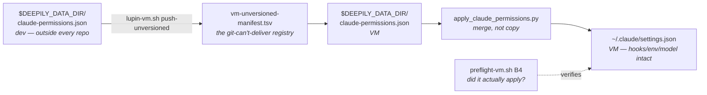

# Claude Code permission sync: dev → VM

**Date**: 2026-08-04
**Author**: Cheech 🌿 (session 17512c59)
**Status**: ✅ Implemented and verified on `lupin-host-test`
**Approved by**: Rick, 2026-08-04 — including the amendment that the permission file stay out of the repo

---

## The problem

Claude Code sessions on the VM stopped to ask permission for routine work. Sessions on the dev
box did not. Rick asked how to carry permissions across generically.

The generic part has a short answer: **a bare tool name is already the wildcard.** `Bash`,
`Read`, `Write` — no parentheses — grant the whole tool and contain no path, so they travel to
any machine. The dev box's `~/.claude/settings.json` grants thirteen of them plus three deny
guards and `defaultMode: "auto"`. The VM granted none of them.

Two facts explain why the obvious fixes fail:

| Attempted fix | Why it fails |
|---|---|
| Copy `~/.claude/settings.json` to the VM | It carries machine-specific `hooks`, `env`, `model` and `heartbeat` keys. A copy clobbers the VM's own values. |
| Ship the project's 510-rule `.claude/settings.local.json` | It is gitignored, so `deploy` never sees it — and **96 of its rules hard-code `/mnt/DATA01/…`**, a path that cannot exist on the VM (`/mnt/lupin-data/lupin`). |

Nothing expands `$LUPIN_ROOT` inside a permission pattern, and a `*` cannot rescue an absolute
prefix. Those 96 rules would arrive and silently do nothing.

## The design

**Only portable rules travel, and they get merged — never copied.**

### Five pieces

| Piece | Role |
|---|---|
| `$DEEPILY_DATA_DIR/claude-permissions.json` | The portable stanza — `allow`, `deny`, `defaultMode`. **Deliberately not in any repo** (Rick's ruling). |
| `src/scripts/apply_claude_permissions.py` | Tracked code. Merges the stanza into any `~/.claude/settings.json`, leaving every other key alone. Idempotent, backs up first, re-parses to prove valid JSON. |
| `src/conf/env-contract.tsv` | Declares `DEEPILY_DATA_DIR` (HOST / push-env / PATH_VM / REQUIRED). |
| `src/conf/vm-unversioned-manifest.tsv` | Ships the stanza. The file lives outside the repo, so git cannot carry it — exactly this manifest's category. |
| `preflight-vm.sh` check **B4** | Asserts the stanza was **applied**, not merely **present**. |

### Why B4 exists separately from B3

B3 already proves the source file arrived, for free, from the manifest row. That is half the job:
the stanza is a **source** file, not a live settings file. Nothing reads it until the merge runs.
A shipped-but-unapplied stanza passes B3 and still leaves every session prompting. B4 asks the
question B3 cannot: *does `~/.claude/settings.json` actually carry these rules?*

It is a WARN, not a BLOCK — a VM that prompts too much is annoying, not unfit to deploy onto.

### The portability guard

`load_stanza()` **refuses** a source file containing any rule with a machine-specific absolute
prefix (`/mnt/`, `/home/`, `/Users/`, `/var/`, `/opt/`, `/srv/`) and names every offender. You
learn at authoring time that a rule cannot travel, instead of discovering dead rules on the VM
months later — which is precisely how the 96 went unnoticed.

## Verification

Unit: **28 tests, 100% lines and branches** on the applier (`src/tests/unit/deploy/test_apply_claude_permissions.py`).
The suite is built around controls that must **fail**, because a check that cannot fail is decoration:

- a non-portable rule **must** be refused, and the error **must** name the offender
- `--verify` **must** exit 1 on a target missing a rule
- the merge **must** leave `hooks` / `env` / `model` / `heartbeat` byte-identical

On the real VM, predicted before running and matched exactly:

| Control | Predicted | Observed |
|---|---|---|
| A — verify a target with `Write` removed | exit 1, names `allow: Write` | ✅ exit 1, `allow: Write` |
| B — merge into it | adds exactly `['Write']` | ✅ `ALLOW +1: ['Write']` |
| C — re-verify | exit 0, in sync | ✅ exit 0 |
| REAL — live `~/.claude/settings.json` | exit 0, in sync | ✅ exit 0 |

Control B also reported `UNTOUCHED ['disableAgentView', 'env', 'hooks', 'theme', 'model',
'enableAllProjectMcpServers', 'enabledMcpjsonServers']` — the no-clobber property demonstrated on
the real machine, not only in tests.

Full deploy suite: **386 passed**. The pre-existing `test_push_env_contract_derivation` guard
caught the new contract row and was updated deliberately.

## Known limits

- **Claude Code loads settings at startup.** Nothing here reaches an already-running session.
  `push-unversioned` prints a restart reminder; `deploy` inherits it.
- **Scope is the user-level stanza only.** The project's 510-rule `settings.local.json` stays
  gitignored and stays put. It is redundant now that bare `Bash`/`Read`/`Write` are granted.
- **The VM's checkout must carry the applier.** It lands with the next ordinary deploy; until
  then `push-unversioned` warns rather than failing.

## Prior state (2026-08-04, before this work)

A one-time hand-merge fixed Rick's immediate complaint: the VM's `~/.claude/settings.json` went
`allow` 99 → 111, `deny` 0 → 3, `defaultMode` unset → `auto`, backup at
`~/.claude/settings.json.bak-20260804-192441`. This mechanism is what keeps it from drifting.

Also found, unrelated but adjacent: the dev box's `~/.claude/settings.local.json` was **invalid
JSON** (three missing commas), so all sixteen of its rules were silently dead. Rick fixed it.
