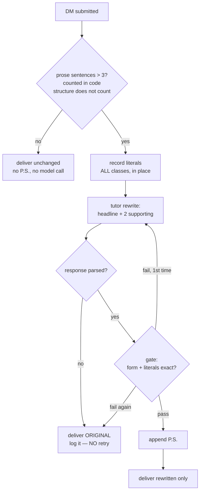

# DM Formatting Tutor — plan

**Date**: 2026-08-11
**Author**: María 🌸 (planning-is-prompting) · **Implementer**: Mr. Radio 🦉 (lupin)
**Status**: **APPROVED** — Rick, 2026-08-11, conditional on Mr Radio's sanity check, which is
complete: one blocker and three corrections, all accepted and folded in (see Provenance).
Ready to build at phase 0.
**Supersedes**: the arm-4 silent-compression approach, ruled a failed experiment 2026-08-07.
**Rests on**: [phase 2 findings](2026.08.07-arm-4-phase-2-findings-and-recommendation.md) ·
[phase 1 freeze protocol](2026.08.07-arm-4-phase-1-freeze-protocol-implementation.md) ·
the unfrozen control run of 2026-08-11.

---

## RESULTS SO FAR — 2026-08-11 evening, built and sampled while Rick was away

Phase 0 and a first pass of phase 1 are done. **The sample document exists** and is the
thing to read; this section is the map to it.

| | |
|---|---|
| Sample document | `/tmp/dm-tutor-samples-2026.08.11-1754.md` — 40 long messages, stride-picked |
| Delivered | **20 of 40**, single attempt, no retries |
| Over 3 sentences | **0** — when it delivers, the form holds |
| Literals altered | **1**, and it exposed a real hole in the tutor's gate |

### The three findings that changed the build

**1. The envelope was the binding constraint, and removing it beat repairing it.** Two
formats were tried and both failed on ~45% of long messages — XML+CDATA, then fences.
Dropping the envelope entirely, so the model's whole response *is* the rewrite, took
single-attempt delivery from **6/40 to 20/40** and eliminated the failure class. *A format
you cannot fail to produce beats a repair pass for one you can.* The model had been writing
three good sentences and then adding a heading — good rewrites discarded for a missing marker.

**2. 🔴 The tutor deleted the ask — 9 of 9.** Every rewrite whose original asked a question
came back with no question in it. One example: a status DM ending *"want me to submit it, or
are you batching the branch's e2e?"* became three sentences of cost figures with the request
gone. **The P.S. cannot rescue this** — the recipient never learns a question was asked.
Fixed as a prompt rule *and* a gate: a rewrite whose original asked something and which asks
nothing is rejected.

**3. The ask is expensive, and the first measurement said otherwise.** With the envelope
still failing, ask-bearing and no-ask messages delivered at 14% and 16% — "essentially free."
With the envelope gone: **no-ask 74%, ask-bearing 29%.** A dominant failure had been swamping
both arms and hiding the effect. ⏳ **A/B running now** — the ask inside the three sentences
versus in its own slot, one code path, single flag.

### The ask-placement arms — three tried, none settled

All on the **same 23 ask-bearing long messages**, single attempt.

### ✅ SETTLED — the clean run. Recommendation: **C′, the ask leads**

All one-spec prompts, same 23 ask-bearing messages, differing **only** in where the request
goes. **Noise floor pre-registered before the numbers were seen**: ~9% per-row flip at
temperature 0 is ~2 messages at n=23, so a gap under ~4 means nothing.

| arm | the request goes | delivered | lines/rewrite |
|---|---|---|---|
| **A′** | in the second sentence | **6/23** | 2.0 |
| **B′** | on its own fourth line | **12/23** | 2.3 |
| **C′** | **first — the ask leads** | **12/23** | **2.0** |

**Placement matters**: both beat A′ by **6**, three times the floor. **B′ and C′ are
indistinguishable** — zero apart. **The tiebreaker is cost**: C′ buys the same delivery
without the extra line.

⇒ **C′ is Rick's own idea**, once the classifier was removed and the prompt stopped
contradicting itself. The classify step was the flaw, not the insight.

Sample output: *"Please run your control (your test minus `--mute-audio` on `:7999`). If your
control FREEZES, ping me and I'll restore the flag immediately; if it ADVANCES, it stays out.
Your call drives it."* — request first, conditional intact, reads like a person.

⚠️ **Only 3 messages were delivered by all three arms**, so the literal-retention column is
too thin to read and is reported with its n attached or not at all.

---

🔴 **The earlier numbers below are FLOORS, NOT SCORES — that prompt contradicted itself.**
Rick found it by asking to *read the assembled prompt*: every variant appended its ask rule
**after** a block that had already claimed sentence one, so the model received two
instructions for one slot and followed the first. Every arm carried the contradiction, so
none of them was a fair test of its own idea. **C′ writes the spec once, branched in code.**

| arm | what it does | delivered | note |
|---|---|---|---|
| **A** | the ask lives inside the three sentences | **6/23** ⚠️ floor | 2.0 lines per rewrite |
| **B** | the ask gets a fourth line of its own | **8/23** ⚠️ floor | 3.0 lines |
| **C** | model classifies *asking vs telling*, ask leads | **1/23** ⚠️ floor | plus the classifier defect below |

🔴 **There is NO three-way comparison. Zero messages were delivered by all three arms**, so
the paired set is empty — per-arm rates are over different message sets and cannot be
differenced. Said plainly rather than papered over.

⚠️ **C's 1/23 is not a verdict on the idea.** The classification step is the mechanism: asked
whether a message is *asking* or *telling*, the model answers "telling" on traffic that does
both — and then drops the request **by its own verdict**. A and B never offer that permission.
It still fails 7 of 12 on a dropped ask with a widened detector.

⇒ **C′ is proposed and unrun**: delete the classify question, make it a conditional the code
already answers. We know from the detector whether the original asks; when it does, instruct
*"lead with the ask, phrased the way you'd ask a colleague."* Keeps what Rick was after — the
ask asked rather than announced, no fourth line — while never granting the model a decision
point at which it can rule the request away. **As it stands we tested a classifier, not the
idea.**

### 🔴 The number that should decide phase 1: one literal in nine

Across the delivered rewrites, **literal retention is ~10.7%**. Rick's requirement was that
*"hashes and other important technical pieces"* still get through; at that rate most technical
detail does not survive. It is the expected arithmetic of turning 20 claims into 3 — but it
**reframes the phase 1 question** from *"is the rewrite good"* to **"are these the RIGHT one
in nine"**, which is a reading judgement no checker here can make.

⚠️ The A-vs-B retention figures (10.7% vs 10.8%) are over **different delivered sets** —
survivor bias, not a tie. At 6 and 8 of 23 the honest paired comparison may be too thin to
support any claim, and should say so.

### What only a human reading catches

⚠️ **The ask survives but arrives bolted on**: *"The question is: Are the [pause] or
[excited] markers present…"*. Grammatically a question; reads like a form being filled. The
prompt says the ask must *"stay a question"*, which the model satisfies literally by
prefixing four words — the same shape as the ratio instruction it satisfied by ignoring.
**Any rule a model can satisfy on the surface, it will.** No gate should try to catch this;
it belongs in the reading, beside meaning-reversal.

---

## 0. What Rick asked for

> *"We've been going about this all wrong… LLMs do not count well. It would be far more
> effective to say three sentences instead of 60 words… take all of the DMs over 3
> sentences in length and rewrite them to follow the mandate… headline + two supporting
> statements + canned P.S. … So our compression would model brevity and would model how
> our agents ask for more details."*

And on sequencing:

> *"In our first phase we want to see how well and what the output looks like when we take
> long examples and chop them down to 3 most important sentences. We will then, after we
> approve of the outputs generated by the format tutor, double back and update the
> workflow to reinforce the message of 3 lines not 60 words. We want to be consistent in
> what we are quantifying."*

The name changes with the job. This is not a compressor — it does not chase a ratio. It is
a **formatting tutor**: it renders every long DM into the one shape we want agents to copy,
and it models asking for detail as well as giving it.

**Two problems, one instrument.** Verbosity is the visible one. The other is jargon and
mimetic drift in long-running agent conversations — a coined term enters one DM and is
fleet vocabulary a day later. A rewriter sitting between every pair of agents is the only
surface that touches both.

---

## 1. Rulings on record (Rick, 2026-08-11)

| Fork | Ruling |
|---|---|
| **Delivery** | The recipient receives **only** the 3-sentence version. Detail is gone unless they ask. |
| **Trigger** | Fires on DMs **over 3 sentences**, counted **in code**. The model is never asked to count. |
| **The P.S.** | Appended **only when detail was actually dropped** — so its presence is an honest signal. |
| **Sequencing** | **Sample output first, human approval, then the workflow change.** One quantity fleet-wide. |
| **Rejection re-run** | **Stood down** — *"hold off on that idea."* §2.3 stays unmeasured, deliberately. |

The first three were the recommended options and were chosen deliberately, not by timeout
(`default_used: false`).

---

## 2. Why this is not the failed arm wearing a new name

Arm 4 died at 3.0% against a 38% need. Three things make this a different experiment rather
than a retry, and all three are measured rather than argued.

### 2.1 The task changes axis — from ratio to form

§2 of the findings doc closed an entire class: telling the model its exact target moved the
whole sample by **73 tokens on 51,854**. Naming a number does not connect to the output, so
few-shot examples, restated targets and harder requirement wording go with it.

But §6 named the lever nobody had pulled:

> *"Restructuring the task — extractive selection rather than free rewriting — is untested
> and is a different lever."*

**A fixed target form is that lever.** *"Give me the headline and the two sentences that
matter"* is a selection task with a checkable answer. *"Remove 45% of this"* is an
estimation task the model cannot verify against itself.

### 2.2 Losslessness is dropped on purpose, which dissolves the tension that killed arm 4

The phase-2 finding at its sharpest:

> *"Freezing is what makes a rewrite safe; it may also be what makes a rewrite
> impossible."*

That only bit because the old design demanded **nothing be lost**. A model asked to preserve
30 opaque placeholders in a 900-word message *and* shorten it is being asked for two
incompatible things.

Here, **loss is the design**. Detail is meant to go. The P.S. is the recovery path, and the
sender still holds the original.

🔑 **And the obvious objection to a lossy channel does not apply, because DMs were never the
record** (Rick, 2026-08-11):

> *"DMs are intended to be ephemeral messaging artifacts and nothing more, because we already
> have a number of channels for institutional record keeping. By the end of the day we are
> literally shuttering the shop and starting fresh the next day."*

Institutional memory lives in `history.md`, `TODO.md`, the R&D documents and the task store.
Anything worth keeping belongs in one of those, **not** in a message that expires at close of
business. So "the tutor destroyed information" is only ever a claim about a conversation in
flight — never about the record.

### 2.3 The unfrozen control says the safety mechanism costs nothing

Mr Radio's 2026-08-11 run, 200 paired messages:

| measure | result | n |
|---|---|---|
| frozen vs unfrozen compression | **+0.2%** | 160 paired |
| on the undamaged subset | **−0.7%** | undamaged |
| raw model output vs its own input | **11.3%** shorter | **200 — all sampled** |
| what actually shipped under arm 4 | **3.0%** | 200 — all sampled |

⚠️ **Read the `n` column: these last two share a base, and an earlier draft's did not.**
The raw figure is 13.7% over the 160 *paired* rows, 12.1% counting failures as zero
(n=186), and **11.3% counting bypasses too (n=200)** — which is the only one comparable to
arm 4's 3.0%. Mr Radio caught the mismatch in his own number and I had inherited it. Same
defect §5.2 of the findings doc is about, so the comparable figure is the one printed.

⇒ **Freezing is free.** Rick's requirement — *"still allowing hashes and other important
technical pieces to be communicated"* — costs nothing in rewrite quality. There is no trade
to negotiate.

⇒ **The gates, not the model, were the bottleneck.** The model produced 11.3%; we delivered
3.0% — nearly a fourfold gap — and **106 of 160** rewrites passed the validator.

🔴 **What we do NOT know, and are not currently measuring**: *why* the other 54 were
rejected. That run recorded `frozen_valid` as a bare true/false and did not persist the
outputs or the violation reasons, so the breakdown is unrecoverable from it. A re-run was
offered and **Rick stood it down**.

**The tempting inference is that those rewrites were fine and the gate was merely fussy.
That is a guess and it is not made here.** §4's gate design is written so it does not
depend on the answer, and the place where the answer *would* change the build is marked.

---

## 3. The pipeline



### 3.1 The trigger — counted in code, never by the model

A deterministic sentence counter owns the decision. That is the whole point of Rick's
instruction: *LLMs do not count well*, so nothing here asks one to.

Edge cases the counter must handle, each with its own test: abbreviations (`e.g.`, `Dr.`),
decimals and versions (`v0.2.0`, `3.6s`), `file.py:249`, ellipses, and a trailing `?` or `!`.

**Markdown structure is not an edge case — it is most of the target population.** Mr Radio
parsed the corpus: **42% of 250+ messages and 25% of 150–250 contain a list or a table.**
Any counter that treats a table row or a bullet as a sentence will mis-fire on nearly half
the messages the tutor exists for.

⇒ **The counter needs a RULE, not a list of cases.** Mr Radio's point, and it is the right
one: enumerate the exceptions and we are back here for the next thing that looks like a line
but is not prose.

> **A sentence is a unit that carries a claim.** Anything that carries no claim of its own —
> a table row, a bullet, a header, a fenced block, a pointer to an attachment — is
> **structure**. Structure is not counted and is not rewritten.

Every case below follows from that rule rather than being bolted on beside it. **The
attachment pointer (§3.1a) is not a sentence for the same reason the table isn't**: it asserts
nothing. That closes open question 5.

The rule is also not mine to invent — the brevity mandate already says it:

> *"Tables and code blocks are **content, not prose** — they do not count against the line
> budget."*

So the counter counts **prose sentences only**. Fenced code, tables, bullet and numbered
lists, headers and block quotes are **structure**: they are not sentences, they do not count
toward the three, and **the tutor does not rewrite them**. A message of one prose line and a
six-row table is a one-sentence message that happens to carry a table — it passes through
untouched.

This is the same rule we already hand to humans and agents, which is the point: the tutor
should enforce the mandate we have, not a second one that disagrees with it.

### 3.1a Structure goes to an attachment (Rick, 2026-08-11)

> *"Would the 2 of you concur that things like tables, stack traces, and lists belong in
> attachment files written to the temp directory: `/tmp/maria-MSG-HASH.md`?"*

**Both of us concur.** Structure is extracted to a file **before the prompt is built**, and
the DM carries a pointer to it.

| what it fixes | how |
|---|---|
| The counter's hardest case | Structure leaves the body, so "three sentences" is unambiguous — the counter only ever sees prose |
| The tutor rewriting a table | It cannot, because the table is no longer in the text it is handed |
| Payload size | The 42% of long messages carrying a list or table get substantially smaller — which matters, see the caveat below |

**Naming**: `/tmp/<persona>-<MSG-HASH>.md`. Self-attributing, collision-free, greppable.

⚠️ **Do NOT sell this as a fix for the parse failures.** I initially argued attachments would
carry the CDATA-hostile characters out of the payload; **Mr Radio falsified it against all 200
bodies** — zero contain `]]>`, zero contain a response tag, one has a code fence, and the 14
with angle brackets fail *less* (7% vs 12%). There is no envelope-hostile payload in this
traffic. Attachments help **only** by making the payload shorter, and length is the axis that
actually moves failure (§6). A size effect, not an escaping one.

**`/tmp` is the right home, and my objection to it is withdrawn.** I argued the nightly wipe
would leave a DM pointing at a dead file. Rick's ruling above retires that: DMs are ephemeral
and the shop shutters nightly, so the attachment and the message it belongs to expire
together. The only requirement is **within-day survival**, which `/tmp` demonstrably meets —
136 entries when measured on 08-06, none older than that day.

🔑 **The trigger will not silently miss long messages.** Mr Radio measured the other
direction too: only **1% of 80–150** and **0% of longer** messages come in under three
sentences by punctuation. Nothing long slips through by accident.

### 3.2 The target form

```
<headline — the verdict, one sentence>
<supporting sentence 1>
<supporting sentence 2>

P.S. Need more detail? Ask me *one* question only!
```

The headline is the **verdict**, not a topic label — the brevity mandate's own rule, made
into the shape of the channel rather than advice about it.

### 3.3 The P.S. — only when something was dropped

Its presence is information: *this is a summary and there is more behind it*. A DM that was
already three sentences is untouched and carries none, so the line never promises detail
that does not exist.

It also models the half of the loop brevity rules normally leave out: **how to ask**. One
question, not an interrogation.

### 3.4 Literals — checked in place, across EVERY class

The one place existing `freeze.py` semantics must change, for a structural reason rather
than a tuning preference.

The freeze tier's contract is *"every `[[Lnn]]` placeholder must appear in the output
exactly once."* Under a design that deliberately drops most of a message **that assertion is
false** — a dropped sentence takes its placeholders with it. So the contract becomes:

> Every literal that appears in the output must be **byte-exact** to how it was sent.
> Literals may be **absent** — that is what dropping a sentence means. None may be **altered**.

🔴 **An earlier draft said "use the VERIFY tier" and that was wrong in the one way that
matters.** Mr Radio checked the code against the prose. `VERIFY_KINDS` is exactly:

```
PORT · ISSUE · SECTION · DELTA · GLYPH · MONEY · NUMUNIT · INT
```

**Every class Rick actually named is HARD tier** — `SHA`, `FILELINE`, `PATH`, `URL`,
`IDENT`, `SEMVER`, `UUID`, `EMAIL` — meaning it is *substituted*, never checked in place. A
tutor that freezes nothing and leans on verify-tier checking would give shas and `file:line`
refs **no protection at all**. The section was named for the guarantee it silently dropped.
Confirmed independently by printing the three tier tuples.

**The correct change**: the in-place check derives from **all of `_PATTERNS`**, not the
VERIFY subset. The tier taxonomy answers *"is a placeholder cheaper than this literal?"* —
a question about substitution economics that a lossy tutor never asks. **In-place checking
costs zero tokens for every class**, so there is no reason to restrict it to the cheap ones.

**And the subset change itself is smaller than I wrote it.** Per Mr Radio, in check 7:
`have != want` becomes `have > want`, and the second loop stays. Mutation is still caught,
because an altered literal appears as one that was never sent. Strict mode is untouched for
existing callers.

⚠️ **Named limitation, carried from phase 1**: this catches omission and mutation, never
**relocation**. A sha attached to the wrong claim passes every check here. The old design at
least confined placeholders to their clause; a three-sentence rewrite restructures freely,
so **relocation risk goes up**. §7 says how we watch it.

### 3.5 Jargon — the WaHH pass

The tutor carries the plain-English rule as a rewrite instruction, not a scolding:

- Say it the way you would say it to a colleague in a work email.
- Terms of art predating this fleet are fine (`idempotent`, `regression`, `migration`).
- Vocabulary **we invented** gets replaced with what it means.

This is where mimetic drift is actually cut — not by asking senders to stop, which we have
measured does not work, but by the coined term never reaching the reader.

---

## 4. The gate — form, not ratio

Arm 4's gate asked *did every placeholder survive exactly once* and *did it get at least 5%
shorter*. Both are wrong here.

**The tutor's pass condition:**

1. Output is **3 sentences or fewer** (same counter as the trigger).
2. Every literal present is **byte-exact** (§3.4).
3. Output is **not longer** than the input.
4. Output is non-empty and is not a refusal or a comment on the message.

**No minimum-gain gate.** A message that arrives at three sentences has done the job whatever
its byte saving.

**One retry on a GATE failure, then fall back to the original.** The expert review's *"begin
with no synchronous retry"* was written against a 3× loop between sender and recipient; arm 4
ignored it and paid a 168.5s tail. One retry is the compromise, and it is measured — if second
attempts rarely succeed, it goes.

**A PARSE failure does not retry — it falls straight through to the original.** Mr Radio
asked which path the diagram meant; this closes it. A gate failure means the model produced
something and it was wrong, which a second attempt can plausibly fix. A malformed response is
a different animal, and the record already rules on it:

> *"A malformed-XML response is not a transient fault. Asking the same model the same
> question again mostly buys the same answer, slower."*

Retrying parse failures is precisely what built arm 4's 168.5s tail, and removing it cut the
tail **9×**. The right fix for malformed responses is §6, not a second attempt.

⏳ **Where §2.3's unmeasured answer would matter**: if it turned out most rejected rewrites
already satisfy condition 1, the form gate simply replaces the old one and the build is
small. If few do, the tutor needs its own repair path and the build is larger. **Phase 4
measures this directly on the tutor's own output**, which answers the question for the thing
we are actually shipping rather than for its predecessor.

---

## 5. Phase 1 — the sample document Rick asked for FIRST

**The deliverable is something Rick reads, not a metric.** Before any gate is tuned, before
any workflow text changes, before anything reaches a recipient: *what do these rewrites
actually look like?*

**Shape of the run:**
- The pinned corpus, **long messages only** — the 150–250 and 250+ bands, where the tutor
  earns or loses its case. Roughly 30–40 messages.
- Each sample printed **original → rewrite**, in full, side by side.
- Nothing delivered. No DM path. Offline against the snapshot.
- Literal checks reported as **observers**: what the rewrite dropped, what it kept, what it
  altered — the last of which should be zero.

**What Rick is being asked to judge**, stated so the answer is not merely "looks fine":
1. Is the **headline the verdict**, or a topic label?
2. Did the two supporting sentences keep what **mattered**, or what came first?
3. Is anything lost that a recipient **could not recover with one question**?
4. Did **negation, ownership, status and conditionality** survive? (*"not reproducible"* →
   *"reproducible"* is the failure that matters most, and it is invisible to every structural
   check we have.)
5. Does it read like a **human colleague** wrote it?

🔴 **The transport fix comes FIRST — I was wrong to put it after.** An earlier draft said
parse failures do not block this phase, on the grounds that a failed parse is simply counted
rather than hidden. Mr Radio's objection is correct and I withdraw mine:

> Parse failures were **15 of 50** in the unfrozen 250+ band. Phase 1 samples 150–250 and
> 250+ **only**, so roughly a third of the hardest messages would produce no rewrite to show
> — and Rick would be judging output quality on a set that **systematically excludes the
> messages most likely to be rewritten badly.**

Counting the failures is honest but does not repair the sample. **Being transparent about a
biased sample is not the same as not having one.** §6 now runs before phase 1.

⚠️ **A sample chosen to flatter is worthless.** Messages are picked by stride from the corpus,
not by hand, and **every** rewrite in the chosen set appears — including the bad ones. If a
rewrite is embarrassing, that is the finding.

🔴 **The sample document lives OUTSIDE the repo — ruled** (Rick, 2026-08-11):

> *"Let's make the sample document live outside of the repo for now. No point in keeping it
> for posterity's sake, it's just an intermediary step before we continue down this path."*

It carries real DM bodies — the same disclosure reason the corpus itself is out of git — and
it is an intermediate artefact, not a record. Written outside the repo, read locally, and
only the **counts and Rick's verdict** are committed. This closes what was open question 4.

---

## 6. The transport must be fixed before anything DELIVERS

Every failure in the unfrozen run was an **XML parsing error**, and the unfrozen 250+ band
failed **15 of 50**.

**The messages that break the envelope are exactly the messages the tutor exists to rewrite.**
Shipping in-path on the current CDATA-inside-XML format means failing most often on the main
target.

**What has been ruled out already, by measurement rather than argument:**

| candidate | verdict |
|---|---|
| Context-window overflow | **Dead.** Template 742 tokens + largest 250+ prompt 2,078, `max_tokens` 4096 against a model length of 8,192. Zero of the 111 long bodies can overflow. Killed by arithmetic before a call was spent |
| CDATA-hostile payload echoing through | **Dead.** Zero of 200 bodies contain `]]>`, zero a response tag, one a code fence. The 14 with angle brackets fail *less* — 7% vs 12%. **This was my hypothesis and it is falsified** |

**What the evidence points at instead: length.** Failed unfrozen calls have a median input of
**456 tokens against 219** for those that parsed. The frozen arm's failures are flat (234 vs
220) — and freezing shrinks the input ~26%, so the arms were never the same length at the same
band. Per band, unfrozen failures run 2/36 · 1/50 · 4/50 · **15/50** against median inputs of
96 · 164 · 276 · 456 tokens.

🔴 **The failures are NOT reproducible, and this changes how everything here must be measured.**
An earlier reading said the same `body_sha` fails again at temperature 0. The full set says
otherwise: of 22 re-run failures, **2 parsed cleanly** on identical input, identical prompt,
temperature 0. **vLLM gives roughly 9% swing between passes.**

⇒ **A single pass is not ground truth.** Any before/after measured once can move ~9 points on
sampling alone — enough to manufacture an improvement that is not there, or to hide one that
is. **This is a lower bound on every per-row claim in this program.**

⇒ **Aggregate claims survive; per-row claims do not.** Arm 4's 3.0% reproduced twice across
200-message runs, because per-row flips wash out at that scale. *"This specific message fails"*
does not survive, and neither does a repair validated on one pass over 22 rows.

⇒ **Acceptance bars must be repeated-measure**, not single-pass — see §6's bar, restated
accordingly.

🔴 **RETRACTED — every claim about the response's SHAPE.** Mr Radio classified 20 captured
failures (no envelope / unterminated / unbalanced CDATA) and then withdrew the lot: the
exception truncates its own evidence. `util_xml_pydantic.py:69` does
`xml_content[:200] + "..."`, so every capture came back at exactly 203 characters. **He was
classifying the cut his own instrument had made.** The tell was uniformity — 46 tokens on
every row is not how malformed output behaves.

⇒ Gone with it: the shape classification and the "raw 46 tok, repetition 0%" columns.
Capture is being rebuilt to intercept at the client call, before the exception sees the text.

## ✅ MECHANISM FOUND — the model omits `</compressed>`

Captured at the client call, with an instrument that no longer truncates its own evidence:
responses run **378–810 tokens with zero repetition**. **8 of 10** close `<thoughts>`, balance
CDATA and close `<response>`, and drop exactly one tag. Two fail differently and are being
separated.

**There are TWO mechanisms, not one.** Row 11: a **69-token input produced 4,095 tokens at 95%
repeated lines** — the model looping into the ceiling, on the *shortest* message in the set.

| # | mechanism | population | fix |
|---|---|---|---|
| **1** | drops `</compressed>`, otherwise well-formed | **12 of 13** so far, long inputs | deterministic repair, no second call |
| **2** | **degenerate repetition into the 4096 cap** | ≥1, and it was a **short** input | a cap sized to the task + a stop condition |

**Mechanism 2 is the dangerous one and it is easy to miss**, because it is rare, it looks like
the same `XMLParsingError`, and it arrived on the message least likely to be suspected. A
repair pass tuned to mechanism 1 would post a healthy pass rate with mechanism 2 still live
underneath it.

⚠️ **It is also a latency defect, not only a parse defect.** 4,095 tokens from a 69-token input
is the same shape as arm 4's 168.5s tail. It fails slowly, which is the expensive way to fail.

🔑 **The tutor is unusually well placed against mechanism 2.** A headline plus two sentences
cannot legitimately exceed a few hundred tokens, so `max_tokens` can be sized to the task
rather than to the model. **A loop then dies in a fraction of a second instead of running to
4,096** — the cap stops being a ceiling nobody reaches and becomes the guard that catches this.

**My truncation hypothesis was killed and then un-killed within a minute** — falsified against
mechanism 1's rows, then confirmed by mechanism 2's. Both readings were drawn from real
captures; the error was concluding from the first ten rows of a set with two populations in
it.

**Pre-registered prediction, recorded before phase 1 rather than claimed after**: if the
mechanism is the model failing to stop, **the tutor should fail LESS on the same messages** —
*headline plus two sentences* is a stopping condition, *make this shorter* is not. If it fails
just as often, this prediction was wrong and the record says we made it first.

Options remain Mr Radio's, who holds the failing rows: a simpler envelope, a repair pass, or
constrained decoding — plus the task-sized `max_tokens` guard for mechanism 2.

**Acceptance bar, restated for a nondeterministic server**: the 250+ parse-failure rate comes
down on the same rows **across repeated passes**, and the improvement must **exceed the ~9%
single-pass swing** measured above. A repair that shows a 5-point gain on one pass has shown
nothing. Report the pass-to-pass spread alongside the mean, so the reader can see the noise
the claim is standing on.

---

## 7. Measuring the thing Rick actually wants

The stated goal is behavioural: *"force the recipients to mirror the three sentence mandate."*
That claim needs more care than the mechanical ones, because **we have already been wrong
about a mirroring effect once.**

On 2026-08-06 a within-persona and third-party mirroring correlation looked solid — then a
**placebo, messages the sender never saw, reproduced 93% of it.** Every behavioural projection
was withdrawn.

So this pre-registers the honest version, before any data:

**Primary, mechanical (safe to claim):**
- share of DMs arriving over 3 sentences, before and after;
- tokens delivered per DM;
- gate pass rate, parse-failure rate by band, added latency at p50/p99.

**Secondary, behavioural (claim only with a control):**
- Do senders' **unrewritten** DMs get shorter over time? The tutor never touched those, so a
  change in them is the sender adapting.
- **The control that makes it real**: a cohort whose *received* DMs are rewritten but whose
  *sent* DMs are never tutored. If both cohorts shorten equally, we are watching something
  else — exactly what the placebo showed.

**Relocation watch** (§3.4): a periodic hand-read of N rewrites against their originals,
because no automated check we own can see it.

⚠️ **No behavioural claim ships without that control.** The mechanical savings stand alone.

---

## 8. The workflow change — AFTER approval, and all at once

Rick's sequencing, and his reason: *"We want to be consistent in what we are quantifying."*

Today three surfaces quantify brevity three ways, and one is the axis he has now twice called
wrong:

| surface | quantity today | becomes |
|---|---|---|
| The brevity mandate (`Say 3LoL`) | already **3 lines** | unchanged — it was right |
| The DM quality grader | **~60 words**, 😞 on overage | **3 sentences** |
| The TTS spoken cap | ~500 chars | unchanged — a different channel with a real physical limit |

**The grader is the one that fights the tutor.** A crisp 3-sentence DM of 90 words is punished
today. Two instruments disagreeing about "too long" is worse than either alone.

⚠️ **The grader must still not disclose its enforced ceiling** (Rick, 2026-08-06 — senders write
to the limit). "Three sentences" is public in the mandate already, so the ceiling is not the
secret; the *enforcement threshold* still is.

**This phase does not start until Rick has approved phase 1's samples.**

---

## 9. Rollout

| Phase | What | Gate to the next |
|---|---|---|
| **0** | **Transport fix** (§6) — moved ahead of the samples on Mr Radio's objection | 250+ parse-failure rate materially down, measured on the rows that produced 15/50 |
| **1** | Sentence counter (prose-only, §3.1) + in-place check across all classes (§3.4) + **sample document** (§5) | **Rick reads the samples and approves the output quality** |
| **2** | Workflow + grader move to sentences (§8) | One quantity fleet-wide |
| **3** | Tutor offline over the full corpus, gate measured (§4) | Pass rate, form compliance, literal exactness, latency — per band |
| **4** | In-path behind a config flag, one persona pair | No corrupted delivery; latency in budget |
| **5** | Fleet-wide | Rick's word |

**Nothing reaches a recipient before phase 4.**

⚠️ **Phase 0 exists because a clean sample is worth more than an early one.** If it turns out
to be a large piece of work, the fallback is to run phase 1 anyway and label its approval
explicitly as *covering only the messages that parsed* — but that is a worse plan, and it is
the fallback, not the intent.

---

## 10. Tests — what would have to fail

Following phase 1's shape, because it worked: *a literal-preservation suite that has never
failed is not evidence.*

- **Mutation tests at the centre.** One deliberate corruption per gate check — a 4-sentence
  output, an altered sha, a longer-than-input rewrite, an empty response, a refusal — each
  asserting *that* check fires.
- **Sentence counter falsified against real corpus bodies**, not handwritten examples. Phase
  1's defects 3, 4 and 5 were all found by running the full corpus and none would have
  surfaced from invented cases.
- **Relocation probe**: a rewrite keeping every literal but attaching one to the wrong claim
  must be *reported as undetected*, with a test asserting that blindness, so no future reader
  mistakes a green suite for a semantic guarantee.
- **Negative control**, with its limit in the docstring: turning the tutor off does not
  reliably redden a suite, since a model can produce three sentences by luck.

---

## 11. Open questions — Rick's, not mine

1. **Agent-to-agent only?** This plan assumes yes. A tutor between Rick and an agent is a
   different product with a different risk profile.
2. **A 4-sentence, jargon-free DM** is currently rewritten to 3. Acceptable, or is there a band
   where the tutor should leave well alone?
3. **Fixed or varied P.S. wording?** Fixed models the form perfectly and risks becoming
   invisible boilerplate; varied stays noticed but models less crisply.
4. ~~Where does the sample document live?~~ **Closed** — outside the repo, Rick 2026-08-11.
5. ~~Does the attachment pointer count as a sentence?~~ **Closed** — no, and by the general
   rule rather than as a special case: it carries no claim, so it is structure (§3.1).
6. 🔴 **Does the ask get its own slot, outside the three?** The one decision this evening's
   work produced and could not make for you. Inside the three, ask-bearing messages deliver
   at **29%** against **74%** for the rest — the request competes with the findings for the
   budget. Outside, the form becomes *headline + 2 supporting + the ask + P.S.*, which is
   how a person writes it, at the cost of a fourth line. **A/B is running; you will have
   both numbers.** Adopting it changes the form you approved, so it is yours.
7. **Should the prompt say "ask it the way you would ask a colleague"?** Follows from the
   bolted-on phrasing above. Cheap to change, and it should not ride in the same run as
   the slot A/B or the two effects cannot be told apart.

---

## Provenance

| | |
|---|---|
| Rulings | Rick, 2026-08-11 — three forks via structured ask (`default_used: false`) + sequencing and the re-run stand-down by voice |
| Review | Mr Radio 🦉, 2026-08-11 — approved with 1 blocker + 3 corrections, **all accepted**: the tier blocker (§3.4), the mismatched denominators (§2.3), markdown structure in the counter (§3.1), and the phase order (§9). His §4 attack found nothing, and the parse-failure path he flagged is now ruled |
| Compression evidence | 200-message paired unfrozen control, Mr Radio, 2026-08-11 |
| Rejection breakdown | **NOT MEASURED** — re-run stood down by Rick; §2.3 |
| Corpus | pinned, sha256 `94b1c192…` — see [CORPUS-MANIFEST.md](CORPUS-MANIFEST.md) |
| Prior art | arm-4 phase 1 + phase 2 docs, this directory |
| Mirroring caution | the 2026-08-06 placebo result, history.md session 161 |
