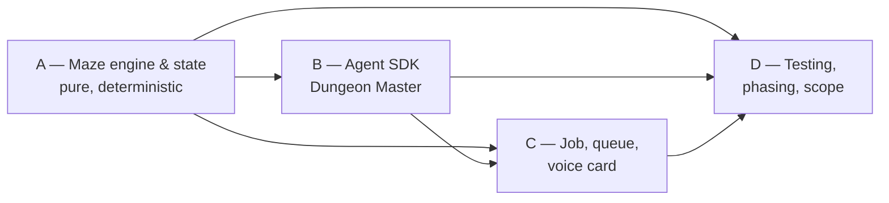

# Cascade Step 0 — Readiness Package

**Run**: `cascade-twisty-maze` · **Manager**: Cheech 🌿 (`72343afa`) · **Date**: 2026.08.06
**Input plan under review**: [`2026.08.06-twisty-tunnel-maze-game.md`](2026.08.06-twisty-tunnel-maze-game.md)
**Workflow**: `planning-is-prompting/workflow/plan-review-cascaded.md` (Steps 0.1–0.4)
**Status**: artifacts complete — awaiting the Step 0 light-review verdict from the Stage 2 seat

This file carries the three artifacts the readiness flip requires: the **Cast Manifest**, the
**pre-cascade Recon checklist**, and the **cross-section dependency map**. It is a workflow
artifact, not a design document — it says nothing about whether the maze game is a good idea.

---

## 1. Cast Manifest

| Seat | Persona | Role | Spawn origin | Notes |
|---|---|---|---|---|
| Manager | **Cheech 🌿** | Orchestrates, classifies severity, filters what reaches Rick | Rick, USER BROADCAST `97e483ff` | Does not review content, does not vote |
| Workflow Steward | **María 🌸** | Persona 6 — workflow-shape checks, real-time drift flags, retro partner | Rick, same broadcast | ⚠️ **Wrote the input plan.** Recused from all content review AND from the Step 0 light-review — it would be reviewing her own readiness |
| Author | **Rachel 🕊️** | Custodian of the plan file; makes every revision; defends or concedes findings | Manager-spawned | Sole holder of the pen on the plan file |
| Stage 1 — Usability / Reuse | **Tiffany 💍** | REUSE pre-pass; prior-art grep per proposed "new" thing | Manager-spawned | |
| Stage 2 — Viability / Gap | **Clayton 😎** | Pass 1 Fitness; design-completeness | Manager-spawned | **Also runs the Step 0 light-review**, recycled, because the Steward is the author |
| Stage 3 — Ownership | **Krishna 🦚** | Pass 2 Ownership-Language Audit; Conventions 3 / 5 / 6 | Manager-spawned | |

**Recycled light-reviewers**: Clayton 😎 (Step 0). The Step 9 light-review assignment is deferred to
cascade-complete; it will not go to María, for the same recusal reason.

---

## 2. Pre-cascade Recon Checklist

Standing rules **in force for this plan** that a cold reviewer would otherwise re-derive or skip.
Each row names where the rule lives, so a reviewer can check it rather than trust this table.

### Layer 1 — global, non-negotiable (`~/.claude/CLAUDE.md`)

| Rule | Why it bites this plan |
|---|---|
| **Test ownership** — the user is designer and user, **never the tester** | The plan is *a game a human plays*. Playing is the product; verifying is not. Stage 3 must draw that line explicitly rather than flag every human turn |
| **Explicit attribute access** — no defensive `getattr()` chains with fallbacks | `config.py` / `state.py` shapes proposed in §7 |
| **Path management** — resolve via `cu.get_project_root()`, never `Path(__file__).parent` chains or `sys.path.append` | `prompts/` loading, INI reads |
| **Design-by-Contract docstrings** (Requires / Ensures / Raises) | Every new module in §7 |
| **Code style** — spaces inside brackets, double quotes, snake_case, vertical alignment of `=` and dict colons | Whole file manifest |
| **Post-edit verification** — `py_compile` after every `.py` edit; import-chain check for startup-imported modules | §11 phases |
| **Mermaid for diagrams** | §4 already complies |

### Layer 2 — project (`lupin/CLAUDE.md`, `lupin/CLAUDE.local.md`)

| Rule | Why it bites this plan |
|---|---|
| **100% COVERAGE MANDATE** — lines **and** branches **and** functions, Lupin-wide since 2026-05-16; `pytest --cov-fail-under=100`. Exceptions need a same-line `# pragma: no cover` naming the reason | §10's tier table names tiers but asserts **no coverage shape**. Convention 6 is ACTIVE. ⚠️ Verify the mandate actually reaches the proposed code location before citing it — do not assume |
| **`src/cosa/tests/` is an ungated tree** — no gate-invocable runner collects it. Twice on 2026-08-05 it hid a real regression | §10 proposes test placement; the plan targets `src/cosa/agents/twisty_maze/`. Where the tests land decides whether any gate ever runs them |
| **COST MODEL — bounded CC vs firewalled SDK** — *"any proposal for a new LLM-driven feature MUST first answer 'can this be a bounded CC job?' and document the answer. If no, document which guardrail it hits"* | **The plan does not answer this.** It specifies `claude_agent_sdk.query` mirroring `deep_research/api_client.py` — which was itself migrated to bounded CC on 2026-06-18. A per-turn interactive game has a latency budget and a turn count; that is precisely the question the mandate asks |
| **Testing venues** — `:7999` is AI-discretionary only if there is no persistent-state mutation, ≤2 min runtime, and no monopoly requirement; everything else is `:8000`, scheduled via `POST /api/test-suite/submit` | §10's interactive smoke test enqueues real jobs |
| **Documentation touchpoints** — a new router obliges `src/docs/rest-api-reference.md`; a new agent obliges an automated smoke test per the `agentic-voice-workflow` skill | §7 adds `routers/twisty_maze.py`; §10 names the smoke test |
| **No backward-compat migration code; no compat shims for consumers that do not exist** | Greenfield agent — nothing to be compatible with |
| **CJ Flow shape** — `AgenticJobBase` rides the agentic `ThreadPoolExecutor` pool (`cj flow max concurrent agentic jobs`, dev `= 3`); `FifoQueue` mutations are `RLock`-protected; delete by `id_hash`, never `pop()` | §4's queue claims |
| **cosa-voice routing** — `set_job_id` / `clear_job_id` bracket the job; doc links and rich detail belong in `abstract`, never in the spoken message | §8 is the plan's key mechanic and already cites this |
| ⚠️ **CORRECTED 2026-08-06 12:58** — this row originally read *"`queue_name="run"` on every `notify()`"*, repeating the plan's own §8 line that calls it "non-negotiable per the skill". **Clayton 😎 read `deep_research/job.py` and `orchestrator.py` and found it overstated**: `queue_name="run"` is a registration-time argument on the lifecycle calls only — in-loop progress pings carry none and route correctly anyway. I copied the claim out of the artifact under review into the checklist meant to check it, which would have let a reviewer verify the plan against the plan | §8 — the claim needs correcting in the plan too, not just here |

### Layer 3 — milestone / dated decisions (challengeable; escalate to Rick)

| Decision | Bearing |
|---|---|
| **`:7999` no longer auto-reloads** (2026-08-01) — a saved `.py` is not a served `.py`; bounce via `src/scripts/bounce-dev-server.sh` | §11 Phase 3+ verification steps |
| **Voice-persona / chorus conventions** — each seat signs with its own icon; DMs are plain English, ≤3 lines | Cast conduct, not plan content |
| **Today is a live demo day** | Bears on urgency, not on plan correctness |

### Known-live traps a reviewer should not have to re-discover

- A **green measured somewhere other than where it has to hold** has burned this fleet repeatedly this
  week — a unit test standing in for a live path; a harness printing PASS while its own wait loop
  reported nothing for forty minutes.
- **`_execute_dry_run()` mocks every LLM call.** §9 proposes it as the walk-through mode. A dry-run
  green measures the harness, not the model — the plan must not let it stand in for a real
  play-through.

---

## 3. Cross-Section Dependency Map

Sections are the review slices, not the plan's own numbered headings.

| Section | Content | Depends on | Depended on by |
|---|---|---|---|
| **A** — Maze engine & game state | plan §5 + `engine.py`, `state.py` | — | B, C, D |
| **B** — Agent SDK Dungeon Master | plan §6 + `api_client.py`, `prompts/` | A | C, D |
| **C** — Job, queue & voice-card integration | plan §4, §8, §9 + `job.py`, `orchestrator.py`, `config.py`, `voice_io.py`, `cli.py`, all §7 registration & wiring | A, B | D |
| **D** — Testing, phasing & scope | plan §10–§13 | A, B, C | — |

**Named edges** — what actually crosses each boundary:

| Edge | The contract |
|---|---|
| A → B | The Dungeon Master's two custom tools (`get_room_state()`, `apply_move(direction)`) are **backed by the engine**. The engine is the source of truth; the model never holds authoritative state |
| A → C | The orchestrator's state machine (`INITIALIZING → PLAYING → WAITING_INPUT → WON/FAILED`) reads and advances engine state |
| B → C | The orchestrator invokes `api_client` each turn for narration and free-text command parsing |
| A, B, C → D | Every tier in §10 tests one of the three: unit → A, dry-run → C, interactive smoke + Q&A proxy → all three |

**Acyclic**: valid topological order **A → B → C → D**. No cycles. Pipeline order matches, so a
section is always reviewed after everything it depends on.

**Independence caveat, stated rather than hidden**: C is the heaviest slice and the only one whose
findings can plausibly reach back into A or B — a voice-routing constraint could force an engine or
tool-shape change. If that happens it is a cross-section finding, foundational by the workflow's own
test, and it escalates rather than being resolved inside C's chain.

---

## 4. What is NOT settled at Step 0

Recorded here so no reviewer treats these as closed:

1. **The bounded-CC question (Layer 2 above) is unanswered by the plan.** It is a project mandate,
   not a preference. Stage 2 owns it.
2. **§13's four open questions are Rick's**, not the cast's: maze size · input channel
   (`ask_multiple_choice` vs `converse`) · what "planning mode" means · repo confirmation. They go to
   him one at a time as they firm up — not parked in the final handoff doc.
3. **Section boundaries are the Manager's call** and are not up for review. Scope balance is a soft
   preference, not a gate.

---

## 5. Known deviation, recorded rather than hidden

**Stage 1 began before this gate cleared.** Tiffany 💍 posted a Section A `stage_close` at 12:46 and
Section B at 12:48, ahead of the Step 0 light-review — her brief told her to start on boot, which was
my sequencing error, not hers. The work is real and is retained; the gate still clears on its own
terms before Stage 2 accepts any section. If the light-review finds a readiness gap that invalidates
a Stage 1 pass, that section re-runs.
