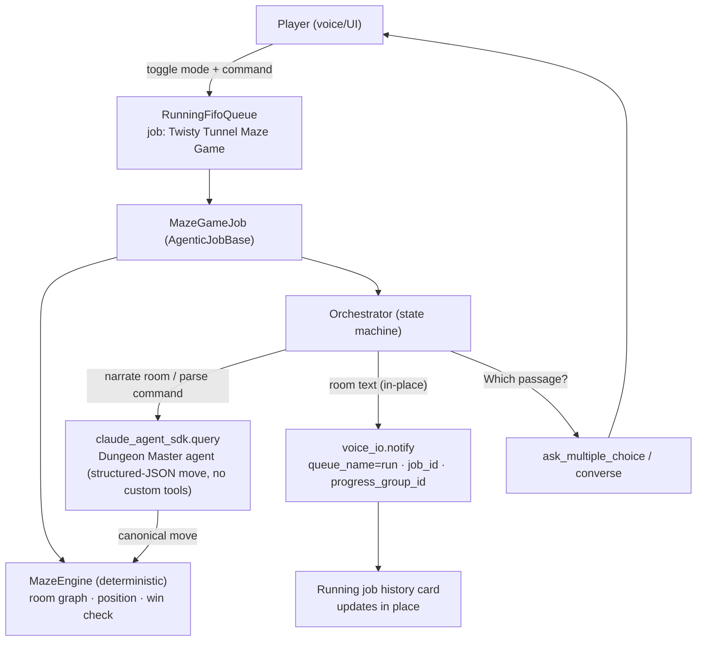

# Twisty Tunnel Maze Game — Implementation Plan

**Date**: 2026.08.06
**Author**: María 🌸 (planning session, plan.deepily.ai)
**Status**: DRAFT — for cascaded plan-review, then SWE-team implementation
**Prefix**: `[PLAN]` (planning-is-prompting) / target repo: **lupin**
**Data home**: `/mnt/lupin-data/projects-data/planning-is-prompting/`

---

## 1. Purpose (3-line summary)

Build the **simplest playable** version of the classic "you are in a maze of twisty little
passages, all alike" CLI adventure, implemented as a **Claude Agent SDK** background job that
runs inside lupin's `AgenticJobBase` / `RunningFifoQueue` pipeline. Each turn's room narration
and the player's choices render **in-place in the running job's history card** via the cosa-voice
notification API. The job is titled **"Twisty Tunnel Maze Game"** and is played interactively by
toggling to its agent mode.

This is a demo vehicle: it will be run through the **cascaded plan-review** process, then handed
to a **spun-up SWE team** for end-to-end implementation.

---

## 2. Requirements (as given)

| # | Requirement | Source |
|---|-------------|--------|
| R1 | Simplest **playable** version of the classic CLI maze game | Rick, voice |
| R2 | **Employs the Claude Agent SDK** (`claude_agent_sdk`, Python) | Rick, voice |
| R3 | **Leverage existing work** — reuse, don't reinvent | Rick, voice |
| R4 | Reuse the **`agentic-voice-workflow`** skill (Lupin repo) | Rick, corrected |
| R5 | Use the **notifications API** so game text renders **in the running job's history card** | Rick, voice |
| R6 | Runs as a job named **"Twisty Tunnel Maze Game"** | Rick, voice |
| R7 | **Toggle-able / walk-through-able** (agent-mode toggle + dry-run) | Rick, voice |

**Decisions locked this session** (via cosa-voice `ask_multiple_choice`):
- **Architecture**: Dungeon Master — deterministic Python maze engine; Agent SDK narrates + parses NL.
- **Language**: Python (`claude_agent_sdk`), matching the whole lupin/cosa-voice ecosystem.

---

## 3. Leveraged assets (R3, R4, R5)

The canonical build recipe already exists — this plan is an application of it, not a new pattern.

| Asset | Path | What we take from it |
|-------|------|----------------------|
| **`agentic-voice-workflow` skill** | `lupin/.claude/skills/agentic-voice-workflow/SKILL.md` (+ `references/full-workflow.md`) | The full 6-phase recipe: Discovery → Skeleton → Voice → Queue → Testing → Q&A script |
| **Slash command** | `/lupin-new-claude-agent-sdk-voice-workflow` | Scaffolds a compliant agent |
| **Gold-standard reference** | `lupin/src/cosa/agents/deep_research/` (esp. `job.py`, `api_client.py`, `voice_io.py`, `config.py`, `state.py`, `orchestrator.py`) | AgenticJobBase compliance, `claude_agent_sdk.query` wrapper, voice routing |
| **Second reference** | `lupin/src/cosa/agents/podcast_generator/` | Alternate job/orchestrator shape |
| **cosa-voice notify API** | cosa-voice MCP + `workflow/cosa-voice-integration.md` | In-place history-card rendering |
| **Test harness** | `LivePipelineTestBase`, `InteractiveSmokeTest`, Notification Proxy Q&A | Mandated automated pipeline test |

> **Note on the "voice-driven agents skill":** it lives in the **lupin** repo as
> `agentic-voice-workflow` (v1.3), **not** in planning-is-prompting. Confirmed and read this session.

---

## 4. Core design — how the pieces map to the requirements



**Requirement traceability**
- **R1 playable**: a human plays — each turn the job asks "which passage do you take?" via
  `ask_multiple_choice`; the deterministic engine guarantees a real, winnable maze.
- **R2 Agent SDK**: the Dungeon Master is a `claude_agent_sdk.query` agent that returns a
  **structured-JSON move** (no custom tools — see §6); it (a) narrates each room in "twisty passages"
  flavor and (b) parses free-text player commands ("head toward the draft") into canonical moves the
  engine validates.
- **R5 history card**: every room description and outcome is emitted with
  `voice_io.notify( ..., queue_name="run", job_id=self.id_hash )` — the skill's exact routing that
  writes into the job card's activity log. A stable `progress_group_id` keeps the current-room panel
  updating **in place** rather than appending endlessly.
- **R6 job title**: registered so its job card reads "Twisty Tunnel Maze Game".
- **R7 walk-through**: registered as a toggle-able **agent mode**; `_execute_dry_run()` plays a
  scripted deterministic walkthrough (no LLM calls) for demoing/reviewing the flow.

---

## 5. The maze (R1 — simplest playable)

- **Fixed small graph**: 7 rooms, hand-authored as a Python dict `{room_id: {direction: room_id}}`.
  Concrete v1 graph (the SWE team may tune it, but this is the buildable default):
  ```python
  MAZE = {
      "entrance": { "n": "hall" },
      "hall":     { "n": "twist_a", "s": "entrance" },
      "twist_a":  { "n": "twist_b", "e": "twist_c", "s": "hall" },    # twisty cluster —
      "twist_b":  { "n": "twist_a", "e": "twist_c", "w": "twist_a" }, # all alike, exits loop back
      "twist_c":  { "s": "twist_a", "w": "twist_b", "u": "exit" },    # the one non-obvious exit: up
      "exit":     {},                                                  # win room
  }
  ```
- **The classic trap**: the `twist_*` cluster is visually identical "twisty little passages, all alike";
  most exits loop back and the single winning exit (`twist_c` → `u` → `exit`) is non-obvious.
- **Direction vocabulary**: the canonical token set is `{ n, s, e, w, u, d }`
  (north / south / east / west / up / down). The engine accepts only these tokens; the DM agent maps
  free-text ("head up the draft") onto exactly one of them.
- **State** (`state.py`, a **Pydantic model** — all 8 reference agents use a Pydantic model in
  `state.py`, not a bare dataclass): `current_room: str`, `visited: set[str]`, `move_count: int`,
  `status: OrchestratorState`.
- **`MazeEngine.get_room_state()` — an engine method the orchestrator calls (not a model-invoked tool) —
  returns the COUNT of available passages, not which directions** (Rick ruling): the puzzle is then an
  engine property a unit test can assert, not a behavior that depends on the model staying deliberately
  vague. The orchestrator passes that count into the prompt; the DM narrates "three passages lead off
  into the dark" from it.
- **Illegal move** (a direction not in the current room's dict): the engine returns a
  `you can't go that way` result, leaves `current_room` unchanged, and does **not** increment
  `move_count` — only legal moves count.
- **Win condition**: reach the `exit` room → `status = WON`.
- **FAILED trigger**: `move_count` exceeds `max_moves` (config key, default e.g. 50) → `status = FAILED`.
  This bounds the game; there is no other failure path in v1.
- **No combat, no inventory system, no save/load, no lamp/treasure item** in v1 — deliberately minimal.

**Acceptance test (engine invariant)** — `EXECUTOR: AI`: a breadth-first search from `entrance` over
the graph proves `exit` is reachable (the maze is winnable). Pure, fast, unit-tested in isolation
(no LLM, no I/O). The engine is the deterministic source of truth for the room graph, moves, passage
count, and win/fail checks.

---

## 6. Agent SDK integration (R2)

Mirror `deep_research/api_client.py`'s `claude_agent_sdk.query` wrapper (with the `SDK_AVAILABLE`
import guard). **No custom `@tool` / MCP tool surface** (Rick ruling): the DM agent returns a
**structured JSON move** that the existing `extract_json_object` parser (`deep_research/api_client.py:146`)
decodes; the engine then validates and applies it.

- Each turn the agent receives the current room state (including the **passage count**, per §5) and the
  player's free-text command, and returns e.g. `{"direction": "u"}` (or `{"error": "unparseable"}`).
- The deterministic engine validates that move: legal → new room state; illegal → `you can't go that way`
  (per §5's illegal-move rule). The LLM never holds authoritative state (avoids the drift that killed the
  "pure LLM" option).

**Verification — `EXECUTOR: AI`**: a parser unit test asserts phrase → move. Because Rick's
structured-JSON ruling makes the DM's output a plain `{"direction": ...}` object, `extract_json_object`
is testable without a live model: feed canned agent replies (e.g. `'{"direction":"u"}'`,
`'head up the draft → {"direction":"u"}'`, a malformed reply) and assert the decoded direction — or the
`{"error":"unparseable"}` fallback. This is the mechanic a human would otherwise "verify" by playing;
the structured-JSON contract makes it an automated assertion instead.

**Why no custom tools — declined because this maze gives the tool loop nothing to do** (Rick ruling).
Two facts, stated straight:

- **In-process custom tools are unproven here — by a wider margin than "no prior art to mirror."** The
  in-process mechanism this plan actually considered — `@tool` / `create_sdk_mcp_server` — has **zero
  hits tree-wide**; nothing in this repo wires one. The only tool wiring that exists is a **different,
  external mechanism**: `orchestration/claude_code/dispatcher.py:412-418` configures an external stdio
  MCP server (`"type": "stdio"`, spawning a python subprocess) plus built-in tool names (Read/Write/Bash)
  and the MCP-exposed cosa-voice tools. That is not the in-process `@tool` surface — so citing it as
  proof of in-process support was wrong. `deep_research` runs its lead agent with `LEAD_TOOLS = []`
  (`api_client.py:90`). None of this says the SDK *can't* do in-process tools — only that it is unproven
  here.
- **The real reason to decline: this game starves the tool loop.** The engine's room-state accessor
  returns a passage count that is **already in the prompt** (per §5), so a `get_room_state`-style tool
  has nothing to fetch. The multiple-choice card makes illegal moves nearly impossible, so the retry
  loop rarely fires. Narration already happens each turn. The loop's value **in this maze** is close to
  zero — a statement about *this game*, not about tool loops in general. The "model would hold state"
  objection is **false either way**: a tool loop that reads the engine's verdict and narrates it is not
  the model holding authoritative state — the engine still validates and applies every move.

**Revisit condition**: if a later version has the DM **fetch** room descriptions rather than receive
them pre-baked in the prompt, the tool loop gains something to do and its value rises — reconsider an
in-process tool surface then.

**Cost path — bounded CC (project-mandate answer)**: yes, this is a bounded `ClaudeCodeJob` on the Max
plan — one SDK call per human turn, an Anthropic-only model, no token-streaming UX need, and user-clicked
(so off-peak-scheduling exempt). It hits none of the "when NOT to migrate" guardrails, so it rides the
fixed Max-plan cost at **zero per-token spend** (not "free" — covered by already-paid fixed cost).

---

## 7. File manifest (following the reference agent anatomy)

Target: `lupin/src/cosa/agents/twisty_maze/`

| File | Role |
|------|------|
| `__init__.py` | package |
| `config.py` | `MazeConfig.from_config( config_mgr, debug )` classmethod |
| `job.py` | `MazeGameJob(AgenticJobBase)` — `_execute()`, `_execute_dry_run()`, lifecycle |
| `orchestrator.py` | state machine (INITIALIZING→PLAYING→WAITING_INPUT→WON/FAILED) |
| `state.py` | `OrchestratorState` enum + game-state **Pydantic model** (all 8 reference agents use one, not a bare dataclass) |
| `engine.py` | deterministic `MazeEngine` (graph, moves, passage count, win/fail check) — **pure, unit-tested** |
| `api_client.py` | `claude_agent_sdk.query` DM wrapper — structured-JSON move parsed via `extract_json_object`, **no custom tools** (see §6) |
| `voice_io.py` | thin cosa-voice wrapper (or reuse shared `voice_io`) |
| `prompts/` | DM system prompt + room-narration template |
| `cli.py` | standalone play loop for local dev (no server) |

**Registration / wiring** (per the compliance checklist):
- **Agentic registry** — add an `AGENTIC_AGENTS` entry (`runtime_argument_expeditor/agent_registry.py:22`)
  keyed `"agent router go to twisty maze"`, with `required_params` + `fallback_questions`.
- **Mode registration** — add a `MODE_METADATA` entry (`todo_fifo_queue.py:69`) for the `twisty_maze` mode.
- `agentic_job_factory.py` — factory branch, triggered by the command string `"agent router go to twisty maze"`.
- `src/cosa/rest/routers/twisty_maze.py` — dedicated REST router.
- `lupin-app.ini` + `lupin-app-splainer.ini` — INI keys under a `twisty_maze` prefix.
- **Voice-routing training data** — add natural-language intent examples so `"agent router go to twisty maze"`
  is reachable by voice. Agentic jobs are entered through that NL intent, so this applies here.
- Job ID prefix: `tm` → `tm-a1b2c3d4`.

---

## 8. cosa-voice history-card rendering (R5) — the key mechanic

Use the base class — **don't hand-roll progress plumbing**. `AgenticJobBase` already provides
`create_progress_group()` (`agentic_job_base.py:319`) and `notify_progress()` (`:328`); the job calls
those instead of threading its own `maze_pg` / `set_job_id` bookkeeping.

```python
maze_pg = self.create_progress_group()                     # base class: one stable "current room" panel
# ... each turn ...
self.notify_progress( room_text, priority="low", progress_group_id=maze_pg )   # in-place update
# ... player turn via ask_multiple_choice ...
```

- **`progress_group_id`** (`pg-XXXXXXXX`) = the "current room" panel updates in place each turn;
  turn-outcome breadcrumbs (moved / bumped a wall / won) can append normally.
- **`queue_name="run"` is a registration-time argument on the lifecycle calls only — NOT on every
  `notify()`.** `deep_research/job.py` + `orchestrator.py` show in-loop progress pings carry no
  `queue_name` and route fine; the earlier "non-negotiable on every notify" line was overstated.
- **Doc-viewer / rich detail** → `abstract` card, never the spoken message (URLs/markdown are TTS-hostile).

**Verification — `EXECUTOR: AI`** (NOT a human eyeballing the card): the §10 live-pipeline test on
`:8000` asserts the render programmatically — it captures the emitted notification events for the job
and checks that room updates reuse the **same `progress_group_id`** (in-place, one panel) while
turn-outcome breadcrumbs append as new events. "The key mechanic" is proven by observing the event
stream, not by watching the UI.

---

## 9. Player interaction (R1, R7)

- **Input channel — decided (D2, §13): BOTH.** Each turn the job asks **"Which passage do you take?"**
  via `ask_multiple_choice` (exits as options) — the reliable default — and also accepts `converse`
  free-text ("go toward the light"), which the DM agent parses as flavor.
- **Planning / walk-through mode (R7)**: `_execute_dry_run()` runs a **scripted, deterministic**
  playthrough with **zero LLM calls** — canned narration, pre-chosen moves. This serves two distinct
  purposes, which are not the same thing: (a) a **human demo** — a person toggles into the mode and
  watches the flow, human judgment, no pass/fail; and (b) an **automated check** — the §10 dry-run
  unit test (`EXECUTOR: AI`) asserts the scripted run completes a full win with the expected
  breadcrumbs and no LLM call. Real mode uses the Agent SDK.
- Registered as a **toggle-able agent mode** (`/api/mode/current` → `twisty_maze`), so you switch
  into it and play, then switch out.

---

## 10. Testing (mandatory per skill)

Every file lands in a **gate-invocable location** — the tests must sit where the merge-gate runner
collects them, NOT in `src/cosa/tests/` (no gated runner reaches that tree; it hid two real regressions
on 2026-08-05). Location + runner named per tier:

| Tier | Venue | Location + gate runner | What | Executor |
|------|-------|------------------------|------|----------|
| Unit | `:7999` | `src/tests/unit/test_twisty_maze_engine.py` · `pytest src/tests/unit/` | `MazeEngine` — moves, illegal moves, passage count, win detection, FAILED trigger, twisty-loop trap, and the BFS-winnable invariant (§5). Pure, fast. | `EXECUTOR: AI` |
| Dry-run | `:7999` | `src/tests/unit/test_twisty_maze_dry_run.py` · `pytest src/tests/unit/` | assert `_execute_dry_run()` completes a full scripted win with breadcrumbs, no LLM. | `EXECUTOR: AI` |
| Live pipeline | `:8000` **scheduled** | `src/tests/smoke/test_twisty_maze_live_pipeline.py` · submit via `POST /api/test-suite/submit` | via `InteractiveSmokeTest` — **enqueues real jobs**, so it routes to the monopolize-mode test server, not `:7999`. | `EXECUTOR: AI` |
| Q&A proxy | `:8000` | `src/conf/notification-proxy-scripts/twisty-maze.json` (dashes, like every other proxy script) | drives the live-pipeline run so "which passage?" auto-answers in CI. | `EXECUTOR: AI` |

**Dry-run trap (name it explicitly)**: `_execute_dry_run()` **mocks every LLM call** — it exercises the
engine + card-rendering flow only. It must **never** stand in for a real Agent-SDK play-through; the live
pipeline test on `:8000` is the one that proves the DM agent actually parses free text and plays.

**Coverage gate (Lupin mandate)**: 100% — **lines AND branches AND functions**. The merge gate runs
`pytest --cov=cosa.agents.twisty_maze --cov-branch --cov-report=term-missing --cov-fail-under=100 src/tests/unit/`
— scoped to the package so the gate provably reaches the code. No merge without it; `# pragma: no cover`
only on genuinely-unreachable defensive branches, each with a same-line reason.

Report results in a pass/fail table per tier. CURL is prohibited — use `TestClient` / the harness.

---

## 11. Phased build (for the SWE team)

- **Phase 0 — Discovery**: confirm agent name (`twisty_maze`), prefix (`tm`), win room; **author** the
  maze graph — there is nothing to "confirm", §5 gives the buildable default to start from.
- **Phase 0.5 — Docs-first**: this plan is the artifact; SWE team may add an impl-tracking doc.
- **Phase 1 — Engine**: `engine.py` + `state.py` + unit tests (green before anything else).
- **Phase 2 — Skeleton**: `job.py`/`orchestrator.py`/`config.py` conforming to AgenticJobBase.
- **Phase 3 — Voice**: history-card rendering via `voice_io.notify(queue_name="run", ...)`.
- **Phase 4 — Agent SDK**: `api_client.py` DM agent — structured-JSON move + `extract_json_object`, NL
  command parsing (no custom tools, per §6).
- **Phase 5 — Wiring**: registry, factory, router, INI + splainer.
- **Phase 6 — Tests**: dry-run, unit, interactive smoke + Q&A proxy; green + reviewed gate.

---

## 12. Out of scope (v1)

Inventory/items, combat, save/load, procedurally-generated mazes, multiplayer, scoring/leaderboard,
persistent player profiles, Playwright UI E2E (deferred to the platform's planned v0.1.6 track).

---

## 13. Decisions record (settled scope)

All four review questions are closed. This is settled scope, not open questions.

| # | Decision | Ruled by | Date |
|---|----------|----------|------|
| D1 | **Maze size**: 6–8 rooms with one twisty-loop cluster. The §5 7-room graph already fits — no change. | Rick | 2026.08.06 |
| D2 | **Player input channel**: BOTH. `ask_multiple_choice` (pick an exit) is the reliable default and always works; free text via `converse` is accepted and parsed by the DM as flavor. | Rick | 2026.08.06 |
| D3 | **"Planning mode"**: BOTH readings — a toggle-able **agent mode** AND a scripted **dry-run** walkthrough. The §10 dry-run trap warning (mocks every LLM call, never stands in for a real play-through) is why this one needed Rick's word. | Rick | 2026.08.06 |
| D4 | **Repo / path**: `lupin`, `src/cosa/agents/twisty_maze/` — follows from where every referenced asset lives. | Cheech (manager) | 2026.08.06 |
