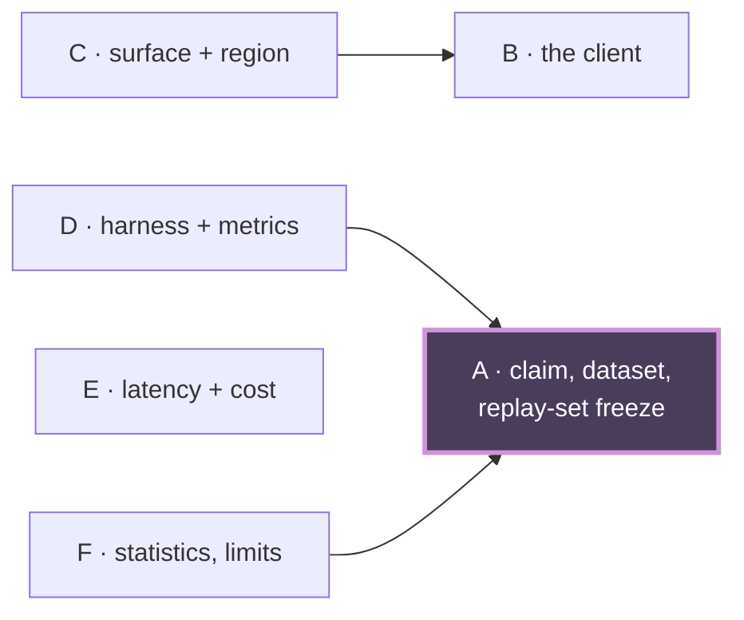

# Cascade revision handoff — Phi-4 vs Flash-Lite hallucination comparison

**Cascade**: `cascade-phi4-vs-flash-lite`
**Manager**: Rachel 🕊️ (session `743eca0d`)
**Plan under review**: `src/rnd/v0.2.0/2026.08.16-phi4-vs-flash-lite-hallucination-comparison.md` (María 🌸)
**Date**: 2026-08-16

> **Filename note**: this is deliberately `…-handoff-phi4-flash-lite.md`. A file named
> `2026.08.16-cascade-revision-handoff.md` already exists and belongs to Cheech's cascade;
> writing to that name would have silently overwritten his handoff.

---

## 0. Verdict

**The plan is crew-ready once one line lands.** Every blocking finding is closed against a
verified commit, and the four Stage-3 findings plus three Stage-2 residuals are resolved.

| | |
|---|---|
| Stage 0 — Author (Chloe 🗼) | Held the model id and API-key ban as OPEN while the document asserted them settled |
| Stage 1 — Usability/Reuse (Sam 🎙️) | PASS, then **upgraded his own verdict** when the dispatch target proved empty |
| Stage 2 — Viability/Gap (Tiffany 💍) | Raised the blocking headline finding and the `D→A` dependency |
| Stage 3 — Ownership (Rio ⚡) | PASS-WITH-FINDINGS — four items, none reopening boundaries |

**Outstanding**: §0 footer line 76, stale three ways. María owns it. Tiffany re-greps §0 on landing.

---

## 1. The decomposition, as ratified

Six sections. Boundaries chosen on the independence criterion — each reviewable without loading another.

| | Section | Covers |
|---|---|---|
| **A** | The claim, the dataset, and the replay-set freeze | §1, §1.1, §1.2 |
| **B** | The client — which SDK, and why | §0, §2.1, §2.1-REVISED |
| **C** | The surface and the region | §2.1a |
| **D** | The harness and per-arm metrics | §2.2, §2.3 |
| **E** | Latency and all-in cost | §2.4 |
| **F** | Statistics, limits, sequencing | §3, §4, §5 |

Not sections: §6, §6.1, §7 — context every reviewer reads, not surfaces to review.

**Dependencies**: `C→B`, `D→A`, `F→A`. `E` independent.

**A is depended on by three of five other sections, entirely through §1.2** — the replay-set
freeze. It is the design's load-bearing precondition, not a dataset footnote.

---

## 2. What the review actually caught

### 2.1 The blocking finding — the headline was undeliverable

The plan's central claim was *"Adding Flash-Lite is a config change, not a code change"* — the
sentence that satisfied Rick's reuse constraint. Three independent reads agreed it was false:

- `llm_client_factory.py` has **no `google-genai` vendor entry**
- `google-gla` carries **two** env vars — `GOOGLE_API_KEY` (255) and `GEMINI_API_KEY` (299),
  making bug `7f361ccf` visible in the dispatch table itself
- The factory constructs only `CompletionClient` / `ChatClient` — **nothing builds a `genai.Client`**

⇒ A spec key naming the SDK **dispatches to nothing**. Repointing
`llm spec key for dm tutor rewrite` is necessary and not sufficient.

**Closed at `faf107ee`**, with a better fix than was asked for: it separates *no new **connector***
(true — the SDK is already wrapped in `presentation_generator/gemini_client.py`) from *wiring code
is required*. Rick's actual constraint — don't write a new Google connector — survives intact while
the estimate becomes honest.

### 2.2 Six instances of one pattern

A claim died in one section and lived on in another, six separate times, in a document whose own
§0 banner states the rule: *"when a claim dies, grep the document for it — do not fix the section
you happened to be editing."*

| # | Where | Closed at |
|---|---|---|
| 1 | §2.1a asserting `GOOGLE_API_KEY` and "stay on the Developer API" | `18db637a` |
| 2 | §0 headline naming `google-gla` as the live path | `c00ee938` |
| 3 | §2.1 with no banner, handing the reader dead config | `4aae27a0` |
| 4 | §1.1 stating corpus counts as fixed fact | `a63c12a1` |
| 5 | §0's "Rick's half" naming a Developer-API credential | pending |
| 6 | §0 footer line 76, stale three ways | pending |

**Every one was caught by a reviewer holding the dead text and its replacement together.** This is
the argument that settled the B-split question: Sam proposed splitting B into dead history and live
decision; Tiffany argued that only one reader holding both can judge whether a supersession is
complete. The evidence backs her.

### 2.3 The Stage-3 findings

| | Finding | State |
|---|---|---|
| F1 | §2.2 step 1 said "read the corpus" where §1.2 demands the pinned snapshot — the harness would read the live append-only log and **unpair the arms** | resolved |
| F2 | §5's smoke had no named assertion it reached Flash-Lite via Vertex rather than falling through to vLLM | resolved |
| F3 | New dispatch code carried "review it like code" but no coverage AC — Convention 6 | resolved |
| F4 | Model id and Vertex-only marked settled on what looked like an unconfirmed relay | resolved |

**F1 landed exactly where the dependency map predicted.** Tiffany added `D→A` at Step 3 because
§2.2 reads "the corpus" while §1.2 demands the snapshot — the edge was drawn before anyone examined
the harness, and the defect turned up there. That is the argument for spending real effort on the
dependency map rather than treating it as bookkeeping.

---

## 3. Settled facts the implementing crew inherits

- **Model id**: `gemini-3.1-flash-lite` — **settled**, first-hand.
- **Credential**: **no API key of any kind.** Not `GOOGLE_API_KEY`, and not the key file at
  `src/conf/keys/gemini` however present it is. The credential is the project id in
  `LUPIN_GCP_PROJECT_ID` plus ADC.

Both are quoted verbatim in §0 lines 17-29 from Rick's own words in session `11aa861f`, stated once
and restated unprompted. This was challenged during review as a possible bare relay and the
challenge was answered with the quotes — which is the standard: *a relay of user intent must quote
verbatim, or it is not authorization.*

⚠️ **The sandbox hazard, which must not be lost.** `LUPIN_GCP_PROJECT_ID` currently reads
`hello-world-foo-423219` in `src/scripts/cloud-run.env`. `cloud-run.env.example` states
*"REQUIRED — no sandbox default (unset => scripts abort)"*. Wiring that value into Vertex would
**not fail — it would succeed against a throwaway project** and produce numbers that look real. A
config that fails loudly is safe; one that quietly points at the wrong project is not.

---

## 4. What the crew must build

The arm needs **code**, and the plan now says so. Two routes, and the plan must not leave this open:

1. A new vendor entry in `llm_client_factory` **plus** a `genai.Client` construction branch, or
2. A tutor call-site bypass reusing `presentation_generator/gemini_client.py`

Either way **Convention 6 is active**: lupin's 100% coverage mandate on lines AND branches AND
functions. "Tests pass" without a named coverage-assertion shape is a finding, not a green.

**Before either arm runs**: freeze the replay set. `dm_traffic.jsonl` is a live append-only log
growing ~5 fired rows/minute — it moved from 5,562 to 5,779 rows during this review alone. Snapshot
it, checksum it, record provenance, and have the harness **refuse** the live path. Sam names
`eval_isolation_guard`'s `require_isolated_snapshot_table` as the fail-closed pattern to copy rather
than reinvent.

---

## 5. Process notes worth carrying to the next cascade

- **The dependency map earned its keep.** It predicted where the worst finding would be.
- **Keeping B whole was right**, and the reason generalises: a section that includes its own
  superseded predecessor gives one reader the ability to judge whether the supersession is complete.
  Splitting it hands the banner and the dead text it supersedes to different seats.
- **The cast corrected the manager twice.** Both Step-3 corrections (`D→A` added, `E→A` dropped)
  were against my map, not the document. A cast that only ratifies is not a cast.
- **Reviewers upgraded their own verdicts unprompted** — Sam on the headline, Tiffany on the B-split
  after verifying a commit had landed. Both had read stale bytes and said so.
- **`cast_ratified` worked as intended.** No user gate fired, no contest remained open, and the
  pipeline did not park waiting for a human on a question the cast could settle.
