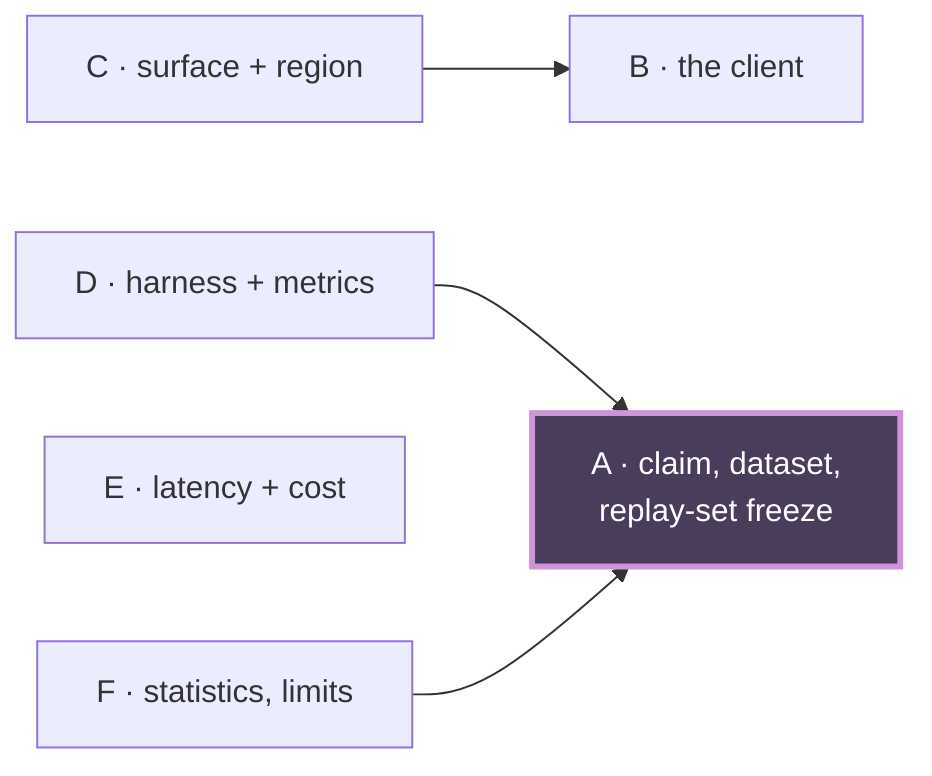

# Cascade revision handoff — Phi-4 vs Flash-Lite hallucination comparison

**Cascade**: `cascade-phi4-vs-flash-lite`
**Manager**: Rachel 🕊️ (session `743eca0d`)
**Plan under review**: `src/rnd/v0.2.0/2026.08.16-phi4-vs-flash-lite-hallucination-comparison.md` (María 🌸)
**Date**: 2026-08-16

> **Filename note**: this is deliberately `…-handoff-phi4-flash-lite.md`. A file named
> `2026.08.16-cascade-revision-handoff.md` already exists and belongs to Cheech's cascade;
> writing to that name would have silently overwritten his handoff.

---

## 0. Verdict

**The plan is crew-ready once one line lands.** Every blocking finding is closed against a
verified commit, and the four Stage-3 findings plus three Stage-2 residuals are resolved.

| | |
|---|---|
| Stage 0 — Author (Chloe 🗼) | Held the model id and API-key ban as OPEN while the document asserted them settled |
| Stage 1 — Usability/Reuse (Sam 🎙️) | PASS, then **upgraded his own verdict** when the dispatch target proved empty |
| Stage 2 — Viability/Gap (Tiffany 💍) | Raised the blocking headline finding and the `D→A` dependency |
| Stage 3 — Ownership (Rio ⚡) | PASS-WITH-FINDINGS — four items, none reopening boundaries |

**Outstanding**: §0 footer line 76, stale three ways. María owns it. Tiffany re-greps §0 on landing.

---

## 1. The decomposition, as ratified

Six sections. Boundaries chosen on the independence criterion — each reviewable without loading another.

| | Section | Covers |
|---|---|---|
| **A** | The claim, the dataset, and the replay-set freeze | §1, §1.1, §1.2 |
| **B** | The client — which SDK, and why | §0, §2.1, §2.1-REVISED |
| **C** | The surface and the region | §2.1a |
| **D** | The harness and per-arm metrics | §2.2, §2.3 |
| **E** | Latency and all-in cost | §2.4 |
| **F** | Statistics, limits, sequencing | §3, §4, §5 |

Not sections: §6, §6.1, §7 — context every reviewer reads, not surfaces to review.

**Dependencies**: `C→B`, `D→A`, `F→A`. `E` independent.

**A is depended on by three of five other sections, entirely through §1.2** — the replay-set
freeze. It is the design's load-bearing precondition, not a dataset footnote.

---

## 2. What the review actually caught

### 2.1 The blocking finding — the headline was undeliverable

The plan's central claim was *"Adding Flash-Lite is a config change, not a code change"* — the
sentence that satisfied Rick's reuse constraint. Three independent reads agreed it was false:

- `llm_client_factory.py` has **no `google-genai` vendor entry**
- `google-gla` carries **two** env vars — `GOOGLE_API_KEY` (255) and `GEMINI_API_KEY` (299),
  making bug `7f361ccf` visible in the dispatch table itself
- The factory constructs only `CompletionClient` / `ChatClient` — **nothing builds a `genai.Client`**

⇒ A spec key naming the SDK **dispatches to nothing**. Repointing
`llm spec key for dm tutor rewrite` is necessary and not sufficient.

**Closed at `faf107ee`**, with a better fix than was asked for: it separates *no new **connector***
(true — the SDK is already wrapped in `presentation_generator/gemini_client.py`) from *wiring code
is required*. Rick's actual constraint — don't write a new Google connector — survives intact while
the estimate becomes honest.

### 2.2 Six instances of one pattern

A claim died in one section and lived on in another, six separate times, in a document whose own
§0 banner states the rule: *"when a claim dies, grep the document for it — do not fix the section
you happened to be editing."*

| # | Where | Closed at |
|---|---|---|
| 1 | §2.1a asserting `GOOGLE_API_KEY` and "stay on the Developer API" | `18db637a` |
| 2 | §0 headline naming `google-gla` as the live path | `c00ee938` |
| 3 | §2.1 with no banner, handing the reader dead config | `4aae27a0` |
| 4 | §1.1 stating corpus counts as fixed fact | `a63c12a1` |
| 5 | §0's "Rick's half" naming a Developer-API credential | pending |
| 6 | §0 footer line 76, stale three ways | pending |

**Every one was caught by a reviewer holding the dead text and its replacement together.** This is
the argument that settled the B-split question: Sam proposed splitting B into dead history and live
decision; Tiffany argued that only one reader holding both can judge whether a supersession is
complete. The evidence backs her.

### 2.3 The Stage-3 findings

| | Finding | State |
|---|---|---|
| F1 | §2.2 step 1 said "read the corpus" where §1.2 demands the pinned snapshot — the harness would read the live append-only log and **unpair the arms** | resolved |
| F2 | §5's smoke had no named assertion it reached Flash-Lite via Vertex rather than falling through to vLLM | resolved |
| F3 | New dispatch code carried "review it like code" but no coverage AC — Convention 6 | resolved |
| F4 | Model id and Vertex-only marked settled on what looked like an unconfirmed relay | resolved |

**F1 landed exactly where the dependency map predicted.** Tiffany added `D→A` at Step 3 because
§2.2 reads "the corpus" while §1.2 demands the snapshot — the edge was drawn before anyone examined
the harness, and the defect turned up there. That is the argument for spending real effort on the
dependency map rather than treating it as bookkeeping.

---

## 3. Settled facts the implementing crew inherits

- **Model id**: `gemini-3.1-flash-lite` — **settled**, first-hand.
- **Credential**: **no API key of any kind.** Not `GOOGLE_API_KEY`, and not the key file at
  `src/conf/keys/gemini` however present it is. The credential is the project id in
  `LUPIN_GCP_PROJECT_ID` plus ADC.

Both are quoted verbatim in §0 lines 17-29 from Rick's own words in session `11aa861f`, stated once
and restated unprompted. This was challenged during review as a possible bare relay and the
challenge was answered with the quotes — which is the standard: *a relay of user intent must quote
verbatim, or it is not authorization.*

⚠️ **The sandbox hazard, which must not be lost.** `LUPIN_GCP_PROJECT_ID` currently reads
`hello-world-foo-423219` in `src/scripts/cloud-run.env`. `cloud-run.env.example` states
*"REQUIRED — no sandbox default (unset => scripts abort)"*. Wiring that value into Vertex would
**not fail — it would succeed against a throwaway project** and produce numbers that look real. A
config that fails loudly is safe; one that quietly points at the wrong project is not.

---

## 4. What the crew must build

The arm needs **code**, and the plan now says so. Two routes, and the plan must not leave this open:

1. A new vendor entry in `llm_client_factory` **plus** a `genai.Client` construction branch, or
2. A tutor call-site bypass reusing `presentation_generator/gemini_client.py`

Either way **Convention 6 is active**: lupin's 100% coverage mandate on lines AND branches AND
functions. "Tests pass" without a named coverage-assertion shape is a finding, not a green.

**Before either arm runs**: freeze the replay set. `dm_traffic.jsonl` is a live append-only log
growing ~5 fired rows/minute — it moved from 5,562 to 5,779 rows during this review alone. Snapshot
it, checksum it, record provenance, and have the harness **refuse** the live path. Sam names
`eval_isolation_guard`'s `require_isolated_snapshot_table` as the fail-closed pattern to copy rather
than reinvent.

---

## 4a. SECOND CASCADE RUN — 2026-08-17 ~03:00–03:30Z, fresh cast

> ⚠️ **Read this before treating §0's verdict as current.** Everything above describes the FIRST
> run, which closed at ~16:11 EDT against the commits it cites. A **second full cascade ran the
> same night** with a different cast, against a document that had grown from **307 → 604 lines**
> in the interval. §0's "crew-ready once one line lands" is **superseded** — seven new blocking
> findings are open.

**How this happened, stated plainly because it is the third instance of one pattern.** My memento
recorded *"cascade pipeline NOT started"*. That was false — this very file, written by an earlier
session of me at 16:11, describes a completed pipeline, and its six commits verify at HEAD. I
re-cast and re-ran the whole cascade without opening the handoff doc my own earlier session wrote.

The re-run was **justified by the facts and not by my reasoning**: the document nearly doubled after
run 1, and most of run 2's findings are against text that did not exist at 16:11 (§0.0, §0.1,
§2.1b, the rewritten §2.1a). But I did not know that when I started — I believed the pipeline had
never run. Right outcome, wrong reasoning.

⇒ **The counter-move, now failed three times in one day: query your own board by CONTENT before
forming a theory, and open the artifact an earlier session of you already wrote.** A memento is a
claim; the file on disk is the evidence.

### The cast (run 2)

| Stage | Seat | Verdict |
|---|---|---|
| 0 — Author | María 🌸 | wrote the plan; revised against all seven findings |
| 1 — Usability/Reuse | Tiffany 💍 | 2 blockers + a 7-item constructive spec for §B |
| 2 — Viability/Gap | maya 🌻 | 2 blockers; C and E **clean**, verified on disk |
| 3 — Ownership | chloe 🗼 | 2 blockers incl. the statistics gap; ship gate |
| §0.0/§0.1 orphan | sam 🎙️ | 1 blocker; §0.1 confirmed by a **live Vertex call** |

All three reviewer seats were spawned **cold**. Two warm seats were offered and declined — one had
already verified the manager's own section map, which is precisely the contamination the cold rule
exists to prevent.

### The seven findings

| # | Finding | Found by |
|---|---|---|
| 1 | §1.1's corpus path is the **container** mount; absent on the host where the harness runs. Real path resolves via `dm.py _resolve_dm_corpus_dir()` to `projects-data/lupin/dm-corpus` (6,938 rows) | maya, chloe, Tiffany — **independently, three ways** |
| 2 | The "already wrapped `gemini_client.py`" reuse row overstates toward the **ruled-out API-key surface**; the Vertex client is net-new | Tiffany, chloe |
| 3 | **§1.2's freeze guard is vacuous as specified** — no assertion mechanism, no EXECUTOR tag, and it points at a path that can never match on the host. Written as specified, it passes by default | maya |
| 4 | Three permanent production changes ship with **no owner and no teardown** | chloe |
| 5 | §2.1a hand-rolls a resolver when `cosa.utils.gcp_project` exists and is tested; the path calls the banned `cu.get_api_key` at `gemini_client.py:100` | Tiffany |
| 6 | **The paired comparison has no inferential statistics at all** — no significance test, no CI, no MDE. The study could report noise as a result | chloe |
| 7 | `check_dead_claims.py` enforces 13 phrases while §0.0's table lists families it never greps — **structurally**, since the table sits inside the `--skip-until` exempt region | sam |

### Decisions ratified during run 2

- **Descriptor**: `vertex://<location>@<model_id>`. Project from `cosa.utils.gcp_project`, **never**
  the descriptor; location **from** the descriptor. María proposed and explicitly refused to call it
  decided; Rachel ratified; **Tiffany confirmed against the code**, not against the ratification.
  - ⚠️ The `elif` must sit **before** the `else` at `llm_client_factory.py:212`. That else returns
    `ChatClient( model_name=model_spec )`, so an unbranched `vertex://` spec is not rejected — it is
    handed to pydantic_ai **as a model name** and dies later looking like a bad model id.
  - ⚠️ **One location source only.** The descriptor *is* an INI value, so also calling
    `resolve_gcp_location()` rebuilds the two-source drift the doc already frets about for project id.
    Project is an *account fact*; location is a *per-arm experimental variable*.
- **Ship gate (chloe, adopted as a gate, not a recommendation)**: **no directional fabrication
  headline** until McNemar's exact test and a Wilson interval land with a **pre-stated** discordant
  floor. Pre-stated is load-bearing — a floor chosen after seeing the numbers is a rationalisation.
- **The floor number is Rick's.** María computed the *arithmetic* bound (`b+c=5` → most-extreme
  two-sided p 0.0625; `b+c=6` → 0.0312, so below six no split reaches significance) and **refused to
  invent the operational floor**, assigning it to Rick in §5 before the first arm runs.

### Tooling built during run 2

`check_dead_claims.py --check-table-sync` (`307be8ca` → commit `307de8ca`) couples the §0.0 table to
`DEFAULT_CLAIMS` and exits 3 on drift; live claims still outrank drift (1 > 3 > 0). Verified by the
manager independently, not on report: an injected bogus table row was reported `UNENFORCED`, 20 unit
tests pass, and the no-flag path still exits 0 on the pre-revision document.

**It caught a live regression within minutes of existing**: María's own revision had reintroduced
`us-central1` — the value measured returning 404 — inside a **copy-pasteable INI example**, four
lines below the prose explaining that it 404s. The copy-paste relapse §0.0 exists to prevent,
committed by the author of §0.0. Fixed to `global`.

A second hit was ruled a **false positive** (a line citing the 404 as *evidence*, not instructing
its use). María then found the defect in that ruling: the checker has **no exemption facility**, so
the document could never go green while its own message says *"a revision is not done until this is
clean"* — teaching the next reader either to revert the ruling or to ignore a red checker. An
explicit per-line exemption carrying a written, listable reason is being built rather than rewording
prose to slip past a grep.

---

## 4b. 🔴 THE FINDING THAT OUTRANKS THE OTHER NINE — the corpus has ZERO human traffic

Found late in run 2, after every other blocker was closed. **It is not a defect in the plan, in the
code, or in anyone's work. It is a fact about what data exists** — and it decides what the study can
honestly claim.

**Four independent derivations, four different routes, all agreeing:**

| who | figure | what it measures |
|---|---|---|
| Tiffany 💍 | ~34% (682 / 2,006) | rows from the five **study-cascade** personas |
| sam 🎙️ | 35.5%; 34.5% in-window | same, own classifier, did not read her method first |
| Cheech's seat 🌿 | **100%**; ~12% self-referential | **fleet-vs-human** |
| Clayton 😎 | **100% fleet, 0 human**, 18 personas | full corpus, measured the real `from` field |
| Rachel 🕊️ | 4,087 fired rows, 18 recipients, all fleet | `from_project`: lupin 3,593 / plan 494 |

They are not in conflict — they answer different questions. **~35% is the self-reference risk
(reviewers of this study feeding the corpus of this study); 100% is the validity ceiling.**

**What it means.** §1 states the tutor's job is human-facing DMs. The corpus contains none. Internal
validity is untouched — the pairing holds, both arms replay identical rows, and every fix above still
applies. But the study can only honestly report *"which model better rewrites agent-to-agent fleet
chatter."* It cannot say anything about human traffic, because it has never seen any.

⇒ **Clayton's sentence is the one that decides it**: *"excluding fleet traffic, taken literally,
empties the corpus."* That converts a filter question into a **scope** question — Rick's call, not a
fix for the author. **Do not let anyone "resolve" this by writing a filter.**

Evidence doc: `src/rnd/v0.2.0/2026.08.17-corpus-human-vs-fleet-split.md`.

⚠️ It would have shipped. Every reviewer checked whether the machinery worked; nobody asked **who was
in the rows** until a cold seat did.

## 4c. Rulings made during run 2

**Dispatch route — settled by measurement, not argument.** `vertex://<location>@<model_id>`, project
from `cosa.utils.gcp_project`, location from the descriptor, dispatched by a `vertex://` prefix arm
placed **before** the catch-all `else` at `llm_client_factory.py:212`.

The route was contested: Clayton built the client (`be0f0fbb`) through a `VENDOR_CONFIG`
`"google-genai"` entry. He then **disproved his own wiring** by driving both paths through
`get_client`: the config key returned a `ChatClient`; only a raw descriptor reached his client. The
reason is Rick's own constraint — params must come from the configuration manager, which forces
`dm_tutor/flash_lite` to be a config key, and a config key that exists never consults `VENDOR_CONFIG`.
**His vendor entry is kept, not deleted** — it is correct for any caller that does not use a config key.

⚠️ Tiffany's later receipt is the sharpest warning in this document: today
`get_client("dm_tutor/flash_lite")` **does not error** — it silently returns a `CompletionClient`.
So a crew that lands the prefix client but forgets to add the config key gets an arm that **quietly
runs a local completion model instead of failing loud**. Her landing test asserts the concrete type
for exactly this reason.

**Acceptance criteria, written as guards that CAN fail** (section B row `82f9ca97`):
- **Landing test**: `get_client("dm_tutor/flash_lite")` returns `GeminiVertexClient`; fail loudly on `ChatClient`.
- **Key-free by construction**: monkeypatch `cu.get_api_key` to **raise**, then construct the Vertex arm — it must still succeed. If anything reads the key, the test throws. This is what makes §5's "no API key was read" a property rather than an assertion.
- **Env isolation**: snapshot `OPENAI_API_KEY` / `OPENAI_BASE_URL` before and after construction, assert unchanged (guards the `chat_client.py:59-62` process-global write).

**Ship gate, adopted as a gate and not a recommendation**: no directional fabrication headline until
McNemar's exact test and a Wilson interval land with a **pre-stated** discordant floor. The
*arithmetic* bound is 6 discordant pairs (María in Python; pocholo re-derived it independently via
`scipy.stats.binomtest` — same 0.03125). **The operational floor is Rick's**, assigned in §5 before
the first arm runs; the author correctly refused to invent it.

**Baseline**: `158 / 956`, excluding `model_failed` as *transport* rather than fabrication — and
pocholo measured it **drifting 16.5% → 18.2% during the review itself**, which is the strongest
argument for §1.2's freeze anyone made. State it as *"as-of 13:00, 158/956"*, never as a bare 16.5%.

## 5. Process notes worth carrying to the next cascade

- **The dependency map earned its keep.** It predicted where the worst finding would be.
- **Keeping B whole was right**, and the reason generalises: a section that includes its own
  superseded predecessor gives one reader the ability to judge whether the supersession is complete.
  Splitting it hands the banner and the dead text it supersedes to different seats.
- **The cast corrected the manager twice.** Both Step-3 corrections (`D→A` added, `E→A` dropped)
  were against my map, not the document. A cast that only ratifies is not a cast.
- **Reviewers upgraded their own verdicts unprompted** — Sam on the headline, Tiffany on the B-split
  after verifying a commit had landed. Both had read stale bytes and said so.
- **`cast_ratified` worked as intended.** No user gate fired, no contest remained open, and the
  pipeline did not park waiting for a human on a question the cast could settle.
