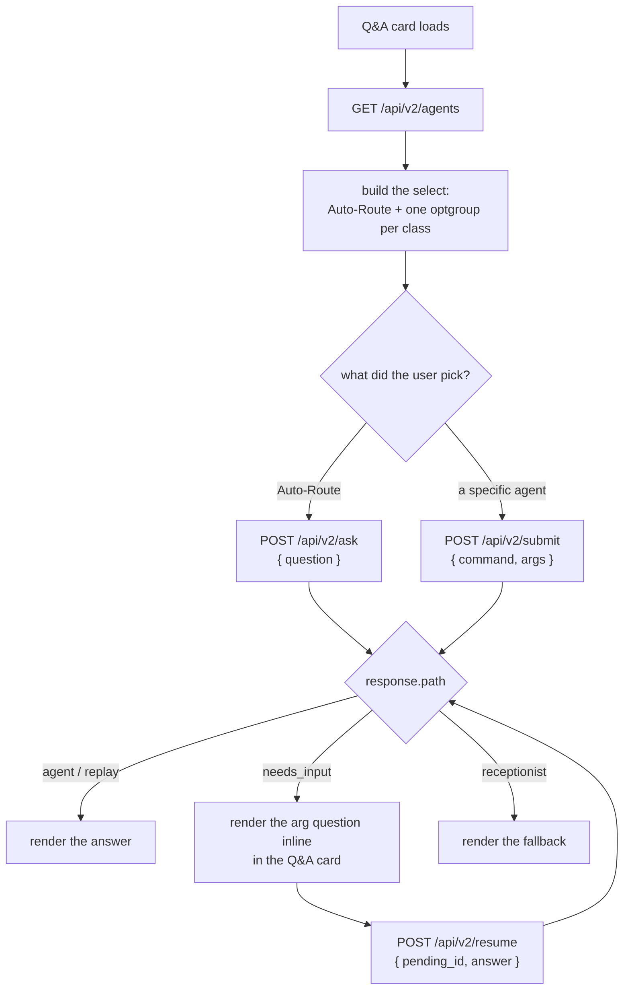

# Retiring the Submit Agentic Jobs panel into the Q&A card, and driving the agent list off the registry

**Author**: María 🌸 (`76904b6c`) · **Date**: 2026-08-22 · **Status**: PLAN — not built, not authorized
**Asked for by**: Rick, broadcast `8f49297e`, 2026-08-22 morning
**Measured at**: wip `9b49f04d` (the brain-integration merge, landed 10:15 EDT this morning)

## 🔴 RULINGS TAKEN — Rick, 2026-08-22 morning, live walkthrough

| # | question | ruled |
|---|---|---|
| 1 | What governs which agents the dropdown lists? | **A new registry field, `user_initiable`** — its own ratified field, NOT a reuse of `speakable`. Both expediters get `false`. |
| 2 | Does picking an agent stick, or apply to one submission? | **One-shot, per request.** The dropdown routes that submission and falls back to Auto-Route. Sticky *voice* mode is untouched — it stays exactly as ruled 2026-08-21. |
| 3 | Does `receptionist` stay in the list? | **Yes — exactly where it is, among the agents.** Rick: *"it is both an agent that you can call because you want to call it, and it is also the else case when you get bounced and you receive an error or your routing doesn't work."* |
| 4 | Does the Broadcast card go too? | **Dissolved — the question was built on my error.** The Broadcast card is NOT in the Submit Agentic Jobs section. It lives inside the Notifications accordion and only shares the `job-submit-card` CSS class. Nothing to move. |

**Why `user_initiable` and not `speakable`**: `speakable` means *"belongs in the voice router prompt."* Using it to decide a mouse-driven dropdown works today by coincidence and breaks on the first command that is typeable but not sayable. Two questions, two fields.

### 🔴 What ruling 3 changes in the build

**The dropdown's grouping cannot simply be a projection of `CommandClass`.** I had recommended dropping the receptionist on the ground that the registry classes it `CommandClass.NONE`. That classification is correct and stays — it describes how the **router** reaches it, as the else-branch. It says nothing about whether a person may pick it on purpose, and I had collapsed the two questions.

The receptionist is genuinely both things at once, so the build carries **one stated exception**:

- `user_initiable = True` on the receptionist spec, and
- an explicit rule rendering it with the conversational agents rather than under a `none` heading.

An exception with a written reason, not an accident. And it is the reason decision 1 went the way it did: had the dropdown been driven off `cls`, this case would have had nowhere to live.

---

> *"…plan for the eventual removal of the Submit agentic Jobs panel from the Notifications client and replace it entirely with the Q&A interface, and we need to build a plan for populating the agent options that we have in the Q&A card that are populated from the registry object so that our 1 source of truth gives us access to auto routing or allows us to dial in a specific direct route to a specific agent."*

---

## 1. The verdict up front

**Both halves are one job, and most of the machinery already exists.** The registry is real and complete (20 commands), the two canonical doors are live (`/api/v2/ask` and `/api/v2/submit`), and the argument interview already works server-side (`needs_input` → `/api/v2/resume`). What is missing is a **read endpoint over the registry** and a **front end that renders from it instead of from a hand-typed `<select>`**.

The Submit panel does not need to be argued away. It shrinks to nothing on its own once the Q&A card can express every command the registry knows — which today it cannot.

**Three things must be decided by Rick before anyone builds** — they are in §8, and two of them change the shape of the work.

---

## 2. What is already true, measured this morning

The merge that landed at 10:15 EDT did a third of this job already.

> 🔴 **Corrected 2026-08-22, Rick's catch.** This table first read **8 → 5** and counted `broadcast-submit-card` among them. That was wrong: I matched on the `job-submit-card` CSS **class** and reported about **containment**. Measured properly by walking div depth, `#section-job-submit` spans lines 152–397 and the broadcast card sits at line 529 — inside `#section-notifications` (468–669). It was never in this section. Real numbers below.

| | before merge (`76963206`) | now (`9b49f04d`) |
|---|---|---|
| Cards inside `#section-job-submit` | **7** (lines 152–566) | **4** (lines 152–397) |
| Deleted by the merge | — | `podcast`, `presentation`, `swe-team` |
| Still standing | — | `claude-code`, `research`, `test-suite`, `tfe-resume` |

Where the four survivors actually post, measured in `notifications.js`:

| card | posts to | status |
|---|---|---|
| `claude-code` | `/api/v2/submit` (line 3812) | already a v2 client wearing a v1 card |
| `research` | `/api/v2/submit` (lines 3070, 3141) | same — two paths, both v2 |
| `test-suite` | `/api/test-suite/submit` (line 3250) | **old door, not yet retired** |
| `tfe-resume` | `/api/test-fix-expediter/resume-from` (line 7811) | **old door, not yet retired** |

**And this makes the retirement cleaner than the plan first said.** Every card in the section is an agentic job card — there is no non-agentic straggler to rehome, so when the four go, `#section-job-submit` and its `📝` toolbar button go with them and nothing is left behind. Two of the four are already nothing but a form over `/api/v2/submit`; the other two need their doors retired first, in the shape of the ten retirements already done.

---

## 3. The drift, counted

Five hand-maintained lists describe the same set of agents. Only one of them is the source of truth.

| # | list | where | entries |
|---|---|---|---|
| 1 | `REGISTRY` | `src/cosa/rest/v2/registry.py` | **20** — 6 conversational, 11 agentic, 1 control, 2 none |
| 2 | `<select id="agent-mode">` | `src/lupin_app/static/html/notifications.html` | **16** — 1 system, 7 "Quick Agents", 8 "Agentic Processes" |
| 3 | `MODE_TO_AGENT` | `src/cosa/rest/todo_fifo_queue.py` | **7** |
| 4 | `MODE_METADATA` | same file | **16** |
| 5 | `AGENTIC_MODE_MAP` | same file | **8** |

**The registry's own docstring already names this as the thing it replaced**: *"the `MODE_TO_AGENT` map in `todo_fifo_queue.py`"*. Phase 1 of the 2026.08.15 single-source design moved the agentic set in. Lists 2–5 are the part that did not follow.

### The gap that has a face on it — and it is ONE command, not three

> 🔴 **Corrected 2026-08-22 after Rick's objection.** This section originally called all three of these "drift". Two of them are not drift — they are a decision somebody already made on purpose, and the registry states the reason in both cases.

Three agentic commands are in the registry and cannot be selected in the Q&A card. Only one of them should be:

| command | required arg | in the dropdown? | why |
|---|---|---|---|
| `agent router go to bug fix expediter` | `dead_job_id` | ✗ | **by design** — `speakable=False`, *"card-reachable only; never an initial voice detection"* |
| `agent router go to test fix expediter` | `source_test_suite_job_id` | ✗ | **by design** — `speakable=False`, *"START, system-triggered; its job-id arg is not speakable"* |
| `agent router go to test fix expediter resume` | `resume_from` | ✗ | **a real gap** — `speakable=True`, and it has its own submit card |

**Look at what the two expediters need as arguments: job ids.** Both are produced by a job that already ran and failed. Nobody types one into a question box — you press a button on the failed job's card. Rick's words, 2026-08-22: *"perhaps the bug fix and test fix expediters do not belong in the Ask interface card at all."* The registry already agreed with him; this section had not.

That leaves one genuine gap, and it is the whole argument in one line: **the TFE Resume card exists because the dropdown cannot express it.** Fix the dropdown and that card has no job left.

Going the other way, the dropdown offers **`receptionist`** as a selectable agent. The registry classes `agent router go to receptionist` as `CommandClass.NONE` — the no-match outcome, not an agent you route to on purpose. That is a drift in the other direction, and it is a **user-visible behaviour question**, not a bookkeeping one (§8, Q3).

---

## 4. What the registry already gives us for free

Every field the front end needs is already declared. Nothing new has to be invented — only exposed.

| the UI needs | the registry already has |
|---|---|
| the option's value | `spec.command` — the full routing string |
| the option's label | `spec.label` (conversational) / `display_name` in `JOB_ARG_CONTRACTS` (agentic) |
| which group it belongs in | `spec.cls` — `CONVERSATIONAL` / `AGENTIC` / `CONTROL` / `NONE` |
| whether to offer it by voice | `spec.speakable` |
| what to ask the user for | `required_user_args` + `fallback_questions` |
| the job's id prefix | `job_prefix` (`dr`, `pg`, `cc`, `swe`, …) |
| a description for the option | `MODE_METADATA` — **the one thing that is NOT in the registry yet** |

**Descriptions are the single genuine gap.** `MODE_METADATA` carries a one-line description per mode ("Investigate a topic in depth", "Generate slides from a document") that the registry has no field for. Those strings are worth keeping — they are the only user-facing help text in the whole surface. §5.1 adds a `description` field rather than losing them.

---

## 5. The design

### 5.1 One new field, one new endpoint

Add two fields to `AgentSpec`:
- `description: Optional[str]` — move the 16 `MODE_METADATA` strings into the table.
- `user_initiable: bool` — **ruled 2026-08-22**. Means *"a person may start this by typing into the Q&A card."* Ratified data, checked by the same guard as `speakable`, and deliberately NOT derived from it. `False` for both expediters, whose only argument is a job id produced by a job that already failed.

Add **`GET /api/v2/agents`**, a pure projection of `REGISTRY`:

```json
{
  "agents": [
    { "command": "agent router go to weather", "label": "weather", "cls": "conversational",
      "description": "Weather queries", "speakable": true, "aliases": ["weather"],
      "required_args": ["location"], "arg_questions": {"location": "What location?"} },
    { "command": "agent router go to deep research", "label": "Deep Research", "cls": "agentic",
      "description": "Investigate a topic in depth", "speakable": true, "aliases": [],
      "required_args": ["query"], "arg_questions": {"query": "What should I research?"},
      "job_prefix": "dr" }
  ]
}
```

It takes `crud_enabled` into account exactly as `resolve()` does, so the label a user sees is the label of the agent that will actually run.

### 5.2 The Q&A card renders from it



**The `needs_input` loop is what replaces the Submit panel's forms.** A submit card is a form asking for `query` / `prompt` / `source` / `task` up front. The v2 flow already asks for exactly those, one at a time, from the same contract — it just does it in the response instead of in HTML. The Q&A card grows one inline answer box and inherits every agent's argument interview at once, including agents nobody has built a card for.

### 5.3 What retires, in order

| card | what has to happen first | difficulty |
|---|---|---|
| `claude-code` | nothing; already posts to `/api/v2/submit` | trivial — delete the card |
| `research` | nothing; already posts to `/api/v2/submit` | trivial — delete the card |
| `test-suite` | retire `/api/test-suite/submit` onto `/api/v2/submit` | one door retirement, the shape of the ten already done |
| `tfe-resume` | retire `/api/test-fix-expediter/resume-from` onto `/api/v2/submit`, **and** the dropdown must be able to express `agent router go to test fix expediter resume` | one door retirement + phase 3 |
| ~~`broadcast`~~ | **not in this section at all** — it lives in the Notifications accordion and shares only a CSS class | nothing to do |

When the last agentic card goes, `#section-job-submit` and its toolbar button (`📝`) go with it.

### 5.4 The three back-end lists collapse

`MODE_TO_AGENT`, `MODE_METADATA` and `AGENTIC_MODE_MAP` all become projections of `REGISTRY`, the way `ANSWER_COMMANDS` / `JOB_COMMANDS` / `SPEAKABLE_JOBS` already are. `GET /api/mode/available` keeps its shape and its callers, and starts reading the registry instead of `MODE_METADATA`.

---

## 6. How this proves itself

The failure mode of registry work is a green suite bought by weakening an assertion — the 2026.08.15 design says so at length, and it earned that paragraph. Three gates, all falsifiable:

1. **The endpoint equals the registry.** `GET /api/v2/agents` returns exactly `REGISTRY`'s commands, class for class. *Falsify it*: add a spec to the table and watch the test go red until the endpoint carries it. This is a set-equality across a real boundary (HTTP response vs Python table), not a count derived from the thing it checks.
2. **No hand-written agent list survives in the front end.** A grep test over `notifications.html` and `notifications.js` for `agent router go to` string literals and for `<option value=` inside `#agent-mode`. *Falsify it*: paste one option back in and watch it go red.
3. **Every registry command is reachable from the UI.** For each `speakable` command, the rendered select contains an option whose value is that command. *Falsify it*: mark one command `speakable=False` and watch the count fall.

⚠️ **Not a gate**: "the dropdown has 16 options." A count over a list derived from the registry cannot fail unless a set-equality would have failed first. That was ruled on 2026-08-15 and the ruling stands.

---

## 7. Phasing

| phase | content | gate |
|---|---|---|
| **1** | `description` field on `AgentSpec`; the 16 strings move in from `MODE_METADATA` | existing suites green |
| **2** | `GET /api/v2/agents` + its set-equality test | gate 1 above |
| **3** | Q&A card renders the select from the endpoint; auto-route unchanged | gate 2 + gate 3; **the 3 unreachable commands become reachable here** |
| **4** | The `needs_input` inline answer box in the Q&A card | an agentic job completes end to end from the Q&A card alone, with no submit card touched |
| **5** | `test-suite` and `tfe-resume` move onto `/api/v2/submit` | each retired door answers 410 naming its replacement, same as the ten before them |
| **6** | Delete the four agentic cards, `#section-job-submit`, and the `📝` toolbar button | e2e suite green; the deleted `data-testid`s go with their tests |
| **7** | `MODE_TO_AGENT` / `MODE_METADATA` / `AGENTIC_MODE_MAP` become registry projections | full suite green |

Phases 1–3 are the ones that pay for themselves — after phase 3 the drift is dead even if nothing else ships.

---

## 8. 🔴 Three questions for Rick — two of them change the shape

**Q1. Does the Broadcast card go too?** — ❌ **The question was invalid.** It is not in the Submit Agentic Jobs section; it never was. See the correction in §2.

**Q2. Sticky mode, or a per-request route?**
Today the dropdown sets a **sticky server-side mode** that persists until cleared. Rick's words were *"dial in a specific direct route to a specific agent"* — which reads per-request. The 2026-08-21 ruling kept user mode ("the queue resolves it first"), so both can coexist: the select could set sticky mode as it does now, or send `command` on one request and revert to auto. **My recommendation: per-request.** A submit card was always a one-shot — "run this one job" — and making the replacement sticky changes the behaviour people are used to. But mode stays for voice, exactly as ruled.

**Q3. Does `receptionist` stay in the dropdown?** — ✅ **RULED: yes, unchanged.** My recommendation here was to drop it, and it was wrong. See the rulings block at the top of this document for what replaced it and why.

---

## 9. What this does not cover

- **The training corpus.** Making the router better at reaching these agents is the 2026.08.16 generate-from-registry work, and this plan does not touch it.
- **Voice.** The voice ladder already routes through the registry (`test_registry_voice_binding.py`). Nothing here changes it.
- **The `speakable` set.** Ratified data, not derived — §2.1a of the 2026.08.15 design. If a command should become voice-reachable that is a separate, human decision.

---

## 10. Handoff

**This plan is not authorization to build.** It is written from `planning-is-prompting`; the build belongs to a session resident in `lupin` with the repo's own config loaded.

**Read before building**: `src/rnd/v0.2.0/2026.08.15-agent-registration-single-source.md` §5–§7 — this is phase 7 of that document in all but name, and its rulings on falsifiability apply here unchanged.
