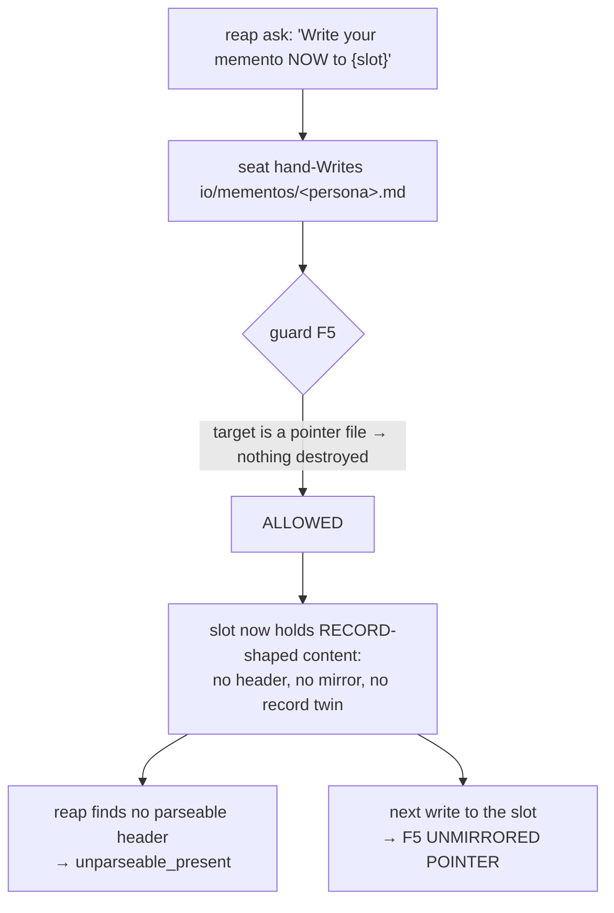

# Memento slots keep failing the freshness guard as header-less — root cause

**Row**: `5680c544` · **Investigated by**: Krishna 🦚, 2026-08-29 · **Status**: report only, nothing changed

## Verdict

**No code has drifted.** Four components are each individually correct and current. The
combination produces a header-less, unmirrored slot every time a reaped seat does the
literal thing its own ask told it to do.

## The symptoms, and why they looked like two problems

| when | who | alarm | half |
|---|---|---|---|
| 22:01 | Krishna | `memento_record_guard.py` F5 — UNMIRRORED POINTER | mirror |
| 22:31 | Rio | reap `unparseable_present` — 10.6 KB memento, no header | header |

They are the same defect seen from two sides. That is why the `migrate --apply` that cured
the first did nothing for the second thirty minutes later.

## The header contract

**The stamper** — `planning-is-prompting/workflow/scripts/memento_io.py write`. Writes
record + out-of-repo mirror + pointer in ONE call, and stamps line 1:

```
<!-- memento-record: persona=<p> session_id=<sid8> written_at=<iso> slot=<io|root|tmp> -->
```

**The verifier** — `lupin/src/lupin_mcp/reap_memento.py :: verify_seat_memento`. Usable only
when ALL hold: readable · bytes ≥ floor · **a parseable memento-record header** · header
`session_id[:8]` == this seat's · `written_at` aware, not future, age ≤ window. Anything else
asks, then reports `unparseable_present`. **mtime is never consulted, deliberately** — it
cannot grant a skip.

**The guard** — `memento_record_guard.py`. It ALLOWS a `Write` to a pointer PATH, and it
must: `memento_io` rewrites that pointer on every write, so a blanket refusal would be an
outage (its own comment records this as measured). Its F5 refusal is scoped to LOSS, not
style — all three of: target exists · is NOT a pointer file · has NO byte-identical mirror.

> **The guard cannot enforce the header, even in principle.** It sees a tool call and answers
> allow-or-refuse; it cannot author content. And it must keep letting pointer writes through.
> Only the WRITER stamps the header, and only when the writer is the verb.

## The instruction that routes seats around the verb

`reap_memento.py:89-90` — the text a reaped seat actually receives:

```
"prepare for re-spin — you are being reaped and your manager asked to preserve
 your context. Write your memento NOW to {slot} (via /plan-memento or memento_io), …"
```

It leads with an imperative naming the **destination path** and offers the verb as a
parenthetical alternative. Under a reap clock a seat does the literal thing: `Write` →
`{slot}`.

**The docs are not the problem** — checked expecting to find the drift there.
`memento-management.md` (v1.7, 2026-07-13) says writes go through the script, *never a
hand-`Write`*. `/plan-memento` is blunter: *"NEVER hand-`Write` a memento, and NEVER
hand-`Edit` one. Not `io/mementos/<persona>.md`, not `.claude-memento.md`, not anywhere."*
Both correct, both current. The one sentence a seat reads **at reap time** is the one that
names the slot.

The investigator is the receipt: at 22:01 I hand-`Write`-ed the slot, and my content carried
a header only because my own predecessor memento told me to type one. Provenance by
discipline — the exact thing this design exists to remove.

## The mechanism



**Worse than failing to help.** A hand-write onto a *healthy* verb-written pointer is allowed
by F5's condition 2 — it IS a pointer, so overwriting destroys nothing — and silently
**downgrades** a good slot: the record and mirror survive beside it, but the pointer is gone,
so `resolve` and every naive reader now get header-less content instead.

## Is `migrate --apply` a one-time repair or re-rot? Both, split by half

Read from the code rather than inferred: migrate TWINS and MIRRORS by copying bytes
(`shutil.copy2`), and re-running is an explicit no-op. **It never stamps a header, because it
does not author content** — it is a copier.

| condition | migrate |
|---|---|
| F5 / unmirrored | **cured**, and stays cured for that content |
| `unparseable_present` | **never cured**. Bytes in, same bytes out. |
| the next hand-`Write` | recreates **both** conditions immediately |

Migrate is worth running — it makes existing content recoverable — but it is not a fix and
cannot become one. It treats the symptom that destroys data, not the one that destroys
provability.

## Recommendation

**PRIMARY — fix the ask text; it is in Lupin, not the fleet control.** `reap_memento.py:89-90`
should hand the child the VERB with its arguments already filled in, and stop naming the slot
as the destination. A seat under a reap clock copies what it is given: give it a command
line, not a path. One string, no guard change, nothing reaching other crews. That is the
whole fix for NEW mementos, because it puts the only stamping writer back in the path.

**SECONDARY — needs an owner; it is a new verb in the fleet-wide tool.** Migrate cannot repair
the header-less files that already exist. A `memento_io.py stamp` verb — derive persona /
session / written_at, prepend the header, re-mirror, re-point — would fix the standing corpus
in place.

**EXPLICITLY NOT RECOMMENDED — relaxing the guard or the verifier to accept a header-less
record.** The header is the only thing proving a memento is THIS seat's and THIS window's
without consulting mtime, and `verify_seat_memento` refuses mtime on purpose. Accepting
header-less content would quiet the alarm by making it blind — the trade this row was filed
against.

## On "an alarm that is usually wrong"

The framing that opened the row survives the evidence, sharpened. **The alarm is not usually
wrong — it was correct every time it fired.** Rio's 10.6 KB memento genuinely could not be
proven fresh, however well it reads to a human. What is wrong is that we hand seats an
instruction that *manufactures* the unprovable file, and then train ourselves to read a true
alarm as noise. The alarm is not the thing to fix.

## Limits of this report

- **Not measured**: how many header-less slots exist across the fleet root today. That is a
  `memento_io.py verify --repo <path>` sweep per repo, and other crews share the root, so the
  count is not one seat's to take unilaterally. It decides whether the SECONDARY item is
  urgent or housekeeping.
- **Read only**: `memento_record_guard.py`, `memento_io.py`, `reap_memento.py`,
  `memento-management.md`, `/plan-memento`. No edits, no repair, no box use.

## Family resemblance — and one correction to how it was first stated

Same shape as two other findings the same night: the instrument quietly deciding what it can
see, with the output silent about it.

⚠️ **The `--cov` version of this was first stated too broadly, and Maya's measurement
narrowed it.** A scoped `--cov` does **not** change per-file numbers — the same file reads
163 statements / 0 miss and 44 branches / 0 partial under two different scopes, so per-file
counts are **scope-invariant**. The scope decides only which files **appear**. So the real
rule is sharper: a scoped run safely answers *"what is this file's coverage"* and **cannot**
answer *"which files are at zero"*, because absence from a scoped report is *never-measured*,
not zero — and the output says nothing either way.

That is the same shape as the `src/scripts` namespace-package finding and as the
two-databases trap in § TESTING VENUES: **an empty answer to a narrowed question is
indistinguishable from a confident negative.**

The difference in the memento case is that **this instrument is honest** — it says "cannot
prove" rather than returning an empty set — and the failure is that we made the thing it
cannot prove.
