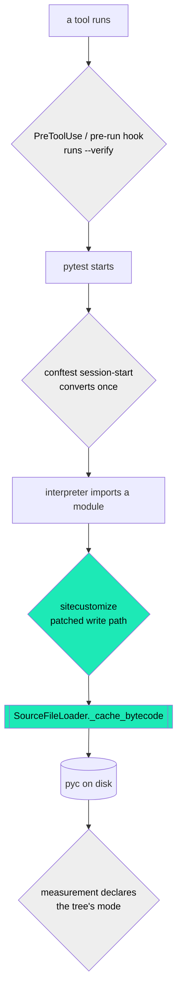

# The checked-hash mechanical control — built, measured, and priced

**Row**: `9b5b97de` (build-and-price) · **Decision it serves**: `f313fc2d` (Rick's, `gate_class=operator`)
**Author**: Krishna 🦚 · **Date**: 2026-08-30
**Tree**: `/mnt/DATA01/include/www.deepily.ai/projects/lupin`, branch `wip-v0.2.1-2026.08.29-cjflow-v2-followup`

> **THIS DOCUMENT PROPOSES A PLACEMENT. IT DOES NOT TAKE ONE.** Nothing here is wired into a
> test tier, a hook, a `conftest.py`, or a `sitecustomize.py`. The module is inert until
> something calls `install()`, and nothing in the repo calls it. That is deliberate: which
> placement ships is Rick's ruling on `f313fc2d`, and it is the whole reason that row is a
> decision rather than a bug.

---

## 1. What the decision asked for, and what is answered here

`f313fc2d` records three accidental breaches of the checked-hash rule in one afternoon, by
people who had read it and two of whom wrote parts of it. That is the easy half of the case.

**The load-bearing item is #2**, and the row says so: a correctly converted tree grew a new
timestamp pyc about 2.5 hours after a clean conversion, **with nobody purging anything**. A
control that only guards purges answers the easy half.

| Deliverable | Where |
|---|---|
| 1. The control, built and tested, with a negative control that actually reddens | §2, §3 |
| 2. Priced comparison of the hook points; which one covers item #2 | §4 |
| 3. A trace recording actor and time when the mode changes | §5 |

---

## 2. The mechanism — read out of CPython, not recalled

`importlib/_bootstrap_external.py` (3.13.7), `SourceLoader.get_code`, ~line 1163:

```python
if hash_based:  data = _code_to_hash_pyc( code, source_hash, check_source )
else:           data = _code_to_timestamp_pyc( code, source_mtime, len( source_bytes ) )
```

`hash_based` is derived **from reading an existing pyc**. When no pyc exists there is nothing
to inherit a mode from, so the branch falls to timestamp — CPython's default.

⇒ **That is item #2, exactly.** It is not a bug and it is not anyone's carelessness. It is
what the interpreter does, every time, on every first-time import.

**There is no flag that changes it.** `-B` / `PYTHONDONTWRITEBYTECODE` suppress *writing* a
pyc, never the *mode* of one that does get written. `_imp.check_hash_based_pycs` governs
*validation* of hash pycs that already exist, not the mode of new ones. This is why the
existing doctrine could not be fixed by better compliance: **there was nothing to comply
with.**

### The one place to stand

Every source-import bytecode write funnels through `SourceFileLoader._cache_bytecode`. The
control patches that and rewrites the header before it reaches disk.

🔴 **Patch the CONCRETE class, not the base.** `SourceFileLoader` defines its own
`_cache_bytecode` (`:1238`), shadowing `SourceLoader`'s (`:1058`). **My first cut patched the
base, reported a clean install, and left every pyc timestamp-based** — the same shape as the
`-f` trap in the migration script: a command that succeeds while doing nothing. There is a
regression test named for this.

**The swap is exact, not an approximation.** Both headers are 16 bytes:

```
timestamp     magic(4) flags(4)=0     mtime(4) source_size(4)  marshalled code
checked-hash  magic(4) flags(4)=0b11  source_hash(8)           marshalled code
```

Bytes 4:16 are replaced; everything past offset 16 is passed through untouched. **No
unmarshal/remarshal round trip**, so the swap cannot alter the compiled code — those bytes
are the ones CPython already produced. A test asserts byte-identity past offset 16.

---

## 3. Receipts

**Built**: `src/cosa/utils/checked_hash_pyc.py` · **Tests**: `src/tests/unit/test_checked_hash_pyc.py`

```
51 passed
src/cosa/utils/checked_hash_pyc.py   144 stmts   0 miss   44 branch   0 partial   100%
```

### The A/B, measured on CPython 3.13.7

Same package, same same-size same-second edit, run in **subprocesses** — the defect is
cross-process, so an in-process test cannot observe it at all.

| arm | cache mode | source says | fresh interpreter sees | |
|---|---|---|---|---|
| **unpatched** | `timestamp` | `9` | **`3`** | stale bytecode served |
| **patched** | `checked-hash` | `9` | **`9`** | the edit is seen |

The unpatched row is the **negative control and it is asserted, not merely observed**. If it
ever starts reporting `9`, the fixture has stopped reproducing the defect and the patched row
proves nothing.

### Remove-the-fix control on the control itself

Neutering the header swap (verified applied: sha `fbe50171aaf2` → `f3f85b7b52dc`) reddens
**7 of 51**, including the item-#2 test and both end-to-end arms. Restore verified by sha
equality back to `fbe50171aaf2`, then **51 pass**.

### Cost — measured, not modelled

> The figure in circulation from the earlier write-up is **+3.3%, and it is analytic.** These
> are measurements, and they disagree with it in the direction of "cheaper".

| what | measured |
|---|---|
| header swap + source hash, per file | **21.4 µs** (118 KB source, 2,000 iterations) |
| whole tree from a fully cold cache | **~52 ms, once** (2,420 files) |
| cold import of `cosa.rest.running_fifo_queue`, stock vs intercepted | **2.42 / 2.48 s**, then **2.51 / 2.45 s** on a repeat |

⚠️ **The end-to-end difference is below this measurement's noise floor — the ordering flips
between samples.** I am not claiming the overhead is zero; I am reporting that at n=2 it is
not resolvable, and the per-file figure is the one to trust.

⚠️ **The first version of this benchmark was wrong and would have published a fiction.** The
stock arm ran `python -c " import …"` with a leading space, died on an `IndentationError`
into `2>/dev/null`, and returned **15 ms** — which reads as "stock is 160× faster" rather
than "stock did not run". Same family as the two-database trap: **an empty answer wearing a
confident number.**

### Live, against the real tree

```
$ LUPIN_ROOT="$PWD" PYTHONPATH=src .venv/bin/python -m cosa.utils.checked_hash_pyc
this interpreter's pycs: 2420  (checked-hash=2420)
ledger: …/io/pyc-mode-ledger.jsonl
exit=0
```

---

## 4. The four placements, priced



**Only the green box sits between the import and the disk.** Everything else runs *before* a
run starts or *after* it finishes, and item #2 happens *during*.

| # | Placement | Covers item #2? | Cost | Blast radius if it misbehaves | Leaves a trace? |
|---|---|---|---|---|---|
| 1 | **PreToolUse / pre-run hook** runs `--verify`, refuses or auto-converts | ❌ **No** | ~1.5 s per fire (census of 2,420) | Medium — a false red blocks a tool call | Yes, easily |
| 2 | **conftest session-start** converts once per run | ❌ **No** | ~3.5 s per pytest session | Medium — breaks test startup | Yes, easily |
| 3 | **sitecustomize** patches the write path | ✅ **Yes — the only one** | 21.4 µs per fresh compile; ~52 ms whole-tree cold | 🔴 **Highest — every python process in the repo** | Yes, but must be cheap |
| 4 | **Accept the drift**; every measurement declares the tree's mode | ❌ No (documents it) | ~1.5 s per measurement | Lowest — changes nothing | Yes |

### Why 1 and 2 cannot cover item #2

Both are **point-in-time**. A hook fires when a tool runs; a conftest fires when a session
starts. Item #2's timestamp pyc was written **2.5 hours after** a clean conversion, by an
ordinary import, with no tool invocation and no test session in between. A gate that fires
before and after a run cannot see a write that happens in the middle of one — and worse,
**both would have reported the tree clean at every moment they actually looked.**

They are not worthless. They catch the *other* three breaches — the raw purges — which is the
majority of what actually happened that afternoon by count. They just do not close the item
the row calls load-bearing.

### What 3 costs, stated plainly

Placement 3 is the only one that closes item #2, and it is also the one that can hurt most.
From a `sitecustomize.py` this code runs **inside every Python process in the repo**, before
anything else: test tiers, both servers, every hook, every script.

**That is why the module is built fail-open on every path**, and why that is tested rather
than asserted in a comment — with the hash step sabotaged, the import still succeeds and the
pyc is still written, degrading to exactly the drift we have today. **A control that can
brick the fleet is worse than the drift it prevents.**

Two residual limits, stated because they will otherwise be discovered later:

- **Pytest's assertion-rewritten pycs are outside all of this.** Pytest's rewriter writes
  them, not compileall and not this funnel. **Test modules keep timestamp caches**, so a
  same-size same-second edit to a *test file* is still not seen. `tests.helpers.pyc_freshness`
  remains the tool for that case. This is unchanged by any of the four options.
- **The interceptor is scoped to `LUPIN_ROOT/src`** and excludes vendored trees, matching
  `migrate-pyc-to-checked-hash.sh` exactly. That is what keeps this module's population and
  the migration script's population the same; without it the two would disagree and neither
  would be wrong.

### My recommendation

**3 + 4, and not 1 or 2.**

Placement 3 is the only thing that closes item #2, and 4 is nearly free insurance against 3
being off or having silently stopped working — a measurement that declares the tree's mode
costs one line and makes every future number self-describing. **1 and 2 add gates that fire
where the problem is not**, and each adds a way for the build to go red for reasons unrelated
to the code under test, which this fleet has enough of.

If Rick wants only one: **3**. If Rick wants zero risk to the fleet's interpreters: **4
alone**, and item #2 stays open and known — which is honest, and better than a control that
looks like it closed it.

---

## 5. The trace

The row asks for this explicitly and flags it as the part most likely to be dropped as
polish. It is built: `record()` + the `main()` CLI, appending JSONL to
`io/pyc-mode-ledger.jsonl` (gitignored).

```json
{"ts": "2026-08-30T15:41:42-0400", "actor": "rruiz/9c88c030", "pid": 1377247,
 "event": "census", "counts": {"checked-hash": 2420}, "note": "offenders=0", "argv0": "…"}
```

**Why this earns its place.** On 2026-08-30 the main tree's mode changed — 2,416 checked-hash
to 66 — and four people investigated. They produced three mutually inconsistent inferences
and no answer, and the row records the hunt as deliberately abandoned. Nothing was wrong with
anyone's reasoning. **There was no record to reason from.**

🔴 **The ledger's value is in its SILENCES as much as its entries, and it must be sold that
way or it will be oversold.** Sanctioned tools write a line. A raw purge typed in any shell,
a stray `compileall`, a tool nobody has identified — these write nothing. So **a mode change
with no adjacent entry is positive evidence that no sanctioned tool did it**, which is
precisely the question four people could not answer. It does **not** make every actor
identifiable, and `actor()` names the *session*, not the human.

**Not wired.** `record()` is called by the census CLI only. Adding a one-line call to
`migrate-pyc-to-checked-hash.sh` and `purge-pycache.sh` would make the ledger materially more
useful and blocks nothing — but they are shared scripts, so I am proposing it rather than
doing it.

---

## 6. What is Rick's call

1. **Which placement ships** — §4. My recommendation is 3 + 4; the risk of 3 is stated above and is real.
2. **Whether the ledger gets wired into the two pyc scripts** — two lines, blocks nothing.
3. **Whether the three pyc-header readers should collapse into one.** ⚠️ I wrote "two" here
   first and it was wrong — there are **three** copies of the flags logic in this repo today:

   | reader | home | used by |
   |---|---|---|
   | `CENSUS_PY` | `src/scripts/migrate-pyc-to-checked-hash.sh` | the shell verifier |
   | `pyc_invalidation_mode()` | `src/tests/helpers/pyc_freshness.py:299` | the shadowing guard |
   | `pyc_mode()` | `src/cosa/utils/checked_hash_pyc.py` | this control |

   **All three agree today**, and all three encode the same hard-won correction — that
   `flags & 1` reads unchecked-hash as protected, exactly backwards. That correction had to be
   made in each of them separately, which is the argument: **three implementations of one rule
   is how they stop agreeing later**, and the next person to fix a fourth subtlety will fix it
   in one or two of the three.

   ⇒ **The direction matters.** The test helper cannot be the shared home — production code in
   `src/cosa/` must not import from `src/tests/`. So the collapse would run the other way: the
   helper and the shell census both delegate to `cosa.utils.checked_hash_pyc.pyc_mode`. I have
   **not** done this; it edits two files that other people's rows are live in.

**Cross-refs**: `866f43ce` (the mandate) · `d18ce9ef` (original stale-pyc repro) ·
`a4e36bcb`/`0146b53b` (verifier argument-surface fix, confirmed an ancestor of this work) ·
`src/rnd/v0.2.1/2026.08.29-stale-pyc-defeats-mutation-testing.md`
