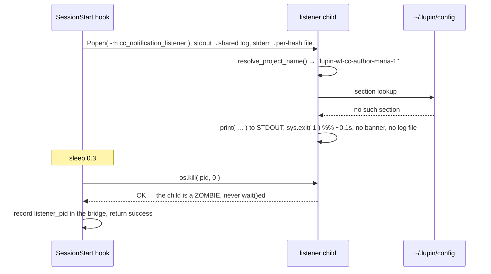

# A start that leaves no artifact, and a liveness probe that cannot fail

**Rio ⚡ · 2026-09-04 · session `d0259f0b` · branch `wt-rio-listener-never-starts` off `2e547a10`**
Assigned by María after my own re-spun seat reproduced it. Companion to
`2026.09.04-the-defect-whose-only-symptom-is-a-success.md` — same day, same seat, the same
family seen from the other end.

> 🔴 **HELD, NOT DEPLOYED.** The hooks execute from the MAIN checkout, which carries neither
> commit. Every re-spun worktree seat still comes back deaf. Fixed in source, open in production.

---

## 0 · The shape, in one line

**A process that never starts leaves no artifact, and a monitor that cannot fail reports it
healthy. The two compose into a failure that is not merely silent — it is affirmatively
reported as success.**

🔴 **AND THE HALF THAT MADE IT LAST IS THE THIRD ONE, WHICH I UNDERPLAYED UNTIL KRISHNA 🦚 SAID
SO.** The credential bug made ONE seat deaf. What made **33** of them accumulate unnoticed is
that the failure message went to **stdout**, which the spawn hook redirects into a shared 130 MB
log where it lands with no session hash and no timestamp — and, in the case under investigation,
directly beneath the previous session's clean `=== LISTENER STOPPED ===` banner. *A death that
prints into a shared sink with no identity on it is a death that reads as somebody else's
graceful stop.* The cause is worth one commit; **the destination is worth the doctrine.**

Everything below is one instance, but the three halves are independent and each would be worth
writing down alone.

---

## 1 · What was observed, and why the observation pointed the wrong way

A seat is re-spun. The replacement can SEND but not RECEIVE. Four artifacts:

| artifact | reading |
|---|---|
| bridge `listener_pid` = 1680127 | no such process |
| `cc-listener-<hash>.stderr` | **0 bytes** |
| `cc-listener-<hash>.log` | **absent entirely** |
| `cc-listener-<hash>.spawn-lock` | 0 bytes, left behind |

María's decisive reframe, and it is the reason the investigation converged: **the listener does
not DIE at re-spin, it NEVER STARTS.** A process that dies leaves a traceback or a partial log.
This left neither, because it never opened its log file. The predecessor, meanwhile, had shut
down *cleanly* with full statistics — so the whole day's verb ("the listener dies at clear
time") had been sending readers to hunt a crash that was never there.

⚠️ **The spawn-lock carried no information and was nearly the diagnosis.** Every session in
`~/.claude/sessions` has a 0-byte `.spawn-lock` going back to June — `flock` leaves the file by
construction and nothing unlinks it. A property shared by every member of a population cannot
discriminate within it. María raised the lock as a *hypothesis* and explicitly forbade
inheriting it as fact; that instruction is the only reason it did not become the answer.

---

## 2 · The cause

`session_bridge.resolve_project_name()` walks the bridge `cwd` to the nearest `.git` and tests:

```python
if ( parent / ".git" ).exists():
    return parent.name.lower()
```

**A linked worktree's `.git` is a FILE**, so `.exists()` is True on the worktree itself and the
project resolves to the worktree's own directory name — `lupin-wt-cc-author-maria-1`.
`~/.lupin/config` carries one section per **repo**, so that name never matches:
`get_hook_credentials()` raises and `cc_notification_listener` calls `sys.exit( 1 )` roughly
0.1 s in — before its banner, before its log file is opened.



Each artifact falls out of one step:

| artifact | mechanism |
|---|---|
| log absent | the exit precedes log setup |
| stderr 0 bytes | the message was `print()`ed to **stdout** |
| unfindable | the hook redirects listener stdout into the shared 130 MB `cc-listeners.log`, where a message with no logger prefix and no timestamp lands **unattributed** |
| dead pid recorded healthy | `os.kill( pid, 0 )` **succeeds on a zombie** |

**Receipt**: `~/.claude/sessions/cc-listeners.log:2243354` — the credential failure sitting
directly beneath the predecessor's clean `=== LISTENER STOPPED ===` at 19:30:06. That adjacency
is the whole reason a startup failure read as a graceful stop.

**Population**: **33** such deaths in that log, named sections almost all worktree directories —
`maria-1/2/3/4`, `mr-radio-1/2/3`, `reviewer-tiberius-1`, `rachel-venvtest`. Fleet-wide, and
running: one arrived during the investigation.

---

## 3 · The half worth generalising: a liveness probe that cannot fail

```python
time.sleep( 0.3 )
try:
    os.kill( listener_pid, 0 )      # "is it alive?"
except ProcessLookupError:
    …report the death…
```

The hook never `wait()`s its child, so **an exited child is a zombie** — still in the process
table, and `os.kill( pid, 0 )` answers cleanly. Measured, two lines:

```python
p = subprocess.Popen( [ "/bin/true" ], start_new_session=True ); time.sleep( 0.3 )
os.kill( p.pid, 0 )   # succeeds
p.poll()              # 0
```

⇒ **The probe returns "alive" for every child that has ever existed.** It is not a weak check;
it is a check with no failing input, and its output was written into the bridge that the roster
reads. This is CLAUDE.md's *"a clean exit is not evidence the work happened"* arriving on a
monitor rather than on a tool: **the failure and the success print the same thing**, and here
the thing printed was a PID.

⚠️ **It is worse than no monitor.** With no liveness field, a manager checks the channel. With a
field that always says LIVE, the manager chases the person instead — which is exactly what cost
100 minutes earlier the same day.

**Fix**: `proc.poll()`, which reaps and reports the exit code. One line, and it converts a
laundered success into a named warning that also carries `(exit 1)`.

---

## 4 · Two resolvers in one seat, and the counter-example that was the same failure

Mid-investigation María produced what looked like a refutation: a peer re-spun into a worktree
and **her project resolved to `lupin`**, not the worktree name. Same shape, opposite resolution.

It was not a counter-example. Her seat's listener was dead at that moment with the identical
signature — pid absent, 0-byte stderr, no log, and a fresh
`No [lupin-wt-cc-author-maria-2] section found` in the shared log.

**The reading came from a different resolver.** `session_bridge.py:685` says so in its own
docstring, in a passage that begins *"THIS DOCSTRING USED TO SAY … AND THAT IS FALSE"*:

| caller | resolver | fallback |
|---|---|---|
| `get_session_info` | `build_sender_id_for_cc` → `detect_project()` | live cwd |
| the listener's credentials | `resolve_project_name()` | `LUPIN_ROOT` basename |

**My own seat reported `lupin` while its listener died on `lupin-wt-cc-author-maria-1`.** Both
answers true, in one process, at one moment.

⇒ **A counter-example must be measured on the same instrument as the claim.** The claim was
about credential resolution; the counter-reading came from the sender-id path. This is
CLAUDE.md's *"a coordinate is not a reference"* wearing a third face: not a stale pointer, not a
wrong population — **two live, correct instruments answering different questions in the same
words**.

⚠️ It also explains why María's manual repair worked and taught nothing: she relaunched from
`~/.claude/sessions`, where the bridge lookup misses and resolution falls back to `LUPIN_ROOT`.
**Her repair was correct and its success was accidental** — she said so herself before I
reached it.

---

## 5 · What the fix is, and the one thing it deliberately does NOT do

| commit | change |
|---|---|
| `e16e485d` | `proc.poll()` replaces `os.kill( pid, 0 )` in `_spawn_listener_locked` |
| `6e6c4d0b` | worktree collapses to its MAIN checkout for credentials; the credential failure prints to **stderr** |

The collapse is accepted **only if the collapsed name has a section**, so a wrong guess fails
closed to exactly today's error rather than to somebody else's account.

🔴 **The collapse is deliberately NOT shared with `memento_io`, and the reason matters more than
the decision.** The first reason offered — that the two want different answers, credentials the
main checkout and mementos the seat — was **withdrawn within the hour**: mementos want the main
checkout too. The decision survived its reason. The reason that replaced it is John's: the
memento resolver needs **carve-outs** credentials do not — a nested repo owns its own records,
and a submodule's common dir is not a working tree.

⇒ **A right decision resting on a wrong reason is the dangerous kind, because the decision is
what gets quoted and the reason is what gets reused.** The withdrawal is recorded in the code
comment beside the helper, not just in the conversation, so the next reader cannot inherit the
retired half. That is rule 4 from the same seat's earlier bank, arriving at a different pin:
**deliberate duplication, loudly labelled.**

---

## 6 · Verification, and what each arm is for

**Guard — 8 arms, 3 mutated shas, each mutation reddens exactly its own arm.**

| mutation | reddens |
|---|---|
| revert to `os.kill( pid, 0 )` | dead-on-arrival not recorded |
| delete the worktree retry | worktree seat resolves its main checkout |
| `file=sys.stderr` removed | failure written to stderr, not stdout |

The arms that must stay GREEN are doing as much work as the ones that redden: an ordinary
checkout unchanged (a change that returned any section would satisfy the first arm alone), an
unknown project still raising (the fix must not become *find some credentials*), a live child
still recorded, and the mechanism pinned directly — `kill( pid, 0 )` succeeding on the zombie
`poll()` reports.

**Eight pre-existing tests encoded the old check** — they faked `Popen` with a `MagicMock` and
patched `os.kill` to stand in for liveness — and were migrated to set `poll()`. That is
"I fixed the tests, not the code", which is normally how a regression gets laundered, so:
baseline taken FIRST at the pre-fix file (**41 passed**), same **41** after.

⚠️ **And an equal count proves nothing was dropped, not that what remains has teeth** (María).
Two further arms against the migrated tests, off a 44-green baseline:

| arm | kills |
|---|---|
| `exit_code = None` — death never detected | **4** — the death trio + the new arm 1 |
| `exit_code = 1` — every child reported dead | **8** — seven pre-existing alive tests + the new arm 2 |

**12 distinct tests, disjoint sets, every edited fake represented.** Disjointness is the load-
bearing property: it shows the two arms test different things rather than the same thing twice.

**End-to-end — and it enters ONE LAYER BELOW the incident, which is the honest statement of it.**
The real listener module launched from the worktree against a dead port now prints its banner
**and opens its log file** — the two artifacts that were missing — instead of exiting 1. The
incident entered at the *hook spawning* the listener; this probe launches the listener directly.
So it proves credential resolution from a worktree cwd, and **not** that the spawn path reaches
that code; the unit guards on `_spawn_listener_locked` carry that half.

⚠️ It is faithful rather than lucky for a reason worth stating: the resolver finds its bridge by
walking to the **grandparent** process, and the probe ran from a shell whose grandparent is
`claude` — the same ancestry the hook gives its child. A different ancestry would have exercised
the fallback and looked identical while proving nothing.

🔴 **KRISHNA 🦚 CLOSED THE LAYER THE RECEIPT COULD NOT REACH, AND THAT ARM IS HERS.** Reviewing
the branch, she drove the real resolver against **her own worktree — the seat that had actually
gone deaf** — with one variable, the tree:

| tree | result |
|---|---|
| fixed | `lupin-wt-cc-author-mr-radio-2` collapses to `lupin` → **RESOLVED** |
| `174aad67` | `ValueError: No [lupin-wt-cc-author-mr-radio-2] section found in /home/rruiz/.lupin/config` |

That string is **verbatim what her session emitted twice**. The fix clears a real incident,
measured rather than reasoned. ⇒ *Saying out loud which layer my receipt could NOT reach is what
told her where to point* — a stated limit is a more useful artifact than a stronger claim.

**Full unit tier**: 14 failed, **0 attributable** — 9 `cloud-run.env`, 1 terraform, 2 held
secret-scan, 1 ini-key-naming, and one I did not recognise (`test_subagent_governance`
chain-tail) **baselined at `2e547a10`, where it fails identically**. *"Not mine"* is a claim;
*"fails identically at the base commit"* is a receipt.

---

## 7 · What this cost me, banked

1. **My first population count was 32 and the honest number is 33.** The grep matched the phrase
   anywhere in the log — and by then my own DMs, quoting the phrase while reporting it, were IN
   the log. The instrument had been contaminated by the investigation using it. The strict
   pattern anchors on the listener's own line prefix. ⚠️ **The direction matters**: the count
   went UP, so the floor got firmer rather than the population smaller — a bare corrected number
   teaches the opposite.

2. **María's independent check reproduced my error, not my result** — she ran the same loose grep
   and got 34. Two people agreeing is not two measurements when both used one instrument.

3. **I underplayed the stdout half in my own subject line, and a reviewer had to tell me.** I
   led with the cause (credentials) because that is what I had chased. The destination is what
   made it survive 33 times. **The thing you spent longest finding is not automatically the
   thing most worth saying.**

4. **Stale PROSE outlived the code and I did not catch it** — two migrated fakes still carried
   `# a live pid, so the liveness check passes` next to a `poll()` the check now reads instead.
   The tests were correct; the comments taught a mechanism that no longer existed, and would have
   let a silent revert to `os.kill` past a reader of those two files. Found by Krishna 🦚, not by
   me, and not by any test — **a comment cannot fail.**

5. **My first repro of the credential failure was faithful by accident.** I ran it from a Bash
   tool call whose grandparent is the `claude` process, which is the same ancestry the real hook
   gives its child — so `_find_session_file()` resolved the same bridge. I did not verify that
   before trusting it; had the ancestry differed, the repro would have exercised the fallback
   path and told me nothing while looking exactly like a reproduction.

---

## 8 · The transferable pair

> **A start-path failure leaves no artifact, because artifacts are created by the code that
> did not run.** Do not look for the traceback. Look for what the failing step writes BEFORE it
> can fail — and if it writes to a shared sink with no identity on it, the death is real,
> recorded, and unfindable.

> **A probe that cannot return "no" is not a weak monitor, it is a fabricated success.** Ask of
> any liveness or health check: *what input makes this report failure?* If the answer requires
> the process to have never existed, the check has no failing input — and its output is being
> written somewhere a human will read as fact.

> **A failure written to a shared sink with no identity on it is not logged, it is discarded
> slowly.** Ask where a startup failure LANDS, not just whether it is emitted: an unprefixed,
> undated line in a 130 MB log shared by every session is indistinguishable from noise, and the
> next line above it belongs to somebody else's story.
