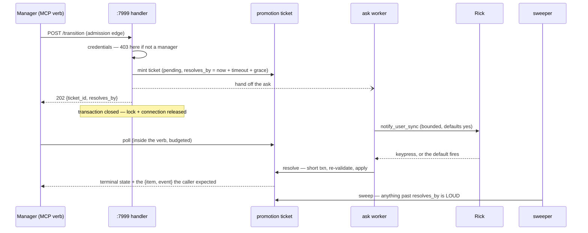

# Asynchronous promotion approval, and the resolution path that is the condition of shipping it

**Design doc · row `3493ae9b` · Phase 0 · no code written yet**
Author: Tiberius 👑 (`293756c8`) · 2026-09-06 · authoring for Mr. Radio 🦉

> **THE RULING IS ALREADY MADE AND THIS DOC DOES NOT RE-OPEN IT.** Mr. Radio ruled
> **(b) go asynchronous** on 2026-09-06 16:15 EDT, on authority Rick handed him by
> keypress at 16:11. Option (a) is rejected; option (c) has shipped. **What is open is
> only HOW**, and specifically the one condition he attached:
>
> > *"(b) ships ONLY WITH a resolution path the caller can actually observe. How does
> > the caller learn the outcome, and what makes a never-answered approval VISIBLE
> > rather than silent?"*
>
> That question is §3–§6. Everything before it is the re-derivation the row asked for.

---

## 0 · Provenance, and what in here is mine

| the part | whose |
|---|---|
| the mechanism, the four gate conditions, the (a)/(b)/(c) framing | **Krishna 🦚** — source reading, `src/rnd/v0.2.1/2026.09.05-the-approval-ask-holds-a-request-open-while-a-human-thinks.md` |
| the three original measured instances, and the retraction that a prompt re-read is not a remedy | **María 🌸**, row `96cf5cec` |
| the (a) rejection, the (c) go-ahead, the (b) ruling, and **the binding condition** | **Mr. Radio 🦉** |
| *"how does the caller get notified that approval has been granted?"* and *"the downside is losing the pressure of being blocked"* | **María 🌸** — the gap that made the ruling conditional |
| **§5.4.1** — the ATTACK LINE that *"byte-identical in the common case"* might be true-under-unstated-assumptions | **Mr. Radio 🦉's review brief**, which he copied to me |
| **§5.4.1** — the two defects themselves, found by SELF-AUDIT against that attack line | **mine**, and the overclaim being audited was also mine. ⚠️ **Tiffany 💍's independent review is STILL OUTSTANDING** — she is credited for whatever she brings that is not already here |
| *"a cost argument that prices one of three resources is not a weak argument, it is an argument about a different system"* (§2.3) | **Mr. Radio 🦉** — sharper than my own framing, kept in his words |
| **§2.3 (the row lock), §3 (the bound), §4 (board-invisibility), and the design in §5–§8** | **mine** |

**Everything I inherited is marked INHERITED at its use, and I re-derived all of it at a
named sha before building on it.** See §1, which is not throat-clearing — it is the part
that nearly went wrong.

---

## 1 · The re-derivation, and why it is the first section

I read this tree at **`d74f5851`** and measured three things that contradicted Krishna's
memo:

| his citation | what I measured at `d74f5851` |
|---|---|
| `TASK_STORE_TIMEOUT_SECONDS = 10.0` at `task_store_tools.py:39` | line **26** |
| `task approval promotion ask timeout seconds` at `lupin-app.ini:1106` | line **1097** |
| option (c) **shipped** — `server_read_timeout` + `outcome_indeterminate` | **absent**, and its guard file absent |

I was one message from filing *"(c) has not shipped"* as a finding.

**The worktree was 242 commits behind the main checkout.** Mr. Radio caught it by DM
before I sent it. Merged to **`6655d696`**, re-measured, and **all three of Krishna's
citations are exact**: `:39`, `:1106`, and (c) is shipped with
`src/tests/unit/lupin_mcp/test_task_store_read_timeout_is_not_unreachable.py` present.

⇒ **My readings were correct about a tree and false about the world**, which is the
same shape as this repo's § *A COORDINATE IS NOT A REFERENCE* one level up: not a stale
pointer, a stale *tree*. ⚠️ **And it points the dangerous way** — a stale tree makes
somebody else's landed work look unshipped, so the correction I was about to publish
would have sent the next reader to re-build something that already exists.

**Every line number in this document is stamped `@ 6655d696`.** Cite by symbol where you
can; the numbers are here so a disagreement is checkable, not so they are quoted.

> ⚠️ **Krishna's memo file itself is still not in this branch.** His `42eaec02` lives on
> `wt-krishna-slider`. **The CODE landed and the DOC did not**, which is this repo's
> § *A COVERAGE LIST GOES STALE FROM A MERGE, NOT FROM A COMMIT* wearing a different
> hat. Read the memo with `git show 42eaec02:src/rnd/v0.2.1/2026.09.05-the-approval-ask-holds-a-request-open-while-a-human-thinks.md`.

### 1.1 🔴 AND I THEN COMMITTED THIS SECTION'S OWN DEFECT INSIDE IT

**Four citations in the first draft of this document were numbers I had read at
`d74f5851` and carried across the merge without re-reading.** I re-derived the three the
row and the memo argue about — and silently kept the ones nobody was arguing about:
`notify_user_sync.py:98, :125-126, :355` and `task_store_tools.py:88-89`. Every one was
wrong at `6655d696`; the real lines are `:156`, `:184`, `:430` and `:140-141`.

⇒ **Re-derivation is not a thing you do to a document, it is a thing you do to every
claim in it.** I re-derived the *disputed* citations because they were disputed, which is
attention spent on the instance and not on the shape — and the undisputed ones are
exactly the ones nobody else will check either.

⇒ **The control that caught it was mechanical, not vigilant**: a scripted pass that
`sed`s each cited line and greps for the symbol I claimed is there. It is in §10 and it
should run on any document in this repo that cites a line number.

⚠️ **This also re-proves the section's own advice.** Three of the four survived because
`notify_user_sync.py` gained 108 lines in the merge window — **a file I never read at the
new sha because I had no reason to think it had changed.** Reading the diffstat before
trusting a memory is one command.

---

## 2 · The mechanism as it stands at `6655d696`

### 2.1 The two numbers — INHERITED from Krishna, re-derived by me

| side | value | where |
|---|---|---|
| CLIENT read timeout, every `/api/tasks/*` call | **10.0s** | `TASK_STORE_TIMEOUT_SECONDS`, `lupin_mcp/task_store_tools.py:39` |
| SERVER human-ask timeout on an admission | **120s** | `task approval promotion ask timeout seconds`, `lupin-app.ini:1106`; read at call time by `get_ask_timeout_seconds()` |

The server may legitimately hold the request 120s. The client quits at 10.

### 2.2 The four gate conditions — INHERITED, re-derived

The ask fires only when **all** hold (`routers/tasks.py:1141-1155`,
`task_promotion_gate.approval_for_promotion`):

1. `approval.get_enforcement_active()`
2. `item.status == NOT_APPROVED_STATUS` **and** `to_status != NOT_APPROVED_STATUS` — the admission edge
3. the caller passes `manager_refusal` — a manager figure, or an `account_persona`
4. `account_persona not in ASK_EXEMPT_PERSONAS`, which is `( "rick", )` at `task_promotion_gate.py:69`

⚠️ **Still not reproduced, by me either.** Driving it fires a real question at Rick.
This is a source reading at `6655d696` and carries exactly the standing Krishna's did.

### 2.3 🔴 MINE, AND NOT IN THE MEMO: THE ASK FIRES INSIDE AN OPEN TRANSACTION HOLDING A ROW LOCK

The gate's own docstring names one held resource:

> *"`transition_task` is a sync handler, so FastAPI runs it in a threadpool and a
> promotion holds one worker for up to this long."*

**It holds three.** Traced in `routers/tasks.py`, one unbroken block:

```
:990   with get_db() as session:                       # transaction opens
:995     item = repo.get_by_id_for_update( task_id )   # SELECT ... FOR UPDATE
  …
:1148    promotion_gate.approval_for_promotion( … )    # ← RICK IS ASKED HERE, up to 120s
  …
:1186    repo.apply_transition( … )
       # get_db() commits on exit
```

Verified there is **no** `session.commit`, `session.flush`, `session.close` or nested
`get_db()` between `:995` and `:1148`. `get_by_id_for_update` is
`.with_for_update()` (`db/repositories/task_repository.py:116-121`).

| held for the duration of a human's thinking time | |
|---|---|
| a FastAPI threadpool worker | the docstring's one |
| a pooled DB connection | `pool_size` 5 + `max_overflow` 10 in dev, `pool_timeout` **30s** (`db/database.py:200-204`) |
| **a row lock on the task being promoted** | every concurrent transition on that row blocks behind it |

⚠️ **`pool_timeout` (30s) is shorter than the ask timeout (120s).** So a small number of
concurrent pending promotions can starve the pool for *unrelated* requests, which fail
at 30s with a pool-timeout that names nothing about approvals.

🔴 **THIS IS A SOURCE READING AND I HAVE NOT DRIVEN IT.** I have shown the lock is taken
and not released before the ask; I have **not** measured a pool starvation, and nobody
has reported one. **Do not quote the starvation as observed.** What is established is
the resource set, not a consequence of it.

🔴 **AND THE DOCSTRING IS NOT MERELY UNDERSTATING — MR. RADIO 🦉'S FRAMING, KEPT IN HIS
WORDS BECAUSE IT IS SHARPER THAN MINE:**

> *"A cost argument that prices one of three is not a weak argument, it is an argument
> about a different system."*

⇒ The docstring's *"that is affordable for a human gate on a rare action"* is a
**conclusion about a one-resource system**. It is not wrong about the worker. It is
answering a question nobody is in.

⇒ It strengthens the engineering case for (b), which was already one-sided. It does not
change the ruling and is not offered as a new argument for it.

⚠️ **This lives on its own row, not in `3493ae9b`** — it is a property of the CURRENT
synchronous implementation, true today and still true if (b) were reverted. The async
design closes it **incidentally**, which is exactly why it must not be closed silently
when (b) lands: a row closed as a side effect with no receipt naming the mechanism reads
to the next person as a defect that was investigated and found absent.

---

## 3 · 🔴 THE FACT THAT SHAPES THE WHOLE DESIGN: THE ASK IS BOUNDED, AND ITS DEFAULT IS YES

The condition asks what makes *"a never-answered approval"* visible. **At the server
there is no such state.** The ask always terminates:

- `promotion_ask_kwargs` sets `response_default = "yes"` and `timeout_seconds = get_ask_timeout_seconds()` (`task_promotion_gate.py:322-323`).
- `notify_user_sync` bounds its own wait three ways: the request read timeout `( 3, request.timeout_seconds + 10 )` (`:430`), a client-side elapsed check at `timeout_seconds + 5` (`:156`), and a `threading.Timer` watchdog that **cuts the stream at the deadline** (`:149`).

So every ask resolves within **~130s**. The outcome set is not my enumeration — it is
already enumerated in the tree, from the client, by row `96d2341c`:

```
task_promotion_gate.py:365-370
THE_NOTIFICATION_SYSTEM_ANSWERED = frozenset( {
    "responded", "expired", "expired_no_default", "offline"
} )
```

⚠️ **Eleven client statuses exist; these four mean the ask got through and the system
answered authoritatively about Rick. The other seven mean it never reached anybody, and
they REFUSE** — `connection_error`, `request_timeout`, `request_exception`,
`unexpected_exception`, `stream_error`, `unknown_event`, `error`.

| outcome | `approval_source` | row moves? |
|---|---|---|
| `responded`, yes | `keypress` | yes |
| `responded`, no | — | no, 403 |
| `expired` / `expired_no_default` / `offline` | `default` | yes — Rick's absence is not a blocker |
| any of the seven, or an **unknown** status | — | no, 403 (fail-closed, `task_promotion_gate.py:517`) |

🔴 **IT IS AN ALLOWLIST, AND THE DESIGN BELOW MUST NOT TURN IT INTO A DENYLIST.** The
comment at the set says why: a status added to the client later is unknown to the list
and therefore **refuses**, where a denylist would let it through and stamp Rick's name on
it. **A ticket carries the status forward, so the same allowlist must gate the ticket's
resolution** — moving the decision off the request path must not move it out from behind
that set. This is the one place where async could silently re-open a closed defect.

⇒ **"Never answered" is not a server state. It is a CALLER who stopped listening**, plus
one genuine machine failure: **the process is bounced while an ask is in flight.** That
second case is the only true orphan, and §6.3 is where it is handled.

⚠️ **This narrows the problem enormously and it is the reason the design below is
smaller than the condition makes it sound.** The caller does not need an unbounded
watch. It needs a way to reach an outcome that is *guaranteed to exist* within ~130s.

⚠️ **AND IT DOES NOT DISSOLVE MARÍA'S SECOND POINT.** Losing the *"someone is blocked on
me right now"* pressure is real and is untouched by any of this — see §7.1. Do not read
§3 as an answer to it.

---

## 4 · Where the row sits while pending, and why the obvious visibility fix does not work

The natural move is *"stamp the pending state on the row and let the boards show it."*
**It does not work, and the reason is one line:**

```
task_store_rules.py:107   BOARD_INVISIBLE_STATUSES = TERMINAL_STATUSES + ( NOT_APPROVED_STATUS, )
```

A row awaiting promotion is **still in `not_approved`** — that is the whole point of the
gate — and `not_approved` is *deliberately* invisible to every board query. So a pending
marker on the row is visible only to someone who already asks about that row by id,
which is the person who does not need telling.

⇒ **The pending state needs a surface of its own.** That is §5.2.

---

## 5 · The design

### 5.1 The shape, in one paragraph

The credential check stays **synchronous** — a non-manager still gets an immediate 403
and costs Rick nothing, which is Rick's own sentence order. Past that, the handler
**mints a persisted promotion ticket, closes the transaction (releasing the connection
and the row lock), fires the ask on a background worker, and returns `202`**. The worker
re-opens a *short* transaction when the answer lands, re-validates, and applies the
transition. The caller learns the outcome by polling the ticket — usually inside the
same MCP verb call, so the common case feels exactly as it does today.



### 5.2 What is new

| piece | what it is |
|---|---|
| `promotion_tickets` table | `id`, `task_id`, `to_status`, `requested_by`, `requested_at`, `resolves_by`, `state`, `approval_source`, `refusal`, `notification_id`, `ask_status`, `resolved_at`, the caller's original payload, **and the serialized `{ item, event }` the resolver produced** (§5.4.1 — it is what makes the poll's answer byte-identical rather than a re-read) |
| `POST /api/tasks/{id}/transition` → **202** | on the admission edge only; every other transition is byte-identical to today |
| `GET /api/tasks/promotions/{ticket_id}` | one ticket's state — the caller's poll target |
| `GET /api/tasks/promotions?state=pending` | **the visibility surface** §4 says the row cannot provide |
| a sweeper thread | same pattern as `RunningFifoQueue`'s ghost-job sweeper: suspenders to the worker's belt |
| MCP `task_promotion_status( ticket_id )` | so a caller that gave up has a named verb to come back with |

⚠️ **A separate table rather than four columns on `task_items`, and rather than
overloading the notification row.** The notification record knows *that a human was
asked*; it does not know which task, which `to_status`, or who asked — and the worker
needs all three to apply the transition. Putting them there would make one record answer
two owners' questions. The cost of the separate table is a migration, and I am naming it
rather than hiding it.

### 5.3 Why the ticket is not built from scratch

**Most of it already exists**, which is the single biggest reason this is smaller than it
looks:

- `notify_user_sync` captures the **`notification_id` off the opening SSE frame**
  (`notify_user_sync.py:184`) — i.e. **before the human answers**. That is a handle
  on the pending ask, available at request time.
- `GET /api/notifications/response/{notification_id}` is already a persisted pure read of
  `{ state, response_value, responded_at }` (`routers/notifications.py:2019-2054`).
- The landed-ness invariant is already ruled and documented: **`responded_at IS NOT
  NULL`**, *"never on `state` moving or `response_value` being non-null"* — and
  `responded_at NULL` with a `response_value` present is precisely *"a manufactured
  default"*. That is exactly the keypress-versus-default distinction Rick required, and
  it is already load-bearing elsewhere.

⇒ The ticket **stores** the `notification_id` and **reuses** that invariant. It does not
invent a second way to decide whether a human answered.

### 5.4 The client, and why the common case should not change

`task_store_request` already returns any 2xx body verbatim
(`task_store_tools.py:140-141`), so a 202 reaches the model today with no client change at
all. **That is not good enough** — the model would get a ticket and no outcome, which is
the condition's own failure.

So `task_transition_impl` gains: on a 202, poll the ticket against a budget. Then:

| what the poll finds | what the verb returns |
|---|---|
| resolved inside the budget | `{ item, event }` — the response today's 200 would have carried |
| refused | the server's refusal verbatim, as today's 403 does |
| still pending at budget | `{ status: "awaiting_human_approval", ticket_id, resolves_by, check_with: "task_promotion_status" }` |

### 5.4.1 🔴 THE FIRST ROW SAID "BYTE-IDENTICAL IN THE COMMON CASE" AND THAT WAS TWO CLAIMS, ONE FALSE AND ONE UNMEASURED

🔴 **ATTRIBUTION FIRST, BECAUSE I GOT IT WRONG ONCE ALREADY AND IT IS THE EXPENSIVE
DIRECTION.** The **attack line** — *is that phrase true, or true-under-unstated-assumptions?*
— is **Mr. Radio 🦉's, from the review brief he wrote for Tiffany 💍 and copied to me.**
The **two defects below I then found by auditing my own text against it.** So: his angle,
my findings, my original overclaim.

⚠️ **TIFFANY'S INDEPENDENT REVIEW HAS NOT HAPPENED YET.** My first draft of this
subsection credited her for these, which was generous and wrong in the direction that
costs most: **it makes an independent review look like it occurred when it has not**, and
if she now returns these same two, nobody can tell whether she found them or read my
correction. She is credited for whatever she brings that is not already written here.

It was the second reading — true-under-unstated-assumptions — in the section that carries
the whole caller-ergonomics argument. **Both halves are mine.**

**"BYTE-IDENTICAL" — false as first written, and fixable.** Today the 200 is serialized
*inside* the transaction that wrote it. In the design as drafted, the resolver applies the
transition and the caller's poll is a **separate read** — so `updated_ts` moves, the event
must be looked up rather than handed over, and a concurrent writer can change the row
between apply and read, leaving a returned item that describes a **later** state than the
event beside it. I asserted an equality I had never traced.

⇒ **DESIGN CHANGE, ADOPTED: the resolver serializes `{ item, event }` ONTO THE TICKET at
apply time, and the poll returns those exact bytes.** Byte-identical then holds *by
construction* rather than by hope, and the three drifts above cannot occur. This is
strictly better than what I first wrote and it exists because she pushed on the word.

**"THE COMMON CASE" — unmeasured, and no design change rescues it.** It silently assumes
Rick usually answers inside whatever budget the verb polls for. **Nobody has measured his
answer latency.** If he typically takes 40s and the budget is 10, then
`awaiting_human_approval` **is** the common case and I would have described the rare path
as the normal one.

⇒ **The phrase is struck rather than defended with a number.** The honest form is the
table above: *when* the ticket resolves inside the budget the caller gets today's exact
response; **how often that happens is a property of Rick, not of the code, and it is
unknown.**

⚠️ **AND IT HAS A CONSEQUENCE BEYOND PROSE, which is why it is a subsection and not an
edit.** The ergonomics half of (b)'s case rests on a number nobody has. **It does not
reopen the ruling** — async still removes the class, and that argument never depended on
latency. It does mean **this build must not be sold as invisible to callers**, and that
whoever sets the poll budget is choosing which branch is normal without data.

### 5.4.2 🔴 THE TWO KILLS ARE NOT EQUAL, AND THE SECOND IS THE ONE THAT WOULD HAVE TRAVELLED

Mr. Radio 🦉's ranking, and it generalises past this doc:

| the defect | what it was | why it ranks where it does |
|---|---|---|
| *"byte-identical"* | a **fixable design bug**, and I had the fix in the same breath | it fails **loudly** — the first caller to diff two responses finds it |
| *"in the common case"* | **a claim I had no evidence for, placed in the headline** | it fails **silently, and for every reader** |

⇒ *"A reader quotes 'byte-identical in the common case' and never learns which half was
measured."* The phrase is one noun-phrase long and carries a traced design property welded
to an unmeasured assumption about a person's behaviour — and **nothing in the sentence
marks the seam.**

⚠️ **So the durable lesson is not "check your claims" but something narrower: when a
phrase bundles a property of the CODE with a property of a PERSON or an ENVIRONMENT, split
it before you write it down.** The code half can be traced and fixed. The other half can
only be measured or struck, and it is the half that survives quotation.

⇒ Same family as this repo's § *THE OVERCLAIM HIDES IN THE JOIN* — except the join here is
not a *because*, it is a **prepositional phrase**, which is why reading my conjunctions one
at a time would not have caught it.

⚠️ **The third row is the point, and it is a different kind of answer from today's.**
Today a caller that gives up holds `server_read_timeout` + `outcome_indeterminate: True`
— honest (that is option (c) working) but **indeterminate**: it cannot tell you whether
the write landed. The 202 form is **determinate**: nothing has been applied yet, the
ticket id names the thing that will be, and the verb to ask with is named in the answer.

⚠️ **The budget is a CLIENT-side wait and holds no server resource.** That is the whole
difference from today and it must not be blurred: today's 120s block holds a worker, a
connection and a row lock (§2.3); this holds none of them.

### 5.5 🔴 A 202 IS A FALSE GREEN IN ALL THREE BROWSER CLIENTS — AND ONE OF THEM WRITES "APPROVED" INTO THE UI

**Reported by Mr. Radio 🦉. Verified by me at `6655d696`. Not a self-audit finding, and
deliberately filed apart from §5.4.1 so the two are not read as one person's sweep.**

`fetch`'s `response.ok` is `status >= 200 && status < 300`. **A 202 is `ok === true` in
every caller.** Population established rather than taken on the count: `git grep` over
tracked `src/`, tests excluded, returns **exactly four** callers of the transition
endpoint — no fifth.

⚠️ **AND IT IS TWO LAYERS, NOT THREE SITES — I REPORTED THE WRONG SHAPE FIRST AND THE
DIFFERENCE IS THE ACTIONABLE PART** (Mr. Radio 🦉 asked for the denominator; it is his
question that produced this row):

| | denominator |
|---|---|
| **Layer 1 — `ApiClient.request()`** | `:216` is the **only** `response.ok` check in the file, and **all five verbs** funnel through `request()`. Of **108** TS files under `multiplexer`, exactly **3** call raw `fetch(` — `AudioRecorder`, `boot`, `SenderCardRecorderRenderer` — and **none touches `/transition`**. Both TS transition callers share this one choke point |
| **Layer 2 — `notifications.js` `authedFetch`** | independent of `ApiClient`, its own `response.ok` at `:10611` |

⇒ **3 call sites, 2 layers, 4 callers.** A per-layer repair is **two** changes, not three
— and under opt-in it is **zero**, because the surface is never exposed.

| caller | what a 202 does |
|---|---|
| `api/ApiClient.ts:216` | throws only on `!ok`, so the 202 **resolves** and its body is returned as `T` and dropped |
| `stores/HoldingAreaStore.ts:259` | `await this.api.post( … ); return { ok: true }` → the UI reports the promotion **done** |
| `js/notifications.js:10611` | `if ( response.ok ) return { ok: true }` → same |
| 🔴 `stores/TaskListStore.ts:224` | **the worst.** It writes the optimistic row state *before* the call — `tasks[ idx ] = { …status: toStatus }` — and restores **only on failure**. A 202 never fails, so the row shows **approved and stays approved** |
| `lupin_mcp/task_store_tools.py:294` | returns the 2xx body verbatim — the only caller that could act on a ticket, and only once §5.4 teaches it to |

⇒ **That last browser row is a false FACT, not a false red.** Nobody investigates it. By
this document's own §6.3 ranking it is the species that goes uninvestigated longest, and
it would be reporting that Rick approved something he has not been asked about yet.

**RECOMMENDATION: MAKE ASYNC OPT-IN**, and the reason is not that it is cheaper.

⚠️ **A client that reads 2xx as success is CORRECT.** That is the HTTP contract as nearly
all code uses it. Changing an existing endpoint's status code is a breaking change to
every caller **present and future** — so repairing three clients today leaves the trap
armed for the fourth one somebody writes next month. **Opt-in removes the false green by
construction: only a caller that asked for a ticket can be handed one.** That is the same
principle as the ask-status **allowlist** in §3 — an unknown party gets the safe answer,
not the new one.

⚠️ **WHAT OPT-IN COSTS, AND IT IS NOT NOTHING.** Browser callers keep the synchronous
path, so they keep holding the worker, the connection and the row lock for up to 120s.
**Opt-in half-ships the ruling**: the MCP path, where the 10-vs-120 defect actually lives,
goes async; the browser does not. If the class is to be removed everywhere, **the two
layer fixes become part of stage 2's definition of done and land in the same commit as the
202** — never after it.

### 5.5.1 🔨 RULED: OPT-IN, BEHIND A FLAG, DEFAULT OFF — TWO INDEPENDENT GATES

Mr. Radio 🦉, 2026-09-06. **Two gates, and the second is what makes this safe rather than
merely cautious:**

1. **An INI flag — `task approval promotion ask asynchronous`, DEFAULT `False`** — read at
   **call time**, the same two-layer behaviour as `get_ask_timeout_seconds()`, so an
   operator's edit lands on the next promotion rather than the next deploy.
2. **An explicit per-caller opt-in field.** Flag OFF ⇒ today's behaviour for everyone, byte
   for byte. Flag ON ⇒ **only a caller that asked** receives a 202.

⇒ **A browser can never receive a 202 even with the flag on.**

**The accidental-opt-in path was checked, because otherwise opt-in is a false comfort.**
All three browser sites spread `...extras` into the body. `extras` is typed
`Record<string, string>` in TypeScript, and in `notifications.js` it is built from a
**closed set** — `reason`, `park_reason`, `next_chase_ts` (`:12553-12555`). There is no
route for an opt-in key to arrive by accident, and a boolean cannot be placed in a
`Record<string, string>` at all.

⚠️ **This is the same principle as the ask-status allowlist in §3, applied one layer out:
an unknown party gets the safe answer, not the new one.**

### 6.1 The caller stopped listening — **answered by a named verb, not by hope**

The ticket is persisted and terminal within ~130s. `task_promotion_status( ticket_id )`
returns the outcome, and the ticket id was handed to the caller in the 202 and repeated
in the verb's own "still pending" answer. **A caller that wants the answer can always
get it**, which is the first half of the condition.

### 6.2 Rick answered and nobody was polling — **belt and suspenders, both idempotent**

If only the caller's poll applied the transition, then a caller that walked away would
leave Rick having pressed *yes* on a row that never moved. **That is unacceptable and it
is why the sweeper is not optional.**

- **Belt** — the ask worker applies the transition the moment the answer lands.
- **Suspenders** — the sweeper scans open tickets and applies any whose answer landed.
- **Both take the same row lock and re-run the same validation**, so whoever arrives
  first applies it and the other finds it already applied. Idempotent by construction.

This is the shape the repo already runs for agentic jobs, where the ghost-job sweeper is
described in CLAUDE.md as *"suspenders to the callback's defensive belt."* Same pattern,
same reason.

⚠️ **The apply step must RE-VALIDATE under the lock, not replay blindly.** Between the
202 and the answer, the row may have moved, gone terminal, or been dropped. A ticket
whose transition is no longer legal resolves `superseded`, carrying the validator's own
words. **Replaying a stale intent onto a moved row is the defect this design would
otherwise introduce**, and it does not exist today because today the lock is held
throughout — that is the one thing the current design buys, and it must be bought back
here rather than lost.

### 6.3 🔴 THE PROCESS WAS BOUNCED MID-ASK — the only true orphan, and the loud one

Per §3 this is the sole way an approval genuinely goes unanswered. A bounce kills the ask
worker; the notification row and the ticket both survive.

**Two things fire, and neither is a queryable state nobody reads:**

1. **On startup**, any ticket still `pending` is reconciled: if `responded_at` is set the
   answer is applied; if `resolves_by` has passed with nothing landed it goes `stalled`.
2. **A `stalled` ticket fires `notify( priority="urgent" )`** naming the row, the
   requester and how long it sat.

🔴 **THIS IS THE PART THE CONDITION IS ACTUALLY ABOUT, AND MR. RADIO SUPPLIED THE
EVIDENCE FOR WHY A QUERYABLE STATE IS NOT ENOUGH.** His measurement, on this very row:
*all three rows Rick was listed on had already passed their chase times — 14:00Z, 15:00Z,
18:00Z — and rejoined the owed count silently. Nothing fired at him.* A state that
expires into a list is a state nobody looks at. **So the stalled path must PUSH, and a
`pending` list is the supplement, never the mechanism.**

⚠️ **A guard has to prove the alarm DISCRIMINATES, not merely that it fires.** Two arms,
one variable: a ticket past `resolves_by` → urgent notify; a ticket inside it → silence.
*"The alarm fires"* and *"the alarm fires when it should"* are different claims, and an
alarm that shouted on every promotion would satisfy the first.

---

## 7 · What this does NOT fix, said out loud

### 7.1 María's second point survives entirely, and I have no answer to it

> *"The downside is losing the pressure of being blocked."*

Today a manager's call blocks until Rick answers, and **that pressure is part of why it
gets answered.** Async removes it. Nothing in §5–§6 restores it: an urgent notify on a
*stalled* ticket fires only in the bounce case, not when Rick simply lets the default
take it.

⇒ **This is a real cost of the ruling, not a gap in the build.** It was weighed and
accepted at ruling time. **It should not be quietly re-described as solved**, and a
reader who takes §6 as answering it has taken more than §6 says.

### 7.2 The default-yes semantics are untouched, deliberately

Async changes *when* the caller learns, never *what* was decided. `response_default =
"yes"` remains Rick's standing rule that an absent Rick must not become a blocker.
**Changing it is a separate ruling and is not in scope here.**

### 7.3 What I have not measured

- **The pool starvation of §2.3 is derived, not observed.** No incident exists.
- **The gate has still never been driven end to end** — by Krishna, by Mr. Radio, or by
  me. Driving it fires a real question at Rick.
- **`ASK_EXEMPT_PERSONAS` and the approver allowlist agree today by coincidence**, which
  both `task_promotion_gate.manager_refusal` and `routers/tasks.py` already say in their
  own comments. Async does not change that and does not fix it.

---

## 8 · How this gets proven, before any of it is written

**Documentation-first: this section is the contract the build is held to.**

### 8.1 The test that has to exist, and why the obvious one is not it

🔴 **A test that instantiates the ticket class proves nothing about the app.** This repo
has the receipt already: a module can be complete, correct, at 100% and never mounted,
and every test that builds the component stays green. **So the load-bearing guard drives
the ASSEMBLED APP** — `import lupin_app.main`, interrogate the route table it builds,
and drive `POST /api/tasks/{id}/transition` through the real handler.

⚠️ **And it must enter at the layer the incident enters at.** The incident is *a caller
timing out on a transition*. A test that calls `approval_for_promotion` directly proves
the gate returns a value; it says nothing about whether the door returns 202. Enter at
the door.

⚠️ **The assembled app refuses to import without `JWT_SECRET_KEY`**, which lives in a
gitignored repo-root `.env` absent from every worktree. `src/cosa/tests/conftest.py`
sets it at *collection* time, so the tier is immune and a direct probe is not. Expect it;
do not symlink the secret.

### 8.2 The arms, each with the negative half

| arm | asserts |
|---|---|
| admission edge, manager caller | **202**, ticket minted, **no transition applied yet** |
| the same, **after the answer lands** | the transition applied exactly once, `approval_source` correct |
| **non-manager** | **403 immediately, and NO ticket and NO ask** — the negative half of the whole gate |
| **Rick as caller** | `APPROVAL_SELF`, no ask, no ticket — unchanged |
| **every non-admission transition** | byte-identical to today, no ticket, no 202 |
| enforcement **off** | byte-identical to today |
| row moved between 202 and answer | `superseded`, carrying the validator's words |
| ticket past `resolves_by` | urgent notify fires |
| ticket **inside** `resolves_by` | **silence** — the arm that proves the alarm discriminates |
| worker and sweeper both reach one ticket | applied **once** |

### 8.3 The discipline the arms are run under

- **GREEN BASELINE FIRST, recording the failing SET.** `rc == 1` is not a kill on a
  branch that carries a deliberate red, and this tree has carried them.
- **Pin BOTH `LUPIN_ROOT="$PWD"` and `PYTHONPATH="$PWD/src"`.** One without the other
  gives an import graph half from each checkout and a green that describes no tree.
- **Isolate every arm with `src/scripts/purge-pycache.sh`** — not a raw `rm -rf`, which
  re-opens the timestamp-pyc hole it used to plug.
- **100% lines, branches and functions**, and coverage is the floor rather than the
  proof: a fake that ignores its input answers the same however the code behaves.

### 8.4 Staging, so the risky half is not all-or-nothing

| stage | what lands | why this order |
|---|---|---|
| 1 | the ticket table + `GET` endpoints, **still synchronous** | the observability surface exists and is testable **before** anything stops blocking |
| 2 | the handler returns 202; worker applies | the behaviour change, against a surface already proven |
| 3 | sweeper + startup reconciliation + the urgent notify | the bounce case |
| 4 | the MCP verb + client poll | the caller ergonomics |

⚠️ **Stage 2 is the one that cannot be half-shipped.** The moment the door returns 202,
§6.2's suspenders must exist or a walked-away caller loses Rick's keypress. **If stage 3
is not ready, stage 2 does not land** — which is Mr. Radio's condition restated as a
build order.

---

## 9 · Open questions I am NOT deciding on my own

1. **Does the `202` need Rick's sign-off on the ergonomics?** The ruling covers the
   behaviour. It does not obviously cover *"a manager's tool call now sometimes answers
   `awaiting_human_approval`"*, which he will see. **My read: covered — that IS async,
   and re-asking would be storming a settled ruling.** Flagging rather than deciding.
2. **Ticket retention.** Terminal tickets are an audit trail of who asked Rick for what.
   Keep them, or age them out? Not mine to decide; nothing in the build depends on it.
3. **Should a `stalled` ticket auto-retry the ask?** I lean **no** — a retry after a
   bounce re-asks Rick about something he may have already answered, and the urgent
   notify puts a human in the loop instead. Worth one ruling.

---

## 10 · Receipts

| claim | how to check it |
|---|---|
| sha this was written at | `6655d696` |
| the ask sits inside the row-locked transaction | `routers/tasks.py:990, :995, :1148, :1186` — no commit/flush/close between |
| the lock is a real `FOR UPDATE` | `db/repositories/task_repository.py:116-121` |
| pool is 5+10 with a 30s timeout in dev | `db/database.py:200-204` |
| the ask is bounded and defaults to yes | `task_promotion_gate.py:322-323`; `notify_user_sync.py:149, :156, :430` |
| the outcome set is an enumerated allowlist | `THE_NOTIFICATION_SYSTEM_ANSWERED`, `task_promotion_gate.py:365-370` |
| a failed ask refuses rather than becoming a keypress | `task_promotion_gate.py:517` |
| `not_approved` is board-invisible | `task_store_rules.py:107` |
| the notification id arrives on the opening frame | `notify_user_sync.py:184` |
| the response read already exists | `routers/notifications.py:2019-2054` |
| a 2xx body passes through the client verbatim | `task_store_tools.py:140-141` |
| (c) is shipped | `task_store_tools.py:114-115`, guard `src/tests/unit/lupin_mcp/test_task_store_read_timeout_is_not_unreachable.py` |

**Every row above was checked line-by-line against `6655d696` after the doc was written,
not while it was being written.** That pass caught four wrong numbers — see §1's closing
note, which is the reason the pass exists.
