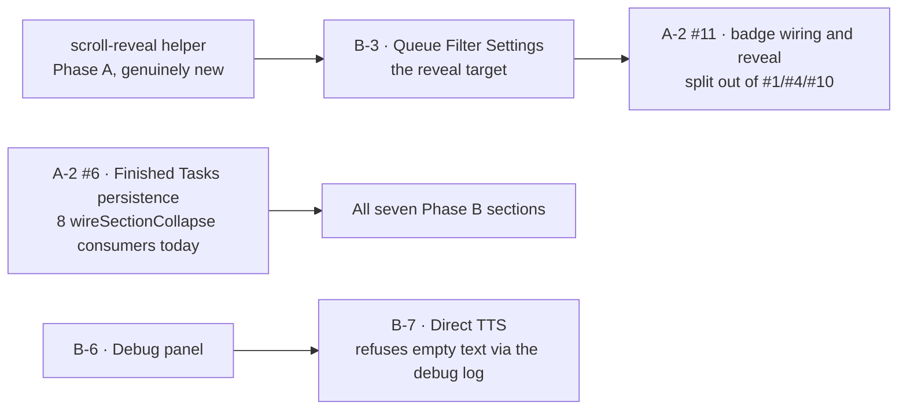

# Multiplexer parity — the build plan (Phase 3)

**Row**: `645a7da5` (Rick, P0). **Author**: María 🌸. **Written**: 2026-09-15 ~18:55 EDT.
**Revision 5**: 2026-09-17 ~16:10 EDT — Tiffany's independent audit of the Stage-1 fold answered, item by item, in §8 below. Three of its seven "dropped" findings were already restored by revisions 3–4; the remaining four are ruled here, and one is adopted rather than dropped.
**Revision 4**: 2026-09-15 ~20:30 EDT — Stage 3 of the cascaded plan-review folded in: the Tester restored to the flow, every ownerless imperative registered in §6, and every role named.
**Revision 3**: 2026-09-15 ~20:00 EDT — Stage 2 of the cascaded plan-review folded in, plus the three treatments it ratified.
**Builds on**: [Phase 1 — layout](2026.09.15-multiplexer-vs-legacy-layout-disparities.md) · [Phase 2 — runtime behaviour](2026.09.15-multiplexer-vs-legacy-runtime-disparities.md) · [Operator-state preservation spec](2026.09.15-operator-state-preservation-spec.md)
**Build owner**: Mr. Radio 🦉 and his crew, per the ticket.

**Who is who in this document.** The cast holds three Managers, so "the Manager" names nobody. Every clause below names a person, or a role held by a named person.

| Role | Who | Scope |
|---|---|---|
| **Build owner / Manager of the build** | **Mr. Radio 🦉** | Owns Phase A and Phase B, their sequencing, the §6 gate, the branch-merge pyramid and the row receipts. Spawns the Implementers and the Tester. **A Manager does not build** — every line of prod code below belongs to someone he spawns |
| **Implementer** | an engineer **Mr. Radio 🦉** spawns, one per lane | Writes the item and its **unit** tests; produces the falsification receipt; owes the `boot.ts` mount handshake for a new pane |
| **Tester** | a Tester **Mr. Radio 🦉** spawns | Owns **integration and E2E** and publishes the pass/fail table. Their green is the third leg of the gate (`swe-team-roles.md:115-121`) — it is not the Implementer's to award |
| **Reviewer (at commit)** | a peer in **Mr. Radio 🦉**'s crew | Adversarial review before every commit; **verifies** the falsification receipt, rather than the author accepting their own |
| **Reviewer (fresh, at merge)** | a reviewer from **Tiffany 💍**'s lane | The no-adjacency gate. Tiffany's lane is the only non-adjacent source in this cast |
| **Author** | **María 🌸** | Wrote this plan and the spec. Her scope is **plan and spec review only — explicitly not the merge gate**: §5 clause 3's no-adjacency rule disqualifies the author of the work being merged. She does not build |
| **Operator** | **Rick** | The rulings in §3, and the one escalation in §6 (row `e5ebc815`) |

> **Rick's ordering ruling, 2026-09-15 ~18:52 EDT**, verbatim: *"Implement the fixes first and then work top to bottom to implement everything else."*

**The parity rule** (Rick, earlier the same day): the multiplexer must contain everything legacy has. Extras beyond legacy stay and are never back-ported. A behaviour that *conflicts* with legacy is owed; the lead wins.

---

> ## What changed in revision 3, and the one thing worth reading twice
>
> Stage 2 reviewed all three sections and returned **not buildable as written** on every one. **38 findings — 11 on §A, 17 on §B, 10 on §C**, each count quoted from its own stage-close entry on row `645a7da5` and corroborated against the highest finding id in each report. *(Revision 3 said 48. That number appears nowhere in the ledger and nothing in the record accounts for it; it was written before the tally existed. Corrected in revision 4 rather than left to be inherited.)* But the finding that matters is not any single gap — it is **why** the gaps existed, and it is mechanical:
>
> 🔴 **§2's seven Scope cells were generated from Phase 2's own §5 roll-up, not from its accordion blocks.** The roll-up is itself a lossy summary, so this plan was **a lossy copy of a lossy summary** — inheriting five roll-up losses before adding its own layer on top. A mechanical regeneration from the accordions measured the damage: **80 of 115 owed behaviours missing, and not one of the seven rows faithful.** Time Saved owed thirteen behaviours and its cell contained none of them.
>
> **And the same defect dropped ORDERING, not only behaviours.** Phase 2 deferred one dependency explicitly three times — A0 item 3, A5 item 3, A12 item 2, each reading *"arrives with A11"* — and revision 2 dropped all three clauses silently. That is the worse half: **a missing behaviour is visible to a builder; a missing edge is not.**
>
> | # | What Stage 2 changed | Where |
> |---|---|---|
> | 1 | All seven Phase B Scope cells **regenerated from the accordions**, with row ids | §2 |
> | 2 | A-1's real specification extracted to **its own document** — the plan was pointing at the wrong mechanism | §1, [spec](2026.09.15-operator-state-preservation-spec.md) |
> | 3 | A **dependency cycle** made three Phase A panes unclosable in Phase A; cut at the badge wiring | §7 |
> | 4 | §5 named its rules and omitted their operative halves — the command, the actor, the artifact | §5 |
> | 5 | Rulings and action items were **recorded but not routed** to any build item or person | §3, §6 |
>
> **Provenance**: three Stage-2 reviewers, one audit lane (Tiffany 💍), one mechanical regeneration, one spec pass. Every citation reproduced here was re-checked in source by the author. Where a reviewer's line number drifted, the measured value is used.

---

## 1. Phase A — fixes to panes that already exist

### A-1. The one theme, in three mechanisms

**The multiplexer repaints and forgets.** Legacy protects an operator's in-progress state across its repaints; the multiplexer replaces its DOM wholesale and loses it.

🔴 **The specification for this work is [the operator-state preservation spec](2026.09.15-operator-state-preservation-spec.md), not this section, and not the existing `captureCardFocus` pair.** Revision 2 said A-1a "generalises" that pair. It does not: that pair captures **only which element had focus**, while the real contract has **six categories**, **two keying schemes**, and a **load-bearing restore order**. A builder told to generalise it would ship a focus-restorer, and the defect Rick actually reports — a typed reason wiped by a poll — would survive the whole of Phase A.

**No A-1a or A-1c ticket opens until that spec is read.** One mechanism, specified once; five tickets against the old wording would have produced five partial repairs of one mechanism.

| # | What is lost | Where | Legacy's answer | Mechanism |
|---|---|---|---|---|
| 1 | A half-typed reason, the chosen verb, the open disclosures, the focused control | Task List, every 60 s poll | `_captureOperatorState` / `_restoreOperatorState` (`notifications.js:13231-13435`) | **A-1a** |
| 2 | A click whose press and release straddle a repaint | Task List | press-hold guard (`:14274-14283`) | **A-1b** |
| 3 | The batch-reason box and disclosures | Holding Area | same capture/restore (A9 H13) | **A-1a** |
| 4 | Disclosed **rows** — group state is already a MATCH (`epicBoardCollapse.ts:27`) | Epic Board | A10 E11 | **A-1a** |
| 5 | An opened queue bucket, and an expanded job card, on every job event | Jobs pane | `lupin_queue_expand_state` (`:15426-15440`) | **A-1c1** |
| 6 | A pending Action Required prompt, its active id, pause state and half-answered stepper | Action Required, on reload | `notifications_action_required` (`:21329-21348`) | **A-1c2** |

**A-1b — defer the repaint during a gesture** (row 2). The one row reuse cannot help, and legacy says why at `notifications.js:14277-14280`: the node itself is gone, so the only answer is to hold the paint. **Lands before or with A-1a** — bundle it into the capture work and the build will treat a gesture as a capture case, which it is not. Note the multiplexer has **no equivalent anywhere**: a `mousedown` grep across the tree returns only the reading-pane splitter, and the Holding Area's batch buttons carry the same exposure in both clients.

**A-1c splits in two** — they are different *kinds* of state, and one contract cannot serve both:
- **A-1c1** — bucket and card disclosure. A collapse-idiom key.
- **A-1c2** — Action Required's live prompt queue, carrying `expiresAt`, timers and half-collected answers. Owes an **expiry-on-restore rule** and a clock-skew answer; both are settled in the spec §6. The multiplexer today has **zero** storage code on either side.

**Two traps the spec carries, which a verbatim port would walk into:**
1. 🔴 **Do not interpolate task ids into selectors.** Legacy does (`:13346`, `:13363`, `:13380`, `:13384`, `:13433`). The tree has **measured**, in writing and twice — `templates/rowDisclosure.ts:199`, `TaskListRenderer.ts:947-950` — that *"CSS.escape produces valid escapes that happy-dom's selector parser then rejects."* Select by class, then compare the attribute. **A faithful port would look right and fail only in CI.**
2. The mux's `handleVerbSelectChange` clears the reason box when the verb takes no reason (`:601`) — a branch legacy does not have. Restore step 1 runs that handler, so the text step must skip disabled boxes or it writes a reason back into a box the verb just emptied.

**Done means** (A-1's acceptance criterion; the finish bar in §5 applies on top): *a poll tick landing between an operator's keystroke and their click must not change what that click does.* Per-row tier: rows 1/3/4 → **unit**, driven through the injected `setIntervalFn` seam (`TaskListStore.ts:170,207,246`); rows 5/6 → **integration** (mount, write storage, re-mount), because a reload is not unit-reachable.

**Coverage AC, verbatim and non-negotiable**: *100% lines AND branches AND functions* (`c8 --100`) on every file this item touches. Never "≥90%", never "high coverage". **Implementer** produces it; **Mr. Radio 🦉** verifies it before the row closes. *(Convention 6 is active for this build — lupin carries a coverage mandate — and revision 3's two acceptance criteria both omitted this while §5 clause 4 demanded it be written into every AC.)*

### A-2. Everything else already visible, in page order

| # | Pane | Fix | Source |
|---|---|---|---|
| 1 | Toolbar | **`jobs-pane` starts visible** (§3 R1) — remove it from `DEFAULT_HIDDEN_SECTION_IDS` (`sectionToolbar.ts:83`), **rewrite the annotation to name the reversal**, and **delete the now-vacuous assertion at `section_toolbar_renderer.test.ts:84`** while keeping `:80`. Add `filter-settings-section` to the set (§3 R3). **Jobs' glyph becomes `📋`** (§3 R6). Showing a section scrolls it into view via **one shared helper** | A0 B1, B4a |
| 2 | Action Required | a toolbar button; auto-reveal on arrival; count only non-terminal; defer while TTS plays; the draining bar; pause/resume; cancel; Y/N/C keys; Neither with the default highlight; the per-kind input rows and card chrome. ⚠️ **Eleven behaviours in one cell — decompose into named sub-items before building, because §5 binds per item** | A3 |
| 3 | TTS | visible iff an item exists **or** the toolbar button is active, evaluated on load, on every queue mutation and on a toolbar toggle; separate Pause and Play; a manual pause that blocks advance; the active-plus-pending count and the Paused/focus title. **Same decomposition note as #2** | A4 |
| 4 | Notifications | the `💬` button must hide the **header region** as well as the pane — ⚠️ **not expressible in today's toolbar model**, which is one `sectionId` → one element (`SectionToolbarRenderer.ts:153-160`), while the header is a separate mount (`boot.ts:380` vs `:365`). Registered as **§6 item 9** (owner Mr. Radio 🦉); cheapest is `sectionIds: string[]` with the persisted key staying the first id. Plus: TTS playback expands the sender card and its date accordion and scrolls to the row; Clear All's confirm names the count and the window; Recent Activity's open state persists; the card count reads "N new"; the conversation-mode button gets its solo pair | A5 |
| 5 | Fleet Status | the fleet-size-cap dial: ceiling and value from the arbiter, readout on input, saved on change with the control disabled while saving and repainted from the server's answer | A6 |
| 6 | Finished Tasks | persist the open/closed state. 🔴 **This changes a shared contract across EIGHT renderers, not five** — `sectionHeader.ts:12-14` declares collapse session-only and `wireSectionCollapse` is wired in ActionRequired, TaskList, TtsChrome, JobsPane, HoldingArea, EpicBoard, FinishedTasks and FleetStatus. Extend the contract for all eight or state why this one diverges — **§6 item 10**. (Its existing key persists shown **statuses**, not open/closed.) **Lands before all seven Phase B sections** — see §7 | A7 B3 |
| 7 | Task List | the live/parked/total count split; the reason mic; the drop-reason suggestions; the staged priority edit with its Update button; the truncation banner with verbatim server warnings. **Verb order: settled, no change** (§3 R4). ⚠️ **`query_unavailable` is NOT copy-ready** — it has no producer: `taskListModel.ts:65`'s union is `auth_required \| unreachable \| undefined`, `TaskListStore.ts:329` maps every non-auth failure to `unreachable`, and `HoldingAreaRenderer`'s own comment says "TODAY'S STORE NEVER EMITS IT". Add the detection condition and the model-union edit first (**§6 item 11**); the copy at `HoldingAreaRenderer.ts:61-87` is only the rendering half | A8 |
| 8 | Holding Area | the flow-ratio readout and its operator cluster (threshold and window sliders, Freeze manager pull, Reset, source line, writes on change only); the truncation banner from this pane's query | A9 |
| 9 | Epic Board | wire the row controls that are already painted — disclosure, detail, id-copy and verb clicks plus a `change` listener; the header's bulk collapse and expand; close disclosed rows when a group collapses. **Wire into the EXISTING delegated seam** (`EpicBoardRenderer.ts:142` click, `:143` keydown) and the shared verb table — a second hand-written verb list is what produced two prior rows. **Builds EARLY, in the fixes phase** (§3 R5) | A10 |
| 10 | Jobs | the lead's glyphs and labels; the empty-pane copy; a delete-all confirm naming the queue and window; history excludes ids live in Done or Dead. ~~buckets start collapsed~~ — **struck** (§3 R2) | A12 |

**A-2 #11 — badge wiring and reveal** *(new item, split out of #1, #4 and #10 — see §7)*: wire the two inert filter badges (`NotificationsHeaderRenderer.ts:198-201`, `JobsPaneRenderer.ts:257-263`) to un-hide Filter Settings, re-light its toolbar button, save the visibility, and smooth-scroll to it, with `stopPropagation()` so the click does not collapse the host section. **Scheduled immediately after B-3**, because its reveal target does not exist until then.

**The scroll-reveal helper is genuinely new** — zero `scrollIntoView` hits anywhere in the multiplexer, tests included. It is **not** a bare `scrollIntoView`: legacy's (`notifications.js:25386-25408`) skips when the element is already fully in view, uses `{behavior:'smooth', block:'start'}`, and **returns a Promise resolved on a 300 ms timer** so callers can sequence after the scroll. Signature: `(el) => Promise<void>`. **Phase A owns it and builds it once**; A-2 #4's expand-then-scroll pre-work is the caller's, not the helper's.

---

## 2. Phase B — the seven absent sections

> 🔴 **These cells were regenerated mechanically from Phase 2's accordion blocks**, not from its §5 roll-up. Every item carries its Phase 2 row id. Where the accordion and the roll-up disagree, **the accordion wins** — it did in all five disagreements found.

**Before any section is built, three things are owed for all seven** (none were in revision 2):

**(a) Mount elements.** The handshake at `boot.ts:295-320` throws if the element is absent, and every existing pane has a static element in `multiplexer.html` (`:135` action-required … `:270` jobs). Seven new sections need seven ids, seven testids and seven insertion points — including whether "the lead's page order" puts Q&A above `action-required-section` at `:135`. ⚠️ **Seven lanes appending to one NEW-LANE MOUNT SLOT will conflict with each other**; the slot exists to keep worktree merges clean. **Pre-allocate all seven slots in one commit before the lanes start.**

**(b) Toolbar buttons**, owed for all seven. The legacy map, measured — the six are consecutive:

| Line | Glyph | Section |
|---|---|---|
| `:69` | ⚙️ | filter-settings |
| `:70` | 📋 | section-queues |
| `:71` | ⏱️ | section-time-saved |
| `:72` | 📊 | section-status |
| `:73` | 🔧 | section-direct-tts |
| `:74` | 🐛 | section-debug |

Q&A is `❓` (`:43`) and Submit Agentic Jobs is `📝` (`:44`). *(Four Phase 2 citations drift by one or two against this; the table above is the measurement.)*

**(c) Reuse, corrected.** Most of Phase B's machinery exists — the section shell, toolbar buttons and visibility persistence, `ApiClient`, `recordingManager`, `agent-select.js`, `arg-interview.js`, the submit-card template, the socket pills, session-id readouts, the auth row and the health poll. **But one revision-2 citation was wrong in a way that would mislead a builder**: `wireTtsPlayback.ts:80-91` fires *only* on queue `activeItem` change — the exact path A15 says to **bypass** — and `AudioStore.ts:321-346` is `stop()`/`haltSources()`, which plays nothing. The pieces that would serve (`TtsAudioCache`, `SequentialAudioManager`) exist with **zero production callers**. ⇒ **Genuinely new is five things**: scheduling/monopolize params · the Time Saved stats data path · `/api/init` config reload · the debug sink · **the direct-play path** (cache lookup → blob play, never enqueue). Plus the shared scroll helper, owned by Phase A.

### Build order and per-section scope

> **Order note**: B-7 (Debug) moves **ahead of** B-6 (Direct TTS) — see §7 edge 4.

**B-1 · Q&A Interface** (A1) — open by default (B1); header-click toggle + `▼`/`▶` chevron (B2); **not** persisted (B3); toolbar `❓` (B4); static header (B7); empty state `#response-text` = "No response yet…" (B10); agent select from `GET /api/v2/agents` with Auto-Route sentinel, one-shot, updates `#mode-status` (Q1); sticky voice-mode badge, click clears via `setAgentMode(null)` without touching the select (Q2); submit on button or Enter — empty refused, 2 s debounce, button disabled + spinner, Auto-Route → `POST /api/v2/ask`, named agent → `POST /api/v2/submit` (Q3); `handleQAResult` — answerable `needs_input` renders the inline interview, other results clear it, raw-JSON fallback if the module is missing (Q4); `🎤` voice input, 30 s max, Esc cancels (Q5); `#tts-mode` select, page-wide (Q6); `#qa-metrics` TTT/TTFA/RTT (Q7).
🔴 **Plus one behaviour the inventory never recorded**: `#response-text` has a **WebSocket writer** — `notifications.js:2928-2932` routes `tts_job_request` → `handleJobCompletion` → `:4037`. `/api/v2/ask` **enqueues and returns**, so for an agent job that frame is the *only* channel the answer arrives on. Without it the pane ships with a response box that silently never updates. The mux seam exists: `QueueTransport.ts:270-275` re-emits every server frame onto the bus keyed by `type`.
⚠️ **Q7's four capture points are unowned** — the timestamps are set across the socket and audio pipeline (`:3133`, `:4040`, `:4365`, `:4422`, `:4765`…), and no Phase B row owns those files. Either add the instrumentation to this row naming `AudioStore` and `wireTtsPlayback`, or rule TTT/TTFA/RTT out of the first cut and say so — **§6 item 12**.
**Precondition**: the page-wide TTS-mode select. 🔴 **No TTS-mode dimension exists anywhere in the multiplexer** (0 hits for `ttsMode`/`playTTS`) — so the question is not only where the value lives but *what reads it*. `ViewStateStore.ts:43-71` is the obvious home. **§6 item 3 — decided before B-1 starts.**

**B-2 · Submit Agentic Jobs** (A2) — *the largest row: 38 owed behaviours.* Section: open, unpersisted, no keyboard handler on the header (B1–B3); toolbar `📝` (B4); static header (B7); **a successful CC submit calls `refreshAllQueues()`; research/test-suite/TFE do not** (B8); three card accordions **collapsed** in markup and unpersisted, plus a **fourth TFE card with no toggle, always open** (B9); each `*-submit-status` starts empty (B10).
*Card 1 CC*: `#cc-project` 3 static options, `lupin` default (J1); prompt + `🎤` (J2); `#cc-task-type` BOUNDED default, INTERACTIVE **disabled**, sets `max_turns` 200/50 (J3); `#cc-dry-run` **checked by default** (J4); submit on click **or `Ctrl+Enter`**, empty refused in red, **no debounce** (J5); `POST /api/v2/submit` with `command: 'agent router go to claude code'` + args + `websocket_id` + scheduling (J6); success `✓ … Job ID: <id>`, **no queue position (deliberate)**, prompt **not** cleared (J7); `#cc-schedule` reveals the time input, `#cc-monopolize` "🔒 Exclusive mode", `scheduled_at` emitted only when box+time are both set (J8).
*Card 2 Research*: topic + `🎤` (J9); `#research-budget` default 3.00 / min 0.50 / max 20.00 / step 0.50 with `|| 3.00` fallback (J10); podcast/presentation **mutually exclusive at runtime**, adding `target_duration_minutes: 15` or `target_languages: ['en','es-MX']` (J11); dry-run checked (J12); submit on click **or Enter**, `ensureValidToken()` first (J13); **`X-Session-ID: queueSessionId` alongside `Authorization`** (J14) — ⚠️ `ApiCallOptions` is `{signal?, timeoutMs?, noAuth?}` with **no headers hook**, so extending `ApiClient` is work in this row; success **clears the topic input**, unlike CC (J15); scheduling, prefix `research` (J16).
*Card 3 Test Suite*: `#test-suite-types` 4 optgroups/12 options, `integration,e2e` default (J17); conditional rows — file-path iff type ∈ `{smoke_direct, pytest_direct}`, fail-fast iff type is exactly `all` (J18); free-text pytest args (J19); dry-run checked, **auto-fix box overwritten at config load from the INI** (J20) — the seam already exists at `boot.ts:262-266`, which calls `/api/config/client` but reads only the TTS keys; specify the pre-resolve value, **§6 item 14** (legacy's markup default is unchecked); validation `✗ Error: <type> requires a test file path`, else path **prepended** to `pytest_args` and `--fail-fast` **appended** (J21); `POST /api/test-suite/submit` — **not** `/api/v2/submit` — monopolize always-on server-side (J22); success **does** print `Position: <n>` (J23); scheduling read **inline**, not via the shared helper (J24).
*Card 4 TFE*: free-form textarea, **no voice button** (J25); click only; empty → a **browser `alert()`**, not inline status (J26); `POST /api/test-fix-expediter/resume-from` (J27); `ambiguous` → clickable candidate list with confidence %, job id, `stalled_at`, summary, reason (J28); clicking a row writes the id and **re-submits** (J29); `resumed` → `✓ Resumed via <source_type>: <job_id> from <phase>` + input cleared (J30).
*Wire contract*: `claude_code_queue.py:24-43` — directives top-level, agent args in `args`. **Rule `websocket_id` = the queue session id**; the mux keeps two (`transportSessionIds.ts:22-25`) and neither doc says which — **§6 item 13**.

**B-3 · Queue Filter Settings** (A11) — the section: **`display:none` in markup, then `display:block` for an admin only**, content open (B1); header-click toggle, `#filter-toggle` is a `<button>` (B2); disclosure **not** persisted though visibility is, with an explicit `saveSectionVisibility()` inside the reveal path (B3); toolbar `⚙️` titled "Filter Settings (Admin)" (B4); both badges clickable → un-hide, **re-light the toolbar button, save the visibility**, smooth-scroll, with **`stopPropagation()`** (B6 — built as A-2 #11, scheduled right after this section); static header + the live `Currently viewing:` line (B7); **legacy's long button labels `👤 My Jobs Only` / `🚫 Not My Jobs` / `👥 All Users' Jobs`** (F1) — a visible copy change the build would otherwise ship silently; refuse a non-admin mode change **at the setter** (F3).
⚠️ The setter has **no path to an admin predicate**: `NotificationStore` imports only `EventBus` and `StorageService`, while `isCurrentUserAdmin` lives on `AuthManager` and reaches consumers as a closure injected from boot. Specify `isAdmin: () => boolean` in the store options and the refusal semantics — legacy warns and returns. **§6 item 15.**
*Not owed*: the three-mode switch, its key, the mapping and the refresh wiring all exist and **share legacy's key verbatim** (`NotificationStore.ts:78,959-966`). ⚠️ One inherited claim is **unverified**: Phase 2 F8 checked the live-event filter predicate "name-level; the predicate's arms were not read line-by-line — flagged rather than asserted". Read `stores/jobViewFilter.ts` before trusting it — **§6 item 16**, a measurement an implementer runs.

**B-4 · Time Saved** (A13) — *revision 2's cell contained none of these.* Open (B1); header-click toggle, the `🔄` calls `stopPropagation()` first (B2); not persisted (B3); toolbar `⏱️` (B4); static header (B7); **`🔄` refetches BOTH endpoints and repaints — disclosure untouched, no debounce guard, no auto-poll** (B8); empty state — four stat values read `--` until first fetch, leaderboard reads "Loading…" then "No replayed solutions yet" (B10); fetched **once at init**, not on expand and not on a timer (T1); `GET /api/stats/time-saved` → `total_time_saved_formatted`, `time_saved_for_others_formatted`, `solutions_created`, `total_replays_benefited`, with **a non-2xx leaving the previous values on screen** (T2); a **second** call `GET /api/stats/time-saved/global` → `renderTopSolutions(top_solutions)` (T3); one `.top-solution-item` per solution — rank · HTML-escaped question · "N replays · X saved", in server order (T4); the whole refresh in a try/catch that **only logs** — a throw never clears the dashboard nor surfaces a message (T5); both calls use a **bare `fetch`, NOT `authedFetch`**, so neither refreshes an expired token — **build with `ApiClient` instead** (T6).
*Verified*: both endpoints are live and field-for-field matching (`stats.py:61`, `:139`, `:132-133`, `:186-194`). The data path is client-side new.

**B-5 · System Status** (A14) — open (B1); header-click toggle, `↻` stops propagation (B2); not persisted (B3); toolbar `📊` (B4); static header (B7); **`↻` → `refreshAllStatus()`: disables itself and spins, re-runs the WebSocket, auth, session and health readouts *in order*, always re-enables in a `finally`** (B8); seeded values are the spec — both sockets "Disconnected", auth "Not authenticated", user "Loading…", health "Initializing…", session codes `-` (B10); queue-socket pill mapping six states to text+class plus "Not initialized", **updated live from socket events, not only on `↻`** (S1); the same pill for audio (S2); auth row — "Not authenticated" / "Token expired" after a failed refresh / "Authenticated" **plus " (admin)"** when the JWT carries the role (S3); sessions row — both ids as `<code>`, **each with a 📋 copy button that no-ops on empty or `-` and shows a brief checkmark** (S6); health line — "Monitoring (90s interval)" / "Stopped" / "✓ Healthy (checked HH:MM:SS)" / "Circuit open — click Retry-now" / "Watchdog: …" (S7); config row — "↻ Reload" → `GET /api/init`, **admin-only per §3 R8**, disables and dims in flight, writes `✓` green or `✗ <message>` red, re-enables in a `finally` (S8). **The same gate ships in legacy** — new scope from R8, not a back-port.
*Residual*: the logout/email pair and missed badge exist in the nav bar, **except** S4's difference — legacy alerts when a missed-reset fails; the mux stays silent.
⚠️ **`/api/init` is unauthenticated** (`system.py:275-280`, no `Depends(get_current_user)`) and reinitializes the config singleton, able to swap the database connection by query param. **RULED by Rick (§3 R8): admin-only in BOTH clients.** 🔴 **That gates the button, not the endpoint** — a request still reaches `/api/init` from anywhere that can reach the host. The server-side hole is out of scope here and owed its own row; do not let an AC claim `/api/init` was secured.

**B-6 · Debug Information** (A16) — *moved ahead of Direct TTS.* Open and visible, button starts `active` (B1); header-click toggle, `#debug-toggle` is a `<button>` (B2); not persisted (B3); toolbar `🐛` (B4); **no auto-reveal — the panel never reveals itself, not even on an error** (B6, an explicit owed match); static header "Debug Information" — **the only section header with no leading emoji**, no count, no stamp (B7); **no refresh, no Clear, no copy/export** (B8); markup ships **one seeded line** `System starting up...` that counts toward the cap (B10); three writers funnelling into `addDebugMessage` — `log()` only when the debug flag is on, `error()` always prefixed `ERROR:`, `wsDiag()` always prefixed `WS-DIAG:` (G1); the flag is hard-coded on with no INI key or UI control (G2); **line format `[<toLocaleTimeString()>] <message>` written via `textContent` (XSS-safe) on a `div.debug-info` carrying `info` or `error` as a second class** (G3); **newest first — `insertBefore(div, firstChild)`, the opposite of a console** (G4); **capped at 20 children, enforced after every insert** (G5); cautions — args are dropped so the panel is strictly less informative than the console (G6), ~629 writer calls so it holds roughly the last second of a busy load (G7), 300 px scrollable monospace and **no `.debug-info.error` CSS rule, so error lines look identical to info — styling them is a visible change from the lead** (G8).
🔴 **Decide before building — §6 item 4**: "three writers" is not implementable as legacy has it — `log`/`error`/`wsDiag` are methods on legacy's `NotificationsUI` and the multiplexer has **no funnel at all**, only 75 raw `console.*` sites. Route them through the panel, or ship the panel empty and say so.

**B-7 · Direct TTS Test** (A15) — **open and visible** — no `collapsed`, no `section-hidden`, button `active`, and **unlike A4 and A11 no inline `display:none`** (B1); header-click toggle, `#direct-tts-toggle` is a `<button>` (B2); not persisted (B3); toolbar `🔧` (B4); static header "🔧 Direct TTS Test (Bypass Q&A)" (B7); a text input and four buttons, always present (B10); placeholder "Type text to speak directly…", **no Enter handler** (D1); `🔊 Speak Now` → empty/whitespace refused **into the debug log and console — there is no inline status element** (D2, and this is why B-6 now lands first); mode read from `#tts-mode` in the Q&A section (D3); play **bypassing Q&A, job completion and every WebSocket event, checking the audio cache first and playing a hit with no server round-trip** (D4); input cleared **after** the await resolves (D5); `Test Instant TTS` → the fixed string **"This is a test of the text-to-speech system in instant mode."** (D6); `Test Reliable TTS`, same string with "reliable" (D7); **`Stop Audio` → tears down four independent audio paths — `currentAudio`, `audioElement` (revoking its object URL), `currentSequentialAudio`, and the Web Audio API sources — and stops the pulsing card indicator** (D8); **guard the listener wiring** rather than copying legacy's unguarded run (D9).

**Done means, per section**: every row id above renders or fires as specified, checked at the tier §5 names. A section is not done because it appears.

**Coverage AC, verbatim and non-negotiable**: *100% lines AND branches AND functions* (`c8 --100`) on every file this item touches. Never "≥90%", never "high coverage". **Implementer** produces it; **Mr. Radio 🦉** verifies it before the row closes. *(Convention 6 is active for this build — lupin carries a coverage mandate — and revision 3's two acceptance criteria both omitted this while §5 clause 4 demanded it be written into every AC.)*

---

## 3. Rulings — all settled

| # | Question | Ruling (Rick, 2026-09-15 evening) | Where the action lands |
|---|---|---|---|
| R1 | Does the multiplexer hide Job Queues by default? | **No — show it.** The prior ruling's premise was false: legacy's button ships `active` (`notifications.html:70`) and `#section-queues` (`:1141`) has no `display:none` | **A-2 #1** — remove from the set, rewrite the annotation, delete `section_toolbar_renderer.test.ts:84` |
| R2 | Job buckets: legacy ships all five collapsed; Q-A2 expands todo and running | **Q-A2 stands** — a deliberate superset improvement. The *plan* was wrong, not the code | **A-2 #10** — clause struck |
| R3 | How do the five carried sections start? | **Follow legacy per section**: only `#filter-settings-section` (`:1112`) hidden; Time Saved (`:1266`), System Status (`:1299`), Direct TTS (`:1366`), Debug (`:1383`) visible | **A-2 #1** — add `filter-settings-section` to the set. B-1 and B-2 are both visible in legacy (`:103`, `:162`) |
| R4 | Task List verb order | **The shared module's order wins** — the oracle guard reads it and caught two hand-maintained copies in one week | **A-2 #7** — no change, no guard change |
| R5 | Epic Board's painted-but-dead controls | **Early, inside the fixes phase** — a defect, so "fixes first" already covers it | **A-2 #9** |
| R6 | The `📝` glyph collides — the multiplexer spends it on Jobs | **Jobs becomes `📋`**, matching legacy (`:70`), freeing `📝` for Submit Agentic Jobs (`:44`). *Manager ruling, measured — not escalated, because it is a fact about the lead* | **A-2 #1** and **B-2** |
| R7 | The cross-phase cycle: cut at the badge wiring, or hoist B-3 into Phase A? | **Cut at the badge wiring** (§7). *Manager ruling: Rick's standing "fixes first, then top to bottom" already decides it — the cut honours it, the hoist contradicts it* | **A-2 #11** |
| R8 | `/api/init` is unauthenticated and can swap the database connection at runtime. Gate the multiplexer's reload button, when legacy has no gate? | **Admin-only — AND IN BOTH CLIENTS.** Rick's own amendment to the ask: *"you know you can implement it in both clients, both the legacy notification client along with the multiplexer."* That removes the divergence rather than justifying it. **Not a back-port**: the back-port rule protects legacy from the follower's inventions, not from the operator's rulings. 🔴 **The ENDPOINT remains open** — a gate on both buttons stops neither a `curl` nor any direct request. Closing it is server work and its own row | **B-5**, plus a new legacy half |

---

## 4. Defects in the lead — do not back-port

The verdict vocabulary is the parity table's, in [Phase 2](2026.09.15-multiplexer-vs-legacy-runtime-disparities.md).

| # | Defect | Where | Filed |
|---|---|---|---|
| 1 | The Holding Area `⟳` button has **no handler at all** | `notifications.html:960-962`; zero hits in `notifications.js` | ✅ `bug-fix-queue.md`, commit `5378dd4e` |
| 2 | A batch's partial-failure report is erased by the refresh on the next line | A9 H9 | ✅ same commit |
| 3 | A post-batch read can join a fetch that predates the writes | A9 H10 | ✅ same commit |

The multiplexer already avoids 2 and 3. *(Revision 2 said these were filed nowhere and quoted a stale line count; they were filed one minute after it was written.)*

---

## 5. How a Phase A or Phase B item is finished

> Each clause names the rule it enforces **and the operative half** — who runs it, which command, what artifact is the receipt. Revision 2 cited the rules and omitted all three; that is what made it unexecutable.

| # | Clause | Who |
|---|---|---|
| 1 | **Tests at every applicable tier**, and the tiers are split across two people. **Implementer**: unit for the changed unit. **Tester**: integration for the affected surface, E2E for the user-observable behaviour, and the pass/fail table. A test that cannot be automated is named **with its specific reason**. 🔴 *Revision 3 handed all three tiers to the Implementer and never mentioned a Tester — that hands the green to the person whose code is under test.* `swe-team-roles.md:115-121` makes the Tester's green the third leg of the gate | Implementer (unit) · **Tester** (integration, E2E, table) · Mr. Radio 🦉 verifies both |
| 1b | **One test must fail against today's code** — revert the fix, show it reddens, quote the patched line. The **Implementer produces** that receipt; the **Reviewer verifies** it (`swe-team-roles.md:109`). 🔴 *Revision 3 had the Implementer verify their own — the plan's single anti-vacuity control, produced and accepted by one person* | Implementer produces · Reviewer verifies |
| 2 | **The mechanism, not the symptom** — for A-1 that means [the spec](2026.09.15-operator-state-preservation-spec.md), not a patch per surface | Implementer |
| 3 | **Adversarial peer review before COMMIT**, unconditionally (`swe-team-roles.md:36`, `manager-autonomy.md:50`) — **and a separate fresh-session critical review before every MERGE**, by a reviewer with **no adjacency to the authored work** (`manager-autonomy.md:166`). Narrow T3 exception: a Manager diff-glance suffices only for a tiny test-only diff; anything touching prod code or crossing files gets the fresh reviewer. 🔴 **The fresh reviewer comes from Tiffany 💍's lane.** Mr. Radio 🦉's crew is adjacent by construction, and **María 🌸 authored both documents**, so neither can serve here. ⚠️ *Revision 2 wrote "binds at commit — not at merge" and deleted the second gate outright* | Reviewer: a peer in Mr. Radio 🦉's crew (commit) · a reviewer from Tiffany 💍's lane (merge) · Mr. Radio 🦉 holds both |
| 4 | **100% coverage — lines AND branches AND functions**, `c8 --100`. Write it that way in every AC; never ≥90%. `c8 ignore` only for a genuinely-unreachable defensive branch with a same-line reason | Implementer writes · Mr. Radio 🦉 verifies |
| 5 | **Per item**: typecheck + `npm test` (`src/scripts/run-js-tests-capped.sh`) + the item's own tiers + **that item's own 100% lines/branches/functions** — 🔴 *revision 3 put coverage only in the branch-merge pyramid, which lets an item be called finished uncovered and defers the reckoning to whoever merges*. **Once per branch merge**: the full pyramid in order — typecheck → unit → cosa → coverage → typescript → smoke → serial bridge guard → websocket smoke → e2e_a → e2e_b → integration (final gate), each at 100%. Commands are in `lupin/CLAUDE.md` **§ PR MERGE REQUIREMENTS** — four of the eleven are *not* in § TESTING. Typecheck runs first, costs ~3 s, and counts **projects**, not tests | Implementer (per item) · Mr. Radio 🦉 (branch merge) |
| 6 | **A saved file is not a served file.** `static/js/multiplexer/**` reaches the page only through `npm run build`. **Verify with `python3 src/scripts/check_bundle_freshness.py`**, which rebuilds into a temp directory and compares the hash to the shipped manifest — reading the manifest alone proves nothing, because a stale build has a self-consistent manifest. *(That script has zero callers today; this is its first gate.)* **Two different people own the two halves**: the `boot.ts:295-320` mount handshake and its AC9 console line are written by the **Implementer** of that pane, while `check_bundle_freshness.py` is run by the **merger** as a gate. 🔴 *Revision 3 said "whoever merges" and bundled both — so the handshake read as a merge-time chore rather than part of the pane* | Implementer (handshake) · Mr. Radio 🦉 (freshness gate at merge) |
| 7 | **Close the row with a receipt** — `receipt_refs` on `→done`. Keys are whitelisted and shape-validated; paths must be scoped `lupin/src/…:NN`, never bare `src/…`, which is a 422. The Phase 2 row id stays in the commit message for readability; **the id is not the receipt** | Mr. Radio 🦉 |

**One store row per build item**, opened before Phase A starts — §6 item 6.

---

## 6. Action items owed before Phase A starts

| # | Item | Owner | Needed by | State |
|---|---|---|---|---|
| 1 | File the three legacy defects in `bug-fix-queue.md` | María 🌸 | Phase A | ✅ **done** — `5378dd4e` |
| 2 | Ratify or overrule **all six open questions in [the spec](2026.09.15-operator-state-preservation-spec.md)** — including the persistence idiom for A-1c and A-2 #6 | Mr. Radio 🦉 | **A-1** | ✅ **ruled 2026-09-16** — see the spec's closing section "Rulings on the six open questions": 1 ratified (corrected from overruled), 2 ratified with a clock correction, 3, 4 and 6 ratified or reshaped, 5 **measured** (the sweep excludes `.task-request-triage`). *Earlier state, kept for the record: reverted from done.* Revision 3 marked it settled off the spec's own §8, whose heading still reads "María's recommendation — Mr. Radio to ratify or overrule". **A recommendation is not a ratification.** Spec open question **5 is a MEASUREMENT, not a decision** — an implementer runs it against `render/requestChips.ts` |
| 3 | Decide the page-wide TTS-mode home **and its consumer** | Mr. Radio 🦉 | **B-1** | ✅ **ruled 2026-09-16** — §6a |
| 4 | Decide the debug sink: funnel the 75 `console.*` sites, or ship the panel empty | Mr. Radio 🦉 | **B-6** | ✅ **ruled 2026-09-16** — §6a |
| 5 | Cross-phase ordering check | Tiffany 💍 | Phase A | ✅ **done** — §7 |
| 6 | Open one store row per Phase A/B build item | Mr. Radio 🦉 | Phase A | ✅ **RULED 2026-09-16 by Rick — "mint per phase"** (row `645a7da5` § 6 item 6), replacing "one store row per build item, opened before Phase A". The manifest is [the parity build row manifest](2026.09.16-parity-build-row-manifest.md) — **44 ROW KEYS in its Summary table, 34 Phase A and 10 Phase B** — drafted by Clayton 😎, reviewed by María 🌸, landed at `06cf5122`. That figure is the manifest's own claim AND was re-derived here two independent ways at this commit: 44 row keys in the Summary table (44 distinct, no duplicates) and 44 scope blocks under its Row-bodies section, with the A/B split reading exactly 34/10. A THIRD count exists in the same file and counts something else: **19 store ids minted** in its Minting-state table. ⚠️ A figure of **42** has also been quoted for this file. I could not reproduce it and I am not going to guess at it — I tested one mechanism (a key pattern that drops the lettered splits) and it yields 22, not 42. Whoever holds the 42 should say which population it counts. Rows are minted and admitted only for the items starting next. ⚠️ **This cell read `open` for a full day after the ruling**, and the plan carried ZERO links to that manifest, so the artifact discharging the item was invisible from the document whose gate reads this table. A register that cannot see its own settled work fails the same way it fails when it cannot see its own debt |
| 7 | Pre-allocate the seven `boot.ts` mount slots in one commit — **Phase B item zero** | **an implementer Mr. Radio 🦉 spawns**; he owns the sequencing | Phase B | 🔓 **OPEN, BUT IN FLIGHT AND UNBLOCKED** — owned by **Chloe**, who has Mr. Radio 🦉's rulings on naming, ordering and the one-commit question, and who measured that the seven toolbar glyphs move **no visual baseline**. She is cleared to commit; nothing gates her. Verified still absent at this commit: **0 of the 7 mounts exist** in `multiplexer.html`, checked against that file's own id list. 🔴 *revision 3 assigned this to Mr. Radio himself. Seven ids and insertion points across `multiplexer.html` and `boot.ts` is prod code, and a Manager does not build* |
| 8 | Decompose A-2 #2 and #3 into named sub-items | Mr. Radio 🦉 | Phase A | ✅ **ruled 2026-09-16** — §6a |

| 9 | **Pick the toolbar mechanism for a section that owns two mounts** — the `💬` button must hide the header region as well as the pane, which today's one-`sectionId`-one-element model cannot express (`SectionToolbarRenderer.ts:153-160`; `boot.ts:380` vs `:365`). Cheapest is `sectionIds: string[]` with the persisted key staying the first id | Mr. Radio 🦉 | **A-2 #4** | ✅ **ruled 2026-09-16** — §6a |
| 10 | **Rule the `wireSectionCollapse` contract**: extend persisted collapse to all **eight** consumers, or state why Finished Tasks alone diverges (`sectionHeader.ts:12-14`) | Mr. Radio 🦉 | **A-2 #6** | ✅ **ruled 2026-09-16** — §6a |
| 11 | **Specify `query_unavailable`'s detection condition and the model-union edit** — it has no producer today (`taskListModel.ts:65`, `TaskListStore.ts:329`), so the copy at `HoldingAreaRenderer.ts:61-87` is only the rendering half | Mr. Radio 🦉 | **A-2 #7** | ✅ **ruled 2026-09-16** — §6a |
| 12 | **Rule TTT/TTFA/RTT in or out of the first cut** — Q7's four capture points span the socket and audio pipeline and no Phase B row owns those files. Either add the instrumentation to B-1 naming `AudioStore` and `wireTtsPlayback`, or rule the metrics out and say so | Mr. Radio 🦉 | **B-1** | ✅ **ruled 2026-09-16** — §6a |
| 13 | **Rule which session id is `websocket_id`** — the multiplexer keeps two (`transportSessionIds.ts:22-25`) and neither Phase 2 nor this plan says which the wire contract means (`claude_code_queue.py:24-43`) | Mr. Radio 🦉 | **B-2** | ✅ **ruled 2026-09-16** — §6a |
| 14 | **Specify the auto-fix checkbox's pre-resolve value** — J20 overwrites it at config load from the INI through the existing `boot.ts:262-266` seam; legacy's markup default is unchecked, and the value shown before the config lands is unstated | Mr. Radio 🦉 | **B-2** | ✅ **ruled 2026-09-16** — §6a |
| 15 | **Specify `isAdmin: () => boolean` in the store options, and the refusal semantics** — `NotificationStore` has no path to an admin predicate today, while F3 must refuse a non-admin mode change at the setter (legacy warns and returns) | Mr. Radio 🦉 | **B-3** | ✅ **ruled 2026-09-16** — §6a |
| 16 | 📏 **MEASUREMENT, not a decision — read `stores/jobViewFilter.ts` line by line.** Phase 2 F8 checked the live-event filter predicate at name level only and flagged it rather than asserting it. An inherited unverified claim must not reach a builder as fact | **an implementer Mr. Radio 🦉 spawns** | **B-3** | ✅ **ruled 2026-09-16** — §6a |
| 17 | **The `/api/init` admin gate** | **Rick — RULED** (row `e5ebc815`) | **B-5** | ✅ **RULED 2026-09-15 ~22:05**: admin-only, control disabled and dimmed while in flight, green tick or red error, re-enabled in a `finally` — **IN BOTH CLIENTS, legacy and multiplexer**. See §3 R8 |
| 18 | **A-2 #7's refresh must AWAIT an in-flight read, not race it** — the audit's T4 (`io/phase2/A8.md:39` item 10, `:34` T17). An ordering constraint, which is the class revision 4 found gets dropped silently because a builder cannot see a missing edge | **the A-2 #7 implementer** | **A-2 #7** | ✅ **RULED 2026-09-17, Mr. Radio — and the ruling was CORRECTED the same minute by the worker who measured it.** My first ruling was "adopt JOIN in `refresh()` for both stores", on Rio's finding that `TaskListStore.refresh()` SKIPS an in-flight read while `HoldingAreaStore.refresh()` JOINS it. Rio pushed back: **coalesce-then-refetch already exists in BOTH stores as `refreshAfterWrite()`**, and its own comment cites my earlier measurement (`fcf2b6bc`) for why it joins rather than calling `refresh()`. So the owed change is CALL-SITE ROUTING — every post-mutation path awaits `refreshAfterWrite()` — not new `refresh()` semantics, which serve the poll and the manual Refresh button where skip-if-in-flight is correct. `TaskListRenderer` routes its Refresh button and its re-read through `refresh()` today; the verdict path in `stores/index.ts` already uses `refreshAfterWrite()`. 🔴 **AND THE ASYMMETRY IS WORSE THAN A ROUTING MISS** (Rio, re-measured by Mr. Radio): `HoldingAreaRenderer` wraps BOTH `patchTask` and `transitionTask` in `rowWrite`, whose `done` awaits `refreshAfterWrite()`. `TaskListRenderer`'s writer passes the SAME two verbs straight to the row controller with **no wrapper and no read at all**, and its only settle hook (`settlePinnedAfterVerb`) returns immediately unless a pinned row matches and otherwise just clears the lookup box — so after a row mutation the Task List pane is STALE until the next poll tick. **THE CENSUS IS DONE — build against these numbers, do not re-derive them.** Rio ⚡ derived it by grepping the five mutation verbs across `static/js/multiplexer/**`, **not from traffic**; his earlier four-site list was traffic he hit and is superseded by this. Measured at `0f77f051`. **THREE DENOMINATORS, EACH LABELLED** — two counts wearing one number is how this register got in trouble: **6 = STORES THAT ISSUE AN HTTP WRITE** (`api.post` / `put` / `patch` / `delete`), out of 25 store files — `ActionRequiredStore`, `HoldingAreaStore`, `MissedStore`, `PredictionVoteStore`, `TaskListStore`, `TaskRequestStore`. ⚠️ **An earlier cut of this cell said ELEVEN, and that was wrong**: the count came from an UNANCHORED `.delete(` pattern that also matched `Map.delete()` on in-memory caches (`byId`, `readSet`, `senders`, `sessions`, `resolved`, `indexById`) in five stores that issue no HTTP write at all. Corrected by anchoring on the `api.` receiver; the figure moved DOWN because the floor got firmer, not because the population shrank. **3 = STORES THAT BOTH WRITE AND POLL**, so only these can race — `TaskListStore`, `HoldingAreaStore`, `TaskRequestStore` (the remaining **3** writers — `ActionRequiredStore`, `MissedStore`, `PredictionVoteStore` — have `api.get` = ZERO, so they take no read of ANY kind and there is nothing to order). ⚠️ **An earlier cut said "the other 8 writers have no `refresh()`". That was a NAME count, and 8 was never a real population.** The BEHAVIOURAL sweep — every `api.get` whose result lands in cached state — does find re-readers under other names: `JobStore` pages `/api/job-history` into `buckets.history`, `NotificationStore` hydrates per-sender conversations, and `BroadcastStore`, `CommonsStore`, `EpicStoriesStore`, `StripReconnectRehydrator` and `coldHistoryHydration` all read. **None of them issues an HTTP write**, so none enters this population — the retired sentence reached the right conclusion by the wrong method, which is why it is corrected rather than reworded. **9 = CALL SITES** of the five write verbs, in four production files, **+1 fire-and-forget post-create refresh = 10 sites**. **COLLISION SEMANTICS, all three**: `TaskListStore.refresh()` SKIPS — the only skipper; `HoldingAreaStore.refresh()` and `TaskRequestStore.refresh()` both JOIN. **WHERE THE 10 SITES STAND** (symbols, not line numbers, which go stale between the reading and the acting): ✅ **take a correct read** — `HoldingAreaRenderer`, both row verbs through its `rowWrite` wrapper whose `done` awaits `refreshAfterWrite()`, plus its batch loop's single trailing `refreshAfterWrite()`; and `requestChips`, through `TaskRequestStore.submitVerdict`, which re-reads its own badges and then fires `afterVerdict` → BOTH boards' `refreshAfterWrite()`. ❌ **take no read at all** — `TaskListRenderer`'s two writer passthroughs, which multiply through the shared `taskRowController` into THREE operator actions: owner, staged priority, and verbs. ⚠️ **fire-and-forget** — `TaskListRenderer`'s `showCreatedTicket`, which `void`s the SKIPPING `refresh()`, so a ticket filed while the poll is in flight gets no read at all. 🔴 **THE READ IS DECIDED AT THE WIRING SITE, NOT IN THE CONTROLLER**: `taskRowController` contains ZERO `refresh` occurrences — one controller serves both panes, and the entire difference is the two wiring lines in `HoldingAreaRenderer` versus `TaskListRenderer`. 🔴 **AND NOBODY AWAITS A BARE `refresh()` AFTER A WRITE** — that bucket is EMPTY today, so an AC written around it would have no members. **AC**: (1) 🔴 **`TaskRequestStore` WRITES AND POLLS BUT HAS NO `refreshAfterWrite()`** — it inlines `await this.refresh()` then `await this.afterVerdict()` inside `submitVerdict`. **The routing AC cannot be satisfied for it without ADDING the primitive there first.** That changes the WORK, not just the wording, and it is the sharpest fact in this cell. (2) Every post-mutation path awaits `refreshAfterWrite()`; the two `TaskListRenderer` passthroughs are the whole of the gap, and fixing them fixes all three operator actions at once. (3) Do NOT change `refresh()` — the poll and the manual Refresh button want skip-if-in-flight. (4) A test drives a row mutation in the TASK LIST pane and asserts the new value is on screen without waiting for a poll. ⚠️ Both collision semantics are PINNED by named tests (`task_list_store.test.ts` asserts the skip and contrasts it explicitly; `holding_area_store.test.ts` asserts the join), so any change to `refresh()` reddens them deliberately rather than silently |
| 19 | **Every parity test's docstring names the legacy `file:line` it mirrors** — the audit's C0, adopted in its light form. Revision 2 kept only "the row id is not the receipt", which answers a different question | **the Tester** | **§5** | 🔓 **OPEN, BUT IN FLIGHT AND UNBLOCKED** — owned by **Krishna**, who now has the tracked `io/phase2` accordions the strong form needs (row 20). ⚠️ **Two populations have been quoted for this item; label which one you mean.** Measured at this commit: **187** = tracked `*.test.ts` files under `src/tests/unit/multiplexer/` (all depths); of those, **14 mention a `notifications.js:NNN` coordinate anywhere in the file** and **8 carry one in their first 15 lines**. Separately, **244** = every tracked `*.test.ts` in the repo, a different denominator. 🔴 An earlier note in this thread said "14 of 113": the **113 was wrong** — it came from the git pathspec `src/tests/unit/multiplexer/**/*.test.ts`, which is NOT shell globstar and silently drops the **74** test files sitting directly in that directory. The numerator 14 survived the correction; the denominator did not |
| 20 | **`io/phase2/*.md` is untracked** (`git ls-files io/phase2` = 0), yet this plan is derived from those accordion blocks and cites them by line. A builder who clones the repo cannot open the source of the plan. Track them, or move what the plan depends on into `src/rnd/` | Mr. Radio 🦉 | **all of Phase A and B** | ✅ **SETTLED 2026-09-17 — merged as `fd51fd98`** (Krishna). `io/phase2` was ignored on purpose; it is now tracked. Re-measured at this commit: `git ls-files io/phase2` = **15 files** (it was 0), including `io/phase2/A8.md`, the file this plan cites by line. `git ls-files 'io/**'` = 54. ⚠️ **This cell read `open` for twenty minutes after the merge**, which is the same failure row 6 had for a day: the register cannot see its own settled work unless somebody walks back and says so |
| 21 | **Legacy's suite must be green per item** — any item editing `notifications.js` or `notifications.html` runs `src/tests/unit/notifications_js/` and reports it. This was ruled in §6a (the C5 row) and was NOT a numbered register item until 2026-09-17; the gate reads this table, so the rule was unenforceable by construction | **the Tester**, with the Implementer reporting the run in their hand-back | **§5** | ✅ **RULED 2026-09-17, Mr. Radio 🦉.** ⚠️ **This row's columns were SHIFTED one place left until 2026-09-17**, so under this table's five columns — number, item, owner, needed-by, state — it read: **Owner** = "Mr. Radio — RULED 2026-09-17" (a ruling), **Needed by** = "C5" (an item id, not a phase), **State** = "Owner: the Tester…" (an owner). Anything keying on the State column read an owner string as a state, and the one row whose whole purpose is to be READ BY THE GATE was the row the gate could not parse |

🔴 **Phase A does not start until §6 is clear** — every row above, not a numbered subset. **Mr. Radio 🦉** holds that gate. *(**Re-counted 2026-09-17, by checking each row's CLAIM against its artifact rather than reading its State cell: 19 SETTLED · 2 OPEN — and BOTH of the two are in flight, with a named owner and no blocker.** The two open are **7** — zero of the seven Phase B mounts exist in `multiplexer.html`, owned by Chloe and cleared to commit — and **19**, the C0 docstring sweep, owned by Krishna and unblocked by row 20 landing. **Item 20 closed in between**, merged as `fd51fd98`. **Nothing in §6 is unstaffed.** ⚠️ This line has now been wrong twice in two days, in the same direction. It read **17 open** — 14 from 09-15 plus items 18–20 — and stood still while eleven rows were ruled; then it read **18/3**, which was right for `b3250ccf` and stale within the hour when item 20 merged. A count written into prose is a measurement with no expiry date on it. The count moves when a row is ruled, so a number written here goes stale unless someone re-derives it; whoever next quotes it should re-run the check rather than carry this one forward.)*

> **Why the gate is worded that way now.** Revision 3 said "items 3–8", so the gate named a fixed span while the register kept growing; anything registered afterwards fell outside the gate by construction. Stage 3 measured the wider version of the same defect: §6 held only the decisions that had happened to be lifted into it, while every other *Decide · Rule · Pick · Specify · Either…or* stayed buried in §1, §2 and §7 prose — owned by nobody, needed by something, and invisible to the gate. Rows 9–17 are that sweep. **A decision that lives only in prose is not tracked, and a gate that names a span cannot cover what arrives after it.**

---

### §6a. Build owner's rulings — Mr. Radio 🦉, 2026-09-16 ~13:20 EDT

Made during skeleton crew (no spawns), so items 16 and spec question 5 were measured by this seat rather than by a spawned implementer. Code read at HEAD `198c948d`. **Not yet reviewed by María 🌸 or Rick.**

| § 6 # | Ruling | Evidence |
|---|---|---|
| 3 | **The TTS mode lives in `AudioStore`** as `ttsMode(): "instant" \| "reliable"`. It defaults to `"instant"`, is **not persisted** (legacy's `#tts-mode` is markup-only, `notifications.html:134-137`), and has a setter the B-1 select writes. **Consumers**, re-counted 2026-09-16 ~13:45 because the first cut said "seven call sites" and listed five: legacy reads the select at **seven** places — five playbacks (job completion `js:4031`, direct play `:4246`, replay `:15753`, notification audio `:20588` and `:20937`), `getCurrentTTSMode()` (`:4261`, used by the TTS queue's playback at `:22250`), and one **metadata write** (`:4092`). It writes the select once, in the Firefox hack (`:647`). Every multiplexer playback on one of those paths, the TTS queue included, reads `AudioStore.ttsMode()`. **`JobCompletionCache` carries it**: B-1 stores `ttsMode` in the entry's free-form `metadata` (`audio/JobCompletionCache.ts:45`), as legacy does at `:4092`. It is **write-only in both clients**: legacy never reads it back (the stored field's only hit is its write), and replay plays in the **current** mode (`:15753`), so the multiplexer's replay must read `AudioStore.ttsMode()`, never the stored value. The `reliable` branch is **new code owned by B-1**, and B-7 reuses it. Legacy's Firefox hack (`js:630-660`, which forces reliable by user-agent sniffing) is **not ported**; if Firefox instant playback is still broken, that gets its own row | seven reads and one write, listed at left; the multiplexer has zero `ttsMode` hits, and `JobCompletionCache` has zero production callers today and a single playback path. A select whose `reliable` option nothing honours would be a painted-but-dead control |
| 4 | **Funnel, don't ship empty.** B-6 adds `shared/debugSink.ts` with `log` / `error` / `wsDiag`, following G3–G5 (textContent, newest first, cap 20). Every call **still writes to the console**, so nothing is lost. Route **the 40 console calls in live modules** (`boot.ts` 23, `JobCompletionCache` 5, `JobsPaneRenderer` 4, `CommonsActivityRenderer` 4, `AudioTransport` 2, `TaskListRenderer` 1, `NotificationsListRenderer` 1): `log`/`debug` → `log`, `warn`/`error` → `error`, socket lines → `wsDiag`. The 30 calls in `SequentialAudioManager` and `TtsAudioCache` move **when B-7 gives those modules a caller**; the 2 testkit calls stay | measured 2026-09-16: 72 console calls across 11 non-test files (the plan's "75" predates recent edits) |
| 8 | **A-2 #2 splits into 13 sub-items, and A-2 #3 into 5.** See §6b. The split turned up a **dropped behaviour**: TTS queue reload persistence (Phase 2 A4 build items 2 and 5) is in neither A-1 nor A-2 #3. It is registered as **A-1c3** | A-1 table rows 1–6 name the Action Required store but not `notifications_tts_queue` (`js:22919`) |
| 9 | **Ratified: `sectionIds: string[]`, persisted key = the first id** (`notifications-pane`), so an existing saved preference survives | the header region and the pane are sibling elements (`multiplexer.html:158-176`); wrapping them would rename the persisted key and move the keyboard-guard coordinates fixed in `8640e7fa` |
| 10 | **Do NOT extend persistence to all eight.** `wireSectionCollapse` gains an **opt-in** persist key, stored through `ViewStateStore`'s accordion flags. **Only Finished Tasks passes one.** Update the contract comment at `templates/sectionHeader.ts:12-15` to say "session-only unless the caller opts in, mirroring legacy's `LUPIN_ACCORDION_PERSIST_KEYS`". **All three legacy keys, accounted for** (`notifications.html:1516-1531`): `broadcast-submit-section` is **already a MATCH** — `BroadcastStore` persists it (`broadcast:card-open`, Phase 2 `:292`), outside `wireSectionCollapse` because the broadcast card is not a section-header consumer; `commons-recent-activity-body` is **owed** (Phase 2 `:303`) and uses this same opt-in key in A-2 #4; `finished-tasks-section` is owed here | legacy persists exactly three accordions (`html:1517-1532`). Phase 2 B3 rows for the other seven consumers all read MATCH (not persisted); extending persistence would create seven unasked extras |
| 11 | **Struck — no producer is owed, because the state is unreachable in the multiplexer.** Remove `query_unavailable` from A-2 #7's owed list | legacy reaches it when `window.LUPIN_TASK_LIST_QUERY` failed to load as a separate script (`js:9498-9502`). The multiplexer **statically imports** both queries (`TaskListStore.ts:19`, `HoldingAreaStore.ts:31`) into an esbuild `--bundle` (`build-multiplexer.sh:49`), so a missing query fails the build, never the poll. The Holding Area's carried sentinel stays as-is (out of scope) |
| 12 | **In the first cut, as its own item B-1b** straight after B-1. It owns the TTT/TTFA/RTT capture points in `AudioStore` and `wireTtsPlayback`, and B-1 renders `#qa-metrics` from them | the parity rule makes it owed; ruling it out would be a silent drop. Splitting it gives the files an owner without blocking B-1 |
| 13 | **`websocket_id` = `queueSessionId`** for every B-2 submit | legacy's working ask paths send `queueSessionId` (`js:3165`, `:3174`, `:6953`). 🔴 **Legacy's CC card sends `this.sessionId` (`js:4186`), a field that is never assigned** (its only session ids are `queueSessionId`/`audioSessionId`, `:87-88`, `:2506-2507`), so the key drops out of the JSON and the server falls back to `api-<uid>` (`v2_ask.py:424`). That is a **defect in the lead — do not back-port**; filed with this ruling |
| 14 | **The auto-fix box renders unchecked** and is overwritten when config lands. **If config fails, it stays unchecked**, which means no automated edits | matches legacy's markup default; the failure direction is the safe one |
| 15 | **`NotificationStoreOptions.isAdmin: () => boolean`, required with no default.** `setFilterMode` on a non-admin **refuses**: no state change, no persist, no emit, one `console.warn`, and it returns `false` (`true` when applied). ⚠️ **It reaches the store through `createStores`**, not a renderer's options: add `isAdmin` to `CreateStoresOptions` (`stores/index.ts:159`) and pass it into `new NotificationStore(...)` there. Boot supplies `() => authManager.isCurrentUserAdmin()` in its `createStores({…})` call (`boot.ts:227`) — the closure the header (`:378`) and jobs pane (`:404`) already receive, but a separate plumbing path | legacy warns and returns (`js:6315-6318`); a required option fails loudly at construction instead of silently allowing |
| 16 | 📏 **Measured: MATCH, arm by arm.** `own`, `others` and `all` reproduce `js:5252-5257`, and an event with no email is shown in both clients. Two differences, **neither owed**: the multiplexer filters at render over the bucket (`JobsPaneRenderer.ts:422-427`) rather than dropping at arrival, so a mode switch reveals already-received jobs without a refetch (an extra); and a non-string truthy email is compared in legacy but shown in the multiplexer (not reachable from the server's string field). Wiring confirmed: boot passes `filterStore: stores.notifications` (`boot.ts:403`) | read 2026-09-16 |
| T7 | ✅ **SHIPPED 2026-09-16 in `2e28a992`** — this cell read "Re-verified absent" until 2026-09-17, two days after the code landed, which is exactly the drift the §6 gate exists to prevent (measured by Rio, re-measured by Mr. Radio: the file is at HEAD and the commit body names §6a T7). Registered as A-2 #0 "shared row controls": the mic, the drop-reason datalist, the staged priority Update button and the verb order, built **once in `templates/taskRowControls.ts`** so all three panes get them. It is taken out of A-2 #7 and **lands before A-2 #7, #8 and #9**. Wiring the Holding Area's row handlers is part of it: that pane paints the shared row but has no `change` listener at all (`HoldingAreaRenderer.ts:236-240`) | Phase 2 A9 H4: "A8's row-level OWED items apply here too, since both panes draw the same row"; plan A-2 #8 omits them |
| C0 | **Named comparison method**: an item is done when every Phase 2 row id it owns would re-read **MATCH** by that row's own method (source on both sides, the cited lines re-read), **and** the §5 tier test for it is green. A section appearing is not a comparison | Phase 2 §2 method |
| C5 | **Legacy suite green, per item**: any item that edits `notifications.js` or `notifications.html` (R8's legacy gate, and nothing else so far) runs `src/tests/unit/notifications_js/` and the legacy E2E files in its halves **per item**, not only at branch merge | R8 is the first owed legacy edit in a parity build whose rule is "never back-port", so the legacy tests are the only thing guarding the lead |

### §6b. The decomposition (item 8)

**A-2 #2 — Action Required** (Phase 2 A3 build items; item 1, reload persistence, is A-1c2):
2a toolbar `⚠️` button (B4) · 2b auto-reveal: un-hide, un-collapse, save visibility, scroll through the shared helper (B6) · 2c header counts non-terminal items only (B7) · 2d defer activation while TTS plays (R3 / A4 item 6; **depends on A-2 #3**) · 2e draining progress bar (R4) · 2f `⏸️` pause/resume (R5) · 2g `✕` cancel (R6) · 2h keyboard Y / N / C / P / Esc, suppressed in inputs (R7; **depends on 2f, 2g, 2i**) · 2i `⊘ Neither` + `response_default` highlight (R8) · 2j yes_no comment row: hint, 300-char input, mic, qualifier pre-expand (R9) · 2k open_ended mic + default-as-value prefill (R10) · 2l multiple_choice "Other", mic, prediction prefill (R11) · 2m card chrome: project badge, persona badge, abstract block, `📋` indicator, prediction hint (R14).

**A-2 #3 — TTS** (Phase 2 A4 build items):
3a visibility rule on load, on every queue mutation and on toolbar toggle (B1 / item 1) · 3b separate Pause and Play buttons with disabled states (T1 / item 4) · 3c a manual pause blocks queue advance (T1 / item 4) · 3d body header counts active + pending, and the bar title follows Paused / focus with `.paused` / `.focus-mode` classes (B7 / item 3) · 3e the AR→TTS deferral coupling, shared with 2d (item 6).
**A-1c3 (new)** — TTS queue reload persistence plus focus-mode fields, resetting the paused state on restore and auto-exiting a stale focus (A4 items 2 and 5). Same backend as spec §8.

**Still open in §6 after these rulings**: item 6 (one store row per build item, **deliberately last**: minting about 40 rows before María or Rick has reviewed these rulings would put rows on the board for a decomposition that may change).

## 7. The dependency graph

> Reproduced from Tiffany's check (`io/reviews/2026.09.15-parity-plan-cross-phase-ordering.md`) because that path is gitignored. **Her edges were derived from code seams, not from the scope cells** — which is why they survived the regeneration that invalidated those cells. Any ordering inferred from the cells themselves must be re-derived the same way.

| # | Dependency | Seam | Must land first |
|---|---|---|---|
| 1 | A-2 #1/#4/#10 ↔ B-3 | the badge spans are inert (`NotificationsHeaderRenderer.ts:198-201`, `JobsPaneRenderer.ts:257-263`); their reveal target does not exist | **Cut here.** Badge wiring becomes A-2 #11, after B-3; the three panes close in Phase A on everything else |
| 2 | A-2 #6 ↔ all seven B sections | `sectionHeader.ts:12-14` session-only + `wireSectionCollapse`, **8** consumers today, B adds 7 more | **A-2 #6 first** |
| 3 | scroll helper ↔ B-3 | genuinely new; 0 `scrollIntoView` hits | **Phase A first** |
| 4 | B-6 ↔ B-7 | Direct TTS refuses empty text "via the debug log"; that panel is the debug section | **Debug before Direct TTS** — swapped above |

**The cycle, and why it was invisible**: helper (Phase A) → B-3 (Phase B) → badge wiring (Phase A). Phase 2 deferred it explicitly three times — A0 item 3, A5 item 3, A12 item 2, each "arrives with A11" — and revision 2 dropped all three clauses. **No other edges**: no Phase A item silently assumes any other Phase B section.

---

## §8 · The audit of the Stage-1 fold, answered (revision 5, 2026-09-17)

Tiffany's independent lane (row `168922f9`) audited revision 2 at its own commit `36fc5dc6` and reported six Stage-1 findings dropped and four softened, plus three recommendations. Its deliverable is `io/reviews/2026.09.15-parity-plan-rev2-audit-tiffany.md`.

**Her scope was revision 2, deliberately, so three of her "dropped" findings were already restored by revisions 3–4.** Measured at HEAD, not quoted from her report:

| Audit finding | State at HEAD | Receipt |
|---|---|---|
| T7 — new "#0 shared row controls" | **LANDED** | §6a. Build owner's rulings, T7 row (the section this used to cite as “§Stage-2 treatments”, which does not exist in this document — corrected 2026-09-17, Rio's measurement). Registered as A-2 #0, built once in `templates/taskRowControls.ts`, lands before #7/#8/#9. **SHIPPED** in `2e28a992` |
| T8 — split #2's card chrome (R14) | **LANDED** | the decomposition line 2a–2m; **2m** is card chrome R14. The ⚠️ on the #2 cell stays |
| C5 — legacy's suite green | **LANDED as a §6a RULING, not as a numbered §6 register row** (measured by Rio at `0f77f051`, 2026-09-17) | C5 row: per-item legacy run for any item editing `notifications.js`/`.html`. ⚠️ The §6 gate reads the NUMBERED register, so a ruling that lives only in §6a prose is a rule the gate cannot see — the same shape as cluster A. Registered as item 21 below, 2026-09-17, Mr. Radio |
| Rec 1 — five → eight renderers | **ALREADY FIXED** | A-2 #6 reads "EIGHT renderers, not five" and names all eight; §7 and the graph carry 8 |
| Rec 2 — R5 seam citation | **ALREADY FIXED** | A-2 #9 cites `EpicBoardRenderer.ts:142` click, `:143` keydown |

⚠️ **So her recommendations 1 and 2 were overtaken before she wrote them, and that is a property of auditing a pinned commit rather than an error.** Verified independently anyway, because a finding that agrees with the tree and a finding that has been fixed look identical in a report: `wireSectionCollapse` has **eight** non-test renderer callers at `36fc5dc6` (ActionRequired, EpicBoard, FinishedTasks, FleetStatus, HoldingArea, JobsPane, TaskList, TtsChrome — the ninth hit is its definition in `templates/sectionHeader.ts`), and `:142` is the click seam while `:141` is a comment and `:152` is `wireSectionCollapse`.

**RULINGS on what is genuinely still open** (María 🌸, plan author, 2026-09-17):

1. **T4 — `A8.md:39` item (10) and `:34` T17, "await the in-flight read" — OWED, not dropped.** It is an ordering constraint, and revision 4's own lesson is that a missing behaviour is visible to a builder while a missing edge is not. Registered as **§6 item 18**: before A-2 #7 is called done, its refresh path must await an in-flight read rather than racing it. Owner: the A-2 #7 implementer.
2. **C0 — the named comparison method — ADOPTED, in the light form.** Every parity test's docstring names the **legacy `file:line` it mirrors**. Revision 2 kept only "the row id is not the receipt", which answers a different question. The cost of the light form is one line per test; the cost of not having it is a reviewer who cannot tell whether a green test compares the right two things. Registered as **§6 item 19**. Owner: the Tester.
3. **C6 — a "done except" state for the badge deferral — DROPPED, with the reason on the record.** The store has no such status, and inventing a prose one invites a row that reads done while carrying an exception nothing enforces. What C6 was protecting is the cross-phase ordering check, which is §6 item 5 and already exists.
4. **T5 — half open, and the open half is the one that matters.** The two drifted citations it named are gone from the current text. But `git ls-files io/phase2` still returns **zero**: the plan cites `io/phase2/*.md` accordion blocks that are not tracked in git. A builder who clones this repo cannot open the documents this plan is derived from. Registered as **§6 item 20**, owner Mr. Radio 🦉, because it is a repo decision and not a plan edit.

**NOT RE-LITIGATED**: the four softenings (C1, C2, C3, T2). C1–C3 were rewritten wholesale in revision 3's §5, which is a later document than the one she audited; T2's stale A-1 row was carried into the A-1 spec extraction. Any residue belongs to a read of revision 5, not of revision 2.

---

## Version history

- **Revision 5 (2026-09-17, María 🌸)** — the Stage-1-fold audit answered in §8: three findings already restored by revisions 3–4 (T7, T8, C5) with receipts at HEAD, two recommendations already fixed and re-verified independently at `36fc5dc6`, and four rulings — T4 owed (§6 item 18), C0 adopted in light form (§6 item 19), C6 dropped with its reason, T5's untracked `io/phase2` registered as §6 item 20. Audit row `168922f9` closed with a manager attestation.
- **Revision 4 (2026-09-15, María 🌸)** — Stage 3 (ownership language) folded; 12 findings, 2 ratified cluster treatments. **The Tester was absent from the whole document** — zero occurrences — with integration and E2E handed to the Implementer whose code is under test; restored as its own role and its own §5 row. The falsification receipt moved from self-verified to Implementer-produces / Reviewer-verifies. **§6 item 2 reverted from done to open**: it had been marked settled off the spec's own recommendation heading, which still asked to be ratified. §6 item 7 moved off Mr. Radio, who may not build. Nine ownerless imperatives swept out of §1/§2/§7 prose into the register (items 9–17), and the gate reworded from "items 3–8" to **"until §6 is clear"** so register and gate cannot drift apart. Every role named — three Managers exist, so "the Manager" named nobody; the author's scope restated as plan and spec review only, never the merge gate, with the fresh reviewer sourced from Tiffany 💍's lane. Both "Done means" blocks gained the verbatim 100% lines/branches/functions AC, and coverage added to the per-item bar. **Also: five raw NUL bytes in the spec made `grep` classify the file as binary and return zero hits for every term in it** — git diffed it as text because its binary heuristic stops at 8 KB, so nothing flagged it; written as the escape `\0` now.
- **Revision 3 (2026-09-15, María 🌸)** — Stage 2 folded. Seven Phase B Scope cells regenerated from the accordions (80 of 115 behaviours had been dropped; root cause: generated from the lossy §5 roll-up). A-1's specification extracted to its own document. Dependency cycle cut at the badge wiring (new A-2 #11); B-6/B-7 swapped. §5 rewritten with the actor, command and receipt for each clause — including the fresh-at-merge review gate revision 2 had deleted. §6 given owners, needed-by and state. R6 and R7 recorded. Mount-element, toolbar-glyph and dependency tables added.
- **Revision 2 (2026-09-15, María 🌸)** — Stage 1 folded; commit `36fc5dc6`.
- **Revision 1 (2026-09-15, María 🌸)** — initial build plan, commit `13d787b4`. Merged without review; Rick caught that and ordered the cascade.
