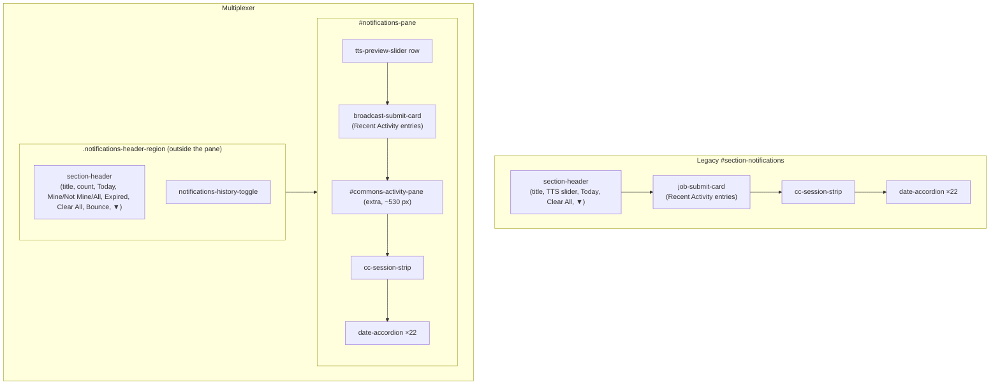

# Multiplexer vs legacy notifications client — layout and containment disparities (Phase 1)

**Row**: `645a7da5` (Rick, P0). **Author**: María 🌸. **Measured**: 2026-09-15, ~11:20–11:30 EDT, against `:7999` at `affd98fe`.
**Lead**: the legacy client (`/app/notifications?classic=1`). **Follower**: the multiplexer (`/app/multiplexer`).

> **Scope of this document — Phase 1 only.** It records **layout, containment, sub-accordion nesting and toolbar** disparities, top to bottom. It does **not** propose fixes, and it does **not** catalogue runtime behaviour (what a toggle does when clicked). That is Phase 2, one accordion at a time, per the ticket. Nothing here is a plan.

---

## 1. Method

Both pages were loaded in the operator's own logged-in Chrome, in two tabs, against the same server and the same data, a few minutes apart. Nothing was clicked, so no persisted UI state was changed. Four read-only DOM probes ran **identically** on both pages (source in the appendix):

| Probe | What it records |
|---|---|
| **P1 outline** | Every section-level container in document order: id, class, header label, collapsed and hidden state, and every toolbar with its visible controls |
| **P2 headers** | Every `.section-header` outside the nested accordions: which section contains it, its title, and its visible controls in order |
| **P3 toolbar** | Every top-toolbar button: glyph, on/off state, tooltip |
| **P4 containment** | Per section, every toggle (anything `aria-expanded`, `*accordion-btn`, `*accordion-header`, `*toggle`, `*chevron`), with the chain of toggle-owning groups above it and a count |
| **P5 geometry** | Page top, left and width of every section, to confirm the **visual** order equals source order |

Numbers were normalised to `#` so data that changed between the two loads does not read as a layout difference.

### Limits — read these before trusting a "no difference"

1. **As-loaded state only.** A collapsed section renders few or no children. Legacy *Finished Tasks* loaded collapsed, so its inner containment was **not probed**. Whatever is inside it is unmeasured on the legacy side.
2. **Legacy hidden sections were not probed inside.** Six legacy sections are toggled off in the toolbar (§3). Their internals are unmeasured.
3. **Counts inside lists are data, not layout.** Where two counts differ (e.g. progress groups 13 vs 10) the difference is flagged, but it may be data movement between loads. It is not asserted as a disparity.
4. **The probes read classes and DOM order, not pixels.** P5 confirms the order of sections visually. Alignment, spacing, typography and colour were **not** measured. That is a screenshot comparison, not done here.

---

## 2. Page chrome, above the first section

| # | Element | Legacy (lead) | Multiplexer | Disparity |
|---|---|---|---|---|
| C1 | Nav bar | `Lupin · Home · Notifications · Profile · Logout` | same | — |
| C2 | Page heading | `H2 "[DEVELOPMENT]: Notifications"`, after the toolbar | `H1 "Multiplexer"`, after the toolbar; the `[DEVELOPMENT]:` prefix moved into the Notifications section title | **Heading level, text, and where the environment prefix lives** |
| C3 | Layout toggle `⇆` | **Inside** the section toolbar, first button | In its **own** `reading-pane-toolbar`, above the section toolbar | **Containment** of the layout toggle |
| C4 | Layout toggle tooltip | "Switch back to vertical layout" | "Switch to horizontal layout (Reading Pane on right)" | Wording. P5 shows both pages render the **same** 960 px column at the same offset, so the tooltip wording differs, not the mode |

## 3. The section toolbar

Order read left to right. `ON` means the section is shown.

| Pos | Legacy (19) | Multiplexer (11, plus `⇆` separately) |
|---|---|---|
| 1 | `⇆` layout | `⊟` **Collapse all accordions** |
| 2 | `❓` Q A Interface — ON | `⊞` **Expand all accordions** |
| 3 | `📝` Submit Agentic Jobs — off | `💬` Notifications — ON |
| 4 | `⚠️` Action Required — ON | `📝` **Jobs** — ON |
| 5 | `🔊` TTS Queue — ON | `📡` **Recent Activity** — ON |
| 6 | `💬` Notifications — ON | `🔊` **TTS Audio** — ON |
| 7 | `🛰️` Fleet Status — ON | `🛰️` Fleet Status — ON |
| 8 | `🗒️` Task List — ON | `✅` **Finished Tasks** — ON |
| 9 | `🗂️` Epic Board — ON | `🗒️` Task List — ON |
| 10 | `🗃️` Holding Area — ON | `🗃️` Holding Area — ON |
| 11 | `⊟` Collapse all **task owners** | `🗂️` Epic Board — ON |
| 12 | `⊞` Expand all **task owners** | |
| 13 | `⚙️` Filter Settings (Admin) — off | |
| 14 | `📋` Job Queues — off | |
| 15 | `⏱️` Time Saved — off | |
| 16 | `📊` System Status — off | |
| 17 | `🔧` Direct TTS Test — off | |
| 18 | `🐛` Debug Info — off | |
| 19 | `🔄` Bounce the dev server | |

| # | Disparity |
|---|---|
| T1 | **Missing from the multiplexer toolbar**: `❓` Q A, `⚠️` Action Required, `⚙️` Filter Settings, `📋` Job Queues, `⏱️` Time Saved, `📊` System Status, `🔧` Direct TTS, `🐛` Debug, `🔄` Bounce. (Bounce exists in the multiplexer, but in the Notifications **header**, see H3.) |
| T2 | **Extra in the multiplexer toolbar**: `📡` Recent Activity, `✅` Finished Tasks. Legacy has no toolbar toggle for either. |
| T3 | **Same glyph, different meaning**: `📝` is "Submit Agentic Jobs" (off) in legacy and "Jobs" (on) in the multiplexer. `🔊` is "TTS Queue" vs "TTS Audio". |
| T4 | **`⊟`/`⊞` scope and position**: legacy "task owners" only, placed after the section toggles; multiplexer "all accordions", placed first. |
| T5 | **Order of the section toggles**: legacy `⚠️ 🔊 💬 🛰️ 🗒️ 🗂️ 🗃️` (Epic **before** Holding); multiplexer `💬 📝 📡 🔊 🛰️ ✅ 🗒️ 🗃️ 🗂️` (Notifications first, Holding **before** Epic). Note that neither toolbar's order matches its own page order in §4. |

## 4. Sections, top to bottom

P5 confirmed the visual order equals DOM order on both pages.

| Legacy order | Legacy section | Multiplexer order | Multiplexer section | Disparity |
|---|---|---|---|---|
| 1 | `#section-qa` "Q A Interface" | — | **absent** | **S1** missing section |
| (hidden) | `#section-job-submit` "📝 Submit Agentic Jobs" | — | absent | S2 (hidden in legacy; see T3) |
| 2 | `#action-required-section` (`.collapsible-section`) | 1 | `#action-required-section` (plain `div`, not `.collapsible-section`) | **S3** container type differs |
| 3 | `#tts-queue-section` "🔊 Playing: #" | 2 | `#tts-pane` "🔊 Playing #" | S4 title punctuation |
| 4 | `#section-notifications` "Claude Code Notifications: #" | 3 | `.notifications-header-region` **+** `#notifications-pane` | **S5** header split from its section (§6) |
| 5 | `#section-fleet-status` "🛰️ Fleet Status: # updated #:#:# EDT" | 4 | `#fleet-status-pane` "🛰️ Fleet Status #" | S6 title drops "updated …" |
| 6 | `#section-finished-tasks` "✅ Finished Tasks · # #:#:# AM" — **collapsed** | 5 | `#finished-tasks-pane` "✅ Finished Tasks #" — **expanded** | **S7** default disclosure state |
| 7 | `#section-task-list` "📋 Task List · Live: # updated #:#:# EDT" | 6 | `#task-list-pane` "📋 Task List #" | S8 title drops "Live · updated …" |
| 8 | `#section-holding-area` "🗂️ Holding Area · # · Gate: # created / # closed over #d" | 7 | `#holding-area-pane` "🛑 Holding Area #" | **S9** icon `🗂️`→`🛑`; gate figures absent |
| 9 | `#section-epic-board` "🗂️ Epic Board: # updated #:#:# EDT" | 8 | `#epic-board-pane` "🗺️ Epic Board #" | **S10** icon `🗂️`→`🗺️`; "updated …" absent |
| (hidden) | `#filter-settings-section` "⚙️ Queue Filter Settings" | — | absent | S11 |
| (hidden) | `#section-queues` "Cosa Jobs Flow: Current States" (5 containers: todo, run, done, dead, history) | 9 | `#jobs-pane` "📝 Jobs #" — **shown**, last on page | **S12** visible and titled differently; see N7 |
| (hidden) | `#section-time-saved` "⏱️ Time Saved Dashboard" | — | absent | S13 |
| (hidden) | `#section-status` "System Status" | — | absent | S14 |
| (hidden) | `#section-direct-tts` "🔧 Direct TTS Test (Bypass Q A)" | — | absent | S15 |
| (hidden) | `#section-debug` "Debug Information" | — | absent | S16 |

Note on legacy icons: the Holding Area **header** uses `🗂️` while its **toolbar** button uses `🗃️`, and `🗂️` is also the Epic Board. The lead is internally inconsistent here. Recorded, not resolved: that is a ruling for Rick.

## 5. Section header controls, left to right

`▼` expanded, `▶` collapsed.

| # | Section | Legacy | Multiplexer | Disparity |
|---|---|---|---|---|
| H1 | Q A | `▼` | — | section absent |
| H2 | TTS | `⏸️` `▶️` `▼` | `▼` | **Pause and play missing** |
| H3 | Notifications | slider "TTS preview percentage" · `Today ▼` · `🗑️ Clear All` · `▼` | count `#` · `Today ▼` · `👤 Mine` · `🚫 Not Mine` · `👥 All Users` · `Expired ▾` · `🗑️ Clear All` · `🔄 Bounce server` · `▼` | **Slider not in the header** (it is a separate row below, §6) · **extra**: count, Mine / Not Mine / All Users, Expired, Bounce |
| H4 | Fleet Status | `⟳` `▼` | `⟳` `▼` | — |
| H5 | Finished Tasks | `⟳` `▶` | `⟳` `▼` | default state (S7) |
| H6 | Task List | `⟳` `▼` | lookup box "Find a ticket by its id" · `🔎` · `＋ New` · `⟳` · `⊟` · `⊞` · `▼` | **extra**: lookup, search, New, per-section collapse/expand |
| H7 | Holding Area | `⟳` `▼` | `⟳` `▼` | — |
| H8 | Epic Board | `⊟` `⊞` `⟳` `▼` | `⟳` `▼` | **Per-section `⊟`/`⊞` missing** |
| H9 | Jobs / Cosa Jobs Flow | (hidden in legacy, not probed) | `👤 Mine` · `🚫 Not Mine` · `👥 All Users` · `▼` | unmeasured on the lead side |

Pattern worth Rick's eye: the per-section `⊟`/`⊞` pair sits on **Epic Board** in legacy and on **Task List** in the multiplexer. It moved sections.

## 6. Containment — where things live

### 6.1 Notifications: the largest containment disparity

Legacy keeps the header, the slider, the Recent Activity card, the session strip and the date accordions **inside one section**. The multiplexer splits the header into a separate region and adds a standalone Recent Activity pane.



Vertical offsets inside the block, measured from the top of the header (P5):

| Legacy | px | Multiplexer | px |
|---|---|---|---|
| `section-header` (slider inside it at +22) | 2 | `section-header` | 0 |
| — | | `tts-preview-slider` row | 43 |
| `job-submit-card` | 85 | `#broadcast-submit-card` | 107 |
| — | | `#commons-activity-pane` | 263 |
| `cc-session-strip` | 147 | `#cc-session-strip` | 795 |
| first `date-accordion` | 340 | first `date-accordion` | 953 |

| # | Disparity |
|---|---|
| N1 | **Header outside its section**: the multiplexer's Notifications header sits in `.notifications-header-region`, a sibling **before** `#notifications-pane`. In legacy it is the first child of `#section-notifications`. |
| N2 | **Slider moved out of the header** into its own row. |
| N3 | **Extra standalone `#commons-activity-pane`** between the Recent Activity card and the session strip. It pushes the strip ~650 px further down. Legacy has no equivalent block. |
| N4 | **History toggle**: the multiplexer header carries a `notifications-history-toggle`; legacy shows none. |
| N5 | **Recent Activity card toggles**: legacy card has **two** toggles (one in the card header, one on the card itself); the multiplexer card has **one** (header only). |

### 6.2 Nested accordions — the containment chains

Read `A ⟶ B > toggle` as: toggle sits in group B, which is nested inside group A.

| Section | Chain | Legacy | Multiplexer | Disparity |
|---|---|---|---|---|
| Notifications | `section-header > toggle-button` | 1 | 1 (in the separate region) | N1 |
| | `job-submit-card ⟶ card-header > toggle-button` | 1 | 1 | — |
| | `job-submit-card > toggle-button` | 1 | **0** | N5 |
| | `job-submit-card > commons-activity-entry-body-toggle` | 27 | 29 | count only (data) |
| | `cc-session-strip > cc-strip-toggle` | 2 | 2 | — |
| | `sender-card-header > sender-toggle` | 15 | 15 | — |
| | `date-accordion > date-accordion-header` / `date-toggle` | 22 / 22 | 22 / 22 | — |
| | `date-accordion ⟶ progress-group-head > progress-group-toggle` | 13 | 10 | count only, unverified (data or disclosure); legacy head also carries `progress-group-updated` |
| Task List | `task-group > task-group-header` → `task-group-chevron` | 3 → 3 | 3 → 3 | — |
| | `task-group ⟶ task-row.task-status-* > task-disclose-button` | 12 | 12 | — |
| Holding Area | `task-row.task-status-not-approved > task-disclose-button` | 25 | 25 | — |
| Epic Board | `section-header > epic-accordion-btn` | **2** | **0** | H8 |
| | `epic-group > epic-group-header` → `epic-group-chevron` | 4 → 4 | 4 → 4 | — |
| | `epic-group ⟶ <row> > task-disclose-button` | 12, row class **`epic-row.task-status-*`** | 12, row class **`task-row.epic-row`**, **no status class** | **N6** epic rows lose their status class |
| | drift group `epic-group-drift ⟶ header > chevron` | 1 | 1 | — |
| Jobs | legacy `#section-queues`: 5 `queue-jobs-container` (todo, run, done, dead, history), no header toggles found (hidden, not probed) | — | 5 `jobs-bucket` (todo, running, done, dead, history), each `jobs-bucket-header > jobs-bucket-toggle` | **N7** bucket naming (`run`→`running`) and structure; lead side unmeasured |
| Fleet Status, Finished Tasks, Action Required, TTS | only the section toggle found | 1 each | 1 each | legacy Finished was collapsed (limit 1) |

---

## 7. Register — every disparity in one list

| ID | Area | One-line disparity |
|---|---|---|
| C2 | Chrome | Heading H2 "[DEVELOPMENT]: Notifications" vs H1 "Multiplexer"; env prefix moved into the Notifications title |
| C3 | Chrome | Layout toggle lives in its own toolbar instead of first in the section toolbar |
| C4 | Chrome | Layout toggle tooltip wording |
| T1 | Toolbar | 9 legacy buttons missing (Q A, Action Required, Filter, Job Queues, Time Saved, Status, Direct TTS, Debug, Bounce) |
| T2 | Toolbar | 2 extra buttons (Recent Activity, Finished Tasks) |
| T3 | Toolbar | Same glyph, different section (`📝`, `🔊` label) |
| T4 | Toolbar | `⊟`/`⊞` scope (task owners → all accordions) and position (after → first) |
| T5 | Toolbar | Toggle order differs; Holding/Epic swapped |
| S1 | Sections | Q A Interface section absent |
| S2 | Sections | Submit Agentic Jobs section absent (hidden in legacy) |
| S3 | Sections | Action Required is a plain div, not a collapsible section |
| S4 | Sections | TTS title "Playing: #" vs "Playing #" |
| S5 | Sections | Notifications header split into a separate region |
| S6, S8 | Sections | Fleet and Task List titles drop their "updated …" / "Live" status text |
| S7 | Sections | Finished Tasks default expanded instead of collapsed |
| S9 | Sections | Holding Area icon `🛑`, gate figures absent |
| S10 | Sections | Epic Board icon `🗺️`, "updated …" absent |
| S11, S13–S16 | Sections | Filter Settings, Time Saved, System Status, Direct TTS, Debug sections absent |
| S12 | Sections | Jobs shown by default and last; legacy "Cosa Jobs Flow" hidden by default |
| H2 | Headers | TTS pause and play buttons missing |
| H3 | Headers | Notifications header: slider moved out; count, Mine/Not Mine/All Users, Expired, Bounce added |
| H6 | Headers | Task List header adds lookup, search, New, `⊟`/`⊞` |
| H8 | Headers | Epic Board header lacks `⊟`/`⊞` |
| N1–N5 | Containment | Notifications block: header outside, slider row, extra commons pane, history toggle, one fewer card toggle |
| N6 | Containment | Epic rows lose `task-status-*` class |
| N7 | Containment | Jobs buckets vs queue containers (naming, toggles); lead unmeasured |

**Count**: 35 IDs — chrome 3 (C2–C4), toolbar 5 (T1–T5), sections 16 (S1–S16), headers 4 (H2, H3, H6, H8), containment 7 (N1–N7). T1 alone bundles 9 missing buttons. Four areas are explicitly unmeasured (§1 limits).

## 8. Questions for Rick before Phase 2

The ticket says the legacy client is the lead and the multiplexer follows it slavishly. These items don't have an obvious "follow the lead" answer, so they need a ruling rather than an inference:

1. **Additions the lead lacks** (T2, H3 extras, H6 extras, N3, N4): remove them from the multiplexer, or add them to the lead too?
2. **Legacy's own icon collision** (§4 note): Holding Area header `🗂️` vs toolbar `🗃️`. Which one is canonical?
3. **Hidden legacy sections** (S11, S13–S16): does "exact layout" mean the multiplexer must carry them as hidden-by-default sections?

## 9. Still owed for Phase 1 completeness

- Probe legacy **Finished Tasks** and the six hidden legacy sections **expanded**. That needs toggling them, which changes the operator's persisted UI state, so it waits for an agreed probe method (a throwaway browser profile, or restoring state afterwards).
- A **pixel-level** comparison (screenshots at matched scroll positions) for spacing, alignment and typography. Not done here.

---

## Appendix — probe source (P2 and P4, as run)

Pasted into each tab's console. P1, P3 and P5 are short variants of the same selectors.

```js
// P2 — section headers
window.__headers = function(){
  const clean = s => (s||'').replace(/\s+/g,' ').replace(/\d+/g,'#').trim().slice(0,40);
  const vis = e => { const r=e.getBoundingClientRect(); const cs=getComputedStyle(e);
    return !(e.hidden || cs.display==='none' || cs.visibility==='hidden' || (r.width===0&&r.height===0)); };
  const secOf = h => { const s = h.closest('.collapsible-section, section[id]'); return s ? (s.id||s.className) : 'NONE'; };
  return [...document.querySelectorAll('.section-header')].filter(h=>!h.closest('.date-accordion,.epic-group')).map(h=>{
    const title = h.querySelector('h2,h3,.section-title,[class*=title]');
    const ctrls=[...h.querySelectorAll('button,input,select,a,[role=button]')].filter(vis)
      .map(b=>clean(b.textContent||b.title||b.getAttribute('aria-label')||b.placeholder||b.value));
    return 'in:'+secOf(h)+(vis(h)?'':' HIDDEN')+' | "'+clean(title?title.textContent:'')+'" | '+ctrls.join(' ‖ ');
  });
};

// P4 — containment chains
window.__nest = function(secSel){
  const TOG = '[aria-expanded], [class*=accordion-btn], [class*=accordion-header], [class*=toggle]:not(input), [class*=collapse-btn], [class*=expand-btn], [class*=caret], [class*=chevron]';
  const GRP = '[class*=group], .date-accordion, [class*=accordion]:not(button):not([class*=header]):not([class*=btn]), [class*=card], [class*=-row], li, tr, .section-header';
  const res={};
  for(const s of document.querySelectorAll(secSel)){
    const toggles=[...s.querySelectorAll(TOG)].filter(t=>!t.closest('.section-toolbar'));
    const grpOf=t=> (t.parentElement && t.parentElement.closest(GRP)) || t.parentElement;
    const groups=new Set(toggles.map(grpOf));
    const kind=e=> (typeof e.className==='string' && e.className ? e.className.split(' ')
      .filter(c=>!/^(active|collapsed|expanded|open|hidden|is-)/.test(c)).slice(0,2).join('.') : e.tagName.toLowerCase());
    const counts={};
    for(const t of toggles){ const chain=[]; let a=grpOf(t).parentElement;
      while(a && a!==s){ if(groups.has(a)) chain.unshift(kind(a)); a=a.parentElement; }
      const k=chain.concat([kind(grpOf(t))+' > '+kind(t)]).join(' ⟶ '); counts[k]=(counts[k]||0)+1; }
    res[s.id||kind(s)]=counts;
  }
  return res;
};
// legacy:      __nest('.collapsible-section:not(.section-hidden)')
// multiplexer: __nest('#action-required-section, #tts-pane, .notifications-header-region, #notifications-pane, #fleet-status-pane, #finished-tasks-pane, #task-list-pane, #holding-area-pane, #epic-board-pane, #jobs-pane')
```
