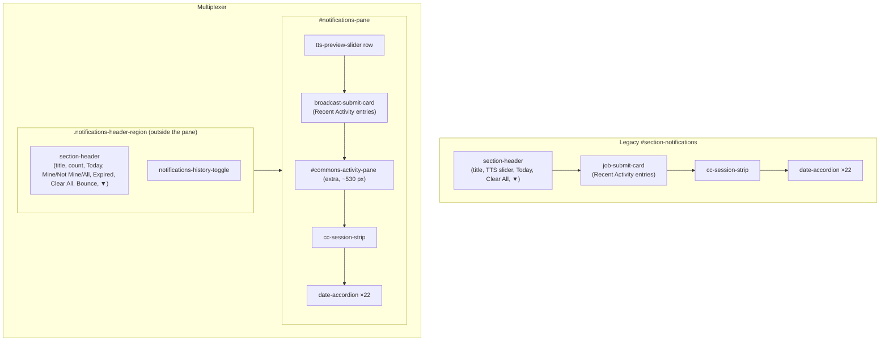

# Multiplexer vs legacy notifications client — layout and containment disparities (Phase 1)

**Row**: `645a7da5` (Rick, P0). **Author**: María 🌸. **Measured**: 2026-09-15, ~11:20–11:30 EDT, against `:7999` at `affd98fe`.
**Lead**: the legacy client (`/app/notifications?classic=1`). **Follower**: the multiplexer (`/app/multiplexer`).

> **Scope of this document — Phase 1 only.** It records **layout, containment, sub-accordion nesting and toolbar** disparities, top to bottom. It does **not** propose fixes, and it does **not** catalogue runtime behaviour (what a toggle does when clicked). That is Phase 2, one accordion at a time, per the ticket. Nothing here is a plan.

---

## 1. Method

Both pages were loaded in the operator's own logged-in Chrome, in two tabs, against the same server and the same data, a few minutes apart. Nothing was clicked, so no persisted UI state was changed. Four read-only DOM probes ran **identically** on both pages (source in the appendix):

| Probe | What it records |
|---|---|
| **P1 outline** | Every section-level container in document order: id, class, header label, collapsed and hidden state, and every toolbar with its visible controls |
| **P2 headers** | Every `.section-header` outside the nested accordions: which section contains it, its title, and its visible controls in order |
| **P3 toolbar** | Every top-toolbar button: glyph, on/off state, tooltip |
| **P4 containment** | Per section, every toggle (anything `aria-expanded`, `*accordion-btn`, `*accordion-header`, `*toggle`, `*chevron`), with the chain of toggle-owning groups above it and a count |
| **P5 geometry** | Page top, left and width of every section, to confirm the **visual** order equals source order |

Numbers were normalised to `#` so data that changed between the two loads does not read as a layout difference.

### Limits — read these before trusting a "no difference"

1. **As-loaded state only.** A collapsed section renders few or no children. Legacy *Finished Tasks* loaded collapsed, so its inner containment was **not probed**. Whatever is inside it is unmeasured on the legacy side.
2. **Legacy hidden sections — probed in a second pass (§6.3).** They were revealed by removing the `section-hidden` and `collapsed` classes **in the page only**, never through their toolbar buttons, so no persisted UI state changed. Legacy *Finished Tasks* rendered only its controls and an empty container even when revealed, so its inner containment is still unmeasured on both sides.
3. **Counts inside lists are data, not layout.** Where two counts differ (e.g. progress groups 13 vs 10) the difference is flagged, but it may be data movement between loads. It is not asserted as a disparity.
4. **The probes read classes and DOM order, not pixels.** P5 confirms the order of sections visually. Alignment, spacing, typography and colour were **not** measured. That is a screenshot comparison, not done here.

---

## 2. Page chrome, above the first section

| # | Element | Legacy (lead) | Multiplexer | Disparity |
|---|---|---|---|---|
| C1 | Nav bar | `Lupin · Home · Notifications · Profile · Logout` | same | — |
| C2 | Page heading | `H2 "[DEVELOPMENT]: Notifications"`, after the toolbar | `H1 "Multiplexer"`, after the toolbar; the `[DEVELOPMENT]:` prefix moved into the Notifications section title | **Heading level, text, and where the environment prefix lives** |
| C3 | Layout toggle `⇆` | **Inside** the section toolbar, first button | In its **own** `reading-pane-toolbar`, above the section toolbar | **Containment** of the layout toggle |
| C4 | Layout toggle tooltip | "Switch back to vertical layout" | "Switch to horizontal layout (Reading Pane on right)" | Wording. P5 shows both pages render the **same** 960 px column at the same offset, so the tooltip wording differs, not the mode |

## 3. The section toolbar

Order read left to right. `ON` means the section is shown.

| Pos | Legacy (19) | Multiplexer (11, plus `⇆` separately) |
|---|---|---|
| 1 | `⇆` layout | `⊟` **Collapse all accordions** |
| 2 | `❓` Q A Interface — ON | `⊞` **Expand all accordions** |
| 3 | `📝` Submit Agentic Jobs — off | `💬` Notifications — ON |
| 4 | `⚠️` Action Required — ON | `📝` **Jobs** — ON |
| 5 | `🔊` TTS Queue — ON | `📡` **Recent Activity** — ON |
| 6 | `💬` Notifications — ON | `🔊` **TTS Audio** — ON |
| 7 | `🛰️` Fleet Status — ON | `🛰️` Fleet Status — ON |
| 8 | `🗒️` Task List — ON | `✅` **Finished Tasks** — ON |
| 9 | `🗂️` Epic Board — ON | `🗒️` Task List — ON |
| 10 | `🗃️` Holding Area — ON | `🗃️` Holding Area — ON |
| 11 | `⊟` Collapse all **task owners** | `🗂️` Epic Board — ON |
| 12 | `⊞` Expand all **task owners** | |
| 13 | `⚙️` Filter Settings (Admin) — off | |
| 14 | `📋` Job Queues — off | |
| 15 | `⏱️` Time Saved — off | |
| 16 | `📊` System Status — off | |
| 17 | `🔧` Direct TTS Test — off | |
| 18 | `🐛` Debug Info — off | |
| 19 | `🔄` Bounce the dev server | |

| # | Disparity |
|---|---|
| T1 | **Missing from the multiplexer toolbar**: `❓` Q A, `⚠️` Action Required, `⚙️` Filter Settings, `📋` Job Queues, `⏱️` Time Saved, `📊` System Status, `🔧` Direct TTS, `🐛` Debug, `🔄` Bounce. (Bounce exists in the multiplexer, but in the Notifications **header**, see H3.) |
| T2 | **Extra in the multiplexer toolbar**: `📡` Recent Activity, `✅` Finished Tasks. Legacy has no toolbar toggle for either. |
| T3 | **Same glyph, different meaning**: `📝` is "Submit Agentic Jobs" (off) in legacy and "Jobs" (on) in the multiplexer. `🔊` is "TTS Queue" vs "TTS Audio". |
| T4 | **`⊟`/`⊞` scope and position**: legacy "task owners" only, placed after the section toggles; multiplexer "all accordions", placed first. |
| T5 | **Order of the section toggles**: legacy `⚠️ 🔊 💬 🛰️ 🗒️ 🗂️ 🗃️` (Epic **before** Holding); multiplexer `💬 📝 📡 🔊 🛰️ ✅ 🗒️ 🗃️ 🗂️` (Notifications first, Holding **before** Epic). Note that neither toolbar's order matches its own page order in §4. |

## 4. Sections, top to bottom

P5 confirmed the visual order equals DOM order on both pages.

| Legacy order | Legacy section | Multiplexer order | Multiplexer section | Disparity |
|---|---|---|---|---|
| 1 | `#section-qa` "Q A Interface" | — | **absent** | **S1** missing section |
| (hidden) | `#section-job-submit` "📝 Submit Agentic Jobs" | — | absent | S2 (hidden in legacy; see T3) |
| 2 | `#action-required-section` (`.collapsible-section`) | 1 | `#action-required-section` (plain `div`, not `.collapsible-section`) | **S3** container type differs |
| 3 | `#tts-queue-section` "🔊 Playing: #" | 2 | `#tts-pane` "🔊 Playing #" | S4 title punctuation |
| 4 | `#section-notifications` "Claude Code Notifications: #" | 3 | `.notifications-header-region` **+** `#notifications-pane` | **S5** header split from its section (§6) |
| 5 | `#section-fleet-status` "🛰️ Fleet Status: # updated #:#:# EDT" | 4 | `#fleet-status-pane` "🛰️ Fleet Status #" | S6 title drops "updated …" |
| 6 | `#section-finished-tasks` "✅ Finished Tasks · # #:#:# AM" — **collapsed** | 5 | `#finished-tasks-pane` "✅ Finished Tasks #" — **expanded** | **S7** default disclosure state |
| 7 | `#section-task-list` "📋 Task List · Live: # updated #:#:# EDT" | 6 | `#task-list-pane` "📋 Task List #" | S8 title drops "Live · updated …" |
| 8 | `#section-holding-area` "🗂️ Holding Area · # · Gate: # created / # closed over #d" | 7 | `#holding-area-pane` "🛑 Holding Area #" | **S9** icon `🗂️`→`🛑`; gate figures absent |
| 9 | `#section-epic-board` "🗂️ Epic Board: # updated #:#:# EDT" | 8 | `#epic-board-pane` "🗺️ Epic Board #" | **S10** icon `🗂️`→`🗺️`; "updated …" absent |
| (hidden) | `#filter-settings-section` "⚙️ Queue Filter Settings" | — | absent | S11 |
| (hidden) | `#section-queues` "Cosa Jobs Flow: Current States" (5 containers: todo, run, done, dead, history) | 9 | `#jobs-pane` "📝 Jobs #" — **shown**, last on page | **S12** visible and titled differently; see N7 |
| (hidden) | `#section-time-saved` "⏱️ Time Saved Dashboard" | — | absent | S13 |
| (hidden) | `#section-status` "System Status" | — | absent | S14 |
| (hidden) | `#section-direct-tts` "🔧 Direct TTS Test (Bypass Q A)" | — | absent | S15 |
| (hidden) | `#section-debug` "Debug Information" | — | absent | S16 |

Note on legacy icons: the Holding Area **header** uses `🗂️` while its **toolbar** button uses `🗃️`, and `🗂️` is also the Epic Board. The lead is internally inconsistent here. Recorded, not resolved: that is a ruling for Rick.

## 5. Section header controls, left to right

`▼` expanded, `▶` collapsed.

| # | Section | Legacy | Multiplexer | Disparity |
|---|---|---|---|---|
| H1 | Q A | `▼` | — | section absent |
| H2 | TTS | `⏸️` `▶️` `▼` | `▼` | **Pause and play missing** |
| H3 | Notifications | slider "TTS preview percentage" · `Today ▼` · `🗑️ Clear All` · `▼` | count `#` · `Today ▼` · `👤 Mine` · `🚫 Not Mine` · `👥 All Users` · `Expired ▾` · `🗑️ Clear All` · `🔄 Bounce server` · `▼` | **Slider not in the header** (it is a separate row below, §6) · **extra**: count, Mine / Not Mine / All Users, Expired, Bounce |
| H4 | Fleet Status | `⟳` `▼` | `⟳` `▼` | — |
| H5 | Finished Tasks | `⟳` `▶` | `⟳` `▼` | default state (S7) |
| H6 | Task List | `⟳` `▼` | lookup box "Find a ticket by its id" · `🔎` · `＋ New` · `⟳` · `⊟` · `⊞` · `▼` | **extra**: lookup, search, New, per-section collapse/expand |
| H7 | Holding Area | `⟳` `▼` | `⟳` `▼` | — |
| H8 | Epic Board | `⊟` `⊞` `⟳` `▼` | `⟳` `▼` | **Per-section `⊟`/`⊞` missing** |
| H9 | Jobs / Cosa Jobs Flow | (hidden in legacy, not probed) | `👤 Mine` · `🚫 Not Mine` · `👥 All Users` · `▼` | unmeasured on the lead side |

Pattern worth Rick's eye: the per-section `⊟`/`⊞` pair sits on **Epic Board** in legacy and on **Task List** in the multiplexer. It moved sections.

## 6. Containment — where things live

### 6.1 Notifications: the largest containment disparity

Legacy keeps the header, the slider, the Recent Activity card, the session strip and the date accordions **inside one section**. The multiplexer splits the header into a separate region and adds a standalone Recent Activity pane.



Vertical offsets inside the block, measured from the top of the header (P5):

| Legacy | px | Multiplexer | px |
|---|---|---|---|
| `section-header` (slider inside it at +22) | 2 | `section-header` | 0 |
| — | | `tts-preview-slider` row | 43 |
| `job-submit-card` | 85 | `#broadcast-submit-card` | 107 |
| — | | `#commons-activity-pane` | 263 |
| `cc-session-strip` | 147 | `#cc-session-strip` | 795 |
| first `date-accordion` | 340 | first `date-accordion` | 953 |

| # | Disparity |
|---|---|
| N1 | **Header outside its section**: the multiplexer's Notifications header sits in `.notifications-header-region`, a sibling **before** `#notifications-pane`. In legacy it is the first child of `#section-notifications`. |
| N2 | **Slider moved out of the header** into its own row. |
| N3 | **Extra standalone `#commons-activity-pane`** between the Recent Activity card and the session strip. It pushes the strip ~650 px further down. Legacy has no equivalent block. |
| N4 | **History toggle**: the multiplexer header carries a `notifications-history-toggle`; legacy shows none. |
| N5 | **Recent Activity card toggles**: legacy card has **two** toggles (one in the card header, one on the card itself); the multiplexer card has **one** (header only). |

### 6.2 Nested accordions — the containment chains

Read `A ⟶ B > toggle` as: toggle sits in group B, which is nested inside group A.

| Section | Chain | Legacy | Multiplexer | Disparity |
|---|---|---|---|---|
| Notifications | `section-header > toggle-button` | 1 | 1 (in the separate region) | N1 |
| | `job-submit-card ⟶ card-header > toggle-button` | 1 | 1 | — |
| | `job-submit-card > toggle-button` | 1 | **0** | N5 |
| | `job-submit-card > commons-activity-entry-body-toggle` | 27 | 29 | count only (data) |
| | `cc-session-strip > cc-strip-toggle` | 2 | 2 | — |
| | `sender-card-header > sender-toggle` | 15 | 15 | — |
| | `date-accordion > date-accordion-header` / `date-toggle` | 22 / 22 | 22 / 22 | — |
| | `date-accordion ⟶ progress-group-head > progress-group-toggle` | 13 | 10 | count only, unverified (data or disclosure); legacy head also carries `progress-group-updated` |
| Task List | `task-group > task-group-header` → `task-group-chevron` | 3 → 3 | 3 → 3 | — |
| | `task-group ⟶ task-row.task-status-* > task-disclose-button` | 12 | 12 | — |
| Holding Area | `task-row.task-status-not-approved > task-disclose-button` | 25 | 25 | — |
| Epic Board | `section-header > epic-accordion-btn` | **2** | **0** | H8 |
| | `epic-group > epic-group-header` → `epic-group-chevron` | 4 → 4 | 4 → 4 | — |
| | `epic-group ⟶ <row> > task-disclose-button` | 12, row class **`epic-row.task-status-*`** | 12, row class **`task-row.epic-row`**, **no status class** | **N6** epic rows lose their status class |
| | drift group `epic-group-drift ⟶ header > chevron` | 1 | 1 | — |
| Jobs | legacy `#section-queues`: 5 `queue-category` (the last is `history-section`), each `queue-header > queue-expand-btn` | 5 | 5 `jobs-bucket` (todo, running, done, dead, history), each `jobs-bucket-header > jobs-bucket-toggle` | **N7** same depth and count; different classes; legacy container id `run` vs multiplexer `running`; the multiplexer header adds Mine / Not Mine / All Users (legacy header: `▼` only) |
| Fleet Status, Finished Tasks, Action Required, TTS | only the section toggle found | 1 each | 1 each | legacy Finished was collapsed (limit 1) |

---

### 6.3 Legacy sections hidden or collapsed at load (second pass, ~11:40 EDT)

> 🔴 **CORRECTED 2026-09-15 ~16:55 EDT (Phase 2).** "Hidden at load" was **the operator's saved toolbar choices**, not a code default. Every legacy toolbar button starts `active` (`notifications.html:43-75`), and legacy hides a section only on a toolbar click (`notifications.js:15340`) or when replaying saved state (`:15414`). Every "(hidden)" in §4, §6.3 and §8 should be read as "hidden in the operator's browser". Details are in the [Phase 2 doc](2026.09.15-multiplexer-vs-legacy-runtime-disparities.md) §4.
>
> 🔴 **AND THE CORRECTION ITSELF WAS TOO STRONG — re-corrected 2026-09-15 ~19:25 EDT.** This banner used to end *"On a fresh browser all of these sections are visible."* Two of them are not: `#tts-queue-section` (`notifications.html:434`) and `#filter-settings-section` (`:1112`) ship `style="display: none;"` in the markup, each behind a toolbar button that nonetheless reads `active`. The other five were measured one by one and are visible: `#section-time-saved` (`:1266`), `#section-status` (`:1299`), `#section-direct-tts` (`:1366`), `#section-debug` (`:1383`), `#section-queues` (`:1141`). **The lesson is the one this register keeps re-learning**: a probe run in the operator's browser reads his state, and a markup-wide claim needs a markup-wide grep — `display:\s*none` per section id, not an inference from the toolbar. That measurement is what reopened the `jobs-pane` ruling (row `645a7da5`, R1).

Revealed in the page only (limit 2). Header controls, first-level children, toggle chains:

| Legacy section | Header controls | First-level children | Toggle chains | Multiplexer counterpart |
|---|---|---|---|---|
| `#section-job-submit` 📝 Submit Agentic Jobs | `▼` | 4 `job-submit-card` | 3× `job-submit-card-header > toggle-button` | none as a section; one `broadcast-submit-card` inside the Notifications pane |
| `#section-finished-tasks` ✅ Finished Tasks | `⟳` `▶` | `finished-tasks-controls`, an empty `div` | section toggle only | `#finished-tasks-pane`: section toggle only (inner rows unmeasured on both sides) |
| `#filter-settings-section` ⚙️ Queue Filter Settings | `▼` | `filter-controls` | section toggle only | absent (S11) |
| `#section-queues` Cosa Jobs Flow | `▼` | 5 `queue-category` | 5× `queue-header > queue-expand-btn` | `#jobs-pane` (N7) |
| `#section-time-saved` ⏱️ Time Saved | `🔄` `▼` | `stats-grid`, `top-solutions` | section toggle only | absent (S13) |
| `#section-status` System Status | `↻` `▼` | 8 `status-item` | section toggle only | absent (S14) |
| `#section-direct-tts` 🔧 Direct TTS Test | `▼` | `audio-controls` | section toggle only | absent (S15) |
| `#section-debug` Debug Information | `▼` | `debug-log-scrollable` | section toggle only | absent (S16) |

### 6.4 Visual pass — screenshots at matched positions (~11:44 EDT)

Both pages at 1920 px wide, screenshotted at the top of the page and at the top of Notifications. These are **visual** disparities the DOM probes cannot see:

| # | Where | Legacy (lead) | Multiplexer | Disparity |
|---|---|---|---|---|
| V1 | Nav bar | "Notifications" shown as the active (blue pill) item | no nav item active | active-page highlight missing |
| V2 | Section toolbar | a single centred floating bar under the nav, **sticky**: it stays over the content when scrolled | two left-aligned boxed strips (`⇆` alone, then the section toggles), **not sticky** | placement, grouping, stickiness |
| V3 | Page title | `[DEVELOPMENT]: Notifications`, left-aligned, inside the content card | `Multiplexer`, centred and larger | alignment and size (see C2) |
| V4 | Action Required and Playing headers | a full-width coloured header band that is the top edge of its own bordered panel | an inset rounded coloured band inside a second outer frame (double framing) | frame nesting |
| V5 | Header counts | `Action Required: 0`, `Playing: 0` | no count shown | counts missing |
| V6 | Playing empty text | "Nothing in the queue" inside the section body | rendered below the green band in a separate white strip | body containment |
| V7 | Notifications header | one row | wraps to two rows: title + `👤Mine` badge, then `TTS:` slider, Today, Mine / Not Mine / All Users, Expired, Clear All, Bounce | row count (see H3, N2) |
| V8 | Broadcast card | collapsed by default (`▶`), directly above the session strip | expanded by default, with the recipient line and message box open | default disclosure state |

⚠️ **The content-area comparison is incomplete.** At ~11:45 the multiplexer failed to authenticate ("no refresh token available") and rendered no sender cards, while legacy in the same browser rendered 21. That is a **runtime defect**, recorded on row `645a7da5` for the build owner, and not a layout disparity. The comparison of cards, date accordions and the task panes resumes once the multiplexer loads again.

## 7. Register — every disparity in one list

| ID | Area | One-line disparity |
|---|---|---|
| C2 | Chrome | Heading H2 "[DEVELOPMENT]: Notifications" vs H1 "Multiplexer"; env prefix moved into the Notifications title |
| C3 | Chrome | Layout toggle lives in its own toolbar instead of first in the section toolbar |
| C4 | Chrome | Layout toggle tooltip wording |
| T1 | Toolbar | 9 legacy buttons missing (Q A, Action Required, Filter, Job Queues, Time Saved, Status, Direct TTS, Debug, Bounce) |
| T2 | Toolbar | 2 extra buttons (Recent Activity, Finished Tasks) |
| T3 | Toolbar | Same glyph, different section (`📝`, `🔊` label) |
| T4 | Toolbar | `⊟`/`⊞` scope (task owners → all accordions) and position (after → first) |
| T5 | Toolbar | Toggle order differs; Holding/Epic swapped |
| S1 | Sections | Q A Interface section absent |
| S2 | Sections | Submit Agentic Jobs section absent (hidden in legacy) |
| S3 | Sections | Action Required is a plain div, not a collapsible section |
| S4 | Sections | TTS title "Playing: #" vs "Playing #" |
| S5 | Sections | Notifications header split into a separate region |
| S6, S8 | Sections | Fleet and Task List titles drop their "updated …" / "Live" status text |
| S7 | Sections | Finished Tasks default expanded instead of collapsed |
| S9 | Sections | Holding Area icon `🛑`, gate figures absent |
| S10 | Sections | Epic Board icon `🗺️`, "updated …" absent |
| S11, S13–S16 | Sections | Filter Settings, Time Saved, System Status, Direct TTS, Debug sections absent |
| S12 | Sections | Jobs shown by default and last; legacy "Cosa Jobs Flow" hidden by default |
| H2 | Headers | TTS pause and play buttons missing |
| H3 | Headers | Notifications header: slider moved out; count, Mine/Not Mine/All Users, Expired, Bounce added |
| H6 | Headers | Task List header adds lookup, search, New, `⊟`/`⊞` |
| H8 | Headers | Epic Board header lacks `⊟`/`⊞` |
| N1–N5 | Containment | Notifications block: header outside, slider row, extra commons pane, history toggle, one fewer card toggle |
| N6 | Containment | Epic rows lose `task-status-*` class |
| N7 | Containment | Jobs buckets vs queue categories: same depth and count, different classes, `run`→`running`, filter buttons added to the header |
| V1–V8 | Visual | Active nav highlight, sticky centred toolbar, title alignment, double-framed headers, missing header counts, Playing body text outside its band, two-row Notifications header, Broadcast card expanded by default (§6.4) |

**Count**: 35 IDs — chrome 3 (C2–C4), toolbar 5 (T1–T5), sections 16 (S1–S16), headers 4 (H2, H3, H6, H8), containment 7 (N1–N7). T1 alone bundles 9 missing buttons. Four areas are explicitly unmeasured (§1 limits).

## 8. Rulings (Rick, 2026-09-15) — six, all answered

The ticket says the legacy client is the lead and the multiplexer follows it slavishly. These items didn't have an obvious "follow the lead" answer, so each went to Rick for a ruling (row `645a7da5` carries his answers verbatim).

| # | Question | Ruling | Effect on the register |
|---|---|---|---|
| 1 | **Additions the lead lacks** (T2, H3 extras, H6 extras, N3, N4): remove them from the multiplexer, or add them to the lead too? | **Keep all of them in the multiplexer. Do not add them to legacy.** *"It's okay to have a superset in the multiplexer just as long as it has all of the functionality that the legacy client does."* (~16:30 EDT) | T2, the H3 extras (count, Mine / Not Mine / All Users, Expired), the H6 extras (lookup, search, New, `⊟`/`⊞`), N3 and N4 are **KEEP, no action** |
| 2 | **Legacy's own icon collision** (§4 note): Holding Area header `🗂️` vs toolbar `🗃️` | **`🗃️`** (~12:55 EDT) | S9: the Holding Area icon becomes `🗃️` on both surfaces |
| 3 | **Hidden legacy sections** (S11, S13–S16): must the multiplexer carry them? | **Carry all five** (~16:30 EDT). ⚠️ The "hidden by default" half of that answer rested on my wrong reading and was **re-ruled the same evening** — see rows 4–6 below | S11, S13–S16 are owed: Filter Settings, Time Saved, System Status, Direct TTS, Debug |
| 4 | **How should the five carried sections START?** | **Follow legacy per section** (evening) | Only Filter Settings starts hidden (`notifications.html:1112`). Time Saved (`:1266`), System Status (`:1299`), Direct TTS (`:1366`) and Debug (`:1383`) start **visible** — measured in markup, not inferred |
| 5 | **Does the multiplexer hide Job Queues by default?** | **No — show it** (evening). A prior ruling said yes, on a premise now measured false | S12: `DEFAULT_HIDDEN_SECTION_IDS` drops `"jobs-pane"`, and its annotation must **name the reversal** rather than keep citing "legacy hides it". ⚠️ **Superseded 2026-09-23** (row `cec9dd43`): the set was deleted outright, because the same question asked of Filter Settings had the same answer — legacy hides nothing by cold default |
| 6 | **Task List verb order**: legacy pairs Un-park with Park | **The shared module's order wins** (evening) | No change to `taskVerbs.ts:66` and no change to the oracle guard. Legacy's pairing is not back-ported |

**The parity rule for Phase 2 and the build**: parity means the multiplexer **contains** everything legacy has: layout, containment and disclosure. Anything the multiplexer has *beyond* legacy is allowed to stay. A disparity is owed work only when legacy has something the multiplexer lacks, or does it differently.

## 9. Still owed for Phase 1 completeness

- ~~Probe the hidden legacy sections expanded~~ — done in §6.3 by in-page class removal. **Still open:** the rows inside Finished Tasks, which neither client rendered in this pass.
- A **pixel-level** comparison (screenshots at matched scroll positions) for spacing, alignment and typography. Not done here.

## 10. The two ambiguous pairs — RULED (Rachel 🕊️, 2026-09-25)

**Ruled by**: Rachel 🕊️, on Mr. Radio's instruction of 2026-09-25 ("make the ruling yourself based on measurements, not personal judgment"). **Measured**: 2026-09-25, ~19:00–19:20 EDT, against `:7999`, tree `d6e8cbc76`.
**Conditions, identical on both sides**: viewport 1600×1200 · settle 3500 ms + 1500 ms after expansion · **every named section forced open** (collapsed class, `hidden`, inline `display:none` and a hidden wrapper all cleared), with before/after height recorded per section so the expansion is evidence rather than an assumption · fresh `browser.new_context()` per side, so nothing expanded here reaches the operator's persisted state.
**Artefacts**: `io/write-ups/parity-geometry-2026.09.25-rachel/` — `geometry_probe.py` · `content_probe.py` · `own_content_probe.py` · `nesting_probe.py` · `mux_nesting_probe.py` · `foldin_probe.py` and their JSON.

### 10.1 🔴 First, a correction to the evidence the pairs were to be ruled on

§5 of `io/write-ups/2026.09.22-parity-section-pairing-krishna.md` sets **"registry position 3 of 17"** (multiplexer) beside **"DOM position 18 of 22"** (legacy). **Those are not the same quantity** — one indexes `SECTION_TOGGLES`, the other indexes the DOM. Read side by side they manufacture a positional mismatch out of their units.

Neither `mux_sections_v2.json` nor `legacy_sections.json` records **any** position; both carry width and height only. So the instruction to rule these pairs "with geometry and page position" could not be satisfied from the artefacts that existed. `geometry_probe.py` produces the missing quantity: `doc_y` (`getBoundingClientRect().top + window.scrollY`) and `dom_index` (rank in **document** order via `compareDocumentPosition`), the same two measures on both sides.

### 10.2 Position cannot discriminate here — stated because it was the prescribed instrument

Calibrating on the 15 clean pairs first, so the 2 ambiguous ones are read against a measured reference rather than against an impression:

| set | \|Δ dom-rank\| min / median / max | \|Δ doc_y fraction\| min / median / max |
|---|---|---|
| **clean (n=15)** | 0.030 / 0.196 / 0.625 | 0.012 / 0.144 / **0.651** |
| **ambiguous (n=2)** | 0.247 / 0.443 / 0.640 | 0.160 / 0.404 / 0.647 |

**Both ambiguous pairs fall inside the clean range on both measures.** The cause is not noise: the two clients order their sections as different **blocks**. Legacy puts `qa-section` and `job-submit-section` first (DOM 0 and 1); the multiplexer puts `qa-pane` and `submit-jobs-pane` tenth and eleventh. The clean, undisputed pair `qa-pane ↔ qa-section` carries Δ doc_y fraction **+0.651 — the largest of all 17**.

⇒ **Position is not a discriminator on this data, and any ruling resting on it would be reading a block move as a pairing signal.** It is reported because it was the prescribed instrument and its failure is itself the finding.

### 10.3 The measure that does discriminate — coverage, not overlap

Jaccard overlap was tried first and is the wrong statistic: it **punishes a superset**, and the multiplexer panes are frequently richer than their legacy counterparts. The answerable question for "is X the implementation of Y" is asymmetric — **what fraction of the legacy section's vocabulary does the multiplexer pane also render?** Both sides have the pair's own id words removed before scoring, so a shared name cannot leak back into a measure meant to be independent of it, and each legacy section's **nested child sections are subtracted** (§10.4).

| set | own-content coverage: min / p25 / median / max |
|---|---|
| **clean (n=15)** | 0.000 / 0.500 / **0.895** / 1.000 |

### 10.4 🔴 The finding that reframes the register: the five OWED are all NESTED

The predicate that produced legacy's 22, `[id$="-section"]`, is **depth-blind** — it returns a nested sub-panel exactly as readily as a top-level section. Nothing upstream asked whether the 22 are siblings. `nesting_probe.py` and `mux_nesting_probe.py` ask both clients the same containment question:

| | legacy | multiplexer |
|---|---|---|
| matched by the predicate | 22 | 17 |
| **top-level** (not inside another) | **16** | **16** |
| **nested** inside another | **6** | **1** |

Legacy's containment: `job-submit-section` contains `claude-code-section`, `research-submit-section`, `test-suite-submit-section` · `notifications-section` contains `broadcast-submit-section` and `commons-recent-activity-section` · `filter-settings-section` contains `filter-section`. The multiplexer's: `notifications-pane` contains `commons-activity-pane` — the **same** parent/child relation as legacy's `notifications → commons-recent-activity`.

⇒ **All five sections recorded as OWED are nested children, and every one of their parents is paired**: `claude-code` · `research-submit` · `test-suite-submit` (parent `job-submit-section` → `submit-jobs-pane`) · `broadcast-submit` (parent `notifications-section` → `notifications-pane`) · `filter` (parent `filter-settings-section` → `filter-settings-pane`).

⇒ **At top level the two clients are 16 and 16, fully paired.** "Five legacy sections have no multiplexer counterpart" — the line reported to Rick as the largest single disparity in this epic — **overstates what was measured**. The accurate statement is: *five legacy **sub-panels** have no multiplexer toggle of their own, and all five of their parents are present.* The debt is real and is a containment-and-content debt, not five absent sections.

⚠️ This is the **third** like-for-like failure on this row, and the first two are already recorded in it: 22 sections vs 170 testids (granularity), registry index vs DOM index (units), and now **mixed-depth vs top-level (depth)**. The pattern is one side's population being defined by a different rule from the other's.

### 10.5 VERDICT — `jobs-pane` ⟷ `queues-section`: **GENUINE**

| measure | value | against the clean distribution |
|---|---|---|
| own-content coverage | **0.800** | inside; above 6 of 15 clean pairs (clean p25 0.500) |
| full-content coverage | 0.875 | inside; **tied with the clean pair** `time-saved-pane ↔ time-saved-section` |
| Δ doc_y fraction | −0.160 | inside the clean range (0.012 – 0.651) |
| shared vocabulary | `days` · `dead` · `done` · `history` · `job` · `running` · `todo` | — |
| tokens legacy has that the pane lacks | **1** | the pane is a near-superset (30 tokens of its own) |

The shared vocabulary is the **CJ Flow queue state machine** — `todo → running → done/dead`, the pipeline named in `CLAUDE.md` — reached without using either side's title. Genuine on every measure available, and refuted by none.

### 10.6 VERDICT — `submit-jobs-pane` ⟷ `job-submit-section`: **GENUINE AS A PAIRING, AND THE PANE IS A STUB**

The pairing and the completeness are two questions, and separating them is the whole of this verdict.

| measure | value |
|---|---|
| coverage of `job-submit-section`'s **own** content (children subtracted) | **0.000** — zero shared tokens, 20 legacy-only |
| coverage of the **union of its three nested children** | **0.125** — 7 of 56 tokens |
| tokens in those three children absent from the pane | **49**, including `args` · `auto-fix` · `bounded` · `budget` · `discovery` · `dry` · `e2e` · `integration` · `interactive` · `generate` |
| total tokens in `submit-jobs-pane` | **14** |

**The fold-in hypothesis is falsified.** The row asked whether the multiplexer's single pane is the fold-in of legacy's three same-titled submit sub-panels. It is not: it carries 7 of their 56 tokens, and the 49 it lacks are the substantive ones — the arguments, modes and options of the forms themselves. Its own 7 unique tokens (`agentic` · `claude` · `code` · `jobs` · `resume` · `stalled` · `suite`) are **labels naming the job types**, not the forms.

**Ruled GENUINE nonetheless, and the reason is definitional rather than evidential.** `EXTRA` means *a multiplexer section with no legacy parent*. `submit-jobs-pane` plainly has one — it occupies the submit surface, it is titled for it, and its parent-side counterpart is unambiguous. Recording it as EXTRA would assert something false about the world. What is false is not the pairing but the **completeness**, and that is recorded here as its own disparity rather than smuggled into the pairing column.

⇒ **New disparity, not previously in the register: the multiplexer's submit surface is a stub.** Own-content coverage 0.000 against a legacy section carrying 1,093 px of height and three populated sub-forms. This was invisible while the pane was measured against a container whose text included its children's — the full-content figure of 0.149 is mostly that arithmetic.

### 10.7 What the rulings do to the counts

Both pairs genuine ⇒ **k = 2**.

| | |
|---|---|
| OWED (legacy, no multiplexer counterpart) | **5** |
| EXTRA (multiplexer, no legacy parent) | **0** — now ruled, no longer provisional |
| `OWED − EXTRA` | **5** ✅ — the invariant holds, as it does at every k |

María's provisional figures are **confirmed**, by measurement rather than by the assumption that produced them the first time. ⚠️ But §10.4 changes what the 5 **means**: it counts nested sub-panels whose parents are all present, not absent sections.

### 10.8 Two corrections to earlier captures, so they do not propagate

1. **The `h = 0` readings in `mux_sections_v2.json` do not reproduce.** Six panes were recorded `visible: true, h: 0` — `qa` · `submit-jobs` · `time-saved` · `system-status` · `debug` · `direct-tts`. Measured 2026-09-25 under the conditions above they are **176.5 · 452 · 572 · 318 · 111 · 103 px**, and the `before` column of the expansion probe shows those heights *prior* to any expansion, so it is not the expansion that produced them. Only `filter-settings-pane` was genuinely hidden (`display:none` → 132 px once opened). ⇒ The six are a **capture artefact of the 09-22 run**, not unimplemented panes. I flagged them earlier as possibly the larger finding; they are not, and that is recorded here rather than dropped.
2. **`jobs-pane`'s registry title is `CJ Flow Jobs`**, not `Jobs` as §5's evidence table gives it. Minor, and noted only because that table is the one the pairs were to be ruled from.

### 10.9 Still owed after this section

- The **pixel pass** — unchanged from §9 and **not** done here. Its two comparator defects (chroma blindness, `includeAA` exclusion) are recorded in row `645a7da5`; the threshold and `includeAA` value must be written into the artefact alongside any result.
- ⚠️ **A pixel comparison is not yet informative**: every surface differs on **size** before `pixelmatch` is reached (width is zero-tolerance, the height budget is 1 px, real deltas run 25 → 4,431 px), so the current verdict set is 6 DIFFER · 1 NOT COMPARABLE · **0 MATCH**. Comparing pixels of two surfaces 4,431 px apart in height answers nothing.
- **The stub finding in §10.6** needs a Phase 2 row of its own.

---

## Appendix — probe source (P2 and P4, as run)

Pasted into each tab's console. P1, P3 and P5 are short variants of the same selectors.

```js
// P2 — section headers
window.__headers = function(){
  const clean = s => (s||'').replace(/\s+/g,' ').replace(/\d+/g,'#').trim().slice(0,40);
  const vis = e => { const r=e.getBoundingClientRect(); const cs=getComputedStyle(e);
    return !(e.hidden || cs.display==='none' || cs.visibility==='hidden' || (r.width===0&&r.height===0)); };
  const secOf = h => { const s = h.closest('.collapsible-section, section[id]'); return s ? (s.id||s.className) : 'NONE'; };
  return [...document.querySelectorAll('.section-header')].filter(h=>!h.closest('.date-accordion,.epic-group')).map(h=>{
    const title = h.querySelector('h2,h3,.section-title,[class*=title]');
    const ctrls=[...h.querySelectorAll('button,input,select,a,[role=button]')].filter(vis)
      .map(b=>clean(b.textContent||b.title||b.getAttribute('aria-label')||b.placeholder||b.value));
    return 'in:'+secOf(h)+(vis(h)?'':' HIDDEN')+' | "'+clean(title?title.textContent:'')+'" | '+ctrls.join(' ‖ ');
  });
};

// P4 — containment chains
window.__nest = function(secSel){
  const TOG = '[aria-expanded], [class*=accordion-btn], [class*=accordion-header], [class*=toggle]:not(input), [class*=collapse-btn], [class*=expand-btn], [class*=caret], [class*=chevron]';
  const GRP = '[class*=group], .date-accordion, [class*=accordion]:not(button):not([class*=header]):not([class*=btn]), [class*=card], [class*=-row], li, tr, .section-header';
  const res={};
  for(const s of document.querySelectorAll(secSel)){
    const toggles=[...s.querySelectorAll(TOG)].filter(t=>!t.closest('.section-toolbar'));
    const grpOf=t=> (t.parentElement && t.parentElement.closest(GRP)) || t.parentElement;
    const groups=new Set(toggles.map(grpOf));
    const kind=e=> (typeof e.className==='string' && e.className ? e.className.split(' ')
      .filter(c=>!/^(active|collapsed|expanded|open|hidden|is-)/.test(c)).slice(0,2).join('.') : e.tagName.toLowerCase());
    const counts={};
    for(const t of toggles){ const chain=[]; let a=grpOf(t).parentElement;
      while(a && a!==s){ if(groups.has(a)) chain.unshift(kind(a)); a=a.parentElement; }
      const k=chain.concat([kind(grpOf(t))+' > '+kind(t)]).join(' ⟶ '); counts[k]=(counts[k]||0)+1; }
    res[s.id||kind(s)]=counts;
  }
  return res;
};
// legacy:      __nest('.collapsible-section:not(.section-hidden)')
// multiplexer: __nest('#action-required-section, #tts-pane, .notifications-header-region, #notifications-pane, #fleet-status-pane, #finished-tasks-pane, #task-list-pane, #holding-area-pane, #epic-board-pane, #jobs-pane')
```
