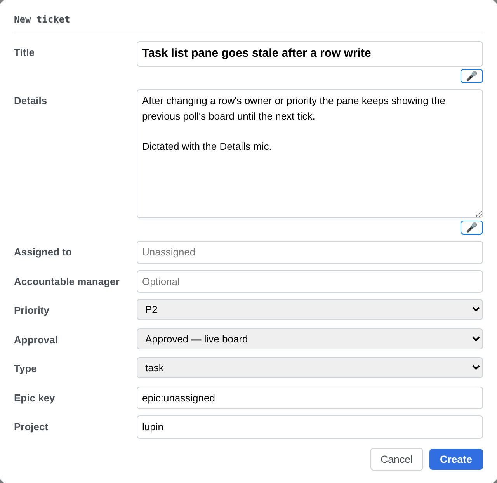

# The New Ticket mics, as `efaa004b` actually renders them — a render probe for Rick's layout call

**Row**: `f9a449c3` · **Branch under review**: `clayton/f9a449c3-new-ticket-mics` · **Commit**: `efaa004b`
**Produced by**: Maya 🌻 (`ba7be8c3`), at María 🌸's request, 2026-09-17
**Status**: EVIDENCE FOR A DECISION THAT IS RICK'S. Nothing here rules on the layout.

---

## Why this exists

Rick asked for the mics *"rendered small and right aligned right up against the vertical that
those two fields render against."*

🔴 **That sentence pins one axis and leaves the other open.** It says exactly where the buttons sit
**across** — hard against the right-hand end of the two boxes. It says nothing about where they sit
**up and down**, and the build had to choose. So this is not a clause with two meanings; it is an
instruction that specifies one direction, and an implementation that necessarily invented the other.

⇒ Rick should be answering **"is this right?"**, which is cheap, rather than **"what should it be?"**,
which is not. This document is the picture that makes the first question answerable.

## What the build does

**Reading A — implemented.** Each mic sits on its own short line **just underneath** its box, tucked
to the right-hand end, so the card grows two small rows taller.

**Reading B — not implemented.** Each mic sits **on the same line** as its box, at its right-hand end,
with the card no taller than before.

The multiplexer renders it identically — [second screenshot](f9a449c3-mic-layout/new-ticket-mics-multiplexer.png).

## Measured, not eyeballed

Both clients, 1280×900 viewport, 2× device scale. Numbers from `getBoundingClientRect()` on the live
card, not from reading the stylesheet:

| | classic | multiplexer |
|---|---|---|
| mic size | 29 × 18 px | 29 × 18 px |
| mic font size | 12px | 12px |
| mic right edge **vs** field right edge | **+0 px** (flush) | **+0 px** (flush) |
| mic top **vs** field bottom | **+3 px** (below) | **+3 px** (below) |

⇒ **The "right aligned" half of Rick's ask is met exactly** — flush to the pixel, on both clients and
on both fields. What the picture settles is the half he did not specify: the mic is **below** the box,
not beside it.

⚠️ **THE "SMALL" RESULT DEPENDS ON STYLESHEET LOAD ORDER, AND NOTHING STATES THAT.** The button also
carries the page-wide `stt-button` class, whose base is a slab — 8px/12px padding, 16px text, 70px
minimum width. The two rule sets have equal specificity, so the later sheet wins, and `task-list.css`
happens to load after `notifications.css` on the classic page. It is small today and a sheet reorder
would silently make it a slab. The CSS comment claims the mic is styled independently of that base;
the markup wears the class, so the claim holds by load order rather than by construction.

## Two things worth telling Rick that will not occur to him unprompted

1. **Neither reading is harder to change later.** It is a small presentation change either way — the
   button, the recording and every test around them stay exactly as they are. He should not agonise.
2. **Today's version makes the card two rows taller**, and he already scrolls it. If he picks Reading
   B there is one follow-up: the Details box is tall, so does the mic sit at its **top** right corner
   or its **bottom** right corner? A one-line box raises no such question; a tall one does.

## Reproducing this

`f9a449c3-mic-layout/render-probe.py` serves a detached worktree at `efaa004b` on a scratch port —
**never `:7999`, never `:8000`, so no venue is touched** — and drives headless chromium over
`render-probe.html`, which loads the **real** shared card through the **real** stylesheet list each
client's page declares, in that page's own order. The cascade is part of what is being measured, so
the order is not incidental.

Both fields are pre-filled with real text on purpose: a placeholder renders grey and reads as an empty
row, which is exactly the wrong impression for a layout question.
