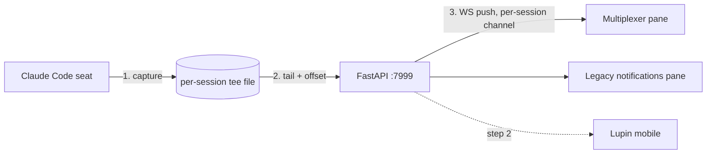

# 2026.09.27 — Console tee → live read-only stream (rough plan)

**Ask (Rick, broadcast d2d092f5)**: tee everything a Claude Code session prints to its console into a separate file, push it incrementally from the FastAPI server over a persistent WebSocket, and show it in a **read-only** pane. Clients: the multiplexer and the legacy notifications client first; the Lupin mobile client second.

**This document is a rough plan for Rick's walk-through.** It ends in a list of design questions; nothing is built until he rules on them, the cascade reviews the plan, and an SWE crew is staffed (Tiffany leads mobile, Mr. Radio leads the HTML clients).

## 1. Capture — what the "tee" actually taps (María)

**Depends on**: nothing else in this plan — §1 is readable on its own. §2 depends on the source chosen here.

**Already settled by ruling Q1 (§7, frozen)**: the source is the transcript JSONL tail; the raw terminal tee is optional phase 4. What follows is the survey the ruling rests on — read it to check the facts, not to re-open the choice.

**What exists today (surveyed 2026.09.27 by María; every citation below re-resolved 2026.09.27 by Chloé on the current worktree sha; paths relative to `src/`)**:

| Fact | Where |
|---|---|
| Every fleet seat is an **interactive** `claude` in a detached tmux session, never `-p` | `scripts/start-cc-with-tmux.sh:707` (`tmux new-session … -d "$INNER"`), argv built by `lupin_mcp/session_spawner.py` `build_spawn_argv` |
| **Nothing** uses `tmux pipe-pane` or `script` today; only point-in-time `capture-pane` | `cosa/agents/heartbeat_arbiter/turn_age_watchdog.py:388`, `lupin_mcp/self_respin_core.py:582`, `lupin_cli/claude_code/hooks/lib/cc_notification_listener.py:698`. A fixed-string sweep for `pipe-pane` across `*.py` and `*.sh` (excluding `.venv`) returns zero hits |
| Claude Code **already writes a per-session transcript file** (JSONL), and readers tail it via the bridge's `transcript_path` | `cosa/agents/heartbeat_arbiter/context_pressure.py:119` `_read_tail_lines` (byte-bounded tail), `cosa/agents/heartbeat_arbiter/turn_age_watchdog.py:353` `_default_transcript_reader`, `lupin_cli/claude_code/hooks/lib/heartbeat_task_state.py:44` `replay_task_state`. Three readers found, not a census — nobody has enumerated every tailer |
| No hook sends assistant text anywhere; `post_tool_use.py` is deliberately thin — its own comment says "NO transcript read, NO server POST" | `~/.claude/settings.json` hooks; `lupin_cli/claude_code/hooks/post_tool_use.py:89-90` |

**Two ways to get "all the text", and they are different things:**

| | **A. Raw terminal tee** — `tmux pipe-pane -o 'cat >> <file>'` | **B. Transcript tail** — read the JSONL Claude Code already writes |
|---|---|---|
| What it is | Literally the bytes the console prints | The structured record behind the console: user turns, assistant text, tool calls, tool results |
| New capture code | One line after `scripts/start-cc-with-tmux.sh:707` | **None** — the file exists for every seat already |
| Content quality | Noisy: the TUI repaints (spinners, status line, cursor moves, ANSI). Readable only through a terminal emulator (xterm.js client-side, or `pyte` server-side) | Clean text, already split into messages with roles and timestamps |
| Fidelity to "what's on screen" | Exact | Close, not exact — no spinner, no status bar; tool output may be longer than the screen showed |
| Mobile-friendly | Poor — a phone renders an 80×N terminal badly | Good — reflows as chat-style blocks |
| Seats started outside the launcher | Missed | Covered (any `claude` process writes a transcript) |
| Disk | Grows unbounded, repaint-heavy; needs rotation | Already managed by Claude Code |

**Why B won**: Rick's word was "T-like", and the transcript file *is* that tee — Claude Code already writes it. B needs no change to the launch path, reuses a tail reader we already trust, and gives every client (especially mobile) clean text. A survives as phase 4 if Rick later wants pixel-faithful console replay: one line in the launcher plus xterm.js in the pane.

**Verification (§1)** — this section asserts facts, so its checks are that the facts still hold. **Tier: unit (`src/tests/unit/`), venue `:7999`** — fixed-string sweeps and citation resolution over the tree; no server, no network. Coverage: **not applicable, and named rather than left silent** (A4) — these are fact-checks over source text, not exercised product code.

| # | Check | Executor |
|---|---|---|
| A1.1 | Every `file:line` in the fact table resolves to the named symbol or call on the sha under review | EXECUTOR: AI |
| A1.2 | A fixed-string sweep for `pipe-pane` over tracked `*.py` and `*.sh` returns zero hits. **This is a STANDING unit-tier assertion, not a one-shot Phase-0 look** (A9): a rule that depends on remembering is not installed, so the sweep lives in `src/tests/unit/` and keeps returning zero. If it ever does not, source A has arrived by another door and §1 needs re-reading. Prove the instrument works: the same sweep for `capture-pane` must return its three known hits | EXECUTOR: AI |

## 2. Server — ingest, storage, fan-out (María)

**Depends on**: §1's source choice (transcript JSONL, ruled Q1). **Consumed by**: §3's wire contract, which is the only thing §4 and §5 code against — a reviewer of §4 or §5 can trust §3 and skip this section.

**Today's WS layer** (`cosa/rest/`): `/ws/queue/{session_id}` (`routers/websocket.py` `websocket_queue_endpoint`) is the notifications/mux channel; fan-out lives in `websocket_manager.py` (`emit_to_session`, `emit_to_user`). **Routing is per user / per browser connection — there is no per-Claude-session channel.** The seat identity `claude.code@<proj>#<8hex>` exists only as a payload field, resolved by `routers/notifications.py` `_voice_persona_for_sender_id`.

> Citations in §2–§3 are anchored on **symbol names**, with a line number only where the line is the content (an INI key, a literal list). Line numbers are not portable between the main checkout and a worktree, and A1.1/A3.1 would otherwise fail for a reason that is not a defect. (Tiberius, T14 — which caught a real slip: `_voice_persona_for_sender_id` starts at `notifications.py:63`, and an earlier revision of this plan said `:68`, a line inside its docstring.)

**Four facts that size the work, all read 2026.09.27 on main `0783051fa`:**

- **The socket's receive loop handles exactly two client verbs** — `sys_ping` and `update_subscriptions` (`routers/websocket.py:573-587`). So "no new socket" is not "no server work": `cc_transcript_watch` and `cc_transcript_unwatch` are new branches. And `update_subscriptions` cannot absorb them — it is type-level only, with no per-target argument (`websocket_manager.update_subscriptions`). (Tiffany F1, verified by Tiberius T2.)
- **The socket already knows the caller's roles.** `connect()` stores `session_is_admin[ session_id ]` (`websocket_manager.py:186`). The WS half of the ruling-Q5 gate is a lookup on state we already hold. The REST half is separate: `require_admin = require_roles( ["admin"] )` with `is_admin( user )` beside it (`auth_middleware.py:259`, `:263`). **Both surfaces, named, or A2.2 only half-passes.** (T9.)
- **The two fan-out calls do not behave the same.** `emit_to_user` filters each frame against `session_subscriptions.get( session_id, ["*"] )`; **`emit_to_session` has no subscription check and sends unconditionally.** (T2.)
- **A name absent from the INI registry is dropped at subscribe time, silently.** `websocket available events` (`conf/lupin-app.ini:1729`) is the allow-list `connect()` validates against, and a client whose whole list validates to `[]` has every frame dropped while auth reports success — the incident the in-place comment at `websocket_manager.py:207-219` describes. (T3.)

**Proposed shape (source B):**

1. **Tailer** — one async task per *watched* seat on `:7999`. It resolves the seat's `transcript_path` from the session bridge (`session_bridge.get_session_metadata`), keeps a byte offset, reads new complete lines, and maps each JSONL record to a display block: `{ offset, ts, role, kind: text|tool_call|tool_result, text, truncated }`. **`offset` is the only sequence number** — the byte offset from §3; there is no separate `seq`. It starts on the first subscriber and stops after the last one leaves, plus a grace period.
   - **Offset mechanics: reuse `events_tail.tail_session_file`.** It is partial-line safe and returns `(records, new_offset)` landing at the last complete line — exactly §3's `next_offset` rule.
   - **Block mapping: one new walker, with an existing shape to copy.** `transcript_reader.iter_tool_uses` walks `assistant` → `message.content[]` → filter-by-type, which is the parse the mapper needs — but it yields **tool_use blocks only**, and the console also needs assistant text, so the text-and-result walker is new code beside it. `transcript_reader.read_transcript` is a whole-file generator with **no offset** and cannot serve the incremental path. (T4.)
   - 🔴 **The mapper's rules, because a transcript is mostly not messages.** Census of the four most recent lupin transcripts, 8,115 records (Pocholo, P2): `user` + `assistant` are **34%** of records, across **thirteen** record types — `attachment` 3114, `system` 493, `mode` 337, `atis-latch` 337, `last-prompt` 335, `ai-title` 333, `file-history-snapshot` 220, `queue-operation` 140, `permission-mode` 50, `file-history-delta` 23, `cost-state` 3. Inside the message records: `tool_use` 760, `tool_result` 760, `text` 520, `thinking` 424, plain-string `user` 260, `user` text 6.
     - **(a) Unrecognised record types are SKIPPED, by default rather than by enumeration.** The type set is demonstrably not closed — `atis-latch` and `cost-state` appear in recent files and not in an older one — so the rule is "map the types you know, skip the rest", never a list of things to ignore. (CLAUDE.md § "Writing a rule or a guard": write the predicate, not the enumeration.)
     - **(b) `thinking` blocks are shown FOLDED, expandable — like tool results (Rick, OSQ-7, 2026.09.27).** The mapper emits them as `kind: thinking`; both clients fold them by default.
     - **(c) A `user` record is not a human turn, and its content has two shapes.** `message.content` is a bare string in 260 cases and a list in the rest, so the mapper handles both. And **760 of the 1,026 `user` records carry tool_results** — mapping on role alone would render three quarters of them as fake human turns. The block's `kind` comes from the content block's type, never from the record's role.
   - **Open sub-question 7 — are assistant `thinking` blocks shown?** ✅ **RULED 2026.09.27 (Rick, live click): folded, expandable.** The provisional "hidden" below is superseded. *Original framing:* Ruling Q2 covered prose, one-line tool chips and folded tool results; it said nothing about reasoning, so this is a silence to fill rather than a ruling to revisit. It is not an edge case: `thinking` outnumbers assistant `text` 424 to 520 in the census. It is a **disclosure** call, not a parser detail — the console is a read-only window onto a seat's reasoning, admin-only in v1 but the first thing a viewer would notice. **Provisional default: hidden**, which is the conservative arm and the one that cannot surprise anyone; if Rick wants them, folded-by-default like tool results is the obvious shape. Batched for his walkthrough.
   - **Home: `cosa/utils/`, not the agent package.** `tail_session_file` lives under `cosa/agents/heartbeat_arbiter/`; a `cosa/rest/` tailer importing from an agent package is a layering surprise, so the shared primitive moves or is re-exported rather than reached into. (T12.)
   - **Open sub-question 1: the change-detection mechanism and its two numbers** — poll interval and grace period. **Lean poll.** A fixed-string sweep for `inotify`, `pyinotify` and `watchdog.observers` over tracked `*.py` returns zero hits, while `events_tail`, `context_pressure` and the arbiter loop all poll; inotify would be the repo's first such dependency, and `src/scripts/check-arbiter-venv.py` exists because a new import has a cost here. (T10.) Either mechanism satisfies §3, and A2.5 is written to hold for both.
2. **Watch, don't broadcast** — a client sends `cc_transcript_watch` / `cc_transcript_unwatch` over the **existing** `/ws/queue` socket (ruling Q4); the server pushes `cc_transcript_append` **via `emit_to_session`, to the watching browser session only**.
   - 🔴 **The watcher registry lives on `WebSocketManager`, beside the five per-session maps it already owns, and `disconnect()` must sweep it.** That sweep is hand-maintained — `active_connections`, `session_timestamps`, `session_subscriptions`, `session_is_admin`, `session_client_types`, plus the user association (`websocket_manager.py:278-303`) — so a watcher map is a **sixth entry that has to be added there explicitly**. Otherwise a closed tab or a dropped socket never sends `cc_transcript_unwatch`, the tailer polls forever, and `emit_to_session` early-returns into a session already gone from `active_connections`: a silent burn with no error anywhere. (Pocholo, P3.) The watcher set is the filter, and deliberately the only one: `emit_to_session` applies no subscription check, so there is no second place for a frame to be dropped — the place that has silently dropped everything before (`websocket_manager.py:207-219`). A watch from a non-admin session is refused via `session_is_admin` (ruling Q5). (T2.)
3. **Register the four names anyway.** `cc_transcript_watch`, `cc_transcript_unwatch`, `cc_transcript_append` and `cc_transcript_state` go into `websocket available events` (`conf/lupin-app.ini:1729`), and into both client lists (§4), even though `emit_to_session` does not consult them. Two reasons: a client's subscription list should not silently lie about what it asked for, and anyone who later switches the carrier to `emit_to_user` would otherwise ship a stream that delivers nothing while reporting success. The `WS_EVENT_NAMES` obligation that used to sit here as untagged prose is now folded into A2.6, where it is a tagged criterion rather than a sentence someone has to notice (A10). (T3, T8.)
4. **Backlog + resume** — backlog comes over REST, then the live watch starts from that offset. **The server must honour `from_offset` rather than starting at the current end of the file**, or the window between the REST fetch and the watch becomes a silent gap; and every `next_offset` must land at the end of a complete line. (Tiffany F3.)
   - 🔴 **Ruling Q6 needs a BACKWARD read, which a forward-only contract cannot express.** Q6 ruled "since last `/clear`, capped ~64 KB, load earlier". A bare `?since_offset=0&max_bytes=65536` returns the **first** 64 KB of the file; Q6 wants the **last** 64 KB, and "load earlier" wants a page going backwards from a known offset. So the REST surface takes an explicit tail mode and a backward page — `?tail_bytes=N` for the open, and `?before_offset=N&max_bytes=M` for "load earlier" — both landing on complete-line boundaries. This expresses Q6; it does not change it, and both client open paths (§4, §5) depend on it. (Pocholo, P4.)
5. **A transcript file is not stable across `/clear`** — the bridge keys on `stable_session_id`, which survives a clear, while the JSONL file behind it changes. A byte offset is therefore meaningful only inside one file, so every frame carries a `file_epoch` (§3); when it changes, the client drops its buffer and offset and re-fetches. (Tiffany F2.)
   - 🔴 **A `/clear` SWAPS THE PATH — IT NEVER SHRINKS THE FILE — so the shrink detector cannot fire for the case this plan built it for.** Measured: `register_session.py` runs on every SessionStart, `/clear` fires SessionStart, and the hook rewrites the bridge with the **new** `transcript_path` from its stdin payload while **preserving** `stable_session_id` (verified on a live bridge file: `transcript_path` and `stable_session_id` sit side by side, the path carrying the per-session uuid). The old JSONL does not shrink — it simply stops growing, and a different file appears at a different path. ⇒ **A tailer watching only for a shrink sits on the dead file forever: no epoch bump, no `cc_transcript_state`, no new blocks — the pane silently freezes at the moment of the clear**, which is the precise failure `file_epoch` was introduced to prevent. (Pocholo, P1.)
   - ⇒ **Therefore the tailer RE-RESOLVES the bridge on its poll, and a changed `transcript_path` is the `/clear` signal**: it bumps `file_epoch`, resets the offset to 0 against the new file, and emits `cc_transcript_state`. The path is the primary detector.
   - The shrink path stays as the **secondary** detector, for genuine in-place truncation. `tail_session_file` treats `offset > size` as rotation and sets `offset = 0` (`events_tail.py:81-82`), re-reading the whole file and returning it as new bytes — a full replay with no signal that anything rotated — so the tailer must detect the shrink itself, bump the epoch, and **not** re-emit the replayed records. (T5.)
6. **Coalesce** — batch lines into one push every ~300 ms per seat (ruling Q7) so a large tool result does not become hundreds of frames.
   - **`cc_transcript_state: ended` needs a producer, and the tailer's stop rule is not it.** The grace period stops the tailer when the last *watcher* leaves, never when the *seat* leaves, so without a producer a viewer watching a seat that exits sees a pane that merely stops — indistinguishable from a quiet seat. The signal is the existing `SessionEnd` hook (`lupin_cli/claude_code/hooks/session_end.py`), with a staleness fallback for a seat that dies without firing it. (Pocholo, P6.)
7. **Budget each block** — a single JSONL line (a tool result) can be megabytes. The server truncates a block past its **budget**, sets `truncated: true`, and serves the full text over REST. Adopt the vocabulary already in the tree: `routers/tasks.py:770-785` returns `(rows, truncated)` against a byte `budget` and documents `budget == 0` as **unbounded, not zero** — keep that semantic rather than inventing a `cap` that reads the opposite way. `cu.truncate_string` (`utils/util.py:964`) is the string-level helper. **Open sub-question 2: the budget's value, and whether it applies per block or per push.** (Tiffany F5, T7.)
8. **Read-only by construction** — the channel has no client→seat verb at all; only watch and unwatch (ruling Q8).

**Storage**: none new. The transcript file is the store; the server holds only offsets and a small per-seat ring buffer. `arbiter_state.FleetEventAccumulator` is the shape to copy — a per-session bounded tail, `_by_session`: session id → `deque( maxlen )` — **but not the class to reuse as-is**: it is bounded in **records** (`DEFAULT_TAIL_MAXLEN = 50`, with an in-place comment scoping it to repeated-cap detection), while the resume path is measured in **bytes**. A record-count ring cannot answer a byte-offset question, so the server could not say which `from_offset` values it is able to serve. ⇒ The per-seat ring is byte-bounded, carrying the offset span it holds. (T6 as corrected by Pocholo, P7 — the unit mismatch is the finding, not the value.) **Open sub-question 3: the buffer's size in bytes**, which decides how much of a reconnect the server can serve without sending the client to REST.

**The four dials are INI keys, not constants.** OSQ-1's two numbers plus OSQ-2 and OSQ-3 are four values, and the pattern is `config_mgr.get( "<space separated key>", default=…, return_type="int" )` (`fcm_wake_service.py:132`). Unresolved *values* are fine at this stage; unresolved *homes* are not. (T8.)

**Documentation deliverables — Phase 0, not a follow-up.** CLAUDE.md § Documentation touchpoints binds this feature to four, and § DOCUMENTATION-FIRST PROTOCOL makes them Phase 0 of implementation: a new router → the quick-reference table in `src/docs/rest-api-reference.md`; changes to `routers/websocket.py` → `src/docs/websocket-events.md` and `websocket-architecture.md`; the `websocket available events` key → those same two; new endpoint decorators → re-run `src/scripts/generate-api-docs.sh`. (T13.)

**Security / privacy** — the console carries everything the seat reads: file contents, tool output, possibly secrets from `.env` or logs. Ruling Q5 settles the policy — **admin only, no redaction in v1**, revisit before mobile goes off-LAN. The enforcement point is the server, on both surfaces named above. A hidden UI entry point is a courtesy, not a gate.

**Verification (§2)** — all against a recorded transcript fixture, **no live seat needed**. **Tier per row below**; the default is unit (in-process `TestClient`, venue `:7999`, `tmp_path` only — the shape `src/tests/unit/test_flow_ratio_settings_endpoint.py:44` declares in place). **Coverage (A4, Convention 6): every new Python module this section adds — the tailer, the watcher registry, the block mapper, the REST handlers — is measured at 100% lines/branches/functions under `pytest --cov --cov-fail-under=100`, the same obligation §4's B4.10 carries for TS.** A2.7 is a documentation check and is excluded by name.

| # | Check | Executor |
|---|---|---|
| A2.1 | A watcher starting at `from_offset=N` receives every byte from N onward, in order, with no gap and no repeat | EXECUTOR: AI |
| A2.2 | **Both arms, or the criterion is satisfiable by a gate that refuses everyone** (A3). **NEGATIVE**: a non-admin session's `cc_transcript_watch` is refused and its REST backlog answers 403 — both surfaces in one test, since they use different gates (`session_is_admin` vs `require_admin`). **POSITIVE**: an admin session's watch is accepted and its backlog answers 200, at the **same unit tier**, via `dependency_overrides[ require_admin ]` (the pattern at `src/tests/unit/test_flow_ratio_settings_endpoint.py:76`) | EXECUTOR: AI |
| A2.2b | ⚠️ **The positive arm over the REAL auth stack is BLOCKED, and it is blocked for everyone — not just this plan.** `test_flow_ratio_settings_endpoint.py:28-38` records it in place: *"no test in this repo has ever watched an admin write SUCCEED — only a non-admin fail"*, because the only admin accounts are `admin@lupin.deepily.ai` and Rick's own and **neither password is held by the fleet**. An admin test credential has been requested and does not exist. A2.2's positive arm therefore proves the route **wiring** (the override path), not the live auth stack | ✅ **RULED 2026.09.27 (Rick): ship v1 on A2.2's override-tier positive arm; a dev-only test admin account is a separate follow-up row, off this build's critical path.** The gap stays stated, not rounded down to "tested". *Was:* EXECUTOR: HUMAN — Rick, only because no admin credential exists for the fleet to use |
| A2.3 | **Two arms, because the two cases have different mechanisms** (P1). **(a) PATH SWAP — the real `/clear`**: rewrite the fixture bridge with a new `transcript_path` while `stable_session_id` stays put; the tailer re-resolves, bumps `file_epoch`, emits `cc_transcript_state`, and starts at offset 0 of the new file. Prove it watches: a tailer that only checks for a shrink must **fail** this arm — that is the defect P1 found, and this arm is the only thing standing between it and a pane that silently freezes at every clear. **(b) IN-PLACE TRUNCATION — rotation**: truncate the fixture mid-run; the epoch bumps and no replayed record is emitted. Prove it watches: point the tailer at raw `tail_session_file` behaviour and this arm must redden, because that path replays from 0 as new bytes | EXECUTOR: AI |
| A2.4 | A block longer than its budget arrives truncated with `truncated: true`, and the REST fetch returns the full text; `budget == 0` means unbounded | EXECUTOR: AI — **executability conditional on Open sub-question 2**: the test asserts the truncate-and-flag behaviour and reads the budget from the INI rather than hard-coding it. Until OSQ-2 closes, this AC's `EXECUTOR: AI` tag carries this same-line dependence note |
| A2.5 | **Two arms.** **(a) UNWATCH**: the tailer starts on the first watcher and stops after the last one leaves. **(b) SOCKET DROP — the leak P3 names**: drop the socket without sending `cc_transcript_unwatch` (a closed tab), and the watcher entry is gone from the registry and the tailer stops. Prove it watches: omit the watcher map from `disconnect()`'s sweep and arm (b) must redden, while arm (a) stays green — which is exactly how the leak would have shipped | EXECUTOR: AI — **executability conditional on Open sub-question 1**: the test asserts start and stop, never a poll interval, and the wait it uses is the grace period OSQ-1 fixes. Until OSQ-1 closes, this AC's `EXECUTOR: AI` tag carries this same-line dependence note |
| A2.6 | The four event names are present in `websocket available events`, and a client subscribing to them validates to a non-empty list — the T3 failure mode, asserted rather than assumed. **And if the names get splainer entries, `WS_EVENT_NAMES` in `src/tests/unit/test_ini_key_naming.py:23-31` carries them** — folded in here rather than left as prose (A10), because that guard reddens the unit tier when it is missed. ⚠️ **Amended 2026-09-27 18:18 (Rio's review, ruled by Mr. Radio):** that guard exempts splainer **keys** only and never reads the event-list **value**, so it cannot see a name missing from `websocket available events`. And the value's separator is load-bearing: `configuration_manager.py` parses `list-string` with `value.split( ", " )`, **exactly comma-space**. A name appended with a bare comma or on a continuation line fuses with its neighbour, and both are lost silently. So the test must (a) parse through the real reader, preferring `ConfigurationManager.get( "websocket available events", return_type="list-string" )` over `WebSocketManager.available_events`; never a hand split; (b) assert each of the four `cc_transcript_*` names **by name**; (c) assert the parsed set **equals** the 25 pre-change names (a committed literal, measured at `7db04b8af`) **plus** the four new ones. That is set equality, not a count: a count of 29 can coincide with one fused pair plus one stray name, while equality names every survivor. The names go on the existing line, separated by `, ` | EXECUTOR: AI |
| A2.7 | The four documentation artifacts exist and are checked **by token, not by judgement** (A7), before phase-1 code lands (Phase 0): the four event names appear in `src/docs/websocket-events.md`; the REST path appears in the `src/docs/rest-api-reference.md` quick-reference table; the `websocket available events` key change appears in `websocket-architecture.md`; and `src/scripts/generate-api-docs.sh` **exits 0 and leaves no diff** in `src/docs/fastapi/` — a re-run that changes files means the committed docs were stale. ⚠️ **Amended 2026-09-27 18:12 (Rio's review, ruled by Mr. Radio, agreed by María): the generate-api-docs arm runs at PHASE 1, not phase 0**, since the route does not exist before phase 1. Precondition: `./src/scripts/bounce-dev-server.sh` after the route lands, because reload is off on `:7999` and an unbounced server serves the old spec. Regenerate, commit, re-run; the re-run must leave `api.json` byte-identical and change `api.md` **only on the timestamp footer line** that `generate-api-docs.sh:106` appends on every run, so a literal "no diff" can never pass. The other three token checks stay at phase 0. Coverage-excluded by name (A4) | EXECUTOR: AI |
| A2.8 | **The mapper's rules, over a real captured transcript, not a hand-written fixture** (P2): an unrecognised record type is skipped rather than erroring; a `user` record carrying a tool_result maps to `kind: tool_result` and **not** to a human turn; and `message.content` is handled as both a bare string and a list. Prove it discriminates: feed a record type invented for the test and assert it is skipped silently, then feed a malformed one and assert the same | EXECUTOR: AI |
| A2.9 | **Ruling Q6's backlog verbs work backwards** (P4): `?tail_bytes=N` returns the **last** N bytes, not the first, and `?before_offset=N&max_bytes=M` pages backwards from N, both landing on complete-line boundaries. Prove it discriminates: a forward-only implementation must fail the `tail_bytes` arm | EXECUTOR: AI |
| A2.10 | **All four contract states are watched, not two** (A6). `ended` is actually produced when a watched seat exits — driven by the `SessionEnd` hook, with the staleness fallback on its own arm (P6) — and a seat that merely goes quiet does **not** produce it. `rotated` is emitted as a `cc_transcript_state` **frame** on the epoch change, which A2.3 does not assert (it asserts the bump and the absence of a replay, not the signal). `epoch_mismatch` is A3.5 and `live` is implicit in A2.1 | EXECUTOR: AI |
| A2.11 | The server can name the offset span its ring holds, and a `from_offset` inside that span is served from memory while one outside it is answered by pointing the client at REST. This is the byte-vs-record property P7 names: a record-count ring cannot pass this test | EXECUTOR: AI — **executability conditional on Open sub-question 3**: the span asserted is read from the INI, not hard-coded. Until OSQ-3 closes, this AC's `EXECUTOR: AI` tag carries this same-line dependence note |

## 3. Reuse what exists (Tiffany)

**Depends on**: §1 (the source is the transcript JSONL) and §2 (the server holds the offsets). Everything §4 and §5 need is the wire contract at the end of this section.

| Piece | Where | What it gives us |
|---|---|---|
| Queue WebSocket | `cosa/rest/routers/websocket.py` `/ws/queue/{session_id}` | One authenticated socket per client. The first frame is `auth_request`; the server answers `sys_ping`/`sys_pong` and `update_subscriptions`. No new socket — but two new receive-loop branches, see the gaps |
| Fan-out | `cosa/rest/websocket_manager.py` — `emit_to_session` (**no subscription filter, sends unconditionally**), `emit_to_user` (**filters against `session_subscriptions`**), `emit` | Each frame is `{type, timestamp, ...data}`. §2 carries the stream on `emit_to_session`, so the watcher set is the only filter. Do not describe the two calls as interchangeable (T2) |
| Event-name registry | `conf/lupin-app.ini:1729` `websocket available events`; validated in `websocket_manager.connect` | The allow-list a subscription is checked against. A name missing here validates away silently (T3) |
| Admin gates, both halves | `cosa/rest/websocket_manager.py:186` `session_is_admin` (WS) · `cosa/rest/auth_middleware.py:259` `require_admin`, `:263` `is_admin` (REST) | Ruling Q5 needs both; neither is new plumbing |
| Tail with an offset | `cosa/agents/heartbeat_arbiter/events_tail.py` `tail_session_file`, `save_offsets`/`load_offsets` | Partial-line-safe incremental read returning `(records, new_offset)`. ⚠️ Replays the whole file on shrink (`:81-82`) — §2 item 5 overrides that |
| Block-walk shape | `lupin_cli/claude_code/hooks/lib/transcript_reader.py` `iter_tool_uses` | The `assistant` → `message.content[]` → filter-by-type parse. Tool-uses only, so the text/result walker is new. `read_transcript` is whole-file with no offset — not for the incremental path (T4) |
| Per-session bounded tail | `cosa/agents/heartbeat_arbiter/arbiter_state.py` `FleetEventAccumulator` | The server-side ring buffer, already written (T6) |
| Truncation vocabulary | `cosa/rest/routers/tasks.py:770-785` — `(rows, truncated)` against a byte `budget`, `budget == 0` = unbounded · `cosa/utils/util.py:964` `cu.truncate_string` | Adopt these names and that zero-semantic (T7) |
| Session ↔ transcript map | `session_bridge.get_session_metadata`, `~/.claude/sessions/cc-{ppid}.json`; `context_pressure.py` already tails every worker's JSONL | We can already find each live session's transcript |
| Live-seat roster | `cosa/rest/routers/arbiter.py` **`/arbiter/fleet-state`** — the surface to project. Its own description calls it the "NEW authoritative surface (L4)" and says in as many words that it **supersedes `/arbiter/fleet-snapshot`**, and all three clients already poll it (`FleetStatusStore.ts` in both web clients, `fleet_repository.dart:19` on the phone). Seat chips are fed separately by `notifications.py` `senders-visible` via `SessionStripStore.ts` | The roster already exists — project the authoritative one (T1, corrected by Pocholo) |
| Collapsing progress rows | `lupin_cli/claude_code/hooks/post_tool_use.py` stamps `progress_group_id`; the phone collapses by it at render time only (`progress_group_collapse.dart`) | A convention for chatter, not an in-place update |
| INI dial pattern | `fcm_wake_service.py:132` `config_mgr.get( …, return_type="int" )` | Where the four dials live (T8) |
| Read-only pane precedent | `/app/docs` → `document-viewer.html` + REST (`cosa/rest/routers/docs_files.py`) | A static page that fetches over REST, with no WebSocket |

**Gaps** — each is work this plan has to pay for:

- **The receive loop has two verbs**, and `update_subscriptions` cannot absorb a third: it is type-level only, with no per-target argument. `cc_transcript_watch` and `cc_transcript_unwatch` are new branches (`routers/websocket.py:573-587`).
- **No sequence numbers and no replay on reconnect.** Today's catch-up is `undelivered_count` plus a REST reload by the client.
- **The roster needs three fields, not a new endpoint.** ⚠️ An earlier revision of this section said *"No roster endpoint. Nothing lists the live seats a viewer could watch"* — **that was wrong**, and Tiberius found three prior arts (T1). The work is to project **`/arbiter/fleet-state`** for this purpose and add three fields its rows lack: `project`, `last_ts` and `transcript_watchable`.
  - **All three fields are computed by the admin-gated projection — nothing is added to `/arbiter/fleet-state` itself.** That is not a preference: fleet-state is a reverse-proxy that returns `:8001/state`'s composite body **verbatim**, so the projection is the only place a new field can be computed, and putting one upstream would mean changing the standalone arbiter service for a viewer feature. The projection reads fleet-state, joins what it needs, and adds the three fields on the way out.
  - **`transcript_watchable` is a per-seat boolean, true only for an admin caller and a seat with a live transcript** (requested by Tiffany for §5, and §4's chip affordance reads it too). It exists so no client re-derives the rule: both watch affordances read this one field, and **a missing field counts as false** — so an older server, or a projection that forgot it, hides the affordance rather than offering a watch that would be refused. That is the safe direction, and it keeps the ruling-Q5 admin decision on the server where §2 put it.
  - ⚠️ **[corrected]** An earlier revision projected `/arbiter/fleet-snapshot`. **`/arbiter/fleet-state` supersedes it** — stated in fleet-state's own endpoint description, and it is what all three clients already poll. (Pocholo.) Note the supersession is documented on fleet-state's side only; fleet-snapshot does not mark itself deprecated, so a reader arriving from that end gets no warning.
  - **Where the two missing fields come from**: `project` from the session bridge, which the tailer already reads for `transcript_path` (the `sender_id`'s `claude.code@<proj>#<8hex>` carries it too); `last_ts` from the transcript file's mtime, which the snapshot pipeline already threads as `transcript_mtimes`. Neither needs a new source — but the projection must **say which it used**, because a `last_ts` that silently means "row refreshed" rather than "seat last wrote" makes a dead seat look live.
  - 🔴 **fleet-state answers `{status: "unreachable", …}` with NULL sections as HTTP 200** when the standalone arbiter at `:8001` is down — it is a reverse-proxy to `:8001/state` and that envelope is deliberate. So the roster must distinguish **"no live seats"** from **"the arbiter is unreachable"**, and show the difference. Reading a 200 as success renders an empty roster with no explanation, which is the same silent-failure shape this plan has hit three times now. **Two catches.** (1) fleet-snapshot is gated by `require_api_key_or_jwt` — authenticated, **not** admin. Ruling Q5 is admin-only, so the projection carries its own `require_admin`; inheriting the source's looser gate would widen access by accident. (2) **The projection must NORMALISE the id width, not assume it.** `fleet_render.build_snapshot`'s own docstring says role resolution matches the session id *"prefix-tolerantly"* — the source deliberately tolerates both widths, so its rows are not guaranteed to carry the full id. The projection widens from the bridge on the way out, which is what makes A3.6 a check rather than a coin-flip. (Pocholo, P5.)
- **The tail primitive replays on rotation** (`events_tail.py:81-82`) — see §2 item 5.
- **The event names are not in the INI registry** (`conf/lupin-app.ini:1729`), and a name absent there validates away without an error (T3).
- **The HTML clients whitelist their events** (`static/js/multiplexer/transport/QueueTransport.ts:427-440`, `static/js/notifications.js:2636` and `:2663` — two separate literals), so the names go in both lists.
- **The phone subscribes to everything** (`subscribed_events: []`), which is harmless under `emit_to_session` and would not be under `emit_to_user` — another reason §2 names the carrier.

### Wire contract (shared by HTML and mobile)

Traffic is **opt-in per session**: a viewer receives chunks only for the sessions it is watching, and only if it is an admin (ruling Q5).

| Direction | Message | Payload |
|---|---|---|
| client → server | `cc_transcript_watch` | `{cc_session_id, from_offset, file_epoch}` — `file_epoch` is nullable: null means "whatever file is current", and the server answers with the epoch it chose |
| client → server | `cc_transcript_unwatch` | `{cc_session_id}` |
| server → client | `cc_transcript_append` | `{cc_session_id, file_epoch, offset, next_offset, blocks[], ts}` — coalesced about every 300 ms, delivered by `emit_to_session` to watchers only |
| server → client | `cc_transcript_state` | `{cc_session_id, file_epoch, state: live\|ended\|rotated\|epoch_mismatch}` |
| REST | `GET /api/cc-transcript/{cc_session_id}?since_offset=N&max_bytes=…` | `{file_epoch, offset, next_offset, blocks[]}` — backlog and gap repair, same pattern as today's REST reload after `auth_success`. Path under review, see Open sub-question 6 |
| REST | the watchable roster | a projection of **`/arbiter/fleet-state`** plus `project`, `last_ts` and `transcript_watchable`, admin-gated in its own right (see the gaps above) |

Rules:

- **`cc_session_id` is the seat's `stable_session_id`** — the full id that survives a `/clear`, never the post-clear id and never the 8-character form the fleet uses elsewhere (`sender_id`'s `#<8hex>` suffix, a DM's `recipient_session_hash8`). The roster join depends on the roster's `session_id` and the stream's `cc_session_id` being the same string at the same width; **phase 1 verifies that rather than assuming it** (A3.6), because three id widths circulate in this fleet and a silent mismatch shows up as a roster row that cannot be watched. (Tiffany, ratifying §3.)
- **`offset` is the sequence number.** It is the byte offset in the source file; there is no separate `seq`. `next_offset` always lands at the end of a complete line.
- **The server starts where the client asked.** A watch honours `from_offset` and never silently starts at the current end of the file.
- **`file_epoch` scopes every offset.** It names the transcript file (its uuid). A `/clear` or a rotation changes it while `cc_session_id` stays put; on a change the client drops its buffer and offset and re-fetches the backlog over REST. A client that does not yet know the epoch sends null and learns it from the first frame — so a first watch needs no prior REST call.
- **A stale non-null epoch is refused, never silently rebased.** If a watch names an epoch that is no longer current — the first message every reconnecting client sends after a `/clear` it did not see — the server does not start from 0 and does not honour the offset. It answers `cc_transcript_state {state: epoch_mismatch, file_epoch: <current>}`; the client then clears and re-fetches, exactly as for a mid-stream change. A silent rebase would hand the client the whole new file labelled as its own continuation. (T15.)
- **Gap rule**: if `chunk.offset != last_next_offset`, drop the chunk and fetch over REST from `last_next_offset`.
- **Blocks are budgeted.** A block over its budget arrives truncated with `truncated: true`; the full text is available over REST, and `budget == 0` means unbounded (§2 item 7).
- **Nothing flows from client to seat.** The only client verbs are watch and unwatch (ruling Q8).
- **A block's `kind` decides how it renders, and prose and tool content do not share a renderer.** Stated here once because both clients obey it (§4 and §5 point at this rule rather than restating it): `kind: text` renders as **markdown**; `kind: tool_call` and `kind: tool_result` render as **plain text** — `<pre>` / `textContent` on the web, a plain text widget on the phone — collapsed and truncated per ruling Q2. **A kind the client does not recognise renders as plain text, never dropped and never thrown on**: the mapper is deliberately open-ended (§2 item 1(a)) and OSQ-7 may add a fourth kind, so a three-literal switch with no fallback would render nothing in the one surface whose whole job is to show everything — and silently. Plain text is the safe arm because it cannot mangle and cannot execute. (Pocholo, Q4 — the same predicate-not-enumeration point as P2.) The concern is not injection, it is **mangling**: a markdown renderer turns a raw file dump into markup, so `#` becomes a heading, `*` a list, indentation a code block, and a diff or a config file renders wrong. Ruling Q2 already splits prose from tool results; the renderers split the same way. (Tiberius B6 in §4, C4 in §5 — one finding, one rule.)
- **A block's `kind` comes from the content block's type, never from the record's role.** 760 of the 1,026 `user` records in the census carry tool_results, so a role-based mapping would render three quarters of them as fake human turns (§2 item 1(c)).

**Open sub-question 6: the REST path's name.** Ruling Q4b settled the four *event* names and flagged that "transcript" already means speech-to-text in the mux; the REST path was swept in afterwards and inherits the same clash on a second surface — `/api/v2/transcribe` (`v2_ask.py:579`), `/upload-and-transcribe-{mp3,wav}` (`speech.py:322`, `:847`), and `transcript` as the name of an STT NDJSON line (`src/docs/rest-api-reference.md:211`). Proposal: **`/api/cc-transcript/{cc_session_id}`**, which keeps the ruled vocabulary and cannot be read as speech-to-text. This extends Q4b rather than contradicting it, so it is María's to carry to Rick, not mine to change. (T11.)

**Verification (§3)** — **tier: unit, venue `:7999`** unless a row says otherwise. **Coverage (A4, Convention 6): the Python this section adds — the roster projection and the REST backlog handler — is measured at 100% lines/branches/functions under `pytest --cov --cov-fail-under=100`**, the same obligation §2's table carries. Two named exclusions rather than silence: A3.1 is a citation check over source text, and **A3.2/A3.3 are contract statements, not code this section owns** — they are listed here so the contract is reviewable in one place, and each names the client tests that actually execute it. §3 claims no coverage for them, because the code under them belongs to §4 and §5.

| # | Check | Executor |
|---|---|---|
| A3.1 | Every citation in the two tables above resolves to the named symbol on the sha under review — symbol names, not line numbers, except where the line is the content | EXECUTOR: AI |
| A3.2 | A client fed a deliberately out-of-order chunk drops it and issues the REST repair fetch from `last_next_offset`. **Executed by B4.1 (multiplexer) and B4.11's legacy twin, and by C5.1 (mobile)** — this row states the contract both must satisfy; the coverage for it is theirs (B4.10 for TS, the mobile tier for C5.1), not §3's | EXECUTOR: AI |
| A3.3 | An epoch change resets the client's buffer and offset, and no block from the old epoch renders after it. **Executed by B4.2 (including the `epoch_mismatch` arm) and B4.11's legacy twin, and by C5.2 (mobile)** — same split as A3.2: §3 owns the contract, they own the code and its coverage | EXECUTOR: AI |
| A3.4 | **Both arms** (A3): an **admin** caller gets 200 with `transcript_watchable` true for a watchable seat, and a **non-admin** caller is refused — same unit tier, `dependency_overrides[ require_admin ]`, per A2.2. The projection returns `project`, `last_ts` and `transcript_watchable` alongside the `/arbiter/fleet-state` fields, and refuses a non-admin caller — asserted against the projection, never against `/arbiter/fleet-state`, whose own gate (`require_api_key_or_jwt`) is looser. `transcript_watchable` is false for a non-admin caller and for a seat with no live transcript | EXECUTOR: AI |
| A3.7 | An unreachable arbiter is distinguishable from an empty fleet: with `:8001` down, fleet-state's `{status: "unreachable"}` 200 makes the projection report *unreachable*, not an empty roster. Prove it discriminates: a genuinely empty fleet must produce a different answer | EXECUTOR: AI |
| A3.5 | A watch naming a stale epoch gets `cc_transcript_state {state: epoch_mismatch}` and no blocks — not a rebased stream from offset 0 | EXECUTOR: AI |
| A3.6 | **From a FIXTURED bridge file, not a live seat** (A8) — which keeps §2's "no live seat needed" promise true for §3 as well, makes the check deterministic rather than dependent on whichever seat happens to be alive, and leaves no precondition that could quietly become someone's manual step. Write a bridge file with a known `stable_session_id` and `transcript_path`, then assert the roster row's `session_id`, the stream's `cc_session_id` and the bridge's `stable_session_id` are one string at one width — across the two surfaces, never within one | EXECUTOR: AI |

## 4. HTML clients — multiplexer + legacy notifications (Mr. Radio)

> **Drafted by María; approved by Mr. Radio 2026.09.27, with the three open items answered at the end of this section.** Every code reference below was re-resolved by Chloé on 2026.09.27 against sha `0783051f`; the two corrections that came out of it are marked **[corrected]**.

**Depends on**: the §3 wire contract and nothing else. *(Citation note: two reviewers numbered their §4 findings independently — Tiberius at Stage 1 and Clayton at Stage 3 both used B1, B2, B3… so every citation below names the reviewer. A bare `(B3)` would point at two different findings.)* A reviewer can judge this section with §3 open and §1–§2 closed.

**Parity rule: both clients, always** — Rick's standing rule for UI work, so this section inherits the obligation rather than taking it on (B12; Mr. Radio confirms). Worth saying because the reconnect precedent this section borrows, `StripReconnectRehydrator`, is explicitly scoped mux-only in its own gate condition. Same wire contract (§3), same behaviour. New client-side names are `SessionTranscript*` — "transcription" in this codebase means speech-to-text (`audio/recordingManager.ts`, `render/actionRequiredMic.ts`), so the prefix keeps the two apart (ruling Q4b's wrinkle).

**Multiplexer** (`lupin_app/static/js/multiplexer/`):

- **Transport** — add `cc_transcript_append` and `cc_transcript_state` to `QUEUE_SUBSCRIBED_EVENTS` (`transport/QueueTransport.ts:427-440`, a 12-entry list today), and call `cc_transcript_watch` / `cc_transcript_unwatch` through the transport's **existing** public `send( envelope )`. **[corrected]** An earlier draft said a send path had to be added; `send()` is already there at `transport/QueueTransport.ts:177`, delegating to `ws-channel.ts:196`.
  - ⚠️ **[corrected again]** That same draft said `render/requestChips.ts:195` was an existing external caller to follow. **It is not.** That line is `this.send( chip, verdict )` — a *private two-argument REST-posting method* of requestChips declared at `:235`, which never touches the transport. `QueueTransport.send( envelope )` has **no caller outside `transport/` anywhere**; every other `.send(` in the multiplexer is an XState `actor.send({ type })`, a different verb. So this feature is `send()`'s **first external user**, which is a larger risk than following a precedent, and the reason the ordering guard below matters rather than being belt-and-braces. (Tiberius, B4.)
  - **Ordering guard — gate on the `auth_success` EventBus event, not on `authReady`.** `send()` throws if the channel has not started, so a watch fired on mount would throw. **[corrected]** An earlier draft named the transport's `authReady` flag as the gate; it is `protected` (`transport/QueueTransport.ts:107`, set true at `:278`), so a store cannot read it. Of the two available routes — a new public readiness accessor on the transport, or subscribing to the `auth_success` event already on the bus — **this plan picks the EventBus**, because two stores do exactly that today (`stores/MissedStore.ts:86` and `NotificationStore`), it needs no change to the transport's surface, and it keeps the store from reaching into transport internals. (Tiberius, B5.)
- **Store** — new `SessionTranscriptStore`, whose ring buffer is **genuinely new on the client**: nothing in `stores/` is a bounded buffer today, while the server's has prior art (`FleetEventAccumulator`, §2). The two are **independently dialled and do not share a size semantic** — the server's bounds what it can replay without touching disk, the client's bounds what it can scroll back through without touching REST (Tiberius B8). Both are **byte**-bounded, not record-bounded, for the reason §2 gives: a record-count ring cannot answer a byte-offset question (P7). Per watched session it holds a ring buffer of blocks, `last_next_offset`, the current `file_epoch`, gap detection → REST repair, and re-watch on reconnect — three precedents, not one: `stores/StripReconnectRehydrator.ts`, the `ActionRequiredStore.onConnectionState` wiring its own header credits, and `render/SystemStatusRenderer.ts`, with `MissedStore` and `NotificationStore` covering catch-up-after-`auth_success` (Tiberius B11). On an epoch change it clears the buffer and offset rather than repairing (§3). **On reconnect it must handle `epoch_mismatch`** — the stale-epoch answer §3 added: clear, then re-fetch from the backlog, never treat the reply as a continuation.
- **Roster and identity — the chip cannot supply the watch key, so the roster is the join.** The seat chips are fed by `stores/SessionStripStore.ts` off `notifications.py` `senders-visible`, and the live-seat list is a projection of `/arbiter/fleet-state` (§3, T1) — §4 consumes that projection, it does not define it. **Two things an earlier revision left joined nowhere** (Pocholo, Q2):
  - **Identity.** `SessionStripStore` is keyed on `sender_id` = `claude.code@<proj>#<8hex>`, which carries only the **8-hex prefix**, while §3 rules `cc_session_id` is the **full** `stable_session_id`. ⇒ **The chip's 8-hex is matched against the roster rows' full ids, and the roster's full id is what the watch sends** — the roster being the `/arbiter/fleet-state` projection (§3), not the superseded fleet-snapshot. The resolution step is named here so both clients do it the same way; the legacy client's sender card is the same key and the same join, or B4.7/B4.8's "in both clients" would pass over two different resolution paths, only one of them designed.
  - **Population — the two lists are not the same set.** `senders-visible` is a per-user notification-sender list with `is_hidden`, unread counts and an `hours` filter; fleet-state is the arbiter's live fleet. So **a chip can outlive its seat** — a chip with no roster row is not watchable, and its watch affordance is absent rather than offering a watch that would fail — and **a live seat that has never sent a notification has no chip at all**.
  - 🔴 **Open sub-question 8: seats with no chip are unreachable in v1 — TBD, for Rick.** Ruling Q10 put the entry point on the seat's chip, so this narrows his ruling rather than contradicting it, and the fix is not mine to invent: adding a second entry point would be designing around a ruling instead of asking about it. The roster projection already lists those seats, so the option exists; whether v1 needs it is his call. Batched for the walkthrough.
- **Renderer** — new `SessionTranscriptRenderer`, opened from a seat's chip in the session strip (`render/SessionStripRenderer.ts`), hosted in the existing reading pane (`render/ReadingPaneRenderer.ts`) per ruling Q10. **[corrected]** "Mode" is already taken in that renderer: `getLayoutMode()` / `toggleLayoutMode()` drive `document.body[data-layout-mode]` = vertical ⇄ horizontal, which is an orientation, not a content choice. The console is a second, independent axis — what the pane is *showing* — so name it that way in code (`paneContent: "reading" | "console"`) and leave `layoutMode` alone.

  🔴 **DESIGN (b), EXPLICITLY — the console is a separate axis, NOT a third `ContentPaneEntry` type.** An earlier revision of this bullet said both things in one paragraph, which is two incompatible designs (Pocholo, Q1). The entry model is a **closed union with a string payload** — `{ type: "abstract" | "doc", payload: string, title }` (`shared/types.ts`) — and a live console has no string payload, so making it a third type would mean stuffing the `cc_session_id` into `payload` and giving every `entry.type` switch a third arm. Three concrete harms decided it:
  - **Bust-out would render the seat id as markdown.** `handleBustOut()` (`render/ReadingPaneRenderer.ts:368-391`) is `if ( entry.type === "doc" ) … else …` with **no default arm**, and the else branch writes `renderMarkdownToString( entry.payload )` into a new window.
  - **The history stack is depth-capped at 10 and `back()` pops**, so a stack could hold several console entries at once — which silently breaks "one console per tab", and **B4.4 would stay green**, because it asserts the invariant on the seat-switch path only, not on `open()`.
  - **A back-stack of live subscriptions is the wrong idea anyway.** History is for documents you can revisit; a console is a subscription with a lifetime. Under (b) the reading stack is untouched while the console shows, and "one console per tab" is true by construction rather than by assertion.

  **The four exits, each named** (this is what Q1 asked for):

  | exit | behaviour |
  |---|---|
  | **close** | `cc_transcript_unwatch`, `paneContent` back to `"reading"`. The reading stack is left exactly as it was, so closing the console returns the user to whatever they had open. |
  | **switch seat** | `cc_transcript_unwatch` for the old seat **before** `cc_transcript_watch` for the new (B4.4). |
  | **back** | Not an exit from the console — `back()` operates on the reading stack, which the console never joined. The Back control is **disabled while `paneContent === "console"`**. |
  | **bust-out** | **Disabled for the console in v1, explicitly.** It has no default arm for a non-`doc` entry, and it opens a *second* surface, which "one console per tab" does not contemplate. Disabling is the honest v1 answer; a bust-out console is a later feature if anyone wants one. |

  **Persistence: `paneContent` is NOT persisted, and that supersedes the earlier B9 line.** ⚠️ B9 said to persist it via `ReadingPaneStore`'s key-plus-schema envelope (`:37-38`, `:129`, `:206`), and separately that the watched seat is deliberately **not** persisted — because a reload must never silently re-subscribe to a seat, traffic being opt-in (§3) and the content admin-only (Q5). **Those two halves do not compose**: persisting the axis without the seat restores a console with nothing in it. So a reload returns the pane to the reading view, and the console is opened deliberately or not at all. The seat-non-persistence reasoning is unchanged and is the reason this falls out. (Pocholo, Q5, which exposed the composition problem in B9.) **Two render paths, not one** — §3's render rule, in this client's terms (Tiberius B6): `renderMarkdown` (`render/markdown.ts`, already used by this renderer at `ReadingPaneRenderer.ts:31`) for `kind: text`, and a plain `<pre>` / `textContent` path for `tool_call` and `tool_result`. Worth noting what the reason is **not**: `markdown.ts` is safe, being `marked` plus a DOMPurify allowlist guarded by `src/tests/e2e_ui/test_the_bubble_sanitizer_keeps_only_its_allowlist.py`. The hazard is mangling, not injection — see §3. Tool calls render as collapsed one-line rows (precedent: `render/taskListCollapse.ts`); auto-follow with a "Jump to live" control **and a "load earlier" control at the top of the list**, which is ruling Q6's other half — it pages backwards through `?before_offset=N&max_bytes=M` (§3), the verb §2 added for exactly this. Without it the HTML clients would ship only the forward half of Q6. **When the client ring fills, the oldest blocks are evicted and "load earlier" is how they come back** — the ring is a scroll-back budget, not the record, and its size pairs with §2's OSQ-3 and §5's OSQ-5 (answer the three together). **Orientation — newest at the top or at the bottom? See Open sub-question 9**, which Tiffany is writing from the mobile side. It is a cross-client question rather than a per-client one: a console reading newest-last on the web and newest-first on the phone is one feature disagreeing with itself, and the answer drives which scroll edge auto-follow pins to and which end "load earlier" prepends to. §4 follows whatever OSQ-9 settles. Neither control has **prior art in this codebase** — a follow-semantics sweep returns a true zero against an instrument that finds three real scroll-handling files, so it is genuinely new code rather than a pattern to copy (Clayton B7).
- **Boot — five edits, not one** (Tiberius B3). Adding a pane touches: the HTML `<section>`; `SECTION_TOGGLES` (`render/SectionToolbarRenderer.ts:27`, defaulted at `:90`); the `bootCompletePayload.handlers` literal; the `BootCompletePayload.handlers` interface in `shared/types.ts`; and the `mount()` registration in `boot.ts` alongside the existing ones (`:477`, `:507`, `:529`, …). Guard: `the_boot_payload_type_names_every_renderer.test.ts`. A missed fifth edit fails typecheck, which is merge gate #1 — so it is cheap to hit and cheap to find, provided the checklist is consumed up front.
  - ⚠️ **[corrected]** An earlier draft said no boot test existed under `multiplexer/` and that this section would add the first one. **That was wrong** — twelve boot-named tests exist, and `src/tests/unit/multiplexer/boot_mounts_every_pane_the_page_declares.test.ts` is exactly the guard row 5918ec60 asked for. My search looked under `static/js/multiplexer/`; the tests live under `src/tests/unit/multiplexer/`. That was a population error, not an absence. (Tiberius, B2.)
  - 🔴 **And the existing guard has a blind spot this pane must not fall into.** It derives 13 of the 15 ids `boot.ts` resolves, because `<section>` and `*-mount` are conventions rather than laws — `action-required-section` and `sender-cards-container` are unguarded today, as that test file's own header records. **So the console pane must be named to satisfy the convention the guard keys on, or B4.6 goes green while the pane is absent.**

**Legacy notifications** (`lupin_app/static/js/notifications.js`):

- Add the two events to the **queue** socket's `subscribed_events` list — `_buildQueueAuthMessage` (`:2631`, list at `:2636`) — and to `QUEUE_SUBSCRIBED_EVENTS` in the multiplexer transport. **That is one list per client, not two.**
  - ⚠️ **[corrected]** An earlier draft said "both `subscribed_events` lists (`:2636` and `:2663`), so one edit is a silent half-fix". **Backwards.** They are not two copies of one list — they are **two different sockets**: `:2663` is `_buildAudioAuthMessage`, for `/ws/audio`, and its list is the `audio_streaming_*` events plus `tts_error`. Adding console events there would subscribe the audio socket to traffic it must never carry. B4.9 hardened the mistake into an assertion, and is corrected below. (Tiberius, B1.)
- The four names must also be in `websocket available events` (`conf/lupin-app.ini:1729`) or a subscription validates away without an error — §2 item 3. That is the server's job, listed here only so the client work is not read as sufficient. Corroboration that the two lists are different populations: the audio list already carries `tts_error`, which is **absent** from that INI key and therefore validates away today.
- A read-only console panel opened from the sender card, same block rendering, same watch/unwatch lifecycle.

**Where the legacy client keeps the console's state — closed, was Open sub-question 4.** The multiplexer has a store layer to put `SessionTranscriptStore` in; `notifications.js` has no equivalent. The parity rule fixes the *behaviour*, not this structure. **Ruled by Mr. Radio 2026.09.27: module-level state in `notifications.js`.** A shared helper would have to be importable from both the TS bundle and plain legacy script, which is a build question this feature should not open. Parity is held by tests instead: the B4.1 gap test and the B4.2 epoch test get a legacy twin that asserts the same behaviour.

**Verification (§4)** — **the tier is named per row; the venue is not `:7999`.** Per CLAUDE.md § Testing, the TypeScript tier is **merge gate #6, `:8000` scheduled** (`./src/tests/run-typescript-tests.sh`, ~8–25 minutes), so the thirteen "TS unit" rows sit behind a scheduled monopolize slot exactly as the E2E rows do — phase 2 cannot self-verify them in a quick local loop, and should plan for one scheduled run rather than many (Clayton B6). **Coverage: see B4.10 for the TS half and B4.10b for the legacy half, which are different obligations for a measured reason.**

| # | Check | Executor |
|---|---|---|
| B4.1 | TS unit: the store detects a gap (`chunk.offset != last_next_offset`), fires exactly one REST repair fetch from `last_next_offset`, and does not render the dropped chunk | EXECUTOR: AI |
| B4.2 | TS unit: an epoch change clears the buffer and the offset, and no pre-change block renders afterwards — including the `epoch_mismatch` reply to a stale watch, which must clear rather than continue | EXECUTOR: AI |
| B4.3 | TS unit: the renderer auto-follows while pinned to the live end, stops following once scrolled up, and the "Jump to live" control returns it | EXECUTOR: AI |
| B4.3b | TS unit: "load earlier" pages backwards via `?before_offset=…`, prepends without disturbing the scroll position, and stops offering itself at the start of the epoch. With the ring full, an evicted block is reachable again through it | EXECUTOR: AI |
| B4.4 | TS unit: switching the watched seat sends `cc_transcript_unwatch` for the old seat *before* `cc_transcript_watch` for the new one, so a tab never holds two watches. Asserted over the **whole pane lifecycle**, not the switch path alone — close, seat-switch and a reload each leave zero live watches, and Back and bust-out are unavailable while the console shows (design (b) above) | EXECUTOR: AI |
| B4.4b | TS unit: the chip → roster → full `cc_session_id` resolution sends the **full** stable id, never the chip's 8-hex; and a chip with no roster row offers no watch affordance | EXECUTOR: AI |
| B4.4c | **The same assertion against the legacy client's sender card** (Clayton B2). Both resolution paths are now designed — the sender card is the same key and the same join — but only the multiplexer's was asserted, and a wrong join on the legacy side **does not fail loudly**: it sends a watch for a seat id no roster row matches. 🔴 **And the fixture is the whole measurement, the lesson the cited parity oracle teaches**: its header records that asserting a URL with the id `t1` made an encoded and an unencoded client **byte-identical**, so the test measured nothing in either direction. The console's equivalent trap is the id width — **the fixture roster must contain two seats whose `stable_session_id` share the same first 8 characters.** With one seat, or with distinct prefixes, a client that resolved by full id and one that matched on the 8-hex prefix return the same answer, and the test cannot tell them apart | EXECUTOR: AI |
| B4.5 | TS unit: a watch attempted before `auth_success` does not reach the socket, and no exception escapes to the caller. The gate asserted is the **`auth_success` EventBus subscription** chosen above — not the transport's `authReady`, which is `protected` and unreachable from a store | EXECUTOR: AI |
| B4.6 | The **existing** guard `boot_mounts_every_pane_the_page_declares.test.ts` covers `SessionTranscriptRenderer.mount()` — extend it, do not write a new one. Two things to prove, because that guard derives its ids from a convention: the pane's id satisfies the convention the guard keys on, **and** deleting the registration reddens it. A pane the guard cannot see passes silently | EXECUTOR: AI |
| B4.7 | E2E on `:8000`: a pane opened on a seat fed from a recorded transcript fixture shows **the fixture's N blocks, in order and gapless**, in **both** clients — compared against the fixture, not merely "shows the chunks" (Clayton B5). ⚠️ **This row carries more weight than its wording did.** It is the only arm proving the feature works end to end in either client, **and the only positive proof that `QueueTransport.send( envelope )` works from outside `transport/` at all** — which Tiberius established is a first, since `send()` has no external caller anywhere in the tree today. B4.5 asserts only the negative, and that row stays green if the watch never reaches the socket *ever*, which is precisely the new risk | EXECUTOR: AI |
| B4.8 | E2E on `:8000`: a non-admin session's watch is refused in both clients, and its `GET /api/cc-transcript/…` answers 403 | EXECUTOR: AI |
| B4.9 | The **queue** socket's list (`_buildQueueAuthMessage`) carries the two new events **and the audio socket's list (`_buildAudioAuthMessage`) does not** — both halves asserted, since the failure this replaces was subscribing the audio socket to console traffic | EXECUTOR: AI |
| B4.10 | Coverage, TS half: the new multiplexer files meet the 100% lines/branches/functions gate under `c8 --100` | EXECUTOR: AI |
| B4.10b | Coverage, legacy half — **a named exclusion with its reason and its real gate, because silence is the defect here** (Clayton B3). `notifications.js` **cannot be instrumented by c8 at all**: every test under `src/tests/unit/notifications_js/` loads it by slicing the source string through `vm.runInThisContext`, which is not in c8's require/import graph, so c8 reports an ad-hoc **0/0 even when forced into `--include`** — measured 2026-08-03 and recorded in `src/tests/run-typescript-tests.sh`, which also notes the file is in no tsconfig and so never enters that gate's denominator. ⚠️ A plan that told someone to c8 this file would send them chasing a 0/0 and call it covered. **Its real gate is behavioural, in two tiers.** Unit: the test files already under `src/tests/unit/notifications_js/` — **re-derive the count, do not quote this one**: `git ls-files 'src/tests/unit/notifications_js/*.test.ts' | wc -l` read **46 on main at `ba0a9b4e9`**, 2026-09-27. ⚠️ Clayton's Step-9 gate read **45**, and **neither figure was wrong — we measured different trees**: his worktree at `0783051fa` has 45, and the one file between them is `tts_silent_when_the_slider_is_at_zero.test.ts`, which landed on main after his worktree's base commit. Five predicates agree within each tree. Quote the number **with its tree and sha** or re-derive it; a count from a worktree is a count of that worktree. E2E: **B4.7 and B4.8**, which exercise the legacy client end to end and are the only rows that touch it through a real browser. The obligation is that **every console behaviour the legacy client ships has a named test across those two tiers** — enumerated by B4.11's census, not by anyone's memory | EXECUTOR: AI |
| B4.11 | 🔴 **PARITY IS HELD BY A PREDICATE-DERIVED CENSUS, NOT A HAND LIST** (Clayton B1). §4 rules the legacy client ships the full feature and states that the two clients **share no code**, so these tests are not evidence of parity — they are its only mechanism. A hand list cannot carry that: at the previous revision thirteen behaviours were asserted for the multiplexer and exactly **two** were twinned. Adopt the form of `src/tests/unit/notifications_js/both_clients_issue_the_same_request_for_every_control.test.ts`, whose header states the principle in terms — *"Enumerated by PREDICATE, not by a hand list … because a hand list is right about everything its author thought of and silently wrong about the rest."* So: **re-derive the console's behaviour surface from both clients' sources on every run, and fail when either client gains a behaviour the other lacks.** Two things that file also does, and this census must: **bound itself explicitly** (it asserts the request, not the response, and says whose ruling drew that line), and **guard its deliberate inequalities** rather than silently skipping them — the state location differs by design (module-level in legacy, a store in the multiplexer, Mr. Radio's ruling), so the census asserts the *behaviour* equal and the *structure* different | EXECUTOR: AI |
| B4.11b | **Twin B4.3 and B4.3b outright, ahead of the rest** — auto-follow, "Jump to live" and "load earlier". Tiberius's B7 measured that follow semantics has **no prior art in this codebase** (a true zero against an instrument that finds three real scroll-handling files), and a behaviour written twice from scratch with no precedent is where parity breaks first (Clayton B1) | EXECUTOR: AI |
| B4.12 | **The five-edit checklist is complete** (Clayton B3): the pane's `<section>`, its `SECTION_TOGGLES` entry, the `bootCompletePayload.handlers` literal, the `BootCompletePayload.handlers` interface, and the `boot.ts` registration. **Which gate catches which edit, because they are not all caught by the same one** (Clayton B4): `tsc --noEmit` (merge gate #1) catches the `handlers` **literal** and the `handlers` **interface**; `the_boot_payload_type_names_every_renderer.test.ts` names them; B4.6's page sweep covers the HTML `<section>`. 🔴 **`SECTION_TOGGLES` is caught by NEITHER** — it is declared `ReadonlyArray<SectionToggleSpec>` (`render/templates/sectionToolbar.ts:90`), so a **missing entry typechecks clean**, and it is not an id the page sweep derives. **Accepted as the one visible, unguarded edit** — named here rather than covered, so it is a known hole instead of a silent one. Nothing in the five-edit checklist is left implying typecheck sees all of it. A missing `SECTION_TOGGLES` entry shows up as a pane with no toolbar toggle, which is visible on first use rather than silent in production — that is why accepting it is reasonable, and it is the reason to state it rather than the reason to ignore it | EXECUTOR: AI |
| B4.13 | **Two render paths, asserted on content that would betray one path** (Clayton B6): a tool result containing `#`, `*` and indented lines renders byte-identical to its source, while assistant prose with the same characters renders as markup. A single-renderer implementation must fail the first half | EXECUTOR: AI |
| B4.14 | **An unrecognised block kind renders as plain text** — neither dropped nor thrown on (Q4). Prove it watches: send a kind invented for the test and assert its text is on screen | EXECUTOR: AI |
| B4.15 | **A reload returns the pane to the reading view** with no live watch, and never to an empty console shell (Q5, and the reason `paneContent` is not persisted) | EXECUTOR: AI |

**Answered by Mr. Radio:**

- **Placement:** Rick ruled Q10, so it is the reading pane showing a console (see the `paneContent` note above for why not the word "mode").
- **How many at once:** one console per tab in v1, because the reading pane shows one thing at a time. Switching seats sends `cc_transcript_unwatch` for the old seat before `cc_transcript_watch` for the new one, so a tab never holds two watches (B4.4).
- **Legacy scope:** the full feature, not a minimal view. That follows from the parity rule. **[corrected]** An earlier line here said the two clients share one code path; they do not. The multiplexer is a TS bundle and legacy is plain script, and state lives separately (sub-question 4 above). Parity is the same *behaviour*, held by twin tests (B4.11), not shared code.
- **Admin-only (Q5) is enforced by the server, not the UI.** `cc_transcript_watch` and `GET /api/cc-transcript/…` must refuse a non-admin caller. Hiding the entry point is a courtesy; row f9e71d8e (closed 2026.09.27, since fixed server-side by a8b98990b) is what a UI-only gate was worth. Tests: B4.8.

## 5. Mobile client — step 2 (Tiffany)

**Depends on**: the §3 wire contract, and the roster §3 builds on **`/api/arbiter/fleet-state`**, which supersedes fleet-snapshot (C-3). Nothing else — a reviewer can judge this section with §3 open. Paths in this section are relative to the `lupin-mobile` repo root (a sibling of `lupin`, not under `src/`); every one was re-resolved by Chloé on 2026.09.27, and the one correction is marked **[corrected]**.

**Where it goes:** a read-only **Live Console** screen, per ruling Q9. **No new roster screen — extend the Fleet Status feature the phone already has.** `fleet_repository.dart:19` already polls `/api/arbiter/fleet-state`, with `fleet_status_screen.dart`, `fleet_status_pane.dart` and `fleet_row_card.dart` rendering it. The work is a **watch action on each fleet row**, opening the Live Console for that seat. (Tiffany, ratifying §5.)

- **The fleet row is the only entry point in v1** (C-5). An earlier draft also named Focus-mode and Inbox headers. Those surfaces are keyed on `sender_id` (`#<8hex>`), which cannot supply the full `cc_session_id` (the same gap as B-Q2), so they are out of v1 rather than half-designed.
- **The roster is the same endpoint the phone already reads — `/api/arbiter/fleet-state`** (C-3). fleet-state's own description says it "Supersedes /api/arbiter/fleet-snapshot", and the multiplexer polls it too (`FleetStatusStore.ts:31`). **[corrected, F-Clayton-C4]** An earlier revision said §5 adds no endpoint and no repository call. That was wrong. fleet-state is a verbatim proxy of `:8001/state` (one documented deviation, the timezone), gated `require_api_key_or_jwt`, so it cannot carry a per-caller admin field. **`transcript_watchable` is computed by §3's admin-gated roster projection, not by fleet-state.** So §5 adds **one read**: `FleetRepository.fetchWatchable()` calls that projection and joins its rows to the fleet-state rows by `session_id` (the full `stable_session_id`, per §3's id pin). The fleet screen itself keeps polling fleet-state exactly as today. A missing field, a missing row, a 403 or a failed projection call all read as **not watchable**, so the button hides rather than offering a watch the server would refuse.
- **Arbiter unreachable:** fleet-state answers **HTTP 200** with `{ status: "unreachable" }` and null sections. The fleet screen already renders that case, and the watch button is simply absent on every row, because a missing `transcript_watchable` reads as false. No error, no dead button.

**The watch affordance is its own `IconButton`, a sibling in the row, outside the liveness cell** (C-4). It is `Icons.terminal`, tooltip "Watch console". It goes in `_bandThree`'s `Wrap` (`fleet_row_card.dart`, after the `Window` field), **not** inside `_livenessCell`. That cell is a `Semantics( button: true, label: "Liveness …", excludeSemantics: true )` around an `InkWell` whose tap is `onLivenessTap`, so anything placed inside it (including "beside `Icons.info_outline`", as an earlier draft said) would be invisible to a screen reader and merged into the liveness button. The watch button carries its own `Semantics( button: true, label: "Watch console for <persona>" )`. It is a separate hit target, so it cannot fire `onLivenessTap`. It is shown only when the row's `transcript_watchable` is true.

**Wire:**

- Add constants `AppConstants.eventTranscriptUpdate` / `eventTranscriptState` (the existing pattern: `lib/core/constants/app_constants.dart:57`, `:80`).
- **`TranscriptStreamBloc` is route-scoped, not an app-root singleton** (C1). `dispatch` reaches blocs through `ServiceLocator.get<XBloc>()` (`lib/app.dart:76-110`), which are app-root and outlive their routes. `PanePollingMixin`'s header names route-scoping as the deliberate departure for pane blocs, and four blocs already follow it (`task_list`, `holding_area`, `finished_tasks`, `fleet_status`), so this is an established pattern rather than a new call. The Live Console route creates the bloc in its own `BlocProvider` and closes it when the route pops.
- **So the dispatcher `case` cannot target the bloc directly.** It forwards `cc_transcript_append` and `cc_transcript_state` frames into a small app-root `TranscriptFrameRouter` (registered in `ServiceLocator`, one broadcast stream keyed by `cc_session_id`). The route-scoped bloc subscribes for its one seat on open and cancels on close. The `case` sits in `WsBlocDispatcher.dispatch` (`lib/app.dart:76`, inside the class at `:67`).
- **Sequencing (C9):** the mobile `case` lands only after the server's `cc_transcript_append` emit site exists (phase 1 before phase 3, §6). The same switch already carries four `queue_*_update` arms that "have never fired — no emit site exists in the server", and this must not become a fifth.
- Send watch/unwatch over the live `WebSocketService.sendMessage` (`lib/services/websocket/websocket_service.dart:375`) — no new transport. The "enhanced" service is legacy and stays untouched. (Confirmed by Tiffany, F6.)
- Fetch the REST backlog through the existing `HttpService` (`lib/services/network/http_service.dart:13`), which already carries the Dio config and the auth header. **Every backlog and repair fetch carries a Dio `CancelToken`, cancelled when the route closes or the app backgrounds** (C3). This follows `PanePollingMixin.pollOnce( CancelToken token )`: "honour it by handing it to the Dio call, or the cancellation buys nothing." A response must never land in a closed bloc.
- **Belt to the server's braces (C6).** The primary mitigation stays server-side: frames go only to watchers (§3). If A-T2 resolves to `emit_to_user` rather than `emit_to_session`, the phone's receive-all subscription (`websocket_service.dart:210`) would still see other tabs' watched seats. Two cheap belts follow. The `TranscriptFrameRouter` drops frames for any seat with no open route. And if the server does land on `emit_to_user`, the existing `websocket_subscription_manager.dart` (`:249`, `:280`) is the lever for narrowing `subscribed_events`; nothing new gets built for it.

**Lifecycle:**

- **Reuse `PanePollingMixin`'s visibility machine by extracting it, with a named activation hook** (C2, made buildable by C-2 and C-6). Read as it is today, the mixin has **three states** (`_started` × `_paneVisible` × `_appForeground`). `startPolling()` only subscribes to `lifecycleStream` and does **not** begin work. `onPaneVisible`, `onPaneHidden` and `_onLifecycle` all funnel into `_reconcile( refreshNow: … )`, which is the one reader of the flags. So the extraction is the flags **plus the hook they drive**, not "a predicate plus start/stop":
  - **New `PaneVisibilityMixin<E, S> on Bloc<E, S>`** owns `_started`, `_paneVisible`, `_appForeground`, the overridable `lifecycleStream` getter, `startVisibility()` (idempotent, subscribe only, which is today's `startPolling()` body), `onPaneVisible()`, `onPaneHidden()`, `_onLifecycle`, `_reconcile( { bool refreshNow } )`, **the single in-flight slot**, and `close()` (cancel the subscription and the in-flight token, then `super.close()`). **[amended 2026.09.27, build review N1]** The slot is exposed as `CancelToken? claimRequest()`, which returns null while a request is already in flight (today's one-at-a-time guard), and `void releaseRequest( CancelToken token )`, which clears only when the token is identical. Going inactive and `close()` cancel whatever is in the slot. Timer ticks are not transitions, so each tick claims its own token.
  - **The abstract hook each host implements:** `void onActiveChanged( { required bool active, required bool refreshNow } )`, with no token argument; hosts call `claimRequest()` for each fetch **[amended, N1]**. `_reconcile` calls it on every transition, and `refreshNow` keeps today's meaning: true on pane-visible and on a return from background.
  - **`PanePollingMixin` becomes `mixin PanePollingMixin<E, S> on PaneVisibilityMixin<E, S>` plus its timer** (the `on` clause makes a wrong mixin order a compile error rather than a silent teardown skip). Its `_fire()` becomes claim → `pollOnce( token )` → release. Its `onActiveChanged` starts or stops `_timer` and fires `pollOnce( token )` when `refreshNow`. `startPolling()` stays as an alias for `startVisibility()`, and **`isPolling` stays `_timer != null`**, not redefined as the visibility flag, so the four existing blocs and their tests see no change (C-6 i).
  - **`TranscriptStreamBloc`'s `onActiveChanged`:** when active with `refreshNow`, it runs the **catch-up then re-watch** two-step (REST `tail_bytes` backlog on first open, or `since_offset` catch-up from the last offset on a resume, then `cc_transcript_watch`). When it goes inactive, it sends `cc_transcript_unwatch` and cancels `token`. The catch-up therefore runs on **every** return to the foreground, not once at subscribe time.
  - **Mixin order is stated, because it is load-bearing** (C-6 ii): `class XBloc extends Bloc<E, S> with PaneVisibilityMixin<E, S>, PanePollingMixin<E, S>` for the four timer blocs, and `with PaneVisibilityMixin<E, S>` alone for the console. `PanePollingMixin.close()` stops its timer and then calls `super.close()`, which reaches the visibility teardown.
  - **Blast radius, stated:** the mixin header records open row `de509b51` (whether to refresh on return from a notification-shade pull) as scoped to "the three panes that mix this in". After the extraction, the console inherits whatever that row decides. §5 takes today's behaviour: `refreshNow` on any return from background.
- On screen open: **`GET /api/cc-transcript/{cc_session_id}?tail_bytes=65536`** — the **last** ~64 KB since the last `/clear`, per ruling Q6 — then `cc_transcript_watch` from that response's `next_offset` and epoch. Never `since_offset=0`, which returns the **first** 64 KB and would open the screen at the top of the transcript rather than the live end (§2 item 4, A2.9).
- On screen close, and when the app goes to the background: `cc_transcript_unwatch` (through `onActiveChanged( active: false )`).
- On return to the foreground: REST catch-up, then watch again. **[corrected]** An earlier draft said this "needs a small `AppLifecycleState` hook". The hook already exists: `AppLifecycleService` (`lib/services/lifecycle/app_lifecycle_service.dart:9`) is a singleton `WidgetsBindingObserver` exposing `lifecycleStream`, and `broadcast_bloc.dart:242` already consumes it in exactly this shape. The work is one subscription, not a new observer. **It subscribes through a test seam, not to the singleton directly**: `AppLifecycleService` has a private constructor (`AppLifecycleService._internal()`), so it cannot be faked. The established shape is an overridable getter on the consumer — `Stream<AppLifecycleState> get lifecycleStream => AppLifecycleService().lifecycleStream;` at `broadcast_bloc.dart:242` and `pane_polling_mixin.dart:86`, the latter carrying a comment saying exactly why the stream is injectable and the service is not. The getter now lives on `PaneVisibilityMixin`. (Tiffany, ratifying §5.) What the earlier draft got right is that `ws_lifecycle_listener.dart` tracks auth state only — it is the wrong place to put this.
- On reconnect (`auth_success`): watch the open screen again from its last offset and epoch. **This is the stale-epoch path**: if the seat cleared while the phone was away, the server answers `cc_transcript_state {state: epoch_mismatch}` and the screen clears and re-fetches rather than appending (§3, T15). A phone is the most likely client to hit it, having been backgrounded.
- On an epoch change (a `/clear` on the watched seat): clear the buffer, drop the offset, re-fetch the backlog (§3).
- **A refused watch is expected, not exceptional** (F-Clayton-C6). The button only hides a refusal; the server is the gate. A stale `transcript_watchable`, an admin role revoked between the poll and the tap, or a deep link into the route can all still produce one. The screen treats a REST **403** on the backlog, or a refusal of `cc_transcript_watch` (§3 names its wire shape; proposed as `cc_transcript_state {state: refused}`), the same way: it shows a static "Console not available for this session" message with the server's reason if one is given, keeps no buffer, sends no further watch, **does not retry**, and offers only Back. No spinner, no retry loop.

**Rendering:** a scrolling list of blocks — assistant text as markdown, tool calls as collapsed one-line chips, tool results collapsed and truncated, expandable (ruling Q2). A block the server already truncated shows its `truncated: true` state and expands by REST rather than from memory. Follows the live end; scrolling away shows a "Jump to live" pill. Selectable text and copy allowed; no input (ruling Q8).

- **Two render paths, both already in the app** (C4, paired with B6 as one rule on both clients; the rule is stated once in §3, "a block's `kind` decides how it renders"). Assistant prose uses `Markdown( selectable: true )`, as `doc_viewer_screen.dart:370-373` does. Tool arguments and results use monospace `SelectableText`, as `doc_viewer_screen.dart:422` does. Tool output never goes through Markdown, where `#` becomes a heading and indentation becomes a code block.
- **An unrecognised `kind` renders as plain `SelectableText`** — never dropped, never thrown on (§3's default-arm clause). The server's mapper is open-ended by design, so the renderer's `switch` over `kind` has a default arm. It does not end at the known kinds.
- **`thinking` blocks are folded and expandable** (OSQ-7, ✅ ruled 2026.09.27). They arrive as `kind: thinking`, render as a one-line collapsed "Thinking…" row, and expand in place to monospace `SelectableText`, never Markdown, since they're model scratch text. They are the fourth known kind, not the default arm.
- **Package (C10):** `flutter_markdown_plus`, already pinned (`pubspec.yaml:71-74`) and in use (`markdown_report_viewer.dart:4`, `doc_viewer_screen.dart:5`). Never `flutter_markdown`, which Google discontinued on 2025-05-30.
- **List orientation — Open sub-question 9.** ✅ **RULED 2026.09.27 (Rick, live click): Option B, newest at the BOTTOM, on both phone and web** — terminal convention; he chose it knowing it departs from ruling 3, so the console is a deliberate exception to the app's newest-at-top lists. Auto-follow pins to the bottom edge. (C-1) An earlier draft said the console's list should be `ListView( reverse: true )` with the newest block at the bottom, "matching `quick_ask_screen.dart:609`". **That claim is struck: it is the opposite of what quick_ask does.** quick_ask is a **normal-order** list fed `.reversed` data, with the **newest at the top**, per **Rick's ruling 3**. Its comment at `quick_ask_screen.dart:640-643` says so and adds that "`reverse: true` has zero uses in `lib/`"; `focus_chat_pane.dart:172-178` follows the same convention. The two designs only looked alike because both pin to `minScrollExtent`.
  - **Option A, newest at the top (the app's convention, ruling 3):** a normal-order `ListView` over `.reversed` blocks, with the live end at `minScrollExtent`. quick_ask's follow logic transfers as-is. The cost is that a console reads bottom-up, against every terminal's habit.
  - **Option B, newest at the bottom (terminal convention):** `ListView( reverse: true )`, the repo's first. It reads like a terminal, but it departs from ruling 3 and is new follow code.
  - *(Recommendation was A; Rick chose **B**, as recorded above. The phone therefore uses `ListView( reverse: true )`: the live end is `minScrollExtent` at the **bottom** edge, and "Load earlier" sits at the top.)* On both clients, returning to live uses **`jumpTo`, not `animateTo`** (`quick_ask_screen.dart:569`: "an animation is a race the user can win"). C5.4 is written against the live end, whichever edge that is.
- **"Load earlier"** (C-7, matching B4.3b on the web). A "Load earlier" control sits at the far end from live. It pages backwards with `?before_offset=<oldest held offset>&max_bytes=65536`, inserts the page without moving the user's scroll position, and hides itself once the response reaches the start of the current epoch. A block evicted from the ring (OSQ-5) is reachable again through it.

**Memory:** a ring buffer per watched session, **256 KB as the provisional default pending OSQ-5** (read from config, never hard-coded; F-Clayton-C9), no disk cache in v1. The transcript on the server is the record. **Open sub-question 5: what the phone does when a watched seat's backlog exceeds the buffer** — drop the oldest and lose "load earlier" above that point, or keep a REST-backed window. The HTML clients face the same choice against §2's Open sub-question 3 (server ring-buffer size), so answer the two together. **And share one size function** (C8, paired with A-T7): a block's size is the UTF-8 byte length of its text *after* server truncation. The server cap and both client rings use that same definition, so "never exceeds its cap" means the same thing on each end. The eviction idiom is the app's existing count-based one (`removeAt( 0 )` past the limit, as at `monitoring_models.dart:141-142`), with byte accounting as the only new part.

**Network:** LAN only until the phone has a route off the LAN (~2026-10-20), matching every other phone feature today. Ruling Q5 says admin-only with no redaction and to revisit before mobile goes off-LAN, so **that revisit is a gate on shipping this screen off-LAN, not on building it.**

**Test runner, gate and coverage bar** (F-Clayton-C5, C7):

- **Runner.** `./flutter.sh test` runs the unit, widget and fake-socket integration rows (C5.1–C5.17 and C5.18–C5.19). `./flutter.sh test --tags live test/live/` runs the cross-repo arm (C5.20). The wrapper exists because the plain `flutter` binary is not on every seat's PATH.
- **Gate.** `lupin-mobile` is not in Lupin's twelve-gate merge pyramid (`src/tests/run-all-tests.sh` names no Flutter suite). Its gate is its own: **a full `./flutter.sh test` green on the exact sha, run by the reviewer, before any merge to `lupin-mobile` main.** That is how every mobile merge this week was taken (for example, 2052 then 2055 passing on the focus-fix commits). The live arm is gated on the venue schedule in §6, not on every merge.
- **Coverage.** Lupin's 100% mandate **excludes `lupin-mobile` by name** (CLAUDE.md § 100% coverage mandate: "Excludes: sub-repos `lupin-mobile`, `lupin-plugin-firefox`"), so Convention 6 does not bind here. The phone's own bar for this feature: **≥ 90% line coverage on the new files under `lib/features/transcript/` and on `PaneVisibilityMixin`**, from `./flutter.sh test --coverage` filtered to those paths, checked at review. It is a gate on the new code only, not a repo-wide number. It is 90 rather than 100 because Flutter's `lcov` counts widget-build closures that only a device run executes.
- **Real frames, not invented ones** (F-Clayton-C1). Per `test/fixtures/README.md` ("the tests stayed green while the app broke on real hardware"), the fake socket and fake REST layer are fed **captured** server output, not Dart maps. A new `src/scripts/capture-transcript-fixtures.py` (the same shape as the six existing `capture-*-fixtures.py`) records one `cc_transcript_append` frame, one `cc_transcript_state` of each state, one `tail_bytes` backlog body, one roster-projection body with `transcript_watchable` both true and false, and a **re-captured** fleet-state body, redacted per the README's rules into `test/fixtures/transcript/`. Tests load them through `test/_helpers/fixture_loader.dart`. **Capture happens once phase 1's server emits**; until then these rows are written against the §3 contract and marked `pending-capture`. **They are red, not skipped, until the capture lands**: `fixture_loader` throws on a missing file. So phase 3 cannot close with any row still pending, and nothing can quietly pass without its fixture. **[ruled 2026.09.27, María as Steward, build review B3]** These tests carry `tags: [ "pending-capture" ]`, and a test may carry the tag only if its **sole** failure is that missing-file error. The per-slice merge gate is `./flutter.sh test --exclude-tags pending-capture` green, plus the roster from `--tags pending-capture`, and every slice's merge report states how many tagged tests remain and which AC rows they leave unexecuted. No slice claims an AC whose executing test is tagged. **Phase 3 closes only on a plain `./flutter.sh test` with no exclusions.**

**Verification (§5)**:

| # | Check | Executor |
|---|---|---|
| C5.1 | Unit: the bloc detects a gap (`chunk.offset != last_next_offset`), fires one REST repair fetch from `last_next_offset`, and does not emit the dropped chunk | EXECUTOR: AI |
| C5.2 | Unit: an epoch change clears the buffer and offset, and no pre-change block is emitted afterwards | EXECUTOR: AI |
| C5.3 | Unit: the ring buffer evicts oldest-first and never exceeds its cap, measured with the shared size function (UTF-8 bytes after server truncation, C8) | EXECUTOR: AI — **executability conditional on Open sub-question 5**: the test asserts the eviction rule, and reads the cap from config rather than hard-coding 256 KB. Until OSQ-5 closes, this AC's `EXECUTOR: AI` tag carries this same-line dependence note |
| C5.4 | Widget: auto-follow holds at the live end, stops when the user scrolls away from it, and the "Jump to live" pill returns it via `jumpTo`. The live end is the **bottom** edge (OSQ-9 ruled B: `reverse: true`, live end at `minScrollExtent`); assert that the newest block's rect is the lowest on screen, not merely that the offset is 0 (C-1) | EXECUTOR: AI |
| C5.5 | Widget: the screen offers no input affordance — no text field, no send button, no reply action | EXECUTOR: AI |
| C5.6 | Integration: a fake WebSocket feeds chunks with a deliberate gap and the REST repair fetch fires. Prove the fake can fail the test: feed a clean sequence and assert no repair fetch happens | EXECUTOR: AI |
| C5.7 | Integration: background → `cc_transcript_unwatch`, foreground → REST catch-up then re-watch, driven by a lifecycle event pushed through the overridden `lifecycleStream` getter rather than by calling the bloc's methods directly. **Two foreground returns in one test, and the catch-up fires on each** (C-2: a catch-up placed in the subscribe-time verb fires once and passes a one-return test). The singleton itself is never faked. **Only meaningful together with C5.11**: on an app-root bloc this test goes green over a watch that never closes (C1) | EXECUTOR: AI |
| C5.8 | Integration: on `auth_success` after a drop, the open screen re-watches from its last offset and epoch | EXECUTOR: AI |
| C5.9 | Widget, against the existing `fleet_row_card.dart` (no new roster screen). **Tap arm:** the `Icons.terminal` button opens the Live Console for that row's seat and does **not** fire `onLivenessTap`; the liveness cell's tap still opens the liveness sheet. **Field arm:** the button renders iff the joined projection row's `transcript_watchable` is true, read from the **captured** projection and fleet-state fixtures, not a stubbed row (F-Clayton-C4). It is absent on every row when fleet-state answers `status: "unreachable"`, and absent when the projection call returns 403 or fails (C-3). **Semantics arm:** `find.bySemanticsLabel( "Watch console for <persona>" )` finds a button node, and that node is **not** a descendant of the liveness `Semantics` node. Negative control: moving the button inside `_livenessCell` must fail this arm (C-4) | EXECUTOR: AI |
| C5.10 | Integration: a watch sent with a stale epoch gets `epoch_mismatch`, and the screen clears and re-fetches instead of appending to what it already had | EXECUTOR: AI |
| C5.11 | Integration: **console closed ⇒ zero frames.** Open the Live Console, pop the route, then have the fake socket emit `cc_transcript_append` for that seat: the fake records a `cc_transcript_unwatch`, no bloc is alive to receive the frame, and the `TranscriptFrameRouter` drops it. Negative control: with the route-scoping removed (bloc registered app-root), this test must fail (C1, per `PanePollingMixin`'s "a test that passes without the feature is worse than no test") | EXECUTOR: AI |
| C5.12 | Integration: pop the route while the REST backlog fetch is still in flight. The request's `CancelToken` (held as `_inFlight` in `PaneVisibilityMixin`) is cancelled, and no state is emitted from a closed bloc (C3) | EXECUTOR: AI |
| C5.13 | **Regression: the extraction changes nothing for the four polling blocs.** `task_list`, `holding_area`, `finished_tasks` and `fleet_status` keep their existing test files unmodified and green after `PaneVisibilityMixin` lands. Add one test per behaviour the extraction touches: `isPolling` is still `_timer != null`, a second `startPolling()` does not start a second timer, and `close()` cancels both the timer and the in-flight token. Run the four suites on the pre-extraction sha and the post-extraction sha and **compare the collected test counts per file, not only pass/fail**: a green run that collected fewer tests is a failure (C2, F-Clayton-C8). **Expected-delta exceptions, stated [amended 2026.09.27, build review]:** `test/unit/fleet/every_polled_pane_slows_on_mobile_test.dart` goes 5 → 6 (the self-checking census assertion, B1); `test/unit/fleet/pane_polling_test.dart` may change its count only by tests the Implementer names in the slice report. Every other file in the baseline must match exactly, and any unlisted delta fails the row | EXECUTOR: AI |
| C5.14 | Widget: **tool output never goes through Markdown.** Feed a `tool_result` block whose text is `# not a heading\n    indented` and assert it renders verbatim in a `SelectableText` (no `Markdown` ancestor, no heading style); feed the same text as assistant prose and assert that it *does* render as a heading. The second half proves the test can tell the paths apart (C4) | EXECUTOR: AI |
| C5.15 | Widget: **an unrecognised block kind renders as plain text.** Send a block with a `kind` invented for the test and assert its text is on screen in a `SelectableText`, and that nothing throws (§3 default arm; mirrors B4.14) | EXECUTOR: AI |
| C5.16 | Integration: **the screen opens at the live end.** On open, the fake REST layer records a `tail_bytes` request, not `since_offset=0`, and the watch starts from that response's `next_offset`. Negative control: a server stub that serves `since_offset=0` for the backlog request puts the file's first block, not its last, at the live end, and this test must fail (Ruling Q6, A2.9) | EXECUTOR: AI |
| C5.17 | Widget: **"Load earlier" pages backwards.** It issues `?before_offset=<oldest held>`, inserts the returned blocks without moving the visible scroll position, hides itself at the start of the epoch, and brings back a block previously evicted from the ring (C-7; mirrors B4.3b) | EXECUTOR: AI |
| C5.18 | Widget: **Ruling Q2's content model, not just the widget choice** (F-Clayton-C3). From a captured frame carrying prose, a `tool_call` and a `tool_result`: prose renders open; the tool call is a one-line chip; the tool result is collapsed by default and shows its full (server-budgeted) text when expanded. Negative control: a build that renders every block expanded must fail | EXECUTOR: AI |
| C5.19 | Integration: **a server-truncated block expands by REST, not from memory** (F-Clayton-C3, the phone's twin of A2.4). A block with `truncated: true` shows a truncation marker; expanding it issues exactly one REST fetch for the full text and renders that response. Control: the REST stub returns text that differs from the truncated prefix, and the test asserts the *REST* text is on screen, which an expand-from-memory build cannot produce | EXECUTOR: AI |
| C5.20 | **Cross-repo live arm: the dispatcher `case` receives a real frame** (F-Clayton-C2; guards against a fifth dead arm). A VM-tier test, `test/live/transcript_wire_live_test.dart` (tag `live`; no device or emulator needed), drives the real `WebSocketService` → `WsBlocDispatcher` → `TranscriptFrameRouter` → a real `TranscriptStreamBloc` against the **`:8000` test server** seeded with the recorded transcript fixture, scheduled through the venue (submit-only, never ad hoc; see §6). It asserts that at least one `cc_transcript_append` from the server reaches the bloc through the `case`. Negative control: with the `case` removed, the test times out red. **Not the phone UI**: a full-app `integration_test/` run needs an Android device or emulator, which the venue does not have today, so the widget half stays on the fake socket fed captured frames (C5.1–C5.19). This is stated as not-yet-automated, not deferred to a human | EXECUTOR: AI |
| C5.21 | Widget + integration: **a refused watch is final** (F-Clayton-C6). From a **captured** `cc_transcript_state {state: refused}` frame, and separately from a REST **403** on the backlog, the screen shows the static "Console not available for this session" message, holds no buffer, sends **no further** `cc_transcript_watch` and no REST retry (the fake socket and REST layer record zero calls after the refusal, including across a foreground return and an `auth_success`), and offers only Back. Negative control: a build that retries the watch on resume or on reconnect must fail this row | EXECUTOR: AI |
| C5.22 | Widget: **a `thinking` block is folded, then expandable** (OSQ-7). From a captured frame carrying `kind: thinking`: it renders collapsed as one row by default; its text is not on screen until tapped; after expanding it shows in monospace `SelectableText` with no `Markdown` ancestor. Negative control: a build that routes `thinking` through the default arm shows the text unfolded and fails the first assertion | EXECUTOR: AI |

## 6. Phasing

| Phase | Scope | Lead |
|---|---|---|
| 0 | Rick's rulings on §7; cascade review of this plan; **then the four documentation artifacts §2 names** — `src/docs/rest-api-reference.md`, `websocket-events.md`, `websocket-architecture.md`, and a re-run of `src/scripts/generate-api-docs.sh`. Documentation-first: these land before phase-1 code, not after it (T13) | María |
| 1 | Server tailer + watch/backlog/resume on the existing `/ws/queue` socket (ruling Q4), which means two new verbs in its receive loop; the four event names into `websocket available events`; the roster **projection** of `/arbiter/fleet-state` with its own admin gate, carrying `project`, `last_ts` and `transcript_watchable`; unit + integration tests against a recorded transcript fixture | SWE crew |
| 2 | Read-only pane in the **multiplexer** and **legacy notifications** client (parity: both, always) | Mr. Radio |
| 3 | Mobile client pane | Tiffany |
| 4 (optional) | Raw terminal view via `pipe-pane` + xterm.js, if Q1 wants it | TBD |

## 7. Design questions for Rick

### Rulings — Rick, 2026.09.27 walk-through (all ten ruled; every answer was a live click, no defaults used)

| Q | Ruling |
|---|---|
| Q1 Source | **Transcript JSONL tail.** Raw terminal tee is out of scope for now (optional phase 4) |
| Q2 Content | **Prose + one-line tool chips, tool results folded and truncated, expandable** |
| Q3 Sessions | **List all sessions; stream only while someone is watching** |
| Q4 Transport | **Existing `/ws/queue` socket.** Rick: *"provide a good name for subscribing to the event generated by an update to the transcript"* → |
| Q4b Event names | **`transcript_watch` · `transcript_unwatch` · `transcript_update` · `transcript_state`**; REST backlog is `/api/transcript/{cc_session_id}`. Swept through §2–§5. Known wrinkle: "transcript" already means speech-to-text in the mux; name the new store/renderer distinctly (e.g. `SessionTranscriptStore`) |
| Q5 Access | **Admin only, no redaction in v1**; revisit before mobile goes off-LAN |
| Q6 Backlog | **Since last `/clear`, capped ~64 KB, "load earlier"** |
| Q7 Latency | **Batch every ~300 ms** |
| Q8 Read-only | **Read-only now; replying is a separate later feature** |
| Q9 Mobile | **Its own Live Console screen** |
| Q10 HTML pane | **A Console mode of the existing reading pane**, opened from the seat's chip in the session strip |

### Rulings — Rick, 2026.09.27 post-cascade walkthrough (all five live clicks or live replies, no defaults used)

| OSQ | Ruling |
|---|---|
| OSQ-7 Thinking blocks | **Shown folded, expandable** — like tool results (§2 item b) |
| OSQ-9 Orientation | **Newest at the BOTTOM, phone and web** — terminal convention, a deliberate exception to ruling 3 (§5) |
| OSQ-6 Names | **Everything takes the `cc_transcript` prefix, and `update` becomes `append`**: `cc_transcript_watch` · `cc_transcript_unwatch` · `cc_transcript_append` · `cc_transcript_state`; REST `/api/cc-transcript/{cc_session_id}`. Rick: the event name should say what happened, which is a chunk being appended to the CC transcript, and the events and the endpoint should be named consistently. **Supersedes Q4b's names**; §1–§6 have been swept |
| OSQ-8 Chipless seats | **Accepted for v1.** No second entry point on the web page. The SessionStart notification gives nearly every seat a chip, and the phone's fleet rows reach every seat |
| A2.2b Admin credential | **Override tier for v1; a dev-only test admin account is a separate follow-up row** |

**Next (per broadcast)**: cascade review of this plan, then an SWE crew — Tiffany leads mobile, Mr. Radio leads the HTML clients.

### Questions as posed

_Merged from Tiffany's and María's drafts; Mr. Radio's HTML questions pending. Tiffany and María agreed independently on Q1._

- **Q1 — Source.** Transcript JSONL tail (clean, no launcher change, mobile-friendly, already tailed by `context_pressure.py` / `events_tail.py`) or raw terminal tee (exact screen, but TUI redraws and ANSI escapes need a terminal emulator)? *Recommend: the JSONL is the "separate file"; raw view as optional phase 4.*
- **Q2 — What to show.** Assistant prose only, or also tool calls and tool results (which can be huge file dumps)? *Recommend prose plus one-line tool chips, results collapsed and truncated, expandable.*
- **Q3 — Which sessions.** Every fleet session, or only ones you choose to watch? *Recommend all sessions listed, but traffic flows (and the server tails) only while someone is watching.*
- **Q4 — Transport.** New event types on the existing `/ws/queue` socket, or a dedicated `/ws/console/{seat}` socket? *Recommend the existing socket with watch/unwatch — no new connection or auth path.*
- **Q5 — Who may view, and redaction.** Admin only? Tool results can carry file contents and secrets. *Recommend admin-only for v1, no redaction, revisit before mobile ships off-LAN.*
- **Q6 — Backlog on open.** Last N KB, whole session, or since last `/clear`? *Recommend since last `/clear`, capped (~64 KB), with "load earlier".*
- **Q7 — Latency.** Is ~300 ms coalescing fine, or should it feel character-by-character? *Recommend 300 ms — the transcript is written per message, not per character, so finer gives nothing.*
- **Q8 — Read-only forever,** or a later "reply into this session" via the existing DM/ask path? *Recommend read-only now; reply is a separate feature.*
- **Q9 — Mobile placement.** Its own Live Console screen, or a tab inside Focus mode? *Recommend its own screen.*
- **Q10 — HTML placement.** A pane per seat opened from the session strip, or one switchable pane? *(Mr. Radio to shape.)*
