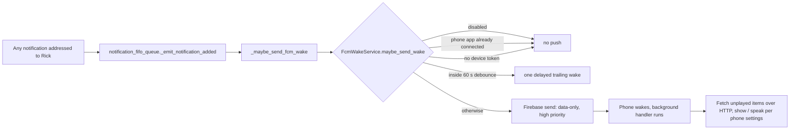

# 2026.09.29 — A global kill switch for Lupin mobile push

Rick, 2026-09-29 ~16:45 EDT, voice, before a walk: *"I want to see if it's possible to have a global kill switch for all Lupin mobile push messages such that while I'm out and about I want to be blissfully unaware and not paying for unwanted pushes that I have then configured my phone to ignore … So a global kill switch — is that possible? How does that work?"*

## Verdict

**Yes, and half of it already exists.** Every mobile push goes through one function on the server, and there is already a master off switch in the INI. What's missing is a way to flip it **without restarting the server**, from the phone or by voice. Firebase pushes are free, so the real cost of an unwanted push is battery, data and the phone waking up, not money.

| Question | Answer |
|---|---|
| Is a global kill switch possible? | Yes. One place in the code sends every push |
| Does one exist today? | Yes: `fcm wake push enabled` in `lupin-app.ini`, but it needs a server restart |
| Does silencing Lupin on the phone stop the pushes? | **No.** The push still arrives and wakes the phone; the app then drops it |
| Am I paying per push? | No money. Firebase Cloud Messaging is free per message, and no paid service is called per push |
| What breaks while it's off? | Questions sent to you while you're phone-only time out and take their defaults, silently |

## 1. How a push happens today

- **One way out.** The only Firebase send is `messaging.send( message, app=app )` at `src/cosa/rest/fcm_wake_service.py:356`. The only path to it is `FcmWakeService.maybe_send_wake` (`fcm_wake_service.py:365–450`), called from the queue hook `_maybe_send_fcm_wake` (`src/cosa/rest/notification_fifo_queue.py:631`) and from the delayed trailing wake, which re-enters `maybe_send_wake`. *(Verified by María: lines 350–356, 408–420, 624–632.)*
- **What triggers it.** Any user-addressed notification added to the queue. Type, priority and `suppress_ding` are **not** consulted (`notification_fifo_queue.py:628`). A broadcast with no `user_id` never wakes the phone.
- **What the push is.** A data-only "wake" (`{type: "ws_wake", reason, ts}`), no visible notification block, Android priority `high` (`fcm_wake_service.py:48–73, 354`). The phone's background handler then refreshes its login, fetches unplayed items over HTTP, shows a local notification and may speak one (lupin-mobile `lib/services/push/fcm_wake_chain.dart`). It does not reconnect the WebSocket.
- **Existing checks, in order** (`fcm_wake_service.py:412–442`): service enabled → skip if the phone app already has a live connection (a web or desktop tab does **not** count) → 60-second per-user debounce → at least one registered device token.

## 2. What already exists to turn it off

| Control | Where | Stops the push? | Catch |
|---|---|---|---|
| `fcm wake push enabled = True` | `src/conf/lupin-app.ini:1744`, read at `fcm_wake_service.py:162` | **Yes, all of them** | Read once at startup: flipping it needs a restart of the notification server |
| Phone app: background notifications off (Gate A) | lupin-mobile `fcm_wake_chain.dart:283–316` | **No** | The push was already delivered and the phone already woke; the app just shows nothing |
| Phone app: per-priority, muted sender, quiet hours, master mute | lupin-mobile `fcm_bootstrap.dart:595–625` | **No** | Same: filters what's shown or spoken after the wake |
| Sign out on the phone | lupin-mobile `fcm_wakeup_service.dart:84–95` | Yes, while signed out | Signing back in re-registers the token on every connection (`fcm_bootstrap.dart:96–104`) |
| APK built without `--dart-define=ENABLE_FCM` | lupin-mobile `fcm_bootstrap.dart:46, 77–78` | Yes, permanently | A rebuild; not a switch |

**Not on the server today:** per-user mute, do-not-disturb, quiet hours, a priority threshold, or anything tied to speakerphone.

## 3. What it costs

- **Money: nothing per push.** FCM is free per message, and nothing in the path calls a paid API. The phone speaks with its own built-in voice (`FlutterTts`), not a cloud one.
- **What an unwanted push does cost:** a high-priority wake of the phone's radio and CPU, a background run of about 30 seconds, three calls back to Lupin (`/auth/refresh`, a fetch of unplayed items, `POST …/played`), and, if the app's own settings allow, a notification or speech.
- **So "configured my phone to ignore them" still pays the battery and data cost**, because the ignoring happens after the wake.

## 4. Recommended design

**A. A live server switch (the core, small).**
- Replace the startup-only read with a runtime flag checked at the top of `maybe_send_wake`, next to `if not self.enabled` (`fcm_wake_service.py:412`). Returning there means zero Firebase calls and no token lookup, and it also stops any already-scheduled trailing wake, because that re-enters the same check.
- Flip it with an authenticated endpoint, for example `POST /api/fcm/wake-enabled {enabled: false, until: "18:00"}` in `src/cosa/rest/routers/fcm.py` (today that router only has register and unregister token).
- Keep the INI line as the default at boot.

**B. A way to reach it while out.**
- A toggle in the phone app ("Pause pushes") and a voice phrase ("go dark", "I'm back") that call the endpoint. The phone can still reach the server over HTTP while pushes are paused; only the server-to-phone wake stops.

**C. Make "off" hard to forget.**
- An optional `until` time, so it turns itself back on.
- Show the paused state where people will see it: in the web UI, and in the response a peer's question gets, so a seat knows why Rick is silent.

**D. Optional later: per user, not per server.** A DB setting checked in `maybe_send_wake`, or folded into the token lookup at `src/lupin_app/main.py:856–860` so it returns no tokens. Only worth it once more than one person uses Lupin mobile.

## 5. What changes while it's off

| Area | Effect |
|---|---|
| Notifications to your phone | Nothing arrives. Items stay unplayed on the server and show up when you open the app |
| Questions sent to you while you're phone-only | They time out after `notification timeout default seconds = 120` and take their default answers, **without reaching you** |
| Questions when you're fully offline | Already return their default immediately; unchanged |
| WebSocket reconnect | Unaffected: nothing depends on the wake to reconnect (`fcm_wake_chain.dart:20`) |
| Tests to update | `src/tests/unit/test_notification_fifo_queue_fcm_hook.py` and the smoke test in `fcm_wake_service.py` |

## 6. Options for you

| Option | Effort | Gives you |
|---|---|---|
| **Today, no code:** set `fcm wake push enabled = False`, restart the notification server | Minutes | Zero pushes until someone sets it back and restarts |
| **Recommended:** A + B + the `until` part of C | A small build, lupin + lupin-mobile | "Go dark until 6" from the phone or by voice, no restart |
| Add D | More | Per-person control, once there is more than one user |

The build belongs to the lupin crew (Mr. Radio) and the lupin-mobile crew (Tiffany). Nothing has been changed yet.

## 7. Claim ledger

| Claim | Status |
|---|---|
| One Firebase send, one gate function, INI master switch read once at startup | VERIFIED by María in the code (`fcm_wake_service.py:158–164, 350–356, 408–420`; `notification_fifo_queue.py:624–632`; `lupin-app.ini:1743–1747`) |
| Mobile-side gates, the fallback-notification rule, token re-register on connect | SOURCED from a read-only code sweep of lupin-mobile, not re-read line by line |
| FCM is free per message | General knowledge of Firebase pricing; not checked against a bill |
| Blocking questions time out silently while pushes are off | SOURCED from the code sweep (`routers/notifications.py:1372+`); not run |
