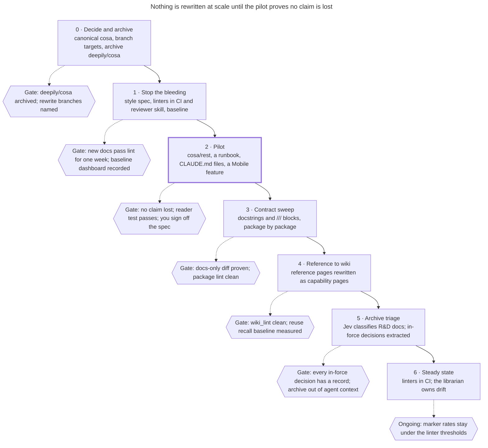
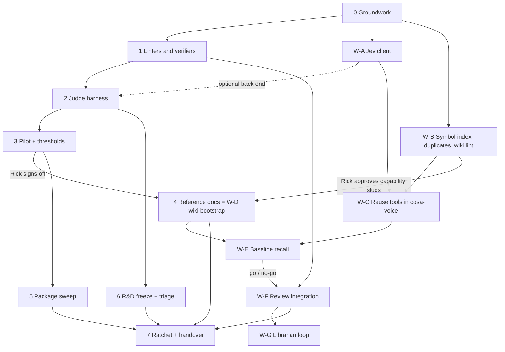

## Rulings of 2026-09-30 (Rick's decision walkthrough): these override anything below that conflicts

Each decision row in §14 is marked **Ruled 2026-09-30**. The rulings below change the plan's shape, so they are stated here once. The build crew applies them wherever the body still reads the old way.

### R.1 Roadmap and phase order (D1)

Rick supplied the spec's lost roadmap, drawn below. Its order, confirmed by Rick's resident expert, replaces the reconstruction in §2:

| Order | Phase | Change from the body |
|---|---|---|
| 0 | Groundwork: census, homes, branches; `deepily/cosa` archived (D13, Rick by hand) | the archive is part of this gate |
| 1 | Linters and verifiers (D2 hybrid) | **no one-week "lint clean" wait**; the per-rule precision/recall floors stay. Rick: "I can't wait. We got work to do." |
| 2 | Judge harness | unchanged; D3 open |
| 3 | Pilot | scope adds **a runbook and the CLAUDE.md files** (the roadmap's pilot) |
| **Before 4** | (a) **reuse recall baseline on the old docstrings** (plan 2 W-E, using the duplicate clusters as the test set); (b) **name the capabilities**: `src/docs/wiki/INDEX.md` of slugs Rick approves, so rewritten `Design:` lines point at `wiki/capabilities/<slug>.md` | new; (a) needs Jev (row `8f70cbac`), so it is on the sweep's critical path |
| **4** | **Package sweep** (the body's Phase 5) | **moved ahead of the reference-doc rewrite** |
| **5** | **Reference docs → capability pages** (the body's Phase 4 = plan 2 W-D pages) | now after the sweep; `src/docs` rewritten once, straight into capability pages |
| 6 | R&D extract-then-archive (see R.4) | reshaped |
| 7 | Ratchet + handover; **the librarian owns drift** | librarian named as owner |

Why the sweep comes first (the expert's reasoning): capability pins ignore docstrings, so pages written from the old docstrings would never be flagged stale; the librarian would absorb the old style; and the reference docs should be rewritten once. The L2 symbol index and the reuse MCP (plan 2 W-B, W-C) have no ordering problem and start now.

### R.2 Sweep mechanics (D16, D8)

- **Merging**: each package passes its own unit tier as a sanity check. Then one train a day (about 11 packages; 77 packages ≈ 7 days) merges into `main` under the **full pyramid** at the end of the day. PR MERGE REQUIREMENTS are unchanged.
- **Writer model**: Sonnet writes docstrings and doc comments by default. Rick may switch to Haiku at the last minute if it proves faster and cheaper at acceptable accuracy. The judge must not be the writer's model grading itself (D3).

### R.3 Plan 2 rulings that touch this plan

E9 **now**: plan 2 indexes lupin-mobile's Dart in W-B, not later. E2 approved, blocked on Rick's Jev setup. E8: a new optional counter-reviewer role in the crew charters.

### R.4 R&D history: relevance and access (replaces D6's advisory rule)

- **Access: deny by default.** Agents read active plans, decision records and capability pages. Every other R&D doc is human history, read by an agent only when a human directs it (for example a post-game).
- **Classification: two outcomes, decided mechanically.**
  - **Active**: the doc's `authorized_by:` names a live ticket, or a live tracked file cites it.
  - **Archived**: neither.
- **Gate before any archive move:** every ruling still in force in the doc is extracted into `src/docs/decisions/` (D4). A model proposes, a reviewer confirms, and the ledger (D5) records the receipt.
- **Enforcement:** archived docs move to a dedicated archive folder covered by `permissions.deny`. Humans still read them in git and the doc viewer.
- **Lifecycle:** a new doc is active while its ticket lives and becomes an archive candidate when the ticket closes.
- **Phase 6 is extract-then-archive.** The judgement is in extraction, not classification, which is where D3's model choice matters.

### R.5 Deliverables produced during the walkthrough

- Jev problem statement for Rick's resident expert: [`2026.09.30-jev-claim-judge-problem-statement.md`](2026.09.30-jev-claim-judge-problem-statement.md).
- lupin-mobile track handed to Tiffany with 2 worker seats (commons topic `handoff-v022-mobile-docs`; her row `b707f92f`).
- Source-spec frontmatter (D12).
- Note: the four plan 2 prototypes are not committable under `src/rnd` (the guard accepts `.md` only). They move out, or into a Markdown wrapper, before commit. The roadmap and both plan 2 diagrams are inlined as mermaid blocks in the plan files, so no `.mmd` file is committed.

### R.5b Mobile track rulings (Rick, 2026-09-30 ~21:50, on Tiffany's M0/M1 findings)

- **The `dart format` check is dropped** from mobile's docs gates. The house style (spaces inside parentheses and brackets) makes 536 of 539 files fail `dart format --set-exit-if-changed`. The house style stays.
- **AC-S1.10:** `test/unit/queue/lane_vocabulary_test.dart` is **converted** to assert behaviour, or the existence of a `src/docs/decisions/` record. The `JobStatus` doc comment drops the bare ID and links the record.
- **M1 approved:** Clayton's Dart standard (lupin-mobile `0fe024e`, `src/docs/docstring-standard.md`) is approved as drafted. Rick: "I read it, it looks good, it's approved."
- **Measured by Tiffany's crew:** mechanism (a) is confirmed, but a directory passes `--fatal-infos` only with **zero infos of any kind**, so each directory is cleaned of other lints before gating (`lib/core/app` has 2 errors today). Three tests always fail because of a missing fixture; one live-probe test fails only intermittently. Tools: `tool/doc_coverage.py`, `tool/check_test_failures.py`.

### R.6 Build requirements from the pre-build spec critique (Tiberius for Cheech's crew, 2026-09-30, lupin `d40ed5cf4`; adopted by Cheech)

The critique found nine blocking gaps; B1–B6 and nits N1–N7 belong to plan 2 (see its Rulings section). These three bind this plan:

- **B7, the D2 hybrid meets ruff reality.** Measured with ruff 0.12.1 on `src/cosa` + `src/lupin_mcp`: **D212 = 8,034 hits, D205 = 1,717, D415 = 917**, because the house style puts the summary on the line after the quotes. Requirements:
  - configure **D213 instead of D212**
  - `--changed` means: run ruff on the changed files, then **filter findings to the line ranges the diff touched**. Ruff has no changed-lines mode, so otherwise one touched file drags in every legacy finding.
  - rule 1's "summary ≤ 90 characters" lives in `doc_lint`, because it isn't a D rule and W505 covers every docstring line
  - ruff (today only in miniconda) and a chosen markdownlint implementation go into declared dev dependencies (`pyproject.toml` / `package.json`). Rick's D2 ruling already approved adding them.
  - gate test: a **missing tool prints a loud warning line, asserted**, never a silent allow-on-crash
- **B8, freeze the lists before labelling.** Phase 0 step 4 (the acronym allowlist, the tic list and the "bare reference" predicate) is frozen by sha **before** the labelling sample is drawn. The labeller labels against the eight rules' text and reports list-driven disagreements as their own column, so precision and recall measure the rules, not list agreement.
- **B9, sample design (§4.3).** Stratify the draw by a signal independent of the linter: line-count bucket, package, and a date or hex literal found by the labeller's own grep. Record the seed; the population is `git ls-files` non-test `.py`. Report Clopper-Pearson per rule, and print "insufficient positives (n<10)" instead of a recall figure.

### R.7 Judge-harness build requirements from the pre-build spec critique (Tiberius for Cheech's crew, 2026-10-01, lupin `a7f2af593`; adopted by Cheech, store row `e982851a`)

The critique found six blocking gaps and six nits in section 5. All are adopted except the choice of model ids, which is Rick's (open). These bind the Phase 2 build and override section 5 where they differ:

- **Model ids (open with Rick).** The extractor, judge and escalation model ids are required configuration with no default in code, and every report records them. The harness refuses to run when the judge id equals the writer id. Changing the writer or the judge after the gate run means rerunning the gate positives.
- **Verdict shape.** A three-value enum, `present` / `absent` / `uncertain`, read by a strict parser. An Opus verdict that is still `uncertain`, and any parse failure, fail closed: the claim is flagged dropped.
- **What a miss is.** A pair is (old text, new text minus claim X). The tester records X as an exact span of the old text. A catch is a claim flagged dropped whose verified quote overlaps X's span; anything else is a miss. Section 5's "seeded into the old text" is wrong: the claim is removed from the new text.
- **Both error directions are reported.** The false-alarm rate on the unseeded pairs is reported beside the false-pass rate. Provisional ceiling: 10% of unseeded pairs flagged; Rick sets the real figure at the Phase 3 sign-off. The seed mix is four kinds: deletions, weakened or negated qualifiers, a claim relocated into the `Design:` doc (must pass), and pure paraphrase (must pass).
- **No leakage.** The labelled set has a dev split and a frozen gate split. Extractor and judge prompts and parsers are frozen by sha before the gate run, and the implementer never sees the gate split. The "after" text of an unseeded pair is real writer-model output. One positive per distinct docstring. A second seat verifies each positive: the claim is absent from the new text and from the linked doc.
- **Extractor variance.** The gate run uses at least two independent extractor lists and the criterion is met on each. A mechanical completeness figure is reported per pair: the share of old-text characters covered by no verified quote.
- **Quote verification.** A stated normalization rule (whitespace, `inspect.cleandoc` dedent, wrapped lines, markdown) and a minimum quote length. The discarded-claim count is reported, and a discarded seeded claim is a miss.
- **Agreement.** Defined per claim: the verdict is identical across all three judge runs. Reported over all claims and over the seeded-removal claims alone, with an interval.
- **Statistics.** The bounds in section 5 are one-sided 95% upper bounds and are labelled so. One miss under 5% needs 94 positives, not about 93.
- **Throughput.** 3,800 calls at 1 to 3 seconds is 1.06 to 3.2 hours; section 5's 1.3 to 4 hours is the 4,795-call total including Phase 6.
- **Ledger key.** (sha of old text, sha of new text, prompt version, model id), so a prompt or model change cannot resume stale verdicts.
- **Injection.** The dev split holds at least three docstrings carrying imperative text aimed at an agent, and a test asserts the verdict is unchanged by it. `tools=[]` stays.

### R.8 Phase 1 exit-gate audit (Tiberius, 2026-10-01, lupin `a7f2af593`; store row `90814a58`)

Phase 1's exit gate is not met. Absent: `prose_judge.py`, `docs_only_diff.py`, `contract_diff.py`, the lupin-mobile warn-mode gate, a committed mutation test per rule, and a recorded fresh-clone gate run. Partial: `doc_metrics` (counts only, no per-package before/after CLI) and the precision/recall report (figures exist only as row amendments; no markdown or Dart sample). Each gap has its own store row under `epic:v022-docs-and-reuse`. The pilot cannot run its six checks until `docs_only_diff`, `contract_diff` and the `doc_metrics` CLI exist.

### R.9 Pilot and sweep requirements from the pre-build spec critique (Tiberius for Cheech's crew, 2026-10-01, lupin `a7f2af593`; adopted by Cheech, store row `18c8a3b2`)

The critique found seven blocking gaps and seven nits in sections 6 and 8. Three blockers and all seven nits are adopted here and override those sections where they differ. Four blockers are Rick's to rule and are listed as open at the end.

- **B1, train size.** The train is the ruled figure (D16, R.2): one train a day, about 11 packages. Section 8's "maximum 8 per train" and "no cadence promised" are superseded. The bisect cost is stated when the train builder is specified.
- **B5, claim rows.** The manager mints the sweep claim rows, not the workers. Every visibility query also asks `status="not_approved"`, because a worker-filed row is held and the default query excludes it. There is one correlation key, `epic:v022-docs-and-reuse`; `epic:docs-rewrite` is retired. A test proves a second claimant sees a held claim.
- **B6, pilot prerequisites and scope.** The pilot rows are blocked on `docs_only_diff` (row `40e69e8f`), `contract_diff` (row `db2800b0`), the `doc_metrics` CLI (row `78f1dc07`) and the judge-model decision (row `4627b1e0`), as well as the review row `e982851a`. The CLAUDE.md pilot works on a scratch copy; nothing reaches the live root file before the Phase 3 sign-off. The runbook is named in row `175982c0` before work starts.
- **N1, phase numbers.** The body headings are renamed to R.1's numbers (sweep = 4, reference docs = 5), including section 2's graph and the figures in sections 5 and 8.
- **N2, failure density.** Defined as `doc_lint --report` findings per docstring at the pinned sha with the frozen rules, committed. Section 8 orders packages by that report.
- **N3, targets.** The section 8 targets were measured at `4564224` with the old rules. They are re-measured at the Phase 0 re-pin.
- **N4, bisect venue.** A bisect re-run is a `:7999` unit run unless the red test belongs to a `:8000` suite.
- **N5, population.** The denominator comes from `git ls-files`, and files in no package are reported.
- **N6, D7 "present".** Defined as an exact normalized match of the claim's quote, or a stated entailment judge. A bare substring check does not count.
- **N7, reviewers.** The sweep states how many reviewer seats it needs. The approver is not the judge's seat.

**Open with Rick** (none blocks the Phase 2 build; each blocks the pilot or the sweep):

- **B2.** When the daily train's pyramid runs. "End of day" falls in his interactive window and then in the hours the host is off.
- **B3.** What a rewritten `Design:` line points at before the capability pages exist: stub pages first, or an interim target with a re-point step.
- **B4. Ruled by Rick, 2026-10-01: zero unwaived.** An author may waive a linter finding with a written reason on the same line. Waivers are counted and reported per package, and the reviewer reads them. Section 8's "zero lint failures" now reads "zero unwaived findings". Held-out precision for R4, R5 and R6 was .84, .63 and .86 (amendments on row `9babe43d`).
- **B7.** Whether the pilot is widened beyond 78 docstrings and one Dart directory, and which models answer and grade the reader test.

### R.10 Capability slugs approved; JavaScript and TypeScript docs revisited at the end of Phase 7 (Rick, 2026-10-01; store rows `7765ea06`, `94daf5b9`)

Rick approved the 29 capability slugs in `src/docs/wiki/INDEX.md` (as committed at `ba406497a`), provisionally, on one condition: the JavaScript and TypeScript docs, ruled out for now in D14, are revisited at the end of Phase 7. His reason: an accurate running record of the current implementation keeps the crew from rebuilding what exists. Phase 7 therefore does not close until Rick has been asked directly whether and when to run a JavaScript and TypeScript docs phase. The condition is recorded on the Phase 7 row `94daf5b9`.

### R.11 Phase 3 sign-off rulings (Rick, 2026-10-05, decision walkthrough between 18:18 and 18:35 EDT; store row `5c1525c6`)

Five rulings, each answered on its own card. They override sections 5, 6 and 8 and ruling D16 where they differ. The pilot itself was ruled a go the same day at 17:33 EDT and is merged at `21698bef3`.

- **Claim checker for the sweep.** Sonnet extracts one claims list. Haiku judges three times with thinking on, and the majority rules. Opus is asked on uncertain verdicts. Eight docstrings run at once. A first card recommended the judge with thinking off; it was withdrawn and re-asked because it left out that setting's results on real losses. Measured 2026-10-04: with thinking on the judge raised 2 of 2 real losses on the 130-docstring trial and 8 of 10 verdicts on the pilot's two known losses; with thinking off, 0 of 2 and 1 of 10. Projected checking time: about 42 minutes a train, about 4.9 hours over seven trains.
- **Pass rule for the checker**, registered before the one gate run. On the gate half of the labelled set (150 pairs: 64 with a planted loss, 86 untouched) the checker must miss none of the 64 and flag at most 10% of the 86. Cheech adds a second condition from the checker ruling: the checker must also raise the four known real losses, two in the pilot and two in the trial, because planted losses proved easier to see than real ones.
- **Linter floor.** Precision of at least .80 on every rule. Recall is reported and not gated. Every scored rule meets the floor at `a7f2af593`; the lowest is the length rule at .80.
- **B2, the daily train.** Cut-off at 9 AM and start at 10 AM. The daily train runs the type check, the style check, the unit tier, the cosa tier, the coverage gate and the integration suite, about 50 minutes, and merges into the working branch. The full twelve-gate pyramid runs once, when the whole sweep is done and before it reaches `main`. This replaces D16's "each train merges under the full pyramid". Rick's words were "only run the full integration test at the very end"; reading that as the full pyramid is Cheech's.
- **B3, the `Design:` line.** A `Design:` line stays only when its target exists. Otherwise the old record is named in prose, and the line is added in Phase 5 when the capability page exists. The pilot did this on the task-store rules module.

Closed without a card: **B7**. The 2026-10-04 trial added 130 docstrings from two more packages to the pilot's 78, and the reader test has run.

Also ruled 2026-10-05: Gemini is not used for the rewrite. The measurements are in `2026.10.04-gemini-rewriter-comparison-plan.md`, section 13.

Not checked at the sign-off: the mobile pilot results (row `b707f92f`) and the one reference page rewritten as a capability page, both named as pilot targets in section 6.

## Cast Manifest (cascade `cascade-v022-docs-and-reuse`)

This cascade reviews this plan and its companion (`../2026.09.30-wiki-and-jev-for-code-reuse-review/2026.09.30-reuse-review-implementation-plan.md`) as one input.

| Role | Persona | Spawn origin | TTS | Recycled? |
| --- | --- | --- | --- | --- |
| Manager | María 🌸 | pre-existing | enabled | — |
| Author | John (`cc-author-maria-1`) | on-demand (`spawn_sessions`) | speakerphone off | — |
| Stage 1 reviewer (usability/reuse) | Tiberius 🌑 (`cc-reviewer-maria-1`) | on-demand | speakerphone off | — |
| Stage 2 reviewer (viability/gap) | Sam (`cc-reviewer-maria-2`) | on-demand | speakerphone off | Also the Step 0 light-reviewer |
| Stage 3 reviewer (ownership language) | Rio (`cc-reviewer-maria-3`) | on-demand | speakerphone off | — |
| Step 9 light-reviewer | chosen at Step 8 (most-impacted section's reviewer) | recycled | recycled | Recycled |
| Workflow Steward | none this run | — | — | — |
| Waker | standing arbiter (`:8001`) plus the Manager's Stop hook | external | n/a | — |

## Pre-cascade recon checklist

Standing rules that bind this review (cast members check findings against them):

| Rule | Source | Applies to this design? | Verification |
| --- | --- | --- | --- |
| 100% line, branch and function coverage | `lupin/CLAUDE.md` lines 402 to 409, 653 | Yes for new lupin code, including `src/cosa` and `src/lupin_mcp`. No for lupin-mobile: its CLAUDE.md names a coverage command but no mandate | Checked 2026-09-30 by grep of both CLAUDE.md files |
| The user is never the tester | `~/.claude/CLAUDE.md` Test Ownership Mandate | Yes, every phase | Stage 3 rubric |
| `src/rnd` holds only authorized `.md` documents, one per ticket per kind | `planning-is-prompting/workflow/rnd-directory-policy.md`; guard `workflow/scripts/rnd_write_guard.py` | Yes: the four `.py` prototypes cannot stay in `src/rnd`; new docs need `authorized_by:` and a distinct `doc_kind` | Guard run on both plans 2026-09-30: allow |
| Path management through `cu.get_project_root()`, no `sys.path` or `__file__` chains outside bootstrap files | `~/.claude/CLAUDE.md` Path Management | Yes: the prototypes violate it (plan 2, section 1.1) | Stage 1 |
| Test venues: `:7999` for short stateless runs; `:8000` scheduled; check `:8000` idle before merging into lupin's main checkout | `lupin/CLAUDE.md` lines 330 to 426 | Yes, Phases 5 and W-C | Stage 2 |
| A `/clear` reloads neither CLAUDE.md nor the MCP server | fleet memory | Yes, Phase 4 and W-C | Stage 2 |
| Merges by the lupin manager; push to origin and outward GitHub actions only on Rick's word | `~/.claude/CLAUDE.md` Manager Spawn/Harvest Autonomy | Yes (D13; D9 resolved) | Stage 3 |
| Plans are planning only; the build belongs to a lupin-resident crew | Rick, 2026-09-30 voice request | Yes | — |
| Rulings Rick gave today | Rick, 2026-09-30: reuse tools merge into the cosa-voice MCP server; lupin-mobile is planned as its own track | Yes (plan 2 section 5; plan 1 section 10a) | Treat as fixed; a finding that contradicts them is a Trigger 6 escalation |

Persona conventions: seats sign with their persona name; DM the Manager with `dm_send` to `maria`; findings go on the section topics `cascade-v022-docs-and-reuse-section-<letter>`.

## Cascade sections

| Section | Content | Decisions reviewed with it | Depends on |
| --- | --- | --- | --- |
| A | Plan 1 header through section 6 (this manifest, recon checklist, facts, combined schedule, Phases 0 to 3) | D1, D2, D3, D4, D5, D6, D11, D12, D13, D15 | none |
| B | Plan 1 section 7 non-capability parts (CLAUDE.md template, reference pages that are not capability pages), sections 8 to 10 and 11 to 15 (Phases 5 to 7, crew, risks, decisions table) | D7, D10, D14 | A (linters, judge, thresholds); D (index and duplicate clusters); E (W-D owns capability pages) |
| C | Plan 1 section 10a (lupin-mobile track) | D8, D9 | A (standard, Dart linter) |
| D | Plan 2 header through section 5 (prototypes, Phases W-A to W-C) | E1, E2, E3, E4, E7 | A (Phase 0 groundwork); A's Phase 2 names plan 2's client only as an optional back end |
| E | Plan 2 sections 6 to 14 (Phases W-D to W-H, crew, risks, decisions table) | E5, E6, E8, E9, E10, E11, E12 | D; A (linters used by the reuse-reviewer skill) |

Order that respects the dependencies: A, D, C, E, B, with a short A and D reconciliation after both clear Stage 1, because A's combined schedule describes D's phases. Ownership of shared work: Phase W-D (section E) owns the capability pages; plan 1 Phase 4 (section B) owns the CLAUDE.md template and the reference pages that are not capability pages. W-D (section E) is the single owner of the capability-page exit gate; plan 1 section 7's exit gate covers only section B's parts.

# Lupin AF documentation rewrite: implementation plan

2026.09.30 · drafted by María (planning-is-prompting seat) for Rick · plan 1 of 2

This plan turns the rewrite spec (`2026.09.30-lupin-af-documentation-rewrite-plan.md`, same folder) into phases a lupin-resident build crew can execute. It keeps the spec's standard and decisions. It adds the build order, the tools and their tests, exit gates, the facts that changed since the spec was measured, and one problem the spec did not foresee: some tests and some runtime code read docstrings. Open decisions are collected in section 14.

Plan 2 (`../2026.09.30-wiki-and-jev-for-code-reuse-review/2026.09.30-reuse-review-implementation-plan.md`) builds the code wiki and the Jev reuse tools. The two plans depend on each other in both directions, so section 2 gives one combined schedule.

Revision 2 folds in the author's own fact-check of revision 1, done before the cascaded plan review, which has not run yet. Its main corrections: the docstring-reading tests, a wrong claim about the `src/rnd` write guard, the cross-plan ordering, data sent to TypeSafe, and the linter home.

## 1. What changed since the spec was measured

The spec measured lupin at `4564224` (2026-09-13). Lupin was at `8420e8b0a` on the morning of 2026-09-30 and has moved since; the build crew re-pins in Phase 0. The largest change is `b113a3a7` (2026-09-23, "Rick's R&D cut: 400 docs removed"), which deleted 398 `.md` files (403 files in total).

| Spec says | Measured 2026-09-30 | Effect on the plan |
| --- | --- | --- |
| Lupin R&D: ~1,420 docs, ~390k lines | 844 docs, ~240k lines in `src/rnd`, plus 40 in `src/cosa/rnd` | Triage is smaller |
| 34 `src/docs` pages | 41 `.md` pages, ~31k lines, 6,165 of them the generated `fastapi/api.md` | Generated pages are excluded |
| 10 runbooks | No runbook directory; 5 runbook-named docs, all under `src/rnd` (one in `v0.2.0/_archive/`) | The runbook template applies to whatever Phase 4 promotes |
| 2 CLAUDE.md, 771 lines | Root 893 + cosa 193 = 1,086 lines, plus two `CLAUDE.local.md` and the Firefox plugin's 41 | CLAUDE.md needs its own template (Phase 4) |
| Pattern 4 example: the tmux runbook | Deleted in `b113a3a7` | Needs a live replacement fixture |
| Mobile at `6e43965` | Measured at `545d6cc`, one commit later. On 2026-09-30 PR #3 merged `wip-v0.1.6-2026.04.16-tracking-lupin-work` into `main`, which is now `cf5be6f`. The work branch is now `wip-v0.2.2-2026.09.30-tracking-lupin`, 0 commits ahead of `main` | None; Phase 0 re-pins |
| Four CoSA modules to confirm | All four deletions confirmed intentional (table below) | The archive step can go ahead on Rick's word |

The two examples that still exist match the spec: `park_reason_is_stale` (`src/cosa/rest/task_store_owed.py:313`) has a 113-line docstring, and `groupByFiler` (`lupin-mobile/lib/features/holding_area/data/holding_area_models.dart:106`) has a 45-line `///` block with the quoted ruling.

`Design:` lines in non-test Python: 32 lines start with `Design:` (27 point into `src/rnd`); counting any occurrence gives 51 (37 into `src/rnd`). The Phase 1 link checker uses the second, wider count. Some targets were removed by `b113a3a7`, and CLAUDE.md already marks those as removed.

The four modules deleted from lupin's copy of CoSA. The shas below are branch-side commits; they reached `main` via squash `8bf71a64b`:

| Module | Deleted in | Reason recorded in the commit |
| --- | --- | --- |
| `memory/file_based_solution_manager.py` | `654f3176a` (2026-08-21) | File-based snapshot backend retired |
| `memory/solution_snapshot_mgr.py` | `654f3176a` | Same commit |
| `memory/lancedb_solution_manager.py` | `b8d204ffc` (2026-08-17) | LanceDB to Postgres backfill utility removed |
| `rest/commons_question_watcher.py` | `756336306` (2026-06-17) | Legacy commons-DM machinery removed; never reached `main` |

Enforcement that exists today:

- No docstring, markdown or marker linter in either repo; no ruff, pydocstyle or markdownlint config.
- Lupin's pre-commit chain (`src/scripts/pre-commit-chain.sh`) runs a secret scan, then the `src/rnd` write guard. New gates are appended to it. The hook is a symlink into the main checkout, so every worktree shares it.
- Lupin-mobile has no pre-commit hook. Its GitHub CI runs `dart format` and `flutter analyze`, and `flutter-ci.yml` triggers on pushes to `main`, `develop`, `feature/*` and `release/*`, and on pull requests to `main` and `develop`. The working branch `wip-v0.2.2-2026.09.30-tracking-lupin` matches none of those push patterns, so CI does not run on it.
- Nothing controls what agents read: no `.claudeignore`, and every `permissions.deny` list is empty.
- Lupin requires 100% line, branch and function coverage for new code (`CLAUDE.md`, lines 402 to 406).

### 1.1 Docstrings that code and tests depend on

The spec's verification treats a docstring-only change as safe once the stripped AST is unchanged. That is not true everywhere in lupin:

- Nine test files read docstrings. One of them, `src/tests/unit/test_park_reason_staleness.py:1103-1109`, asserts that `park_reason_is_stale`'s docstring contains `aa543525`, `OUTSIDE`, `CONTENT CONTRADICTION` and `chase`. Rules 4 and 6 ban three of those four strings, so the spec's own worked example fails this test.
- Tests that read `.py` source text and assert a phrase break on a rewrite the same way, and the nine-file count above does not include them. A rough probe (unit tests that open a `.py` file and assert a string `in` its text) matched 45 files on 2026-09-30, most probably asserting code rather than prose. The Phase 0 census separates the two.
- FastMCP tool docstrings in `src/lupin_mcp/cosa_voice_mcp.py` are the tool descriptions every agent reads. They are prompts, not documentation.
- `cosa_voice_mcp.py:4355` modifies a `__doc__` at runtime, and `src/scripts/delivery-collision-scan.py:414` passes `__doc__` to argparse as help text.

Phase 0 takes a census of these, and verification gains a sixth check: the relevant tests stay green (section 5).

## 2. Combined schedule for both plans

The spec's embedded roadmap ("seven phases in order, each with its exit gate") did not survive the export, so this sequence is reconstructed from the spec's text: linters first, Phase 4 is the code-wiki bootstrap, and durations come from the pilot. Phase 0 is new.

The two plans need each other: plan 1's reference-page order and page format come from plan 2's index and duplicate clusters, and plan 2's reuse-reviewer skill runs plan 1's linters. The graph below is the single schedule for both. Plan 2 phases are prefixed `W`.

| Phase | Goal | Exit gate | Needs Rick |
| --- | --- | --- | --- |
| 0 Groundwork | Facts, homes and branches settled; docstring census | EXECUTOR: HUMAN (design authority): Phase 0 decisions answered | Yes: the decision walkthrough |
| 1 Linters and verifiers | Stop new text adding to the problem | EXECUTOR: AI: precision and recall per rule reported against a floor; warn-mode gate installed. Until Rick sets the floor at the Phase 3 sign-off, the floor check is EXECUTOR: HUMAN (design authority) | No |
| 2 Judge harness | Prove "no claim lost" automatically | EXECUTOR: AI: false-pass rate measured on at least 60 seeded-removal pairs (180 labeled pairs in all). The threshold is EXECUTOR: HUMAN (design authority) | No |
| 3 Pilot | Calibrate thresholds and durations | EXECUTOR: AI: pilot report; reader test passes. EXECUTOR: HUMAN (design authority): sign-off | Yes: sign-off on spec and pilot |
| 4 Reference docs (= W-D) | Rewrite what agents read most | Every in-scope page passes the markdown linter and the claim harness, and the full unit tier is green on the changed tree | Yes: capability slugs (via W-D); pages go to the adversarial reviewer |
| 5 Package sweep | Fix docstring and doc-comment lint failures | Zero failures in swept packages; tests green | No: per-package review |
| 6 R&D freeze + triage | Classify the archive; keep in-force decisions | Every doc classified; decision records written | Yes: docs still marked in force |
| 7 Ratchet + handover | Make the standard stick | Gates blocking in both repos; dashboard live; post-game | No |

Each gate line names who runs it: `EXECUTOR: AI` is run by the crew; `EXECUTOR: HUMAN <reason>` waits for Rick (design authority, or an outward-facing action). Untagged steps are AI. The HUMAN gates in this plan are the Phase 0 decisions, the Phase 3 sign-off, the thresholds Rick sets, D12 and D13.

## 3. Phase 0: groundwork

No code.

1. Re-pin. Record the lupin and lupin-mobile HEAD shas used as the "before" for every metric. For lupin-mobile, also run the full `./flutter.sh test` at the pinned sha, at least 3 times in the real tree, and record the failing-test set, split into always-failing and sometimes-failing tests, committed with the sha. A Stage 2 scratch-copy run gave 2,723 passed and 8 failed at `cf5be6f`, but two failures read files the copy lacked, so whether those 8 are standing failures is unknown until these runs. Later runs compare against the committed set programmatically (a named exit code) and re-run a failing test once before calling it new. `tool/check_ac_g2.py`'s docstring still describes about 44 standing failures under `test/legacy_quarantine/`, a directory that does not exist; that docstring is corrected or flagged. The spec's table stays as the historical baseline.
2. Docstring census (section 1.1). List every test that asserts docstring text (through `__doc__`, `get_docstring` or `getdoc`) and every test that reads `.py` source text and asserts a phrase in it (in lupin-mobile: every Dart test that reads `lib/` text, see section 10a), plus every runtime consumer of `__doc__`, and give each test one disposition: keep-and-update (the wording still matters, so the phrases are updated), convert-to-behaviour, or retire-with-reason (decision D15). Every conversion or retirement is proved by mutation with `src/scripts/falsify.py`: remove the caveat or the behaviour the test guards and name the test that reddens, so a green suite cannot hide a dropped guard. Take the population from `git ls-files`, as `test_every_tracked_python_file_parses.py` does. The census also covers every test that reads a file in scope for Phase 4 (section 7).
3. Live fixtures for each of the six patterns. Pattern 4 needs a replacement for the deleted tmux runbook: either a live page from `src/docs/`, or the old runbook recovered with `git show b113a3a7^:src/rnd/v0.1.9/2026.07.14-tmux-supervise-runbook.md` as a frozen fixture.
4. Define the linter details that must not be invented during the build: the acronym allowlist, the exact tic list, what counts as a bare reference, and how the baseline is counted. Owner: the build crew's implementer drafts; approved in the Phase 0 walkthrough.
5. Settle homes (D2, D4, D5).
6. Give the two source specs `authorized_by:` frontmatter so they can be committed (D12). The `src/rnd` pre-commit guard refuses a newly added doc without it.
7. Archive `deepily/cosa` (D13). The code facts are verified in section 1; the GitHub step is outward-facing and waits for Rick's word. A search found no `.gitmodules` entry and no code or CI reference to the repo; only two live instruction docs mention it (other hits are historical files), so the same change updates `.claude/skills/nested-repo-management/SKILL.md` and `src/cosa/README.md`. The search covers tracked lupin files only, not sibling repos or untracked files. After Rick's go, EXECUTOR: AI checks the result with `gh api repos/deepily/cosa --jq .archived`. EXECUTOR: HUMAN (outward-facing action) for the archive itself.

Exit gate (EXECUTOR: HUMAN, design authority): the Phase 0 decisions (D1 to D6, D12, D15) are answered and recorded in `TODO.md`'s Decisions Log.

## 4. Phase 1: linters and verifiers

The fleet writes about 300 R&D docs a month, so this phase comes first.

### 4.1 Tools

Python 3 with the existing venv, each tool with a CLI and an importable core. The Dart linter is also Python, parsing Dart comment tokens with a small lexer (strings, `//`, `///`, `/* */`), because `dart analyze` has no hook for custom prose rules and lupin-mobile already keeps Python helpers in `tool/`. Dart comments go through that lexer, not `line_classifier`, which has no Dart support. Those two (`build_ac_g2_baseline.py`, `check_ac_g2.py`) are one-off, AC-specific scripts, not a reusable library, so the vendored linter copy is a new directory there rather than an extension of them.

Existing tools are the base, not prior art to ignore. `md_lint.py`'s link and `Design:` path resolver extends `src/scripts/dead_rnd_citations.py` and `check_dead_claims.py`, reusing their regexes and corpus guard (a third resolver would re-live the extension-anchoring bug `dead_rnd_citations.py` documents). `doc_metrics.py` and `comment_lint.py` extend `src/cosa/repo/branch_analyzer/line_classifier.py` and `statistics_collector.py` (and `run_directory_analyzer.py` for per-directory counts). `docstring_lint.py` stays `ast`-based. Phase 1 tests carry over the existing tools' corpus guards.

| Tool | Checks | Output |
| --- | --- | --- |
| `docstring_lint.py` | Mechanical rules on every Python docstring found by `ast`: summary line of at most 90 characters followed by a blank line; no ALL-CAPS words outside the allowlist; no ⚠️ 🔴 ⇒; tic phrases; bare references (a `§` without a path, `row`, `bug` or `task` plus 8 hex, `ruling N`, `ACn`); dated banners; imperative text addressed to a model or agent (for example "ignore previous instructions", "you must", "always call"), since docstrings are read by agents and plan 2's prompt-injection mitigation rests on this rule; preface longer than six lines before `Requires:`; total length over threshold | JSON findings plus a human summary |
| `dartdoc_lint.py` | The same rules over consecutive `///` blocks in `lib/`. It is one shared text-rule module (caps, tics, bare references, banners) with two extractors: `docstring_lint.py` feeds it Python `ast` docstrings, and `dartdoc_lint.py` feeds it Dart `///` blocks. Two separate rule implementations would drift | Same |
| `comment_lint.py` | Banners and CAPS in `#` comment lines | Same |
| `md_lint.py` | Marker rates per 1,000 words (the spec's six columns); templates (runbook sections; reference page at most 1,500 words; capability page at most 40 lines; CLAUDE.md template from Phase 4); every relative link and `Design:` path resolves | Same, plus per-file rates |
| `prose_judge.py` | The rules no regex can check: rule 2 (says only what the signature does not), rule 3 (one idea per sentence, under 25 words), "not X but Y" setups (rule 5), and bold used for emphasis (rule 4). Runs on a Claude model, only on changed text | Findings with the offending sentence |
| `docs_only_diff.py` | Python: stripped AST identical per changed file, naming the first differing node on failure. Dart: every changed token is a comment token | Pass or fail per file |
| `contract_diff.py` | Requires, Ensures and Raises item counts before and after; lists every drop so merges can be declared | Table per function |
| `doc_metrics.py` | Per-package tokens and marker rates, before and after | JSON plus a markdown table |

Each linter has three modes: `--report` (whole corpus), `--changed <base>` (only docstrings or blocks touched since `base`), and `--strict` (non-zero exit on any finding).

### 4.2 Enforcement, as a ratchet

- Lupin: append a gate to `pre-commit-chain.sh` that runs the mechanical linters with `--changed` on staged files. It starts in warn mode. It must allow the commit when the linter itself crashes, as `rnd_write_guard.py` does, because the hook is shared by every worktree and a crashing gate would block every seat. The new gate does not read `PLANNING_IS_PROMPTING_ROOT`: the existing `src/rnd` guard gate silently skips when that variable is unset, and this one must run regardless.
- Lupin-mobile: a pre-commit hook of the same shape, shipped as a committed hook file plus an installer script (or a tracked `core.hooksPath`). Today `../lupin-mobile/.git/hooks` holds only `reference-transaction` and no `core.hooksPath` is set, so a hook file dropped there would live in an unversioned directory and a fresh clone or worktree would run no gate. A CI step waits for Phase 7.
- New R&D docs: `md_lint.py` in warn mode from the same gate, against the 300-a-month inflow.
- `prose_judge.py` is not a commit gate (it makes a model call). It runs in review, from the reuse-reviewer skill (plan 2, Phase W-F).

### 4.3 Tests

- Per rule: at least one passing and one failing fixture from the Phase 0 examples, with at least two elements wherever order or membership is asserted.
- Mutation check per rule: disable it and confirm a test fails.
- `docs_only_diff.py`, `contract_diff.py` and `doc_metrics.py` get their own tests too. `docs_only_diff.py` is the "code unchanged" check, so it is tested with a docs-only diff that must pass and a one-token code change that must fail.
- Baseline check: a sample, labeled by the adversarial-reviewer seat, of at least 200 docstrings and 20 markdown pages from the pinned HEAD. The labeler is blind to the linter's output; a second seat double-labels 20% of the sample and the agreement rate is reported. Labels from a seat that also runs `prose_judge.py` or the claim judge would not be independent evidence of either. The linter's findings are compared with the labels, and precision and recall per rule are reported. A second script written from the same definitions would agree with the linter by construction, so it is not used.
- 100% line, branch and function coverage on every new module in Phases 1 and 2, as lupin requires. Coverage by a canned model response proves nothing, so each module that calls a model also gets one test where the fake returns a verdict that depends on its input, plus a mutation check.

Exit gate: per-rule precision and recall on the labeled sample are reported against a floor Rick sets at the Phase 3 sign-off (EXECUTOR: HUMAN, design authority; until then the floor check is open); the warn-mode gate is installed in both repos and runs in a fresh clone and a fresh worktree of each, checked by making a test commit in a scratch clone that is never pushed and is deleted afterwards (EXECUTOR: AI); tests are green with full coverage.

## 5. Phase 2: judge harness (no claim lost)

0. Billing path: the extractor, judge and Phase 6 triage run as bounded Claude Code jobs (`sdk_query`, `tools=[]`, strict parsers, as in Presentation and Deep Research), which the Max plan covers as already-paid fixed cost. The firewalled `AsyncAnthropic` path bills per token and is not used (`CLAUDE.md` cost model). Bounded CC has no temperature setting, so determinism comes from the steer-plus-strict-parse approach in `podcast_generator/api_client.py` (`_temperature_to_steer`), and the harness checks repeat-run agreement as described under Throughput and scheduling.
1. Claim extractor: lists the atomic claims in old text as JSON. Each claim carries a verbatim quote of the old span it comes from, and Python verifies that the quote occurs in the old text before the judge runs; a claim with an invented quote is discarded. This is the pattern in `src/cosa/agents/dm_quality_judge/judge_v2.py`.
2. Claim judge: for each claim, one yes/no: "Does the new text, or the doc its `Design:` line points to, state this claim?" Confident answers pass; uncertain ones escalate to Opus.
3. Back end: a Claude model by default (D3). Jev is a possible later back end, but it needs its own adapter: plan 2's client returns overlap scores rather than a yes/no, and sending full docstrings and R&D prose to TypeSafe goes beyond the data plan 2 allows to leave the machine.
4. History labels: the harness lists every claim judged dropped, and the author marks each one as history or restores it in the pull request.
5. Reader test (pilot only): a fresh agent answers fixed questions from the old text and the new. A seat that did not write the rewrite authors the questions, at least 10 per pilot target, before the rewrite is read, and writes the answer key from the old text. The grader is blind to which text it is scoring. Each text is run N times (N = 3 to start) and the new text passes if its mean score is at least the old text's. With 10 questions one flipped answer changes the score, which is why the comparison uses the mean over runs.

The six verification checks for any rewrite are then: code unchanged (`docs_only_diff`), no claim lost (this harness), contract clauses preserved (`contract_diff`), metrics improved (`doc_metrics`), tests green, and the reader test during the pilot. Two of them have explicit pass signals. Metrics improved: per package, every marker rate is at or below its "before" value and total tokens are lower. Tests green: zero failures over a named, non-empty list, made of the docstring-reading and source-text-reading tests from the Phase 0 census plus the unit tier of each touched package; unit tiers run on the `:7999` venue, and anything ineligible for `:7999` is scheduled on `:8000`.

Labeled set: at least 180 before/after pairs, of which at least 60 have one claim deliberately removed. The tester seat builds the pairs and chooses the removals, blind to the extractor's output. A miss is defined end to end: a removal seeded into the old text that the extractor and judge together do not flag as dropped, including a claim the extractor never listed. The false-pass rate is measured on those seeded positives, so they are the denominator. The report gives the rate with a 95% (Clopper-Pearson) upper bound. At 20 positives, 0 misses is consistent with a true rate near 14%, which is too wide to decide on; 0 misses in 33 gives 8.7%, and in 60 gives 4.9% (computed 2026-09-30).

Throughput and scheduling. The judge makes one call per docstring, with all of its claims batched, plus one extractor call. Phase 5 alone is about 1,900 docstrings (1,000 + 813 + 98), so extractor and judge come to roughly 3,800 calls, and Phase 6 triage adds about 995 whole-document calls. At 1 to 3 seconds of subprocess start-up per call, that is 1.3 to 4 hours of start-up alone at one call at a time, before model time; the pool runs 3 agentic jobs in Production and Development and 1 in Baseline. The pilot measures the real figure. The harness submits through CJ Flow (`agent router go to claude code`) with `scheduled_at` set inside the off-peak window in `CLAUDE.md` (10 AM to 1 PM is optimal; never the dead window), keeps a resumable ledger so a restart loses no finished call, and counts Opus escalations, which draw on the same plan. Repeat-run agreement: the extractor runs once and its claim list is frozen; the judge then runs three times over that fixed list. The report gives agreement overall and on the seeded-removal claims separately, because an overall figure can hide disagreement on the few dropped claims the harness exists to catch. Agreement measures consistency, not correctness, so it complements the false-pass rate and does not replace it. The starting bar is 95% on both figures, the author's value until the pilot sets it, and it is part of the Phase 2 exit gate. If a run falls below it, the harness batches fewer claims per call, escalates more to Opus, or takes a majority vote of the three runs.

Exit gate (EXECUTOR: AI reports; threshold EXECUTOR: HUMAN, design authority): false-pass rate and upper bound reported against a threshold Rick sets at the Phase 3 sign-off, with repeat-run agreement at or above the bar above. Default if he sets none: zero misses on at least 60 seeded positives (upper bound 4.9%, at or below 5%). One miss in 60 gives 7.7%; the fallback is an upper bound at or below 10%, or a larger set (about 93 positives are needed to get one miss under 5%).

## 6. Phase 3: pilot

Targets:

- Lupin: `src/cosa/rest/task_store_owed.py` and its neighbouring `task_store_*` modules. They hold `park_reason_is_stale`, so the pilot also exercises the docstring-asserting test from section 1.1.
- Lupin-mobile: `lib/features/holding_area/`, which holds `groupByFiler`.
- One `src/docs` reference page rewritten as a capability page.

Steps: rewrite; run the six checks; record agent time per 100 docstrings, the false-pass rate and the before/after metrics; propose linter thresholds from the data.

Exit gate (EXECUTOR: AI writes the report; EXECUTOR: HUMAN, design authority, signs off): the pilot report, written to this folder with `doc_kind: review` (the `src/rnd` guard allows one doc per ticket per kind). Rick approves the spec and the pilot. After that, the adversarial reviewer approves each package or page without a gate back to Rick.

## 7. Phase 4: reference docs to templates (= plan 2, Phase W-D)

This is one body of work with two owners. Plan 2 Phase W-D owns the capability pages (`src/docs/wiki/capabilities/`, the wiki index, the pins, and the conversion of any `src/docs` page that describes a capability). This phase owns everything else in scope below: the CLAUDE.md template and rewrite, and the reference pages that are not capability pages (README, `src/workflow/`, mobile's commands). Neither side writes the other's files. The exit gate below is met only when both halves pass, and the capability-page half includes W-D's own checks (plan 2, section 6): a blind second-seat sample of at least 20 pages with zero false invariants, and zero public symbols without a first docstring line in every package W-D touched.

Inputs: plan 2's symbol index and duplicate clusters (W-B) decide the order, and Rick's approved capability slugs decide the page names.

Scope, lupin: the 41 `src/docs` pages minus the generated `fastapi/api.md` and `fastapi/api.json`; the CLAUDE.md files; `README.md`; `src/workflow/agentic-voice-workflow.md`. The dated working note `src/docs/2026.09.22-pre-september-rnd-deletion-candidates.md` moves out of `src/docs`, to `src/rnd/v0.2.2/` if it carries `authorized_by:` frontmatter and otherwise out of the tree (git history keeps it), and only after a citation search over all tracked files, with no extension list, shows that no live file cites its path. A survey on 2026-09-30 found that it carries no `authorized_by:` frontmatter and that no tracked file cites its path, so the "out of the tree" branch is the live one and the citation search passes today. Phase 6 reuses its held and candidate rows as seed data (section 9); since it may already be gone by then, Phase 6 reads it with `git show <sha>:<path>`, or Phase 4 copies the rows before the move. `src/docs/doctrine/` is history by CLAUDE.md's own description (line 4) and is frozen with the R&D archive.

The eight rules get a durable home: a new page, `src/docs/docstring-standard.md` (reference-page template), is in scope. `CLAUDE.md`, `docstring_lint.py` and the reuse-reviewer skill point to it, because the only other text of the rules is the spec inside `src/rnd/v0.2.2`, which Phase 6 classifies and which D6 asks seats to stop reading.

Scope, lupin-mobile: `CLAUDE.md`, `README.md`, and the 32 `.claude/commands`. For the commands, "linted as prompts" means `md_lint.py` checks marker rates and links only; no command template is added, because `md_lint.py`'s templates (runbook, reference page, capability page, CLAUDE.md) do not fit a command file.

CLAUDE.md template: CLAUDE.md is neither a capability page nor a reference page. It gets its own template: a short standing-rules section, a table of pointers to capability pages and runbooks, and nothing that belongs in history. The existing test `test_the_instruction_files_fit_the_harness_budget.py` enforces a size budget on it, and must stay green. CLAUDE.md is also read by machine, so that test is not the only one at risk: `test_bridge_dir_guard.py` looks for the exact heading `## PR MERGE REQUIREMENTS`; `test_typescript_suite_gate.py` parses the `merge-pyramid-suites` marker, compares it with `ALL_SUITE_COMPONENTS` and checks the numbered gate table; and `deploy/test_merge_gate_root_files_present_in_venue.py` depends on those sections. A formatting pass once lowercased the heading and dropped the marker and reddened the unit tier (2026-09-08). The template keeps those sections verbatim. Those three are not the whole set. The Phase 4 census lists every test that reads a file in scope for Phase 4 (CLAUDE.md, `src/docs/**`, `.claude/**`, the README files, `src/workflow/`), found by path and not only by a grep for the heading and the marker, and those tests are part of "tests green" for Phase 4. Seed list, from a 2026-09-30 survey of the unit tier: seven tests open CLAUDE.md (the three above, the harness-budget test, `test_commit_scope_guard`, `test_loc_analysis_count` and `test_no_bare_pisp_invocation`; the last scans CLAUDE.md, `CLAUDE.local.md`, `.claude/**` and `src/docs/**` for bare planning-is-prompting commands, so a rewritten page that adds one reddens it); and four assert page content (`test_rest_api_reference_marks_retired_doors_gone`, `test_websocket_manager_doc_signature_parity`, `test_cc_transcript_registry_and_docs`, `test_docs_files_router`).

Order: CLAUDE.md first, since every seat reads it at start; then the pages covering the worst duplicate clusters; then the rest.

Live seats: a `/clear` does not reload CLAUDE.md, so a rewritten CLAUDE.md reaches running seats only after a re-spin. The merge announcement says so.

Exit gate (EXECUTOR: AI): every in-scope page passes `md_lint.py` and the claim harness, and the full unit tier (`pytest src/tests/unit/`, eligible for `:7999`) is green on the changed tree, with zero failures. The test census above is not the gate, because the predicate is "tests that fail after the change" and a census built by path cannot see a test that builds its path or walks a directory (17 unit tests name `src/docs` literally). The census stays as the list of tests to run first, for speed, and as the reviewer's checklist.

## 8. Phase 5: package sweep

- Unit of work: one package is one directory's own files (not its subpackages, or `cosa/rest` and `cosa/rest/routers` would overlap); the Dart units are in section 10a. Each package is individually reviewed, in order of failure density from the Phase 1 report. Lupin has 77 packages (`__init__.py` directories under `src`, non-test) and 65 source directories under `src/cosa` alone.
- Merging: every merge into `main` runs the full PR MERGE REQUIREMENTS pyramid, and no docs-only exemption exists (a search of `CLAUDE.md`, `.claude/commands`, the skills and the branch-PR workflow found none). On the documented durations (the E2E halves 2,992.7 s, the TypeScript tier about 8 to 25 minutes, integration last, all serialized on `:8000`; this review did not run them), one pyramid run per package would hold `:8000` for on the order of 100 hours or more, beside every other merge in the fleet, so "merged within a day" cannot be promised. Until Rick answers D16, the default is merge trains: several individually reviewed packages per pull request or train, with one pyramid run per train, and the cadence is the train's, not a day. A train has a maximum of 8 packages (the author's starting value), an ordered package list, and a bisect rule: when the pyramid goes red, the failing test is re-run per package, in list order, and the Phase 0 census attributes it to the package that touched the thing it reads; a package that cannot be cleared leaves the train and the rest re-run. The sweep crew does not merge: the lupin manager merges and schedules `:8000`. Before a merge, verify the venue with `PYTHONPATH=src python3 -m cosa.rest.venue_idle --port 8000` and read its exit code (0 idle, 1 busy, 2 unknown; unknown is not idle), not `pool-status`.
- Approval record: per-package approval is an amendment on that package's `docs sweep: <package>` row, carrying (a) the path of the six checks' output, (b) the reviewer's persona and session id, and (c) the verdict. The approver is not the author, and the train builder (EXECUTOR: AI) refuses a package whose row lacks the amendment. The criterion is that all six checks pass and that the reviewer has written out every claim the harness judged dropped and marked history. A script checks, before the approval is recorded, that each history-labelled claim's destination text (D7: the `Design:` doc or the commit body) is actually present.
- Targets (counts measured at `4564224` by the spec; Phase 0 re-pins them): roughly 1,000 overlapping first-line failures, 813 long prefaces and 98 docstrings over 40 lines in lupin; 56 `///` blocks over 20 lines in lupin-mobile; flagged `#` lines in the same pass.
- MCP tool docstrings and other runtime `__doc__` consumers are handled as decided in D15, not swept blindly.
- Rulings quoted in code become one-line decision records (D4), and the code links to them.
- Each pull request carries the six checks' output.
- Collision control: the lock is a task-store row per package (title `docs sweep: <package>`, `correlation_key` `epic:docs-rewrite`, since the store rejects keys that do not start with `epic:`), backed by a branch per package (`docs/<package>`), which git refuses to create twice. Branch creation is the authority: `git branch docs/<package>` refuses a duplicate in the shared ref store, and the row is the visibility. `task_query` has no title filter, and parked rows are hidden by default, so the sweep and plan 2's W-D step 5 each query `correlation_key="epic:docs-rewrite"` with `terse=True` and `include_parked=True` (status unset) and match the title on the client side. The crew confirms against the store that a second claimant sees a parked claim. Claim rows are created one at a time, at claim time, not up front, because the store's closed-versus-new ratio gate is on (`task flow ratio enforcement active = True`, 24-hour window) and dozens of new rows against few closed ones would be refused. A claimed package is merged on its train (see Merging above). Before merging into lupin's main checkout, the lupin manager runs the idle check in the Merging bullet, since `:8000` serves that checkout.

Exit gate (EXECUTOR: AI): zero lint failures in every swept package; tests green; per-package adversarial approval recorded as in the Approval record bullet. D16 is answered, or defaulted to option 1 on an explicit date that the lupin manager records in `TODO.md`'s Decisions Log, before the first sweep merge.

## 9. Phase 6: R&D freeze and triage

1. Classify every doc in `src/rnd` (844), `src/cosa/rnd` (40) and lupin-mobile `src/rnd` (111) as in force, superseded or history. The classifier sees whole documents, so it runs on a Claude model unless Rick approves sending R&D prose to TypeSafe (D3). Uncertain calls escalate to Opus; anything still in force goes to Rick in one batch. The repo already holds a worked precedent with recorded mistakes: `src/docs/2026.09.22-pre-september-rnd-deletion-candidates.md`, a census whose Gate 0 re-ran a citation search over every tracked file and restored two docs that a first pass had deleted because it skipped `.css` and `.md` citers. Its Gate 0 (search all tracked files, no extension list) is a required step before anything is frozen or excluded, and its held and candidate rows are seed data for this phase, not a second census. Gate 0 is code: a script over all tracked files makes "history" impossible for a doc that a live file cites. The classifier is validated on the precedent census rows (its 15 held docs and the 2 restored docs must not be classed history, since the first pass there restored 2 of 73 deleted docs), and a second seat that has not seen the classifier's output labels a blind sample from each class.
2. Record the classification (D5). The spec's option, an `archived:` frontmatter line in each doc, is allowed by the write guard, which governs only file creation and lets edits to existing docs through. Its cost is a 995-file diff that collides with any open branch touching those docs. The alternative is one ledger file outside `src/rnd`, because the `src/rnd` write guard governs file creation there (frontmatter, `.md` only). In lupin the ledger is `src/docs/rnd-ledger.tsv`, with the columns path, class, reason, date and the sha classified at, covering `src/rnd` and `src/cosa/rnd`. Lupin-mobile's ledger lives in the mobile repo, at a path under its own docs directory that its crew picks. `src/rnd/README.md` stays the human index of the docs and links to the ledger (an edit to an existing doc, which the guard allows), so there are not two indexes. Under `src/rnd`, 147 tracked files are not `.md` (assets, audio, scripts, JSON): they are out of scope for the classification and follow the classification of the `.md` document that owns their folder.
3. Turn in-force decisions into decision records and repoint the `Design:` lines that cite them. `md_lint.py` reports links that already point at removed docs.
4. Keep history out of agent context (D6). Nothing does this today: there is no `.claudeignore` and every `permissions.deny` list is empty, so what ships is a read rule in `CLAUDE.md` plus the ledger, and enforcement is advisory until a dedicated archive path can take a `permissions.deny` rule.
5. Leave `history/`, `todo-history/` and the mobile equivalents as they are, excluded from agent context by the same mechanism.

Exit gate (EXECUTOR: AI except the approval): every doc classified; in-force items approved by Rick (EXECUTOR: HUMAN, design authority); decision records written; the exclusion artifacts checked by a unit test that asserts `CLAUDE.md` carries the read rule and the ledger file exists, and that the ledger covers every doc in the three corpora, with the population derived from `git ls-files` (a test over "every classified doc" would be circular, since a classified doc is in the ledger by construction). A doc added after the ledger's sha gets the default class `new`, treated as in force until the next sweep, and the test requires coverage only of docs present at that sha, so it stays green when a seat adds a doc between sweeps.

## 10. Phase 7: ratchet and handover

- Flip the pre-commit gates to blocking with the Phase 3 thresholds, in both repos, keeping the allow-on-crash behaviour. A gate that blocks and a gate that never fires look alike, so each repo gets a scratch-clone demonstration (never pushed, deleted afterwards; EXECUTOR: AI, exit codes recorded): a seeded violation is refused, and an injected linter crash is allowed with a loud line.
- Publish the per-package before/after dashboard, with the spec's marker table as the "before" row. "Live" means a generated markdown page, `src/docs/doc-metrics-dashboard.md`, written by `doc_metrics.py` and regenerated at gate time by that script (not by a tick: the W-G tick lands later, the fleet ticks are paused, and the host is often off overnight). The gate checks that the page has a row per swept package, each "after" value at or below its "before" value.
- Point both CLAUDE.md files at the eight rules in `src/docs/docstring-standard.md` (section 7) in one line each, within the harness budget.
- Hand ongoing enforcement to the reuse-reviewer skill (plan 2, W-F).
- Post-game in this folder with `doc_kind: post-game`.

Exit gate (EXECUTOR: AI): gates blocking, shown by the scratch-clone demonstrations above; dashboard regenerated with a row per swept package; post-game written.

## 10a. The lupin-mobile track

Lupin-mobile is a different job, not a smaller copy of the lupin job, so it runs as its own track with its own crew. The phases above name mobile items for completeness; this section is where mobile is planned.

Ownership: the mobile track runs under the lupin-mobile manager (Tiffany) and that crew's seats, not lupin's. Starting it is Rick's word (a cross-project spawn), and work inside `../lupin-mobile` runs from those seats. M2 doubles as plan 1's Phase 3 pilot for mobile: the mobile crew runs it, and the lupin pilot owner reports its results into the pilot report. Gate tags: M0, M2, M3 and M4 are EXECUTOR: AI; M1's approval and the D8 number are EXECUTOR: HUMAN (design authority).

How mobile differs:

- Language and conventions: Dart and Flutter, governed by Effective Dart and `flutter_lints`, not PEP 257. It has no Requires/Ensures habit: 275 `Ensures:` in 2,719 `///` blocks, about 10%.
- Coverage is the bigger problem than tone. Lupin's docs are too long; mobile's are mostly absent. 2,719 doc blocks across 75k lines of `lib/` suggests most public members have no `///` at all, and the blocks that do exist are the loudest corpus measured (34.7 CAPS words per 1,000).
- Tooling: the analyzer has a built-in `public_member_api_docs` lint, which is not enabled today, and it reports at info level. CI runs `flutter analyze --no-fatal-infos`, and the repo's analyze baseline is already noisy (`analysis_options.yaml` records 981 issues, 244 errors, at `20c0c17` on 2026-09-19), so making infos fatal repo-wide is not possible. Two mechanisms can enforce doc presence per swept directory: (a) a nested `analysis_options.yaml` in each swept directory that enables the rule, plus a CI step that analyzes that directory with infos fatal; or (b) a `tool/` script that counts the rule's hits per directory against a committed baseline, in the shape of `check_ac_g2.py` (exit 0, 1 or 2). The crew verifies one of them in M0, and the M3 gate names the one chosen. Prose rules still need the Python linter from Phase 1.
- Verification: no AST-equality check exists for Dart, so the comment-token check from Phase 1 carries more of the load, backed by `./flutter.sh test` as the merge gate. "Green" means no failure outside the failing-test set recorded at the pinned sha in Phase 0 (at least 3 runs, always-fail and sometimes-fail split, compared programmatically), so a docs-only regression can be told from a pre-existing red or a flaky test. Dart tests that read `lib/` text are also in scope of the Phase 0 census (section 3, step 2): `test/unit/queue/lane_vocabulary_test.dart` reads the `///` block above `enum JobStatus` in `lib/shared/models/job.dart` and asserts it contains `AC-S1.10` and a disposition phrase, which the rules ban, so the M3 sweep of `lib/shared` would redden it; `single_dispatcher_test.dart` (line 167) and `focus_app_wiring_test.dart` (line 201) also read `lib/` files, and whether they assert prose or only code is settled by the census. Each gets one disposition (keep-and-update, convert-to-behaviour, retire-with-reason), proved by mutation (delete the disposition text and name the test that reddens), done in M0, before M3 reaches `lib/shared`. `dart format --set-exit-if-changed` (a CI step today) is added to the Dart checks, since nothing else in the six checks runs it.
- Branching: work happens on `wip-v0.2.2-2026.09.30-tracking-lupin`, which is 0 commits ahead of `main` (`cf5be6f`) since PR #3 merged the old working branch on 2026-09-30 (D9 resolved).

Mobile phases:

| Phase | Work | Exit gate |
| --- | --- | --- |
| M0 Measure | Enable `public_member_api_docs` in a scratch options file, run `./flutter.sh analyze` on the chosen directories and bucket the findings by path (no hand-written Dart member counter); run `dartdoc_lint.py --report` on existing blocks; verify one enforcement mechanism from the Tooling bullet. The baseline covers every top-level `lib/` directory, not only `lib/features/`. The main checkout has no `.dart_tool`, so `flutter pub get` runs first. A scratch-copy trial at `cf5be6f` (2026-09-30) found 4,914 undocumented public members in `lib/`: `features/*` 1,958, `core` 1,419, `services` 1,322, `shared` 209, `ui` 3. It also showed mechanism (a) working: a nested `analysis_options.yaml` that includes the root one makes `dart analyze --fatal-infos` fail only that directory | EXECUTOR: AI: coverage and marker baseline per top-level `lib/` directory and per feature directory, produced from parsed analyzer output and committed with its sha (the counts above are point-in-time at `cf5be6f`); the chosen mechanism shown to work in the real tree with two controls and their exit codes recorded (a directory with known hits fails `--fatal-infos`; a directory with none passes); whether mobile is `dart format` clean today recorded (if not, that CI step is red whatever the sweep does); the Dart source-reading test census done with dispositions |
| M1 Standard for Dart | Adapt the eight rules to Effective Dart: `///` summary sentence, blank `///`, at most four lines of why, `Design:` path; decide where Requires/Ensures is required (D8) | EXECUTOR: HUMAN (design authority): standard page approved with plan 1's pilot sign-off; the page lives in the mobile repo, at a path the mobile crew picks in M1 and `CLAUDE.md` there points to |
| M2 Pilot | `lib/features/holding_area/`: rewrite the loud blocks (including `groupByFiler`) and write missing docs for its public API | EXECUTOR: AI: six checks pass; `./flutter.sh test` shows no failure outside the set recorded in Phase 0; zero `public_member_api_docs` hits in `holding_area` (45 today) under a provisional nested options file, pending D8 |
| M3 Sweep | Per sweep unit, worst first: fix failing blocks, then fill missing public docs. The sweep units are the feature directories and also `lib/core`, `lib/services` and `lib/shared`, which hold 2,953 of the 4,914 undocumented public members (60%); a unit left out is stated as out of scope with the reason | EXECUTOR: AI: zero lint failures and the agreed coverage target per swept directory, enforced by the mechanism M0 chose |
| M4 Ratchet | Turn `public_member_api_docs` on for swept directories; the committed pre-commit hook and installer from section 4.2 switch to blocking, and the hook runs three things: `dartdoc_lint.py --changed`, a `tool/` script that checks ignores (it rejects `// ignore_for_file: public_member_api_docs` and any `// ignore: public_member_api_docs` without a same-line reason, reports ignores per directory, and has a test with a positive control), and `dart analyze --fatal-infos` on each swept directory the commit touches. A CI step per swept directory (`flutter analyze --fatal-infos lib/<directory>`) is required, not optional, because it is what catches a `--no-verify` bypass at the pull request. It requires that directory to have zero infos of any kind first (repo-wide, `lib/` has 233 errors and 80 warnings today, so a repo-wide step would be red whatever the sweep does). CI runs only on pushes to `main`, `develop`, `feature/*` and `release/*` and on pull requests to `main` and `develop`, so the pre-commit hook is the only gate before the pull request | EXECUTOR: AI: gates on, shown by a scratch-clone demonstration (never pushed, deleted afterwards): a deliberately undocumented public member added to a swept directory is refused by the hook and fails the CI command, and both exit codes are recorded; coverage does not regress |

Mobile's reference docs (CLAUDE.md, README, the 32 commands) and its 111 R&D docs stay in plan 1's Phases 4 and 6, since those are the same kind of work in both repos.

Because missing docs are the larger share, mobile's effort is closer to writing than to trimming, and the pilot's time-per-100-blocks number from lupin does not transfer. M2 measures its own.

## 11. Crew and review model

- Build crew: a lupin-resident manager with the standard implementer, reviewer and tester crew (`/spin-up-swe-team`). This planning seat does not build.
- Tools in Phases 1 and 2 go through the usual implement, adversarial review and test gate.
- Rewrites in Phases 4 and 5 are reviewed by an adversarial reviewer holding the six checks' output, who approves per package after the pilot sign-off, recorded as in section 8 (an amendment on the package's row).

## 12. Risks

| Risk | Mitigation |
| --- | --- |
| A rewrite breaks a test or a runtime use of `__doc__` | Phase 0 census; "tests green" as a verification check; D15 |
| Sweep pull requests collide with fleet work | One claim row and one branch per package; merged on trains with a size cap and a bisect rule (D16 default), so no cadence is promised |
| The claim judge passes a dropped claim | At least 180 labeled pairs, of which at least 60 are seeded removals, reported with a 95% upper bound; Opus escalation; history labels |
| A crashing linter blocks every seat's commits | The gate allows the commit on internal error |
| Linters flag legitimate text | Allowlists from Phase 0; warn mode until Phase 3 thresholds |
| Rewritten CLAUDE.md does not reach live seats | Announce that a re-spin is needed, and check it: an AI seat compares each live seat's session start time with the merge time (from `list_spawned_sessions`) and records the stragglers |
| Docs or R&D prose sent to TypeSafe without approval | Claude back end by default; Jev only after D3 |
| Merging while the `:8000` venue runs a job | The lupin manager runs `PYTHONPATH=src python3 -m cosa.rest.venue_idle --port 8000` before each merge and reads its exit code (2 is not idle) |

## 13. Doc kinds this plan will add under its ticket

This plan (`doc_kind: plan`), the pilot report (`review`) and the post-game (`post-game`). Each is a separate kind, as the `src/rnd` guard requires.

## 14. Decisions for Rick

The recommendation is listed first; the walkthrough adds pros and cons for each option.

| # | Question | Recommendation |
| --- | --- | --- |
| D1 | **Ruled 2026-09-30: resolved: Rick supplied the original roadmap (drawn in Rulings §R.1); see Rulings §R.1.** The spec's roadmap was lost in the export. Accept the reconstruction in section 2, or paste the original? | Accept; paste the original if it differs materially. Alternative: pause until the original is recovered. Default if unanswered: accept the reconstruction |
| D2 | **Ruled 2026-09-30: hybrid inside cosa: ruff docstring rules, markdownlint and the Dart analyzer for structure; `src/cosa/repo/doc_lint/` for rules 3 to 7 and the length caps only.** Where do the linters live? | In lupin, in `src/cosa/repo/doc_lint/`: it is a package inside the coverage frame, beside the `line_classifier` it extends, with thin `src/scripts` wrappers for the CLI. Alternative: `src/scripts/doc_lint/`, which needs its own `source` entry in `pyproject.toml` (that file lists `src/scripts` subdirectories one by one, none has an `__init__.py`, and `test_coverage_frame_completeness.py` fails otherwise) and is reachable from tests only by `sys.path` insertion. Lupin-mobile vendors a copy in `tool/` with a drift check. The drift check is a lupin unit test that asserts the sibling `../lupin-mobile` exists and that its loop found files, so it cannot pass vacuously where the sibling is absent (CI, some worktrees); the alternative is to hash-pin the vendored copy inside lupin. The vendored modules are the stdlib-only ones (the rule core and `dartdoc_lint.py`) and import no `cosa.*` code, since `line_classifier.py` imports `.exceptions` from inside `cosa` and cannot be vendored as is. Hosting them in planning-is-prompting would share one copy, but lupin's coverage mandate does not reach that repo, mobile CI cannot fetch it, and the pre-commit chain skips its gates when `PLANNING_IS_PROMPTING_ROOT` is unset |
| D3 | **Ruled 2026-09-30: deferred until Rick's Jev evaluation (`2026.09.30-jev-claim-judge-problem-statement.md`, this folder).** Model for the claim judge and the R&D triage | Claude by default, through bounded Claude Code (`sdk_query`, `tools=[]`, strict parsers; Max-plan fixed cost), not the per-token firewalled SDK; Phase 6 triage inherits this. Jev only if you approve sending full docstrings and R&D prose to TypeSafe, which is more than plan 2 sends |
| D4 | **Ruled 2026-09-30: `src/docs/decisions/` in each repo.** Home for decision records | `src/docs/decisions/` in each repo: it follows lupin's layout and is inside the doc viewer's allowed prefix. Alternatives: a root `docs/decisions/`, or `TODO.md`'s Decisions Log (4,580 lines today) |
| D5 | **Ruled 2026-09-30: one ledger file per repo.** How R&D triage results are recorded | One ledger file outside `src/rnd` (`src/docs/rnd-ledger.tsv` in lupin, a matching file in the mobile repo): no 995-file diff. The spec's `archived:` frontmatter is allowed by the guard and is self-describing, at the cost of that diff |
| D6 | **Ruled 2026-09-30: superseded by the R&D access ruling (Rulings §R.4): deny by default, enforced on a dedicated archive folder.** How history is kept out of agent context | A CLAUDE.md read rule plus the ledger now, checked by a unit test for the artifacts and stated plainly as advisory; a `permissions.deny` rule only for a dedicated archive path later, since a blanket deny on `src/rnd` breaks `Design:` links |
| D7 | **Ruled 2026-09-30: `Design:` doc when one exists, else the commit message; script-checked.** Where history lives (spec open question) | The `Design:` doc when one exists, otherwise the commit message. `history.md` stays for session narrative. The harness lists every history-labelled claim with its destination, and a script checks that the destination text is present before a package's approval is recorded (section 8) |
| D8 | **Ruled 2026-09-30: zero gaps per swept directory; Sonnet writes, Rick may switch to Haiku at the last minute.** Dart contracts across the public API, or only where behaviour is not obvious? And what doc-coverage target for mobile's public API? | Contracts only where behaviour is not obvious. Coverage target: zero `public_member_api_docs` hits per swept directory, enforced by a nested `analysis_options.yaml` (mechanism (a) in section 10a), with `// ignore: public_member_api_docs` allowed only with a same-line reason. The analyzer rule counts members, not a percentage, so a partial target (for example 80%) needs the alternative, mechanism (b): a `tool/` script against a committed baseline file. Rick sets the target at the M1 sign-off (EXECUTOR: HUMAN, design authority). Default if unanswered: zero hits. The `ignore` check in M4 is what stops the bar being met by comment rather than docs |
| D9 | Bring lupin-mobile `main` up to the working branch before the sweep? | Resolved 2026-09-30 by PR #3, no decision needed. `main` is `cf5be6f`; the work branch `wip-v0.2.2-2026.09.30-tracking-lupin` is 0 commits ahead |
| D10 | **Ruled 2026-09-30: the spec's model.** Sign-off model | As the spec says: you approve spec and pilot, then the adversarial reviewer approves per package, recorded as an amendment on the package's row (section 8). Alternative: you also approve the first package in each of Phases 4 and 5. Default if unanswered: the spec's model |
| D11 | **Ruled 2026-09-30: leave the spec as is.** Update the spec's stale numbers? | Leave the spec as the record of its measurement; section 1 carries the corrections. Alternative: edit the spec's numbers in place. Default if unanswered: leave the spec unchanged |
| D12 | **Ruled 2026-09-30: yes; done 2026-09-30 (frontmatter on both specs).** The two source specs need `authorized_by:` frontmatter before they can be committed | Add `authorized_by: task:<ticket>` and `doc_kind: spec` to each; María does it on your word (EXECUTOR: HUMAN, design authority) |
| D13 | **Ruled 2026-09-30: Rick archives by hand; tracked on María's board (row `4dd922cc`), verified via the public GitHub API.** Archive `deepily/cosa` on GitHub | Yes; all four deletions verified intentional. Waits for your direct go (EXECUTOR: HUMAN, outward-facing action); the crew then checks the result with `gh api repos/deepily/cosa --jq .archived` |
| D14 | **Ruled 2026-09-30: out for now.** JavaScript and TypeScript docs are outside the spec. Keep them out? | Out of this plan; revisit after Phase 7. Alternative: add a JS/TS docs phase after Phase 4. Default if unanswered: out of scope |
| D15 | **Ruled 2026-09-30: per-test disposition with mutation proof; MCP tool docstrings reviewed as prompts.** Tests that assert docstring text or source-file text, and docstrings used at runtime (MCP tool descriptions, argparse help) | Give each test one disposition from the Phase 0 census: keep-and-update, convert to behaviour, or retire with a reason, in the same pull request as the docstring. Each conversion or retirement is proved by a `falsify.py` mutation that reddens a named test, since some guards (`test_park_reason_staleness.py`) pin a caveat that has no behaviour to assert. This covers tests that read `.py` source text, not only `__doc__`. Treat MCP tool docstrings as prompts under their own review, outside the sweep |
| D16 | **Ruled 2026-09-30: daily train: each package passes its unit tier, then one train (about 11 packages) a day merges under the full pyramid; no rule change.** How do the Phase 5 sweep pull requests merge, given that every merge into `main` runs the full merge pyramid (about 100 hours or more of `:8000` time if each of 77 packages merges alone)? | Option 1 (default if unanswered, within the current merge rules): merge trains, several individually reviewed packages per pyramid run. Pros: no change to your merge rules; cons: a larger blast radius per merge and a slower cadence than one package per day. Option 2: a docs-only subset of the merge requirements (typecheck, unit, cosa, coverage, plus `docs_only_diff.py` on every changed file). Pros: fast, matches what changes; cons: it changes your PR MERGE REQUIREMENTS, so only you can rule it, and a docstring edit that breaks a test the subset skips would land |

## 15. Sources

- Source spec: `2026.09.30-lupin-af-documentation-rewrite-plan.md` (this folder).
- Companion plan: `../2026.09.30-wiki-and-jev-for-code-reuse-review/2026.09.30-reuse-review-implementation-plan.md`.
- Measured on 2026-09-30 at lupin `8420e8b0a` and lupin-mobile `545d6cc` by read-only surveys of both trees and their git history, then fact-checked at lupin `22f08db93`.
- `src/rnd` write guard: `planning-is-prompting/workflow/scripts/rnd_write_guard.py` (creation is governed at lines 386 to 389; removal of an existing authorization at lines 606 to 619).
