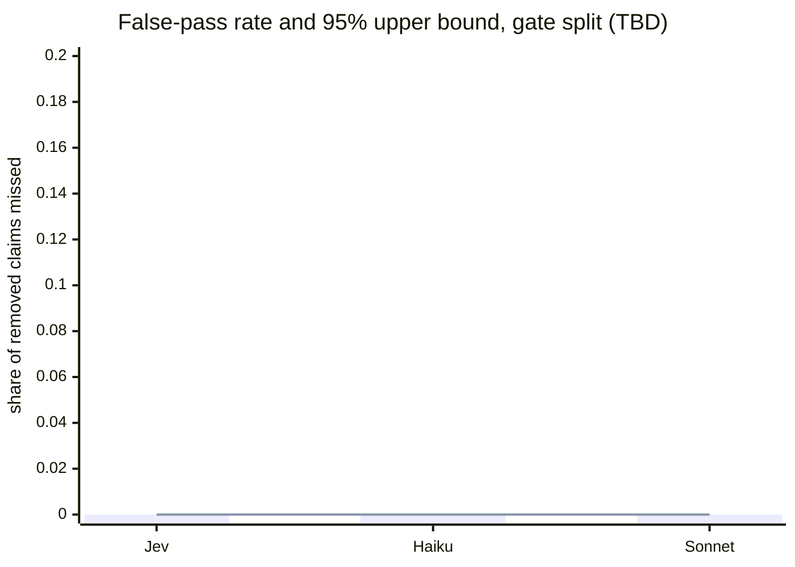
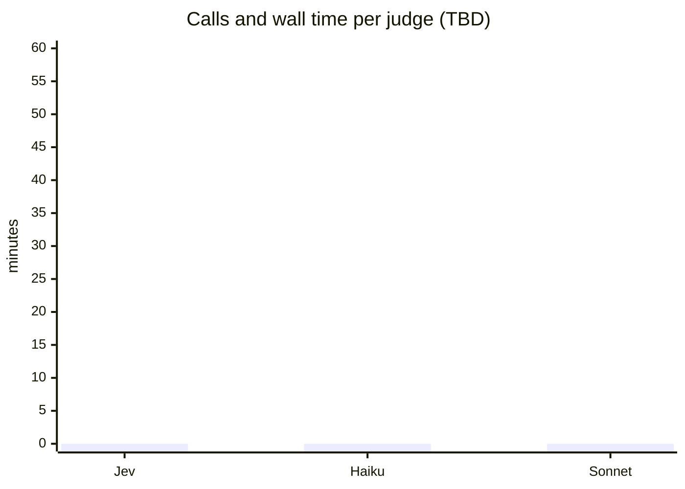

# Claim judge comparison: Jev, Claude Haiku and Claude Sonnet

This report compares three models as the "no claim lost" judge of the docstring rewrite. It recommends one; Rick chooses (decision D3). Nothing in it is measured yet: each `TBD` below is filled from one run's JSON and nothing else.

## 1. Problem statement

*Fill from `2026.09.30-jev-claim-judge-problem-statement.md` sections 1 and 2; do not restate the Jev interview questions (section 6 there).*

- What the judge decides: for each claim the extractor lists from an old docstring, does the new docstring (or the design doc its `Design:` line points to) still state it. Yes, no, or uncertain.
- The error that matters is the **false pass**: a removed claim judged still present. The error that costs time is the **false alarm**: an unchanged claim judged dropped.
- The three judges, one extractor, one escalation model, one writer. All pinned ids go in the table in section 3.
- Data that leaves the machine, and what is approved: docstrings, claim sentences and the set's generated `linked_doc` texts only (row 0fc47c13).

## 2. Narrative summary

*Written last, 5 to 8 sentences, plain English, no figure that is not in section 3.*

- Which judge missed fewest removed claims, and the bound on that.
- Which raised fewest false alarms.
- The cost of each in time and calls, and how often each needed the escalation model or gave no answer.
- The one-line recommendation and the one reason it could be wrong.

## 3. Results

### 3.1 What was run

| item | value |
|---|---|
| gate pairs | 150 (TBD: seeded n, unseeded n) |
| pairs file sha256 | TBD (the `--frozen-pairs-sha`) |
| code sha of the harness | TBD |
| extractor prompt version, judge prompt versions | TBD (the `--frozen-versions`) |
| Jev | `jev-1.13.0`, thresholds `t_lo`, `t_hi` = TBD (frozen by Sam on dev) |
| Haiku | `claude-haiku-4-5-20251001` |
| Sonnet | `claude-sonnet-5-5` |
| extractor / escalation / writer | `claude-sonnet-5-5` / `claude-opus-5-5` / TBD |
| extractor lists per pair, judge runs per list | 2 / 3 (Claude), 2 / 1 (Jev) |
| run date, host, who ran it | TBD (a seat other than Sam) |

### 3.2 Headline figures, dev and gate in separate columns

| judge | split | seeded n | false passes | false-pass rate | 95% upper bound | unseeded n | false alarms | false-alarm rate | 95% interval | agreement, all claims | agreement, seeded claims |
|---|---|---|---|---|---|---|---|---|---|---|---|
| Jev | dev | TBD | TBD | TBD | TBD | TBD | TBD | TBD | TBD | TBD | TBD |
| Jev | gate | TBD | TBD | TBD | TBD | TBD | TBD | TBD | TBD | TBD | TBD |
| Haiku | dev | TBD | | | | | | | | | | |
| Haiku | gate | TBD | | | | | | | | | | |
| Sonnet | dev | TBD | | | | | | | | | | |
| Sonnet | gate | TBD | | | | | | | | | | |

Rates come from `harness_report.build_report` (`lists[slot]`): one row per extractor list, so the table reports the worse list and names it. Bounds are Clopper-Pearson: one-sided 95% upper for false passes, two-sided 95% for the rest.

### 3.3 By pair type

Five pair types: delete, weaken, relocate, paraphrase, injection. `harness_report` does not split by type, so this section needs the per-pair results rejoined with the keys file's pair type (see "Open dependencies" below).

| judge | pair type | n | expected verdict | wrong verdicts | rate | 95% bound |
|---|---|---|---|---|---|---|
| Jev | delete | TBD | flagged | TBD | TBD | TBD (upper, one-sided) |
| Jev | weaken | TBD | flagged | | | |
| Jev | relocate | TBD | not flagged | | | |
| Jev | paraphrase | TBD | not flagged | | | |
| Jev | injection | TBD | TBD (set owner to state) | | | |
| Haiku, Sonnet | the same five rows each | | | | | |

Delete and weaken are false-pass rows. Relocate and paraphrase are false-alarm rows (the expected answer is "not flagged"). The expected answer for injection is not in the code; it is stated by the set's owner before this table is filled.

### 3.4 Charts (Mermaid, generated from the run JSON, never typed by hand)

Chart 1, false-pass rate and its upper bound, per judge, gate split:

Chart 2, false-alarm rate and interval upper end, per judge, gate split. Same shape.

Chart 3, false-pass rate by pair type for delete and weaken, three bars per type (one per judge). Chart 4, false-alarm rate by pair type for relocate, paraphrase and injection, same layout. Mermaid has no error bars, so each chart pairs the rate with its bound as a second series.

Chart 5, calls and time per judge:

Dev figures go in a second copy of each chart, titled "dev split", never mixed into the gate series.

### 3.5 Escalations, unanswered, time and calls

| judge | judge calls | extractor calls | escalations to Opus | claims with no Jev answer | discarded claims | wall time |
|---|---|---|---|---|---|---|
| Jev | TBD | TBD | TBD | TBD | TBD | TBD |
| Haiku | TBD | | | n/a | | |
| Sonnet | TBD | | | n/a | | |

`escalations` and `judge_unanswered` are in the report JSON. Calls are the count of ledger lines by stage. Wall time is not in the ledger: it is taken from the run's own start and end, recorded by whoever launches it (see below).

## 4. Conclusions

- Recommendation (one judge, or a pair if the numbers say so), and what Rick would be accepting by choosing it.
- Whether each judge meets the plan's bars: zero false passes in at least 60 seeded pairs on every extractor list, false alarms at or under 10% of unseeded pairs, agreement at or above 95% overall and on seeded claims.
- What was **not** measured: the set is 150 gate pairs from one writer's rewrites; one extractor model; no Design-document triage (task B); no cost in money; Jev's data-handling terms; any model other than the three.
- Where the recommendation would change: the figure that would flip it.

## Open dependencies (before the numbers can be filled)

1. **Sam's frozen sha.** Jev adapter merged (636fe518a). Dev run in progress on 6e345ed07. The gate run starts only when Sam sends the frozen thresholds, versions and pairs sha.
2. **Per-pair-type split.** The keys carry `seeded_positive` and `x_span_in_old`; the loader keeps only the seed span, and the report has no type field. A type field in the keys, and a small script that rebuilds each pair's result from the ledger (all calls cached, no model cost) and groups by it, are needed. Question to Sam and John: what is the key's pair-type field called, and is it in the gate keys too?
3. **Wall time and call counts.** The ledger has no timestamps. The gate run needs its start and end recorded by the launcher, and call counts are read from the ledger afterwards.
4. **Reading the gate split.** The harness CLI is the only door onto the gate files. A direct read of the labelled set by this seat was refused earlier (dev split); whether the CLI process is allowed through is untested.
