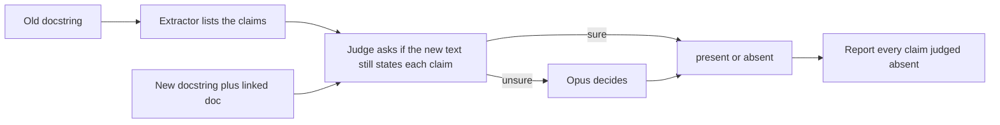
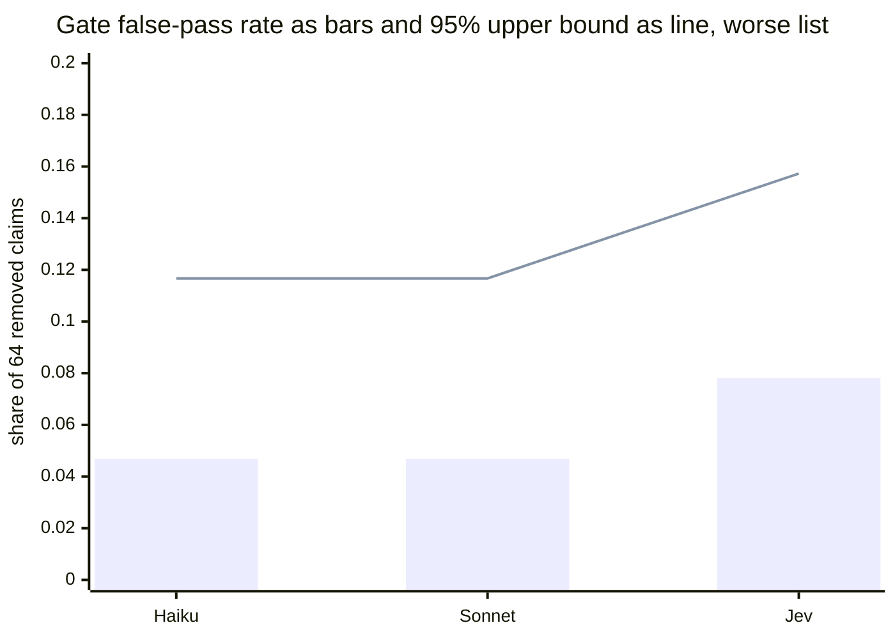
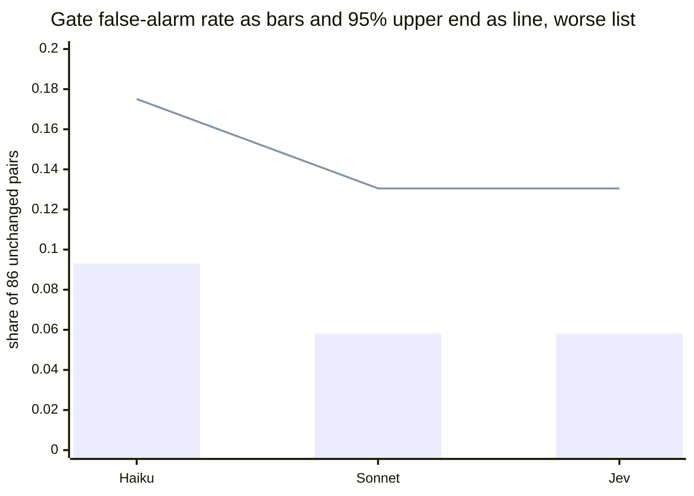
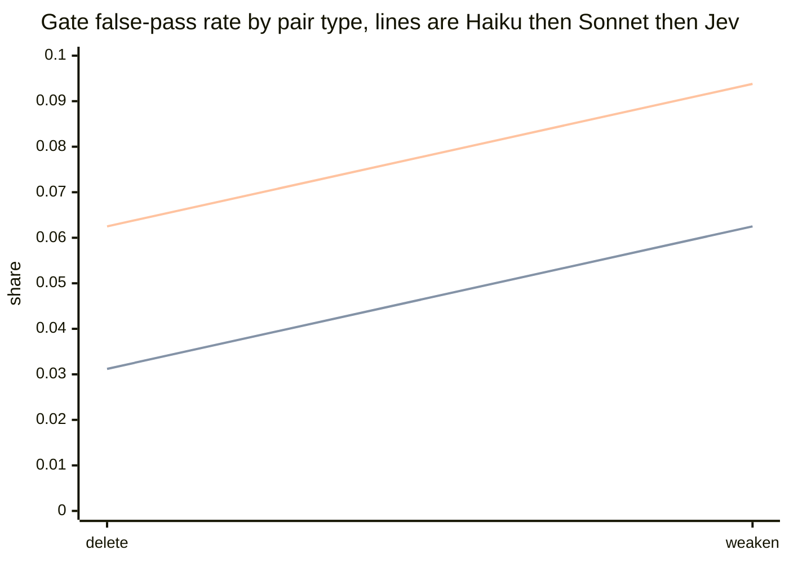
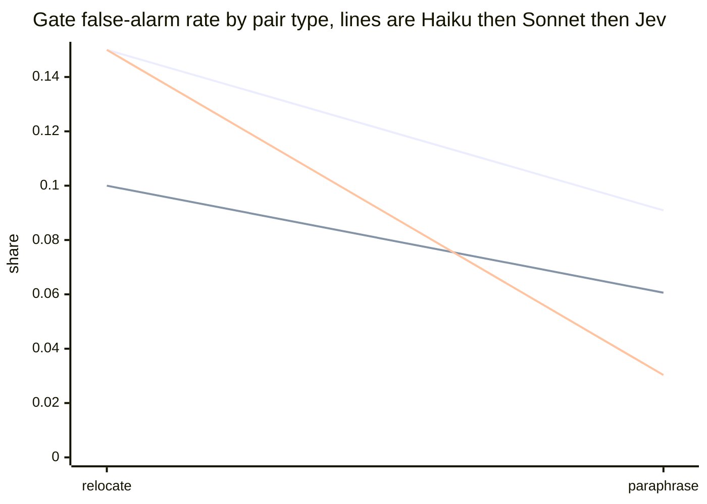
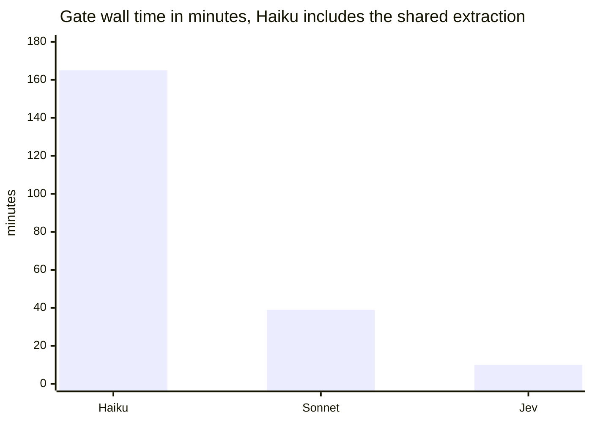
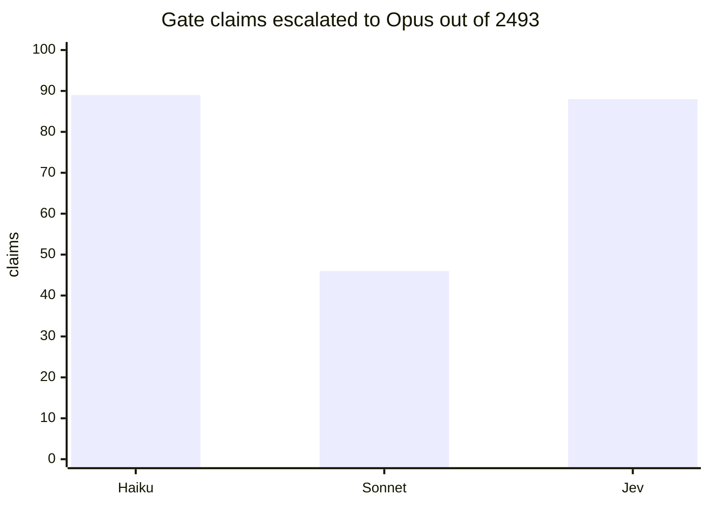

# Claim judge comparison: Jev, Claude Haiku and Claude Sonnet

This report compares three models as the "no claim lost" judge of the docstring rewrite. Rick chooses (decision D3). Sections 1 to 3 hold measurements; the only recommendation is section 4.

## 1. Problem statement

A writer model rewrites docstrings to a shorter style. The danger is that a rewrite silently drops a fact a caller relies on. The check has three steps, and only the middle one is compared here (full background: `2026.09.30-jev-claim-judge-problem-statement.md` sections 1 and 2).



- **False pass:** a removed claim the check did not flag. This is the error that matters.
- **False alarm:** an unchanged claim flagged as dropped. This one costs reviewer time.
- **Three judges:** Jev (`jev-1.13.0`), Claude Haiku (`claude-haiku-4-5-20251001`), Claude Sonnet (`claude-sonnet-5-5`). **One extractor** (`claude-sonnet-5-5`, shared by all three, run once), one escalation model (`claude-opus-5-5`).
- **Data that left the machine:** docstrings, claim sentences and the set's generated `linked_doc` texts only (row 0fc47c13; Tiberius found 28 of 28 linked docs generated, 0 copied from a repo file, row 46309646).

## 2. Narrative summary

On the 150 gate pairs no judge met the plan's bar of zero missed removals on both extractor lists: Haiku and Sonnet missed 3 of 64 removed claims on each list, Jev 3 on one list and 5 on the other. Reading each miss shows the picture is different from the headline. In three pairs (p028, p045, p151) the extractor produced no claim overlapping the removed text on either list, so no judge was ever asked about it. All three judges "miss" those three identically. Counting only misses a judge itself caused, Haiku and Sonnet have none, and Jev has two (p079 and p099, second list only).

On false alarms Sonnet and Jev were level and best (worst list 5 of 86, 5.8%), and Haiku was worst (8 of 86, 9.3%, just under the 10% ceiling). Sonnet sent about half as many claims to Opus as the others (46 against 89 and 88). The Claude judges run on the fixed-cost Max plan; Jev's price per call and its data terms were not measured. Recommendation (section 4): Sonnet as the judge, and a separate fix for the extractor, because the extractor is what fails the gate. One reason it could be wrong: the gap between 0 and 2 judge-caused misses is small and was seen once.

## 3. Results

### 3.1 What was run

| item | value |
|---|---|
| gate pairs | 150: 64 seeded removals (32 delete, 32 weaken) and 86 unseeded (20 relocate, 66 paraphrase). The gate has no injection pairs, so the injection rows of the plan are empty |
| pairs file sha256 | `5cb1f152c78d6df62def5e3cc0b1aa511d35557ebe3662e5479158cc155c98b9` (the `--frozen-pairs-sha`; taken from John's record on row 1ed52688) |
| harness code sha | `fa4aad932f91f257f8870c688b44ba245675d6ce` (Sam's frozen head, row 46309646; run from a detached worktree at exactly that sha) |
| comparison code sha | `cd52db65f` (branch head `dd2806361` + judge_comparison `d23063c0f` + `f28b78a21`) |
| prompt versions | extractor `extractor-a3bde07306`; Claude judge `judge-c6dc7c2165`; Jev judge `jev-d24741a00f` |
| Jev | `jev-1.13.0`, thresholds `t_lo` 0.05 and `t_hi` 0.8 (frozen by Sam on the dev split, row 46309646); below 0.05 is absent, at or above 0.8 present, between goes to Opus |
| extractor / escalation / writer | `claude-sonnet-5-5` / `claude-opus-5-5` / `labelled-set` (placeholder: the set names no writer model) |
| extractor lists per pair, judge runs per list | 2 lists. Haiku and Sonnet 3 runs each, Jev 1 run (the adapter is deterministic) |
| Claude calls | bounded Claude Code 2.1.287 at `/home/rruiz/.local/bin/claude`, profile `hermetic-1`, Claude Code on Max-plan OAuth |
| who ran it, when | Maya, a seat other than Sam; started 2026-10-01 19:10:17 EDT, ended 22:35 EDT |
| the Claude calls' residual context | five blocks the profile does not remove: environment and working directory, model name, token budget, account email header, current date. CLAUDE.md files, hooks, memory index, MCP instructions and skill lists were removed (Tiberius's probe, row 46309646) |

**The restart.** The first launch ran as a child of my own session. At 19:53:35 EDT (ledger rows 319, 40 pairs touched, 39 complete, 0 duplicate keys) I stopped it and relaunched it detached, about 10 seconds later, with Cheech's go. The ledger was reused; the binding check (Claude Code 2.1.287) accepted it. Final ledgers hold 0 duplicate keys: Haiku 1,200 rows (300 extract, 900 judge), 150 of 150 pairs. Sonnet (2,100 rows) and Jev (1,500 rows) began as copies of the Haiku ledger.

**Jev outage handling.** The harness does not ledger a judge pass in which any claim got no Jev answer, so a rebuild finds the gap. The Jev report says `judge_unanswered` 0, and `judge_comparison` squares the report with the ledger (no pass missing, exit 0).

### 3.2 Commands

The figures in 3.3 to 3.5 are from the first command. The second is a scratch script that reads the same ledgers; it is not reviewed code (copy and outputs in `projects-data/lupin/gate-run-2026.10.01-maya-analysis/`).

```bash
cd <seat tree at cd52db65f> && LUPIN_ROOT="$PWD" PYTHONPATH="$PWD/src" .venv/bin/python -m cosa.repo.doc_lint.judge_comparison \
  --split gate --pairs <gate pairs.jsonl> --keys <gate-keys.jsonl> \
  --ledger $D/ledger-haiku.jsonl $D/ledger-sonnet.jsonl $D/ledger-jev.jsonl \
  --frozen-pairs-sha 5cb1f152c78d6df62def5e3cc0b1aa511d35557ebe3662e5479158cc155c98b9 \
  --jev-report $D/report-jev.json --elapsed elapsed.json --t-lo 0.05 --t-hi 0.8 \
  --out-json gate-comparison.json --out-md gate-comparison.md \
  --extractor-model claude-sonnet-5-5 --escalation-model claude-opus-5-5 --writer-model labelled-set \
  --haiku-model claude-haiku-4-5-20251001 --sonnet-model claude-sonnet-5-5 --jev-model jev-1.13.0
# D = projects-data/lupin/gate-run-2026.10.01 ; exit 0, "haiku: ok, sonnet: ok, jev: ok"
# elapsed.json = {"haiku": 7319, "sonnet": 2367, "jev": 612}  (see the correction under 3.6)
```

The second command is `who.py`: it rebuilds each judge's results the same way (`judge_comparison.rebuild`) and lists the pair ids behind each wrong verdict and whether any extracted claim overlaps each removed span. It prints pair ids only.

`default_gate_pass=False` appears at the end of all three harness logs. From `harness_report.build_report`: it is true only when all of (a) `miss_criterion_met`: at least 60 seeded pairs and **zero** misses on **every** extractor list, (b) `false_alarm_ok`: every list flags at most 10% of unseeded pairs, (c) `agreement_ok`: agreement at least 95% over all claims and over seeded claims, and, for Jev, (d) no claim without a Jev answer. All three reports show (a) false and (b), (c) true, so `False` here means the zero-miss bar failed and nothing else. It is not a verdict on the judge alone, as 3.4 shows.

### 3.3 Headline figures, dev and gate in separate columns

Gate (150 pairs; worse of the two extractor lists; 64 seeded, 86 unseeded):

| judge | false passes, list 0 / list 1 | false-pass rate, worse list | 95% upper bound | false alarms, list 0 / list 1 | false-alarm rate, worse list | 95% interval, worse list | agreement, all claims | agreement, seeded claims |
|---|---|---|---|---|---|---|---|---|
| Haiku | 3 / 3 | 4.7% | 11.7% | 4 / 8 | 9.3% | 4.1% to 17.5% | 98.7% | 100.0% |
| Sonnet | 3 / 3 | 4.7% | 11.7% | 3 / 5 | 5.8% | 1.9% to 13.0% | 99.2% | 100.0% |
| Jev | 3 / 5 | 7.8% | 15.7% | 2 / 5 | 5.8% | 1.9% to 13.0% | 100.0% | 100.0% |

Dev (70 pairs; 28 seeded, 42 unseeded per list). **Inherited from Sam's row 46309646 (amendments 22:48 and 22:51 UTC), not recomputed here.** The Jev dev figures are **fitted and in-sample**: the band was chosen on these same pairs. The rates are my arithmetic on his counts.

| judge | false passes, list 0 / list 1 | 95% upper bound if 0 | false alarms, list 0 / list 1 | false-alarm rate | claims escalated to Opus |
|---|---|---|---|---|---|
| Haiku | 0 / 0 | 10.1% | 3 / 1 | 7.1% and 2.4% | 50 |
| Sonnet | 0 / 0 | 10.1% | 2 / 3 | 4.8% and 7.1% | 10 |
| Jev (fitted) | 0 / 0 | 10.1% | 3 / 3 | 7.1% and 7.1% | 55 |

Bounds are Clopper-Pearson: one-sided 95% upper for false passes, two-sided 95% for the rest (`harness_report`). Zero misses in 64 would give an upper bound of 4.6%, in 60 of 4.9%. The plan's fallback bar is an upper bound at or below 10%: no judge meets it on the worse list. Dev agreement figures are not on the row.





### 3.4 Who caused each miss

The three shared misses come from the extraction step, not the judge. In p028 and p045 (weaken) and p151 (delete), on both extractor lists, **no extracted claim overlaps the removed text**, for all three judges. The judge is only asked about extracted claims, so the removal could not be caught by any of them. This is read from the ledgers by the scratch script; the cause of the extractor's gap in those three pairs was not examined.

| judge | misses, pair x list | of which no extracted claim covers the removal | judge-caused |
|---|---|---|---|
| Haiku | 6 (3 pairs x 2) | 6 | 0 |
| Sonnet | 6 (3 pairs x 2) | 6 | 0 |
| Jev | 8 | 6 | 2: p079 (weaken) and p099 (delete), both second list |

Judge-caused misses, worse list, out of 64 removed claims: Haiku 0, Sonnet 0, Jev 2 (one-sided 95% upper bound 9.5%; 0 of 64 gives 4.6%). This split is my reading of the data; the harness itself reports only the combined counts above.

### 3.5 By pair type (gate)

Delete and weaken are false-pass rows; relocate and paraphrase are false-alarm rows. "Wrong" is on the worse list. Per list: Haiku delete 1/1, weaken 2/2, relocate 3/2, paraphrase 1/6. Sonnet delete 1/1, weaken 2/2, relocate 2/1, paraphrase 1/4. Jev delete 1/2, weaken 2/3, relocate 2/3, paraphrase 0/2.

| judge | pair type | n | expected | wrong | rate | 95% bound |
|---|---|---|---|---|---|---|
| Haiku | delete | 32 | flagged | 1 | 3.1% | 14.0% |
| Haiku | weaken | 32 | flagged | 2 | 6.2% | 18.4% |
| Haiku | relocate | 20 | not flagged | 3 | 15.0% | 37.9% |
| Haiku | paraphrase | 66 | not flagged | 6 | 9.1% | 18.7% |
| Sonnet | delete | 32 | flagged | 1 | 3.1% | 14.0% |
| Sonnet | weaken | 32 | flagged | 2 | 6.2% | 18.4% |
| Sonnet | relocate | 20 | not flagged | 2 | 10.0% | 31.7% |
| Sonnet | paraphrase | 66 | not flagged | 4 | 6.1% | 14.8% |
| Jev | delete | 32 | flagged | 2 | 6.2% | 18.4% |
| Jev | weaken | 32 | flagged | 3 | 9.4% | 22.5% |
| Jev | relocate | 20 | not flagged | 3 | 15.0% | 37.9% |
| Jev | paraphrase | 66 | not flagged | 2 | 3.0% | 10.5% |

Bounds on 20 or 32 pairs are wide: a 3-versus-2 difference in a row is not distinguishable from chance. All three judges flag the same relocate pair (p011) on both lists, which suggests an input or label property rather than a judge quirk (not examined). 17 distinct (pair, list) false alarms occur across the three judges.





### 3.6 Escalations, unanswered, time and calls

| judge | judge calls (ledger rows) | escalations to Opus | claims with no Jev answer | discarded claims | wall time |
|---|---|---|---|---|---|
| Haiku | 900 | 89 | n/a | 104 | about 9,917 s (165 min), **including the 300 shared extractor calls** |
| Sonnet | 900 | 46 | n/a | 104 | 2,367 s (39 min), extraction already cached |
| Jev | 300 | 88 | 0 | 104 | 612 s (10 min), extraction already cached |

- **Calls.** Extractor calls: 300, once, shared. A ledger row is one (pair, list, run) pass; Jev's 300 rows are 150 pairs x 2 lists x 1 run, each pass holding one Jev request per claim, so Jev's request count is about the 2,493 claims judged. Request counts were not logged separately.
- **Escalations** are claims sent to Opus. Haiku 89, Jev 88, Sonnet 46, over the same 2,493 claims. 104 claims were discarded for a failed verbatim quote check, identically for all three (shared extraction).
- **Time is not like for like.** Haiku ran alone, did the extraction for everyone, and ran first. Sonnet and Jev then ran at the same time, so each slowed the other. The extractor's time was not recorded separately. **Correction to the elapsed figure:** the Haiku leg's status line reads 7,319 s because my script's clock restarted at the relaunch (19:53:45). The first leg ran 19:10:17 to 19:53:35 (2,598 s), so Haiku's wall time is about 9,917 s. The figure `judge_comparison` printed in its table, 7,319, is the post-relaunch leg only; this section uses the corrected one.
- **Where each call runs.** Haiku, Sonnet, the extractor and every Opus escalation go through bounded Claude Code, covered by the fixed monthly Max plan (CLAUDE.md, cost model), so their marginal money cost is zero by that framing. Jev is an HTTPS request to `api.typesafe.ai`: its per-call price, quota and data terms are not known to this report. Jev's 88 escalations still use Opus.





### 3.7 What was not measured

- Which judge is right when they disagree on a claim: no per-claim hand label beyond the seeded removals was used.
- Why the extractor lists skipped the removed claim in p028, p045 and p151, and whether a better extractor prompt fixes it.
- Jev's price, quota, latency distribution under load, and its data-handling terms.
- Any model other than these three, any extractor other than Sonnet, one writer's rewrites only (the set names none), and no Design-document triage (task B).
- A repeat of the gate run: one run, one draw of the two extractor lists (73 of 150 pairs had identical lists, so the lists are partly one list drawn twice). Variation between runs is unknown.
- Statistical significance of 0 versus 2 judge-caused misses: bounds are given, no test.
- Gate Jev figures use thresholds fitted on dev; they were frozen before the gate, so the gate is out of sample.
- The `claude-opus-5-5` escalation outcomes by judge.

## 4. Conclusions and recommendation

**Findings (measured above).**

1. No judge met the plan's zero-miss bar on the gate; the failure is shared and traces to the extractor in three pairs.
2. Judge-caused misses: Haiku 0, Sonnet 0, Jev 2 of 64.
3. False alarms: Sonnet and Jev 5 of 86 (worse list), Haiku 8 of 86, close to the 10% ceiling. All three meet the false-alarm and agreement bars.
4. Escalation load: Sonnet 46, Haiku 89, Jev 88 claims to Opus.
5. Jev's dev results were fitted to the dev pairs (0 misses there); on the gate it did not do better than the Claude judges on any figure above.

**Recommendation (mine, not a finding; Rick decides D3).** Choose **Claude Sonnet** as the claim judge, and open a separate row to fix extractor coverage before Phase 5. Reasons: no judge-caused misses, the lowest false alarms (tied with Jev), the lowest Opus load, no third-party data flow, and the fixed-cost path. Haiku is the fallback if quota matters: same misses, more false alarms (9.3%). Jev is not recommended on these numbers: two judge-caused misses, no better false-alarm rate, and unmeasured price and data terms. Choosing Sonnet accepts a 39-minute run per 150 pairs and that every judge call, including escalations, draws on the Max plan's rolling quota.

**What would change it.** A repeat run showing Sonnet with judge-caused misses; or Jev's price and terms turning out zero-cost and acceptable, with a repeat showing it at 0 judge-caused misses, would make it a peer rather than a loser. If the extractor is not fixed, no choice of judge reaches zero misses on this set.

**Not for Rick to decide here:** the three extractor misses and the shared relocate false alarm (p011) should be read by someone who can see the labelled pairs. This report did not open them.
