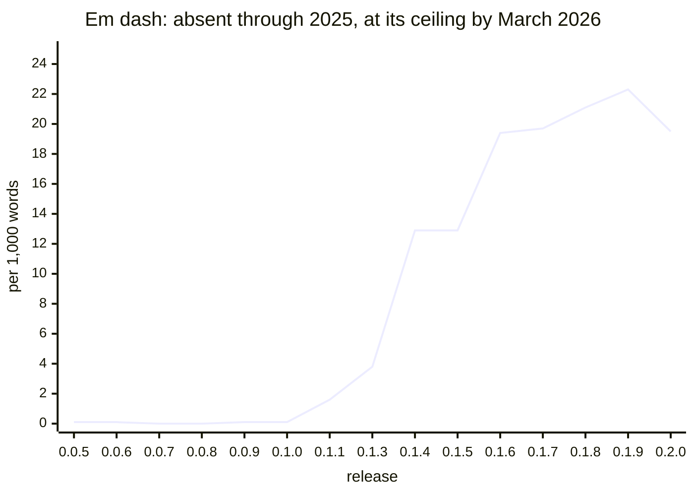
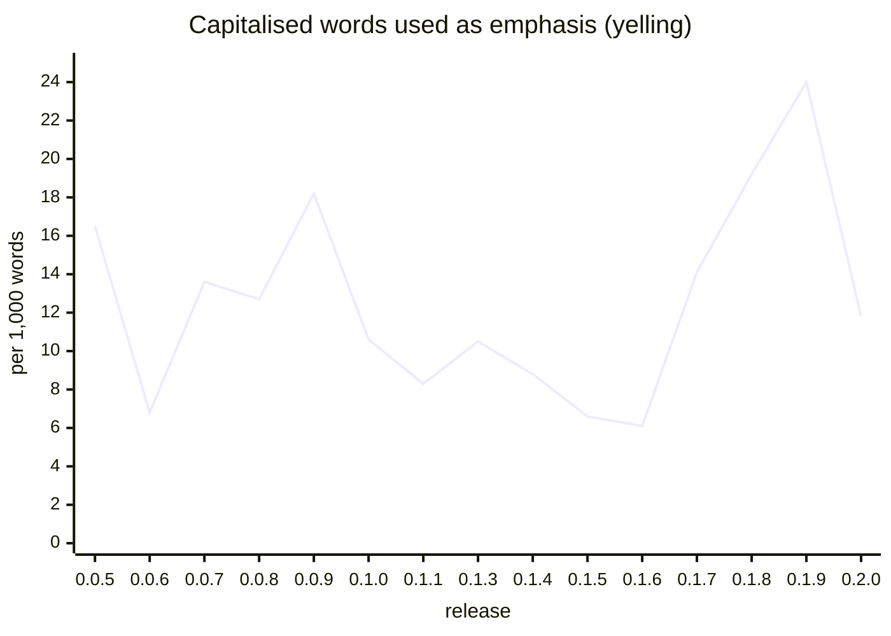
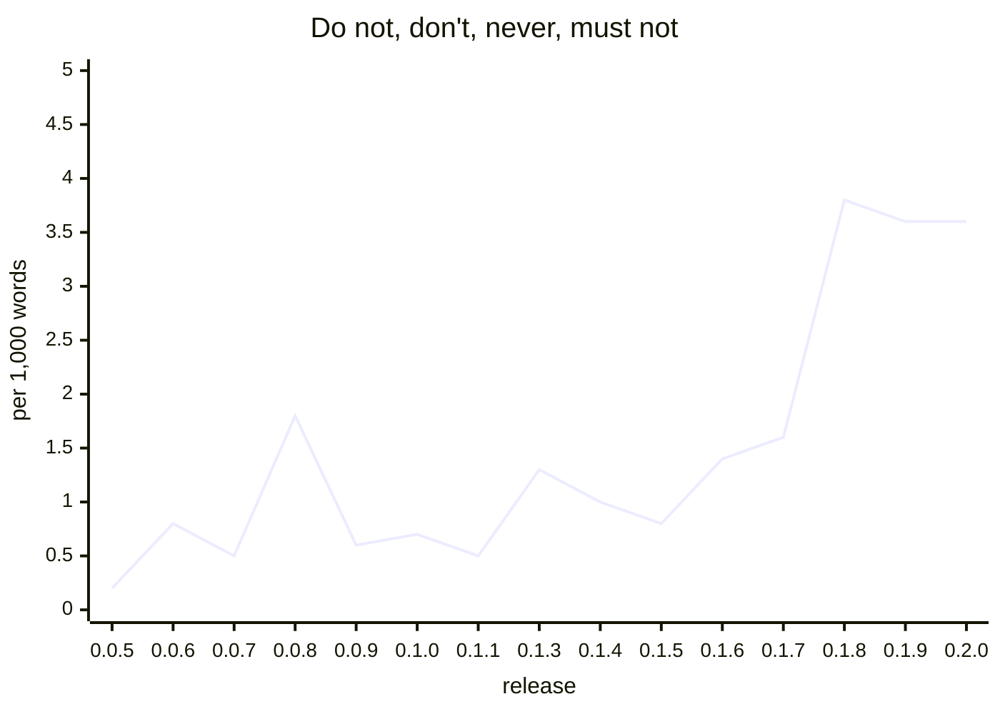
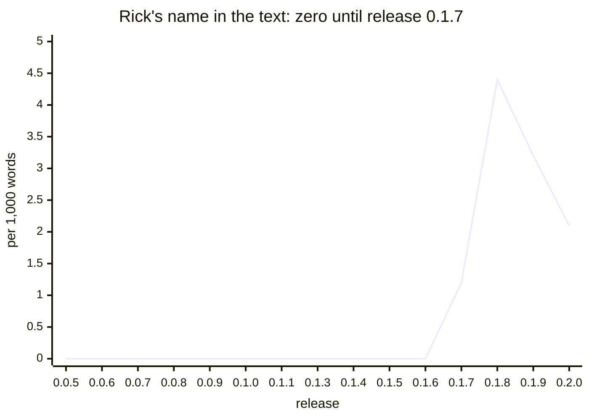
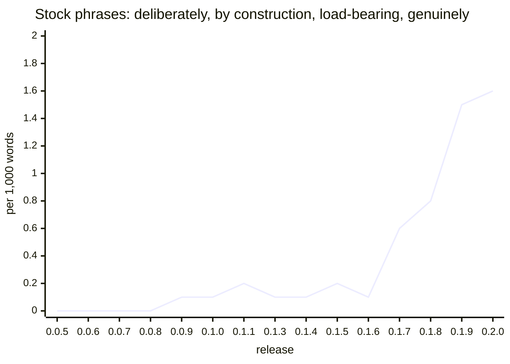
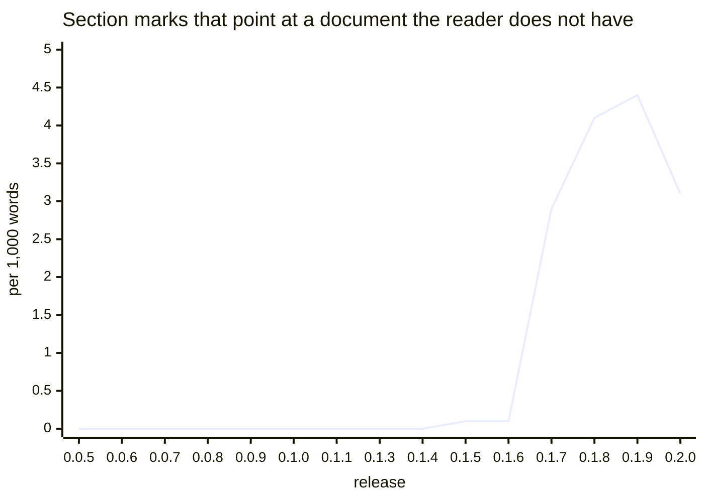
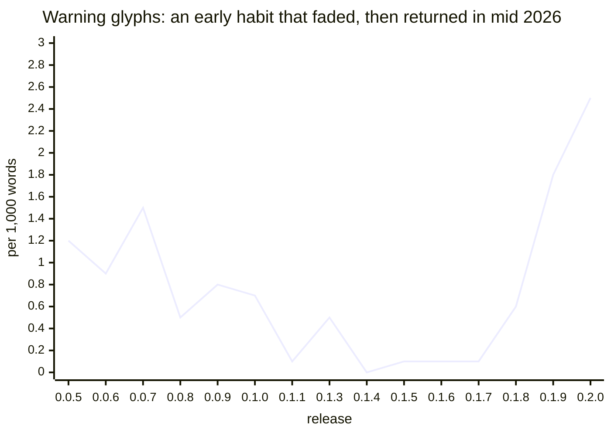
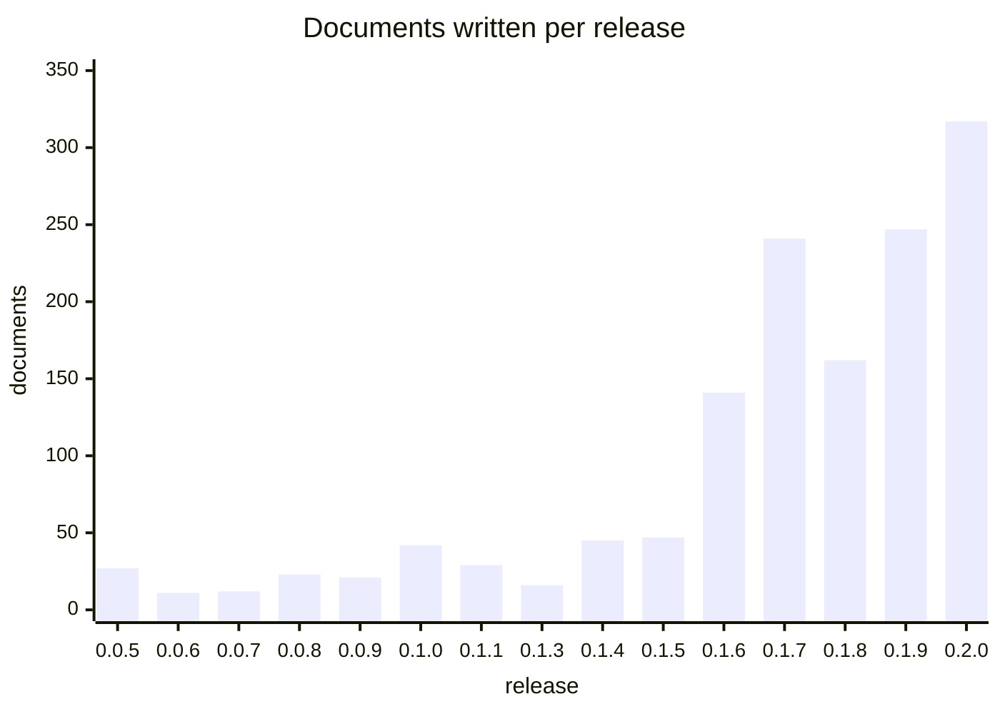
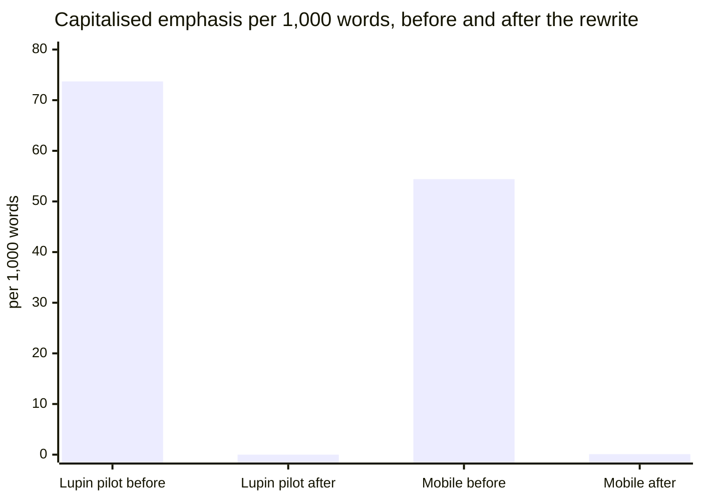

# Verbal markers by release: what the R&D history shows

2026.10.04 · María, for Rick · companion to the documentation rewrite plan (plan 1 of 2)

This page answers one question: when did the writing habits of a verbose model enter our documents, and how fast did they grow? It counts those habits in every R&D document, grouped by the release folder the document was written under. Each release folder matches one working branch, so the table reads as a history by branch.

## 1. What the history shows

1. **The habits arrived in order, one at a time.** The em dash came first, in January 2026, and reached its ceiling by March. Capitalised emphasis, section marks with no path, and Rick's name in the text all arrived together in April and May 2026 (release 0.1.7). Warning glyphs and stock phrases came last, from June.
2. **Nothing was there before 2026.** Across the six releases written in 2025 (136 documents, 177,000 words) there are 13 em dashes in total, no section marks, and Rick's name does not appear.
3. **Volume grew with the habits.** A release held 11 to 47 documents until March 2026. Release 0.1.6 held 141, and release 0.2.0 held 317 in under four weeks.
4. **The same habits moved into the code.** Python docstrings and Dart doc comments carry more capitalised emphasis than any R&D release: 28 and 54 words per 1,000, against a worst R&D release of 24.
5. **The rewrite removes them.** In the two places it has run, every marker falls to about zero while prohibitions ("do not", "never") stay at the same rate. Those are constraints, and the rewrite keeps them. Section 5 has the figures.

## 2. The table

Rates are occurrences per 1,000 words. Measured on `deepily/lupin` at commit `4564224` (2026-09-13), the commit the rewrite spec used, which still holds the 400 documents removed on 2026-09-23. 1,381 documents, 2.23 million words.

| Release | Written | Docs | Words | Em dash | Caps words | Caps runs | Do not, don't, never | Rick | Rick + verb | Stock phrases | Not X but Y | § marks | Row ids | ⚠ 🔴 ⇒ | Dates in prose |
|---|---|---|---|---|---|---|---|---|---|---|---|---|---|---|---|
| v0.0.5 | 2025.01 to 2025.09 | 27 | 24,564 | 0.1 | 16.5 | 1.0 | 0.2 | 0.0 | 0.0 | 0.0 | 0.0 | 0.0 | 0.0 | 1.2 | 2.9 |
| v0.0.6 | 2025.07 to 2025.08 | 11 | 14,648 | 0.1 | 6.8 | 0.3 | 0.8 | 0.0 | 0.0 | 0.0 | 0.0 | 0.0 | 0.0 | 0.9 | 1.8 |
| v0.0.7 | 2025.08 | 12 | 15,037 | 0.0 | 13.6 | 0.6 | 0.5 | 0.0 | 0.0 | 0.0 | 0.0 | 0.0 | 0.0 | 1.5 | 2.3 |
| v0.0.8 | 2025.08 to 2025.09 | 23 | 23,799 | 0.0 | 12.7 | 0.4 | 1.8 | 0.0 | 0.0 | 0.0 | 0.0 | 0.0 | 0.0 | 0.5 | 1.4 |
| v0.0.9 | 2025.09 to 2025.10 | 21 | 26,810 | 0.1 | 18.2 | 0.5 | 0.6 | 0.0 | 0.0 | 0.1 | 0.1 | 0.0 | 0.0 | 0.8 | 5.0 |
| v0.1.0 | 2025.10 to 2026.01 | 42 | 72,567 | 0.1 | 10.6 | 0.5 | 0.7 | 0.0 | 0.0 | 0.1 | 0.0 | 0.0 | 0.0 | 0.7 | 2.3 |
| v0.1.1 | 2026.01 | 29 | 22,264 | 1.6 | 8.3 | 0.5 | 0.5 | 0.0 | 0.0 | 0.2 | 0.0 | 0.0 | 0.0 | 0.1 | 1.6 |
| v0.1.3 | 2026.01 to 2026.02 | 16 | 14,147 | 3.8 | 10.5 | 0.2 | 1.3 | 0.0 | 0.0 | 0.1 | 0.0 | 0.0 | 0.0 | 0.5 | 1.9 |
| v0.1.4 | 2026.02 | 45 | 46,404 | 12.9 | 8.8 | 0.1 | 1.0 | 0.0 | 0.0 | 0.1 | 0.0 | 0.0 | 0.0 | 0.0 | 2.2 |
| v0.1.5 | 2026.02 to 2026.03 | 47 | 65,491 | 12.9 | 6.6 | 0.1 | 0.8 | 0.0 | 0.0 | 0.2 | 0.1 | 0.1 | 0.0 | 0.1 | 0.8 |
| v0.1.6 | 2026.03 to 2026.04 | 141 | 155,555 | 19.4 | 6.1 | 0.1 | 1.4 | 0.0 | 0.0 | 0.1 | 0.1 | 0.1 | 0.2 | 0.1 | 1.1 |
| v0.1.7 | 2026.04 to 2026.05 | 241 | 505,065 | 19.7 | 14.1 | 0.4 | 1.6 | 1.2 | 0.1 | 0.6 | 0.1 | 2.9 | 0.1 | 0.1 | 3.0 |
| v0.1.8 | 2026.05 to 2026.06 | 162 | 263,169 | 21.1 | 19.2 | 0.3 | 3.8 | 4.4 | 0.3 | 0.8 | 0.1 | 4.1 | 0.1 | 0.6 | 2.5 |
| v0.1.9 | 2026.06 to 2026.08 | 247 | 455,291 | 22.3 | 24.0 | 1.3 | 3.6 | 3.2 | 0.4 | 1.5 | 0.2 | 4.4 | 0.5 | 1.8 | 2.5 |
| v0.2.0 | 2026.08 | 317 | 524,798 | 19.5 | 11.8 | 0.7 | 3.6 | 2.1 | 0.4 | 1.6 | 0.3 | 3.1 | 0.9 | 2.5 | 2.4 |

What each column counts:

| Column | Counts | Source of the rule |
|---|---|---|
| Em dash | the character `—` | lupin `doc_lint` counter |
| Caps words | a word in capitals whose lowercase form is an English word, so `NEVER` counts and `JSON` does not; quoted and code spans are skipped | lupin `doc_lint` counter |
| Caps runs | three or more capitalised words in a row, a shouted phrase | added for this page |
| Do not, don't, never | "do not", "don't", "never", "must not", any case | added for this page |
| Rick | the name, anywhere | added for this page |
| Rick + verb | the name followed by a reporting word: says, said, ruled, ruling, asked, wants, decided, approved, told, caught, word, order | added for this page |
| Stock phrases | the 19 frozen phrases: deliberately, by construction, load-bearing, the whole point, exactly the, by design, on purpose, honestly, genuinely, full stop, the lesson, the trap and others | lupin `doc_lint` counter |
| Not X but Y | "is not a ..., it is ..." and "not ... but ..." | added for this page |
| § marks | the section sign | lupin `doc_lint` counter |
| Row ids | row, bug, task or ts followed by 8 hex characters | lupin `doc_lint` counter |
| ⚠ 🔴 ⇒ | the three emphasis glyphs | lupin `doc_lint` counter |
| Dates in prose | a calendar date standing alone in a sentence, not in a file name | lupin `doc_lint` rule |

Raw counts behind the largest cells, so the rates can be checked by hand:

| Release | Em dashes | Caps words | Prohibitions | Rick | Stock phrases | § marks | Glyphs |
|---|---|---|---|---|---|---|---|
| v0.1.0 | 8 | 768 | 47 | 0 | 7 | 0 | 52 |
| v0.1.4 | 600 | 410 | 46 | 0 | 3 | 0 | 0 |
| v0.1.6 | 3,024 | 945 | 222 | 0 | 21 | 18 | 9 |
| v0.1.7 | 9,959 | 7,140 | 798 | 621 | 301 | 1,487 | 68 |
| v0.1.8 | 5,554 | 5,046 | 997 | 1,149 | 218 | 1,083 | 152 |
| v0.1.9 | 10,138 | 10,943 | 1,631 | 1,447 | 683 | 2,009 | 798 |
| v0.2.0 | 10,240 | 6,206 | 1,911 | 1,128 | 834 | 1,607 | 1,321 |

## 3. The charts

Every chart has the 15 releases on the horizontal axis, oldest on the left, and occurrences per 1,000 words on the vertical axis.

## 4. Reading the history

**Three steps, not one slope.**

| Step | Release | When | What changed |
|---|---|---|---|
| 1 | v0.1.1 to v0.1.4 | January and February 2026 | The em dash goes from 0.1 to 12.9 per 1,000 words. Nothing else moves. |
| 2 | v0.1.7 | April and May 2026 | Section marks go from 0.1 to 2.9, Rick's name from 0 to 1.2, capitalised words from 6.1 to 14.1, stock phrases from 0.1 to 0.6. Documents per release go from 141 to 241 and words from 156,000 to 505,000. |
| 3 | v0.1.8 to v0.2.0 | June to August 2026 | Prohibitions more than double (1.6 to 3.8). Glyphs return (0.1 to 2.5). Stock phrases keep climbing (0.8 to 1.6). Row ids appear (0.1 to 0.9). |

**Capitalised words are the exception.** The 2025 documents already had 7 to 18 capitalised words per 1,000. Reading them shows why: early documents used capitals in headings and status labels. The 2026 rise (6.1 to 24.0 between releases 0.1.6 and 0.1.9) is capitals inside sentences. The counter cannot tell a heading from a sentence, so treat the 2025 figures as a different habit that scores the same.

**Release 0.2.0 is quieter on capitals and louder on glyphs.** Capitalised words fall from 24.0 to 11.8 while glyphs rise from 1.8 to 2.5 and stock phrases hold. Emphasis moved from one device to another. It did not go away.

**Which stock phrases.** In release 0.2.0 the most frequent are "deliberately" (196), "genuinely" (145), "by construction" (104), "load-bearing" (97), "by design" (53), "the trap" (43) and "on purpose" (42). Counted with a plain search, case ignored.

**How Rick's name appears.** In release 0.1.9 the most frequent forms are "Rick's word" (61), "Rick's ruling" (29), "Rick's call" (27), "Rick's explicit" (21) and "Rick ruled" (20). The name marks an authority for a statement. It is a ruling quoted into a document, which the standard's rule 7 moves to a decision record.

## 5. The same counter on code, and on the rewrite

| Corpus | Commit | Texts | Words | Em dash | Caps words | Caps runs | Do not, don't, never | Rick | Stock phrases | § marks | Row ids | ⚠ 🔴 ⇒ | Dates in prose |
|---|---|---|---|---|---|---|---|---|---|---|---|---|---|
| Lupin Python docstrings, at the spec's commit | `4564224` | 7,033 | 528,067 | 9.9 | 28.1 | 2.0 | 5.6 | 0.7 | 1.1 | 1.1 | 1.1 | 1.1 | 1.5 |
| Lupin Python docstrings, today | `dcf0863ee` | 8,428 | 699,730 | 9.7 | 35.4 | 3.3 | 5.9 | 0.8 | 1.2 | 0.9 | 1.4 | 1.8 | 1.6 |
| Lupin pilot, five task store files, before | `ced08ca19` | 78 | 18,518 | 14.9 | 73.7 | 7.4 | 8.9 | 1.2 | 2.9 | 1.0 | 1.9 | 3.4 | 1.7 |
| Lupin pilot, same files, after | `7f5c619de` | 78 | 12,817 | 0.3 | 0.0 | 0.0 | 9.8 | 0.0 | 0.0 | 0.0 | 0.0 | 0.0 | 0.0 |
| Lupin CLAUDE.md files, at the spec's commit | `4564224` | 2 | 8,339 | 16.4 | 25.8 | 2.2 | 5.2 | 1.3 | 1.0 | 1.7 | 1.8 | 2.2 | 4.2 |
| Lupin CLAUDE.md files, today | `dcf0863ee` | 2 | 10,089 | 12.1 | 8.5 | 0.7 | 6.2 | 0.1 | 0.8 | 0.9 | 0.0 | 1.3 | 0.1 |
| Mobile doc comments, before the sweep | `cf5be6f` | 2,719 | 89,922 | 12.0 | 54.4 | 7.2 | 4.5 | 1.3 | 1.8 | 1.8 | 1.5 | 5.6 | 1.9 |
| Mobile doc comments, after the sweep | `a5bf946` | 4,869 | 79,801 | 0.2 | 0.1 | 0.0 | 4.0 | 0.0 | 0.0 | 0.0 | 0.0 | 0.0 | 0.0 |
| Mobile R&D documents | `a5bf946` | 111 | 223,055 | 19.2 | 11.7 | 0.5 | 2.9 | 1.4 | 0.9 | 5.2 | 0.2 | 1.7 | 2.9 |
| planning-is-prompting workflow documents | `736a0b3` | 71 | 257,992 | 15.1 | 18.7 | 1.3 | 4.2 | 1.8 | 1.2 | 5.9 | 0.5 | 1.7 | 4.1 |
| planning-is-prompting global CLAUDE.md | `736a0b3` | 1 | 5,865 | 16.2 | 47.1 | 4.6 | 8.3 | 0.3 | 0.7 | 1.4 | 0.3 | 3.6 | 1.4 |
| planning-is-prompting script docstrings | `736a0b3` | 398 | 43,552 | 12.1 | 62.8 | 7.3 | 6.7 | 1.2 | 2.1 | 0.3 | 1.1 | 2.5 | 2.3 |

What the table says:

- **The rewrite takes every marker to about zero.** In the mobile sweep the em dash goes from 12.0 to 0.2 and capitalised words from 54.4 to 0.1.
- **Prohibitions survive.** They go from 8.9 to 9.8 in the lupin pilot and from 4.5 to 4.0 in mobile. "Do not" and "never" in a docstring are mostly real constraints, and the rewrite keeps them while removing the capitals around them.
- **The mobile sweep wrote more and said it in less.** Doc blocks went from 2,719 to 4,869 because the sweep also wrote the missing public documentation. Total words still fell 11%. Part of that fall is 54 files of unreachable code deleted during the same days, so the 11% is not a pure rewrite figure.
- **The lupin pilot is 31% shorter by this counter** (18,518 to 12,817 words) at the restored pilot commit. The pilot's own report measured 44% at its first commit, before reasons were put back.
- **Lupin's unswept docstrings are getting louder.** Capitalised words rose from 28.1 to 35.4 per 1,000 between 2026-09-13 and today, and the corpus grew by a third. Only the five pilot files have been rewritten in lupin, and they are not merged.
- **planning-is-prompting is as marked as the other two repos and has no rewrite track.** Its script docstrings carry 62.8 capitalised words per 1,000, and its global CLAUDE.md 47.1.

## 6. Method and limits

- **Instrument.** `cosa.repo.doc_lint.marker_counts.count_markers`, with lupin's frozen lists (`rule_lists.py`), run from lupin at `dcf0863ee`. Markdown is stripped of front matter, fenced code and HTML comments first. Python docstrings come from the linter's own extractor and Dart blocks from its own block reader. The script is scratch and is not checked in; the commits above are enough to rerun it.
- **Columns added for this page** (caps runs, prohibitions, Rick, Rick + verb, not X but Y) are plain regular expressions written on 2026-10-04. They have no measured precision or recall.
- **These figures differ from the spec's table**, which shows the same shape with slightly different values (for example em dash 9.9 for v0.1.4 there, 12.9 here). The spec was measured before the lists were frozen and its script was not kept. The docstring row here covers 7,033 docstrings in every non-test Python file under `src/`; the spec counted 4,979 in non-test packages.
- **Aphorisms are not counted.** No phrase list catches them. The linter's stock-phrase rule found 18 of the 59 a human reader marked (recall .31, in the precision and recall report in this folder), and the "not X but Y" column is a narrow proxy. Read both columns as a floor.
- **Checks made on the instrument.** The pilot files before the rewrite score 73.7 capitalised words per 1,000 and after it 0.0, so the counter both fires and falls silent. A plain search for the name Rick in release 0.1.7 returns 628 against the counter's 621; the counter skips code blocks. A plain search in release 0.1.5 returns 3 where the counter returns 0, for the same reason.
- **Release folders are not exact branches.** A document sits in the folder for the release it was written under. Date ranges come from the dates in file names.
- **One commit.** Documents deleted before 2026-09-13 are not in the count.
