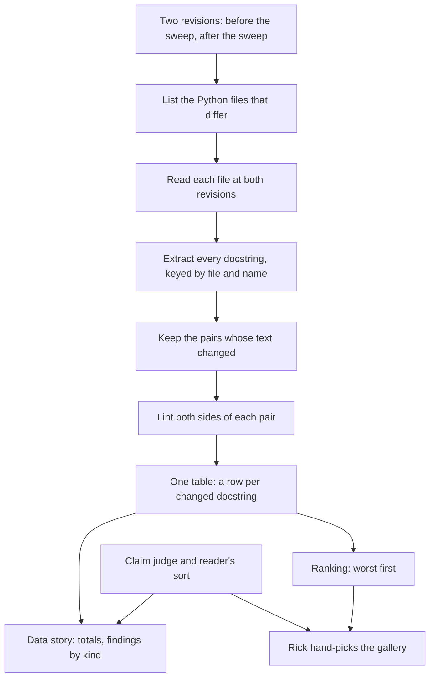

# Before and after: a showcase plan for the docstring rewrite

2026.10.06 · Mr. Radio, for Rick · companion to the documentation rewrite plan (plan 1 of 2)

Rick asked whether the rewrite's work can be compared before and after. He wants that for one day's trains, and for the whole source at the end. He wants to publish statistics and examples that show what the process accomplished. This page says how that would work. Nothing here is built. A build needs his separate go.

## What Rick asked for

His answers on a card, 2026-10-06:

| Question | His answer |
|---|---|
| Who is it for? | Internal first. A public cut can follow. |
| How are examples picked? | A script ranks. Rick hand-picks from the ranking. |
| Which numbers lead? | Totals before and after. Findings by kind. Proof that meaning was kept. |

He described two data sets:

1. **The data story.** Thorough and data-driven. It covers every docstring the sweep touched.
2. **The gallery.** A short set of the worst docstrings, each beside its rewrite. In his words, "anecdotally unforgettable", and "the worst the better".

He did not choose a per-package table. It can be added later from the same data.

## Is it possible?

Yes, with what the repository already holds. Git keeps both versions of every file. The sweep's own tools already read a file at any revision.

| Tool in `src/cosa/repo/doc_lint/` | What it gives |
|---|---|
| `docstring_lint` | Every finding in every Python docstring, by rule |
| `doc_metrics` | Tokens and marker rates per package, before and after |
| `contract_diff` | Requires, Ensures and Raises counts before and after |
| `docs_only_diff` | Proof that the code is unchanged |
| The claim judge and the reader's sort | The count of real losses of meaning |

One piece is missing. No tool lists each changed docstring with its findings before and after. That list is what both data sets are cut from.

## What a scratch probe showed

A probe of about 40 lines was run four times on 2026-10-06. It is not checked in. It can be rebuilt from the description under "How the comparison works".

**Probe 1: one rewritten package.** Package `src/cosa/repo/git_loc_delta`, commit `ec732f35b` against its parent.

| Measure | Before | After |
|---|---|---|
| Files changed | 10 | 10 |
| Docstrings changed | 25 | 25 |
| Lint findings in those 25 | 109 | 0 |
| Worst single docstring (`date_bounds.py`, module) | 34 | 0 |
| Capitalised words per 1,000 (`doc_metrics`) | 12.9 | 0.0 |
| Tokens (`doc_metrics`) | 4,023 | 3,904 |

The same passage, before and after:

> **Before.** THE DEFECT THIS EXISTS TO KILL … `--today` mode built exactly the bare form, which meant the DEFAULT mode of the LoC tool reported zero on a busy day — and reported it as a successful empty result, not an error.

> **After.** What this module prevents … `--today` mode builds the bare form, so without this fix the default mode of the LoC tool reports zero on a busy day. It reports that zero as a successful empty result, not as an error.

**Probe 2: the whole tree as it stands.** Every tracked `src/*.py` outside `.venv`, at commit `1419bd54e`. This is the "before" side of a whole-project comparison, taken while almost none of the sweep has merged.

| Measure | Count |
|---|---|
| Files | 3,096 |
| Docstrings | 34,408 |
| Docstrings with a finding | 16,250 |
| Findings | 112,466 |
| Docstrings over 100 lines | 21 |

Findings by kind:

| Rule | Findings |
|---|---|
| Capitalised words (`caps`) | 71,642 |
| Long sentences (`sentence-length`) | 13,038 |
| Long summary line (`summary-length`) | 8,410 |
| Bare ticket and row references (`bare-ref`) | 8,155 |
| Emphasis glyphs (`glyph`) | 3,730 |
| Dates in prose (`iso-date`) | 2,975 |
| Verbal tics (`tic`) | 2,549 |
| Long preface (`preface-length`) | 1,391 |
| Dated banners (`dated-banner`) | 530 |
| Orders to the reading agent (`agent-imperative`) | 46 |

The five worst docstrings by finding count:

| Findings | Lines | Where |
|---|---|---|
| 331 | 258 | `src/scripts/find_interchangeable_assertions.py`, module |
| 327 | 210 | `src/lupin_cli/claude_code/hooks/lib/merge_head_guard.py`, module |
| 253 | 168 | `src/migrations/versions/47513717b7e5_add_task_title_trimmed.py`, module |
| 242 | 151 | `src/lupin_cli/claude_code/hooks/lib/stash_guard.py`, module |
| 240 | 114 | `src/tests/e2e_ui/test_row_geometry_is_one_shape_in_all_three_panes.py`, module |

These five are candidates for the gallery. None has been rewritten yet.

**Probe 3: the first merged train.** Train 1 merged the same afternoon. The probe compared the train's build, commit `54a4536d5`, with the commit it was built on, `1419bd54e`.

| Measure | Before | After |
|---|---|---|
| Python files changed | 57 | 57 |
| Docstrings changed | 368 | 368 |
| Lint findings in those 368 | 3,571 | 0 |
| Words in those 368 | 54,539 | 44,543 |
| Lines in those 368 | 7,384 | 6,072 |
| Docstrings present on one side only | 1 | |

Findings removed, by kind:

| Rule | Findings before |
|---|---|
| Capitalised words (`caps`) | 2,199 |
| Long sentences (`sentence-length`) | 478 |
| Bare ticket and row references (`bare-ref`) | 352 |
| Long preface (`preface-length`) | 145 |
| Long summary line (`summary-length`) | 104 |
| Dates in prose (`iso-date`) | 96 |
| Emphasis glyphs (`glyph`) | 93 |
| Verbal tics (`tic`) | 87 |
| Dated banners (`dated-banner`) | 14 |
| Orders to the reading agent (`agent-imperative`) | 3 |

The five worst in train 1, each now at zero:

| Findings before | Where |
|---|---|
| 85 | `src/cosa/rest/v2/source_document.py`, module |
| 68 | `src/lupin_cli/claude_code/hooks/post_tool_use.py`, module |
| 61 | `src/lupin_cli/claude_code/hooks/register_session.py`, `_resolve_repo_root` |
| 60 | `src/lupin_cli/claude_code/hooks/register_session.py`, `_resolve_memento_path` |
| 56 | `src/cosa/research/phi4_flash_lite_study/replay_harness.py`, module |

One of them, opening lines only. The docstring of `_resolve_memento_path` went from 71 lines to 31.

> **Before.** Find THIS seat's memento at the repo root. Three-step, and the ORDER is the whole design: … WHAT IS AND IS NOT CONFIRMED, stated plainly because an earlier version of this docstring claimed more than the code does and cost a reviewer an evening. Only STEP 1 requires the `<!-- memento-record: … -->` header.

> **After.** Find this seat's memento at the repo root, trying three matches in order. The order is the design. First comes an exact session-id match, because a self-re-spin keeps its id. Second is the live slot `io/mementos/<slug>.md` in this repo. Third is the best-ranked record for this persona, which survives dismiss-then-spawn.

Two cautions on probe 3. The train's 28 commits also changed one sweep tool and two test files. So a few of the 368 may be ordinary edits, not rewrites. And the meaning-kept numbers for train 1 were not read here. They sit on the packages' store rows.

**Probe 4: the second merged train.** Train 2 merged later the same afternoon. The probe compared commit `b5dce3f8e` with `bb68ba9bd`, the head before it. The range holds 25 commits.

| Measure | Before | After |
|---|---|---|
| Python files changed | 190 | 190 |
| Docstrings changed | 1,416 | 1,416 |
| Lint findings in those 1,416 | 13,567 | 0 |
| Words in those 1,416 | 203,553 | 174,870 |
| Lines in those 1,416 | 28,325 | 23,504 |
| Docstrings present on one side only | 0 | |

Findings removed, by kind:

| Rule | Findings before |
|---|---|
| Capitalised words (`caps`) | 8,890 |
| Long sentences (`sentence-length`) | 1,363 |
| Bare ticket and row references (`bare-ref`) | 1,237 |
| Dates in prose (`iso-date`) | 465 |
| Emphasis glyphs (`glyph`) | 454 |
| Long preface (`preface-length`) | 414 |
| Long summary line (`summary-length`) | 364 |
| Verbal tics (`tic`) | 300 |
| Dated banners (`dated-banner`) | 72 |
| Orders to the reading agent (`agent-imperative`) | 8 |

The five worst in train 2, each now at zero:

| Findings before | Where |
|---|---|
| 327 | `src/lupin_cli/claude_code/hooks/lib/merge_head_guard.py`, module |
| 242 | `src/lupin_cli/claude_code/hooks/lib/stash_guard.py`, module |
| 206 | `src/lupin_cli/claude_code/hooks/lib/heartbeat_hold_io.py`, module |
| 204 | `src/cosa/rest/db/repositories/task_repository.py`, `get_by_id_for_update` |
| 138 | `src/lupin_cli/claude_code/hooks/lib/board_sweep.py`, module |

The first two were second and fourth in probe 2's list of the worst in the whole tree. They now have a rewrite to stand beside, so they are ready for the gallery. The same two cautions as probe 3 apply: the range also changed one sweep tool and one test file, and the meaning-kept numbers were not read here.

**Both trains of the day, added up.**

| Measure | Before | After |
|---|---|---|
| Docstrings changed | 1,784 | 1,784 |
| Lint findings | 17,138 | 0 |
| Words | 258,092 | 219,413 |

**A population note.** Probe 2 counts every Python file under `src`, tests and scripts included. The sweep's own count is 80 packages and 7,538 docstrings, plus 436 in files of no package. The two numbers measure different populations. Which one the showcase reports is an open question below.

## How the comparison works

Each step in words:

1. **Pick the revisions.** For one day's train, the commit the train was built on and the train's build. For the whole project, do not compare two far-apart commits. Ordinary feature work between them also changes docstrings, and it would be counted as rewrite. Compare each sweep commit with its own parent and add the results up. The sweep's commits change documentation only, which `docs_only_diff` already proves.
2. **List the files.** `git diff --name-only` between the two, Python files only.
3. **Read both versions.** `git show <revision>:<path>`. No checkout, so no working tree is touched.
4. **Extract the docstrings.** `docstring_lint.extract_docstrings` returns each one's kind, name, first line and text. The key is the file, the name, and the name's order in the file.
5. **Keep the changed pairs.** A docstring present on one side only is counted and listed apart.
6. **Lint both sides.** `text_rules.lint_text` on each. Record the findings by rule.
7. **Write one table.** A row per changed docstring: file, name, lines and findings on each side, findings by rule.

Both data sets are read from that one table. The numbers in the story and the examples in the gallery then cannot disagree.

## The data story

Three blocks, as Rick chose:

1. **Totals.** Docstrings rewritten. Findings before and after. Words or tokens before and after.
2. **Findings by kind.** The ten rules above, each before and after. This shows what kind of mess was removed.
3. **Meaning kept.** Claims checked, alarms raised, and real losses found and restored. This comes from the sweep's own records, the `docs-sweep-approval` lines on each package's store row. It answers the reader who asks whether anything was lost.

One chart is enough for the first cut: findings by kind, before beside after.

## The gallery

The script ranks. Rick picks.

Finding count alone would rank twenty long module docstrings first. The ranking should offer several orders, so the pick can be varied:

| Order | What it surfaces |
|---|---|
| Most findings | The longest and densest mess |
| Most findings per line | Short docstrings that shout |
| Most capitalised words | The shouting itself |
| Most emphasis glyphs | Red circles and warning signs |
| Longest dated history | A docstring that had become a changelog |
| Largest cut in length | The biggest change a reader sees at a glance |

The script would write a candidates page: the top 20 of each order, each docstring in full beside its rewrite. Rick marks the ones he wants. A second, short page holds only his picks.

## Limits

- **Style is not meaning.** The ranking counts style findings. It cannot tell that a rewrite kept every claim. The gallery should carry each example's claim-check result beside it.
- **Shorter is partly by design.** The sweep moves dated history out of docstrings. A side-by-side shows that as text removed. The page should say where the history went.
- **A renamed function breaks the pairing.** The key is file and name. The sweep changes no code, so this should not occur. The one-side-only count is the check.
- **Python only.** Dart doc blocks need the Dart extractor. That is a second step.
- **Zero findings is the gate, not a discovery.** A package merges only when its lint is clean. So "after" will read near zero by construction. The honest headline is the size of "before" and the proof that meaning was kept.

## What a build would be

Not started, and not approved.

| Piece | Size |
|---|---|
| One module beside the other `doc_lint` tools: the table of changed docstrings, as JSON and as a markdown table | Small |
| Unit tests at 100% lines, branches and functions | Small |
| The ranking orders and the candidates page | Small |
| The data story page, with the claim-check numbers read from the store rows | Medium: the store-row format has to be read, not assumed |

About half a day for one seat for the first three. The fourth depends on how the approval lines are stored.

The cheapest useful moment to run it is after the first train merges. That gives a real one-day page and tests the method before the whole sweep ends.

## Open questions for Rick

1. **Which population?** The sweep's 80 packages, or every Python file including tests and scripts? Probe 2 used the wider one.
2. **Where does the internal page live?** Under `src/docs/`, as a page that is regenerated, or here as a dated document?
3. **How many gallery examples?** Twenty was assumed.
4. **Is a list of sweep commits kept?** The whole-project numbers need every sweep commit named. The pilot's first rewrite commit is `24f2e588e`, of 2 October. Train 1's build is `54a4536d5`. Train 2 is the range `bb68ba9bd` to `b5dce3f8e`. A list kept as each train merges is cheaper than finding them afterwards.
5. **When is the tool built, and by whom?** It sits in the folder Cheech's crew works in.
