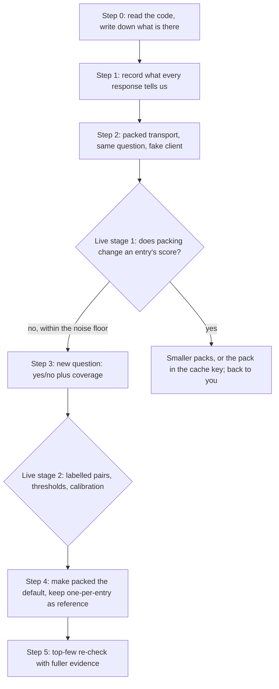

# Plan: change how the reuse search asks Jev, from one request per entry to packed requests

**Rick asked for this plan by voice between 17:42 and 17:44 EDT on 2026-10-07, before any change to how Jev is queried.**
It answers the response document beside it:
`2026.10.07-jev-reuse-sweep-request-shape-problem-statement-response.md`.

## 1. What is wrong today

The reuse search (`check_exists`) sends one HTTP request per catalogue entry. Measured once, live, today:
7,705 requests for one question, 58.9 seconds, about 131 requests a second. The documented limit is 80 a
second. Every request repeats the need and the rubric, and pays a fixed per-request overhead the response
document estimates at about 270 tokens.

Each request asks one three-way Choice (reuse / extend / unrelated). The tool adds two of the three
probabilities into "overlap" and reads the largest as "confidence".

## 2. What the response document recommends

| | today | recommended ("B-prime") |
|---|---|---|
| Requests per search | about 7,700 | about 31 to 77 |
| Where the need and rubric go | in every request | in `state`, once per request |
| Where a candidate goes | its own request | its own question inside a packed request |
| Entries per request | 1 | 100 to 250 |
| The question | one three-way Choice | a yes/no ("does it already provide this") plus a 4-level coverage score |
| Workers | 32 | 4 to 8 |
| Thresholds | 0.5 on "overlap" | re-fitted on labelled pairs |
| Areas-first route | my Alternative D | parked: 36.5% of the catalogue is in no area |

Its cost figures (about $0.13 to $0.15 a search today, about $0.04 packed) are estimates. So is its claim
that a candidate placed in one question cannot be seen by another. The document says both must be measured.

## 3. What this plan does not decide for you

These are your decisions. Each is asked one at a time after you have read this.

| # | decision | my recommendation |
|---|---|---|
| D1 | Change the transport only (pack the same three-way Choice), or change the question too (yes/no plus coverage score)? | Both, but in two separate steps, so a change in results can be traced to one cause |
| D2 | Pack size to start from | 200, then whatever the interference probe supports |
| D3 | Does the old one-per-entry path stay in the code? | My recommendation was yes, as the reference the packed path is checked against; not as the default. **Reversed by Rick's ruling: remove it. See section 7 and 9.3** |
| D4 | What the tool answers when some entries were not asked | My first recommendation was "never write new while any entry is unasked, the rule already in force". That was wrong about the rule in force: today any gap turns every verdict, reuse and extend included, into "uncertain". Ruled 19:24 EDT: keep today's rule, `verdict.decide` unchanged (sections 7 and 9.3) |
| D5 | Areas-first (Alternative D) | Park it; keep page-first as built |
| D6 | Does the reviewed token-usage commit (`a01d42d10`) merge now, ahead of the plan? | Yes: it only records what Jev already returns and changes no request |
| D7 | Who may make live calls, and from which seat | One named seat, on my go, per stage; never from a writer's seat on its own |

## 4. The steps, in order

### Step 0. Read the code and write down what is there (no code change)

One seat reads `src/lupin_mcp/reuse_tools.py`, the transport, the verdict rules and the receipt and replay
code, and adds a section to this document: the functions a packed path must touch, what a receipt holds
today, how replay finds an answer, and how the call budget counts. I have not read these files myself for
this plan; I know them from today's reviews. **Gate: you read that section.**

### Step 1. Record what every response tells us (no change to any request)

Model id, HTTP status, attempts, any retry-after, latency, input and output tokens, on every receipt.
Backoff gets jitter and honours retry-after. A receipt written by today's code still replays, until step 4
removes the old path; after that it does not (ruling D3, 9.3). Token usage is already written and reviewed
(`a01d42d10`). **Gate: review, unit tier at 100%, and one test that builds a receipt with today's receipt-writing
code on a fake client and replays it frozen to the same verdict and the same ids.** No real receipt is committed as a
fixture (D3). No live call.

### Step 2. Packed transport with the SAME three-way question (fake client)

Need and rubric in `state` once; each candidate in its own question. Pack size configurable. A refused
pack (422) is split in half and resent. An entry is answered only when its answer is present; everything
else is counted "unasked". The call budget counts HTTP attempts as it does now, with the additions in 9.2. Receipts
get a per-request layer; the per-entry answers stay in the cache (section 10.3 says how). **Gate: section 10.3
(the step 2 design) read and passed by María before any code is written; then review, unit tier at 100%, and the
step 1 constructed-receipt replay test still green.** No live call.

### Live stage 1. Does packing change an entry's score?

The same question, on the same entries: one per request, run twice (the noise floor), then packed at 10, 50
and 200. A probe entry moved first, middle and last, with random and near-duplicate neighbours.

| measure | pass |
|---|---|
| difference packed against single, per entry | no larger than single against single |
| verdict flips at the boundary | no more than the noise floor plus one point |
| tokens per request | recorded; replaces every estimate above |
| 429 or 529 responses | counted |

Cap: $2 of the $19.31. **Gate: I bring you the numbers. If packing moves scores, I stop and ask.**

### Step 3. The new question (fake client first)

A yes/no "does this already provide the capability" plus a 4-level coverage score, replacing the summed
three-way Choice. A new verdict rule built on them. Thresholds are placeholders until live stage 2.
**Gate: review, unit tier at 100%.**

### Live stage 2. Labelled pairs

All 376 twin pairs plus hard negatives, old question against new, both packed. Reported: twin ranked first,
twin in the top ten, a reliability chart and error per language, and measured dollars per search.
Thresholds are fitted on one half and checked on the other. Cap: the rest of the $19.31. **Gate: you see
the table and choose the thresholds, or tell me to choose.**

### Step 4. Make packed the default

The one-per-entry path is removed (ruling D3); a pack size of 1 through the packed path is the
single-entry reference from then on. Page-first keeps working in front of the sweep.
The MCP helper processes on every seat are restarted. **Gate: unit, cosa, coverage, integration; one live
search on the same question as today's run, compared with the stored receipt of that run: same verdict class and
the same top three ids, or a written reason. The stored receipt is read as plain JSON by hand, outside the receipt
reader (which refuses the old shape from this step on). The comparison is made and its result written into this
document before the commit that deletes the old path; without that written result the deletion does not land.**

### Step 5. Re-check the top few with fuller evidence

For an uncertain verdict, a second request carrying the full docstring and the first lines of source for
the top three. This is the document's answer to "uncertain, read the source". Planned after step 4, on its
own gate.

## 5. What exists already, built before this plan

I started five pieces before you asked for a plan. Both seats were stopped at 17:43. None is merged and no
live call was made.

| piece | sha | reviewed | what happens to it |
|---|---|---|---|
| Token usage on receipts | `a01d42d10` | Krishna PASS | Your call, decision D6 |
| Per-response records and backoff (step 1's content) | `4a4a38e39`, pin `refs/keep/jev-key-launcher/23` | no | Stopped. Held for step 1's approval |
| Comparison harness, shapes A to D, fake client | `0a5bbd577` | Krishna PASS | A measuring tool; kept unmerged until step 2 is approved |
| Packed builder inside that harness, fake client | `d6d987ca9` | no | Prototype for step 2; rewritten or reused once you approve the step |
| Live module, work in progress | `7abe282e1`, pin `refs/keep/jev/rachel-live-wip` | no | Stopped. Not continued without step 2's gate |

## 6. Cost

| item | figure | kind |
|---|---|---|
| Spent on Jev to date | $0.69 | your figure |
| Authorised for the live test | $19.31 | your ruling, row `53ebe1a9` |
| Live stage 1 | $2 cap | my proposal |
| Live stage 2 | the remainder | my proposal |
| A search today | about $0.13 to $0.15 | the document's estimate |
| A packed search | about $0.04 | the document's estimate |

## 7. Decisions recorded

| # | ruling | how given | when |
|---|---|---|---|
| D1 | **Two steps**: pack the same three-way question first and measure it, then change the question | Rick, keypress on a walk-through card | 2026-10-07, between 17:45 and 17:48 EDT |
| D2 | **200, then measure**: 200 entries a request is the starting default; live stage 1 tests 10, 50 and 200 and its result sets the default | Rick, keypress on a walk-through card | 2026-10-07, 17:51 EDT |
| D3 | **Remove it**: once packed is the default, the one-request-per-entry path is deleted (I had recommended keeping it as a reference). Consequence for this plan: step 4 deletes it, and the single-entry comparison in the live stages is made by the packed path with a pack size of 1 | Rick, keypress on a walk-through card | 2026-10-07, 17:50 EDT |
| D4 | **Keep today's rule** (ruled again at 19:24 EDT, replacing the 17:53 ruling "Never write-new ... a reuse or extend match among the answered entries still stands", whose second clause is withdrawn): `verdict.decide` is not changed by this plan. Any gap, an entry unasked or failed, still turns the verdict into "uncertain" (reuse and extend included), so the tool never answers "write new" on a gap. The unasked count is on every answer | Rick, keypress on a walk-through card | 2026-10-07, 17:53 EDT; re-ruled 19:24 EDT |
| D5 | **Park it**: no areas-first gate; page-first stays as built; revisit past roughly 50,000 entries or when measured daily spend says so | Rick, keypress on a walk-through card | 2026-10-07, between 17:53 and 17:57 EDT |
| D6 | **Token usage only**: `a01d42d10` merges with tonight's build; the status and backoff commit `4a4a38e39` is held for step 1 | Rick, keypress on a walk-through card | 2026-10-07, between 17:48 and 17:50 EDT |
| D7 | **One reviewer seat, on my go**: María runs each live stage, from merged and reviewed code, after my go carrying the dollar cap; the writer of the code never runs it live | Rick, keypress on a walk-through card | 2026-10-07, 17:58 EDT |

## 8. What I do not know

- Whether a candidate in one question is invisible to another. The document infers it; live stage 1 measures it.
- The real fixed overhead per request. Estimated at about 270 tokens.
- Whether our key has the documented limits. Today's run went faster than they allow and recorded no status codes.
- How the yes/no question behaves on a signature and one docstring line. Live stage 2 measures it.

## 9. Amendments after María's review (2026-10-07, 18:14 EDT)

Her review: `io/tmp/2026.10.07-maria-review-jev-packed-request-plan.md`. She read `src/lupin_mcp/reuse_tools.py`,
`src/cosa/repo/doc_lint/jev_transport.py` and `src/cosa/repo/symindex/verdict.py` at `48baaf49b`. Nothing was
run and no live call was made. Her verdict: do not start step 2 until findings 1 to 5 are answered.

**Where this section and sections 4 to 6 disagree, this section governs.**

### 9.1 What I had wrong

- Step 2 said a refused pack is "split in half and resent". The transport treats a 422 as terminal today: it
  stores the refusal and fails every later request without sending it. The split cannot work until that
  rule changes.
- Section 3 called D4 "the rule already in force". It is not. Today any gap turns every verdict into
  "uncertain", reuse and extend included.
- I offered D3 without knowing that replay rebuilds each one-per-entry request and looks it up in the cache.
- Step 1 said old receipts replay unchanged, step 2 gated on it, and step 4 deleted the code that does it.
- The "$2 cap" was a promise by whoever runs the stage. Nothing in the code counts tokens or dollars before
  spending; the 8,000-attempt ceiling bounds money only while one attempt is one entry.
- Live stage 1's "run twice" would be served from the cache the second time, so its noise floor would read
  exactly zero.

### 9.2 Changes to the steps

| step | change | from finding |
|---|---|---|
| 0 | Dropped as a separate step. María's review is the code reading; what it found is in this section | 10 |
| 1 | Unchanged in content. Its gate gains: one real receipt from before the change, with its cache entries, is committed as a fixture and replays | 2, 10 |
| 2 | A 422 becomes a refusal of that one request; 401 and 403 stay terminal. Test: a 422 on pack k leaves the later packs running | 1 |
| 2 | The call budget gains a ceiling in tokens (dollars at the pinned price), checked **before** each attempt; the attempt ceiling stays as well | 3 |
| 2 | The cache key gains a run index for measurement runs. Test: two indices make two live calls, one index makes one | 5 |
| 2 | Worker count (4 to 8), a token-rate pace and jittered backoff are inside step 2's gate, so step 1's backoff commit is a prerequisite of step 2, not an optional extra | 9 |
| 2 | New receipts carry a `request_shape` field and a bumped `tool_version`. The plan states what "attempts" means for a pack, what `failed_attempts` holds, and where the per-entry layer lives | 2, 7, 12 |
| 2 | The cache-key rule is written down for both outcomes of live stage 1: a per-candidate key if packing does not move scores, the pack hash in the key if it does; and what a frozen replay reads in each case | 6 |
| 2 | Page-first: say whether the page asks are packed (about 30 to 50 lines, one pack) | 12 |
| stage 1 | The number of questions, the minimum count of boundary entries and the pass numbers are fixed in this document before any money is spent. Too few boundary entries reads "inconclusive", never "pass" | 5, 8 |
| stage 2 | The split between the half thresholds are fitted on and the half they are checked on is fixed before the run | 10 |
| 4 | The live comparison is named: same question as today's run; verdict class and top three ids equal to the stored receipt, or a written reason | 10 |
| 4 | The wiki pages that describe "one POST per symbol" and the 8,000-attempt rule are updated in the same change | 12 |
| 5 | Has no gate yet. It is written before step 4 ends, or dropped from this plan | 10 |

### 9.3 Rulings the review touches

D3 and D4 are Rick's. Both are back with him; his answers are recorded in section 7.

- D3, asked 18:11, 18:30 and about 18:54 EDT (remove later and keep a replay-only reader / remove and accept the loss / keep the old path): three cards timed out. Asked a fourth time at 19:23, with the replay consequence stated on the card. **Rick, keypress, 19:24 EDT: "Remove it, accept the loss."** I had recommended keeping a replay-only reader.
- D4 (keep today's stricter rule, or relax it in its own step), asked 19:24 EDT. **Rick, keypress, 19:24 EDT: "Keep today's rule."**

What the two rulings change in this plan:

| where | change |
|---|---|
| Step 1 gate (9.2, row for step 1) | The fixture of one real receipt from before the change that must replay is **dropped**. Receipts recorded before step 4 are not replayable after it, by ruling |
| Step 4 | Deletes the one-request-per-entry path whole, its request builder included. No replay-only reader is kept. The receipt reader refuses a receipt whose `request_shape` is the old one, with a message that says the path was removed, and never guesses |
| Step 4 | The wiki page that describes replay says which receipts can be replayed and from which `tool_version` |
| Section 7, D4 row | Superseded. `verdict.decide` is **not changed** by this plan: any gap still turns the verdict uncertain, and it still never answers "write new". The sentence "a reuse or extend match among the answered entries still stands" is withdrawn |
| Step 2 | The unasked count stays on every answer (unchanged from D4 as first ruled) |

### 9.4 Order of approval

D3 and D4 were answered at 19:24 EDT on 2026-10-07 (9.3). María re-read it and passed sections 10.3, 10.5 and 10.6 (last pass 19:54 EDT, section 10). It now goes to Rick for approval. Nothing of
steps 1 to 5 starts before that.

## 10. Answers to María's re-read (2026-10-07, 19:30 EDT)

Her re-read: `io/tmp/2026.10.07-maria-rereview-jev-packed-request-plan.md`. Her verdict then (19:30 EDT, since met; see the 19:42 update below): start step 1 now; start step 2 once her open items 1 to 3 are written into this document; items 4 to 6 can follow, but item 5 must be done before the go for live stage 1. **Status 19:54 EDT:** María passed 10.3 to 10.8 (19:43); the plan awaits Rick's approval; no step started.
This section was written by Rachel (writer seat) at Cheech's instruction; "I" in sections 1 to 9 is Cheech. It answers her six open items one by one. **Where this section and an earlier one disagree, this section governs.**
**Revised 19:37 EDT after María's pass on 10.3** (`io/tmp/2026.10.07-maria-pass-on-plan-section-10-3-step-2-design.md`, eleven items; status table in 10.8). Revised: 10.1, 10.2, 10.3 a, c and d, 10.5 and 10.6. Cheech's 19:34 approval of 10.5 and 10.6 was withdrawn for every figure and rule changed here; it stood only for the 47,000,000 ceiling's value. **Updated 19:42 EDT:** Cheech re-approved 10.6 (19:38) and ruled the 10.5 band, minimum and pass 2 allowance (ruled 19:39, confirmed 19:42); María read the 10.5 numbers as correct (19:42). The code facts below were read in `src/lupin_mcp/reuse_tools.py`, `src/cosa/repo/doc_lint/jev_transport.py` and `src/cosa/repo/symindex/verdict.py` at `5785c22c0` (María read the same files at `48baaf49b`). Nothing was run and no live call was made.

### 10.1 Item 1: the gates for steps 1 and 2 had no test

Chosen: the gate is a **constructed receipt built by today's code inside the test**, not a dropped clause. Dropping the clause would leave "old receipts replay" unchecked while the old path still exists.
The test: build a receipt with today's receipt-writing code (`run_question`) on a fake client, then run the frozen replay (`replay_impl`) on it. It must return the same verdict and the same ids, with no difference reported. It stays green through steps 1 to 3 and ends with step 4, which removes the old path (ruling D3).
The test also covers a receipt with a failed entry in the old `{ id, attempts }` shape, because replay reads both shapes until step 4 (10.3 c). Changed above: the step 1 text and gate, the step 2 gate. No real receipt is committed as a fixture (ruling D3, 9.3).

### 10.2 Item 2: step 4's baseline, and which single arm live stage 1 uses

- **Step 4's comparison.** It reads the stored receipt of today's run as plain JSON by hand, outside the receipt reader, which refuses the old shape from step 4 on. The comparison is made, and its result written into this document, **before** the commit that deletes the old path; without that written result the deletion does not land. Changed above: the step 4 gate.
- **Which receipt.** Found by reading the per-repository data directory read-only (Rachel, 19:32 EDT): `/mnt/DATA01/include/www.deepily.ai/projects-data/lupin/reuse-review/receipts/949a66030e8df21a.json`, id **`949a66030e8df21a`**. It is the only receipt in that directory (1 file), and it is the 7,705-request run: `stats` entries 7,705, calls 7,705, attempts 7,705, answered 7,705, cache hits 0, failed 0, budget 8,000. Its call-log line (`call-log/a42a16e8.jsonl`) names caller `maria a42a16e8` and the need "A function that sends a notification to the user and waits for a yes/no answer, returning the answer." at 15:34 EDT.
  What step 4 compares against, as stored: `tool_version` 1, model `jev-1.13.0`, `index_sha` `ecc5f27e5c518aba2239a141643d359c8bfbb268`, verdict `UNCERTAIN_READ_SOURCE` with cause `LOW_CONFIDENCE`, `shortlist_total` 47, and a top three of `cosa.agents.bug_fix_expediter.cosa_interface.ask_confirmation`, `cosa.agents.claude_code.cosa_interface.ask_confirmation`, `cosa.agents.deep_research.cosa_interface.ask_confirmation` (each overlap 1.0). The receipt has no `route`, no `stages` and no token counts: it predates page-first and the token-usage commit. The comparison names the current index sha beside that one; if they differ, the written reason says so.
  The 58.9-second figure is from sections 1 and 9; it is not in the receipt or the call log.
- **Live stage 1's single arm.** The isolating arm is a **pack of 1 through the new path**: it differs from today's request (the candidate moves from `state` into the question's instructions), so it measures packing and nothing else. It is not today's production request.
- **The old-shape arm is read from the cache, not paid for (revised 19:37 EDT, María item 4).** The 15:34 run left exactly 7,705 responses in `jev-cache`, keyed by the old body hash alone, and that run had 0 cache hits. Measured read-only by Rachel at 19:37 EDT, reproducing each key with `build_request` and `request_hash`: against the stored snapshot's 7,705 sendable entries, **7,705 are cache hits**, so the method reproduces the keys. Against the index built at `5785c22c0` (7,753 symbols, 7,734 sendable), **7,697 are hits (99.5%) and 37 are misses** (for example `cosa.rest.routers._pinned_open.PinnedPathGone`). An old-shape run today costs only the 37 misses, about 18,600 tokens (under $0.001), and it is not a fresh run: it is single run 1 of the stored run, so it measures no noise. The earlier "about $0.13" is withdrawn. For the record, a fresh old-shape run measured 3,866,973 tokens (3,543,453 input and 323,520 output, summed from the `usage` in the 7,705 cached responses), about $0.16 at $0.042 per million; it is not needed. Cheech's 19:34 "include it" stands as: include the cached old-shape arm. Its rule is in 10.5.

### 10.3 Item 3: the step 2 design

This is the section step 2's gate names. Everything here is a design for María to pass before any code is written.

**a. Cache keys (revised after María, items 1 and 3).** Four key functions, never mixed. Each row says which code uses it.

| use | key | what a test pins |
|---|---|---|
| the old path, until step 4 | `request_hash( body )` exactly as today. `build_request` and `request_hash` are not touched, and the run index never enters the old body, so the cached 15:34 responses and the step 1 constructed-receipt test stay valid | `request_hash` of one fixed body equals its value at `5785c22c0` |
| live stage 1, every arm | the sha1 of the canonical `{shape, model, template hash, need, candidate text, pack size, run index}`. Each arm has its own run index: single run 1 = 1, single run 2 = 2, pack 10 = 3, pack 50 = 4, pack 200 = 5. No arm can read another arm's answers. Within one arm the key still caches, so a resumed or repeated arm pays nothing twice | two arms of different pack size make two live calls for the same entry; the same arm twice makes one |
| the packed path after a stage 1 pass | the sha1 of the canonical `{shape, model, template hash, need, candidate text}`: no pack size and no run index, so a new symbol costs one entry and any pack membership reads the same answers. It is switched on only after stage 1 passes, because stage 1 runs before its own outcome is known | a candidate answered in one pack is a cache hit in another |
| the packed path after a stage 1 fail (smaller packs, or the pack in the key) | the sha1 of the whole packed request body, membership and order included. One new symbol shifts every later pack | a changed neighbour makes a miss |

Frozen replay: the old path is unchanged. Packed with the per-candidate key: one cache entry per id taken from the receipt's request rows (d). Packed with the pack key: it rebuilds each pack body from that row's stored ordered ids and looks up the pack hash. In all cases `request_shape` is on the receipt and `tool_version` is bumped, so ids of old and new helper processes cannot collide while step 4's restart overlaps them. A packed response is split into per-candidate answers before caching; each cache entry also records its pack's request hash and size.

**b. "Attempts" for a pack.** They count per HTTP request, not per entry. `stats.attempts` is the sum of HTTP attempts over requests; `attempts_answered` is spent on requests that returned, `attempts_failed` on requests that ended failed. The stats also gain `requests` (HTTP requests formed) beside `entries`. The identity "attempts equals the sum over entries" no longer holds; the new identity is attempts equals the sum over requests. Assertions that change: `src/tests/unit/test_reuse_call_budget.py` (lines near 204, 228, 245, 260) and `src/tests/unit/test_reuse_page_first.py`.

**c. What `failed_attempts` holds (revised, María item 10).** For the packed path, one record per failed request: `{ request, ids, attempts }`. Replay builds its `gaps` mapping from those ids (each gets "failed"), so a gap id is still never read from a later cache. **Until step 4 replay reads both shapes**, the old `{ id, attempts }` and the new one; `replay_impl` reads `f[ "id" ]` today and must keep doing so for a receipt in the old shape. The 10.1 test covers an old-shape receipt that has a failed entry.

**d. Where the per-entry layer lives (revised, María item 2).** Not in the receipt: today's receipt holds the shortlist, the nearest, the doubtful and `failed_attempts`, and leaves the 7,705 answers in the content-addressed cache, and that does not change. The receipt gains a per-request layer of about 31 to 77 rows. Each row holds: its index, its request hash, its size, its **ordered `ids`** (7,705 short strings over all rows), its status (`answered`, `failed`, or `refused` for a 422 whose two halves are rows of their own with `split_from` pointing back), its attempts, and its tokens in and out. Replay rebuilds a pack from its row's ids. The earlier rule, pack k is entries `[k * size, (k + 1) * size)` of the snapshot's list, is **dropped**: replay works on `sendable( entries )`, which removes entries; `fetch_similar` also drops the query's own id; the page route asks only the covered subset; and a 422 split makes halves that no slice reproduces. Step 2's text "receipts get two layers" is replaced by this: the second layer is the cache.

**e. Page-first.** The page asks stay one request per page in step 2 (about 30 to 50 requests, under 1% of a search). A page's text is longer than an entry's signature and first line, so what stage 1 measures does not transfer to it. They travel through the same transport and get its changes (422 handling, token ceiling, run index); the replay plan (`asked`, `chosen`, `covered`, `skipped`) is unchanged. **Approved: page asks stay unpacked in step 2 (Cheech, 19:34 EDT).** Packing them is a later change if the measurements say it matters.

### 10.4 Item 4: the section 3 and section 7 D4 rows

Both rows now say what was ruled: `verdict.decide` is not changed, any gap still turns the verdict into "uncertain", reuse and extend included, and the withdrawn clause is named as withdrawn. Section 3's row also says that the first recommendation was wrong about the rule in force. Section 3's D3 row is edited too (Cheech, 19:34 EDT): it now says the recommendation was reversed by Rick's ruling, see section 7 and 9.3.

### 10.5 Item 5: live stage 1's numbers (revised 19:37 EDT after María, items 7 to 9 and 11)

Revised text; Cheech's 19:34 approval is withdrawn for the changed rows (see the note at the top of section 10). Not changed after any stage 1 result is seen without a note here naming who changed it and why.

| item | value |
|---|---|
| questions | **exactly 3**, one at a time. Question 1 is today's query, "A function that sends a notification to the user and waits for a yes/no answer, returning the answer." **Question 2** is "A function that checks that a database table's actual schema matches the expected columns, and reports any mismatch." (twin pair 13, `create_api_keys_table.validate_schema` against `create_notifications_table.validate_schema`, Jev overlap 0.56 both ways). **Question 3** is "A function that marks a one-time token record as used, so it cannot be redeemed twice." (pair 12, `EmailVerificationTokenRepository.mark_used` against `PasswordResetTokenRepository.mark_used`, 0.56 and 0.46). Both are Tiberius's proposals, from his 30 hand-scored pairs (`tiberius-stage1-questions-proposal.md`); neither has been put to Jev, so their boundary counts are inferred from twin-pair scores, not measured. **Reserve question**, used only if the pooled boundary count cannot reach the minimum after question 3, decided and written here before its arms run: "A function that takes an LLM reply containing a fenced JSON block and returns the metadata fields from it." (pairs 25 and 16). Cost, measured and estimated: a fresh single arm is 3.87M tokens (measured, 10.2); two single arms plus packs of 10, 50 and 200 are about 14M tokens per question (María's arithmetic: 7.7M for two single arms, about 6.3M for three pack arms at about 230 input and 42 output tokens per entry, the 230 unmeasured until the canary). Three questions are about 42M of the 47M ceiling, a margin of about 5M, and a 429 is charged at its input estimate (a 200-entry body is about 46k tokens). **Spend stop:** if question 1 measures above 15,000,000 tokens, the stage stops and asks before question 2 (Cheech 19:38). The reserve question runs only on a new ceiling from Cheech; none fits the 47,000,000 ceiling |
| boundary entry | an entry whose pack-of-1 overlap in run 1 lies from 0.35 to 0.65, a band fixed from the start with no widening (Cheech, ruled 19:39 EDT, confirmed 19:42) |
| minimum boundary entries | **90 pooled** after question 3 (Cheech, ruled 19:39 EDT, confirmed 19:42). Fewer than 90 reads **inconclusive**, never pass. The true flip rate is bounded at about 3.3% by zero observed flips in 90, and at about 5.3% if the one allowed flip occurs |
| stop after question 2 | if fewer than 50 boundary entries are pooled after question 2, the stage stops and asks before question 3 (María's addition, Cheech, ruled 19:39 EDT, confirmed 19:42) |
| the noise floor's minimum | **0.02**, the policy's own `sum_tolerance`. If the measured 99th percentile between single runs 1 and 2 is below 0.02 (Jev nearly deterministic), it is read as 0.02, so passes 1 and 3 can still be satisfied |
| pass 1: per-entry difference (the primary gate) | the 99th percentile of the absolute overlap difference between each pack size and single run 1 is no larger than the noise floor (measured, or 0.02 if lower). The maximum is reported |
| pass 2: flips at 0.5 | on boundary entries, flips of a pack size against single run 1 are no more than the noise floor's flips plus 1 |
| pass 3: the probe entry | placed first, middle and last in a pack of 200, with random neighbours and with near-duplicate neighbours (6 placements): each placement's overlap within the noise floor of its single value |
| an arm the ceiling stops | **invalid**, never a pass. Its entries are unasked and its numbers partial. The ceiling's refusals are counted in the receipt, separately from failures, so a reader can tell an arm cut by the ceiling from one cut by failures. The stage stops and asks |
| the old-shape arm | **reported only**, no pass or fail: per-entry difference (99th percentile and maximum) and boundary flips against pack-of-1 run 1, over the entries that were cache hits. The shapes differ (the candidate sits in `state` against in the question) and the stored responses are one run, so a difference mixes shape and noise. Cheech reads it |
| the canary | the first pack, of size 10, is read in full before the rest of its arm is paid for; its output tokens per entry are measured. Above 60 per entry the stage stops and asks (10.6) |
| default pack size | the largest of 10, 50 and 200 that passes all three. None passes: stop and ask |
| recorded, no pass or fail | tokens per request, counts of 429 and 529, flips at the other policy boundaries (confidence 0.9, page floor 0.3) |

### 10.6 Item 6: the token ceiling, and how it is checked before a send (revised 19:37 EDT after María, items 5 and 6)

A response's token count is known only after it arrives, so the ceiling works on an estimate before the send and the real count after. **The value, 47,000,000 tokens, stands as Cheech approved it at 19:34.** The checks below are revised and wait for his re-approval.

- **Value for live stage 1: 47,000,000 tokens**, input and output counted together. $2 at the pinned $0.042 per million input tokens is 47.6 million; rounded down it is $1.97. The plan has no price for output tokens, so counting them at the input price is the conservative choice. Stage 2's ceiling is set by Cheech's go, from what remains of $19.31.
- **Check and reserve are one step under one lock** (María item 5). Under the lock: if tokens spent, plus the reserves of every request **still in flight**, plus this request's reserve would cross the ceiling, no HTTP is made and the entry is counted unasked; otherwise this reserve is added to the in-flight total before the lock is released. Without that, 4 to 8 workers each pass the check at once and the run overshoots by up to workers times one reserve.
- **The reserve covers input and output** (María item 6). Input: 1.5 times the body's length in characters divided by 4, rounded up. Output: **60 tokens for each entry in the request.** The 60 comes from data: the 7,705 cached single-entry responses report output tokens of 40 to 42 (median 42, 99th percentile 42), so 60 is about 1.4 times. A pack's answers may differ; the canary (10.5) measures it. A request limit on output tokens was not chosen: whether Jev accepts one has not been read.
- **After each response:** the reserve is replaced by the reported `usage` (input plus output). A response with no usage keeps its reserve as spent. An attempt that got no response (a 429 or a connection error) is charged at its input estimate, because a retry re-sends the body.
- **The attempt ceiling of 8,000 stays as well**, as a second, independent limit.
- **Tests that gate step 2:** a send is refused with zero HTTP calls when the reserve would cross the ceiling; **with a fake client that blocks, 8 workers hold sends in flight at once and the admitted reserves never exceed the ceiling, the rest being refused with no HTTP**; a pack of 200 reserves 12,000 output tokens more than a pack of 1, and a send that fits on input but not on output is refused; real usage replaces the reserve; a response without usage keeps it; a failed attempt is charged at its estimate; the attempt cap still stops a run when the token ceiling has not been reached.

### 10.7 What this section left open, and where each item stands

| # | item | state |
|---|---|---|
| 1 | The receipt id of today's run | Closed, Rachel 19:32 EDT: `949a66030e8df21a`, one match, path and contents in 10.2 |
| 2 | Whether live stage 1 includes the old-shape single run | Closed, Cheech 19:34 EDT: include it. Revised 19:37 EDT: it is the cached arm, free (10.2), reported only (10.5) |
| 3 | The numbers in 10.5 and the ceiling in 10.6 | The ceiling's value is approved (Cheech 19:34 EDT). The checks in 10.6 were re-approved by Cheech (19:38 EDT). The 10.5 numbers were ruled by Cheech (19:39 EDT, confirmed 19:42) and read as correct by María (19:42 EDT). Closed |
| 4 | Page-first not packed in step 2 | Closed, Cheech 19:34 EDT: yes, unpacked (10.3 e) |
| 5 | Section 3's D3 row | Closed, Cheech 19:34 EDT: edited to say Rick's ruling reversed the recommendation (10.4) |
| 6 | María's pass on 10.3 before step 2's code starts | Closed. She returned it at 19:34 with eleven items; 10.8 answers them; she passed 10.3 and 10.6 at 19:38 EDT |

### 10.8 María's pass on 10.3, 19:34 EDT: her eleven items

Her file: `io/tmp/2026.10.07-maria-pass-on-plan-section-10-3-step-2-design.md`. Cheech's two priorities are items 1 and 4.

| # | her finding | state | where |
|---|---|---|---|
| 1 | stage 1 arms share a cache, so a pack arm can read the single arm's answers | **Answered.** Stage 1 keys carry pack size and a distinct run index per arm; the per-candidate key is switched on only after a pass; two tests named | 10.3 a |
| 2 | replay cannot rebuild packs from a snapshot slice | **Answered.** Each request row stores its ordered ids; the slice rule is dropped | 10.3 d |
| 3 | the old path must keep its key | **Answered.** `request_hash( body )` untouched, a test pins it; the new keys are separate functions | 10.3 a |
| 4 | the old-shape baseline is cached and free | **Answered, with a measurement.** 7,697 of 7,734 current entries are cache hits (99.5%), 37 misses, about 18,600 tokens. The "$0.13" is withdrawn. It is served from files on disk, not paid for | 10.2 |
| 5 | the token ceiling needs a lock over in-flight reserves | **Answered.** Check and reserve are one step under one lock; a blocking-client test with 8 workers | 10.6 |
| 6 | the reserve ignores output | **Answered.** 60 output tokens per entry, from 7,705 measured responses (40 to 42); the canary measures a pack | 10.6 |
| 7 | a zero noise floor makes passes 1 and 3 unsatisfiable | **Answered.** The noise floor is read as at least 0.02 | 10.5 |
| 8 | the ceiling reached mid-arm | **Answered.** Such an arm is invalid, never a pass; the stage stops and asks | 10.5 |
| 9 | which pass applies to the old-shape arm | **Answered.** Reported only, no pass or fail | 10.5 |
| 10 | `failed_attempts` changes shape against the 10.1 gate | **Answered.** Replay reads both shapes until step 4; the 10.1 test covers an old-shape receipt with a failed entry | 10.3 c, 10.1 |
| 11 | questions for stage 1 are not named | Answered 19:42 EDT. Question 1 is today's query; questions 2 and 3 and the reserve question are Tiberius's proposals from his 30 hand-scored twin pairs, named in 10.5 with their pairs. Their boundary counts are inferred, not measured | 10.5 |

Her "verified, no action" list stands. Her note: cite the two test files by test name when the tests are written, not by line.

## 11. Rick's walk-through and approval (2026-10-07, 22:05 to 22:19 EDT)

Rick answered the approval card with "I want you to walk me through all of the questions in the plan". I put
seven decisions to him one card at a time. Each ruling below is his keypress or his own words typed on the
card; none is a timeout default. Written by Cheech at 22:20 EDT (`date` read 22:19:54 just before).

**Where this section and sections 4 to 10 disagree, this section governs.**

| # | decision | Rick's ruling | what I had recommended |
|---|---|---|---|
| 1 | Live stage 1's spend limit | **Three dollars** | two dollars |
| 2 | The searches live stage 1 puts to Jev | **The three named in 10.5, the reserve fourth** | the same |
| 3 | The pass bar | **Ninety pooled boundary entries**, band 0.35 to 0.65 | the same |
| 4 | Step 5 (re-check the top few) | **Out of this plan; its own plan later** | the same |
| 5 | The page asks | **"I say optimize it. Pack them as well."** | leave them one request each (my ruling of 19:34, now withdrawn) |
| 6 | Live stage 2's spend limit | **Spend is not the constraint.** His words: "I'm happy to put another 40 bucks on that account if it gets us answers", "not enough on the strategic value of having a statistically valid sample tested thoroughly from end to end", "tell me before I go to bed what the spend is looking like and I'll make sure that we have double that" | set it after stage 1, with him |
| 7 | Approval, and the size of the end-to-end test | **Approved: 100 searches end to end** | the same |

### 11.1 What the rulings change

| where | change |
|---|---|
| 10.6, the ceiling's value | Live stage 1's ceiling is **71,000,000 tokens** ($3 at the pinned $0.042 per million is 71.4 million, rounded down), input and output counted together. The 47,000,000 figure is superseded. The checks in 10.6 are unchanged |
| 10.5, the reserve question | It now fits: four questions are about 56M of 71M. It still runs only if three questions pool fewer than 90 boundary entries. The sentence "The reserve question runs only on a new ceiling from Cheech; none fits the 47,000,000 ceiling" is superseded |
| 10.5, the spend stop | Unchanged: question 1 above 15,000,000 tokens stops the stage and asks |
| 10.3 e, page-first | **Superseded.** The page asks are packed in step 2: all of a search's page asks travel in packed requests through the same transport as the entry asks (the wiki index has 86 lines, so one request at a pack size of 200). `_choose_pages` and the replay plan (`asked`, `chosen`, `covered`, `skipped`) keep their meaning |
| Live stage 1, a new arm | The page ask is a different question from the entry ask (it reads a capability's one-line description and only chooses which packages to sweep first, at the policy floor 0.3). So stage 1 gains a **page arm**: for each stage 1 question, the page asks sent one each, twice (the noise floor), then packed. Reported: the per-page overlap difference, and whether the set of chosen pages changes. A changed set of chosen pages is a fail for packing the page asks and comes back to Rick; it is never quietly unpacked |
| Step 5 | Removed from this plan. Section 4's step 5 and its box in the diagram are superseded. A separate plan is written after live stage 2 |
| Section 6, cost | Superseded by 11.2 |
| Live stage 2 | Gains the end-to-end run in 11.3. Its gate is unchanged: Rick sees the table and chooses the thresholds, or tells me to choose |

### 11.2 The spend, as told to Rick before bed (22:19 EDT)

| part | tokens | dollars |
|---|---|---|
| Live stage 1: three questions, the reserve, the page arm | about 56M | about $2.40 |
| Live stage 2, the pair list of section 4 | about 11M | about $0.50 |
| End to end, 100 searches, old question and new | about 420M | about $18 |
| Total | | about $21 to $25 |

Authorised today: $19.31 (row `53ebe1a9`), $0.69 spent. I asked Rick to top the account up so that $50 is
available. **Until he says the top-up has landed, every ceiling stays inside $19.31.**

How firm: one input is measured, 3.87M tokens for a single-entry pass over 7,705 entries (10.2). The packed
figure of about 272 tokens an entry is María's arithmetic (10.5) and is unmeasured until the canary. Output
tokens are counted at the input price because this plan has no output price. I owe Rick the measured cost
per search when the canary returns.

### 11.3 The end-to-end run (new; its protocol is written and reviewed before any of it is paid for)

What it is for: the pair list of live stage 2 measures whether Jev ranks a known twin among about 52
candidates. It does not measure the tool. This run asks the tool's own question: given the need a member of
a twin pair was written for, does a full packed sweep of the whole catalogue put its twin on the shortlist.

Fixed here, before any result is seen:

- **Sample:** 100 of the 376 twin-pair members, drawn with a fixed seed from the manifest the baseline used
  (receipt `949a66030e8df21a` names the catalogue; the baseline's manifest and seed 0 are in
  `projects-data/lupin/reuse-recall-baseline-2026.10.06/`). The draw is stratified by language in proportion.
- **Each search:** every sendable catalogue entry asked, packed at the default size live stage 1 chose, the
  member itself excluded as `exclude_id`.
- **Both questions:** the three-way Choice and the new yes/no plus coverage question, on the same 100.
- **Reported:** twin on the shortlist, twin ranked first, twin in the top ten, the verdict class, entries
  unasked, and measured dollars per search; each with its count out of 100 and a 95% interval.
- **Not yet written:** the need text for each member (who writes it and from what, so that it does not leak
  the twin), the threshold the new question is read at before live stage 2 has fitted one, and what a
  failed or cut-short search counts as. John drafts the protocol as section 12; María reviews it; nothing of
  11.3 is paid for before her pass.

### 11.4 Order of work, on this approval

Step 1 (the held record-and-backoff commit `4a4a38e39`) is reviewed, then merged. Step 2 is built red-first
with the page asks packed and reviewed. María runs live stage 1 on my go, from merged code, with the
71,000,000 ceiling. Step 3 is built. Live stage 2 and the end-to-end run follow, each on my go.

### 11.5 Corrections to this section (Cheech, 22:24 EDT, after Rio's report and María's read)

María's read: `io/tmp/2026.10.07-maria-read-of-plan-section-11.md`. Each row below is a thing I wrote wrong
above; the text above is left as written and this table governs.

| what I wrote | what is true | change |
|---|---|---|
| 11.4 first draft, and my card to Rick: step 1's commit is "reviewed" and held | `4a4a38e39` never had a named PASS (Rio, 22:22 EDT; his rebuild on main `d78ea5214` is tip `57d1d868a`, pin `refs/keep/jev-step1/01-telemetry-on-main`) | It gets a named PASS on `57d1d868a` before it merges. Rick is told |
| 11.1, page arm: "A changed set of chosen pages is a fail" | With no tolerance the arm can fail on Jev's own run-to-run noise (María, item 1) | The page arm's noise floor is measured first: the two one-each runs are compared with each other. Packing fails the page arm only if the packed run changes the set of chosen pages on **more** stage 1 questions than the two one-each runs differ between themselves. The per-page overlap difference is held to the same rule as pass 1 of 10.5 (99th percentile no larger than the noise floor, read as at least 0.02). With at most 86 pages a question, the arm reads "inconclusive" rather than "pass" if no page lies within 0.05 of the 0.3 floor in any question |
| 11.1 and 11.2: ceilings per stage, a total of about $21 to $25 against $19.31 | The ceiling in 10.6 lives in one run's call budget. Nothing adds up spend across runs, so stage 1, stage 2 and the end-to-end run can together pass $19.31 before any top-up, each inside its own ceiling (María, item 2) | Step 2 gains a **persisted spend ledger**: one file under the fleet data root, appended under a lock by every live run (tokens, the run's name, the time), read before a run starts and before each send. A live run is refused when the ledger total plus the run's ceiling would pass the **account limit**, a single number that is $19.31 until I record Rick's word that the top-up landed. Tests gate step 2: two runs whose ceilings each fit and together do not, the second is refused with zero HTTP calls; a ledger that cannot be read refuses the run |
| 11.2: "Until he says the top-up has landed, every ceiling stays inside $19.31" | Rick, typed on a card at 22:32 EDT: "I already raised the account limit to approximately $44" | The ledger's account limit is **$40**, one named number, inside his "approximately $44". The three live parts estimate $21 to $25. Rick also ruled at 22:32: no push tonight (he pushes in the morning), and the box stays on |
| 11.3: the sample "100 of the 376 twin-pair members ... stratified by language" | All 376 members are Python and they form 151 independent twin groups (John and María, measured from the manifest, 22:24 to 22:31) | The sample is one member from each of 100 of the 151 groups, 58 with an exact cluster and 42 near-only, seed 20261007, frozen in a file María reproduced. The run says nothing about the TypeScript and JavaScript entries. Section 12 governs the protocol |
| 11.3: "100 of the 376 twin-pair members" beside section 4's "All 376 twin pairs" | The baseline's figures are 376 **members** and 754 ordered pairs ("a twin ranked first for 337 of 376 members", row `06f44efa`). Section 4's "376 twin pairs" is loose wording for the same 376 members (María, item 3) | The end-to-end sample is 100 of the 376 members. John's protocol states the population count from the manifest file itself, not from this sentence |

### 11.6 Step 2 as built (Rachel, 22:41 EDT; the commits are pinned `refs/keep/jev-step2/NN-red` and `NN-green`)

Written while step 2 is being built, so it states what the code does today. If a unit changes, the edit is dated here.

| part | where | what it does |
|---|---|---|
| Packed request, answers, keys | `src/lupin_mcp/reuse_pack.py` | `pack_request`, `pack_answers`, the stage 1 key, the per-candidate key and the pack key; the old `request_hash` is untouched and pinned by a literal |
| One pack, and a 422 | `send_pack` | A 422 splits the pack in half, the larger half second; a 422 on one entry fails that entry. Every entry ends answered, failed or not reached |
| A whole catalogue | `sweep_packed`, `packed_sweeper` | Cache hits first, then the misses in packs on 4 to 8 workers (6 by default); page asks and entry asks use the same function |
| Token ceiling | `src/lupin_mcp/reuse_ceiling.py` | `TokenBudget`, per 10.6: one lock over spent plus in-flight plus this reserve; 60 output tokens an entry; an unanswered attempt is charged its input reserve |
| Account ledger | `src/lupin_mcp/reuse_ledger.py` | `AccountLedger`, per 11.5, with María's four additions below |
| Receipts | `src/lupin_mcp/reuse_tools.py` | Packed receipts are tool version 2 with `request_shape`, `pack_size` and a `requests` layer; version 1 receipts still load and replay on the old path |

**María's four additions to 11.5 (her file `io/tmp/2026.10.07-maria-four-additions-to-plan-11-5.md`), and the test that holds each.**

1. The ledger lock is a file lock across processes. `test_a_process_holding_the_file_lock_makes_another_processs_begin_run_wait` and its `spend` twin hold the lock in the test process and require a second process to wait; removing the lock fails both. A first version that raced two processes passed with the lock removed, so it was replaced.
2. The ledger path is one file from a worktree and from the main tree: `ledger_path( index_root )` resolves under the fleet data root and never reads `LUPIN_ROOT`. `test_the_ledger_path_is_the_same_from_a_worktree_and_from_the_main_tree`.
3. The price is written once: `PRICE_PER_MILLION_USD = 0.042`, output counted at the input price, `ACCOUNT_LIMIT_TOKENS` derived from `ACCOUNT_LIMIT_USD`, `STAGE1_CEILING_TOKENS = 71,000,000` checked against three dollars. A change to a constant is a dated edit here.
4. The page arm names its pack sizes: **10, 50 and all 86 pages (one request)**, each with its own run index like the entry arm, plus the two one-each runs for the noise floor. The runner that does this is not part of step 2.

**The account limit is 40 dollars** (Cheech, 22:33 EDT, after Rick raised the Jev account to about 44 dollars at 22:32): `ACCOUNT_LIMIT_USD = 40.00`, which is 952,380,952 tokens. This replaces the 19.31 dollar limit and the sentence "until he says the top-up has landed" in 11.5. The 11.2 table sums to about 487M tokens, which fits with about 465M left.

**The refusal breaker.** A refused pack and all its split halves count as one refusal, keyed by the top-level pack's request hash; any answered request resets the streak. `sweep_packed` takes the breaker as an argument and calls `refused( key )` once per refused top-level pack and `answered()` once per answered one. The breaker class is Rio's (`RefusalBreaker`, on his step 1 chain, not yet in this base); the wiring into the context waits until his chain is merged. Test: `test_the_breaker_hears_one_refusal_for_a_refused_pack_and_all_its_halves`.

**Not verified, named rather than bridged.**
- Where the candidate sits in a packed question: the template's `CANDIDATE` is replaced by the quoted entry text inside the question's instructions. No live call has tested that Jev reads it that way; the canary in live stage 1 does.
- The 60 output tokens an entry is from single-entry answers (40 to 42); a pack's answers may differ.
- The pack-hash cache mode (10.3 a, the fourth key) has its key function and no sweep path yet; it is needed only if live stage 1 fails.

## 12. The end-to-end run: protocol (written by John 🏄🏽 `fc3913f6`, 2026-10-07 22:25 EDT; María PASS 22:31 EDT; appended to the plan 22:34 EDT at Cheech's word)

Written because section 11.3 left three things open and said "John drafts the protocol as section 12; María reviews it; nothing of 11.3 is paid for before her pass." María passed it at 22:31 EDT (her file: `io/tmp/2026.10.07-maria-review-of-e2e-protocol-section-12.md`, plus her messages of 22:30 and 22:32); nothing of 11.3 is paid for before Cheech's go. It fixes them before any result exists. Nothing in it has been run and no live call was made. **All 376 twin members are Python files, so this run says nothing about the 1,165 `ts` and 926 `js` entries in the catalogue.** **Where this section and 11.3 disagree, this section governs.** Items I propose and could not settle from the record are in 12.8, each with a recommendation.

Read for this draft: the plan (sections 1 to 11) as of 22:20 EDT; `reuse_tools.py`, `verdict.py` at `5785c22c0`; the baseline directory `reuse-recall-baseline-2026.10.06/` (manifest, `scoring-rule.md`, `pair_runner.py`, `stage2-rank-figures.json`); the response document's Q5 (the new question and its placeholder verdict map); Tiberius's stage 1 questions proposal.

### 12.1 The sample

- **Population:** the 376 distinct twin members of `manifest.json` (sha256 `bfbfceab399cf753093f0c9ee0bec73a0de00738a0696126a669e129de466941`, commit `ac0f91673`). Every one is in the index and sendable (manifest counts).
- **The unit is the twin group, not the member** (María's measurement, 22:28 EDT, which I re-derived: same figures). Join the exact clusters and near pairs into one graph and take its connected groups: **151 independent twin groups** (sizes 2: 112; 3: 24; 4: 9; 5: 2; 6, 8, 9 and 11: one each). A search for one member and a search for its twin are near-copies of one question, so 376 members are not 376 independent units. In the first draft, sampled by member, 30 of the 100 had a twin also in the sample.
- **Sample:** 100 of the 151 groups, **one member of each**, so no two sampled members are twins of each other or share a group (checked in the drawing script). The 100 results are then independent and the 95% Wilson interval is valid as written for the groups. 100 of 151 is two thirds of the population: this is a sample of groups, a finite-population correction would narrow the interval, and it is **not** applied silently; the table gives the interval as computed and says so.
- **Strata** (replaces the by-member 48/43/9 of my first draft, which double-counted large groups): groups that contain an exact cluster 88, near-pair only 63; in proportion, largest remainder: **58 and 42**. 11.3's "by language in proportion" has one stratum, because **all 376 members are Python files**; the catalogue also holds about 1,165 `ts` and 926 `js` entries (symbols.md at `5785c22c0`), none of them a twin member. **So this run says nothing about recall for TypeScript or JavaScript entries.**
- **Draw.** One `random.Random( 20261007 )`, advanced across the strata in the order has-exact-cluster, then near-only; the order of calls on the one generator is: for the has-exact-cluster stratum, `sample( groups, 58 )` (groups sorted by first member id), then `choice( sorted member ids )` for each of those 58 groups in the order drawn; **then** the same for the near-only stratum, `sample( groups, 42 )`, then 42 `choice` calls. It is not all the samples first and all the choices after: that order gives a different set (María's first reading did). The seed picks the member, never "first". Frozen in `io/tmp/2026.10.07-john-jev-e2e-sample-by-component-58-42-seed-20261007.json` (sha256 `5b6d84fc2dd8dc458b36255e129001f55e3fbe4d252c14c6d65a4994779a91fd`; manifest sha256 `bfbfceab399cf753093f0c9ee0bec73a0de00738a0696126a669e129de466941`, commit `ac0f91673`). The seed is the date; R1 in 12.8 closes it: no other seed. The file's own `method` field is a summary and this paragraph governs it; the member list is what is frozen. The by-member file `...-sample-seed-20261007.json` and the 50/42/8 file `...-option-b-by-group-...json` are superseded and not to be used.
- **What the 100 look like.** Group sizes drawn: 74 of 2 members, 15 of 3, 11 of 4 or more. Top packages in the sample: `cosa.agents` 39, `cosa.rest` 31, `cosa.repo` 7, `cosa.memory` 6, `lupin_cli.claude_code` 4, and nine other packages with 13 members between them (39 + 31 + 7 + 6 + 4 = 87 in the five named). All of it is one code base, so the 100 are independent as groups and not independent of the habits of the people who wrote the code.
- **Stage 2 overlap (María's O2, whole groups).** Live stage 2 fits thresholds on one half of the same 376 members. A twin of a sampled member has the same text, so removing the 100 members from stage 2's fit half is not enough: the unit to remove is the group, which leaves 51 groups for stage 2's fit and check together, too few to do both. Chosen (María's option a, recommended, decision O2): **the primary reading in this run uses the fixed 0.5 cut for both questions**, set now. A threshold stage 2 fits, if it has one by then, is reported beside it and labelled "fitted on overlapping data". This keeps 100 searches and keeps all of stage 2's data. The two alternatives are (b) drawing only from stage 2's held-out half, about 75 groups, fewer than 100 searches, and (c) fitting stage 2 on 51 groups, a weak fit.

### 12.2 The need text for each member

What the run asks is "given the need this member was written for, does the sweep find its twin". The need must describe the member without handing Jev the answer.

1. **Who writes it.** One bounded Claude Code job per member (covered by the Max plan, no per-token spend), run by a seat Cheech names; never Jev, never a seat that will score the run. Tools off. Its input is the member's full docstring and body with the identifiers removed (below). It is never given the twin, the group, the manifest or any Jev answer.
2. **Form.** One sentence of 8 to 40 words in the shape of the stage 1 questions: "A function that ...", or "A method that ..." / "A class that ...", saying what it does and what it returns, in plain words.
3. **Mechanical rules** (a script checks all 100; a failure sends that one member back to the writer, not to a person):
   - no token of the member's id, and no identifier of any of its twins: class names, function names, module and file stems, argument names;
   - no run of 4 words in a row (case-insensitive) in common with the member's id, signature and first docstring line, which is all Jev sees of a candidate (`entry_text`), **and the same check against each twin's `entry_text`** (María): the twin is the target, and a near twin's text differs from the member's. The 4 is my choice, not a measurement; a copy of either would test word matching, not the capability;
   - length and form as in 2.
4. **Faithfulness.** A need that does not describe its member makes a miss that is not the tool's. Tiberius (by O6; a reader who has seen no Jev answer for them and is not the seat that writes the needs) reads **20 needs, named by `sample( sorted frozen member ids, 20 )` on a fresh `random.Random( 20261007 )` only after the 100 are frozen,** against their members' bodies, plus every need the script rewrote more than once. More than 2 of the 20 judged unfaithful: all 100 are rewritten by a second job and checked again. The 20 and the verdicts are kept with the needs.
5. **Frozen.** The 100 needs go in `projects-data/lupin/reuse-e2e-2026.10/needs.json` with each writer job id, the check results and the file's sha256, and the sha256 is written into this section before the first live call. A need is never edited after its sha is recorded; a replacement is a new file and a new sha.

#### 12.2 as built, and the frozen set (Cheech, 2026-10-09 01:40 EDT)

**The frozen set.** `projects-data/lupin/reuse-e2e-2026.10/needs.json`, sha256 `aa8965ac088089117c628a6d1f07257cf1f404ebe32af1cb52594ae4141325e3`, frozen 2026-10-09 01:34 EDT. It holds 100 needs in the shape `reuse-e2e-needs-1`, each with its writer job id, and names the sample by `sample_sha256` `5b6d84fc2dd8dc458b36255e129001f55e3fbe4d252c14c6d65a4994779a91fd`. The file is not in git; the sha above is its only anchor.

| item | result | who measured, and how |
|---|---|---|
| Mechanical rules (item 3) | 100 checked, 0 failed | Sam's script at `264ee04a1` (Krishna PASS), on index `gen-113884c581`, `symbols.jsonl` sha256 `34b5eeeb73e6effc219b9553a6f2c7ead53f5b5ac2045e7c0abd7fe717f3a1b1`. Results beside the needs as `check-results.json`, sha256 `978e8e2a4711e1d04547fd27372f3285f4f3ad014877f11b31a03bb531fe71e8`. I read its summary; I did not re-run the script. |
| Faithfulness (item 4) | 0 of 20 unfaithful; 0 of 6 further needs that were rewritten more than once | Tiberius, `io/tmp/2026.10.09-tiberius-faithfulness-read-of-20.md` (sha256 `f9ec1f29fa2fb8c422a08fd45159c34ad33632c9071f9f04a2cd94c694f79974`; under `io/`, not in git). I repeated the draw with the same seed and got the same 20 in the same order. I did not repeat the reading. |
| The last change before the freeze | one need, `PredictionDecisionRepository.add_decision` | I compared the frozen file with the run before it (sha256 `766f89ea879b04b924340010223c49e3ec005a35787e6705964782df4247ceb5`): same 100 members, one row different. |

Tiberius marked one need faithful but thin: `DeepResearchToPresentationJob.__init__`, where only the word "slideshow" separates it from the podcast job. A miss on that member should be read with this in mind.

An earlier set of 100 was thrown away: it was written before the model call was isolated from the seat's own settings. No need from it is in the frozen file.

**Where the build departs from items 1 to 5.** These are my rulings of 2026-10-09, made with Rick asleep. He has not seen them and may overturn any of them.

1. **The writer (changes item 1).** Item 1 says one bounded Claude Code job per member. The writer instead makes one in-process Claude Agent SDK call per member, tools off, isolated with the settings in `model_transport`. It is still covered by the Max plan, and it is still given only the member's body with identifiers removed, never a twin, the group, the manifest or a Jev answer.
2. **The index (adds to item 3).** No index was pinned for the need check, so a fresh one was built at `e65349f12` (`gen-113884c581`). The result above is for that index only. The runner repeats the check on the run's own index before the first paid call.
3. **Retry hints (adds to item 3).** A need that fails goes back to the writer with a hint. The hint may name the member's own offending word, and may say the sentence is too long or too short. A retried need is checked like a first one.
4. **The identifier rule (narrows item 3).** "No token of the member's id" is applied to whole identifiers. The pieces of an identifier split at underscores are not banned. On the first run, 58 needs failed under the piece rule and 3 under the whole-identifier rule.
5. **A twin's word in a hint (departs from item 1).** For an identifier failure, the list sent back to the writer may carry bare words to avoid, and one of those can be a twin's argument name. This happened for one member: `add_decision` was told to avoid "source", an argument name of its twin `CanonicalSynonymRepository.add_synonym`. The writer saw that one word and nothing else of the twin. Tiberius drew this member in his 20 and found its need faithful and free of the twin.
6. **A fact about two discarded runs.** The prompts that wrote the need for `get_voice_persona` in runs 3 and 4 carried the check names "member_text_run, twin_text_run". Neither run is the frozen one.
7. **One file shape.** `reuse-e2e-needs-1`, as the writer emits it.

8. **A failed search's cause (adds to 12.4).** The verdict's cause for a search whose answer could not be parsed stays `CALL_FAILED`. The receipt lists the malformed answers, so the driver can report `MALFORMED_ANSWER` beside it. Hitting the token ceiling is its own cause.

**Not measured.** The check has not yet been run on the run's own index (ruling 2). Nobody has measured whether the 100 sentences are specific enough to find their twins; that is what the run is for.

### 12.3 The two questions, and the threshold for the new one

Both questions run on the same 100 needs, each search a full sweep of every sendable entry with the member excluded (`exclude_id`), packed at the default size live stage 1 chose, with no page route. **Today's code reaches a full sweep only through `fetch_similar`, which takes a symbol id as its need;** the run needs a way to give a free-text need to a full sweep (a flag that turns the page route off in `run_question`). That is a requirement on step 2 or 3, not something this run can add.

- **Old question:** the three-way Choice, read as today: shortlist = entries with `p_overlap` (reuse plus extend) at least 0.5, ranked by `p_overlap` then id, cut to 10 (`verdict.POLICY`).
- **New question:** the yes/no "does the candidate already provide the capability" (call its probability `provides`) plus the 4-level coverage score (0 to 3).
- **The threshold for the new question** while stage 2 has fitted none. The response document's verdict map (reuse at `provides` 0.7 or more; extend below 0.7 with coverage 2 or more; uncertain from 0.3 to below 0.7; write new below 0.3 with coverage below 2 and nothing unasked) is placeholder, by its own words. For the shortlist, which is what the headline counts, I propose **`provides` at least 0.5, ranked by `provides` then id, cut to 10**. Reason: it is the old question's own cut-off, so the two rows differ in the question and not in the cut. The 0.7 and 0.3 of the verdict map are used only for the verdict class column.
- **Which cut is primary (revised after María, O2):** **0.5 for both questions, always.** A threshold stage 2 has fitted, if there is one, is reported beside it and labelled "fitted on overlapping data" (12.1). The table also gives the numbers at 0.3 and 0.7, computed from the stored probabilities with no new call. **No threshold is fitted on these 100.**
- **Threshold-free figures** are reported for both questions: twin ranked first, twin in the top ten whatever its score. The old question's baseline on a 52-candidate pool (not this task) was ranked first 89.6% and in the top ten and above 0.5 for 48.7% (`stage2-rank-figures.json`); the point of this run is the same figures on the whole catalogue.

### 12.4 What counts as a failed or cut-short search

A search is **complete** only when all of these hold in its receipt: every sendable entry was asked (`failed` and `not_checked` both 0 in the stats, so no id is in `missing`); no answer is malformed (`malformed` empty); no request ended refused (a 422 pack that was split and whose halves were answered does not count as refused); a receipt was written; the token ceiling did not stop it. This is the existing rule for a gap: any unasked or failed entry turns `decide()` to `UNCERTAIN_READ_SOURCE` with `CALL_FAILED` (ruling D4), and the shortlist is then built from the answered entries only.

- **Incomplete (failed or cut short)** is any search that is not complete, however many entries it did get. It counts as a **miss** on the three headline figures, as `scoring-rule.md` already does ("a member whose call failed or whose answer was malformed counts as a miss and is listed"). It is listed with its unasked count, its cause (`CALL_FAILED`, `MALFORMED_ANSWER`, the token ceiling, or a refusal by the spend ledger or the account limit, each a reason of its own, never folded into failures or into the ceiling) and its tokens.
- **No resume inside the measured run.** A user does not get a second pass at an incomplete search, so the figure does not either. After the run, an incomplete search may be completed once from the cache, which serves the answered entries and asks only the missing ones; that is reported as a separate line, never merged into the first.
- **Complete-only figures** are reported beside the headline (the same counts over complete searches only, with their own n), so a reader can see how much of a miss is the tool's reading and how much is its reliability.
- **The ceiling stops a whole run, not one search.** Searches the ceiling stops before they start are **not run** (not failed). The run is then **invalid** for those members and the table says "n run" of 100; nothing is extrapolated and nothing is filled in. The stage stops and asks, as in 10.5 for an arm the ceiling stops.
- **Stop rule on reliability:** if more than 5 of the first 20 searches (either question) are incomplete, the run stops and asks. 5 and 20 are my numbers, not measured.

### 12.5 Order, canary and cost

- **Order:** the two questions are run on each member together, member by member in the frozen order, so a stop leaves a paired sample and never 100 old and 0 new.
- **Canary:** the first **5 members, both questions**, are read in full before the rest is paid for: tokens per search, unasked counts, requests, 429 and 529 counts, wall time. The projected total is 20 times the 5-member tokens (100 members, both questions). A projection above **the smaller of 1.5 times the 420,000,000 tokens of 11.2 and the ledger's remaining allowance** stops the run and asks. The 1.5 is mine.
- **Ceiling:** set by Cheech's go, inside what the account holds. Until Rick says the top-up has landed, every ceiling stays inside the $19.31 of row `53ebe1a9` (11.2); 420M tokens is about $17.6 at $0.042 per million with output counted at the input price, so the run fits only if stage 1 and stage 2 have spent almost nothing of it. Cheech decides whether it waits for the top-up (O4).
- **Seat:** María runs it, from merged and reviewed code, on Cheech's go (D7). The writer of the code does not.
- **Cache:** the packed per-candidate key of 10.3 a, switched on after a stage 1 pass; each question is its own shape so the old and new answers do not collide. The need text is in the key, so a rewritten need is a miss, as it should be.

### 12.6 What is reported

**First line of the table, in words:** "100 searches, one per twin group, drawn from 151 groups of Python structural clones (exact and near); no TypeScript or JavaScript; no conceptual duplicates. This measures recall on clones, an upper bound for the harder case." Each figure below is given with its count out of 100 and a 95% Wilson interval (valid for 100 independent groups; 100 of 151 is two thirds of the population, so a finite-population correction would narrow it, and none is applied), for each question:

| figure | how counted |
|---|---|
| twin on the shortlist | any twin of the member is in the shortlist (12.3) |
| twin ranked first | the best-ranked entry is a twin; ties broken by id |
| twin in the top ten | a twin is in the first ten ranked entries, whatever its score |
| verdict class | REUSE, EXTEND, NEW or UNCERTAIN_READ_SOURCE counts, and for each its cause |
| entries unasked | per search and summed; incomplete searches listed (12.4) |
| measured cost | dollars per search, from the `usage` of every response, output counted at the input price |
| wall time and requests | per search, plus 429, 529 and refused counts |

The paired comparison of the two questions on the same 100 is the count of members where only the old succeeded and where only the new succeeded, with the exact two-sided McNemar p. **No pass bar is fixed in this section** (O3). Also reported, each with its n: the headline figure per stratum of 12.1; per group size (2 members, 3, 4 or more), because a member with several twins has several chances to be found and large groups flatter recall; and per top package (`cosa.agents` and `cosa.rest` hold 70 of the 100).

### 12.7 What this run does not measure

- Recall on TypeScript or JavaScript entries (no twin member is one).
- The product route: `check_exists` goes through the page route first, and this run sweeps every entry. It measures the sweep, and says nothing about whether the page route drops the twin's package.
- Twins that are not exact or near clones: the manifest holds structural twins only (`manifest.json` provenance: "not an evaluation set by itself"), so a conceptual duplicate with different text is invisible to it.
- Whether Jev's score on a real need agrees with a person's: Tiberius's 30 hand-scored pairs are the only human check, and he has noted Jev sees less than he did.
- Noise: each search is one run. The run-to-run floor comes from live stage 1, not from here.

### 12.8 Rulings, then open items

**Rulings** (Cheech's message of 22:33 EDT, which reached me condensed in transit; I record only what it said):

- **R1, the sample (Cheech, 22:33 EDT):** the frozen file María reproduced, `io/tmp/2026.10.07-john-jev-e2e-sample-by-component-58-42-seed-20261007.json`, sha256 `5b6d84fc2dd8dc458b36255e129001f55e3fbe4d252c14c6d65a4994779a91fd`, is the sample. **No other seed.** This settles O1.
- **R2, the account (Cheech, 22:33 EDT; Rick's act at 22:32 EDT):** the ledger's account limit is $40; Rick raised the account to about $44 at 22:32 EDT. The message does not say what ceiling the end-to-end run gets from this, or whether 11.2's "until Rick says the top-up has landed, every ceiling stays inside $19.31" is now met; those stay with Cheech's go (O4).

**Open items, each with my recommendation**

| # | question | recommend | who |
|---|---|---|---|
| O1 | Sample: one member from each of 100 of 151 twin groups, strata 58/42, seed 20261007 | **closed by R1** (22:33 EDT) | Cheech |
| O2 | Stage 2 overlap: whole groups, not 100 members | (a) fixed 0.5 primary for both questions, any fitted threshold beside it and labelled; keeps 100 searches and stage 2's data. (b) draw only from stage 2's held-out half, about 75 groups. (c) fit stage 2 on 51 groups. Recommend (a) | Cheech, María |
| O3 | Pass bar for the end-to-end figures | none: report the table and let Rick read it, as for stage 2. María's condition: write before the needs are frozen that there is none; so this row is that statement once Cheech agrees | Cheech, Rick |
| O4 | Wait for the top-up before the run | R2 says the account is now about $44 and the ledger limit $40; whether that is the top-up 11.2 waits for, and the ceiling for this run, is Cheech's go. 420M tokens is about $17.6 at the pinned price | Cheech, Rick |
| O5 | The free-text full-sweep flag on `run_question` | add it in step 2 or 3, red first | Cheech |
| O6 | Who runs the need-writing jobs, and who runs the script | two different seats, neither the scorer | Cheech |

### 12.9 Gaps named, not bridged

- I did not read the code that live stage 1 or step 2 will add (it does not exist); 12.3 and 12.5 rest on the plan's text for packing and on `reuse_tools.py` as it stands at `5785c22c0`.
- The 4-word rule (member and twins), the 20-need check (more than 2 unfaithful), the 5-of-20 stop and the 1.5 canary factor are my numbers; none comes from a measurement.
- The new question's probability name `provides` and its shortlist cut are my reading of the response document's example code (the `p_` questions of type noul and the `c_` questions of type score); step 3's real names may differ, and the section must then be edited, with the edit dated.
- Whether the 420M tokens estimate (11.2) survives the canary is unknown until the canary.
- The group structure (151 groups) is derived from `manifest.json` by me and re-derived by María, and the 100 members were reproduced by her; neither of us has checked that the manifest's clusters and near pairs are complete, and the manifest says itself it "is not an evaluation set by itself".
- This section was written before any step of the plan was built. If a step changes a name or a rule it relies on, the edit is dated here.
