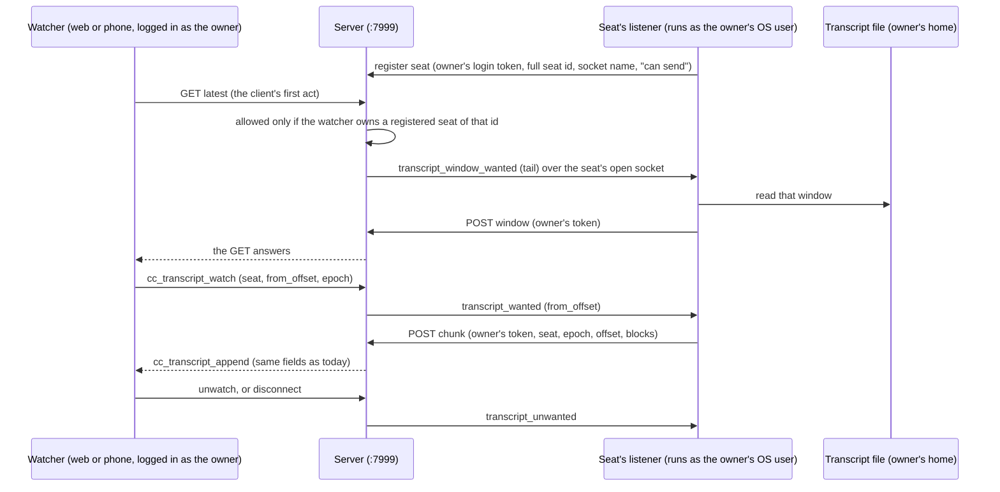

# Multi-user transcripts: each seat sends its own, the server stops reading transcript files

## 1. What was ruled, and what this plan is

Rick, 2026-10-05, on decision row `2af2c387` (closed): adopt push-not-pull. Each user's own
Claude session sends its transcript to the server, signed in as that user. The server shows a
transcript only to its owner, or to someone the owner shares it with. The home-folder mounts go
away. He approved the direction only; this plan is what he is owed before any build.

This plan delivers that ruling for two of the three home-folder mounts, transcripts and the
Google login. It recommends that the third, the sessions mount, be a separate decision
(section 4, decision D1). If D1 goes the other way, the ruling's last sentence is not met by
this plan alone.

It ends with seven decisions that are his (section 10).

## 2. Summary

| | Today | Proposed |
|---|---|---|
| Who reads the transcript file | the `:7999` server, through a bind mount of one user's `~/.claude/projects` | a process that already runs for each seat, as that seat's user |
| When it is read | only while someone watches | the same: only while someone watches, asked for over a socket the seat already holds open |
| Who the server thinks is sending | nobody: no caller identity is involved | the human owner, from a login token |
| Who may watch | any admin | the owner, later also a user the owner shared with |
| Events to web and phone | `cc_transcript_append` / `cc_transcript_state`, byte offsets, `file_epoch` | the same events and fields |
| Web and phone code | roster and button gated on the admin role | that gate changes to "seats I own". Expect a second change in both: something to show, and a retry, while a seat's listener is away (section 5.5) |
| Phone push login | one person's `gcloud` login, bind-mounted | a service-account key file (the code path already exists) |

## 3. What exists today

Read on 2026-10-05 at git commit `f4fdbb70b`. Three sources, labelled per claim:

- **checked**: I ran the search or read the code myself.
- **reviewed**: an independent reviewer (a sub-agent of my session) read the code and quoted it.
- **surveyed**: a read-only survey sub-agent reported it with file and function names; neither
  I nor the reviewer re-read it.

### 3.1 The transcript path (pull)

| Piece | Where | Source |
|---|---|---|
| Seat to file | `cc_transcript_tailer.resolve_transcript_path` returns the bridge's `transcript_path`, only if that file exists inside the container | reviewed |
| Tailer | `CcTranscriptTailer`, one poll task per watched seat, started by the `cc_transcript_watch` verb, stops after a grace period with no watchers | surveyed |
| `/clear` | `poll_once`: a changed path resets the offset to 0, rebuilds the ring and the tool-name table, reports `rotated` | reviewed |
| Epoch | `file_epoch` is the transcript basename. On an in-place truncation it becomes `<basename>#<unix time>` | reviewed |
| Display mapping | `cc_transcript_mapper.map_records` turns JSONL records into display blocks. Its header says user and assistant records are 34% of all records | reviewed |
| Tool names | `CcTranscriptTailer.start` resets the tool-name table, so a tool result whose call came before the start offset is unnamed | reviewed |
| Backlog | `GET /api/cc-transcript/{cc_session_id}`, reads the file | surveyed |
| Roster | `GET /api/cc-transcript-roster`, projected from the arbiter's fleet state | surveyed |
| Access rule, server | admin only on all three (`require_admin`, `session_is_admin`) | surveyed |
| Access rule, clients | `SessionTranscriptRoster.ts` returns early unless `isAdmin()`; `notifications.js` paints console buttons only when `this.isAdmin` | checked |
| Client gap rule | `SessionTranscriptStore.onAppend`: a frame whose `offset` is not the last `next_offset` is dropped and repaired with `?since_offset=` | reviewed |
| Client "load earlier" | one GET with `before_offset` and `max_bytes`; it prepends only if the answer is earlier than what it holds | reviewed |

Two things in the tailer do nothing today, both **checked** by a fixed-string search of `src`
outside the test trees: `mark_seat_ended` has no caller, so the `ended` state has no producer;
`SeatRing.can_serve` and `SeatRing.blocks_from` have no caller.

### 3.2 What already runs for each seat

| Process | What it is | Source |
|---|---|---|
| cosa-voice MCP server | one per session; starts a bridge-watch thread, then serves tools. Its outbound API key is the shared file `src/conf/keys/notification-api-claude-code-dev` | reviewed; key path checked |
| Notification listener (`cc_notification_listener.py`, class `CCNotificationListener`) | one per seat when hooks are installed and `~/.lupin/config` has the project's section. Holds a websocket open to `/ws/queue/cc-listener-<first 8 of the stable seat id>`, logged in as the project's service account | checked (class); reviewed (endpoint, spawn) |
| Addressing one seat | the server can already send to one listener: `emit_to_session( "cc-listener-<hash8>", … )`, which notifications use today. The listener's event handler already branches on event type | reviewed |
| The listener is not as long-lived as the seat | `session_end.py` stops it on every SessionEnd, including `/clear` and `/compact`, and it is respawned. A server bounce drops every listener socket; listeners back off and, after ten failures, wait 60 s | reviewed |
| The socket does not prove whose seat it is | its user is the shared service account, and any logged-in user can connect under the name `cc-listener-<hash8>` and replace the existing entry | reviewed |
| The listener and the human owner | at startup it logs in once as the human owner, with the credentials in `~/.lupin/config [owner]`, and stamps `owner_user_id` on the seat's bridge (`_stamp_owner_user_id_on_bridge`). The `[owner]` section is optional; the stamp is best-effort, runs once, and is not retried | checked |
| Login tokens | `/auth/login` returns an access token that `require_api_key_or_jwt` accepts as a bearer token. It carries the user's roles and lasts 30 minutes; a refresh route exists and the listener does not use it | reviewed |
| SessionEnd hook | fires on `/clear` and `/compact` as well as at exit; existing code guards on `reason not in ( "clear", "compact" )` | checked |

### 3.3 How sessions identify themselves today

- `/api/notify` accepts an `X-API-Key` or a bearer token. In `notify_user` the authenticated
  caller appears in the signature, the docstring and one comment, and nowhere in the logic
  (**checked**). The target user and sending session are query parameters the caller writes.
- The API key is one shared file for a service account, not per user (surveyed; path checked).
- An API key is validated by running a bcrypt check against every active key until one matches,
  with no cache. The reviewer timed one check on this host at 189 ms (5 runs). The number of
  active keys was not counted.
- There is no route that issues an API key to a human user. The only non-test caller of
  `ApiKeyRepository.create_key` is a script that creates service accounts (reviewed).

### 3.4 Phone push (FCM)

`FcmWakeService` has two permanent login modes chosen by the INI key `fcm wake auth mode`:
`adc` (a person's gcloud login) and `key_file` (a service-account file named by an environment
variable). Both functions exist and the INI sets `adc` (**checked**). No compose file sets the
key-file variable (surveyed).

## 4. The three mounts are three different jobs

The mounts themselves: **checked** in `docker-compose.yml` and `docker-compose.cloud-gpu.yml`.

| Mount (dev service `lupin-rest-dev`) | Used inside the `:7999` server by | Size of removing it |
|---|---|---|
| `~/.claude/projects` (transcripts) | one feature, the live console | this plan, phases 1 to 3 |
| `~/.config/gcloud` (a person's Google login) | FCM in `adc` mode; the survey infers `gemini_vertex_client.py` too | this plan, phase 4 |
| `~/.claude/sessions` (bridge files) | ten server files import the bridge module at fifteen places (reviewed): `cc_transcript_tailer.py`, `routers/arbiter.py`, `commons.py`, `dm.py`, `notifications.py`, `speakerphone.py`, `tasks.py`, `voice_persona.py`, `voice_persona_helpers.py`, `lupin_app/main.py`. Several **write** bridges, not only read them: speakerphone, persona, owner stamp | **not in this plan** unless D1 says so |

Keeping the sessions mount means personas, DMs, the manager check, the roster and broadcasts
all stay single-user. That is the cost of recommending "no" on D1.

The test service has neither the transcripts mount nor the gcloud mount. The VM compose file
has only the sessions mount, so the live console cannot resolve a transcript there today
(surveyed, inferred from the missing bind).

## 5. Design

### 5.1 Send only while someone watches

The first draft had every seat send all the time. The review showed that was the wrong
default: it puts standing traffic and standing private text on the server for seats nobody is
looking at. The first draft chose it because it assumed the server had no way to ask a seat for
anything. That assumption was wrong: every seat with hooks already holds a socket open to the
server, and the server already sends to one seat's listener by name (section 3.2).

So the server asks. When the first watcher arrives for a seat, the server sends
`transcript_wanted` to that seat's listener. When the last watcher leaves and the grace period
passes, it sends `transcript_unwanted`. This is the lifetime the pull tailer has today.

**Every read goes to the seat, not only "load earlier".** The client's first act is a GET for
the latest window, before any watch, and gap repair is a GET too. The backlog route has three
directions (`tail_bytes`, `before_offset` with `max_bytes`, `since_offset`), and
`transcript_window_wanted` carries all three. The route is already an `async` handler, so it
can wait for the seat's answer without holding a thread.

**The wait is bounded below the client's own timeout.** The multiplexer client gives a GET
10 seconds. The server waits less than that, and **on timeout answers with an HTTP error**. It
must not answer with the body today's code uses for an unresolvable seat: that body has offset
0 and no blocks, the client does not read its `watchable` field, and all three client callers
would take it as real data. "Load earlier" would report a false top of history, and the other
two would reset to offset 0 and ask for the whole file. All three callers already leave their
state alone on an HTTP error.

**The waiting GET and the answering POST must reach the same server process.** No `--workers`
setting was found in the dev launcher; the VM was not checked.

**A listener being away is routine, and is not the seat ending.** It is away for a moment at
every `/clear` and `/compact`, and for up to a minute and more after every server bounce
(section 3.2). So:

- When a listener registers (section 5.3) and its seat is being watched, the server sends
  `transcript_wanted` again from the watcher's last offset.
- A watch or a read that arrives while the listener is away is held, not refused. Today's only
  answer for a seat the server cannot reach is `refused / not_found`, which the wire contract
  marks final. How long to hold, and what the pane shows meanwhile, is a phase 1 design item;
  if it needs a new non-final state, that is a change to the event contract and to both
  clients, and this plan does not yet include it.
- `ended` is sent only on an explicit report at session end (section 5.2), or after a staleness
  period long enough to outlast a bounce and its cool-down. The period is not chosen here.

Consequences that hold whatever those details become: a seat nobody watches sends nothing and
the server holds nothing of it, and a server restart loses nothing that the seats cannot send
again.

### 5.2 The sender

**Where it runs: in the notification listener**, not the MCP server as the first draft said.
The listener has the socket the server asks over, and it already logs in as the human owner.

**What it does**

- Tails or reads its own seat's transcript on request, with the primitives in
  `cosa/utils/transcript_tail.py`. The tail runs as its own task and posts off the receive
  loop. The listener's existing handlers are synchronous and block, and a slow POST must not
  delay `transcript_unwanted` or the socket's ping reply.
- **Is given its full seat id at spawn and finds its bridge by exact match.** Today it is
  handed the first 8 characters and finds its bridge by prefix
  (`find_session_path_by_id( …, exact=False )`). The events carry the full id, and a prefix
  match can land on another seat.
- Maps records to display blocks itself (decision D4) and sends
  `{cc_session_id, file_epoch, offset, next_offset, blocks}`.
- Reproduces both epoch rules: basename on a path change, `<basename>#<unix time>` on an
  in-place truncation.
- Keeps the tool-name table from the requested start offset, as the tailer does.
- Coalesces at the pull tailer's own window (300 ms).
- Logs in again, or refreshes, when its token expires. A token lasts 30 minutes and a watch can
  last longer. Whether many seats logging in as one owner can trip the account lockout was not
  read.

**`ended` is posted by the SessionEnd hook, not the listener.** The hook is a separate process
and stops the listener in the same run. It posts `ended` with the owner's token, only when its
reason is not `clear` or `compact`, before it stops the listener.

**Offsets are the seat's own byte offsets, and the server must trust them.** A seat can
therefore send its own watchers a broken stream, and nobody else's.

**Seats with no listener are not watchable**: runs inside the server container, a seat started
without hooks, a seat with hooks switched off, or one whose `~/.lupin/config` lacks the
project's section. They never register, so the roster omits them.

### 5.3 Identity and ownership

- **The sender uses the human owner's login token**, from the same `[owner]` credentials and
  `/auth/login` call the listener already makes. No new key and no issuance tooling, and a
  token check is cheap where an API-key check is a bcrypt sweep (section 3.3). Decision D2.
- **The ingest endpoint accepts only a bearer token, and takes the owner from it.** It never
  reads an owner from the body or a query parameter.
- **A seat becomes known to the server when its listener registers it**: on every connect and
  reconnect the listener posts, with the owner's token, its full seat id, its socket name and
  what it can do, and the fields the roster shows (persona, project, last activity), which
  today come from the arbiter's fleet state for one host user. The server records
  `(owner_user_id, cc_session_id) → socket name`.
  - This replaces reading ownership from the bridge's one-shot `owner_user_id` stamp, which is
    silently missing if the server was down when the seat started.
  - It does not go through the sessions mount, so a second user's seats are known to the server
    wherever their bridges are.
  - It is how the server learns a seat can send, which phase 3a needs to choose between asking
    and falling back.
  - A seat without `[owner]` credentials cannot register and is not watchable. That is stated
    to the user at session start, not left as a log line.
- **Seats are stored strictly under `(owner_user_id, cc_session_id)`.** There is no global
  "first writer owns this seat id" rule. A user who registers or sends under someone else's
  seat id creates a seat of that name in their own space, visible only to themselves.
- **Known weakness, not closed here**: the listener socket itself is not owner-authenticated,
  so another logged-in user can connect under a seat's socket name and receive its
  `transcript_wanted`. They get no transcript text, because only the owner's token can send
  into the owner's space, but that seat's console goes dark while they hold the name.
  Notifications have the same weakness today.

### 5.4 The server

- **New**: seat registration; `POST /api/cc-transcript/ingest` for a chunk or a window; a
  state route for `ended`.
- **New**: two server-to-seat events, `transcript_wanted` and `transcript_unwanted`, and one
  request, `transcript_window_wanted` with three directions.
- **New**: a per-watched-seat relay keyed by `(owner_user_id, cc_session_id)`, holding only what
  is needed to chain offsets and match a waiting read to its answer. In memory, for as long as
  the seat is watched. `SeatRing`'s unused read methods are not enough as written:
  `blocks_from` has no byte cap and the ring only appends.
- **Changed**: the watch verbs and the backlog route talk to the relay instead of the file.
- **Changed**: the roster lists the seats the requester has registered. Until phase 3b it also
  lists, for admins only and from the fleet state as today, seats that have not registered;
  those are the seats still on the pull path (section 6).
- **Changed**: the access rule on the socket verb and both REST routes becomes one function:
  the requester owns the seat. Sharing adds a second clause later.

### 5.5 Clients

The events and their fields do not change. Two client gates do: the multiplexer roster's
`isAdmin()` early return and the legacy page's `this.isAdmin` button gate become "the roster
the server returned to me", so a non-admin owner sees their own seats. The mobile client's
transcript code was not opened; whether it has the same gate is not known.

**A second client change is expected, not merely possible.** The reviewer read the multiplexer
store: when its first read fails it logs and stops, with no watch sent, and reopening the same
seat does not retry. The server can hold a read for under 10 seconds, and a listener is away
for a minute or more after a bounce. So a pane opened in that window stays blank, with no
message and no retry, unless the client changes. Phase 1's design decides the form (a new
non-final state, or a retry on error), and either one is client work in this repo and in the
mobile repo, and a change to the documented event contract if a state is added.

### 5.6 Sharing

A small table: owner, grantee, seat (or "all my seats"), expiry. Phase 5. Until then a
transcript is visible to its owner only.

### 5.7 Phone push

Set `fcm wake auth mode = key_file`, provide the service-account file, set its environment
variable, and remove the gcloud bind. First find out whether `gemini_vertex_client.py` relies
on the same login on dev; the survey inferred it and nobody has run it.

## 6. Phases

| Phase | What lands | Console during it | Mount removed |
|---|---|---|---|
| 1 | Seat registration, ingest endpoints, the relay, the owner-only access function, the three server-to-seat messages, and the design of what a watcher sees while a listener is away. Nothing sends yet; the pull path is untouched | pull, admin only | none |
| 2 | The sender in the listener; the listener gets its full seat id at spawn and registers on connect. The server does not yet ask in normal use. Comparison test (below) | pull, admin only | none |
| 3a | The server asks seats instead of reading files, for seats that have registered as able to send, and keeps the pull path for seats that have not (those started before phase 2). Those seats stay under today's rule, admin only, with their roster row from the fleet state, because an unregistered seat has no owner the server can trust. Clients' admin gates change. Access becomes owner-only for registered seats | sent where possible, pull otherwise | none |
| 3b | When no live seat is on the fallback (counted from registrations against the fleet roster, not assumed), the pull tailer, `resolve_transcript_path` and the transcripts bind are removed. Needs `--force-recreate`, not a bounce | sent | transcripts |
| 4 | FCM on the service-account key file; gcloud bind removed, also by recreate | sent | gcloud |
| 5 | Sharing | sent | none |

**The comparison in phase 2** is a unit test, not a live side-by-side. The pull tailer accepts
an injected bridge reader, so one test runs the tailer and the sender-plus-ingest path over the
same captured transcript file, from the same start offset, and asserts the concatenated blocks
and the final offset are equal. Frame boundaries are not compared: they depend on timing. A
live side-by-side is not possible as the first draft described it, because the two paths
coalesce on different clocks and the test server has no transcripts mount.

## 7. Tests

Coverage target on every new or changed file: 100% lines, branches and functions.

| Tier | What it must show |
|---|---|
| Unit, ingest | The owner comes from the token and never from the body. An API key is refused. A chunk at the wrong offset is refused and the answer names the expected offset. An epoch change resets the relay. A chunk for a seat nobody watches is dropped |
| Unit, sender | Sends nothing when no bridge matches its full seat id exactly. Both epoch rules. Tool names from the start offset. At least one fixture captured from a real transcript (`src/tests/fixtures/cc_transcript/`) |
| Unit, equality | The phase 2 comparison above |
| Unit, access | Owner yes; another user no; an admin who is not the owner no; a share yes; an expired share no |
| Unit, the assembled app | The real app mounts the ingest routes and the watch verb reaches the new access function |
| Unit, reads | Each of the three read directions for a seat that does not answer in time returns an HTTP error, and the client store's state is unchanged afterwards (asserted in the TypeScript tier against the real store). A listener that registers while its seat is watched is sent `transcript_wanted` from the watcher's last offset |
| Unit, session end | The hook posts `ended` for an exit and posts nothing for `clear` or `compact` |
| Unit, registration | A registration with an API key is refused. Two users registering the same seat id get two separate seats. A seat that never registered is in no non-admin's roster |
| TypeScript | The roster and button gates show a non-admin owner their own seats and show an admin nothing of other people's. Store and gap-rule tests pass unedited; if one of those needs editing, the events changed and this plan is wrong about them |
| Integration (`:8000`) | A real listener process sends a fixture transcript on request; a watcher logged in as the owner gets frames whose offsets chain; a watcher logged in as a second user is refused |
| Mobile | The sibling repo's transcript tests, including its live wire test, run by that repo's seat before 3a merges |
| Deploy guards | `test_compose_service_parity.py` and `test_credential_volume_shape.py` assert today's binds and change in the commit that removes each bind |

## 8. Costs and risks

- **No transcript after a seat is gone, and none while its listener is away.** Today the file
  stays readable through the mount after a seat exits. Here a dead seat cannot be asked, so a
  crashed worker's last output is on its owner's disk and not in the console. A live seat is
  also unreadable for the moments its listener is restarting. Decision D5.
- **Every read is a round trip to the seat inside a 10-second client timeout.** Today a read is
  a local file read.
- **Seats run the mapper from their own checkout**, so two seats on different code can map the
  same record differently, and the equality test in section 6 cannot see that.
- **Admins lose other people's consoles.** On this host every seat runs as one user, so the
  operator still sees all of his own seats. The loss is only another human's seats. Decision D6.
- **Seats started before phase 2 cannot send** until restarted; phase 3a's fallback covers them
  and 3b waits for them.
- **Request bodies now carry transcript text.** Whether the server logs request bodies anywhere
  was not checked. It must not, for this route.

## 9. Not known, and not addressed

- What a watcher sees while a listener is away, how long a held watch or read waits, and the
  staleness period before `ended`: not designed (section 5.1).
- Whether many seats logging in as one owner can trip the account lockout; the refresh route's
  request shape: not read.
- Whether sending to a listener socket is subject to the event subscription check: the reviewer
  read part of `emit_to_session` and saw none; the rest was not read.
- Server worker count on the VM: not checked.
- Whether `ClaudeCodeJob` runs inside the container register a bridge: not read.
- The mobile client's transcript code: file names only.
- Whether `gemini_vertex_client.py` uses the gcloud bind on dev: inferred, not run.
- Whether a recycled process id can inherit an old seat id: the reviewer raised it and did not
  read the cleanup code; neither did I.
- The `:8001` arbiter's host-side transcript reads (context pressure, turn age) and the
  projects directory bind at `/var/external-projects`: both single-user, neither addressed.

## 10. Decisions for Rick

| | Question | Recommendation |
|---|---|---|
| D1 | Is removing the `~/.claude/sessions` mount part of this initiative? It is used by ten server files, some of which write to it | **No.** Do transcripts and gcloud here. Open a separate decision for bridges. The cost: personas, DMs, the manager check and broadcasts stay single-user until then. The console does not, for seats that register themselves (section 5.3) |
| D2 | What does a seat prove its owner with: the owner's login token, or a new API key per human? | **The login token.** The listener already logs in as the owner. Per-user keys need issuance tooling that does not exist and make every key check slower for all traffic. The costs: a token lasts 30 minutes, so the sender must log in again or refresh; and a seat with no `[owner]` section in its config is not watchable |
| D3 | Send only while watched, asked for over the listener's socket; or send always? | **Only while watched.** Nothing private sits on the server for an unwatched seat and there is no standing traffic. The costs: every read is a round trip to the seat inside a 10-second client timeout, and a seat is unreadable while its listener is restarting |
| D4 | Map to display blocks on the seat, or send raw lines and map on the server? | **On the seat.** The server then never receives the two thirds of records it does not display, nor a tool result larger than the block budget. The cost: a mapper fix reaches a seat only when that seat restarts on new code, and seats on different code can differ |
| D5 | Is "no console for a seat that has exited" acceptable? | **Yes for now.** The alternative is the server keeping transcript text after a seat ends, which is retention of private text and wants its own decision |
| D6 | Do admins keep any access to other users' transcripts? | **No standing access.** An owner can share with an admin once sharing exists |
| D7 | Go on phases 1 and 2? They are additive and change nothing a user can see | **Yes**, with phase 1 starting from the undesigned item at the top of section 9. Know before saying yes: that item is expected to add client work in this repo and the mobile repo (section 5.5), which lands in phase 3a, not in phases 1 and 2 |

## 11. What changed from the first draft, and why

An independent review of the first draft (2026-10-05, a sub-agent of my session, reading code
at `f4fdbb70b`) returned FAIL. What it found and what this draft did about each:

| Finding | This draft |
|---|---|
| The claim that web clients were unchanged was false: both gate on the admin role | Section 5.5 and the TypeScript row in section 7 |
| The claim that each user's key is in `~/.lupin/config` was false; no human key issuance exists | Section 3.3; identity moved to the owner's login token, D2 |
| API-key checks are a bcrypt sweep, 189 ms per check, so "send always" would be expensive | D2 and D3 |
| The response-as-back-channel could not deliver "load earlier" for an idle seat, and the client cannot wait | Section 5.1: the server asks over the seat's socket and holds the GET |
| "First writer owns the seat id" could be used to lock an owner out | Section 5.3: stored under the pair, no global claim |
| Phase 3 did not leave the console working; the flag was never turned on | Phases 3a and 3b |
| The phase 2 comparison was not possible frame by frame | Section 6: a unit test over one file |
| `ended` would fire on `/clear` and `/compact` | Section 5.2 |
| A borrowed bridge would send a colleague's transcript | Section 5.2 |
| No staleness fallback for a seat that dies | Section 5.1 |
| Seats with no sender; roster for a seat that never sent | Sections 5.2 and 5.4 |
| Raw lines carry everything, displayed or not | D4 |
| The title promised more than D1 recommends | Title and section 1 |
| "About thirteen readers" had no list | Section 4 |

The second draft went back to the same reviewer and returned FAIL again, on one wrong statement
and nine gaps. The architecture held: the reviewer read the listener, the login route and the
backlog route and found all three changes workable.

| Finding on the second draft | This draft |
|---|---|
| Wrong: a timed-out read answered `watchable: false`, which is exactly the empty window the client mistakes for data | Section 5.1: an HTTP error; test row "Unit, reads" |
| Every read is a seat round trip, the first arrives before any watch, and two of three read directions were missing | Section 5.1 and the diagram |
| A listener being away is routine (bounce, `/clear`, `/compact`) and there was no state for it | Section 5.1; the undesigned part is named in section 9 |
| Roster and access rested on a one-shot, best-effort bridge stamp, read through the sessions mount | Section 5.3: seats register on every connect |
| The borrowed-bridge guard named the MCP's lookup, not the listener's prefix match | Section 5.2: full seat id at spawn, exact match |
| Nothing said who sends `ended`; the hook kills the listener in the same run | Section 5.2: the hook posts it |
| No way for the server to learn a seat can send | Section 5.3: registration carries it |
| The listener's handlers block | Section 5.2: the tail is its own task |
| An impostor socket can darken a seat's console | Section 5.3, stated as a known weakness |
| Token lifetime; `[owner]` is optional; mapper versions can differ between seats | Sections 3.2, 5.2, 8 and decisions D2 to D4 |

The third draft went back to the same reviewer and returned PASS, with two points that were
then folded in and have not been re-reviewed:

- Phase 3a's fallback was unreachable as written, because an unregistered seat was in nobody's
  roster. Sections 5.4 and 6 now keep unregistered seats under today's admin-only rule until 3b.
- A second client change, for a pane opened while a listener is away, is expected and not
  merely possible. Sections 2 and 5.5 and decision D7 now say so.

The reviewer also confirmed, by reading code, that the listener can post at every connect, that
the SessionEnd hook can reach the owner credentials, and that the multiplexer client raises an
error on a non-OK answer. It did not run anything, and did not read the legacy page's console
read path, the mobile repo, or the SessionEnd hook's time limit.
