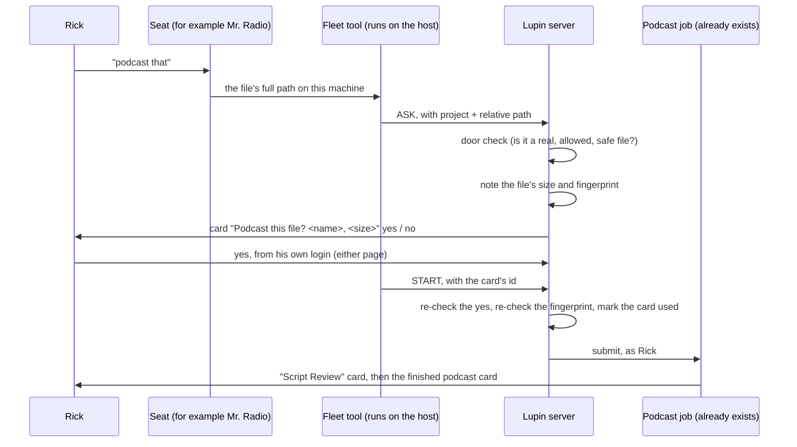

# The thin podcast proxy, in one page

Rick asked for this by voice at about 20:58 EDT on 2026-10-08: a quick explainer of the "thin
proxy", kept in the R&D folder next to the plan.

## What it is for

A seat writes a summary for Rick. Rick would rather hear it. He says **"Mr. Radio, podcast that"**,
answers **yes** to one card, and a podcast of that file shows up as his own job, with the usual
Play, Listen and Download card.

The seat never holds Rick's password and never submits the job. Rick's yes is the authority, and
the server checks that yes before it does anything.

## What happens, step by step

## The five moving pieces

| # | Piece | New or reuse | What it does |
|---|---|---|---|
| 1 | Door check | reuse: the document viewer's own check | Refuses a file that is missing, outside the allowed folders, reached through a link that points elsewhere, or that contains credentials. |
| 2 | Ask | reuse: the yes/no card that already guards un-parking a task | The server, not the seat, writes the card. It shows the file's name and size as the server measured them. |
| 3 | Start | reuse: the check that already guards un-parking a task | Refuses unless the card asked a question, was answered yes, not by a timed-out default, on Rick's own login, and carries exactly what the server wrote. |
| 4 | One yes, one podcast | **new, small**: one database table | Records a card as used, so the same yes cannot start a second job. |
| 5 | Fleet tool | **new, small** | One call for the seat: it sends the ask, waits for Rick's answer, and sends the start. |

The podcast job itself, the audio, and the finished card are untouched.

## Why each guard is there

| Guard | The mistake it stops |
|---|---|
| The server writes the card's text | A seat describing file A while asking about file B. |
| The file's fingerprint is taken at ask and checked again at start | The file being rewritten between Rick's yes and the job reading it. The job reads the bytes that were checked, not the file by name. |
| A maximum age for the card | A yes from last week starting a job today. |
| The used-card record | Two podcasts, and two audio bills, from one yes. |
| The door check | A request that names a secrets file. |
| The tool converts the path, the server never sees a host path | A machine's folder layout being written into the server's settings, which would be wrong on every other install. |

## What Rick will see

1. A yes/no card: "Podcast this file?" with the file's name and size, and which seat will start it.
2. After his yes: the podcast job's own "Script Review" card (Approve, Revise, Cancel). This one
   already exists and **approves itself if nobody answers**. So it is two cards, and the yes on
   the first is the real spending guard.
3. The finished podcast card: Script, Play Here, Listen, Download.

Both pages are in scope, on Rick's word at about 20:53: the legacy notifications page and the
multiplexer. Which of these three cards already works on each page, by tap and by voice, is being
read from the code now (plan, section 9.8). It is not yet known, and the proxy is not called done
until it holds on both.

## What it costs

- Writing the script: a bounded Claude Code call, covered by the Max plan's fixed monthly cost.
- The audio: metered ElevenLabs. The code's own constant is $0.30 per 1,000 characters, and a
  script is written to a target length (10 minutes by default), so a short summary and a long report
  cost about the same. The real bill per podcast has not been measured.
- No test buys audio. One real podcast is run only on Rick's word.

## Not in this cut

| Left for later | Why |
|---|---|
| The cost shown on the card, and a daily cap | A cap needs a running total of audio that nothing stores today. Rick's yes per file is the limit for now. |
| A Podcast button on the document viewer | Step 2 of the plan. |
| "Make a podcast of the last card" from the Q&A box | Step 3 of the plan; it needs a yes/no question the Q&A box cannot ask yet. |

## Where it stands (2026-10-08 21:00 EDT)

| Piece | Who | State |
|---|---|---|
| 1 Door check | Maya | Built. First review found the file was read twice (once to judge, once to fingerprint); she changed it to read once. Not yet re-reviewed. |
| 2 Ask | Maya | Built, not yet reviewed. |
| 3 Start, and 4 the used-card table | Maya | Being built. The table needs a database migration. |
| 5 Fleet tool | Tiffany | Findings done; building against a stand-in for the server. |
| Both pages | Pocholo | Reading the two clients; table to come. |

Nothing is landed. Each commit is reviewed by Pocholo; the whole unit and cosa tiers run before
anything lands; and a seat can use it only after the dev server is bounced onto the new code.

## The one thing already usable today

The Q&A box, under Rick's own login, accepts a typed path relative to the project, by the code:
`make a podcast of io/tmp/<file>.md`. Nobody has run that end to end tonight, because it buys audio.
It takes a path, not a name and not a document-viewer link.
