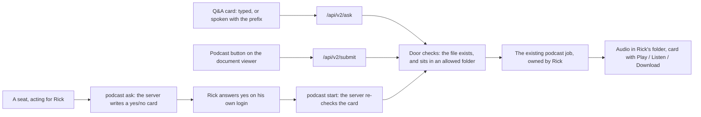

# Document to podcast, started by voice, by a tap, or by a seat acting for Rick

## 1. What Rick asked for

By voice, 2026-10-08 about 20:08 EDT: a quick, predictable way to turn a document into a podcast.
His example was a summary Cheech wrote that day; he would rather hear it than read it. He asked for
at least three different ways to start it.

His rulings since, each a card answer (answered=true, default_used=false) or a voice message:

| When (EDT) | Rick said | What it settles |
|---|---|---|
| about 20:22 | "I love the idea of a button on the doc card but I still want to be able to say it ... Can't we still make requests by using the Q&A interface ... Pick would be in getting you Mr Radio to be able to submit that request as my proxy" | Button: yes. A spoken way: yes. The Q&A interface counts as a door. His pick: a seat submits for him. |
| about 20:25 | "I don't want you to build anything just yet. We're only discussing the possibilities" | No build without his word. |
| about 20:35 | "I like the idea of your recommendation for building all 4 steps in order but ... you would know exactly the file path ... you can give the absolute path" | All four steps, in order. The proxy sends an absolute path; it does not need doc-viewer links. |
| about 20:37 | "I want you to write this up as a plan and I want someone else to sanity check it ... Maria ... before you hand it off to your swe team" | This document. María checks it. Then the build crew. |

## 2. What exists today

Read from the code at `53f9123b7` by Pocholo, in two read-only surveys. He ran nothing and submitted
no job. The surveys are in `io/tmp/` (not tracked), so their findings are restated here.

- The podcast job exists: command `agent router go to podcast generator` on `POST /api/v2/submit`.
  Its one required argument, `research`, is a file path, absolute or relative to the project root.
- The Q&A card (typed), and the microphone when the sentence starts with the prefix
  `multimodal agent`, post to `/api/v2/ask` under the logged-in user's token. So a podcast asked for
  there belongs to Rick, and its audio lands in his folder with a card carrying Play, Listen and
  Download.
- That door takes a typed **path**. It does not take a doc-viewer link, and it does not search by
  name. If the sentence carries no path, it asks one question and stores the answer as the path,
  whatever was typed.
- A path that is not a real file is accepted, and the job fails later inside the agent.
- `research` has no folder check: the job reads any file the server process can read.
- No seat can start a podcast. There is no tool, script or skill for it. The fleet's tools reach the
  server with one shared key, and `/api/v2/*` accepts a user token only.
- The server already has a "card as receipt" check. When a manager un-parks a task on Rick's yes, the
  server reads the stored card and refuses unless the card asked a question, was answered yes (not a
  timed-out default), was answered on the operator's own login, carries the payload the server itself
  wrote for that row, and has not been used before (`unpark_card_refusal` in
  `task_promotion_gate`, `_resolved_unpark_card` in `routers/tasks.py`).
- Cost: the script is written by a bounded Claude Code call (covered by the Max plan's fixed cost).
  The audio is metered ElevenLabs; the code's constant is $0.30 per 1,000 characters. The job card
  reports audio cost as zero (`audio_cost_usd = 0.0  # TODO` in the job).

Not measured by anyone, and each can change a step below:

1. Whether the router picks the podcast command for a given typed or spoken sentence.
2. Whether the container the job runs in can read `io/tmp`, where seats write summaries.
3. Who owns the fleet's shared key in the database.
4. How long cards are kept, and how many carry a document link.
5. What a podcast really costs on the ElevenLabs bill.

## 3. The design: one submit path, three callers

Every way of starting a podcast ends in the same server call that the Q&A door already uses. Nothing
gets its own copy of the job-building code.

## 4. The four steps, in Rick's order

### Step 0. Two checks at the door (small)

- A request whose file does not exist, or cannot be read, is refused when it is made, with a
  message that names the path. Today it fails minutes later inside the job.
- A request is refused unless the file sits under the project's allowed folders. The doc viewer
  already has such a list (each repo's `.docview.yml` plus the floor blocklist that hides `.env`,
  keys and the like); reuse that check rather than writing a second list.
- Not in this step, on Rick's ruling: accepting doc-viewer links. The proxy sends an absolute path.

Why keep it at all: once a seat can ask for a podcast, the request must not be able to name a
secrets file. Rick's yes on a card that shows the file name is one guard. This is the second.

### Step 1. A seat starts it for Rick (small to medium). This is Rick's pick.

- **Ask.** The seat calls a new door with the absolute path. The server runs the step 0 checks,
  then writes the yes/no card itself. The card shows the file's name, size and an audio cost
  estimate, all computed by the server from the file, never taken from the seat's text.
- **Answer.** Rick says yes or no on his own login, as for any card.
- **Start.** The seat calls a second door with the card's id. The server re-checks the stored card
  with the same rules as un-park (asked a question, answered yes and not by default, answered on
  the operator's login, payload written by the server for this path, never used before) and then
  builds the job for the card's target user through the existing submit call.
- **A cap.** A daily limit on audio characters, in the INI file, refused at the door when exceeded.
- **The seat's side.** One fleet tool, so a seat can do it in one call after writing a summary, and
  one line in the seat brief: "after a summary for Rick, you may offer it as a podcast."

What Rick says: "Mr. Radio, podcast that", then "yes" to the card.

### Step 2. A Podcast button on the document viewer (medium)

- The viewer shows a Podcast button on a document. A tap asks "Podcast <name>? Yes / No" in the
  page's own markup, never a browser dialog, then posts to `/api/v2/submit` under Rick's login.
- The viewer knows a document as project plus relative path, so this step adds the translation from
  that form to a file path, through the scope check the viewer already uses. The link handling that
  step 0 dropped lives here, where it is needed.

What Rick does: one tap while reading, one tap to confirm.

### Step 3. "Make a podcast of the last card" from the Q&A door (medium, least predictable)

- When the sentence says "last", "that" or "this" card, the server picks the newest card sent to
  this user that carries a document link.
- That pick is a guess, so the server must ask "Podcast <name>? yes or no" before it submits. The
  Q&A door has no yes/no question today: a parked question's answer is stored as the argument, so
  "yes" would become the file path. This step adds a yes/no kind of parked question.

What Rick says: "multimodal agent, make a podcast of the last card", then "yes".

### Two repairs to do alongside, whichever step is in hand

- The job card reports the audio cost it actually computed, in place of zero.
- The Q&A door's question for a missing path says what it accepts ("say or paste the file path"),
  since "describe it" promises a name search that is not there.

## 5. What is deliberately left out

| Left out | Why |
|---|---|
| A seat's shared key may submit podcasts directly | No confirmation from Rick; any seat could spend audio money; the job would belong to the key's owner, not Rick. |
| A podcast-only token handed to seats | Standing power in many hands until it expires; no per-file yes. |
| A watched folder that starts a podcast when a file lands in it | No human in the loop on a metered service. |
| A standing offer on every long summary | Noise on every card. A seat may offer; it is not automatic. |
| Name search over `io/tmp` | 544 markdown files there on 2026-10-08; a single match would be rare. |

## 6. Tests each step owes

100% lines, branches and functions on everything touched (`pytest --cov`, `c8` for TypeScript).

- **Step 0.** Unit: a missing file, an unreadable file, a path outside the allowed folders, a path
  that climbs out with `..`, a symlink that points outside. A route test through the assembled app
  for each refusal and for one accepted path.
- **Step 1.** Unit: each refusal of the card check on its own (not a question, answered no, default
  answer, answered by another login, payload for a different path, used twice). A route test of ask,
  answer and start through the assembled app, and one that starts with no card. The cap: under,
  at, over. Prove each test can fail by breaking the check it guards and naming the test that
  reddens.
- **Step 2.** TypeScript tests for the button, the confirm and the refusal message; one end-to-end
  page test on `:8000` that taps the button with the submit stubbed, so no audio is bought.
- **Step 3.** Unit for the card pick (no card, one, several, a card with no link) and for the yes/no
  question (yes, no, something else).
- **One real run, on Rick's word only,** because it buys audio: a short document through the proxy,
  end to end, to measure items 1, 2 and 5 of the not-measured list.

## 7. Questions for María's sanity check

1. Is the card re-check in step 1 enough, or can a seat get a podcast of file B out of a yes that
   Rick gave for file A?
2. Is reusing the doc viewer's allowed-folder check right for step 0, given that seats write
   summaries to `io/tmp`? If that folder is not in the list, the check refuses the main use case.
3. Does step 1 need two doors (ask, start), or can the server start the job itself when the yes
   arrives? The second is simpler for the seat but puts new work inside the shared answer route.
4. Is anything in section 5 worth bringing back?
5. Is the order right, or does a not-measured item (section 2) need measuring before step 1 starts?
6. Anything here that is stated as fact and is really an inference.

## 8. After the sanity check

Mr. Radio folds María's findings in, shows Rick what changed, and only on Rick's go hands steps 0
to 3 to the build crew, one step per author, each reviewed, with the tiers run before landing.

## 9. Changes from María's sanity check (2026-10-08 20:41 EDT)

María read lupin at `a1ca572aa` and ran nothing. Her verdict: the design is sound and the order is
right; four things change before step 1 is built. Her file is `io/tmp/2026.10.08-maria-podcast-plan-sanity-check.md`
(not tracked), so its findings are restated here. **Where this section differs from sections 2, 4
and 6, this section is the plan.**

### 9.1 The server cannot see the path a seat sends (changes steps 0 and 1)

A seat's absolute path is a path on the host. The server runs in a container where the same file
has a different path: the repo is mounted at `/var/lupin`, and the other registered repos under
`/var/external-projects/`. The podcast job uses an absolute path as given, so step 0's "the file
exists" check would refuse every path a seat sends.

- The seat still sends the absolute host path, as Rick ruled.
- The **server** turns it into its own path, from the fixed table it already has (the scope
  registry's roots in `lupin-app.ini`), never from text the seat supplies. A path under no
  registered root is refused.
- Read from the compose file, not observed. **Before step 1 starts: one existence check run inside
  the dev container, which buys no audio.**
- **Observed 2026-10-08 20:44:35 EDT by Mr. Radio, inside `lupin-rest-dev`:** `os.path.exists` is
  True for `/var/lupin/io/tmp/<file>` and False for the same file's host path.
- **Decided 20:46 EDT by Mr. Radio, replacing the two bullets above on where the translation
  happens:** the server holds no host path at all. Maya found the host root is in no INI key, only in
  `docker-compose.yml`, and a machine's host path in a tracked INI would be wrong on every other
  install. So the ask door takes the form the doc viewer already takes, scope plus relative path
  (`lupin/io/tmp/x.md`), and runs the viewer's whole check on it. The fleet tool, which runs on the
  host and knows its repo root, turns the seat's absolute path into that form. The seat still hands
  over an absolute path, as Rick ruled; the server still trusts only its own table, as María asked.

### 9.2 Rick's yes must be bound to the words, not to the file name (changes step 1)

| Gap | Fix |
|---|---|
| The file can change between the yes and the job reading it (a rewrite, or a swapped symlink). | At ask, the server stores the file's size and SHA-256 in the card. At start it hashes again and refuses on a mismatch. The job then reads a copy the server made at start. |
| Nothing makes an old yes expire. | A maximum card age at start, in the INI file. |
| Nothing records that a card was used: the un-park check counts task events, and a podcast start writes none, so one card could start two jobs. | Step 1 keeps its own record of a spent card, written in the same transaction that queues the job, with a uniqueness rule so two starts at once cannot both win. |

Step 0 reuses the doc viewer's **whole** check, not only its folder list: it judges where the open
file handle really landed, which is what defeats a symlink, and it looks inside the file for
credential material. `io/tmp/` and `io/write-ups/` are in lupin's list, so the main use passes. A
seat in another repo is held to that repo's list, so the seat brief says: write the summary to
lupin's `io/tmp`.

### 9.3 The job already shows Rick a second card, and silence approves it (new fact)

After the script is written and before audio is bought, the podcast job shows a "Script Review" card
(Approve, Revise, Cancel) that approves itself if nobody answers. So "podcast that, then yes" is two
cards for Rick, and the yes on the proxy card is the only real guard on spending. That is the reason
9.2 is not optional.

### 9.4 The estimate and the cap (changes step 1)

- Audio cost follows the script's length, and the script is written to a target duration (10
  minutes by default), not to the document's size. The card says "about N minutes, about $X at the
  configured target", not a figure worked out from the file.
- A daily cap needs a running total of characters actually spoken. Nothing stores one: the job card
  writes zero. So **reporting the real audio cost moves from "repair alongside" into step 1, ahead
  of the cap.**
- The cap is checked against what has already been spent that day. A job's own size is unknown
  until its script exists, and the plan says so plainly.

### 9.5 Two doors stay, one call for the seat (settles question 3)

Two doors, as un-park does, which keeps new work out of the answer route every card uses. The fleet
tool waits for the answer and calls start itself, so the seat makes one call, and the card says who
will start it. Otherwise a seat that dies between the yes and the start leaves Rick with a yes that
did nothing.

### 9.6 Tests added to step 1

The file's content changed between ask and start. The card is older than the maximum age. Two starts
with one card at the same moment queue exactly one job. A host path under no registered root is
refused; a host path under a registered root is translated.

### 9.8 Both clients (Rick, by voice, 2026-10-08 about 20:53 EDT)

Rick: "I want to make sure that that's available both for the legacy notification and the
multiplexer clients both." Sections 1 to 9 never say which page Rick answers the yes card on, or
where the finished podcast shows up. That is a gap in this plan, not a new feature.

Requirement, binding on step 1: on **each** of the two clients, the legacy notifications page and
the multiplexer,

1. the server-written yes/no card arrives, renders, and can be answered, by tap and by voice;
2. a yes from either client counts as the operator's own answer in the server's re-check;
3. the job's own "Script Review" card renders;
4. the finished podcast's card renders with working Script, Play, Listen and Download, and the job
   is visible while it runs;
5. the card sits where Rick looks for that seat's other cards.

So the card the server writes must be a kind both clients already receive and answer; a new kind
that only one client knows is not acceptable. Each of the five points gets a test on each client.

**Not yet known:** which of the five already hold on each client. Pocholo is reading both clients
(task `io/tmp/2026.10.08-task-pocholo-podcast-proxy-on-both-clients.md`); his table goes here as
section 9.9, and the lean cut is not called done until both columns are green.

### 9.9 Both clients: what holds today (Pocholo, 2026-10-08 21:02 EDT, read in code, nothing run)

His file is `io/tmp/2026.10.08-pocholo-podcast-proxy-on-both-clients.md` (not tracked). W = works
today by the code; B = needs building; ? = not determined without running it.

| # | Step | Legacy page | Multiplexer |
|---|---|---|---|
| 1 | The server-written yes/no card arrives and renders with yes/no controls | W | W |
| 2 | A tapped yes counts as the operator's own (it travels with the browser's login) | W | W |
| 3 | **A spoken yes** | **B**: the microphone only fills the comment box | **B**: the same |
| 4 | The job's own Script Review card | W | W |
| 5a | Finished card: Script, Listen, Download | W | Script and Listen W; Download **?** (a plain link, where the legacy page fetches with the login) |
| 5b | Finished card: Play Here (the floating player) | W | **B**: the player overlay exists only in the legacy page; the link opens a new tab, sign-in there **?** |
| 5c | The job is visible while it runs | W | W |
| 6 | The card sits with the asking seat's other cards | **?** | **?**: depends on the sender id the server stamps, whose project part comes from the server's process, not from the seat |

A yes that does **not** count, on either client, and should not: an answer sent with the fleet key
(so a yes spoken to a seat and relayed by the seat is refused), a login that is not the operator's,
and the timed-out default (which is "no").

Changes this implies, smallest first:

| | Change | Where | Needed for |
|---|---|---|---|
| C1 | The ask door writes the card in the exact un-park shape (yes/no, default no, human only, server-built payload) | server; Maya's ask door reportedly does this, not yet reviewed | steps 1 and 2, no client change |
| C2 | A voice yes/no on yes/no cards: a transcript that is exactly "yes" or "no" answers through the existing tap path; anything else goes to the comment box; the recognised word is shown before it is sent, because a mishearing starts a spend | both clients | step 3 |
| C3 | Play Here on the multiplexer: port the overlay, or prove the new tab signs in | multiplexer | step 5b |
| C4 | Prove or fix Download on the multiplexer | multiplexer | step 5a |
| C5 | The card's sender and session equal the asking seat's, and carry its persona | server | step 6 |

Not determined without a run: step 6 on both; the new tab's sign-in; which login the decision
proxy answers as; what the mobile app sends; whether a page opened after the card was written still
receives it.

### 9.7 What María marked as still unverified

- "`/api/v2/*` accepts a user token only": every v2 route she listed depends on `get_current_user`;
  she did not read that function.
- "Covered by the Max plan's fixed cost" for the script call: an inference about billing.
- Audio landing in Rick's folder with Play, Listen and Download: not checked by her.
- The survey was at `53f9123b7`; the 11 commits since touch none of the podcast agent, the v2 doors,
  the doc viewer or the card check, by her `git diff --stat`.

### 9.10 The order of delivery (Rick, card "Both pages", 2026-10-08 about 21:07 EDT)

The card offered the four gaps of 9.9. Rick ticked "Card files beside the seat's cards", "Play Here
on the multiplexer" and "Download proven or fixed on the multiplexer", and wrote:

> "Hey I like all of your recommendations and even the spoken yes on both pages but let's
> deprioritize the multiplexer and let's deprioritize spoken yes on both pages Otherwise let's do
> all notification card first And you can do the implementation for notification first get it to
> me and then Move on to the multiplexer in that order"

The order below is Mr. Radio's reading of those words.

1. **First, the legacy notifications page, complete and delivered.** The two doors (ask, start),
   the spent-card table, the fleet tool, and the card carrying the asking seat's sender, session
   and persona so that it files beside that seat's cards. Delivered means landed, `:7999` bounced,
   a seat restarted so it sees the tool, and Rick told how to try it. One real podcast buys audio,
   on his word only.
2. **Then the multiplexer**: Play Here, and Download proven or fixed.
3. **Later**: a spoken yes on both pages. Nothing is built for it before the first two.
