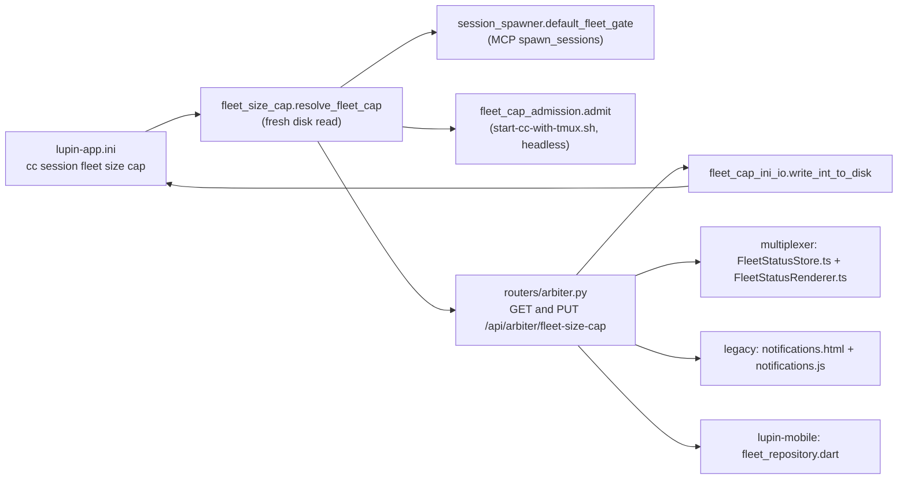

# Skeleton crew toggle: design note

> **Amended 2026-10-10 13:1x EDT after review (John, FAIL as written) and Cheech's addendum.** Changed: sections 2, 3, 5, 6, 8, 9. Each change is marked **(F1..F4, W1..W3)**, the review's finding numbers.

**Verdict.** One new INI key next to the fleet cap holds the state. One new refusal sits in the two places every spawn already passes through. The same key mutes the Stop poke by being read at poke time, so there is one stored value and no copy to drift. Nothing below is built yet; this is a design only.

Rick's words that govern (from the row and its amendments, outranking anyone's reading of them):

| When | Rick said |
|---|---|
| 12:46 | "remove all references to rules for when spawns happen" |
| 12:56 | Skeleton crew on: managers "may not ask and they may not spin up or spawn new workers". Off: managers spin up seats as they need them, and may ask him to raise the cap "just enough". The toggle goes "right next to the fleet cap spinner" |
| 12:56 | Switching on with workers running: "Finish the step, then reap" |
| 13:01 | Also in the mobile app. Persisted "in the configuration file ... MUST always be backed up. No questions" |
| 13:04 | On the stop poke: "The skeleton crew toggle does both" |

The approved workflow wording is `planning-is-prompting/io/tmp/2026.10.10-spawn-policy-approved-text.md` (read only). The refusal text and the flip announcement below use its words and add no rule to it.

## 1. Where the cap lives today



| Piece | What it does (symbol, not line) |
|---|---|
| INI key `cc session fleet size cap` (and `... maximum`) | Defined once, in the last block `[Lupin: Baseline]`, which the other blocks inherit. Today's value 15, ceiling 18 |
| `lupin_mcp/fleet_size_cap.py` | `resolve_fleet_cap( config_mgr, disk_fn )` clamps to 1..ceiling; `default_disk_cap_reader` reads the file fresh because `ConfigurationManager` is a process-lifetime singleton; `census` counts every live seat, managers included; `refusal_for_spawn` builds the refusal text; `config_file_path()` names the file |
| `lupin_mcp/fleet_cap_ini_io.py` | `locate_key` refuses on zero or two definitions; `write_int_to_disk` edits that one line, writes a temp file in the same directory and `os.replace`s it, then returns a re-read, never the argument |
| `routers/arbiter.py` | `get_fleet_size_cap` and `put_fleet_size_cap`; both return `{ cap, ceiling, live }` from `_fleet_size_cap_payload`. PUT answers 422 above the ceiling, 409 on a writer refusal, 500 on `OSError` |
| `lupin_mcp/session_spawner.py` | `default_fleet_gate` is the early gate: reads the cap, takes the census, returns a refusal string; `spawn_sessions` raises it as `ValueError`; the MCP tool turns that into `{ "status": "error", "reason": ... }`. Fails open |
| `lupin_mcp/fleet_cap_admission.py` | `admit` / `admit_under_lock` is the gate that binds: it runs as a fresh process from `start-cc-with-tmux.sh` for every `--headless` launch, counts live seats plus in-flight reservations, exit 3 refuses. Fails open |
| Multiplexer | `FleetStatusStore.refreshSizeCap` / `setSizeCap` (rides the same 60-second `refresh` as the table); `FleetStatusRenderer.buildSizeCapControls` / `wireSizeCap` / `paintSizeCap`; CSS `.fleet-size-cap-*` in `fleet-status.css` |
| Legacy | `notifications.html` block `#fleet-size-cap-controls`; `notifications.js` `fetchFleetSizeCap`, `_paintFleetSizeCap`, `setFleetSizeCap`, `_wireFleetSizeCap`, `refreshFleetStatus` |
| Mobile (sibling repo, read only here) | `lib/features/fleet_status/data/fleet_repository.dart` (`fetchSizeCap`, `setSizeCap`), `presentation/fleet_cap_dial.dart`, `fleet_status_bloc.dart` |

**María's pointers.**

| Pointer | Verdict |
|---|---|
| Both web clients carry the spinner, so both need the toggle | Confirmed |
| `FleetStatusRenderer.ts` and `FleetStatusStore.ts` | Confirmed |
| `notifications.html` about line 762, `notifications.js` | Confirmed (the block starts about line 751; the control is the `fleet-size-cap` range input) |
| GET and PUT routes in `routers/arbiter.py` | Confirmed |
| Key read by `fleet_size_cap.py` | Confirmed |
| "enforced in `session_spawner.py` and `fleet_cap_admission.py`" | Confirmed, with a correction: `fleet_cap_admission.py` is not called from `session_spawner.py`. It runs from the launcher shell script, which is the gate that cannot be bypassed |
| "spinner" | Wrong word: it is a range slider (`input type=range`), released-to-save on `change` |
| "No UI control for [the stop poke] exists in lupin" | **Wrong.** Both web clients already have an admin-only poke mute button (legacy `#poke-mute-btn`, `refreshPokeMute`; multiplexer `render/pokeMuteSwitch.ts`), backed by `PUT /api/heartbeat/poke-mute` (`routers/heartbeat.py`) and a file `heartbeat-poke-mute.json` (row 3526fb95). The mobile app has `settings/data/heartbeat_poke_repository.dart`. See section 6 |
| "enforced on the spawn path ... read fresh on each use" (point a) | Already true for the cap; the toggle copies the same fresh disk read |

## 2. Where the state is stored

**File.** `src/conf/lupin-app.ini`, the same file as the cap (`fleet_size_cap.config_file_path()`). **Key.** `cc session skeleton crew enabled = false`, placed directly after `cc session fleet size cap maximum`, defined exactly once (the writer already refuses two definitions). Default when absent: off, which is today's behaviour, so shipping changes nothing until the operator flips it.

**How it is written.** Same surgical single-line replace and atomic temp-file-plus-`os.replace` as the cap, generalised from int to a `true`/`false` value (`write_value_to_disk`; `write_int_to_disk` becomes a caller of it). The return is a re-read through the production parser. **(W3)** If the key is absent, as after a restore from an older backup, the toggle's writer inserts it after the `cc session fleet size cap maximum` line instead of answering 409; the cap writer keeps refusing. Two further additions the cap writer does not have today:

| Gap | Fix |
|---|---|
| Two writers (cap PUT, toggle PUT) each read the whole file, edit a line and replace it. Two near-simultaneous writes can lose one | A `flock` on a sidecar lock file in the same directory around read-edit-replace, for both writers |
| `os.replace` swaps the inode. A single-file bind mount would go stale | None needed today: the container mounts the `src` directory, not the file (`fleet_size_cap.config_file_path` docstring, measured 2026-09-04). Pin it with a test so a compose change cannot quietly break it |

**Backup, no prompt (F3).** Measured today, 2026-10-10:

| Fact | Evidence |
|---|---|
| The INI is not excluded from the repo backup | `rsync -ain --exclude-from=src/scripts/conf/rsync-exclude.txt` on the file lists it as `>f+++++++++`; `rsync-exclude.txt` has no `conf` or `ini` pattern except the lancedb folder |
| Nothing runs that backup on a schedule | `crontab -l` has no `backup.sh` or `sync-to-backup.sh` entry; `/etc/cron.d`, `cron.daily`, user systemd timers: none. `/plan-backup-write` is run by hand |
| The copy on disk is stale | `/mnt/DATA02/.../lupin/src/conf/lupin-app.ini` is dated Oct 6 14:14; the live file Oct 9 19:30. The backup tree was last written Oct 7 10:43. The separate fleet-data backup folder `projects-data` was last written Jul 26 |

So today the file is **covered by the script and not by any routine**, and that is part of this row. Design, with the review's corrections:

1. **Copy before and after every write.** Before the replace, copy the live file (it holds the value being replaced). After the replace, copy the re-read file (it holds the newest value). Both land in `config-backups` next to the write lock, named `lupin-app.ini.<UTC timestamp>.before` and `.after`, `fsync`ed. No prompt, no flag.
2. **Where.** `$LUPIN_FLOW_RATIO_DIR/config-backups` in a container, `<fleet_data_root()>/flow-ratio/config-backups` on the host. This is a correction to the first version of this note: only the `flow-ratio` folder is bind-mounted into the REST containers, so a sibling `config-backups` folder next to it would not exist for the container.
3. **Retention.** Keep the newest 50 copies plus the newest one of each day for 14 days, so a slider dragged repeatedly cannot push the value that matters out of the window.
4. **A failed copy refuses the write**, for the toggle and for the cap PUT alike. An emergency cap change fails if the folder is unwritable, and the 500 says why.
5. **Be plain about what this is.** The copies sit on the same disk as the file. They are history, not protection against losing the disk. The protection is the scheduled second-disk copy.
6. **The scheduled copy.** `src/scripts/backup.sh --write` and `sync-data-to-backup.sh --write` need a cron line. A seat installs no cron, so a helper prints the exact line for a person. **The row is not done until that scheduled copy has run once and the second-disk file's date has moved.** This is not a question for Rick; he said no questions.
7. **The file is tracked.** A flip dirties `src/conf/lupin-app.ini` in the main tree, as the cap already does, and `git checkout HEAD -- <path>` reverts the toggle and the cap silently. The before and after copies make that recoverable; they do not prevent it.

**How a restart reads it.** Nothing to load at boot. Every reader reads the key fresh from the file on use (`default_disk_cap_reader` pattern, a new `default_disk_skeleton_reader`), because the MCP process and the Stop hook are long-lived or fresh-per-call and neither re-reads `ConfigurationManager`. A restart finds the same bytes. **(W1)** The PUT handler does **not** call `config_mgr.set_config(...)` for this key, unlike the cap. A cached copy would be a second value, and every reader reads the file. A test pins that no reader of the key goes through `ConfigurationManager`. The `since` / `set_by` sidecar is written first and the INI second; `get_session_info` reports `set_by` as `"unknown (file edited)"` when the sidecar disagrees with the file. A worktree-rooted seat reads its own checkout's copy of a tracked file, so a probe from a seat in a worktree must show that the Stop hook and the launcher resolve the main tree's file; if they do not, the path is pinned.

## 3. The spawn refusal

**Every door found** (population: `git grep -F` for `spawn_sessions`, `start-cc-with-tmux`, `new-session` over `src`, tests and rnd excluded; read at `3db018f4a`):

| Door | Reaches a new seat? | Today's gate | Skeleton crew |
|---|---|---|---|
| MCP tool `spawn_sessions` in `cosa_voice_mcp.py` to `session_spawner.spawn_sessions` | Yes | `default_fleet_gate` | Refuse here first (clear early message, whole batch) |
| `start-cc-with-tmux.sh --headless`, the one launcher every spawn ends in (`fleet_cap_admission` called before `tmux new-session`) | Yes | `admit`, exit 3 | **Refuse here too. This is the one that binds** |
| `start-cc-with-tmux.sh` without `--headless` | Yes | not refused for the cap, by design | **Refused when the caller is not a person at a terminal (F1)**: `--headless`, or stdin is not a terminal, or `CLAUDECODE` / `COSA_VOICE_SPAWNED_BY` is set. A hand-typed launch at the operator's terminal is still allowed. A manager's shell has no terminal, so it cannot drop the flag and get through |
| `self_respin` (`self_respin_core`) | No: a `/clear` injected into the same tmux session | n/a | Unaffected |
| `dismiss_sessions` | No (reap) | n/a | Unaffected |
| Any REST route that launches a seat | None found (`routers/*.py` grep for spawn route decorators: zero) | n/a | n/a |
| `ClaudeCodeJob` / bounded CC | No: SDK subprocess, not a fleet seat | n/a | Out of scope. It is not a session on the roster |

`session_spawner.py` has one other caller shape, `voice_persona_helpers.py`, which only mentions it in a comment.

**Placement.** One new function, `skeleton_crew_refusal() -> Optional[str]`, in a new `lupin_mcp/skeleton_crew.py` that reads the key and returns the text or `None`. Both gates call it, so the text and the rule exist once: `default_fleet_gate` calls it before the census; `fleet_cap_admission.admit_under_lock` calls it before reserving (headless only, exactly like the cap's exit 3, and exit 3 again so `start-cc-with-tmux.sh` needs no change).

**Message** (matches the approved wording; it names the state and does not say how to change it, which `test_no_fleet_cap_refusal_coaches_raising_the_cap.py` already requires of the cap refusals):

> SKELETON CREW IS ON — no spawning. Each manager plans and implements its own work. Nothing was started and nothing was terminated.

The launcher's variant is the same sentence with "launch" for "spawn". The cap's own refusal stays as it is. When skeleton crew is off and the cap is full, the manager may ask the operator for "just enough" more, per the approved text; the refusal does not coach it, so no change there.

**Fail direction.** The cap fails open because it is a resource limit. This is an operator policy, and its failure is asymmetric the other way. Recommendation: key present and `true` or `false` is obeyed; key present but not a clean boolean reads as **on** (refuse, say why); key absent or file unreadable reads as **off** with a `[SKELETON-CREW-GATE]` stderr line, like `[FLEET-CAP-GATE]`. Open question 3.

**Re-spins (W2).** `spawn_sessions( seed_memento=... )` is a spawn and is refused under skeleton crew. The ladder is `dismiss_sessions( respin_personas=[...] )` then `spawn_sessions`, so the first call would reap a worker whose replacement the second call then refuses. While the switch is on, `dismiss_sessions` therefore **refuses when `respin_personas` is set**, with the same text. `self_respin` still works. This stands until Rick answers question 2.

**Not a seat, named for Rick.** A manager can still start a bounded Claude Code job through `/api/v2/submit`. It is not on the roster and is not a fleet seat, so this toggle does not reach it. That reading follows his words ("spin up or spawn new workers"); it is his to confirm.

## 4. How a manager reads the state, and how a flip is announced

| Need | Design |
|---|---|
| Read without asking Rick | `get_session_info()` in `cosa_voice_mcp.py` gains `"skeleton_crew": { "on": bool, "since": iso, "set_by": str }`, read fresh through `default_disk_skeleton_reader`. `set_by`/`since` come from a one-line sidecar `skeleton-crew-state.json` next to the backup folder, written by the PUT; the INI holds only the boolean, so there is still one value |
| Survives a context clear | The field is in the tool every session already calls first (Phase A), not in the memento |
| Also on the fleet snapshot | `_fleet_size_cap_payload` gains `"skeleton_crew": bool`. Additive, so the three clients get it on the poll they already do |
| Announce a flip | After a successful PUT, the route posts through the existing `execute_broadcast` path (`POST /api/commons/broadcast-to-cc-sessions`, `require_ack=True`, the same transport `bounce_dev_warn.py` uses). It reaches every live session, which is right: workers need it too |
| Message, on | "Skeleton crew is ON. No spawning and no asking for seats. Each worker: finish your current step, write your memento, and stop. Each manager: reap your workers once they are done and take over what is left." |
| Message, off | "Skeleton crew is OFF. Managers may spawn the seats they need inside the cap, and may ask the operator to raise the cap by just enough." |

The server reaps nobody. The cap ruling of 2026-09-03 ("nothing in this module terminates a session") stands; "finish the step, then reap" is carried out by each manager, who already holds that grant. I add no server-side reaper.

## 5. The clients

| Client | Change |
|---|---|
| Multiplexer | `FleetStatusStore`: add `skeletonCrew` to the `FleetSizeCap` payload type, `setSkeletonCrew( on )` (PUT, hold the server's answer, re-read on refusal, like `setSizeCap`). `FleetStatusRenderer`: a checkbox-style switch inside `buildSizeCapControls`, `data-testid="multiplexer-skeleton-crew-toggle"`, a visible text state ("Skeleton crew: ON") not colour alone, disabled while the PUT is in flight. CSS in `fleet-status.css` |
| Legacy | `notifications.html`: a switch inside `#fleet-size-cap-controls`, id `skeleton-crew-toggle`. `notifications.js`: `_paintFleetSizeCap` paints it, new `setSkeletonCrew`, wired in `_wireFleetSizeCap` |
| Poke buttons | Hidden, not deleted (Cheech's DM): `#poke-mute-btn` and `pokeMuteSwitch.ts` get `hidden`, handlers and tests stay, so a revert is one line |
| Mobile (`lupin-mobile`, separate repo, **not touched by this seat**) | See below |

**Wire contract (the clients author builds against this; the server commit 5 produces exactly it).**

`GET /api/arbiter/fleet-size-cap`, any authenticated caller. Existing fields are unchanged. Two fields are added, both always present:

| Field | Type | Meaning |
|---|---|---|
| `skeleton_crew` | object | The switch |
| `skeleton_crew.on` | boolean | `true` means skeleton crew is on, no spawning and no asking |
| `skeleton_crew.since` | string or null | ISO-8601 time of the last flip, `null` when the sidecar is missing |
| `skeleton_crew.set_by` | string or null | Who flipped it, `"unknown (file edited)"` when the sidecar disagrees with the file, `null` when missing |
| `skeleton_crew.settings_mute_while_off` | boolean or null | `true` when the settings.json mute is set while `on` is `false`, the case that needs a warning line. `null` means the server could not read that file (a container cannot), and the client shows no warning |

```json
{ "cap": 15, "ceiling": 18, "live": { "total": 6, "managers": 3, "workers": 3 },
  "skeleton_crew": { "on": false, "since": "2026-10-10T13:20:00-04:00", "set_by": "rick",
                     "settings_mute_while_off": false } }
```

`PUT /api/arbiter/skeleton-crew`, **admin login only**.

| | |
|---|---|
| Request body | `{ "on": boolean }`. `on` is required. Any other field is a 422 |
| 200 | The same body as the GET above, re-read from the file, never an echo of the request |
| 401 | Not authenticated. `{ "detail": string }` |
| 403 | Not an admin login, including any X-API-Key caller. `{ "detail": "Only an administrator may change the skeleton crew switch." }`. Nothing changed |
| 409 | The key is defined twice in the file. `detail` carries the writer's own message, naming every line. Nothing changed |
| 422 | Body missing `on`, or `on` not a boolean. FastAPI's standard `{ "detail": [ ... ] }` list |
| 500 | The file or its backup copy could not be written. `{ "detail": string }` naming the cause. Nothing is guaranteed to have changed, so the client re-reads with the GET |

On any non-200 the client re-reads the GET and repaints from it, as `setSizeCap` does. The switch is a checkbox-style control with the text state "Skeleton crew: ON" or "Skeleton crew: OFF", disabled while a PUT is in flight.

`GET /api/heartbeat/poke-mute` keeps its shape and gains `source`: a string, one of `"file"`, `"skeleton_crew"`, `"both"`, `"none"`. `muted` is `true` when the file says muted or the switch is on.

**What the server must offer the mobile app.** The app already calls `GET` and `PUT /api/arbiter/fleet-size-cap` (`FleetRepository.fetchSizeCap` / `setSizeCap`) and reads `/api/arbiter/fleet-state`. So: (1) the new `skeleton_crew` field rides the same GET body, additive, so an old build ignores it; (2) one new route `PUT /api/arbiter/skeleton-crew` body `{ "on": bool }`, **admin login only (F2)**: an X-API-Key without an admin JWT answers 403 and changes nothing, so a manager's own key cannot flip it. The GET stays open to any authenticated caller. Same `{ cap, ceiling, live, skeleton_crew }` re-read response. (The cap PUT accepts any key today. That is a separate row, not widened here.) (3) a 409/500 detail text the client can show verbatim. **What a mobile session needs to do:** parse the field in `fleet_models.dart`, add `setSkeletonCrew` to `fleet_repository.dart`, a switch in `presentation/fleet_cap_dial.dart` plus a bloc event in `fleet_status_bloc.dart`, test keys in `lib/core/testing/test_keys.dart`, and widget tests beside `test/widget/fleet_status/`. Its own coverage and release gates apply. I recommend the server rows ship and merge first, with a one-page contract in this doc's section 9 as the hand-off.

## 6. The heartbeat Stop poke

**Rick ruled 13:04: "The skeleton crew toggle does both."** (From María's approved-text file, via Cheech.) The options I would otherwise have laid out, for the record, and why only one survives:

| Option | State copies | Verdict |
|---|---|---|
| A. Toggle leaves the poke alone | 1 + 1, separate | Rejected by Rick |
| B. Toggle also writes `heartbeat-poke-mute.json` and `~/.claude/settings.json` | 3, kept in step by code | Desync by construction (one write fails, the other lands) |
| C. **Toggle is the only stored value; the poke reads it** | 1 | Chosen. Follows Cheech's "store one value, derive the mute at read time" |

**Design for C (F4).** `heartbeat_settings.load_heartbeat_settings` already derives `poke_output_enabled` at read time from two sources (settings.json, then the fleet switch file via `read_poke_mute`). Add the skeleton key as a third input: **muted = the file says muted OR skeleton crew is on**, computed at read time. Skeleton on forces `poke_output_enabled = False` with the operator's own line ("you're on skeleton crew"). Skeleton off adds nothing, so the poke is restored unless a lever below still says muted.

| Existing piece | Becomes |
|---|---|
| `~/.claude/settings.json` `heartbeat.poke_output_enabled` | Unchanged, an independent break-glass mute outside lupin. A mute left there survives toggle OFF, so **both clients show a warning line when it is set while the toggle is off (W1)**; `stop_poke.py status` already reports both |
| `heartbeat-poke-mute.json` + `PUT /api/heartbeat/poke-mute` | **Kept, working, and not retired.** Rick said hide the control, not delete it. The file stays a manual lever. `GET /api/heartbeat/poke-mute` reports `muted`, and which source: `file`, `skeleton_crew`, or both. The hidden buttons would still work if unhidden, and the mobile settings poke switch keeps working until the mobile work ships |
| `stop_poke.py` | No code change. Its docstring and `skeleton-crew.md` section 2 say the normal mute is the toggle, and the script is for the settings.json lever |
| The two web buttons | Hidden, not deleted (section 5) |

Cost: the Stop hook is a fresh process per stop on the host and must read `src/conf/lupin-app.ini` (about 155 KB, a few milliseconds, through the same `read_value_from_disk`). The hook lib must import only that small reader, not `lupin_mcp`; I move the reader into a standalone module both import.

**What it does not change.** The arbiter's external manager pokes (`arbiter auto poke managers enabled`, `workers`, `operator` keys on `:8001`) stay on, per `skeleton-crew.md` section 2, where Rick kept them as the stall alarm. If "does both" meant those too, that is a different ruling; open question 5.

## 7. Stale texts to remove (12:46 ruling)

Searched `git grep -F`, tracked files at `3db018f4a`, excluding `src/rnd`, `history/`, `src/tests` and `*.json`. Counts are files / lines.

| Phrase | Files / lines | Notes |
|---|---|---|
| `batch work is scheduled` | 1 / 1 | The spawn tool docstring, `cosa_voice_mcp.py` `spawn_sessions`: "...batch work is scheduled 10 AM to 1 PM EDT, see CLAUDE.md for the table; no other hours." **Remove the sentence** (keep "spends Max-plan OAuth from the shared window") |
| `Off-peak scheduling rule (operational)` / `Off-peak scheduling` | 7 / 8 | `CLAUDE.md` section `### Off-peak scheduling rule (operational)`, the window table, `scheduled_at` JSON example and the late-drain note. **Remove the section.** The `scheduled_at` field and `/api/v2/submit` remain valid features, so keep one neutral line that says how to submit a scheduled job if no other doc does |
| `10 AM – 1 PM` | 3 / 5 | Includes `CLAUDE.md` and two others; read each before cutting |
| `off-peak` (lower) / `Off-peak` | 5 / 13 and 8 / 9 | Many are the same `CLAUDE.md` section and docs that cite it; some are about API rate windows, not spawn timing, and stay |
| `peak — Rick`, `dead — the host` | 1 / 1 each | Table rows of the `CLAUDE.md` section |
| `10 AM to 1 PM` | 1 / 1 | The spawn tool line above |

**Not exhaustive.** Fixed strings miss reworded rules ("run overnight", "after midnight", "schedule batch jobs for the morning"). Before the removal commit I run the same sweep over `src/docs`, `src/cosa/agents` docstrings and the `.claude/commands` and `.claude/skills` text, report each remaining hit by file and decide with Cheech which are spawn-timing rules and which are unrelated. The planning-is-prompting side (`workflow/`, `~/.claude/CLAUDE.md`) is María's row.

## 8. Tests

100% lines, branches and functions on every new or changed file (`pytest --cov`, `c8 --100`). Each red test below is written first and must fail against the unchanged code for the stated reason.

| Tier | Test (new file unless named) | Pins |
|---|---|---|
| Unit, Python | `test_skeleton_crew.py` | read true/false/absent/garbled/unreadable file; refusal text carries "SKELETON CREW IS ON" and no coaching phrase; `since`/`set_by` sidecar |
| Unit | extend `test_the_fleet_cap_write_lands_on_disk.py` | bool write keeps alignment and every other byte; duplicate and missing key refuse; return is a re-read; lock serialises two threads, and neither write is lost |
| Unit | `test_config_backup.py` | a copy exists before each write; newest 50 kept; copy failure aborts the write and leaves the INI unchanged; `rsync-exclude.txt` does not match `src/conf/lupin-app.ini` |
| Unit | extend `test_the_spawn_path_enforces_the_fleet_cap.py` | `default_fleet_gate` refuses with skeleton on while the cap has room; accepts with it off; cap refusal still wins its own case |
| Unit | extend `test_fleet_cap_admission.py` | headless launch exits 3 with skeleton on; non-headless is not refused; fails open on an unreadable key |
| Unit | extend `test_no_fleet_cap_refusal_coaches_raising_the_cap.py` | the new refusal added to its producers list |
| Unit | extend `test_heartbeat_poke_mute.py` and heartbeat settings tests | skeleton on mutes the poke with the operator's line; off restores; settings.json mute still wins; `PUT /api/heartbeat/poke-mute` now 409; GET reports `set_by` |
| Unit | extend `test_fleet_cap_admission.py` and add a launcher-script test | **F1**: the launcher with skeleton on, no `--headless`, stdin not a terminal, exits 1 with the refusal; with a terminal and no markers it is allowed |
| Unit | route test | **F2**: PUT with an X-API-Key and no admin JWT answers 403 and the flag is unchanged; GET works for any authenticated caller |
| Unit | extend `test_config_backup.py` | **F3**: a copy exists before and after each write and the `.after` copy holds the new value; retention keeps 50 plus one per day for 14 days; a failed copy aborts the write for the cap PUT too |
| Unit | extend the poke tests | **F4**: `muted = file OR skeleton`, GET names the source, PUT on the old route still writes the file; skeleton off and file muted is still muted |
| Unit | extend the writer tests | **W3**: an absent key is inserted after the cap maximum line, aligned, and the cap writer still refuses an absent key |
| Unit | `test_skeleton_crew_one_value.py` | **W1**: no reader of the key goes through `ConfigurationManager`; the sidecar disagreeing with the INI reports `unknown (file edited)`; a worktree-rooted probe resolves the main file |
| Unit | extend the `dismiss_sessions` tests | **W2**: with the switch on, `respin_personas` set is refused with the same text and nothing is reaped; with it off, unchanged |
| Unit | `test_get_session_info_skeleton_crew.py` | the field is present, fresh after a file flip with no restart |
| Unit | extend `test_every_*` census guards | run `src/tests/run-census-guards.sh` beside; new file names must match its patterns |
| Integration (`:8000`, scheduled) | extend the arbiter integration file | PUT then GET round trip on a real server; broadcast fires with `require_ack`; the spawn tool refuses end to end with the toggle on |
| TypeScript unit | extend `fleet_status_store.test.ts`, `fleet_status_renderer.test.ts`, `fleet_size_cap_dial_parity.test.ts`, `src/tests/unit/notifications_js/fleet_size_cap_dial.test.ts`, `poke_mute_switch.test.ts` (both copies) | store PUT/refusal snap-back; renderer paints on/off text, disabled while saving; poke buttons `hidden` but handlers intact |
| E2E UI, multiplexer | extend `test_multiplexer_fleet_size_cap_dial.py` | toggle visible next to the dial, flips, survives reload, shows the server's refusal |
| E2E UI, legacy | extend `test_fleet_status_panel.py` | same four behaviours on `notifications.html` |
| Snapshot | `test_fleet_status_panel` visual baseline | rebaselined once, reviewed by eye by this seat |
| Mobile | not run by this seat | `lupin-mobile` is a separate repo with its own gates; the contract in section 9 is the hand-off |

**Cannot be automated, and why.** Two things only: whether the toggle placement and wording read well to Rick (a UX judgement; I name it and ask rather than defer silently), and the cron install of the routine backup (a person installs it; a seat does not). The scheduled backup run itself can be checked by its log and the DATA02 timestamp afterwards.

**Venue.** Python unit and TS: `:7999`-class, no persistent state. Integration and E2E: `:8000`, scheduled behind whatever is running, only after Mr. Radio's keys window closes. Nothing in this sitting touched `:8000`.

## 9. Build order (small red-then-green commits) and open questions

| # | Commit pair | Depends on |
|---|---|---|
| 1 | red: reader and refusal tests; green: `skeleton_crew.py`, INI key and splainer entry | none |
| 2 | red: writer lock and bool tests; green: `write_value_to_disk`, flock, cap writer delegates | 1 |
| 3 | red: backup-before-write and exclude pin; green: `config_backup` in both writers | 2 |
| 4 | red: both gates refuse; green: call `skeleton_crew_refusal()` in `default_fleet_gate` and `admit_under_lock` | 1 |
| 5 | red: route and payload tests; green: `PUT /api/arbiter/skeleton-crew`, `skeleton_crew` in the cap payload, flip broadcast | 2, 3 |
| 6 | red: `get_session_info` field; green: add it | 1 |
| 7 | red: poke derived from the key; green: `heartbeat_settings`, shared small reader, poke-mute PUT 409 | 1 |
| 8 | red: store and renderer tests; green: multiplexer toggle, poke button hidden | 5, 7 |
| 9 | red: legacy tests; green: `notifications.html` / `.js` toggle | 5, 7 |
| 10 | green: docs (`notification-api`, `rest-api-reference`, `fleet-liveness...`, `src/docs/fastapi` regen), remove stale texts (section 7), splainer INI entries | 4 to 9 |
| 11 | E2E both clients, integration (scheduled), census guards, coverage gate | all |
| 12 | mobile hand-off DM to its owner with the section 5 contract | 5 merged |

**Questions for Rick, after the review and Cheech's rulings (Cheech's answers shown):**

| # | Question | State |
|---|---|---|
| 1 | Backup | Not a question. Copies before and after every write are built; the helper prints the cron line for a person; the row is not done until the scheduled second-disk copy runs |
| 2 | Is a re-spin through `spawn_sessions` refused under skeleton crew | **Asked of Rick.** Built as refused, and `dismiss_sessions` with `respin_personas` refuses too (W2), until he answers |
| 3 | Unreadable state | Ruled: absent or unreadable reads off with a loud line; present but garbled reads on |
| 4 | Worker stop pokes | Ruled: muted too, through the one value (his 13:04 words) |
| 5 | Arbiter pokes on `:8001` | Ruled: stay on as the stall alarm |
| 6 | Cap-full message when off | Ruled: no coaching added |
| 7 | Hiding the poke buttons | Ruled: hidden in the two web clients now, mobile when its work ships |
| 8 | Who may flip it | Ruled: admin login only (F2) |
| 9 | Mobile timing | Ruled: server first, mobile after |
| 10 | Is a bounded Claude Code job a "worker" this toggle should stop | **For Rick.** Read as out of reach (not a fleet seat), named and not decided |
| 11 | The cap PUT accepts any API key, so a manager can raise the cap | **Separate row**, not widened here |
